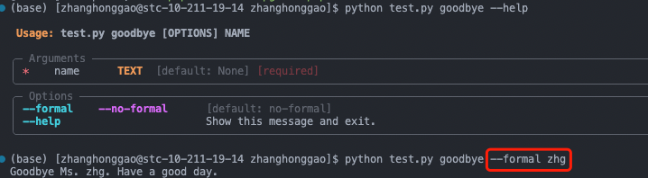

## 一，ProtoBuf 基础

在网络通信和通用数据交换等应用场景中经常使用的技术除了 `JSON` 和 `XML`，另外一个就是 `ProtoBuf`。protocol buffers （ProtoBuf）是一种语言无关、平台无关、可扩展的序列化结构数据的方法，它可用于（数据）通信协议、数据存储等。

我们可以通过 ProtoBuf 定义数据结构，然后通过 ProtoBuf 工具生成各种语言版本的数据结构类库，用于操作 ProtoBuf 协议数据。

### 1.1，ProtoBuf 例子

使用 gRPC 主要分为三步：

1. 编写 .proto pb 文件，制定通讯协议。
2. 利用对应插件将 .proto pb文件编译成对应语言的代码。
3. 根据生成的代码编写业务代码。

例子，文件名: `response.proto`。通过 ProtoBuf 语法定义数据结构(消息)，这些定义好的数据结构保存在 `.proto` 为后缀的文件中。

```protobuf
// 指定 protobuf 的版本，proto3 是最新的语法版本
syntax = "proto3";

// 定义数据结构，message 你可以想象成java的class，c语言中的struct
message Response {
  string data = 1;   // 定义一个string类型的字段，字段名字为data, 序号为1
  int32 status = 2;   // 定义一个int32类型的字段，字段名字为status, 序号为2
}
```

> 说明：我们通常将 protobuf 消息定义保存在 .proto 为后缀的文件中，字段后面的序号，不能重复，定义了就不能修改，可以理解成字段的唯一 ID。


**消息**（`message`），在 `protobuf` 中指的就是我们要定义的数据结构。在上面的例子中，我们定义了一个消息，名字为 `Response`，它有两个字段，一个是 `data`，一个是 `status`。`data` 字段的类型是 `string`，`status`` 字段的类型是 `int32`。

### 1.2，Protobuf 文件编译

从 .proto 文件生成了什么？

当用 protocol buffer 编译器来运行 .proto 文件时，编译器将生成所选择语言的代码，这些代码可以操作在 .proto 文件中定义的消息类型，包括获取、设置字段值，将消息序列化到一个输出流中，以及从一个输入流中解析消息。

对 Python 来说，Python 编译器为 .proto 文件中的每个消息类型生成一个含有**静态描述符**的模块，该模块与一个元类（`metaclass`）在运行时（`runtime`）被用来创建所需的 Python 数据访问类。


## 二，Python gRPC 基础

### 2.1，gRPC 定义

`gRPC` 是一种现代化开源的高性能 `RPC` 框架，能够运行于任意环境之中，最初由谷歌进行开发，它使用 `HTTP/2` 作为传输协议。

> RPC（Remote Procedure Call），即远程过程调用，主要是为了解决在分布式系统中，服务之间的调用问题。

`gRPC` 也是基于以下理念：**定义一个服务，指定其能够被远程调用的方法**（包含参数和返回类型），即在 `gRPC` 里，客户端可以像调用本地方法一样直接调用其他机器上的服务端应用程序的方法，帮助你更容易创建分布式应用程序和服务。
- 在服务端，实现这个接口并且运行 `gRPC` 服务器来处理客户端调用。
- 在客户端，有一个 `stub ` （存根）提供和服务端相同的方法。


### 2.2，gRPC 优点

使用 gRPC， 我们**可以一次性的在一个 `.proto` 文件中定义服务并使用任何支持它的语言去实现客户端和服务端**，反过来，它们可以应用在各种场景中，从 Google 的服务器到你自己的平板电脑——gRPC 帮你解决了不同语言及环境间通信的复杂性。使用 protocol buffers 还能获得其他好处，包括高效的序列化，简单的IDL以及容易进行接口更新。
> `gRPC` 默认使用的 `protocol buffers`，是 Google 开源的一种轻便高效的结构化数据存储格式，可以用于结构化数据串行化，或者说序列化。它很适合做**数据存储**或 **RPC 数据交换**格式。

总结就是，**使用 gRPC 能让我们更容易编写跨语言的分布式代码**。

### 2.3，gRPC 开发步骤

### 2.3.1，编写 .proto 文件定义服务（Defining the service）

像许多 RPC 系统一样，gRPC 基于定义服务的思想，指定可以通过参数和返回类型远程调用的方法。默认情况下，gRPC 使用 protocol buffers 作为接口定义语言(IDL)来描述服务接口和有效负载消息的结构。

`proto` 文件主要三要素：**服务、方法、消息**。下面使用 protocol buffers 定义了一个 RouteGuide 服务的例子。

1，服务：

```protobuf
// 定义服务
service RouteGuide {
   // (Method definitions not shown)
    ...
}
```

2，接下来，在服务定义内部定义 `rpc` **方法**，指定它们的请求和响应类型，所有这些方法都在 `RouteGuide` 服务中使用：

```protobuf
// 定义方法
// Accepts a stream of RouteNotes sent while a route is being traversed,
// while receiving other RouteNotes (e.g. from other users).
rpc RouteChat(stream RouteNote) returns (stream RouteNote) {}
```

3，`.proto` 文件还应包含服务方法中使用的所有请求和响应类型的协议缓冲**消息类型**定义，例如 `Point` 消息类型：

```protobuf
// 定义消息
// Points are represented as latitude-longitude pairs in the E7 representation
// (degrees multiplied by 10**7 and rounded to the nearest integer).
// Latitudes should be in the range +/- 90 degrees and longitude should be in
// the range +/- 180 degrees (inclusive).
message Point {
  int32 latitude = 1;
  int32 longitude = 2;
}
```

完整的 `route_guide.proto` 文件如下：

```protobuf
syntax = "proto3";

option java_multiple_files = true;
option java_package = "io.grpc.examples.routeguide";
option java_outer_classname = "RouteGuideProto";
option objc_class_prefix = "RTG";

package routeguide;

// Interface exported by the server.
service RouteGuide {
  // A simple RPC.
  //
  // Obtains the feature at a given position.
  //
  // A feature with an empty name is returned if there's no feature at the given
  // position.
  rpc GetFeature(Point) returns (Feature) {}

  // A server-to-client streaming RPC.
  //
  // Obtains the Features available within the given Rectangle.  Results are
  // streamed rather than returned at once (e.g. in a response message with a
  // repeated field), as the rectangle may cover a large area and contain a
  // huge number of features.
  rpc ListFeatures(Rectangle) returns (stream Feature) {}

  // A client-to-server streaming RPC.
  //
  // Accepts a stream of Points on a route being traversed, returning a
  // RouteSummary when traversal is completed.
  rpc RecordRoute(stream Point) returns (RouteSummary) {}

  // A Bidirectional streaming RPC.
  //
  // Accepts a stream of RouteNotes sent while a route is being traversed,
  // while receiving other RouteNotes (e.g. from other users).
  rpc RouteChat(stream RouteNote) returns (stream RouteNote) {}
}

// Points are represented as latitude-longitude pairs in the E7 representation
// (degrees multiplied by 10**7 and rounded to the nearest integer).
// Latitudes should be in the range +/- 90 degrees and longitude should be in
// the range +/- 180 degrees (inclusive).
message Point {
  int32 latitude = 1;
  int32 longitude = 2;
}

// A latitude-longitude rectangle, represented as two diagonally opposite
// points "lo" and "hi".
message Rectangle {
  // One corner of the rectangle.
  Point lo = 1;

  // The other corner of the rectangle.
  Point hi = 2;
}

// A feature names something at a given point.
//
// If a feature could not be named, the name is empty.
message Feature {
  // The name of the feature.
  string name = 1;

  // The point where the feature is detected.
  Point location = 2;
}

// A RouteNote is a message sent while at a given point.
message RouteNote {
  // The location from which the message is sent.
  Point location = 1;

  // The message to be sent.
  string message = 2;
}

// A RouteSummary is received in response to a RecordRoute rpc.
//
// It contains the number of individual points received, the number of
// detected features, and the total distance covered as the cumulative sum of
// the distance between each point.
message RouteSummary {
  // The number of points received.
  int32 point_count = 1;

  // The number of known features passed while traversing the route.
  int32 feature_count = 2;

  // The distance covered in metres.
  int32 distance = 3;

  // The duration of the traversal in seconds.
  int32 elapsed_time = 4;
}
```

值得注意的是， 在gRPC 中我们可以定义**四种**类型的服务方法。

1. **普通 rpc**: 客户端向服务器发送一个请求，然后得到一个响应，就像普通的函数调用一样。

```protobuf
rpc SayHello(HelloRequest) returns (HelloResponse);
```

2. **服务器流式 rpc**: 其中客户端向服务器发送请求，并获得一个流来读取一系列消息。客户端从返回的流中读取，直到没有更多的消息。gRPC 保证在单个 RPC 调用中的消息是有序的。

```protobuf
rpc LotsOfReplies(HelloRequest) returns (stream HelloResponse);
```

3. **客户端流式 rpc**: 其中客户端写入一系列消息并将其发送到服务器，同样使用提供的流。一旦客户端完成了消息的写入，它就等待服务器读取消息并返回响应。同样，gRPC 保证在单个 RPC 调用中对消息进行排序。
```protobuf
rpc LotsOfGreetings(stream HelloRequest) returns (HelloResponse);
```

4. **双向流式 rpc**: 其中双方使用读写流发送一系列消息。这两个流独立运行，因此客户端和服务器可以按照自己喜欢的顺序读写: 例如，服务器可以等待接收所有客户端消息后再写响应，或者可以交替读取消息然后写入消息，或者其他读写组合。每个流中的消息是有序的。

### 2.2，生成指定语言的代码-生成客户端和服务器代码（Generating client and server code）

前面那节内容，我们知道了如何在 `proto` 文件中**定义服务**，接下来我们需要使用 `gRPC` 的协议编译器 `protoc` 从 `.proto` 文件中**生成客户端和服务器代码**:

- 在服务器端，**服务器实现服务声明的方法**，并运行一个 gRPC 服务器来处理客户端发来的调用请求。gRPC 底层会对传入的请求进行解码，执行被调用的服务方法，并对服务响应进行编码。
- 在客户端，客户端有一个称为存根（`stub`）的本地对象，它实现了与服务相同的方法。然后，客户端可以在本地对象上调用这些方法，将调用的参数包装在适当的 protocol buffers 消息类型中——gRPC 在向服务器发送请求并返回服务器的 protocol buffers 响应之后进行处理。

```bash
# First, install the grpcio-tools package:
$ pip install grpcio-tools
# Use the following command to generate the Python code:
$ python -m grpc_tools.protoc -I../../protos --python_out=. --pyi_out=. --grpc_python_out=. ../../protos/route_guide.proto
```

**命令说明**：
- `-I`: proto 协议文件目录
- `--python_out` 和 `--grpc_python_out` 生成 python 代码的目录
- 命令最后面的参数是 `proto` 协议文件路径

命令执行后生成 route_guide_pb2.py 文件和 route_guide_pb2_grpc.py 文件。
- `route_guide_pb2.py`: 主要包含 proto 文件定义的消息类。
- `route_guide_pb2_grpc.py`: **包含服务端和客户端代码**，比如：
  - `RouteGuideStub`，客户端可以使用它调用 RouteGuide RPCs
  - `RouteGuideServicer`，定义 RouteGuide 服务的实现接口
  - `add_RouteGuideServicer_to_server`: 将 route_guide.proto 中定义的服务的函数 RouteGuideServicer 添加到 grpc.Server

### 2.3，编写业务逻辑代码-创建和实现服务端（Implementing the server）

**gRPC 帮我们解决了 RPC 中的服务调用、数据传输以及消息编解码，我们剩下的工作就是要编写业务逻辑代码**。

而创建和运行 RouteGuide 服务器可分为两个主要步骤：

1. 根据前面由 `proto` 服务定义生成的**服务程序接口**，开始编写实际可运行的服务接口代码，注意是包含执行服务的**实际**“工作”的函数。
2. 运行一个 `gRPC` 服务器，以侦听客户端的请求并传输响应。

可以在 grpc 的仓库的 [examples/python/route_guide/route_guide_server.py](https://github.com/grpc/grpc/tree/master/examples/python/route_guide) 中找到示例 `RouteGuide` 服务器代码。

route_guide_server.py 有一个 RouteGuideServicer 类，它是生成的类 route_guide_pb2_grpc.RouteGuideServicer 的子类：

```python
# RouteGuideServicer provides an implementation of the methods of the RouteGuide service.
class RouteGuideServicer(route_guide_pb2_grpc.RouteGuideServicer):
```


#### 2.3.1，响应流式 RPC（Response-streaming RPC）

```python
def ListFeatures(self, request, context):
    left = min(request.lo.longitude, request.hi.longitude)
    right = max(request.lo.longitude, request.hi.longitude)
    top = max(request.lo.latitude, request.hi.latitude)
    bottom = min(request.lo.latitude, request.hi.latitude)
    for feature in self.db:
        if (
            feature.location.longitude >= left
            and feature.location.longitude <= right
            and feature.location.latitude >= bottom
            and feature.location.latitude <= top
        ):
            yield feature
```

"ListFeatures" 方法是实现 Protocol Buffer 文件中定义的 "ListFeatures" 服务器到客户端流式 RPC 的方法。它接受一个类型为 "Rectangle" 的请求对象和一个上下文对象作为参数。它计算给定矩形的边界框，并迭代 RouteGuide 数据库中的特征。对于每个落在边界框内的特征，它将特征发送给客户端。

在这里，request.lo.longitude 和 request.hi.longitude 分别表示矩形的左下角和右上角的经度。因为经度越往左越小，所以这行代码使用 min() 函数来计算这两个经度值中的最小值，从而得到矩形的左边界。

#### 2.3.2，双向流式 RPC（Bidirectional streaming RPC）

```python
def RouteChat(self, request_iterator, context):
    prev_notes = []
    for new_note in request_iterator:
        for prev_note in prev_notes:
            if prev_note.location == new_note.location:
                yield prev_note
        prev_notes.append(new_note)
```

`RouteChat` 方法在 Protocol Buffer 文件中被定义为一个双向流式 `RPC`。它接受一个流式的请求对象 `RouteNote ` 和一个上下文对象作为参数，并返回一个流式的响应对象 `RouteNote`。

#### 2.3.3，启动服务器（Starting the server）

实现所有 `RouteGuide` 方法后，下一步是启动 `gRPC` 服务器，以便客户端可以实际使用您的服务：

```python
def serve():
    server = grpc.server(futures.ThreadPoolExecutor(max_workers=10))
    route_guide_pb2_grpc.add_RouteGuideServicer_to_server(
        RouteGuideServicer(), server
    )
    server.add_insecure_port("[::]:50051")
    server.start()
    server.wait_for_termination()
```

server.start() 方法是非阻塞的。它会创建一个新的线程来处理请求。调用 server.start() 的线程通常在此期间不需要做其他工作。在这种情况下，您可以调用 server.wait_for_termination() 方法，以清晰地阻塞调用线程，直到服务器终止。

### 2.4，创建和实现客户端（Creating the client）

要调用服务方法，我们首先需要创建一个**存根**（stub）。 我们实例化从 ``.proto`` 生成的 `route_guide_pb2_grpc` 模块中的 `RouteGuideStub` 类。

```python
channel = grpc.insecure_channel('localhost:50051')
stub = route_guide_pb2_grpc.RouteGuideStub(channel)
```

#### 2.4.1，调用服务方法

- 对于返回单个响应的 RPC 方法（“响应-单一”方法），gRPC Python 支持同步（阻塞）和异步（非阻塞）的控制流语义。
- 对于响应流式传输的 RPC 方法，调用会立即返回一个响应值的迭代器。对该迭代器调用 next() 方法会阻塞，直到从迭代器中产生的响应可用为止。

#### 2.4.2，简单 RPC

对于简单 RPC GetFeature 的同步调用几乎与调用本地方法一样简单。RPC 调用会等待服务器响应，然后将返回响应或引发异常：

```python
feature = stub.GetFeature(point)
```

### 2.4，运行客户端和服务器（Running the client and server）

```bash
# Run the server:
$ python route_guide_server.py
# From a different terminal, run the client:
$ python route_guide_client.py
```

## 三，python 协程

我们知道，函数（子程序）调用是通过**栈**实现的，子程序调用总是一个入口紧跟着一次返回，**调用顺序是明确的**。

而协程的调用和子程序不同，协程看上去也是子程序，但执行过程中，**在子程序内部可中断**，然后转而执行别的子程序，在**适当**的时候再返回来接着执行。注意，这里在一个子程序的内部中断，去执行其他子程序，不是函数调用，有点类似 CPU 的中断。
> 学习过单片机的应该能理解这里的中断的概念。

协程的特点在于是一个线程执行，和多线程比，最大的优势就是协程极高的执行效率。因为子程序切换不是线程切换， 而是由程序自身控制，因此，没有线程切换的开销，**和多线程比，线程数量越多，协程的性能优势就越明显**。

第二大优势就是不需要多线程的锁机制，因为只有一个线程，也不存在同时写变量冲突，在协程中控制共享资源不加锁，只需要判断状态就好了，所以执行效率比多线程高很多。

对于多核心 cpu，可以考虑使用多进程 + 协程的方式，充既充分利用多核，又充分发挥协程的高效率，可获得极高的性能。

### 3.1，python 协程实践

`asyncio` 是 Python 3.4 版本引入的标准库，直接内置了对异步 IO 的支持。

Python 对协程的支持是通过 generator 实现的。`yield from`（python3.5 版本之后是 `await`） 语法可以让我们方便地调用另一个 `generator`。

传统的生产者-消费者模型是一个线程写消息，一个线程取消息，通过 锁机制控制队列和等待，但一不小心就可能死锁。

如果改用协程，生产者生产消息后，直接通过 yield 跳转到消费者开始 执行，待消费者执行完毕后，切换回生产者继续生产，效率极高。

### 3.2，asyncio 库学习

`asyncio.run` 函数是 Python 3.7 版本引入的一个工具函数，用于运行一个异步函数并管理整个异步事件循环的生命周期。使用 asyncio.run 的典型场景是在脚本或应用程序的顶层部分运行一个异步函数，而不必手动管理事件循环的创建和关闭。

```python
import asyncio

async def my_async_function():
    print("Running async function")

# asyncio.run 负责创建事件循环、运行 my_async_function 函数，并在函数执行完成后关闭事件循环。
asyncio.run(my_async_function())
```

### 3.3，grpc.aio.server 和 grpc.server 函数的区别

grpc.aio.server 和 grpc.server 都是 gRPC Python 库提供的服务器创建函数，但它们在处理异步请求和同步请求方面有所不同。

1. `grpc.aio.server`：
  - grpc.aio.server 是基于 asyncio（异步 I/O）的 gRPC 服务器实现。
  - 支持异步请求处理，适用于异步 Python 代码。
  - 允许使用 async def 声明的异步处理函数。
  - 通常与 asyncio.run 一起使用。

2. `grpc.server`：
  - grpc.server 是传统的 gRPC 服务器实现，采用同步请求处理方式。
  - 使用标准的 gRPC 处理函数，不支持异步处理。
  - 适用于传统的同步 Python 代码

## 四，Typer 库基础

`Typer` 是一个用于构建 `CLI` 应用程序的库，它简化了 CLI 应用程序的创建和使用过程。它是基于 `Click` 库构建的，提供了更简单的 API。
> CLI 是 Command Line Interface 的缩写，中文翻译为命令行界面。它是一种通过纯文本命令进行交互的用户界面，用户通过键入命令来执行特定的操作。

安装方法：
```
pip install "typer[all]"
```

### 4.1，包含两个子命令的简单示例

以下是使用 `typer.Typer()` 创建一个带有**两个子命令**及其参数的 `CLI` 应用的基本示例：

```python
import typer

app = typer.Typer()

@app.command()
def hello(name: str):
    print(f"Hello {name}")

@app.command()
def goodbye(name: str, formal: bool = False):
    if formal:
        print(f"Goodbye Ms. {name}. Have a good day.")
    else:
        print(f"Bye {name}!")

if __name__ == "__main__":
    app()
```

程序运行结果：



## 参考资料

1. [ProtoBuf 快速入门教程](https://www.tizi365.com/archives/367.html)
2. [grpc-Basics tutorial](https://grpc.io/docs/languages/python/basics/#client)
3. [gRPC教程](https://www.liwenzhou.com/posts/Go/gRPC/)