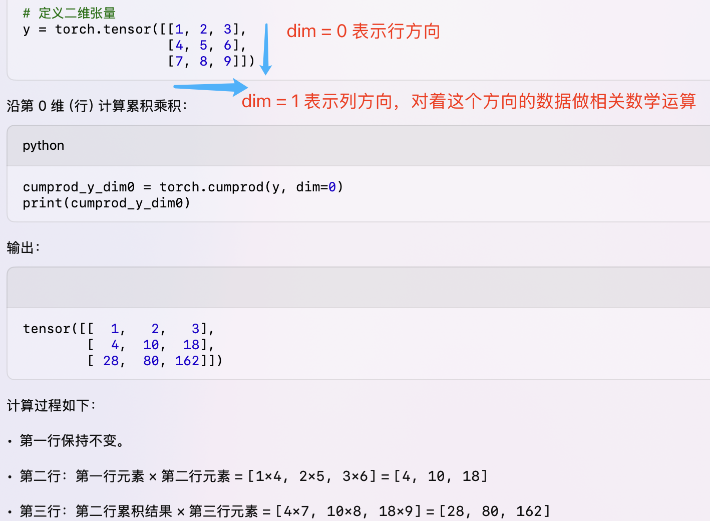

- [一 理解张量维度](#一-理解张量维度)
- [二 理解 dim 参数](#二-理解-dim-参数)
- [三 规约计算](#三-规约计算)

PyTorch 张量数学运算就是对张量的元素值完成数学运算，常用的张量数学运算包括：标量运算、向量运算、矩阵运算。

## 一 理解张量维度

在 PyTorch 中，张量的维度（或称为“秩”）决定了数据的结构和形状：

- 1D 张量：向量。例如，长度为 5 的向量 [1, 2, 3, 4, 5]。
- 2D 张量：矩阵。例如，形状为 (3, 4) 的矩阵。
- 3D 张量：通常用于 NLP，形状为 (batch_size, sequence_length, hidden_size)。
- 4D 张量：通常用于 CV，形状为 (batch_size, channels, height, width)。

在一个 $M$ 行 $N$ 列的二维数组中，$M$ 是第 0 维，即行数；$N$ 是第 1 维，即列数。那么怎么肉眼判断更复杂的张量数据维度呢，举例：

```python
import torch

# 示例张量
tensor = torch.tensor([[[0.6238, -0.9315, 0.2173, 0.1954, -1.1565],
                        [0.4559, 0.1531, 0.4178, 1.0225, 0.5923],
                        [0.0499, 0.4024, -1.2547, -0.5042, -0.0231],
                        [-1.1253, 0.3145, 0.8796, 0.4516, -0.0915]],

                       [[1.5794, -0.6367, -0.2559, 0.1237, -0.1951],
                        [0.1012, 0.0357, -0.5699, 1.0983, -0.2084],
                        [-0.7019, 0.5872, 0.7736, 0.7423, -0.7894],
                        [-0.3248, -0.5316, 1.2029, 0.2852, -0.4565]],

                       [[-0.0073, 1.4143, -0.1859, -0.7211, -0.8652],
                        [-0.3173, -0.4816, 0.1174, -0.1554, 0.9385],
                        [0.1283, -0.6547, 0.3687, -0.1948, 0.7754],
                        [-0.2185, -1.0437, 1.5963, -0.3284, -0.3654]]])
```
**判断规则**：方括号 `[` 的嵌套层数代表张量的维度。最外层括号的元素数量是第 0 维的大小，往内推。
以上述张量为例分析：
```python
tensor([[[ 0.6238, -0.9315,  0.2173,  0.1954, -1.1565], ... ]])
```
- 最外层 [ 里有 3 个子列表 -> 第 0 维大小为 3。
- 第二层 [ 里有 4 个子列表 -> 第 1 维大小为 4。
- 第三层 [ 里有 5 个元素 -> 第 2 维大小为 5。

因此，这个张量是 3 维张量，形状为 `[3, 4, 5]`。

## 二 理解 dim 参数

**`dim` 参数在 pytorch 数学函数中的定义一般指沿着 dim 这个维度进行操作**：求和/求平均/求累加，以及删除、增加指定 dim。如 x 的 shape 为 [2, 5, 3]，则：
- `dim = 0`，即沿着具有 2 个元素的那个维度/轴进行操作
- `dim = 1`，即沿着具有 5 个元素的那个维度/轴进行操作
- `dim = 2`，即沿着具有 3 个元素的那个维度/轴进行操作

再看具体示例：
```bash
>>> x = torch.randint(1, 10, [2,5,3], dtype=torch.float32)
>>> x
tensor([[[8., 1., 6.],
         [1., 5., 9.],
         [5., 7., 1.],
         [5., 1., 2.],
         [8., 4., 4.]],

        [[3., 3., 7.],
         [7., 4., 3.],
         [7., 7., 5.],
         [8., 3., 9.],
         [1., 1., 8.]]])
>>> x.shape
torch.Size([2, 5, 3])

# 如执行 y = torch.mean(x, dim = 0)，则 y[0,0] = (x[0, 0, 0] + x[1, 0, 0]) / 2 = (8. + 3.) / 2 = 5.5; y[2, 2] = (x[0, 2, 2] + x[1, 2, 2]) = (1. + 5.) / 2 = 3.0
>>> y = torch.mean(x, dim = 0)
>>> y
tensor([[5.5000, 2.0000, 6.5000],
        [4.0000, 4.5000, 6.0000],
        [6.0000, 7.0000, 3.0000],
        [6.5000, 2.0000, 5.5000],
        [4.5000, 2.5000, 6.0000]])

# 如执行 y = torch.mean(x, dim = 2)， 则 y[1, 4] = (x[1, 4, 0] + x[1, 4, 1] + x[1, 4, 2]) / 3
>>> y = torch.mean(x, dim = 2)
>>> y
tensor([[5.0000, 5.0000, 4.3333, 2.6667, 5.3333],
        [4.3333, 4.6667, 6.3333, 6.6667, 3.3333]])
```

## 三 规约计算

规约计算一般是指分组聚合计算，表现结果就是会进行维度压缩。

1，torch.mean 函数用于计算张量沿指定维度的平均值。其基本语法和参数解释如下：

```python
torch.mean(input, dim, keepdim=False, *, dtype=None) -> Tensor
```
- `input`：输入张量。
- `dim`：沿哪个维度计算平均值。可以是单个整数或整数元组。
- `keepdim`：是否保留被缩减的维度。默认为 False。
- `dtype`：输出张量的数据类型。

1. 从计算过程理解：**沿着（跨） dim 进行操作（算均值）**。
   - 常规矩阵操作的 2D 张量，dim = 0 表示跨行操作，即对每一列中的所有元素进行均值计算。
   - NLP 领域的 3D 张量 `(batch_size, sequence_length, embedding_size)`，`dim = 2` 表示跨嵌入层维度算均值，对于每个 (batch, sequence) 位置，计算嵌入维度上的均值，如创建一个形状为 (4, 16, 4) 的 3D 张量计算位置 (0, 0, \:) 的均值 $\text{mean}(x[0, 0:]) = \frac{x[0,0,0] + x[0,0,1] + x[0,0,2] + x[0,0,3]}{4}$。
   - CV 领域的 4D 张量 `(batch_size, channels, height, width)`，`dim = 0` 表示跨 batch_size 维度上计算均值，对一个批次中的所有样本进行平均。如创建一个形状为 (2, 3, 3, 3) 的 4D 张量，计算位置 (0, 0, 0) 的均值 = $\text{mean}(x[:, 0, 0, 0]) = \frac{x[0, 0, 0, 0] + x[1, 0, 0, 0]}{2}$。

2. 从输出张量的形状理解：
   - NLP 领域的 3D 张量，dim = 2，输出张量的形状去掉这个 dim 维度，得到输出张量形状为 `(batch_size, sequence_length)`。
   - CV 领域的 4D 张量，dim = 0，输出张量形状为 `(channels, height, width)`。

2，`torch.sum` 沿着指定维度求和。
```bash
>>> x = torch.randn([4,5])
>>> x
tensor([[ 1.1141,  1.7091, -0.5543,  0.3417, -0.0838],
        [-0.6697, -0.3165,  0.3772, -0.4377, -0.9850],
        [-1.3976,  1.3172, -0.6791,  0.1030, -0.5817],
        [ 0.3079, -0.5911,  1.2357, -1.0891,  0.8422]])
>>> x.sum(dim=0)
tensor([-0.6453,  2.1187,  0.3796, -1.0821, -0.8082])
>>> x.sum(dim=1)
tensor([ 2.5269, -2.0317, -1.2381,  0.7056])
```

当 dim = 0 时，就是沿着 `dim = 0`即 `x` 轴进行累加，sum 函数为规约函数会压缩维度，所以x.sum(dim=0) 结果为 tensor([-0.6453,  2.1187,  0.3796, -1.0821, -0.8082])，形状为 `[5]`。

3，`torch.max()` 用于获取张量的最大值，其有三种用法：

- 获取张量中的最大值。
- 沿指定维度获取最大值及其索引。
- 逐元素比较两个张量，返回最大值，用法等同 `torch.minimum()` 函数

这三种用法的各自语法如下:

```python
torch.max(input) -> Tensor
torch.max(input, dim, keepdim=False, *, out=None)
torch.min(input, other, *, out=None) -> Tensor # other 也是张量
```

- 第一种用法好理解，输入参数是一个多维张量，返回的结果是这个张量的**全局最大值**！
- 第二种情况是适用于我们需要特定维度的最大值，且返回结果包含两个数据：一个是最大值对应的位置索引，一个是最大值本身，这个函数是量化算法的核心操作之一！
- 第三种情况，用于对输入的两个张量 `input` 和 `other`中的每个元素进行比较，返回对应位置的最小值。

```python
>>> x = torch.randint(10, [2,5])
>>> x
tensor([[1, 6, 5, 7, 7],
        [5, 3, 2, 2, 6]])
>>> y = torch.randint(2, 12, [2,5])
>>> y
tensor([[ 8,  3,  8,  7,  4],
        [11,  6,  2,  5,  3]])
>>> torch.max(x, y)
tensor([[ 8,  6,  8,  7,  7],
        [11,  6,  2,  5,  6]])
>>> torch.max(x)
tensor(7)
>>> max_x = torch.max(x, dim=0)  # 返回张量 x 在 dim=0 维度的最大值及对应索引
>>> max_x
torch.return_types.max(
values=tensor([5, 6, 5, 7, 7]),
indices=tensor([1, 0, 0, 0, 0]))
>>> max_x[0]
tensor([5, 6, 5, 7, 7])
```

`torch.min` 函数和 `torch.max()` 意义相同，只不过返回的是最小值。

4，`torch.cumprod` 张量沿着指定 dim 维度计算累积乘积，其返回一个与 `input` 形状相同的张量，返回张量的每个元素是指定维度上该元素及其之前所有元素的乘积。函数定义(语法)如下:

```python
torch.cumprod(input, dim, *, dtype=None, out=None) -> Tensor
```

这个沿着 dim 方向计算累积的计算过程直观上不好理解，可以参考下述计算过程的可视化分解图来理解。

<div align="center">

</div>

多维张量的示例代码如下所示:

```python
import torch

# 创建一个 2D 张量
b = torch.tensor([[1, 2, 3], [4, 5, 6]])
print("原始张量：\n", b)

# 沿第 0 维计算累积乘积
cumprod_b_dim0 = torch.cumprod(b, dim=0)
print("沿第 0 维的累积乘积结果：\n", cumprod_b_dim0)

# 沿第 1 维计算累积乘积
cumprod_b_dim1 = torch.cumprod(b, dim=1)
print("沿第 1 维的累积乘积结果：\n", cumprod_b_dim1)
```

程序运行后输出结果如下:

```bash
原始张量：
 tensor([[1, 2, 3],
        [4, 5, 6]])
沿第 0 维的累积乘积结果：
 tensor([[ 1,  2,  3],
        [ 4, 10, 18]])
沿第 1 维的累积乘积结果：
 tensor([[  1,   2,   6],
        [  4,  20, 120]])
```

总结：上述 Tensor 数学计算函数的用法在返回张量形状变化的示例对比。

```bash
>>> x = torch.Tensor([ # shape is [2, 5]
...     [2,3,4,5,6],
...     [9,8,7,6,5,]
... ])

>>> print(torch.cumprod(x, dim = 0))
tensor([[ 2.,  3.,  4.,  5.,  6.],
        [18., 24., 28., 30., 30.]])

>>> print(torch.cumprod(x, dim = 1)) # output shape is [2, 5]
tensor([[2.0000e+00, 6.0000e+00, 2.4000e+01, 1.2000e+02, 7.2000e+02],
        [9.0000e+00, 7.2000e+01, 5.0400e+02, 3.0240e+03, 1.5120e+04]])

>>> torch.min(x, dim = 0) # output shape is [5]
torch.return_types.min(
values=tensor([2., 3., 4., 5., 5.]),
indices=tensor([0, 0, 0, 0, 1]))

>>> print(torch.max(x, dim = 1)) # output shape is [2]
torch.return_types.max(
values=tensor([6., 9.]),
indices=tensor([4, 0]))

>>> torch.mean(x, dim = 0, keepdim = True) # output shape is [1, 5]
tensor([[5.5000, 5.5000, 5.5000, 5.5000, 5.5000]]) 
```