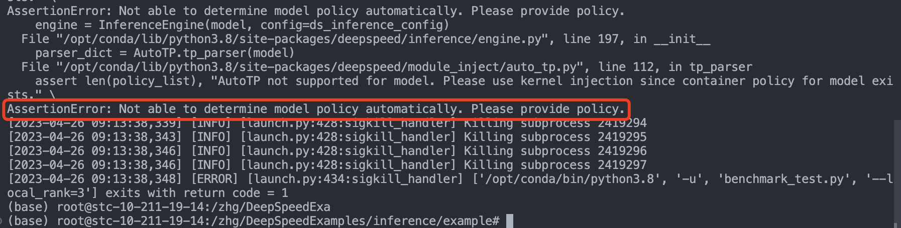
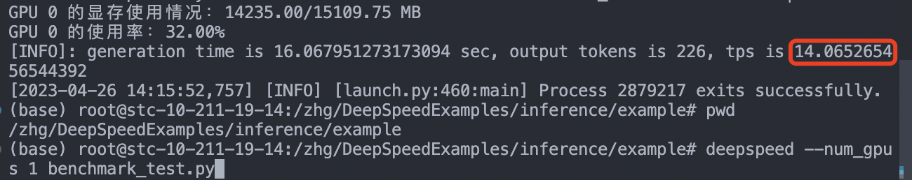
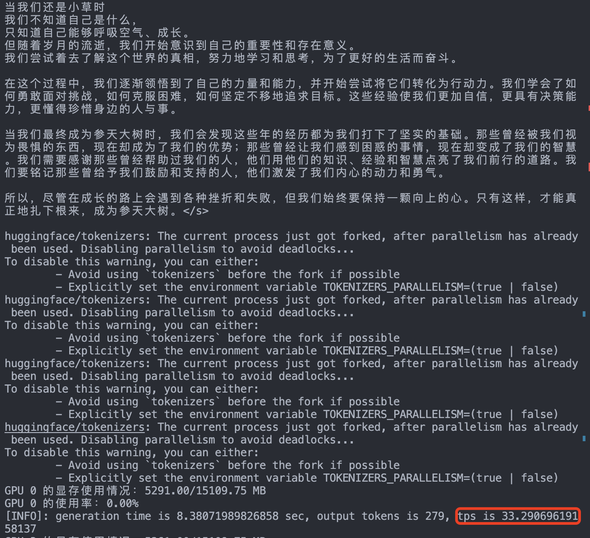
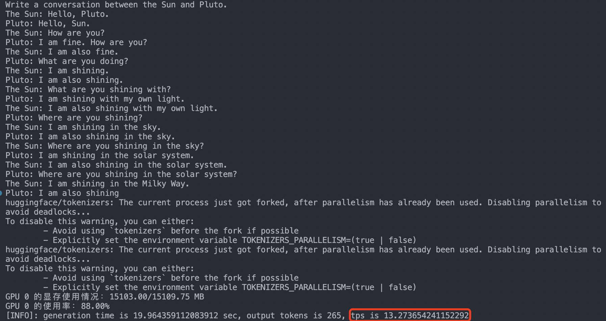
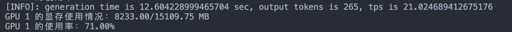
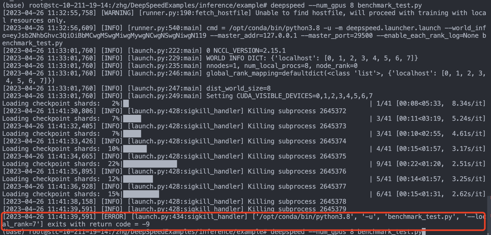
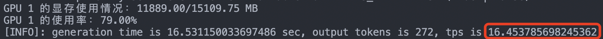
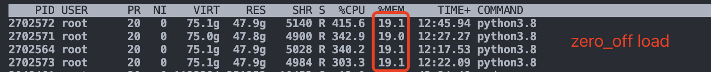

- [DeepSpeed 的自动张量并行](#deepspeed-的自动张量并行)
  - [deepspeed.init\_inference](#deepspeedinit_inference)
  - [DeepSpeedInferenceConfig](#deepspeedinferenceconfig)
- [DeepSpeed + LLM 在 T4 卡的性能测试](#deepspeed--llm-在-t4-卡的性能测试)
  - [BELLE-7B-2M](#belle-7b-2m)
  - [chatglm-6b](#chatglm-6b)
  - [llama-13b-hf](#llama-13b-hf)
  - [GPT-NeoXT-Chat-Base-20B](#gpt-neoxt-chat-base-20b)
- [DeepSpeed 框架](#deepspeed-框架)

## DeepSpeed 的自动张量并行

对于 HuggingFace 模型，如果未启用内核注入且未提供注入策略，则 DeepSpeed 框架则默认支持的自动张量并行。

### deepspeed.init_inference

- `mp_size`: 模型并行，所需的模型并行大小，默认为 1，表示没有模型并行度，**已弃用**，请使用 `tensor_parallel` 配置来控制模型并行度。
- `tensor_parallel.tp_size`: 张量并行，用于将模型拆分到多个 GPU 的张量并行配置。 
- 注意模型并行和张量并行意义是一样的，新版 deepspeed 框架弃用 `mp_size` 参数，改用了 `tensor_parallel.tp_size` 参数。

### DeepSpeedInferenceConfig

## DeepSpeed + LLM 在 T4 卡的性能测试

BELLE-7B-2M chatglm-6b chatglm-6b-int8 llama-13b-hf GPT-NeoXT-Chat-Base-20B ft-monochat

- 中文: 帮忙写一篇散文诗，主题为扎根，终有一天，我们会变成参天大树, 字数500字
- 英文: Write a conversation between the sun and pluto

|            模型名字            | Batch_size | 数据类型 |  显存占用  | GPU使用率 | 性能（tps, tokens per second） |
| :----------------------------: | :--------: | :------: | :--------: | :-------: | :----------------------------: |
|           chatglm-6b           |     1      |  `FP16`  |  13027MiB  |    82%    |              ～14              |
|        chatglm-6b+ TP=2        |     1      |  `FP16`  |  6789MiB   |    62%    |              ～17              |
|        chatglm-6b+ TP=4        |     1      |  `FP16`  |  4149MiB   |    64%    |              ～21              |
|        chatglm-6b-int8         |     1      |  `INT8`  |  7008MiB   |    89%    |              ～13              |
|          ft-monochat           |     1      |  `FP16`  |  12191MiB  |    80%    |              ～13              |
|        ft-monochat-int8        |     1      |  `FP16`  |  12191MiB  |    80%    |              ～12              |
|          BELLE-7B-2M           |     1      |  `FP16`  |  13933MiB  |    99%    |              ～18              |
|       BELLE-7B-2M + TP=2       |     1      |  `FP16`  |  8129MiB   |    96%    |              ～28              |
|       BELLE-7B-2M + TP=4       |     1      |  `FP16`  |  5261MiB   |    96%    |              ～33              |
| GPT-NeoXT-Chat-Base-20B + TP=4 |     1      |  `FP16`  |  11880MiB  |    97%    |              ～17              |
|      llama-13b-hf + TP=2       |     1      |  `FP16`  |  15103MiB  |    97%    |              ～13              |
|      llama-13b-hf + TP=4       |     1      |  `FP16`  | 8193.00MiB |    97%    |              ～21              |

**备注：**

- accelerate + llama-13b-hf + parallel=4：将模型参数的拆分到各个 gpu 卡上轮流计算，非真正并行，只是为了解决 T4 卡显存不够的问题。
- 这里生成的 tokens 是去除了输入 tokens。tps 的计算方式是：tps = tokens / time，其中 time 是生成 tokens 所花费的时间，单位是秒，结果数向下取整
- GPT-NeoXT-Chat-Base-20B（200亿参数）模型在单和两卡上都无法运行，需要 4 卡以上才能运行；llama-13b-hf（130亿参数）模型在单卡上无法运行，需要 2 卡以上才能运行。
- BELLE-7B-2M 模型推理：tp = 1 时，设置推理参数 replace_with_kernel_inject 从 True 改为 False，tps 从 14 提升到 18；tp=2 时，tps 从 22 提升到 28。
- transformer 库的 bloom 模型本身已经支持了张量并行方法。

|                模型名字                | Batch_size | 数据类型 | 显存占用 | GPU使用率 | 性能（tps, tokens per second） |
| :------------------------------------: | :--------: | :------: | :------: | :-------: | :----------------------------: |
| accelerate + llama-13b-hf + parallel=4 |     1      |  `FP16`  | 12259MiB |    20%    |              ～6               |
| accelerate + llama-13b-hf + parallel=4 |     1      |  `FP16`  |   7GB    |    16%    |              ～4               |
|              llama-13b-hf              |     1      |  `INT8`  | 13919MiB |    80%    |              ～5               |

### BELLE-7B-2M  

replace_with_kernel_inject 参数等于 False 和 True 的性能对比：

`tp = 4` 时， `belle-7b` 模型的性能评测结果：

### chatglm-6b

**模型概述**：

ChatGLM-6B 是一个开源的、支持中英双语的对话语言模型，基于 General Language Model (GLM) 架构，具有 62 亿参数。结合模型量化技术，用户可以在消费级的显卡上进行本地部署（INT4 量化级别下最低只需 6GB 显存）。 ChatGLM-6B 使用了和 ChatGPT 相似的技术，针对中文问答和对话进行了优化。经过约 `1T` 标识符的中英双语训练，辅以监督微调、反馈自助、人类反馈强化学习等技术的加持，`62` 亿参数的 `ChatGLM-6B` 已经能生成相当符合人类偏好的回答，更多信息请参考官方[博客](https://chatglm.cn/blog)。

**推理经验汇总**

- `GPT-NeoXT-Chat-Base-20B` 模型的推理，其 DeepSpeedInferenceConfig 的 `replace_with_kernel_inject` 参数必须设置为 `True`，否则会报错: "mat1 and mat2 shapes cannot be multiplied"。
- `chatglm-6b` 自带的量化接口只是提供了**权重量化**接口功能，所以作用只是降低了对 `GPU` 显存的要求，其模型推理速度不会变好，可能变差。
- 使用 `chatglm-6b` 模型自带的量化接口 `.quantize(8)` 量化模型，推理速度会变慢（实测下降 `2.3` 倍），但如果直接加载官方提供好的 `chatglm-6b-int8` 模型，推理速度不会变慢，但也没有加速效果。 
- 支持的模型权重类型: `torch.half`, `torch.int8`, `torch.float`。
  - torch.half 等同于 torch.float16，是半精度浮点数（FP16），使用 16 位来表示浮点数。
  - torch.float 等同于 `torch.float32`，是单精度浮点数（FP32），使用 32 位。

### llama-13b-hf

性能测试结果截图:

### GPT-NeoXT-Chat-Base-20B

GPT-NeoXT-Chat-Base-20B 是 GPT-NeoX 的 20B 参数变体，在对话数据集上进行了微调。作者在 Huggingface 上发布了此模型的预训练权重: [togethercomputer/GPT-NeoXT-Chat-Base-20B](https://huggingface.co/togethercomputer/GPT-NeoXT-Chat-Base-20B)。
> GPT-NeoX-20B 模型是由 Eleuther AI 团队发布的 GPT 模型变体结构。

## DeepSpeed 框架

