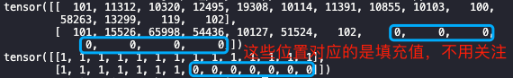
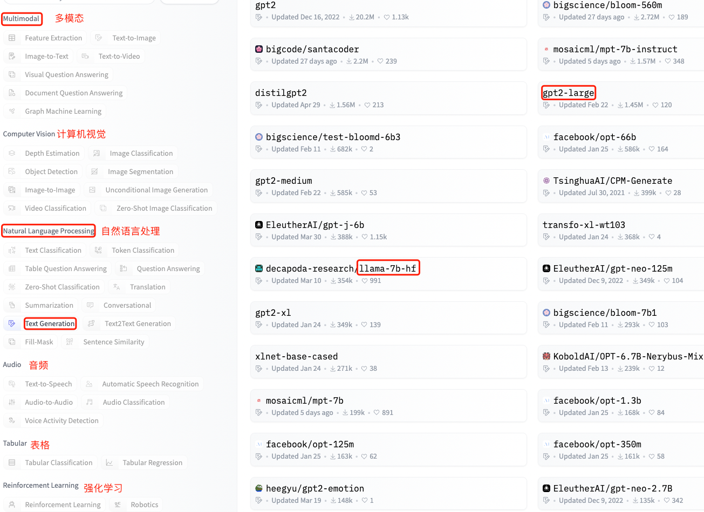

- [一，Transformers 术语](#一transformers-术语)
  - [1.1，token、tokenization 和 tokenizer](#11tokentokenization-和-tokenizer)
  - [1.2，input IDs](#12input-ids)
  - [1.3，attention mask](#13attention-mask)
  - [1.4，decoder models](#14decoder-models)
  - [1.5，架构与参数](#15架构与参数)
- [二，Transformers 功能](#二transformers-功能)
  - [API 概述](#api-概述)
- [三，快速上手](#三快速上手)
  - [3.1，transformer 模型类别](#31transformer-模型类别)
  - [3.2，Pipeline](#32pipeline)
  - [3.3，AutoClass](#33autoclass)
    - [3.3.1，AutoTokenizer](#331autotokenizer)
  - [3.3.2，AutoModel](#332automodel)
- [参考链接](#参考链接)

## 一，Transformers 术语

### 1.1，token、tokenization 和 tokenizer

`token` 可以理解为最小语义单元，翻译的话可以是词元、令牌、词，也可以是 word/char/subword，单理解就是单词和标点。

`tokenization` 是指**分词**过程，目的是将输入序列划分成一个个词元（`token`），保证各个词元拥有相对完整和独立的语义，以供后续任务（比如学习 embedding 或作为 LLM 的输入）使用。

在 transformers 库中，`tokenizer` 就是实现 `tokenization` 的对象，每个 tokenizer 会有不同的 vocabulary。在代码中，tokenizer 用以将输入文本序列划分成 tokenizer vocabulary 中可用的 `tokens`。

举两个 tokenization 例子：

- “VRAM” 通常不在词汇表中，所以其通常会被划分成 “V”, “RA” and “M” 这样的 `tokens`。
- 我是中国人->['我', '是', '中国人']

### 1.2，input IDs

`LLM` 唯一必须的输入是 `input ids`，本质是 `tokens` 索引（token indices in tokenizer vocabulary），即数字 ID 数组，从而符合模型输入的要求。

- 将输入文本序列转换成 tokens，即 tokenized 过程；
- 将输入文本序列转换成 input ids，即输入编码过程，数值对应的是 tokenizer 词汇表中的索引，

Transformer 库实现了不同模型的 tokenizer。下面代码展示了将输入序列转换成 tokens 和 input_ids 的结果。

```python
from transformers import BertTokenizer

sequence = "A Titan RTX has 24GB of VRAM"
tokenizer = BertTokenizer.from_pretrained("bert-base-multilingual-cased") 

tokenized_sequence = tokenizer.tokenize(sequence) # 将输入序列转换成tokens，tokenized 过程
inputs = tokenizer(sequence) # 将输入序列转化成符合模型输入要求的 input_ids，编码过程
encoded_sequence = inputs["input_ids"]

print(tokenized_sequence)
print(encoded_sequence)
print("[INFO]: length of tokenized_sequence and encoded_sequence:", len(tokenized_sequence), len(encoded_sequence))

"""
['A', 'Titan', 'RT', '##X', 'has', '24', '##GB', 'of', 'VR', '##AM']
[101, 138, 28318, 56898, 12674, 10393, 10233, 32469, 10108, 74727, 36535, 102]
[INFO]: length of tokenized_sequence and encoded_sequence: 10 12
"""
```

值得注意的是，调用 tokenizer() 函数返回的是字典对象，包含相应模型正常工作所需的所有参数，token indices 在键 `input_ids` 对应的键值中。同时，**tokenizer 会自动填充 "special tokens"**（如果相关模型依赖它们），这也是 tokenized_sequence 和 encoded_sequence 列表中长度不一致的原因。

```python
decoded_sequence = tokenizer.decode(encoded_sequence)
print(decoded_sequence)
"""
[CLS] A Titan RTX has 24GB of VRAM [SEP]
"""
```

### 1.3，attention mask

注意掩码（`attention mask`）是一个可选参数，一般在将输入序列进行**批处理**时使用。作用是告诉我们哪些 `tokens` 应该被关注，哪些不用。因为如果输入的序列是一个列表，每个序列长度是不一样的，通常是通过填充的方式把他们处理成同一长度。原始 token id 是我们需要关注的，填充的 id 是不用关注的。

attention mask 是二进制张量类型，值为 `1` 的位置索引对应的原始 `token` 表示应该注意的值，而 `0` 表示填充值。

示例代码如下：

```python
from transformers import AutoTokenizer

sentence_list = ["We are very happy to show you the 🤗 Transformers library.",
            "Deepspeed is faster"]
model_name = "nlptown/bert-base-multilingual-uncased-sentiment"
tokenizer = AutoTokenizer.from_pretrained(model_name)

padded_sequences = tokenizer(sentence_list, padding=True, return_tensors="pt")

print(padded_sequences["input_ids"])
print(padded_sequences["attention_mask"])

"""
tensor([[101, 11312, 10320, 12495, 19308, 10114, 11391, 10855, 10103, 100, 58263, 13299, 119, 102],
        [101, 15526, 65998, 54436, 10127, 51524, 102, 0, 0, 0, 0, 0, 0, 0]])
tensor([[1, 1, 1, 1, 1, 1, 1, 1, 1, 1, 1, 1, 1, 1],
        [1, 1, 1, 1, 1, 1, 1, 0, 0, 0, 0, 0, 0, 0]])
"""
```



### 1.4，decoder models

decoder 模型也称为自回归（auto-regressive）模型、causal language models，其按顺序阅读输入文本并必须预测下一个单词，在训练中会阅读**添加掩码的句子**。

### 1.5，架构与参数

- **架构**：模型的骨架，包含每个层的类别及定义、各个层的连接方式等等内容。
- **Checkpoints**：给定架构中会被加载的权重。
- **模型**：一个笼统的术语，没有“架构”或“参数”那么精确：它可以指两者。

## 二，Transformers 功能

[Transformers](https://github.com/huggingface/transformers) 库提供创建 transformer 模型和加载使用共享模型的功能；另外，[模型中心（hub）](https://huggingface.co/models)包含数千个可以任意下载和使用的预训练模型，也支持用户上传模型到 Hub。

### API 概述

 Transformers 库的 `API` 主要包括以下三种：

1. **MAIN CLASSES**：主要包括配置(configuration)、模型(model)、分词器(tokenizer)和流水线(pipeline)这几个最重要的类。
2. **MODELS**：库中和每个模型实现有关的类和函数。
3. **INTERNAL HELPERS**：内部使用的工具类和函数。

## 三，快速上手

### 3.1，transformer 模型类别

Transformer 模型架构主要由两个部件组成：

- **Encoder (左侧)**: 编码器接收输入并构建其表示（其特征）。这意味着对模型进行了优化，以从输入中获得理解。
- **Decoder (右侧)**: 解码器使用编码器的表示（特征）以及其他输入来生成目标序列。这意味着该模型已针对生成输出进行了优化。


上述两个部件中的每一个都可以作为模型架构独立使用，具体取决于任务：

- **Encoder-only models**: 也叫自动编码 Transformer 模型，如 BERT-like 系列模型，适用于需要理解输入的任务。如句子分类和命名实体识别。
- **Decoder-only models**: 也叫自回归 Transformer 模型，如 GPT-like 系列模型。适用于生成任务，如**文本生成**。
- **Encoder-decoder models** 或者 **sequence-to-sequence models**: 也被称作序列到序列的 Transformer 模型，如 BART/T5-like 系列模型。适用于需要根据输入进行生成的任务，如翻译或摘要。

下表总结了目前的 transformers 架构模型类别、示例以及适用任务：

| 模型          | 示例                                       | 任务                                     |
| ------------- | ------------------------------------------ | ---------------------------------------- |
| 编码器        | ALBERT, BERT, DistilBERT, ELECTRA, RoBERTa | 句子分类、命名实体识别、从文本中提取答案 |
| 解码器        | CTRL, GPT, GPT-2, Transformer XL           | 文本生成                                 |
| 编码器-解码器 | BART, T5, Marian, mBART                    | 文本摘要、翻译、生成问题的回答           |

### 3.2，Pipeline

Transformers 库支持通过 pipeline() 函数设置 `task` 任务类型参数，来跑通不同模型的推理，可实现一行代码跑通跨不同模态的多种任务，其支持的任务列表如下：

| **任务**     | **描述**                                                 | **模态**        | **Pipeline**                                  |
| ------------ | -------------------------------------------------------- | --------------- | --------------------------------------------- |
| 文本分类     | 为给定的文本序列分配一个标签                             | NLP             | pipeline(task="sentiment-analysis")           |
| 文本生成     | 根据给定的提示生成文本                                   | NLP             | pipeline(task="text-generation")              |
| 命名实体识别 | 为序列里的每个token分配一个标签(人, 组织, 地址等等)      | NLP             | pipeline(task="ner")                          |
| 问答系统     | 通过给定的上下文和问题, 在文本中提取答案                 | NLP             | pipeline(task="question-answering")           |
| 掩盖填充     | 预测出正确的在序列中被掩盖的token                        | NLP             | pipeline(task="fill-mask")                    |
| 文本摘要     | 为文本序列或文档生成总结                                 | NLP             | pipeline(task="summarization")                |
| 文本翻译     | 将文本从一种语言翻译为另一种语言                         | NLP             | pipeline(task="translation")                  |
| 图像分类     | 为图像分配一个标签                                       | Computer vision | pipeline(task="image-classification")         |
| 图像分割     | 为图像中每个独立的像素分配标签(支持语义、全景和实例分割) | Computer vision | pipeline(task="image-segmentation")           |
| 目标检测     | 预测图像中目标对象的边界框和类别                         | Computer vision | pipeline(task="object-detection")             |
| 音频分类     | 给音频文件分配一个标签                                   | Audio           | pipeline(task="audio-classification")         |
| 自动语音识别 | 将音频文件中的语音提取为文本                             | Audio           | pipeline(task="automatic-speech-recognition") |
| 视觉问答     | 给定一个图像和一个问题，正确地回答有关图像的问题         | Multimodal      | pipeline(task="vqa")                          |




以下代码是通过 pipeline 函数实现对文本的情绪分类。

```python
from transformers import pipeline

classifier = pipeline("sentiment-analysis")
print(classifier("I've been waiting for a HuggingFace course my whole life."))
# [{'label': 'POSITIVE', 'score': 0.9598049521446228}]
```

在 `NLP` 问题中，除了使用 `pipeline()`  任务中默认的模型，也可以通过指定 `model` 和 `tokenizer` 参数来自动查找相关模型。

### 3.3，AutoClass

Pipeline() 函数背后实际是通过 “AutoClass” 类，实现**通过预训练模型的名称或路径自动查找其架构**的快捷方式。通过为任务选择合适的 `AutoClass` 和它关联的预处理类，来重现使用 `pipeline()` 的结果。

#### 3.3.1，AutoTokenizer

分词器（`tokenizer`）的作用是负责预处理文本，将输入文本（input prompt）转换为**数字数组**（array of numbers）来作为模型的输入。`tokenization` 过程主要的规则包括：如何拆分单词和什么样级别的单词应该被拆分。值得注意的是，实例化 tokenizer 和 model 必须是同一个模型名称或者 `checkpoints` 路径。

对于 `LLM` ，通常还是使用 `AutoModel` 和 `AutoTokenizer` 来加载预训练模型和它关联的分词器。

```py
from transformers import AutoModel, AutoTokenizer
tokenizer = LlamaTokenizer.from_pretrained(model_name_or_path)
model = AutoModel.from_pretrained(model_name_or_path, torch_dtype=torch.float16)
```

一般使用 `AutoTokenizer` 加载分词器（`tokenizer`）:

```python
from transformers import AutoTokenizer

model_name = "nlptown/bert-base-multilingual-uncased-sentiment"
tokenizer = AutoTokenizer.from_pretrained(model_name)

encoding = tokenizer("We are very happy to show you the 🤗 Transformers library.")
print(encoding)

"""
{'input_ids': [101, 11312, 10320, 12495, 19308, 10114, 11391, 10855, 10103, 100, 58263, 13299, 119, 102], 
'token_type_ids': [0, 0, 0, 0, 0, 0, 0, 0, 0, 0, 0, 0, 0, 0], 
'attention_mask': [1, 1, 1, 1, 1, 1, 1, 1, 1, 1, 1, 1, 1, 1]}
"""
```

`tokenizer` 的返回是包含了如下“键”的字典：

- [input_ids](https://huggingface.co/docs/transformers/v4.29.1/zh/glossary#input-ids): 用数字表示的 `token`。
- [attention_mask](https://huggingface.co/docs/transformers/v4.29.1/zh/.glossary#attention-mask): 应该关注哪些 `token` 的指示。

tokenizer() 函数还**支持列表作为输入，并可填充和截断文本, 返回具有统一长度的批次**：

```python
pt_batch = tokenizer(
    ["We are very happy to show you the 🤗 Transformers library.", "We hope you don't hate it."],
    padding=True,
    truncation=True,
    max_length=512,
    return_tensors="pt",
)
```

### 3.3.2，AutoModel

Transformers 提供了一种简单统一的方式来加载预训练的模型实例，即可以像加载 `AutoTokenizer` 一样加载 `AutoModel`，我们所需要提供的必须参数只有模型名称或者 `checkpoints` 路径。示例代码如下所示:

```python
from transformers import AutoTokenizer, AutoModelForSequenceClassification
from torch import nn

model_name = "nlptown/bert-base-multilingual-uncased-sentiment"
tokenizer = AutoTokenizer.from_pretrained(model_name) # 会下载 vocab.txt 词表

pt_batch = tokenizer(
    ["We are very happy to show you the 🤗 Transformers library.", "We hope you don't hate it."],
    padding=True,
    truncation=True,
    max_length=512,
    return_tensors="pt",
)

pt_model = AutoModelForSequenceClassification.from_pretrained(model_name) # 会下载 pytorch_model.bin 模型权重

pt_outputs = pt_model(**pt_batch) # ** 可解包 pt_batch 字典
pt_predictions = nn.functional.softmax(pt_outputs.logits, dim=-1) # 在 logits上应用softmax函数来查询概率

print(pt_predictions)
print(pt_model.config.id2label) # {0: '1 star', 1: '2 stars', 2: '3 stars', 3: '4 stars', 4: '5 stars'}
```

程序运行结果输出如下所示。

> tensor([[0.0021, 0.0018, 0.0115, 0.2121, 0.7725],
>         [0.2084, 0.1826, 0.1969, 0.1755, 0.2365]], grad_fn=<SoftmaxBackward0>)

## 参考链接

1. [HuggingFace Transformers 官方文档](https://huggingface.co/docs/transformers/v4.29.1/zh/quicktour)
2. [NLP Course](https://huggingface.co/learn/nlp-course/zh-CN/chapter1/1)
3. [NLP领域中的token和tokenization到底指的是什么](https://www.zhihu.com/question/64984731)
