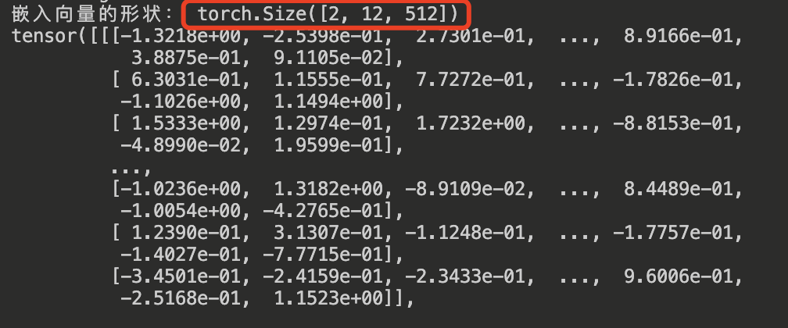

## 一，模型输入预处理

LLM 唯一必须的输入是 `input ids`，本质是 `tokens` 索引（Indices of input sequence tokens in the vocabulary），即**整数向量**。

`Transformer` 架构的 LLM 模型的输入通常都是字符串文本，而模型是不能直接处理字符串文本数据，需要通过 `tokenizer` 完成预处理工作，包含 tokenized 分词过程和词元编码过程，最后**转成 input ids 向量**（矩阵），`id` 数值对应的是 `tokenizer` 词汇表中的索引。

这里以 Hugging Face 的 transformers 库为例，展示如何将输入文本处理为 Transformer 模型能够理解的 `input ids` 形式。

```python
from transformers import BertTokenizer, BertModel
import torch

# 1. 加载 BERT 的 tokenizer 和模型
tokenizer = BertTokenizer.from_pretrained('bert-base-uncased')
model = BertModel.from_pretrained('bert-base-uncased')

# 2. 输入的文本
text = "A Titan RTX has 24GB of VRAM"

# 3. 将文本分词并映射到 ID 序列, 会自动加入特殊符号 [CLS] 和 [SEP]
inputs = tokenizer(text, return_tensors="pt", truncation=True, padding=True)

# 输出 ID 序列
print("Token IDs:", inputs['input_ids'])

# 4. 传递给模型，得到输出
outputs = model(**inputs)

# 5. 输出 hidden states（隐藏层状态）
last_hidden_states = outputs.last_hidden_state
print("Last hidden states shape:", last_hidden_states.shape)
```

原始输入文本 `"A Titan RTX has 24GB of VRAM"` 通过 `tokenizer` 完成**分词和词表映射工作**，生成的**输入 ID 列表**：`[101, 138, 28318, 56898, 12674, 10393, 10233, 32469, 10108, 74727, 36535, 102]`。

## Embedding 层

`Embedding` 层，中文叫嵌入层，**作用是将 `input ids` 整数序列映射到高维的密集向量**（embedding vectors），通常使用 `nn.Embedding` 实现，。

`nn.Embedding` 的输入输出形式:
- 输入：一个整数张量，表示词表索引（即每个 token 在词表中的位置）。输入形状: `(batch_size, sequence_length)`，其中 batch_size 表示批次中的样本数，sequence_length 表示每个输入序列的长度。
- 输出：每个词对应的嵌入向量，维度是可配置的（比如 100 维或 300 维）。输出的形状:`(batch_size, sequence_length, embedding_dim)`。`embedding_dim` 隐藏层大小，也是 $d_{model}$ 或者 $h$，

示例代码:

```python
from transformers import BertTokenizer
import torch.nn as nn

## 1, 使用 BERT tokenizer 将批量输入的字符串文本序列转化为 input_ids
tokenizer = BertTokenizer.from_pretrained("bert-base-multilingual-cased") 
batch_text = ["A Titan RTX has 24GB of VRAM", "I have a dog and cat"]
inputs = tokenizer(batch_text, return_tensors="pt", truncation=True, padding=True)
input_ids = inputs["input_ids"]

# 2. 创建一个 nn.Embedding 层
vocab_size = tokenizer.vocab_size  # 词表大小取决于你加载的具体 tokenizer 模型
embedding_dim = 512  # 嵌入向量的维度，参考 transformer 论文的大小
embedding_layer = nn.Embedding(vocab_size, embedding_dim)

# 3. 通过 nn.Embedding 层，将输入的 IDs 映射到嵌入向量
embedded_output = embedding_layer(input_ids)

# 4. 输出嵌入向量的形状
print("嵌入向量的形状：", embedded_output.shape)  # (batch_size, sequence_length, embedding_dim), torch.Size([2, 12, 512])

# 5. 打印嵌入向量
print(embedded_output)
```

程序运行后输出结果如下所示:

