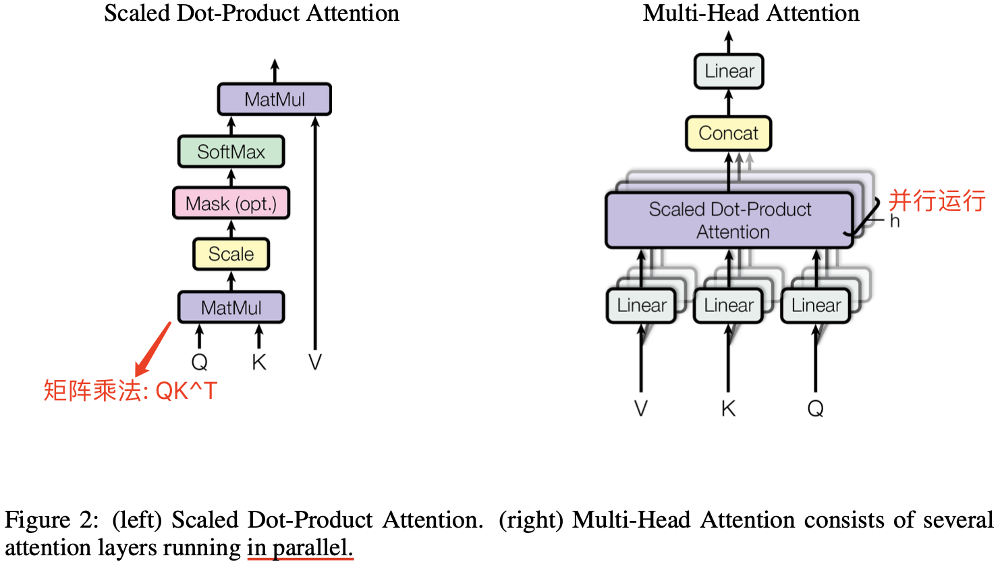
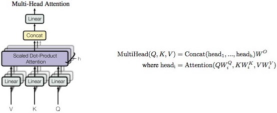
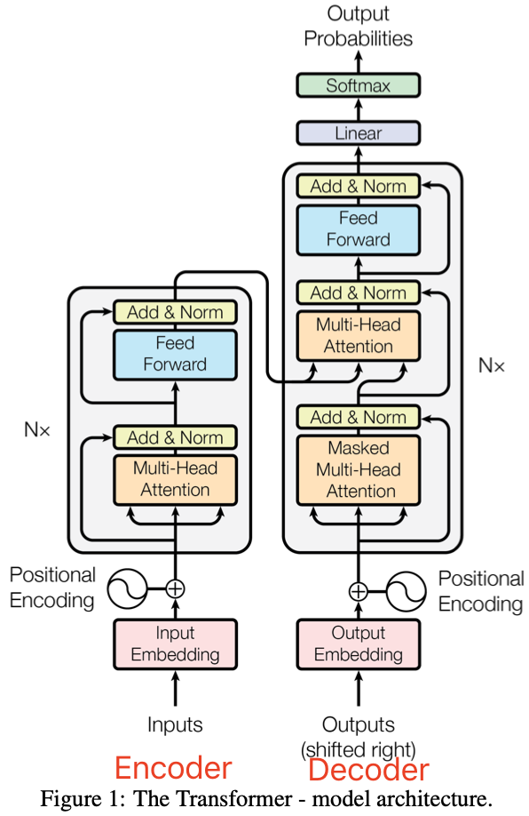
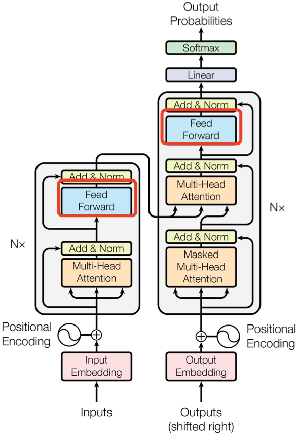
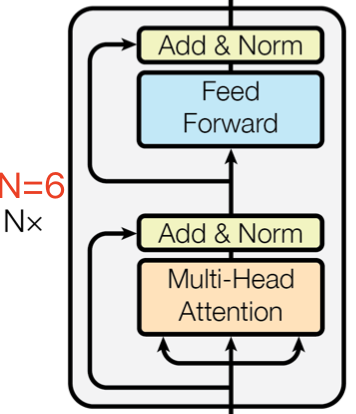
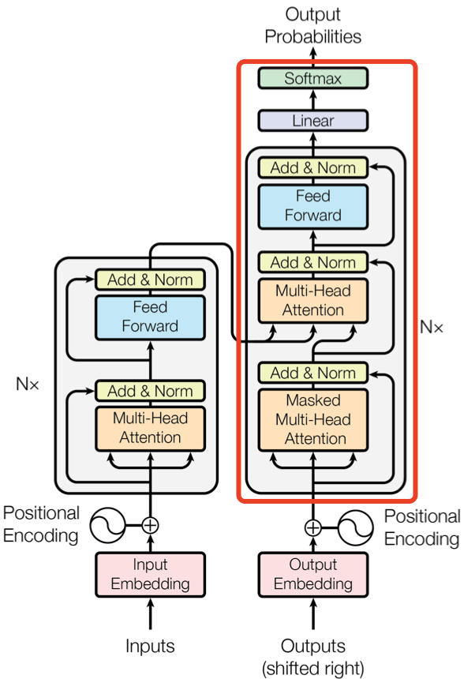

- [背景知识](#背景知识)
  - [Word Embedding Vector](#word-embedding-vector)
  - [nn.Linear](#nnlinear)
- [一，Transformer 输入](#一transformer-输入)
  - [1.1，单词 Embedding](#11单词-embedding)
  - [1.2，位置 Embedding](#12位置-embedding)
  - [1.1，TransformerEmbedding 层实现](#11transformerembedding-层实现)
- [二，Transformer 整体结构](#二transformer-整体结构)
- [三，Multi-Head Attention 结构](#三multi-head-attention-结构)
  - [3.1，Self-Attention 结构](#31self-attention-结构)
  - [3.2，Self-Attention 实现](#32self-attention-实现)
  - [3.3，Multi-Head Attention](#33multi-head-attention)
  - [3.4，Multi-Head Attention 实现](#34multi-head-attention-实现)
- [四，Encoder 结构](#四encoder-结构)
  - [4.1，Add \& Norm](#41add--norm)
  - [4.2，Feed Forward](#42feed-forward)
  - [4.3，Encoder 结构的实现](#43encoder-结构的实现)
- [五，Decoder 结构](#五decoder-结构)
- [六，Transformer 总结](#六transformer-总结)
  - [6.1，Transformer 完整代码实现](#61transformer-完整代码实现)
- [参考资料](#参考资料)

## 背景知识

### Word Embedding Vector

`Word Embedding Vector` 是将单词映射到向量空间的一种方式，它可以**将单词的语义信息转化为向量形式**，并且可以在向量空间中计算单词之间的相似性，简单理解就是，将单词从原始文本格式转换为神经网络可以理解和处理的数字格式的一种方式。在深度学习中，我们通常使用 Word2Vec、GloVe 或 FastText 等算法来生成单词的嵌入向量。

下面是一个简单的 Python 示例，用于使用 PyTorch 生成单词的嵌入向量：

```python
import torch
import torch.nn as nn
from torchtext.vocab import Vocab

from collections import Counter

text = "hello world hello" # 假设我们有一个文本
counter = Counter(text.split()) # 统计每个单词的出现次数
vocab = Vocab(counter) # 创建词汇表

# 构建嵌入层
vocab_size = 1000
embedding_dim = 100
embedding_layer = nn.Embedding(vocab_size, embedding_dim)

# 假设我们有一个输入单词列表，每个单词都是从词汇表中随机选择的
input_words = ["hello", "world", "this", "is", "a", "test"]

# 将单词转换为索引列表
word_indexes = [vocab.index(word) for word in input_words]

# 将索引列表转换为PyTorch张量
word_indexes_tensor = torch.LongTensor(word_indexes)

# 将索引列表输入嵌入层以获取嵌入向量
word_embeddings = embedding_layer(word_indexes_tensor)

# 输出嵌入向量
print(word_embeddings)
```

1.  首先通过 `Vocab` 和输入文本字符串创建词汇表 `vocab`，并通过 `nn.Embedding` 创建了一个大小为 $1000\times 100$ 的嵌入层 `embedding_layer`，表示**词汇表 **中有 `1000` 个单词，每个单词用一个 `100` 维的向量表示。
2. 然后，我们创建一个输入单词列表 input_words，并将每个单词转换为词汇表中对应的索引，和将索引列表转换为 PyTorch 张量。
3. 最后将张量 `word_indexes_tensor` 输入到嵌入层中，以获取每个单词的 100 维嵌入向量。

值得注意的是，嵌入向量的大小和维度通常需要根据任务进行调整。通常，词汇表越大，嵌入向量的维度就越高。此外，**嵌入向量的大小通常需要与模型中的其他参数相匹配，例如隐藏层的大小和注意力头的数量**。

### nn.Linear

在 PyTorch 中，`nn.Linear` 是一个模块，它实现了一个全连接层，它将输入张量的每个元素都乘以一个可学习的权重矩阵，并加上一个可学习的偏置向量，最后输出一个新的张量。全连接层的数学表达式为：
$$
\text{output} = \text{input} \times \text{weight}^\text{T} + \text{bias} \nonumber
$$
`nn.Linear` 的构造函数如下：

```python
nn.Linear(in_features: int, out_features: int, bias: bool = True)
```

各参数解释如下：

- `in_features` 表示输入张量的特征数，也就是输入张量的最后一维的大小，
- `out_features` 表示输出张量的特征数，也就是输出张量的最后一维的大小，
- `bias` 是一个布尔值，表示是否添加偏置向量。如果 `bias` 为 `False`，则不会添加偏置向量。

下面是一个示例代码，可直接运行，其创建了一个输入张量，并通过 层进行维度的线性变换。

```python
import torch.nn as nn
import torch
import time

# 创建一个输入张量
input_tensor = torch.randn(10, 20)

# 创建一个 Linear 层对象，将输入维度从 20 变换到 30
linear_layer = nn.Linear(20, 30)

# 将输入张量传递给 Linear 层进行变换
start_time = time.time()
output_tensor = linear_layer(input_tensor)
end_time = time.time()

# 打印输出张量的形状
print(f"Output shape: {output_tensor.shape}") # Output shape: torch.Size([10, 30])
print(f"Time taken: {end_time - start_time:.6f} seconds") # Time taken: 0.002543 seconds
```

## 一，Transformer 输入

Transformer 中单词的输入表示 **x** 由**单词 Embedding** 和**位置 Embedding** （Positional Encoding）相加得到，通常定义为 TransformerEmbedding 层，其代码实现如下所示:

### 1.1，单词 Embedding

单词的 Embedding 有很多种方式可以获取，例如可以采用 Word2Vec、Glove 等算法预训练得到，也可以在 Transformer 中训练得到。

### 1.2，位置 Embedding

Transformer 中除了单词的 Embedding，还需要使用位置 Embedding 表示单词出现在句子中的位置。因为 Transformer 不采用 RNN 的结构，而是使用全局信息，不能利用单词的顺序信息，而这部分信息对于 NLP 来说非常重要。所以 Transformer 中使用位置 Embedding 保存单词在序列中的相对或绝对位置。

位置 Embedding 用 PE 表示，PE 的维度与单词 Embedding 是一样的。PE 可以通过训练得到，也可以使用某种公式计算得到。在 Transformer 中采用了后者，计算公式如下：

$$
PE_{(pos, 2i)} = sin(pos/10000^{2i/d_{model}}) \\
PE_{(pos, 2i+1)} = cos(pos/10000^{2i/d_{model}})
$$

其中，pos 表示单词在句子中的位置，d 表示 PE的维度 (与词 Embedding 一样)，2i 表示偶数的维度，2i+1 表示奇数维度 (即 2i≤d, 2i+1≤d)。

### 1.1，TransformerEmbedding 层实现

```python
class PositionalEncoding(nn.Module):
    """
    compute sinusoid encoding.
    """
    def __init__(self, d_model, max_len, device):
        """
        constructor of sinusoid encoding class

        :param d_model: dimension of model
        :param max_len: max sequence length
        :param device: hardware device setting
        """
        super(PositionalEncoding, self).__init__()

        # same size with input matrix (for adding with input matrix)
        self.encoding = torch.zeros(max_len, d_model, device=device)
        self.encoding.requires_grad = False  # we don't need to compute gradient

        pos = torch.arange(0, max_len, device=device)
        pos = pos.float().unsqueeze(dim=1)
        # 1D => 2D unsqueeze to represent word's position

        _2i = torch.arange(0, d_model, step=2, device=device).float()
        # 'i' means index of d_model (e.g. embedding size = 50, 'i' = [0,50])
        # "step=2" means 'i' multiplied with two (same with 2 * i)

        self.encoding[:, 0::2] = torch.sin(pos / (10000 ** (_2i / d_model)))
        self.encoding[:, 1::2] = torch.cos(pos / (10000 ** (_2i / d_model)))
        # compute positional encoding to consider positional information of words

    def forward(self, x):
        # self.encoding
        # [max_len = 512, d_model = 512]

        batch_size, seq_len = x.size()
        # [batch_size = 128, seq_len = 30]

        return self.encoding[:seq_len, :]
        # [seq_len = 30, d_model = 512]
        # it will add with tok_emb : [128, 30, 512]         

class TokenEmbedding(nn.Embedding):
    """
    Token Embedding using torch.nn
    they will dense representation of word using weighted matrix
    """

    def __init__(self, vocab_size, d_model):
        """
        class for token embedding that included positional information
        :param vocab_size: size of vocabulary
        :param d_model: dimensions of model
        """
        super(TokenEmbedding, self).__init__(vocab_size, d_model, padding_idx=1)

class TransformerEmbedding(nn.Module):
    """
    token embedding + positional encoding (sinusoid)
    positional encoding can give positional information to network
    """

    def __init__(self, vocab_size, max_len, d_model, drop_prob, device):
        """
        class for word embedding that included positional information
        :param vocab_size: size of vocabulary
        :param d_model: dimensions of model
        """
        super(TransformerEmbedding, self).__init__()
        self.tok_emb = TokenEmbedding(vocab_size, d_model)
        self.pos_emb = PositionalEncoding(d_model, max_len, device)
        self.drop_out = nn.Dropout(p=drop_prob)

    def forward(self, x):
        tok_emb = self.tok_emb(x)
        pos_emb = self.pos_emb(x)
        return self.drop_out(tok_emb + pos_emb)
```

## 二，Transformer 整体结构

论文中给出用于中英文翻译任务的 `Transformer` 整体架构如下图所示：


可以看出 Transformer 架构**由 Encoder 和 Decoder 两个部分组成**：其中 Encoder 和 Decoder 都是由 N=6 个相同的层堆叠而成。**Multi-Head Attention** 结构是 Transformer 架构的核心结构，其由多个 **Self-Attention** 组成的。

Transformer 架构更详细的可视化图如下所示:


## 三，Multi-Head Attention 结构

Encoder 和 Decoder 结构中公共的 `layer` 之一是 `Multi-Head Attention`，其是由多个 `Self-Attention` 并行组成的。Encoder block 只包含一个 Multi-Head Attention，而 Decoder block 包含两个 Multi-Head Attention (其中有一个用到 Masked)。



### 3.1，Self-Attention 结构

`Self-Attention` 中文翻译为**自注意力机制**，论文中叫作 `Scale Dot Product Attention`，它是 Transformer 架构的核心，其结构如下图所示：


那么重点来了，第一个问题：Self-Attention 结构的最初输入 **Q(查询), K(键值), V(值)** 这三个矩阵怎么理解呢？其代表什么，通过什么计算而来？

在 Self-Attention 中，Q、K、V 是在**同一个输入（比如序列中的一个单词）上计算得到的三个向量**。具体来说，我们可以通过对原始输入**词的 embedding** 进行线性变换（比如使用一个全连接层），来得到 Q、K、V。这三个向量的维度通常都是一样的，取决于模型设计时的决策。

第二个问题：Self-Attention 结构怎么理解，Q、K、V的作用是什么？这三个矩阵又怎么计算得到最后的输出？

在计算 Self-Attention 时，Q、K、V 被用来**计算注意力分数**，即用于表示**当前位置和其他位置之间的关系**。注意力分数可以通过 Q 和 K 的点积来计算，然后将分数除以 `8`，再经过一个 softmax 归一化处理，得到每个位置的权重。然后用这些权重来加权计算 V 的加权和，即得到当前位置的输出。

> 将分数除以 8 的操作，对应图中的 `Scale` 层，这个参数 8 是 K 向量维度 64 的平方根结果。

### 3.2，Self-Attention 实现

> 文章的 Self-Attention  层和论文中的 ScaleDotProductAttention 层意义是一样的。

输入序列单词的 Embedding Vector 经过**线性变换**（`Linear` 层）得到 Q、K、V 三个向量，并将它们作为 Self-Attention 层的输入。假设输入序列的长度为 seq_len，则 Q、K 和 V 的形状为（seq_len，d_k），其中，$\text{d}_{\text{k}}$ 表示每个词或向量的维度，也是 $Q$、$K$ 矩阵的列数。在论文中，**输入给 Self-Attention 层的 Q、K、V 的向量维度是 64**， Embedding Vector 和 Encoder-Decoder 模块输入输出的维度都是 512。

> Embedding Vector 的大小是我们可以设置的超参数—基本上它就是我们训练数据集中最长句子的长度。

Self-Attention  层的计算过程用数学公式可表达为:
$$
\text{Attention}(Q, K, V) = \text{softmax} (\frac{QK^T}{\sqrt{d_k}})V \nonumber
$$
以下是一个示例代码，它创建了一个 ScaleDotProductAttention 层，并将 Q、K、V 三个张量传递给它进行计算：

```python
class ScaleDotProductAttention(nn.Module):
    def __init__(self, ):
        super(ScaleDotProductAttention, self).__init__()
        self.softmax = nn.Softmax(dim = -1)

    def forward(self, Q, K, V, mask=None):
        K_T = K.transpose(-1, -2) # 计算矩阵 K 的转置  
        d_k = Q.size(-1)
        # 1, 计算 Q, K^T 矩阵的点积，再除以 sqrt(d_k) 得到注意力分数矩阵
        scores = torch.matmul(Q, K_T) / math.sqrt(d_k)
        # 2, 如果有掩码，则将注意力分数矩阵中对应掩码位置的值设为负无穷大
        if mask is not None:
            scores = scores.masked_fill(mask == 0, -1e9)
        # 3, 对注意力分数矩阵按照最后一个维度进行 softmax 操作，得到注意力权重矩阵，值范围为 [0, 1]
        attn_weights = self.softmax(scores)
        # 4, 将注意力权重矩阵乘以 V，得到最终的输出矩阵
        output = torch.matmul(attn_weights, V)

        return output, attn_weights

# 创建 Q、K、V 三个张量
Q = torch.randn(5, 10, 64)  # (batch_size, sequence_length, d_k)
K = torch.randn(5, 10, 64)  # (batch_size, sequence_length, d_k)
V = torch.randn(5, 10, 64)  # (batch_size, sequence_length, d_k)

# 创建 ScaleDotProductAttention 层
attention = ScaleDotProductAttention()

# 将 Q、K、V 三个张量传递给 ScaleDotProductAttention 层进行计算
output, attn_weights = attention(Q, K, V)

# 打印输出矩阵和注意力权重矩阵的形状
print(f"ScaleDotProductAttention output shape: {output.shape}") # torch.Size([5, 10, 64])
print(f"attn_weights shape: {attn_weights.shape}") # torch.Size([5, 10, 10])
```

### 3.3，Multi-Head Attention

Multi-Head Attention (`MHA`) 是基于 Self-Attention (`SA`) 的一种变体。MHA 在 SA 的基础上引入了**“多头”机制**，将输入拆分为多个子空间，每个子空间分别执行 `SA`，最后将多个子空间的输出拼接在一起并进行线性变换，从而得到最终的输出。

对于 `MHA`，之所以需要对 Q、K、V 进行多头（`head`）划分，其目的是为了增强模型对不同信息的关注。具体来说，多组 Q、K、V 分别计算 Self-Attention，每个头自然就会有独立的 Q、K、V 参数，从而让模型同时关注多个不同的信息，这有些类似 `CNN` 架构模型的**多通道机制**。

下图是论文中 Multi-Head Attention 的结构图。



从图中可以看出， `MHA` 结构的计算过程可总结为下述步骤:

1. 将输入 Q、K、V 张量进行线性变换（`Linear` 层），输出张量尺寸为 [batch_size, seq_len, d_model]；
2. 将前面步骤输出的张量，按照头的数量（`n_head`）拆分为 `n_head` 子张量，其尺寸为 [batch_size, n_head, seq_len, d_model//n_head]；
3. 每个子张量并行**计算注意力分数**，即执行 dot-product attention 层，输出张量尺寸为 [batch_size, n_head, seq_len, d_model//n_head]；
4. 将这些子张量进行拼接 `concat` ，并经过线性变换得到最终的输出张量，尺寸为 [batch_size, seq_len, d_model]。

总结：因为 `GPU` 的并行计算特性，步骤2中的**张量拆分**和步骤4中的**张量拼接**，其实都是通过 `review` 算子来实现的。同时，也能发现`SA` 和 `MHA` 模块的输入输出矩阵维度都是一样的。

### 3.4，Multi-Head Attention 实现

Multi-Head Attention 层的输入同样也是三个张量：**查询（Query）、键（Key）和值（Value）**，其计算过程用数学公式可表达为:
$$
\text{MultiHead(Q, K, V )} = \text{Concat}(\text{head}_{1}, ..., \text{head}_{\text{h}})W^O \\
 \text{where head}_{\text{i}} = \text{Attention}(QW_i^Q , KW_i^K , VW_i^V )
$$
一般用 `d_model` 表示输入**嵌入向量**的维度， `n_head` 表示分割成多少个头，因此，`d_model//n_head` 自然表示每个头的输入和输出维度，在论文中 d_model = 512，n_head = 8，d_model//n_head = 64。值得注意的是，由于每个头的维数减少，总计算成本与具有全维的单头注意力是相似的。

Multi-Head Attention 层的 `Pytorch` 实现代码如下所示：

```python
class MultiHeadAttention(nn.Module):
    """Multi-Head Attention Layer
    Args:
        d_model: Dimensions of the input embedding vector, equal to input and output dimensions of each head
        n_head: number of heads, which is also the number of parallel attention layers
    """
    def __init__(self, d_model, n_head):
        super(MultiHeadAttention, self).__init__()
        self.n_head = n_head
        self.attention = ScaleDotProductAttention()
        self.w_q = nn.Linear(d_model, d_model)  # Q 线性变换层
        self.w_k = nn.Linear(d_model, d_model)  # K 线性变换层
        self.w_v = nn.Linear(d_model, d_model)  # V 线性变换层
        self.fc = nn.Linear(d_model, d_model)   # 输出线性变换层
        
    def forward(self, q, k, v, mask=None):
        # 1. dot product with weight matrices
        q, k, v = self.w_q(q), self.w_k(k), self.w_v(v) # size is [batch_size, seq_len, d_model]
        # 2, split by number of heads(n_head) # size is [batch_size, n_head, seq_len, d_model//n_head]
        q, k, v = self.split(q), self.split(k), self.split(v)
        # 3, compute attention
        sa_output, attn_weights = self.attention(q, k, v, mask)
        # 4, concat attention and linear transformation
        concat_tensor = self.concat(sa_output)
        mha_output = self.fc(concat_tensor)
        
        return mha_output
    
    def split(self, tensor):
        """
        split tensor by number of head(n_head)

        :param tensor: [batch_size, seq_len, d_model]
        :return: [batch_size, n_head, seq_len, d_model//n_head], 输出矩阵是四维的，第二个维度是 head 维度
        
        # 将 Q、K、V 通过 reshape 函数拆分为 n_head 个头
        batch_size, seq_len, _ = q.shape
        q = q.reshape(batch_size, seq_len, n_head, d_model // n_head)
        k = k.reshape(batch_size, seq_len, n_head, d_model // n_head)
        v = v.reshape(batch_size, seq_len, n_head, d_model // n_head)
        """
        
        batch_size, seq_len, d_model = tensor.size()
        d_tensor = d_model // self.n_head
        split_tensor = tensor.view(batch_size, seq_len, self.n_head, d_tensor).transpose(1, 2)
        # it is similar with group convolution (split by number of heads)
        
        return split_tensor
    
    def concat(self, sa_output):
        """ merge multiple heads back together

        Args:
            sa_output: [batch_size, n_head, seq_len, d_tensor]
            return: [batch_size, seq_len, d_model]
        """
        batch_size, n_head, seq_len, d_tensor = sa_output.size()
        d_model = n_head * d_tensor
        concat_tensor = sa_output.transpose(1, 2).contiguous().view(batch_size, seq_len, d_model)
        
        return concat_tensor
```

## 四，Encoder 结构

Encoder 结构由 $\text{N} = 6$ 个相同的 encoder block 堆叠而成，每一层（ layer）主要有两个子层（sub-layers）: 第一个子层是多头注意力机制（`Multi-Head Attention`），第二个是简单的位置全连接前馈网络（`Positionwise Feed Forward`）。



上图红色框框出的部分是 Encoder block，很明显其是 Multi-Head Attention、Add&Norm、Feed Forward、Add & Norm 层组成的。另外在论文中 Encoder 组件由 $\text{N} = 6$ 个相同的 encoder block 堆叠而成，且 encoder block 输入矩阵和输出矩阵维度是一样的。

### 4.1，Add & Norm

`Add & Norm` 层由 Add 和 Norm 两部分组成。这里的 Add 指 X + MultiHeadAttention(X)，是一种残差连接。Norm 是 Layer Normalization。Add & Norm 层计算过程用数学公式可表达为:
$$
\text{Layer Norm}(X + \text{MultiHeadAttention}(X)) \nonumber
$$
Add 比较简单，这里重点讲下 Layer Norm 层。Layer Norm 是一种常用的神经网络归一化技术，可以使得模型训练更加稳定，收敛更快。它的主要作用是对每个样本**在特征维度上进行归一化**，减少了不同特征之间的依赖关系，提高了模型的泛化能力。Layer Norm 层的计算可视化如下图所示:


Layer Norm 层的 Pytorch 实现代码如下所示:

```python
class LayerNorm(nn.Module):
    def __init__(self, d_model, eps=1e-12):
        super(LayerNorm, self).__init__()
        self.gamma = nn.Parameter(torch.ones(d_model))
        self.beta = nn.Parameter(torch.zeros(d_model))
        self.eps = eps
    
    def forward(self, x):
        mean = x.mean(-1, keepdim=True) # '-1' means last dimension. 
        var = x.var(-1, keepdim=True)
        
        out = (x - mean) / torch.sqrt(var + self.eps)
        out = self.gamma * out + self.beta
        
        return out

# NLP Example
batch, sentence_length, embedding_dim = 20, 5, 10
embedding = torch.randn(batch, sentence_length, embedding_dim)

# 1，Activate nn.LayerNorm module
layer_norm1 = nn.LayerNorm(embedding_dim)
pytorch_ln_out = layer_norm1(embedding)

# 2，Activate my nn.LayerNorm module
layer_norm2 = LayerNorm(embedding_dim)
my_ln_out = layer_norm2(embedding)

# 比较结果
print(torch.allclose(pytorch_ln_out, my_ln_out, rtol=0.1,atol=0.01))  # 输出 True
```

### 4.2，Feed Forward



Feed Forward 层全称是 Position-wise Feed-Forward Networks，其本质是一个**两层的全连接层**，第一层的激活函数为 Relu，第二层不使用激活函数，计算过程用数学公式可表达为：
$$
\text{FFN}(X) = \text{max}(0, XW_1 + b_1 )W_2 + b_2 \nonumber
$$
除了使用两个全连接层来完成线性变换，另外一种方式是使用 kernal_size = 1 的两个 $1\times 1$ 卷积层，输入输出维度不变，都是 512，中间维度是 2048。

PositionwiseFeedForward 层的 Pytorch 实现代码如下所示:

```python
class PositionwiseFeedForward(nn.Module):
    def __init__(self, d_model, d_diff, drop_prob=0.1):
        super(PositionwiseFeedForward, self).__init__()
        self.fc1 = nn.Linear(d_model, d_diff)
        self.fc2 = nn.Linear(d_diff, d_model)
        self.relu = nn.ReLU()
        self.dropout = nn.Dropout(drop_prob)
    
    def forward(self, x):
        x = self.fc1(x)
        x = self.relu(x)
        x = self.dropout(x)
        x = self.fc2(x)
        
        return x
```

### 4.3，Encoder 结构的实现

基于前面 Multi-Head Attention, Feed Forward, Add & Norm 的内容我们可以完整的实现 Encoder 结构。



Encoder 组件的 Pytorch 实现代码如下所示:

```python
class EncoderLayer(nn.Module):
    def __init__(self, d_model, ffn_hidden, n_head, drop_prob=0.1):
        super(EncoderLayer, self).__init__()
        self.mha = MultiHeadAttention(d_model, n_head)
        self.ffn = PositionwiseFeedForward(d_model, ffn_hidden)
        self.ln1 = LayerNorm(d_model)
        self.ln2 = LayerNorm(d_model)
        self.dropout1 = nn.Dropout(drop_prob)
        self.dropout2 = nn.Dropout(drop_prob)
    
    def forward(self, x, mask=None):
        x_residual1 = x
        
        # 1, compute multi-head attention
        x = self.mha(q=x, k=x, v=x, mask=mask)
        
        # 2, add residual connection and apply layer norm
        x = self.ln1( x_residual1 + self.dropout1(x) )
        x_residual2 = x
        
        # 3, compute position-wise feed forward
        x = self.ffn(x)
        
        # 4, add residual connection and apply layer norm
        x = self.ln2( x_residual2 + self.dropout2(x) )
        
        return x

class Encoder(nn.Module):
    def __init__(self, enc_voc_size, seq_len, d_model, ffn_hidden, n_head, n_layers, drop_prob=0.1, device='cpu'):
        super().__init__()
        self.emb = TransformerEmbedding(vocab_size = enc_voc_size,
                                        max_len = seq_len,
                                        d_model = d_model,
                                        drop_prob = drop_prob,
                                        device=device)
        self.layers = nn.ModuleList([EncoderLayer(d_model, ffn_hidden, n_head, drop_prob) 
                                     for _ in range(n_layers)])
    
    def forward(self, x, mask=None):
        
        x = self.emb(x)
        
        for layer in self.layers:
            x = layer(x, mask)
        return x
```

## 五，Decoder 结构



上图右边红框框出来的是 Decoder block，Decoder 组件也是由 $\text{N} = 6$ 个相同的 Decoder block 堆叠而成，与 Encoder block 相似，但是存在一些区别：

- 包含两个 Multi-Head Attention 层。
- 第一个 Multi-Head Attention 层采用了 Masked 操作。
- 第二个 Multi-Head Attention 层的 **K, V** 矩阵使用 Encoder 的**编码信息矩阵 C** 进行计算，而 **Q ** 使用上一个 Decoder block 的输出计算。这样做的好处是在 Decoder 的时候，每一位单词都可以利用到 Encoder 所有单词的信息 (这些信息无需 **Mask**)

另外，Decoder 组件后面还会接一个全连接层和 Softmax 层计算下一个翻译单词的概率。

Decoder 组件的代码实现如下所示:

```python
class DecoderLayer(nn.Module):

    def __init__(self, d_model, ffn_hidden, n_head, drop_prob):
        super(DecoderLayer, self).__init__()
        self.mha1 = MultiHeadAttention(d_model, n_head)
        self.ln1 = LayerNorm(d_model)
        self.dropout1 = nn.Dropout(p=drop_prob)
        
        self.mha2 = MultiHeadAttention(d_model, n_head)
        self.ln2 = LayerNorm(d_model)
        self.dropout2 = nn.Dropout(p=drop_prob)
        
        self.ffn = PositionwiseFeedForward(d_model, ffn_hidden)
        self.ln3 = LayerNorm(d_model)
        self.dropout3 = nn.Dropout(p=drop_prob)
    
    def forward(self, dec_out, enc_out, trg_mask, src_mask):
        x_residual1 = dec_out
        
        # 1, compute multi-head attention
        x = self.mha1(q=dec_out, k=dec_out, v=dec_out, mask=trg_mask)
        
        # 2, add residual connection and apply layer norm
        x = self.ln1( x_residual1 + self.dropout1(x) )
        
        if enc_out is not None:
            # 3, compute encoder - decoder attention
            x_residual2 = x
            x = self.mha2(q=x, k=enc_out, v=enc_out, mask=src_mask)
    
            # 4, add residual connection and apply layer norm
            x = self.ln2( x_residual2 + self.dropout2(x) )
        
        # 5. positionwise feed forward network
        x_residual3 = x
        x = self.ffn(x)
        # 6, add residual connection and apply layer norm
        x = self.ln3( x_residual3 + self.dropout3(x) )
        
        return x
    
class Decoder(nn.Module):
    def __init__(self, dec_voc_size, max_len, d_model, ffn_hidden, n_head, n_layers, drop_prob, device):
        super().__init__()
        self.emb = TransformerEmbedding(d_model=d_model,
                                        drop_prob=drop_prob,
                                        max_len=max_len,
                                        vocab_size=dec_voc_size,
                                        device=device)

        self.layers = nn.ModuleList([DecoderLayer(d_model=d_model,
                                                  ffn_hidden=ffn_hidden,
                                                  n_head=n_head,
                                                  drop_prob=drop_prob)
                                     for _ in range(n_layers)])

        self.linear = nn.Linear(d_model, dec_voc_size)

    def forward(self, trg, src, trg_mask, src_mask):
        trg = self.emb(trg)

        for layer in self.layers:
            trg = layer(trg, src, trg_mask, src_mask)

        # pass to LM head
        output = self.linear(trg)
        return output
```

## 六，Transformer 总结

- Transformer 与 RNN 不同，可以比较好地并行训练。
- Transformer 本身是不能利用单词的顺序信息的，因此需要在输入中添加位置 Embedding，否则 Transformer 就是一个词袋模型了。
- Transformer 的重点是 Self-Attention 结构，其中用到的 **Q, K, V**矩阵通过输出进行线性变换得到。
- Transformer 中 Multi-Head Attention 中有多个 Self-Attention，可以捕获单词之间多种维度上的相关系数 attention score。

### 6.1，Transformer 完整代码实现

基于前面实现的 Encoder 和 Decoder 组件，我们可以实现 Transformer 模型的完整代码，如下所示:

```python
import torch
from torch import nn

from models.model.decoder import Decoder
from models.model.encoder import Encoder


class Transformer(nn.Module):

    def __init__(self, src_pad_idx, trg_pad_idx, trg_sos_idx, enc_voc_size, dec_voc_size, d_model, n_head, max_len,
                 ffn_hidden, n_layers, drop_prob, device):
        super().__init__()
        self.src_pad_idx = src_pad_idx
        self.trg_pad_idx = trg_pad_idx
        self.trg_sos_idx = trg_sos_idx
        self.device = device
        self.encoder = Encoder(d_model=d_model,
                               n_head=n_head,
                               max_len=max_len,
                               ffn_hidden=ffn_hidden,
                               enc_voc_size=enc_voc_size,
                               drop_prob=drop_prob,
                               n_layers=n_layers,
                               device=device)

        self.decoder = Decoder(d_model=d_model,
                               n_head=n_head,
                               max_len=max_len,
                               ffn_hidden=ffn_hidden,
                               dec_voc_size=dec_voc_size,
                               drop_prob=drop_prob,
                               n_layers=n_layers,
                               device=device)

    def forward(self, src, trg):
        src_mask = self.make_pad_mask(src, src, self.src_pad_idx, self.src_pad_idx)

        src_trg_mask = self.make_pad_mask(trg, src, self.trg_pad_idx, self.src_pad_idx)

        trg_mask = self.make_pad_mask(trg, trg, self.trg_pad_idx, self.trg_pad_idx) * \
                   self.make_no_peak_mask(trg, trg)

        enc_src = self.encoder(src, src_mask)
        output = self.decoder(trg, enc_src, trg_mask, src_trg_mask)
        return output

    def make_pad_mask(self, q, k, q_pad_idx, k_pad_idx):
        len_q, len_k = q.size(1), k.size(1)

        # batch_size x 1 x 1 x len_k
        k = k.ne(k_pad_idx).unsqueeze(1).unsqueeze(2)
        # batch_size x 1 x len_q x len_k
        k = k.repeat(1, 1, len_q, 1)

        # batch_size x 1 x len_q x 1
        q = q.ne(q_pad_idx).unsqueeze(1).unsqueeze(3)
        # batch_size x 1 x len_q x len_k
        q = q.repeat(1, 1, 1, len_k)

        mask = k & q
        return mask

    def make_no_peak_mask(self, q, k):
        len_q, len_k = q.size(1), k.size(1)

        # len_q x len_k
        mask = torch.tril(torch.ones(len_q, len_k)).type(torch.BoolTensor).to(self.device)

        return mask
```

## 参考资料

1. https://github.com/hyunwoongko/transformer
2. [The Illustrated Transformer](http://jalammar.github.io/illustrated-transformer/)
3. [Learning Word Embedding](https://lilianweng.github.io/posts/2017-10-15-word-embedding/)
4. [Transformer模型详解（图解最完整版）](https://zhuanlan.zhihu.com/p/338817680)
