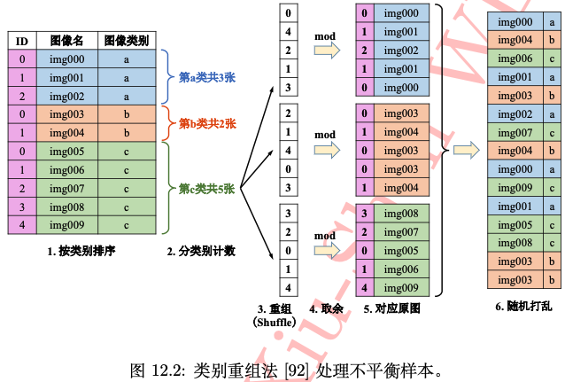
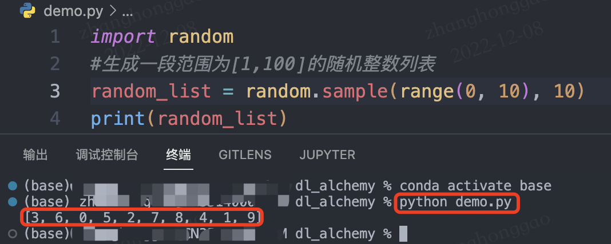

- [前言](#前言)
- [一，数据层面处理方法](#一数据层面处理方法)
  - [1.1，数据扩充](#11数据扩充)
  - [1.2，数据（重）采样](#12数据重采样)
    - [数据采样方法总结](#数据采样方法总结)
  - [1.3，类别平衡采样](#13类别平衡采样)
- [二，算法（损失函数）层面处理方法](#二算法损失函数层面处理方法)
  - [2.1，Focal Loss](#21focal-loss)
  - [2.2，损失函数加权](#22损失函数加权)
- [参考资料](#参考资料)

## 前言

在机器学习的经典假设中往往假设训练样本各类别数目是均衡的，但在实际场景中，训练样本数据往往都是不均衡（不平衡）的。比如在图像二分类问题中，一个极端的例子是，训练集中有 `95` 个正样本，但是负样本只有 `5` 个。这种类别数据不均衡的情况下，如果不做不平衡样本的处理，会导致模型在数目较少的类别上出现“欠学习”现象，即可能在测试集上完全丧失对负样本的预测能力。

除了常见的分类、回归任务，类似图像语义分割、深度估计等像素级别任务中也是存在不平衡样本问题的。

解决不平衡样本问题的处理方法一般有两种:

1. 从“数据层面”入手：分为数据采样法和类别平衡采样法。
2. 从“算法层面”入手：代价敏感方法。

注意本文只介绍不平衡样本的处理思想和策略，不涉及具体代码，在实际项目中，需要针对具体任务，结合不平衡样本的处理策略来设计具体的数据集处理或损失函数代码，从而解决对应问题。

## 一，数据层面处理方法

数据层面的处理方法总的来说分为**数据扩充和采样法**，数据扩充会直接改变数据样本的数量和丰富度，采样法的本质是使得输入到模型的训练集样本趋向于平衡，即各类样本的数目趋向于一致。

数据层面的采样处理方法主要有两种策略:
1. **数据重采样**方法，发生在**数据预处理**阶段，会改变整体训练集的数目和分布。
2. **类别平衡采样**方法，发生在**数据加载**阶段（这里的加载是指加载到模型中，不是指从硬盘中读取文件），通过设置采样策略来使得不同类别样本送入模型训练总的次数是近似的。

### 1.1，数据扩充

所谓数据不平衡，其实就是某些类别的数据量太少，那就直接增加一些呗，简单直接。如果有的选，那肯定是优先选择重新采取数据的办法了，当然大部分时候我们都没得选，这个时候最有效的办法自然是**通过数据增强来扩充数据**了。

数据增强的手段有多种，常见的如下:

- 水平 / 竖直翻转
- 90°，180°，270° 旋转
- 翻转 + 旋转(旋转和翻转其实是保证了数据特征的旋转不变性能被模型学习到，卷积层面的方法可以参考论文 `ACNet`)
- 亮度，饱和度，对比度的随机变化
- 随机裁剪（Random Crop）
- 随机缩放（Random Resize）
- 加模糊（Blurring）
- 加高斯噪声（Gaussian Noise）

值得注意的是**数据增强手段的使用必须结合具体任务而来**，除了前三种以外，其他的要慎重考虑。因为不同的任务场景下数据特征依赖不同，比如高斯噪声，在天池铝材缺陷检测竞赛中，如果高斯噪声增加不当，有些图片原本在采集的时候相机就对焦不准，导致工件难以看清，倘若再增加高斯模糊属性，部分图片样本基本就废了。
> 参考文章 [如何针对数据不平衡做处理](http://spytensor.com/index.php/archives/45/)。

虽然目前深度学习框架中都自带了一些数据增强函数，但更多更强的数据增强手段可以使用一些图像增强库，比如 `imgaug` 这个 `python` 库。
> 模型训练过程中，pytorch 框架如何在数据构建 pipeline 阶段使用 imgaug 库可以参考文章 [数据增强-imgaug](https://datawhalechina.github.io/thorough-pytorch/%E7%AC%AC%E5%85%AD%E7%AB%A0/6.5%20%E6%95%B0%E6%8D%AE%E5%A2%9E%E5%BC%BA-imgaug.html)。

### 1.2，数据（重）采样

简单的数据重采样方法分为**数据上采样**（`over-sampling`、`up-sampling`，也叫数据过采样） 或 也叫数据欠采样数据下采样（`under-sampling` 、`down-sampling` ）。

1，**对于样本数目较少的类别，可用数据过采样方法**（`over-sampling`），即通过复制方法使得该类图像数目增至与样本最多类的样本数一致。

2，而**对于样本数较多的类别，可使用数据欠采样**（`Under-sampling`，也叫数据欠采样）方法。对于深度学习和计算机视觉领域的任务来说，下采样并不是直接随机丢弃一部分图像，正确的下采样策略是: 在批处理训练时（数据加载阶段 `dataloader`），对于样本较多的类别，严格控制每批（`batch`）随机抽取的图像数目，**使得每批读取的数据中正负样本是均衡的（类别均衡）**。以二分类任务为例，假设原始数据分布情况下每批处理训练正负样本平均数量比例为 `9:1`，如仅使用下采样策略，则可在每批随机挑选训练样本时每 `9` 个正样本只取 `1` 个作为该批训练集的正样本，负样本选择策略不变，这样可使得每批读取的训练数据中正负样本时平衡的。

数据过采样和欠采样示意图如下所示。


#### 数据采样方法总结

数据过采样和欠采样本质的简单理解就是“增加图片”和“删图片”:
- 过采样：重复正比例数据，实际上没有为模型引入更多形式数据，过分强调正比例数据，会放大正比例噪音对模型的影响。
- 欠采样：丢弃大类别的部分数据，和过采样一样会存在过拟合的问题。

**同时两种数据重采样方法都是会改变数据原始分布的，比如数据过采样增加较小类别的样本数，数据欠采样减少较大类别的样本数，有可能产生模型过拟合等问题**。
> 这里的较小类别的意思是样本数目较少的类别，较大类别即样本数目较多的类别。

以上内容都是对解决类别不平衡问题中数据采样方法的**策略描述**，但想要在实际任务中解决问题，还要求我们加深对任务（`task`）的分析、对数据的理解分析，以及要求我们有更多的数据处理、数据采样的代码经验，即良好的策略 + 熟练的工具。
> 需要注意的是，因为仅仅使用数据上采样策略有可能会引起模型过拟合问题，所以在实际任务中，更为保险的数据采样策略哇往往是将上采样和下采样结合起来使用。

### 1.3，类别平衡采样

前面的数据重采样策略是着重于类别样本数量，而另一类采样策略则是直接**着重于类别本身，不改变数据总体样本数，即类别平衡采样方法**。其简单策略是把样本按类别分组，每个类别生成一个样本列表，训练过程中随机选择 1 个或几个类别，然后从每个类别所对应的样本列表中随机选择样本，这样可保证每个类别参与训练的机会比较均衡。

上述类别平衡方法过于简单，实际应用中有很多限制，比如在类别数很多的多分类任务中（如 `ImageNet` 数据集）。**由此，在类别平衡采样的基础上，国内海康威视研究院提出了一种“类别重组采样”的平衡方法**。
> **类别重组法**是在《解析卷积神经网络》这本书中看到的，可惜没在网上找到原论文和代码，但这个方法感觉还是很有用的，且也比较好复现。

如下图所示，**类别重组**方法步骤如下:



1. 对原始样本的每个类别的样本分别排序好，计算每个类别的样本数目，并记录样本数最多的那个类别的样本数量 `max_num`。
2. 基于最大样本数 `max_num` 产生一个随机数列表，然后用此列表中的随机数对各自类别的样本数求余，得到对应索引值列表 `index_list`。
3. 根据该索引值列表 `index_list`，从该类的图像数据中提取图像，生成该类的图像随机列表。
4. 最后吧所有类别的随机列表连接在一起后一起随机打乱次序，即可得到最终的图像列表，可以发现最终的这个图像随机列表中每个类别的样本数目是一致的（样本数较少的类别，图像会存在多次采样）。然后每轮(`epoch`)都对此列表进行遍历数据用于模型训练，如此重复。

以上方法整体还是比较复现的，结合具体任务来设计代码就行，这里给出一个简单的生成一段范围为 `[1, 10]` 的随机整数列示例代码。

```python
import random
# 生成一段范围为[0, 9]的随机整数列表
# sample(L, n) 函数: 从序列L中随机抽取n个元素，并将n个元素以list形式返回。
# 也可用 random.shuffle(L) 函数原地打乱列表
random_list = random.sample(range(0, 10), 10)
print(random_list)
```



类别重组法对有点很明显，在设计好重组代码函数后，只需要原始图像列表即可，所有操作都在内存中在线完成，易于实现且更通用。其实仔细深究可以发现，海康提出的这个类别重组法和前面的数据采样方法是很类似的，其**本质都是通过采样（sampler）策略让类别不均衡的各类数据在每轮训练中出现的次数是一致的**。

## 二，算法（损失函数）层面处理方法

类别不平衡问题的本质是导致样本数目较少的类别出现“欠学习”这一机器学习现象，直观表现是较小样本的损失函数权重占比也较少。一个很自然的解决办法是增加**小样本错分的惩罚代价**，并将此代价直接体现在目标函数（损失函数）里，这就是“代价敏感”的方法。“代价敏感”方法的本质可以理解为调整模型在小类别上的注意力。

### 2.1，Focal Loss

Focal Loss 是在二分类问题的交叉熵（CE）损失函数的基础上引入的，主要是为了解决 `one-stage` 目标检测中正负样本比例严重失衡的问题，该损失函数**降低了大量简单负样本在训练中所占的权重**，也可理解为一种困难样本挖掘，经实践证明 `Focal Loss` 在 `one-stage` 目标检测中还是很有效的，但是在多分类中不一定有效。

`Focal Loss` 作者通过在交叉熵损失函数上加上一个调整因子（`modulating factor`）$(1-p_t)^\gamma$，把高置信度 $p$（易分样本）样本的损失降低一些。`Focal Loss` 定义如下：

$$
FL(p_t) = -(1-p_t)^\gamma log(p_t) = \left\{\begin{matrix}
-(1-p)^\gamma log(p), & if \quad y=1 \\ 
-p^\gamma log(1-p), &  if\quad y=0
\end{matrix}\right.
$$

`Focal Loss` 有两个性质：

+ 当样本被错误分类且 $p_t$ 值较小时，调制因子接近于 `1`，`loss` 几乎不受影响；当 $p_t$ 接近于 `1`，调质因子（`factor`）也接近于 `0`，**容易分类样本的损失被减少了权重**，整体而言，相当于增加了分类不准确样本在损失函数中的权重。
+ $\gamma$ 参数平滑地调整容易样本的权重下降率，当 $\gamma = 0$ 时，`Focal Loss` 等同于 `CE Loss`。 $\gamma$ 在增加，调制因子的作用也就增加，实验证明  $\gamma = 2$ 时，模型效果最好。

直观地说，**调制因子减少了简单样本的损失贡献，并扩大了样本获得低损失的范围**。例如，当$\gamma = 2$ 时，与 $CE$ 相比，分类为 $p_t = 0.9$ 的样本的损耗将降低 `100` 倍，而当 $p_t = 0.968$ 时，其损耗将降低 `1000` 倍。这反过来又增加了错误分类样本的重要性（对于 $pt≤0.5$ 和 $\gamma = 2$，其损失最多减少 `4` 倍）。在训练过程关注对象的排序为正难 > 负难 > 正易 > 负易。

||难|易|
|--|--|--|
|正|1. 正难|3. 正易，$\gamma$ 衰减|
|负|2. 负难，$\alpha$ 衰减|4. 负易，$\alpha、\gamma$衰减|

在实践中，我们通常采用带 $\alpha$ 的 `Focal Loss`：

$$
FL(p_t) = -\alpha (1-p_t)^\gamma log(p_t)
$$

作者在实验中采用这种形式，发现它比非 $\alpha$ 平衡形式（non-$\alpha$-balanced）的精确度稍有提高。实验表明 $\gamma$ 取 2，$\alpha$ 取 0.25 的时候效果最佳。
> 更多理解参考 [focal loss 论文](https://arxiv.org/pdf/1708.02002.pdf)。

### 2.2，损失函数加权

除了 `Focal Loss` 这种高明的损失函数策略外，针对图像分类问题，还有一种简单直接的损失函数加权方法，即**在计算损失函数过程中，对每个类别的损失做加权处理**，具体的 `PyTorch` 实现方式如下:

```python
weights = torch.FloatTensor([1, 1, 8, 8, 4]) # 类别权重分别是 1:1:8:8:4
# pos_weight_weight(tensor): 1-D tensor，n 个元素，分别代表 n 类的权重，
# 为每个批次元素的损失指定的手动重新缩放权重，
# 如果你的训练样本很不均衡的话，是非常有用的。默认值为 None。
criterion = nn.BCEWithLogitsLoss(pos_weight=weights).cuda()
```

## 参考资料

- 《解析卷积神经网络》
- [如何针对数据不平衡做处理](http://spytensor.com/index.php/archives/45/)
- [10 Techniques to deal with Imbalanced Classes in Machine Learning](https://www.analyticsvidhya.com/blog/2020/07/10-techniques-to-deal-with-class-imbalance-in-machine-learning/)