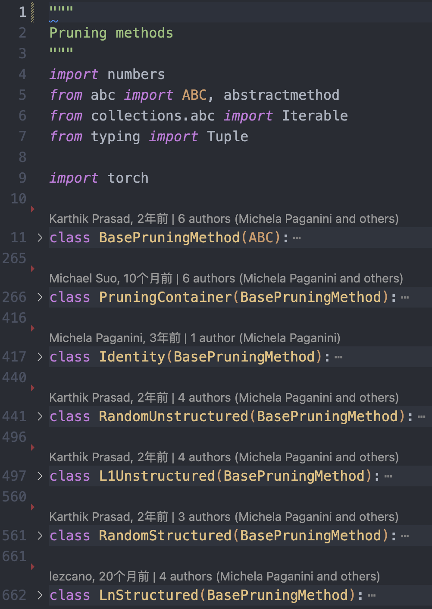
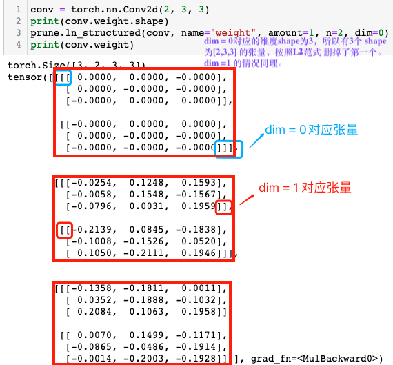
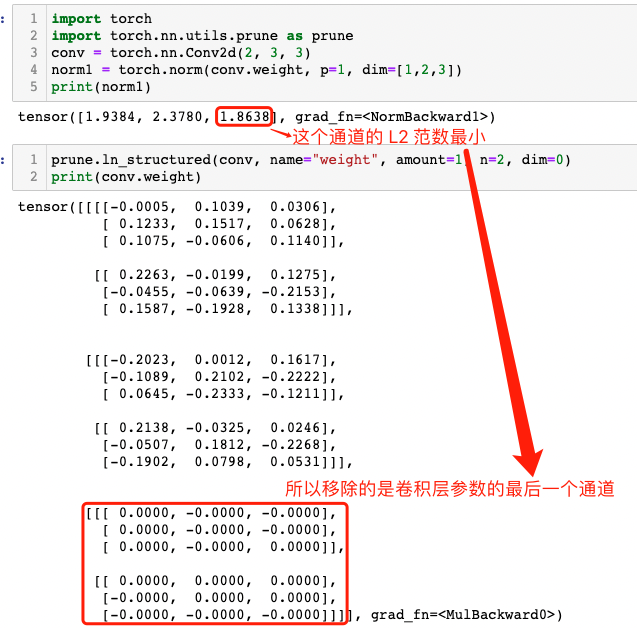

- [一，剪枝分类](#一剪枝分类)
  - [1.1，非结构化剪枝](#11非结构化剪枝)
  - [1.2，结构化剪枝](#12结构化剪枝)
  - [1.3，本地与全局修剪](#13本地与全局修剪)
- [二，PyTorch 的剪枝](#二pytorch-的剪枝)
  - [2.1，pytorch 剪枝工作原理](#21pytorch-剪枝工作原理)
  - [2.2，局部剪枝](#22局部剪枝)
    - [2.2.1，局部非结构化剪枝](#221局部非结构化剪枝)
    - [2.2.2，局部结构化剪枝](#222局部结构化剪枝)
    - [2.2.3，局部结构化剪枝示例代码](#223局部结构化剪枝示例代码)
  - [2.3，全局非结构化剪枝](#23全局非结构化剪枝)
- [三，总结](#三总结)
- [参考资料](#参考资料)

## 一，剪枝分类

所谓模型剪枝，其实是一种从神经网络中移除"不必要"权重或偏差（weigths/bias）的模型压缩技术。关于什么参数才是“不必要的”，这是一个目前依然在研究的领域。

### 1.1，非结构化剪枝

非结构化剪枝（Unstructured Puning）是指修剪参数的单个元素，比如全连接层中的单个权重、卷积层中的单个卷积核参数元素或者自定义层中的浮点数（scaling floats）。其重点在于，**剪枝权重对象是随机的，没有特定结构，因此被称为非结构化剪枝**。

### 1.2，结构化剪枝

与非结构化剪枝相反，结构化剪枝会剪枝整个参数结构。比如，丢弃整行或整列的权重，或者在卷积层中丢弃整个过滤器（`Filter`）。

### 1.3，本地与全局修剪 

剪枝可以在每层（局部）或多层/所有层（全局）上进行。

## 二，PyTorch 的剪枝

目前 PyTorch 框架支持的权重剪枝方法有:

- **Random**: 简单地修剪随机参数。
- **Magnitude**: 修剪权重最小的参数（例如它们的 L2 范数）

以上两种方法实现简单、计算容易，且可以在没有任何数据的情况下应用。

### 2.1，pytorch 剪枝工作原理

剪枝功能在 `torch.nn.utils.prune` 类中实现，代码在文件 torch/nn/utils/prune.py 中，主要剪枝类如下图所示。



剪枝原理是基于张量（Tensor）的掩码（Mask）实现。掩码是一个与张量形状相同的布尔类型的张量，掩码的值为 True 表示相应位置的权重需要保留，掩码的值为 False 表示相应位置的权重可以被删除。

Pytorch 将原始参数 `<param>` 复制到名为 `<param>_original` 的参数中，并创建一个**缓冲区**来存储剪枝掩码 `<param>_mask`。同时，其也会创建一个模块级的 forward_pre_hook 回调函数（在模型前向传播之前会被调用的回调函数），将剪枝掩码应用于原始权重。

pytorch 剪枝的 `api` 和教程比较混乱，我个人将做了如下表格，希望能将 api 和剪枝方法及分类总结好。


pytorch 中进行模型剪枝的工作流程如下：

1. 选择剪枝方法（或者子类化 BasePruningMethod 实现自己的剪枝方法）。
2. 指定剪枝模块和参数名称。
3. 设置剪枝方法的参数，比如剪枝比例等。

### 2.2，局部剪枝

Pytorch 框架中的局部剪枝有非结构化和结构化剪枝两种类型，值得注意的是结构化剪枝只支持局部不支持全局。

#### 2.2.1，局部非结构化剪枝

1，**局部非结构化剪枝**（Locall Unstructured Pruning）对应函数原型如下：

```python
def random_unstructured(module, name, amount)
```

1，**函数功能**：

用于对权重参数张量进行**非结构化**剪枝。该方法会在张量中**随机**选择一些权重或连接进行剪枝，剪枝率由用户指定。

2，函数参数定义：

- `module` (nn.Module): 需要剪枝的网络层/模块，例如 nn.Conv2d() 和 nn.Linear()。
- `name `(str): 要剪枝的参数名称，比如 "weight" 或 "bias"。
- `amount` (int or float): 指定要剪枝的数量，如果是 0~1 之间的小数，则表示剪枝比例；如果是证书，则直接剪去参数的绝对数量。比如`amount=0.2` ，表示将随机选择 20% 的元素进行剪枝。

3，下面是 `random_unstructured` 函数的使用示例。

```python
import torch
import torch.nn.utils.prune as prune
conv = torch.nn.Conv2d(1, 1, 4)
prune.random_unstructured(conv, name="weight", amount=0.5)
conv.weight
"""
tensor([[[[-0.1703,  0.0000, -0.0000,  0.0690],
          [ 0.1411,  0.0000, -0.0000, -0.1031],
          [-0.0527,  0.0000,  0.0640,  0.1666],
          [ 0.0000, -0.0000, -0.0000,  0.2281]]]], grad_fn=<MulBackward0>)
"""
```

可以看书输出的 conv 层中权重值有一半比例为 `0`。

#### 2.2.2，局部结构化剪枝

**局部结构化剪枝**（Locall Structured Pruning）有两种函数，对应函数原型如下：

```python
def random_structured(module, name, amount, dim)
def ln_structured(module, name, amount, n, dim, importance_scores=None)
```

1，函数功能

与非结构化移除的是连接权重不同，结构化剪枝移除的是整个通道权重。

2，参数定义

与局部非结构化函数非常相似，唯一的区别是您必须定义 dim 参数(ln_structured 函数多了 `n` 参数)。

`n` 表示剪枝的范数，`dim` 表示剪枝的维度。

对于 torch.nn.Linear：

- `dim = 0`： 移除一个神经元。

- `dim = 1`：移除与一个输入的所有连接。

对于 torch.nn.Conv2d：

- `dim = 0`(Channels) : 通道 channels 剪枝/过滤器 filters 剪枝
- `dim = 1`（Neurons）: 二维卷积核 kernel 剪枝，即与输入通道相连接的 kernel

#### 2.2.3，局部结构化剪枝示例代码

在写示例代码之前，我们先需要理解 `Conv2d` 函数参数、卷积核 shape、轴以及张量的关系。

首先，Conv2d 函数原型如下;

```py
class torch.nn.Conv2d(in_channels, out_channels, kernel_size, stride=1, padding=0, dilation=1, groups=1, bias=True)
```

而 pytorch 中常规卷积的卷积核权重 `shape` 都为（`C_out, C_in, kernel_height, kernel_width`），所以在代码中卷积层权重 `shape` 为 `[3, 2, 3, 3]`，dim = 0 对应的是 shape [3, 2, 3, 3] 中的 `3`。这里我们 dim 设定了哪个轴，那自然剪枝之后权重张量对应的轴机会发生变换。



理解了前面的关键概念，下面就可以实际使用了，`dim=0` 的示例如下所示。

```python
conv = torch.nn.Conv2d(2, 3, 3)
norm1 = torch.norm(conv.weight, p=1, dim=[1,2,3])
print(norm1)
"""
tensor([1.9384, 2.3780, 1.8638], grad_fn=<NormBackward1>)
"""
prune.ln_structured(conv, name="weight", amount=1, n=2, dim=0)
print(conv.weight)
"""
tensor([[[[-0.0005,  0.1039,  0.0306],
          [ 0.1233,  0.1517,  0.0628],
          [ 0.1075, -0.0606,  0.1140]],

         [[ 0.2263, -0.0199,  0.1275],
          [-0.0455, -0.0639, -0.2153],
          [ 0.1587, -0.1928,  0.1338]]],


        [[[-0.2023,  0.0012,  0.1617],
          [-0.1089,  0.2102, -0.2222],
          [ 0.0645, -0.2333, -0.1211]],

         [[ 0.2138, -0.0325,  0.0246],
          [-0.0507,  0.1812, -0.2268],
          [-0.1902,  0.0798,  0.0531]]],


        [[[ 0.0000, -0.0000, -0.0000],
          [ 0.0000, -0.0000, -0.0000],
          [ 0.0000, -0.0000,  0.0000]],

         [[ 0.0000,  0.0000,  0.0000],
          [-0.0000,  0.0000,  0.0000],
          [-0.0000, -0.0000, -0.0000]]]], grad_fn=<MulBackward0>)
"""
```

从运行结果可以明显看出，卷积层参数的最后一个通道参数张量被移除了（为 `0` 张量），其解释参见下图。



`dim = 1` 的情况：

```python
conv = torch.nn.Conv2d(2, 3, 3)
norm1 = torch.norm(conv.weight, p=1, dim=[0, 2,3])
print(norm1)
"""
tensor([3.1487, 3.9088], grad_fn=<NormBackward1>)
"""
prune.ln_structured(conv, name="weight", amount=1, n=2, dim=1)
print(conv.weight)
"""
tensor([[[[ 0.0000, -0.0000, -0.0000],
          [-0.0000,  0.0000,  0.0000],
          [-0.0000,  0.0000, -0.0000]],

         [[-0.2140,  0.1038,  0.1660],
          [ 0.1265, -0.1650, -0.2183],
          [-0.0680,  0.2280,  0.2128]]],


        [[[-0.0000,  0.0000,  0.0000],
          [ 0.0000,  0.0000, -0.0000],
          [-0.0000, -0.0000, -0.0000]],

         [[-0.2087,  0.1275,  0.0228],
          [-0.1888, -0.1345,  0.1826],
          [-0.2312, -0.1456, -0.1085]]],


        [[[-0.0000,  0.0000,  0.0000],
          [ 0.0000, -0.0000,  0.0000],
          [ 0.0000, -0.0000,  0.0000]],

         [[-0.0891,  0.0946, -0.1724],
          [-0.2068,  0.0823,  0.0272],
          [-0.2256, -0.1260, -0.0323]]]], grad_fn=<MulBackward0>)
"""
```

 很明显，对于 `dim=1`的维度，其第一个张量的 L2 范数更小，所以shape 为 [2, 3, 3] 的张量中，第一个 [3, 3] 张量参数会被移除（即张量为 0 矩阵） 。

### 2.3，全局非结构化剪枝

前文的 local 剪枝的对象是特定网络层，而 global 剪枝是将模型看作一个整体去移除指定比例（数量）的参数，同时 global 剪枝结果会导致模型中每层的稀疏比例是不一样的。

全局非结构化剪枝函数原型如下：

```python
# v1.4.0 版本
def global_unstructured(parameters, pruning_method, **kwargs)
# v2.0.0-rc2版本
def global_unstructured(parameters, pruning_method, importance_scores=None, **kwargs):
```

1，**函数功能**：

随机选择全局所有参数（包括权重和偏置）的一部分进行剪枝，而不管它们属于哪个层。

2，**参数定义**：

- `parameters`（(Iterable of (module, name) tuples)）: 修剪模型的参数列表，列表中的元素是  (module, name)。
- `pruning_method`（function）: 目前好像官方只支持 pruning_method=prune.L1Unstuctured，另外也可以是自己实现的非结构化剪枝方法函数。
- `importance_scores`: 表示每个参数的重要性得分，如果为 None，则使用默认得分。
- `**kwargs`: 表示传递给特定剪枝方法的额外参数。比如 `amount` 指定要剪枝的数量。

3，`global_unstructured` 函数的示例代码如下所示。

```python
device = torch.device("cuda" if torch.cuda.is_available() else "cpu")

class LeNet(nn.Module):
    def __init__(self):
        super(LeNet, self).__init__()
        # 1 input image channel, 6 output channels, 3x3 square conv kernel
        self.conv1 = nn.Conv2d(1, 6, 3)
        self.conv2 = nn.Conv2d(6, 16, 3)
        self.fc1 = nn.Linear(16 * 5 * 5, 120)  # 5x5 image dimension
        self.fc2 = nn.Linear(120, 84)
        self.fc3 = nn.Linear(84, 10)

    def forward(self, x):
        x = F.max_pool2d(F.relu(self.conv1(x)), (2, 2))
        x = F.max_pool2d(F.relu(self.conv2(x)), 2)
        x = x.view(-1, int(x.nelement() / x.shape[0]))
        x = F.relu(self.fc1(x))
        x = F.relu(self.fc2(x))
        x = self.fc3(x)
        return x

model = LeNet().to(device=device)

model = LeNet()

parameters_to_prune = (
    (model.conv1, 'weight'),
    (model.conv2, 'weight'),
    (model.fc1, 'weight'),
    (model.fc2, 'weight'),
    (model.fc3, 'weight'),
)

prune.global_unstructured(
    parameters_to_prune,
    pruning_method=prune.L1Unstructured,
    amount=0.2,
)
# 计算卷积层和整个模型的稀疏度
# 其实调用的是 Tensor.numel 内内函数，返回输入张量中元素的总数
print(
    "Sparsity in conv1.weight: {:.2f}%".format(
        100. * float(torch.sum(model.conv1.weight == 0))
        / float(model.conv1.weight.nelement())
    )
)
print(
    "Global sparsity: {:.2f}%".format(
        100. * float(
            torch.sum(model.conv1.weight == 0)
            + torch.sum(model.conv2.weight == 0)
            + torch.sum(model.fc1.weight == 0)
            + torch.sum(model.fc2.weight == 0)
            + torch.sum(model.fc3.weight == 0)
        )
        / float(
            model.conv1.weight.nelement()
            + model.conv2.weight.nelement()
            + model.fc1.weight.nelement()
            + model.fc2.weight.nelement()
            + model.fc3.weight.nelement()
        )
    )
)
# 程序运行结果
"""
Sparsity in conv1.weight: 3.70%
Global sparsity: 20.00%
"""
```

运行结果表明，虽然模型整体（全局）的稀疏度是 `20%`，但每个网络层的稀疏度不一定是 20%。

## 三，总结

另外，pytorch 框架还提供了一些帮助函数:

1. torch.nn.utils.prune.is_pruned(module): 判断模块 是否被剪枝。
2. torch.nn.utils.prune.remove(module, name)： 用于将指定模块中指定参数上的**剪枝操作移除**，从而恢复该参数的原始形状和数值。

虽然 PyTorch 提供了内置剪枝 `API` ，也支持了一些非结构化和结构化剪枝方法，但是 `API` 比较混乱，对应文档描述也不清晰，所以后面我还会结合微软的开源 `nni` 工具来实现模型剪枝功能。

## 参考资料

1. [How to Prune Neural Networks with PyTorch](https://towardsdatascience.com/how-to-prune-neural-networks-with-pytorch-ebef60316b91)
2. [PRUNING TUTORIAL](https://pytorch.org/tutorials/intermediate/pruning_tutorial.html)
3. [PyTorch Pruning](https://leimao.github.io/blog/PyTorch-Pruning/)