- [一，前言](#一前言)
  - [1.1，模型剪枝定义](#11模型剪枝定义)
- [二，深度神经网络的稀疏性](#二深度神经网络的稀疏性)
  - [2.1，权重稀疏](#21权重稀疏)
  - [2.2，激活稀疏](#22激活稀疏)
  - [2.3，梯度稀疏](#23梯度稀疏)
  - [2.4，小结](#24小结)
- [三，结构化稀疏](#三结构化稀疏)
  - [3.1，结构化稀疏分类](#31结构化稀疏分类)
    - [3.1.1，Channel/Filter 剪枝](#311channelfilter-剪枝)
    - [3.1.2， 阶段级别剪枝](#312-阶段级别剪枝)
  - [3.2，结构化稀疏与非结构化稀疏比较](#32结构化稀疏与非结构化稀疏比较)
- [参考资料](#参考资料)

## 一，前言

学术界的 SOTA 模型在落地部署到工业界应用到过程中，通常是要面临着低延迟（`Latency`）、高吞吐（`Throughpout`）、高效率（`Efficiency`）挑战的。而模型压缩算法可以将一个庞大而复杂的预训练模型转化为一个精简的小模型，从而减少对硬件的存储、带宽和计算需求，以达到加速模型推理和落地的目的。

近年来主流的模型压缩方法包括：**数值量化（Data Quantization，也叫模型量化）**，**模型稀疏化（Model sparsification，也叫模型剪枝 Model Pruning）**，**知识蒸馏（Knowledge Distillation）**， **轻量化网络设计（Lightweight Network Design）和 张量分解（Tensor Decomposition）**。

其中模型剪枝是一种应用非常广的模型压缩方法，其可以**直接**减少模型中的参数量。本文会对模型剪枝的定义、发展历程、分类以及算法原理进行详细的介绍。

### 1.1，模型剪枝定义

模型剪枝（`Pruning`）也叫模型稀疏化，不同于模型量化对每一个权重参数进行压缩，稀疏化方法是尝试直接“删除”部分权重参数。模型剪枝的原理是通过剔除模型中 “不重要” 的权重，使得模型减少参数量和计算量，同时尽量保证模型的精度不受影响。

## 二，深度神经网络的稀疏性

生物研究发现人脑是高度稀疏的。比如 2016 年早期经典的剪枝论文[1]就曾提到，生理学上发现对于哺乳动物，婴儿期产生许多的突触连接，在后续的成长过程中，不怎么用的那些突触就会退化消失。结合深度神经网络是模仿人类大脑结构，和该生理学现象，我们可以认为深度神经网络是存在稀疏性的[1]。

根据深度学习模型中可以被稀疏化的对象，深度神经网络中的稀疏性主要包括**权重稀疏**，**激活稀疏**和**梯度稀疏**。

### 2.1，权重稀疏

在大多数神经网络中，通过对网络层（卷积层或者全连接层）对权重数值进行直方图统计，可以发现，权重（训练前/训练后）的数值分布很像正太分布（或者是多正太分布的混合），且越接近于 0，权重越多，这就是**权重稀疏**现象。

论文[1]认为，权重数值的绝对值大小可以看做重要性的一种度量，权重数值越大对模型输出贡献也越大，反正则不重要，删去后模型精度的影响应该也比较小。

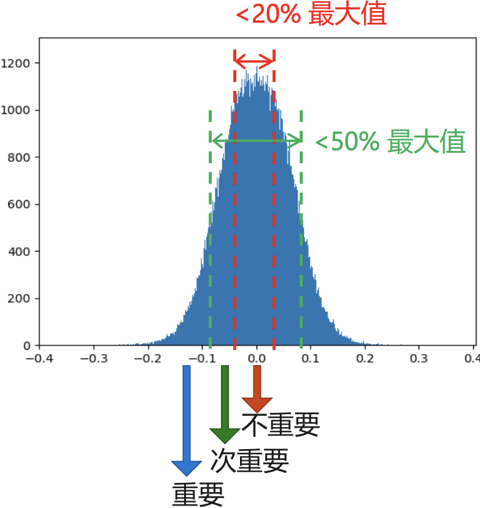

当然，权重剪枝（**Weight Pruning**）虽然影响较小但不等于没有影响，且**不同类型、不同顺序的网络层，在权重剪枝后影响也各不相同**。论文[1]在 AlexNet 的 CONV 层和 FC 层的做了**剪枝敏感性**实验，结果如下图所示。

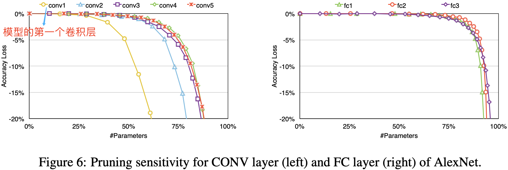

从图中实验结果可以看出，**卷积层的剪枝敏感性大于全连接层，且第一层卷积层最为敏感**。论文作者推测这是因为全连接层本身参数冗余性更大，第一层卷积层的输入只有 3 个通道所以比起他卷积层冗余性更少。

即使是移除绝对值接近于 0 的权重也会带来推理精度的损失，因此为了恢复模型精度，通常在剪枝之后需要再训练模型。典型的模型剪枝三段式工作 `pipeline` 流程[1]和剪枝前后网络连接变化如下图所示。

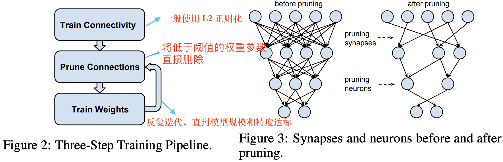
> 剪枝算法常用的是三段式工作 pipeline: 训练、剪枝、微调。

上述算法步骤中，其中重点问题有两个，一个是如何评估连接权重的重要性，另一个是如何在重训练中恢复模型精度。对于**评估连接权重的重要性**，有两个典型的方法，一是基于神经元连接权重**数值幅度**的方法[1]，这种方法原理简单；二是使用目标函数对参数求二阶导数表示参数的贡献度[10]。

> 基于神经元连接权重幅度的厕率好像在20世纪90年代就被提出来了，知识在韩松论文中[1]又被应用了。

剪枝`Three-Step Training Pipeline` 中三个阶段权重数值分布如下图所示。微调之后的模型权重分布将部分地恢复正态分布的特性。


> 深度网络中存在权重稀疏性:（a）剪枝前的权重分布；（b）剪除0值附近权值后的权重分布；（c）网络微调后的权重分布从单峰变成了双峰。

值得注意的是，韩松提出的权重稀疏方法是细粒度稀疏，去只能在专用硬件上-EIE实现加速效果，是对硬件不友好的稀疏方法，因为其稀疏后得到的权重矩阵是**高度非规则的矩阵**，如下图所示。

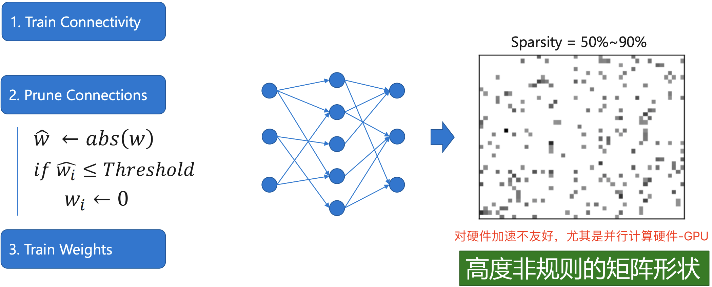

### 2.2，激活稀疏

早期的神经网络模型-早期的神经网络模型——多层感知机（MLP）中，多采用Sigmoid函数作为激活单元。但是其复杂的计算公式会导致模型训练过慢，且随着网络层数的加深，Sigmoid 函数引起的梯度消失和梯度爆炸问题严重影响了反向传播算法的实用性。为解决上述问题，Hinton 等人于 2010 年在论文中[2]提出了 `ReLU` 激活函数，并在 `AlexNet`模型[3]中第一次得到了实践。

后续伴随着 `BN` 层算子的提出，“2D卷积-BN层-ReLU激活函数”三个算子串联而成的基本单元就构成了后来 CNN 模型的基础组件，如下述 `Pytorch` 代码片段所示：

> 早期是 “2D卷积-ReLU激活函数-池化” 这样串接的组件。

```python
# cbr 组件示例代码
def convbn_relu(in_planes, out_planes, kernel_size, stride, pad, dilation):
    return nn.Sequential(
        nn.Conv2d(in_planes, out_planes, 
                  kernel_size=kernel_size, stride=stride, 
                  padding=dilation if dilation > 1 else pad, 
                  dilation=dilation, bias=False),
        nn.BatchNorm2d(out_planes),
        nn.ReLU(inplace=True)
        )
```

ReLU 激活函数的定义为：

$$ReLU(x) = max(0, x)$$

该函数使得负半轴的输入都产生 0 值的输出，这可以认为激活函数给网络带了另一种类型的稀疏性；另外 `max_pooling` 池化操作也会产生类似稀疏的效果。即无论网络接收到什么输入，大型网络中很大一部分神经元的输出大多为零。激活和池化稀疏效果如下图所示。

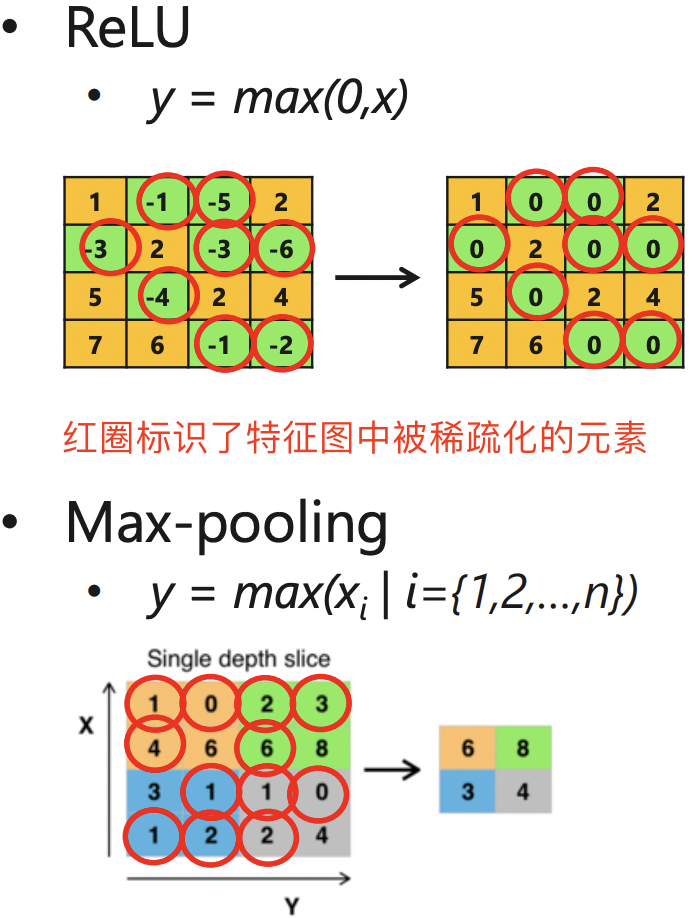
> 即 ReLU 激活层和池化层输出特征图矩阵是稀疏的。

受以上现象启发，论文[4]经过了一些简单的统计，发现无论输入什么样图像数据，CNN 中的许多神经元都具有非常低的激活。作者认为**零神经元**很可能是**冗余的**（`redundant`），可以在不影响网络整体精度的情况下将其移除。 因为它们的存在只会增加过度拟合的机会和优化难度，这两者都对网络有害。

> 由于神经网络具有乘法-加法-激活计算过程，因此其输出大部分为零的神经元对后续层的输出以及最终结果的贡献很小。

由此，提出了一种**神经元剪枝**算法。首先，定义了 `APoZ` （Average Percentage of Zeros）指标来衡量经过 ReLU  映射后神经元零激活的百分比。假设 $O_c^{(i)}$表示网络第 $i$ 层中第 $c$ 个通道（特征图），那么第 $i$ 层中第 $c$ 个的滤波器（论文中用神经元 neuron）的 APoZ 定义如下:

$$APoZ^{(i)}_c = APoZ(O_c^{(i)}) = \frac{\sum_k^N \sum_j^M f(O^{(i)}_{c,j}(k=0))}{N \times M}$$

这里，$f\left( \cdot \right)$ 对真的表达式输出 1，反之输出 0，$M$ 表示  $O_c^{(i)}$ 输出特征图的大小，$N$ 表示用于验证的图像样本个数。由于每个特征图均来自一个滤波器（神经元）的卷积及激活映射结果，因此上式衡量了每个神经元的重要性。

下图给出了在 VGG-16 网络中，利用 50,000 张 ImageNet 图像样本计算得到的 CONV5-3 层的 512 个和 FC6 层的 4096 个 APoZ 指标分布图。

> 这里更高是指更接近于模型输出侧的网络层。

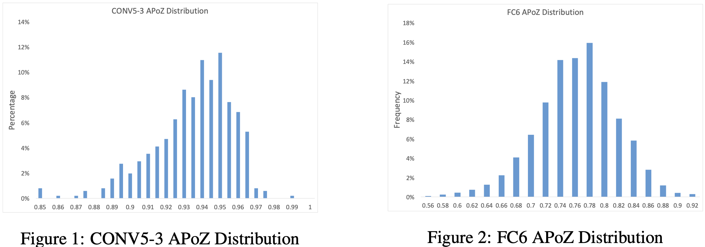

可以看出 CONV5-3 层的大多数神经元的该项指标都分布在 93%附近。实际上，VGG-16 模型中共有 631 个神经元的 APoZ 值超过90%。激活函数的引入反映出 VGG  网络存在着大量的稀疏与冗余性，且大部分冗余都发生在更高的卷积层和全连接层。

**激活稀疏的工作流程**和稀疏前后网络连接变化如下图所示。

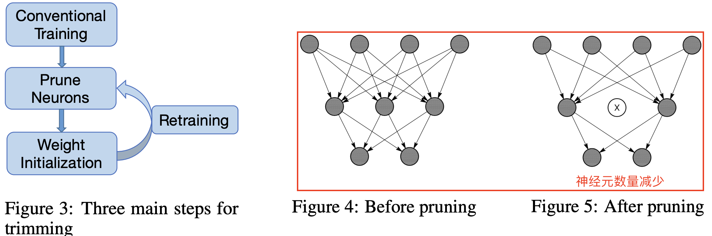

工作流程沿用韩松论文[1]提出的 Three-Step Training Pipeline，算法步骤如下所示:

1. 首先，网络在常规过程下进行训练，每层中的神经元数量根据经验设置。 接下来，我们在大型验证数据集上运行网络以获得每个神经元的 APoZ。
2. 根据特定标准修剪具有高 APoZ 的神经元。 当一个神经元被修剪时，与神经元的连接被相应地移除（参见上图右边红色框）。
3. 神经元修剪后，修剪后的网络使用修剪前的权重进行初始化。 修剪后的网络表现出一定程度的性能下降。因此，在最后一步中，我们**重新训练**网络以加强剩余的神经元以增强修剪后网络的性能。

**总结**：和权重剪枝的代表作[1]随机权重剪枝方法（神经元和连接都剪枝）相比，激活剪枝的代表作[4]，其剪枝的直接对象是神经元（neuron），即随机的将一些神经元的输出置零，属于结构化稀疏。

### 2.3，梯度稀疏

大模型（如 BERT）由于参数量庞大，单台主机难以满足其训练时的计算资源需求，往往需要借助分布式训练的方式在多台节点（Worker）上协作完成。采用分布式随机梯度下降（Distributed SGD）算法可以允许 $N$ 台节点共同完成梯度更新的后向传播训练任务。其中每台主机均保存一份完整的参数拷贝，并负责其中 $\frac{1}{N}$ 参数的更新计算任务。按照一定时间间隔，节点在网络上发布自身更新的梯度，并获取其他 $N-1$ 台节点发布的梯度计算结果，从而更新本地的参数拷贝。

随着参与训练任务节点数目的增多，网络上传输的模型梯度数据量也急剧增加，网络通信所占据的资源开销将逐渐超过梯度计算本身所消耗的资源，从而严重影响大规模分布式训练的效率。另外，大多数深度神经网络模型参数的梯度其实也是高度稀疏的，有研究[5]表明在分布式 `SGD` 算法中，99.9% 的梯度交换都是**冗余**的。例如下图显示了在 AlexNet 的训练早期，各层参数梯度的幅值还是较高的。但随着训练周期的增加，**参数梯度的稀疏度显著增大**。

> AlexNet 模型的训练是采用分布式训练。深度神经网络训练中的各层梯度值存在高度稀疏特性。


因为梯度交换成本很高，由此导致了网络带宽成为了分布式训练的瓶颈，为了克服分布式训练中的通信瓶颈，梯度稀疏（`Gradient Sparsification`）得到了广泛的研究，其实现的途径包括：

1. **选择固定比例的正负梯度更新**：在网络上传输根据一定比例选出的一部分正、负梯度更新值。[Dryden 等人2016年的论文](https://dl.acm.org/doi/abs/10.5555/3018874.3018875)。
2. **预设阈值**：在网络上仅仅传输那些绝对值幅度超过预设阈值的梯度。[Heafield (2017)论文](https://arxiv.org/abs/1704.05021)。

**深度梯度压缩（DGC）**[5]，在梯度稀疏化基础上采用动量修正、本地梯度剪裁、动量因子遮蔽和 warm-up训练 4 种方法来做梯度压缩，从而减少分布式训练中的通信带宽。其算法效果如下图所示。

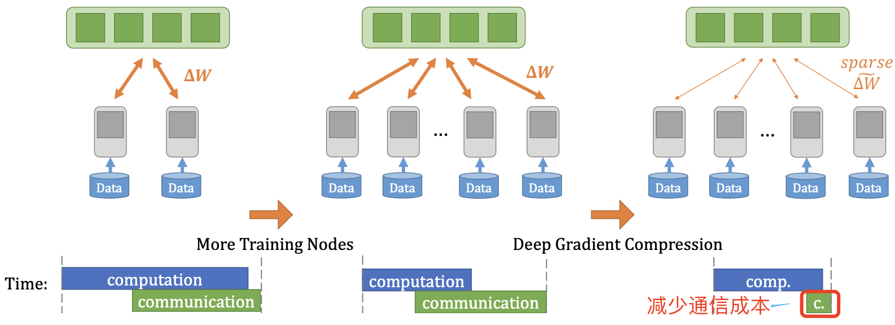

### 2.4，小结

虽然神经网络稀疏化目前在学术界研究和工业界落地已经取得了写进展，但是目前并没有一个完全确定的知识体系框架，许多以前 paper 上的结论是可能被后续新论文打破和重建的。以下是对主流权重剪枝、激活剪枝和梯度剪枝的总结:

1. 早期的权重剪枝是**非结构化**的（细粒度稀疏）其对并行计算硬件-GPU支持并不友好，甚至可能完全没有效果，其加速效果需要在专用加速器硬件（一般是 **ASIC**）上实现，比如韩松提出的 EIE 加速硬件[6]。
2. 更高层的网络冗余性更大，且卷积层的冗余性比全连接层的冗余性更少。所以 ResNet、MobileNet 等网络的剪枝难度大于 VGG、AlexNet 等。
3. 神经元剪枝相比权重剪枝更易损失模型精度，训练阶段的梯度则拥有最多的稀疏度。
4. 典型的模型剪枝三段式工作 `pipeline` 流程并不一定是准确的，最新的研究表明，对于随机初始化网络先进行剪枝操作再进行训练，有可能会比剪枝预训练网络获得更高的稀疏度和精度。此需要更多研究。

神经网络的权重、激活和梯度稀疏性总结如下表所示:


## 三，结构化稀疏

早期提出的连接权重稀疏化[1]方法是非结构化稀疏（即细粒度稀疏，也叫非结构化剪枝），其直接将模型大小压缩10倍以上，理论上也可以减少10倍的计算量。但是，细粒度的剪枝带来的计算特征上的“不规则”，对计算设备中的数据访问和大规模并行计算非常不友好，尤其是对 `GPU`硬件！

>  论文[1]作者提出了专用加速器硬件 `EIE` 去支持他的细粒度权重剪枝算法。

因为，“非结构化稀疏”（Unstructured Sparsity）主要通过对权重矩阵中的单个或整行、整列的权重值进行修剪。修剪后的新权重矩阵会变成稀疏矩阵（被修剪的值会设置为 0）。因而除非硬件平台和计算库能够支持高效的稀疏矩阵计算，否则剪枝后的模型是无法获得真正的性能提升的！

由此，许多研究开始探索通过给神经网络剪枝添加一个“规则”的约束-**结构化剪枝**（Structured pruning），使得剪枝后的稀疏模式更加适合并行硬件计算。 “结构化剪枝”的基本修剪单元是**卷积核**或权重矩阵的一个或多个Channel。由于结构化剪枝没有改变权重矩阵本身的稀疏程度，现有的计算平台和框架都可以实现很好的支持。

 这种引入了“规则”的结构化约束的稀疏模式通常被称为结构化稀疏（Structured Sparsity），在很多文献中也被称之为粗粒度稀疏（Coarse-grained Sparsity）或块稀疏（Block Sparsity），结构化和非结构化稀疏针对的都是权重参数。

### 3.1，结构化稀疏分类

结构化剪枝又可进一步细分：可以是 channel/filter-wise，也可以是 shape-wise 等。

> 过滤器 filter，也叫滤波器，相当于 3 维对卷积核。输出的 `feature map` 的数量/通道数等于滤波器数量。

#### 3.1.1，Channel/Filter 剪枝

channel 剪枝的工作是最多的，channel 剪枝和 filter 剪枝其实意义是一样的，一个过滤器移除了，对应输出 feature map 的一个通道自然也被移除，反之一样。

filter (channel) pruning (FP) 属于粗粒度剪枝（或者叫结构化剪枝 Structured Pruning），基于 FP 的方法修剪的是过滤器或者卷积层中的通道，而不是对个别权重，其原始的卷积结构不改变，所以剪枝后的模型不需要专门的算法和硬件就能够加速运行。

`CNN` 模型中通道剪枝的核心在于如何减少中间特征的数量，其中一个经典思路是基于**重要性因子**，即评估一个通道的有效性，再配合约束一些通道使得模型结构本身具有稀疏性，从而基于此进行剪枝。

> 基于重要性因子的方法进行通道剪枝，和前面非结构化剪枝中的基于权重幅度的方法来进行连接剪枝类似，都有点主观性太强。

论文[Learning Efficient Convolutional Networks through Network Slimming](https://arxiv.org/pdf/1708.06519.pdf)[7] 认为 conv-layer 的每个channel 的重要程度可以和 bn 层关联起来，如果某个 channel 后的 `bn` 层中对应的 scaling factor 足够小，就说明该 channel 的重要程度低，可以被忽略。如下图中橙色的两个通道被剪枝。

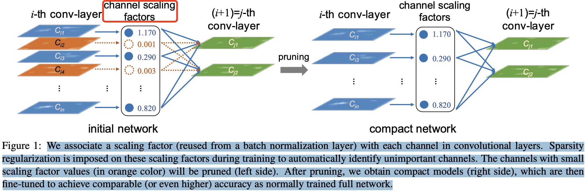

`BN` 层的计算公式如下：

$$
\begin{aligned} 
\mu_B &= \frac{1}{m}\sum_1^m x_i \\
\sigma^2_B &= \frac{1}{m} \sum_1^m (x_i-\mu_B)^2 \\
n_i &= \frac{x_i-\mu_B}{\sqrt{\sigma^2_B + \epsilon}} \\
z_i &= \gamma n_i + \beta = \frac{\gamma}{\sqrt{\sigma^2_B + \epsilon}}x_i + (\beta - \frac{\gamma\mu_{B}}{\sqrt{\sigma^2_B + \epsilon}})
\end{aligned}
$$

其中，`bn` 层中的 $\gamma$ 参数被作为 `channel-level 剪枝` 所需的缩放因子（`scaling factor`）。

#### 3.1.2， 阶段级别剪枝

滤波器级别的剪枝只能作用于残差结构块内部的卷积层，CURL[9]中指出只进行滤波器级别的剪枝会导致模型形成一个沙漏状、两头宽中间窄的结构，这样的结构会影响参数量和计算量。在这种情况下，阶段级别的剪枝能弥补滤波器级别剪枝的不足。

一个阶段中的残差结构块是紧密联系在一起的，如下图所示。

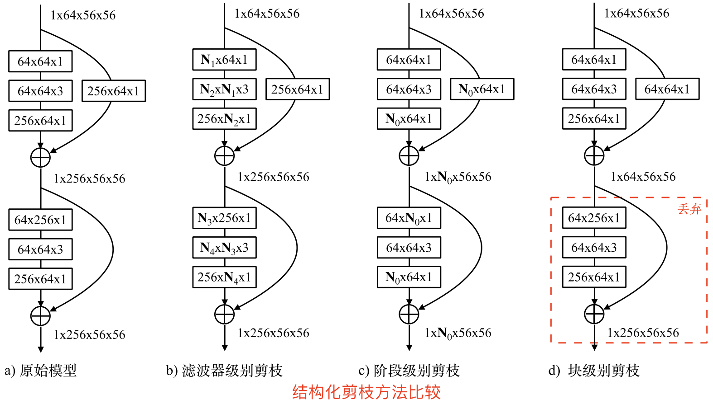

当一个阶段的输出特征发生变化时（一些特征被抛弃），其对应的每个残差结构的输入特征和输出特征都要发生相应的变化，所以整个阶段中，每个残差结构的第一个卷积层的输入通道数，以及最后一个卷积层的输出通道数都要发生相同的变化。由于这样的影响只限定在当前的阶段，不会影响之前和之后的阶段，因此我们称这个剪枝过程为阶段级别的剪枝（stage-level pruning）。 

阶段级别的剪枝加上滤波器级别的剪枝能够使网络的形状更均匀，而避免出现沙漏状的网络结构。此外，阶段级别的剪枝能够剪除更多的网络参数，这给网络进一步压缩提供了支持。

### 3.2，结构化稀疏与非结构化稀疏比较

与非结构化剪枝相比，结构化剪枝通常通常会牺牲模型的准确率和压缩比。结构化稀疏对非零权值的位置进行了限制，在剪枝过程中会将一些数值较大的权值剪枝，从而影响模型准确率。 “非规则”的剪枝则契合了神经网络模型中不同大小权值的**随机分布**，这对深度学习模型的准确度至关重要。展开来讲就是：

1. 非结构化稀疏具有更高的模型压缩率和准确性，在通用硬件上的加速效果不好。因为其计算特征上的“不规则”，导致需要特定硬件支持才能实现加速效果。
2. 结构化稀疏虽然牺牲了模型压缩率或准确率，但在通用硬件上的加速效果好，所以其被广泛应用。因为结构化稀疏使得权值矩阵更规则更加结构化，更利于硬件加速。

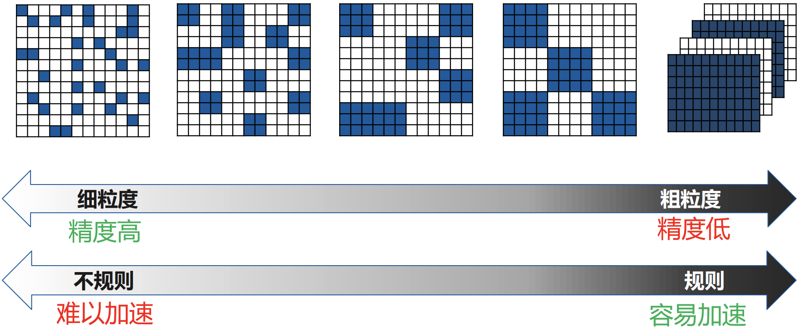

综上所述，深度神经网络的权值稀疏应该在**模型有效性和计算高效性之间做权衡**。

目前，有一种趋势是在软硬件上都支持**稀疏张量**，因此未来非结构化剪枝可能会变得更流行。

## 参考资料

- [1]:[Learning both Weights and Connections for Efficient](https://arxiv.org/pdf/1506.02626.pdf)
- [2]:[Rectified Linear Units Improve Restricted Boltzmann Machines](https://www.cs.toronto.edu/~hinton/absps/reluICML.pdf)
- [3]:[ImageNet Classification with Deep Convolutional](https://proceedings.neurips.cc/paper/2012/file/c399862d3b9d6b76c8436e924a68c45b-Paper.pdf)
- [4]:[Network Trimming: A Data-Driven Neuron Pruning Approach towards Efficient Deep Architectures](https://arxiv.org/pdf/1607.03250.pdf)
- [5]:[Deep Gradient Compression: Reducing the Communication Bandwidth for Distributed Training](https://arxiv.org/abs/1712.01887)
- [6]:[韩松博士毕业论文-EFFICIENT METHODS AND HARDWARE FOR DEEP LEARNING](https://stacks.stanford.edu/file/druid:qf934gh3708/EFFICIENT%20METHODS%20AND%20HARDWARE%20FOR%20DEEP%20LEARNING-augmented.pdf)
- [7]:[Learning Efficient Convolutional Networks through Network Slimming](https://arxiv.org/pdf/1708.06519.pdf)
- [8]: [第1章 结构化剪枝综述](https://cs.nju.edu.cn/wujx/paper/Pruning_Survey_MLA21.pdf)
- [9]: [Neural network pruning with residual-connections and limited-data](https://arxiv.org/pdf/1911.08114.pdf)
- [10]: [Optimal Brain Damage](https://proceedings.neurips.cc/paper/1989/file/6c9882bbac1c7093bd25041881277658-Paper.pdf)
- [11]: [AI-System: 11.3 模型压缩与硬件加速](https://github.com/microsoft/AI-System/blob/main/Textbook/%E7%AC%AC11%E7%AB%A0-%E6%A8%A1%E5%9E%8B%E5%8E%8B%E7%BC%A9%E4%B8%8E%E5%8A%A0%E9%80%9F/11.3-%E6%A8%A1%E5%9E%8B%E5%8E%8B%E7%BC%A9%E4%B8%8E%E7%A1%AC%E4%BB%B6%E5%8A%A0%E9%80%9F.md)