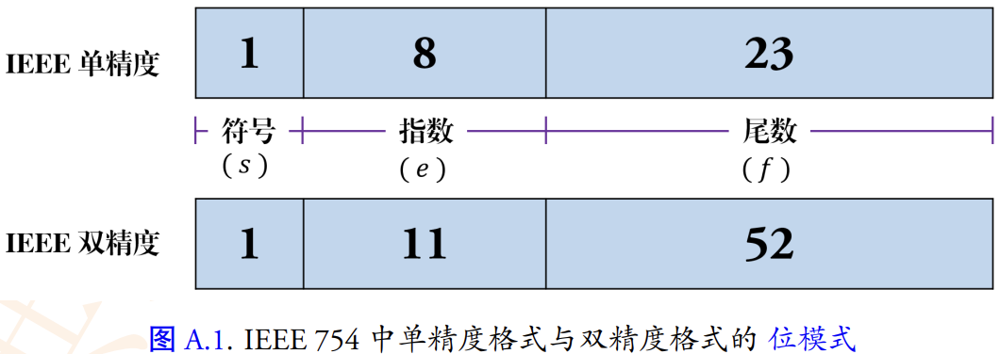
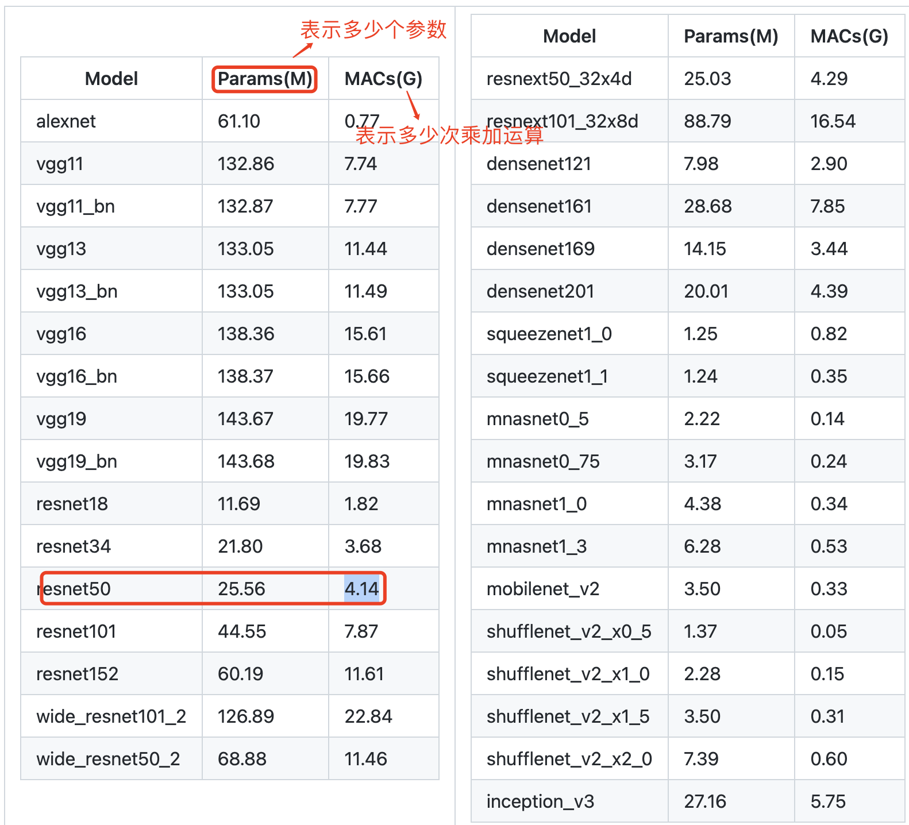

- [前言](#前言)
  - [浮点数和定点数](#浮点数和定点数)
  - [IEEE754 标准](#ieee754-标准)
- [一，模型量化概述](#一模型量化概述)
  - [1.1，模型计算量和参数量统计](#11模型计算量和参数量统计)
- [二，模型量化的方案](#二模型量化的方案)
  - [2.1，量化算术的分类](#21量化算术的分类)
- [三，量化算法](#三量化算法)
  - [3.1，浮点转定点算术](#31浮点转定点算术)
  - [3.2，定点转浮点算术](#32定点转浮点算术)
- [四，量化方法的改进](#四量化方法的改进)
  - [4.1，浮点数动态范围选择](#41浮点数动态范围选择)
  - [4.2，最大最小值（MinMax）](#42最大最小值minmax)
  - [4.3，滑动平均最大最小值(MovingAverageMinMax)](#43滑动平均最大最小值movingaverageminmax)
  - [4.4，KL 距离采样方法(Kullback–Leibler divergence)](#44kl-距离采样方法kullbackleibler-divergence)
  - [4.5，总结](#45总结)
- [五，量化实战经验](#五量化实战经验)
- [参考资料](#参考资料)

## 前言

### 浮点数和定点数

浮点数（floating point number）和定点数（fixed point number）都是计算机中表示实数（即带有小数部分的数）的方式。在数值计算中，小数在内存中是以浮点数格式表示和参与运算。浮点数和定点数中的“点”指的是小数点。

1，**浮点数表示法**是用**科学计数法**表示实数，即:

 $\text{fraction} \times \text{base}^\text{exponent}$

其中，$fraction$ 表示尾数，$base$ 表示基数（通常为2），$\text{exponent}$ 表示指数。浮点数的表示法将尾数和指数分别存储在计算机内存中，由于指数可为负数或小数，可以表示非常大或非常小的实数，同时也具有一定的精度。浮点数一般使用 `IEEE754` 标准表示，如单精度浮点数使用 32 位-`FP32`（1 位符号位，8 位指数位，23 位尾数位）来表示实数。

2，**定点数表示法**是用一个**固定的小数位数**来表示实数，即用一定数量的二进制数表示小数部分。定点数没有指数部分，小数部分的位数是固定的，所以它的范围和精度比较有限。定点数一般使用有符号或无符号整数表示，比如常见的 `INT8`。

INT8 是 8 位定点数，其取值范围为 $[-128,127]$，共 $256$ 个不同的取值。

### IEEE754 标准

我们知道，浮点数是一种对于数学中实数的近似值数值表现法，其由符号、尾数、基和指数组成，如 $−0.3141592610 \times 10^2$， $0.101001_{2} \times 2^{3}$。

> 在数学中，实数（real number）是有理数和无理数的总称，直观理解就是**小数**。

在 `IEEE 754` 标准中, 浮点数是用二进制表示的, 形式如下：
$$
V = (-1)^s \times f \times 2^{e}
$$
其由三部分组成:

- 符号，sign，其值用 $s$ 表示。
- 指数，exponent，其值用 $e$ 表示，对于单精度浮点数，指数占 `8` 位
- 尾数，fraction，其值用 $f$ 表示。

IEEE 754 标准中的单精度和双精度格式如下图所示：



单精度浮点数值的分类：

1，**规格化的**（一般情况）：

指数位既不全为 0（数值 0），也不全位 1（单精度数值 255，双精度数值 2047）。这种情况下,指数为被定义以偏置形式表示的有符号整数，即指数位数值是 $E = e - Bias$。计算过程省略，但是由此产生的指数的取值范围，对于单精度是 $-126～+127$，而对于双精度是 $-1022~+1023$。

对于单精度的规格化数，其数值范围为 $[1\times 2^{-126}, (2-\varepsilon) \times 2^{127}], \varepsilon = 0$，经过换算十进制数范围为 $[1.17 \times 10^{-38}, 3.4 \times 10^{38}]$。

```bash
2^{-126} = 1.17*10^{-38}
2 * 2^{127} = 3.4*10^{38}
```

2，非规格化的

CSAPP 中文书上翻译为阶码域为全 0 时，所表示的数时非规格化形式，即指数为全为 0（数值 0）。

3，**特殊值**。

和非规格化相反，阶码域为全 1 。

## 一，模型量化概述

所谓**量化**，其实可以等同于**低精度**（Low precision）概念，常规模型精度一般使用 FP32（32 位浮点数，单精度）存储模型权重参数，低精度则表示使用 `INT8`、`FP16` 等权重数值格式。

模型量化（`Model Quantization`，也叫网络量化）过程分为两部分：将模型的**单精度**参数（一般 `FP32`-`32`位**浮点**参数）转化为**低精度**参数（一般 `INT8`-`8` 位**定点**参数），以及模型推理过程中的浮点运算转化为定点运算，这个需要推理框架支持。

模型量化技术可以降低模型的存储空间、内存占用和计算资源需求，从而提高模型的推理速度，也是为了更好的适配移动端/端侧 `NPU` 加速器。简单总结就是，模型变小了，速度变快了，支持的场景更多了。

最后，现在工业界主流的思路就是模型训练使用高精度-FP32 参数模型，模型推理使用低精度-INT8 参数模型。

### 1.1，模型计算量和参数量统计

之所以需要做模型量化，是因为训练好的原始 `FP32` 模型实在太大了，在端侧/移动端都很好直接部署，即使运行起来速度和功耗也很大。经典 backbone 的参数量和计算量统计结果如下：



> 来源 [thop](https://github.com/Lyken17/pytorch-OpCounter)，也叫 `PyTorch-OpCounter` 工具统计结果。

`Pytorch` 框架中常用的参数量和计算量统计分析工具有，`torchsummary` 和 `thop`。以 `thop` 为例，其基础用法如下所示：

```python
import torch
from torchvision.models import resnet50
from thop import profile
model = resnet50()
input = torch.randn(1, 3, 224, 224)
macs, params = profile(model, inputs=(input, ))
print("flops: %.2f\nparameters: %.2f" % (macs, params))
```

运行结果如下所示:

```bash
[INFO] Register count_convNd() for <class 'torch.nn.modules.conv.Conv2d'>.
[INFO] Register count_normalization() for <class 'torch.nn.modules.batchnorm.BatchNorm2d'>.
[INFO] Register zero_ops() for <class 'torch.nn.modules.activation.ReLU'>.
[INFO] Register zero_ops() for <class 'torch.nn.modules.pooling.MaxPool2d'>.
[INFO] Register zero_ops() for <class 'torch.nn.modules.container.Sequential'>.
[INFO] Register count_adap_avgpool() for <class 'torch.nn.modules.pooling.AdaptiveAvgPool2d'>.
[INFO] Register count_linear() for <class 'torch.nn.modules.linear.Linear'>.
flops: 4133742592.00
parameters: 25557032.00
```

## 二，模型量化的方案

在实践中将浮点模型转为量化模型的方法有以下三种方法：

1. `data free`：不使用校准集，传统的方法直接将浮点参数转化成定点数，使用上非常简单，但是一般会带来很大的精度损失，但是高通最新的论文 `DFQ` 不使用校准集也得到了很高的精度。
2. `calibration`：基于校准集方案，通过输入少量真实数据进行统计分析，从而确定浮点值域（min/max）。很多芯片厂商都提供这样的功能，如 `tensorRT`、高通、海思、地平线、寒武纪。TensorRT 校准时，一般是用训练集的子集。这里使用**校准集**，是因为第一个 conv 需要统计输入 的 min、max 外，其他层都只需要统计中间输出 feature 的 min、max 即可。
3. `finetune`：基于训练 `finetune` 的方案，将量化误差在训练时仿真建模，调整权重使其更适合量化。好处是能带来更大的精度提升，缺点是要修改模型训练代码，开发周期较长。

`TensorFlow` 框架按照量化阶段的不同，其模型量化功能分为以下两种：

+ Post-training quantization `PTQ`（训练后量化、离线量化）；
+ Quantization-aware training `QAT`（训练时量化，伪量化，在线量化）。

`PTQ` `Post Training Quantization` 是训练后量化，也叫做离线量化。

1. 根据量化零点 $x_{zero\_point}$ 是否为 `0`，训练后量化分为**对称量化**和**非对称量化**。根

2. 据数据通道顺序 `NHWC`(TensorFlow) 这一维度区分，训练后量化又分为**逐层量化**和**逐通道量化**。目前 `nvidia` 的 `TensorRT` 框架中使用了逐层量化的方法，**每个网络层**采用同一个阈值来进行量化。逐通道量化就是对每一层的每个通道都有各自的阈值，对精度可以有一个很好的提升。

### 2.1，量化算术的分类

目前已知的加快推理速度概率较大的量化方法主要有：

1. **二值化**，其可以用简单的位运算来同时计算大量的数。对比从 nvdia gpu 到 x86 平台，1bit 计算分别有 5 到128倍的理论性能提升。且其只会引入一个额外的量化操作，该操作可以享受到 SIMD（单指令多数据流）的加速收益。
2. **线性量化**(最常见)，又可细分为非对称，对称和 `ristretto` 几种。在 `nvdia gpu`，`x86`、`arm` 和 部分 `AI` 芯片平台上，均支持 `8bit` 的计算，效率提升从 `1` 倍到 `16` 倍不等，其中 `tensor core` 甚至支持 `4bit`计算，这也是非常有潜力的方向。线性量化引入的额外量化/反量化计算都是标准的向量操作，因此也可以使用 `SIMD` 进行加速，带来的额外计算耗时不大。
3. **对数量化**，一种比较特殊的量化方法。两个同底的幂指数进行相乘，那么等价于其指数相加，降低了计算强度。同时加法也被转变为索引计算。目前 `nvdia gpu`，`x86`、`arm` 三大平台上没有实现对数量化的加速库，但是目前已知海思 `351X` 系列芯片上使用了对数量化。

与非线性量化不同，线性量化采用**均匀分布**的聚类中心，原始浮点数据和量化后的定点数据存在一个简单的线性变换关系，因为卷积、全连接等网络层本身只是简单的线性计算，因此线性量化中可以直接用量化后的数据进行直接计算。

## 三，量化算法

### 3.1，浮点转定点算术

`32-bit` 浮点数和 `8-bit` 定点数的表示范围如下表所示：

| 数据类型 | 最小值   | 最大值 |
| -------- | -------- | ------ |
| `FP32`   | -1.17e38 | 3.4e38 |
| `int8`   | -128     | 127    |
| `uint8`  | 0        | 255    |

原始神经网络模型的推理由浮点运算构成。`FP32` 和 `INT8` 的值域是 $[1.17 \times 10^{-38}, 3.4 \times 10^{38}]$ 和 $[−128,127]$，而取值数量大约分别为 $2^{32}$ 和 $2^8$ 。`FP32` 取值范围非常广，因此，将网络从 `FP32` 转换为 `INT8` 并不像数据类型转换截断那样简单。

根据偏移量 $Z$ 是否为 0，可以将浮点数的线性量化分为两类-**对称量化和非对称量化**。

当浮点值域落在 $(-1,1)$ 之间，权重浮点数据的量化运算可使用下式的方法将 FP32 映射到 INT8，这是**对称量化**。其中 $x_{float}$ 表示 FP32 权重， $x_{quantized}$ 表示量化的 INT8 权重，$x_{scale}$ 是缩放因子（映射因子、量化尺度（范围）/ `float32` 的缩放因子）。

$$x_{float} = x_{scale} \times x_{quantized}$$

对称量化的浮点值和 `8` 位定点值的映射关系如下图，从图中可以看出，对称量化就是将一个 `tensor` 中的 $[-max(|\mathrm{x}|),max(|\mathrm{x}|)]$ 内的 `FP32` 值分别映射到 `8 bit` 数据的 `[-128, 127]` 的范围内，中间值按照线性关系进行映射，称这种映射关系是对称量化。可以看出，对称量化的浮点值和量化值范围都是相对于零对称的。


因为对称量化的缩放方法可能会将 FP32 零映射到 INT8 零，但我们不希望这种情况出现，于是出现了数字信号处理中的均一量化，即**非对称量化**。数学表达式如下所示，其中 $x_{zero\_point}$ 表示量化零点（量化偏移）。

$$x_{float} = x_{scale} \times (x_{quantized} - x_{zero\_point})$$

大多数情况下量化是选用无符号整数，即 `INT8` 的值域就为 $[0,255]$ ，这种情况，显然要用非对称量化。非对称量化的浮点值和 `8` 位定点值的映射关系如下图：


总的来说，**权重量化浮点值可以分为两个步骤**：

1. 通过在权重张量（Tensor）中找到 $min$ 和 $max$ 值从而确定 $x_{scale}$ 和$x_{zero\_point}$。
2. 将权重张量的每个值从 FP32 转换为 INT8 。
   $$
   \begin{align}
   x_{float} &\in [x_{float}^{min}, x_{float}^{max}] \\
   x_{scale} &= \frac{x_{float}^{max} - x_{float}^{min}}{x_{quantized}^{max} - x_{quantized}^{min}} \\
   x_{zero\_point} &= x_{quantized}^{max} - x_{float}^{max} \div x_{scale} \\
   x_{quantized} &= x_{float} \div x_{scale} + x_{zero\_point}
   \end{align}$$

注意，当浮点运算结果不等于整数时，需要**额外的舍入步骤**。例如将 FP32 值域 [−1,1] 映射到 INT8 值域 [0,255]，有 $x_{scale}=\frac{2}{255}$，而$x_{zero\_point}= 255−\frac{255}{2}≈127$。

relu 激活量化中，relu 中零点的位置不是实际 8 位的 0，而是我们计算出来的 `zero_point` 值。

注意，量化过程中存在误差是不可避免的，就像数字信号处理中量化一样。**非对称算法一般能够较好地处理数据分布不均匀的情况**。

### 3.2，定点转浮点算术

这里以常用的非对称量化为例分析。

量化量化的另一个方向是定点转浮点算术，即量化后模型中的 `INT8` 计算是描述常规神经网络的 `FP32` 计算，对应的就是**反量化过程**，也就是如何将 `INT8` 的定点数据反量化成 `FP32` 的浮点数据。

下面的等式 5-10 是反量化乘法 $x_{float} \cdot y_{float}$ 的过程。对于给定神经网络，输入 $x$、权重 $y$ 和输出 $z$ 的缩放因子肯定是已知的，因此等式 9 的 $Multiplier_{x,y,z} = \frac{x_{scale}y_{scale}}{z_{scale}}$ 也是已知的，在反量化过程之前可预先计算。因此，除了 $Multiplier_{x,y,z}$ 和 $(x_{quantized} - x_{zero\_point})\cdot (y_{quantized} - y_{zero\_point})$ 之间的乘法外，等式 10 中的运算都是整数运算。


$$\begin{align}
z_{float} & = x_{float} \cdot y_{float} \\
z_{scale} \cdot (z_{quantized} - z_{zero\_point})
& = (x_{scale} \cdot (x_{quantized} - x_{zero\_point})) \cdot
(y_{scale} \cdot (y_{quantized} - y_{zero\_point})) \\
z_{quantized} - z_{zero\_point}
&= \frac{x_{scale} \cdot y_{scale}}{z_{scale}} \cdot
(x_{quantized} - x_{zero\_point}) \cdot (y_{quantized} - y_{zero\_point}) \\
z_{quantized}
&= \frac{x_{scale} \cdot y_{scale}}{z_{scale}} \cdot
(x_{quantized} - x_{zero\_point}) \cdot (y_{quantized} - y_{zero\_point}) + z_{zero\_point} \\
Multiplier_{x,y,z} &= \frac{x_{scale} \cdot y_{scale}}{z_{scale}} \\
z_{quantized}
&= Multiplier_{x,y,z} \cdot (x_{quantized} - x_{zero\_point}) \cdot
(y_{quantized} - y_{zero\_point}) + z_{zero\_point} \\
\end{align}$$

> 等式：反量化算术过程。

对于等式 `9` 可以应用的大多数情况，$quantized$ 和 $zero\_point$ 变量 $(x,y)$ 都是 `INT8` 类型，$scale$ 是 `FP32`。实际上两个 `INT8` 之间的算术运算会累加到 `INT16` 或 `INT32`，这时 `INT8` 的值域可能无法保存运算结果。例如，对于 $x_{quantized}=20$、$x_{zero\_point} = 50$ 的情况，有 $(x_{quantized} − x_{zero_point}) = −30$ 超出 `INT8` 值范围 $[0,255]$。

另外，数据类型转换过程可能将 $Multiplier_{x,y,z} \cdot (x_{quantized} - x_{zero\_point}) \cdot (y_{quantized} - y_{zero\_point})$ 转换为 INT32 或 INT16 类型，之后和 $z_{zero\_point}$ 运算，确保计算结果几乎全部落入 INT8 值域 [0,255] 中。

对于以上情况，在工程中，比如对于卷积算子的计算，`sum(x*y)` 的结果需要用 INT32 保存，同时，`b` 值一般也是 `INT32` 格式的，之后再 `requantize` (重新量化)成 `INT8`。

## 四，量化方法的改进

量化浮点部分中描述权重浮点量化方法是非常简单的。在深度学习框架的早期开发中，这种简单的方法能快速跑通 `INT8` 推理功能，然而采用这种方法的网络的预测准确度通常会出现明显的下降。

虽然 FP32 权重的值域很窄，在这值域中数值点数量却很大。以上文的缩放为例，$[−1,1]$ 值域中 $2^{31}$（是的，基本上是总得可表示数值的一半）个 FP32 值被映射到 $256$ 个 INT8 值。

+ 量化类型：（`SYMMETRIC`） 对称量化和 (`NON-SYMMETRIC`） 非对称量化；
+ 量化算法：`MINMAX`、`KL` 散度、`ADMM`；
+ 权重量化类型：`per-channel` `per-layer`；

采用普通量化方法时，靠近零的浮点值在量化时没有精确地用定点值表示。因此，与原始网络相比，量化网络一般会有明显的精度损失。对于线性（均匀）量化，这个问题是不可避免的。

同时**值映射的精度**是受由 $x_{float}^{min}$ 和 $x_{float}^{max}$ 得到的 $x_{scale}$ 显著影响的。并且，如图十所示，权重中邻近 $x_{float}^{min}$ 和 $x_{float}^{max}$ 附近的值通常是可忽略的，其实就等同于**映射关系中浮点值的 `min` 和 `max` 值是可以通过算法选择的**。


> 图十将浮点量化为定点时调整最小值-最大值。

上图展示了可以调整 `min/max` 来选择一个值域，使得值域的值更准确地量化，而范围外的值则直接映射到定点的 min/max。例如，当从原始值范围 $[−1,1]$ 中选定$x_{min}^{float} = −0.9$ 和 $x_{max}^{float} = 0.8$ ，$[−0.9,0.8]$ 中的值将能更准确地映射到 $[0,255]$ 中，而 $[−1,−0.9]$ 和 $[0.8,1]$ 中的值分别映射为 $0$ 和 $255$。

### 4.1，浮点数动态范围选择

> 参考[干货：深度学习模型量化（低精度推理）大总结](https://mp.weixin.qq.com/s/LR3Z2rlkxdl-1KnsU734VQ)。

通过前文对量化算数的理解和上面两种量化算法的介绍我们不难发现，为了计算 `scale` 和 `zero_point`，我们需要知道 `FP32 weight/activation` 的实际动态范围。对于推理过程来说，`weight` 是一个常量张量，动态范围是固定的，`activation` 的动态范围是变化的，它的实际动态范围必须经过采样获取（一般把这个过程称为数据校准(`calibration`)）。

将浮点量化转为定点时调整最小值/最大值（**值域调整**），也就是浮点数动态范围的选择，**动态范围的选取直接决定了量化数据的分布情况，处于动态范围之外的数据将被映射成量化数据的边界点，即值域的选择直接决定了量化的误差**。

目前各大深度学习框架和三大平台的推理框架使用最多的有最大最小值（`MinMax`）、滑动平均最大最小值（`MovingAverageMinMax`）和 `KL` 距离（Kullback-Leibler divergence）三种方法，去确定浮点数的动态范围。如果量化过程中的每一个 `FP32` 数值都在这个实际动态范围内，我们一般称这种为不饱和状态；反之如果出现某些 `FP32` 数值不在这个实际动态范围之内我们称之为饱和状态。

### 4.2，最大最小值（MinMax）

`MinMax` 是使用最简单也是较为常用的一种采样方法。基本思想是直接从 `FP32` 张量中选取最大值和最小值来确定实际的动态范围，如下公式所示。
$x_{min} = \left\{\begin{matrix}min(X) & if\ x_{min} = None \\  min(x_{min}, min(X))  & otherwise\end{matrix}\right.$

$x_{max} = \left\{\begin{matrix}max(X) & if\ x_{max} = None \\  max(x_{max}, max(X))  & otherwise\end{matrix}\right.$

对 `weights` 而言，这种采样方法是不饱和的，但是对于 `activation` 而言，如果采样数据中出现离群点，则可能明显扩大实际的动态范围，比如实际计算时 `99%` 的数据都均匀分布在 `[-100, 100]` 之间，但是在采样时有一个离群点的数值为 `10000`，这时候采样获得的动态范围就变成 `[-100, 10000]`。

### 4.3，滑动平均最大最小值(MovingAverageMinMax)

与 `MinMax` 算法直接替换不同，MovingAverageMinMax 会采用一个超参数 `c` (Pytorch 默认值为0.01)逐步更新动态范围。
$x_{min} = \left\{\begin{matrix}min(X) & if x_{min} = None \\ (1-c)x_{min}+c \; min(X) & otherwise\end{matrix}\right.$

$x_{max} = \left\{\begin{matrix}max(X) & if x_{max} = None \\  (1-c)x_{max}+c \; max(X) & otherwise\end{matrix}\right.$
这种方法获得的动态范围一般要小于实际的动态范围。对于 weights 而言，由于不存在采样的迭代，因此 MovingAverageMinMax 与 MinMax 的效果是一样的。

### 4.4，KL 距离采样方法(Kullback–Leibler divergence)

理解 KL 散度方法之前，我们先看下 `TensorRT` 关于值域范围阈值选择的一张图：


这张图展示的是不同网络结构的不同 `layer` 的激活值分布统计图，横坐标是激活值，纵坐标是统计数量的归一化表示，而不是绝对数值统计；图中有卷积层和池化层，它们之间分布很不相同，因此合理的量化方法应该是适用于不同层的激活值分布，并且减小信息损失，因为从 `FP32` 到 `INT8` 其实也是一种**信息再编码**的过程。

简单的将一个 tensor 中的 -|max| 和 |max| FP32 value 映射为 -128 和 127 ，中间值按照线性关系进行映射，这种映射关系为**不饱和的（No saturation），也叫对称的**。对于这种简单的量化浮点方法，试验结果显示会导致比较大的精度损失。

通过上图可以分析出，线性量化中使用简单的量化浮点方法导致精度损失较大的原因是：

+ 上图的激活值统计针对的是一批图片，不同图片输出的激活值不完全相同，所以图中是多条曲线而不是一条曲线，曲线中前面一部分数据重合在一起了（红色虚线），说明不同图片生成的大部分激活值其分布是相似的；但是在曲线的右边，激活值比较大时（红色实现圈起来的部分），曲线不重复了，一个激活值会对应多个不同的统计量，这时激活值分布是比较乱的。
+ 曲线后面激活值分布比较乱的部分在整个网络层占是占少数的（比如 $10^-9$, $10^-7$, $10^-3$），因此曲线后面的激活值分布部分可以不考虑到映射关系中，只保留激活值分布的主方向。

一般认为量化之后的数据分布与量化前的数据分布越相似，量化对原始数据信息的损失也就越小，即量化算法精度越高。`KL` 距离(也叫 `KL` 散度)一般被用来度量两个分布之间的相似性。这里的数据分布都是离散形式的，其离散数据的 KL 散度公式如下：

$$D_{KL}(P \| Q) = \sum_i P(i)log_{a} \frac{P(i)}{Q(i)} = \sum_i P(i)[logP(x) - log Q(x)]$$

式中 P 和 Q 分布表示量化前 FP32 的数据分布和量化后的 INT8 数据分布。注意公式要求 P、Q 两个统计直方图长度一样（也就是 bins 的数量一样）。

TensorRT 使用 KL 散度算法进行量化校准的过程：首先在校准集上运行 FP32 推理，然后对于网络每一层执行以下步骤：

1. 收集激活输出的直方图。
2. 生成许多具有不同饱和度**阈值**的量化分布。
3. 选择最小化 KL_divergence(ref_distr, quant_distr) 的阈值 `T`，并确定 `Scale`。

以上使用校准集的模型量化过程通常只需几分钟时间。

### 4.5，总结

+ 对称的，不饱和的线性量化，会导致精度损失较大；
+ 通过最小化 `KL` 散度来选择饱和量化中的 阈值 `|T|`;

## 五，量化实战经验

> 参考[【商汤泰坦公开课】模型量化了解一下？](https://www.sensetime.com/cn/technology-new-detail/3563?categoryId=53)

1，量化是一种已经获得了工业界认可和使用的方法，在训练 (Training) 中使用 `FP32` 精度，在推理 (Inference) 期间使用 `INT8` 精度的这套量化体系已经被包括 `TensorFlow`，`TensorRT`，`PyTorch`，`MxNet` 等众多深度学习框架和启用，地平线机器人、海思、安霸等众多 `AI` 芯片厂商也在深度学习工具链中提供了各自版本的模型量化功能。
2，量化是一个大部分硬件平台都会支持的，因此比较常用；知识蒸馏有利于获得小模型，还可以进一步提升量化模型的精度，所以这个技巧也会使用，尤其是在有已经训好比较强的大模型的基础上会非常有用。剪枝用的会相对较少，因为可以被网络结构搜索覆盖。

## 参考资料

1. [后训练量化——Data free quantization](https://mp.weixin.qq.com/s?__biz=Mzg4ODA3MDkyMA==&mid=2247484062&idx=1&sn=e7f544a95dca6e7039437a396ad2a736&chksm=cf81f4f9f8f67def2f94cdec41a1520ad42590aeb39a0893eccfe0ed889537c892f61ad5be70&token=1900020351&lang=zh_CN#rd)
2. [神经网络量化--从早期的量化算法谈起](https://mp.weixin.qq.com/s?__biz=Mzg4ODA3MDkyMA==&mid=2247483895&idx=1&sn=4dd9f306b6afc6069d066256438fc6bc&chksm=cf81f790f8f67e8684ef4d65608a1aa201a0d021a0b36d6f86ac925edd07b3bfefba0258304e&token=1561419299&lang=zh_CN#rd)
3. [SystemforAI-10-Efficiency via Compression and Sparsity](https://github.com/microsoft/AI-System/blob/8fb334fff3ec150a310ebd4fed16594c11e55f29/docs/SystemforAI-10-Efficiency%20via%20Compression%20and%20Sparsity.pdf)
4. [NNI 文档](https://nni.readthedocs.io/zh/stable/)
5. [附录 A IEEE 浮点运算标准](https://math.ecnu.edu.cn/~jypan/Teaching/MatrixComp/refs/A1_IEEE_float.pdf)