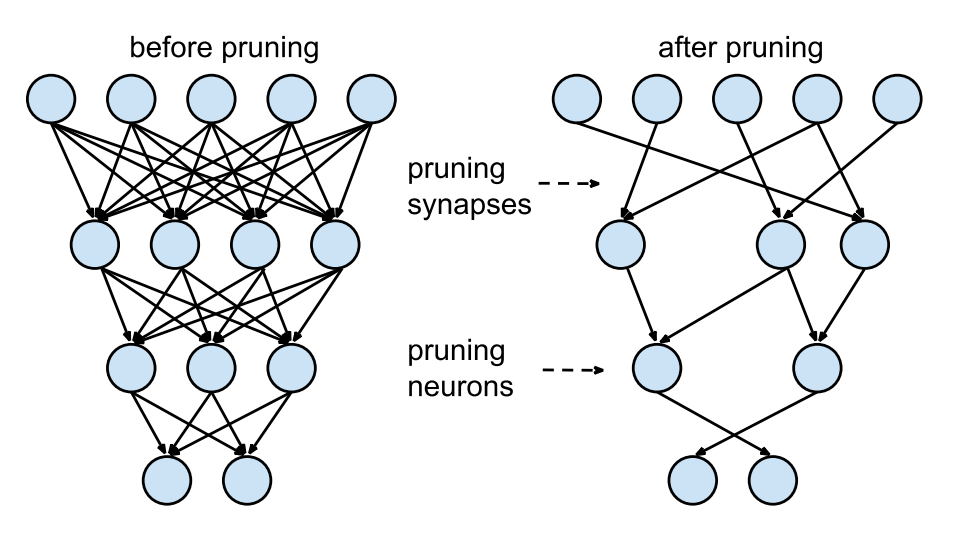

## 一，模型压缩技术概述

### 1.1，模型压缩问题定义

因为嵌入式设备的**算力和内存有限**，因此深度学习模型需要经过模型压缩后，方才能部署到嵌入式设备上。

模型压缩问题的定义可以从 `3` 角度出发:

1. 模型压缩的收益:
   - **计算**: 减少浮点运算量（`FLOPs`），降低延迟（`Latency`）
   - **存储**: 减少内存占用，提高 `GPU/NPU` 计算利用率

2. 公式定义模型压缩问题: $\underset{Policy_i}{min} {Model\_Size(Policy_i)}$
3. 模型压缩问题的约束: $accuracy(Policy_i) >= accuracy\_sla$

我们知道，一定程度上，网络越深，参数越多，模型也会越复杂，但其最终效果也越好，而模型压缩算法是旨在将一个庞大而复杂的预训练模型转化为一个精简的小模型。

### 1.2，模型压缩方法分类

按照压缩过程对网络结构的破坏程度，《解析卷积神经网络》一书中将模型压缩技术分为“前端压缩”和“后端压缩”两部分:

- 前端压缩，是指在不改变原网络结构的压缩技术，主要包括`知识蒸馏`、轻量级网络（紧凑的模型结构设计）以及`滤波器（filter）层面的剪枝（结构化剪枝）`等；
- 后端压缩，是指包括`低秩近似`、未加限制的剪枝（非结构化剪枝/稀疏）、`参数量化`以及二值网络等，目标在于尽可能减少模型大小，会对原始网络结构造成极大程度的改造。

总结：前端压缩几乎不改变原有网络结构（仅仅只是在原模型基础上减少了网络的层数或者滤波器个数），后端压缩对网络结构有不可逆的大幅度改变，造成原有深度学习库、甚至硬件设备不兼容改变之后的网络。其维护成本很高。

### 1.3，模型压缩方法举例

工业界主流的模型压缩方法有：知识蒸馏（Knowledge Distillation，KD）轻量化模型架构（也叫紧凑的模型设计）、剪枝（Pruning）、量化（Quantization）。各个模型压缩方法总结如下：

| 模型压缩方法   | 描述                                                         | 涉及的网络层               | 示例                                                         |
| -------------- | ------------------------------------------------------------ | -------------------------- | ------------------------------------------------------------ |
| 知识蒸馏       | 属于迁移学习的一种，主要思想是将学习能力强的复杂教师模型中的“知识”迁移到简单的学生模型中。 | 卷积和全连接层             | 经典KD论文，属于蒸 "logits"方法，将Teacher Network输出的soft label作为标签来训练Student Network。必须重新训练模型。 |
| 轻量化模型架构 | 轻量级网络的核心是在尽量保持精度的前提下，从体积和速度两方面对网络进行轻量化改造。 | 卷积层/卷积模块            | Mobilenet 提出深度可分离卷积； [shufflenetv2 论文](https://link.zhihu.com/?target=https%3A//arxiv.org/pdf/1807.11164.pdf) 提出的**四个高效网络设计的实用指导思想**； RepVGG 提出重参数化思想。 都需要重新设计 `backbone` 和和重新训练模型。 |
| 剪枝           | 将权重低于阈值的连接都从网络中删除。                         | 卷积层和全连接层           | 韩松2016年Deep Compression属于开山之作，剪枝步骤：正常训练，删除网络中权重低于阈值的连接层，重新训练。需要重新训练模型。 |
| 量化           | 指将神经网络的浮点算法转换为定点算法                         | 卷积、全连接、激活、BN层等 | TensoRT框架中的基于 KL 散度方法的INT8量化策略是主流技术。`PTQ` 训练后量化方法不需要重新训练模型。 |

## 二，知识蒸馏

知识蒸馏（knowledge distillation），其实也属于迁移学习（transfer learning）的一种，通俗理解就是训练一个大模型（teacher 模型）和一个小模型（student 模型），将庞大而复杂的大模型学习到的知识，通过一定技术手段迁移到精简的小模型上，从而使小模型能够获得与大模型相近的性能。也可说让小模型去拟合大模型，从而让**小模型学到与大模型相似的函数映射**。使其保持其快速的计算速度前提下，同时拥有复杂模型的性能，达到模型压缩的目的。

知识蒸馏的关键在于监督特征的设计，这个领域的开篇之作-[Distilling the Knowledge in a Neural Network](https://link.zhihu.com/?target=https%3A//arxiv.org/abs/1503.02531) 使用 `Soft Target` 所提供的类间相似性作为依据去指导小模型训练（`软标签蒸馏 KD`）。后续工作也有使用大模型的中间层特征图或 attention map（`features KD` 方法）作为监督特征，对小模型进行指导训练。这个领域的开篇之作-Distilling the Knowledge in a Neural Network，是属于软标签 KD 方法，后面还出现了 features KD 的论文。

以经典的知识蒸馏实验为例，我们先训练好一个 `teacher` 网络，然后将 `teacher` 的网络的输出结果 $q$ 作为 `student` 网络的目标，训练 `student` 网络，使得 `student` 网络的结果 $p$ 接近 $q$ ，因此，`student` 网络的损失函数为 $L = CE(y,p)+\alpha CE(q,p)$。这里 `CE` 是交叉熵（Cross Entropy），$y$ 是真实标签的 `onehot` 编码，$q$ 是 `teacher` 网络的输出结果，$p$ 是 `student` 网络的输出结果。

但是，直接使用 `teacher` 网络的 softmax 的输出结果 $q$，可能不大合适。因为，一个网络训练好之后，对于正确的答案会有一个很高的置信度而错误答案的置信度会很小。例如，在 MNIST 数据中，对于某个 2 的输入，对于 2 的预测概率会很高，而对于 2 类似的数字，例如 3 和 7 的预测概率为 $10^-6$ 和 $10^-9$。这样的话，`teacher` 网络学到**数据的相似信息**（例如数字 2 和 3，7 很类似）很难传达给 `student` 网络，因为它们的概率值接近`0`。因此，论文提出了 `softmax-T`(软标签计算公式)，公式如下所示：
$$q_{i} = \frac{z_{i}/T}{\sum_{j}z_{j}/T}$$

这里 $q_i$ 是 $student$ 网络学习的对象（soft targets），$z_i$ 是 `teacher` 模型 `softmax` 前一层的输出 `logit`。如果将 $T$ 取 1，上述公式**等同于 softmax**，根据 logit 输出各个类别的概率。如果 $T$ 接近于 0，则最大的值会越近 1，其它值会接近 0，近似于 `onehot` 编码。

所以，可以知道 `student` 模型最终的损失函数由两部分组成：

+ 第一项是由小模型的预测结果与大模型的“软标签”所构成的交叉熵（cross entroy）;
+ 第二项为预测结果与普通类别标签的交叉熵。

这两个损失函数的重要程度可通过一定的权重进行调节，在实际应用中，`T` 的取值会影响最终的结果，一般而言，较大的 T 能够获得较高的准确度，T（蒸馏温度参数） 属于知识蒸馏模型训练超参数的一种。**T 是一个可调节的超参数、T 值越大、概率分布越软（论文中的描述），曲线便越平滑**，相当于在迁移学习的过程中添加了扰动，从而使得学生网络在借鉴学习的时候更有效、泛化能力更强，这其实就是一种抑制过拟合的策略。

知识蒸馏算法整体的框架图如图下所示。

> 图片来源 https://intellabs.github.io/distiller/knowledge_distillation.html。

## 三，轻量级模型架构

**轻量级网络的核心是在尽量保持精度的前提下，从体积和速度两方面对网络进行轻量化改造**。关于如何手动设计轻量级网络的研究，目前还没有广泛通用的准则，只有一些指导思想，和针对不同芯片平台（不同芯片架构）的一些设计总结，建议大家从经典论文中吸取指导思想和建议，然后自己实际做各个硬件平台的部署和模型性能测试。

对于卷积神经网络，典型的工作有 `Mobilenet` 系列网络、`ShuffleNet` 系列网络、`RepVGG`、`CSPNet`、`VoVNet` 等论文。轻量级网络论文解析可阅读 [github 专栏-轻量级网络](https://github.com/HarleysZhang/cv_note/tree/master/7-model_compression)。

### 3.1，如何设计高效CNN架构

#### 一些结论

1. **分析模型的推理性能得结合具体的推理平台**（常见如：英伟达 `GPU`、移动端 `ARM` `CPU`、端侧 `NPU` 芯片等）；目前已知影响 `CNN` 模型推理性能的因素包括: 算子计算量 `FLOPs`（参数量 `Params`）、卷积 `block` 的内存访问代价（访存带宽）、网络并行度等。但相同硬件平台、相同网络架构条件下， `FLOPs` 加速比与推理时间加速比成正比。
2. 建议对于轻量级网络设计应该考虑直接 `metric`（例如速度 `speed`），而不是间接 `metric`（例如 `FLOPs`）。
3. **`FLOPs` 低不等于 `latency` 低，尤其是在有加速功能的硬体 (`GPU`、`DSP` 与 `TPU`)上不成立，得结合具硬件架构具体分析**。
4. 不同网络架构的 `CNN` 模型，即使是 `FLOPs` 相同，但其 `MAC` 也可能差异巨大。
5. **`Depthwise` 卷积操作对于流水线型 `CPU`、`ARM` 等移动设备更友好，对于并行计算能力强的 `GPU` 和具有加速功能的硬件（专用硬件设计-NPU 芯片）上比较没有效率**。`Depthwise` 卷积算子实际上是使用了大量的低 `FLOPs`、高数据读写量的操作。因为这些具有高数据读写量的操作，再加上**多数时候  `GPU` 芯片算力的瓶颈在于访存带宽**，使得模型把大量的时间浪费在了从显存中读写数据上，从而导致 `GPU` 的算力没有得到“充分利用”。结论来源知乎文章-[FLOPs与模型推理速度](https://zhuanlan.zhihu.com/p/122943688)和论文 [G-GhostNet](https://arxiv.org/pdf/2201.03297.pdf)。

#### 一些建议

1. 在大多数的硬件上，`channel` 数为 `16` 的倍数比较有利高效计算。如海思 `351x` 系列芯片，当输入通道为 `4` 倍数和输出通道数为 `16` 倍数时，时间加速比会近似等于 `FLOPs` 加速比，有利于提供 `NNIE` 硬件计算利用率。(来源海思 `351X` 芯片文档和 `MobileDets` 论文)
2. 低 `channel` 数的情况下 (如网路的前几层)，在有加速功能的硬件使用普通 `convolution` 通常会比 `separable convolution` 有效率。（来源 [MobileDets 论文](https://medium.com/ai-blog-tw/mobiledets-flops%E4%B8%8D%E7%AD%89%E6%96%BClatency-%E8%80%83%E9%87%8F%E4%B8%8D%E5%90%8C%E7%A1%AC%E9%AB%94%E7%9A%84%E9%AB%98%E6%95%88%E6%9E%B6%E6%A7%8B-5bfc27d4c2c8)）
3. [shufflenetv2 论文](https://arxiv.org/pdf/1807.11164.pdf) 提出的**四个高效网络设计的实用指导思想**: G1同样大小的通道数可以最小化 `MAC`、G2-分组数太多的卷积会增加 `MAC`、G3-网络碎片化会降低并行度、G4-逐元素的操作不可忽视。
4. `GPU` 芯片上 $3\times 3$ 卷积非常快，其计算密度（理论运算量除以所用时间）可达 $1\times 1$ 和 $5\times 5$ 卷积的四倍。（来源 [RepVGG 论文](https://zhuanlan.zhihu.com/p/344324470)）
5. **从解决梯度信息冗余问题入手**，提高模型推理效率。比如 [CSPNet](https://arxiv.org/pdf/1911.11929.pdf) 网络。
6. 从解决 `DenseNet` 的密集连接带来的高内存访问成本和能耗问题入手，如 [VoVNet](https://arxiv.org/pdf/1904.09730.pdf) 网络，其由 `OSA`（`One-Shot Aggregation`，一次聚合）模块组成。

## 3.2，轻量级模型部署总结

在阅读和理解经典的轻量级网络 `mobilenet` 系列、`MobileDets`、`shufflenet` 系列、`cspnet`、`vovnet`、`repvgg` 等论文的基础上，做了以下总结：

1. 低算力设备-手机移动端 `cpu` 硬件，考虑 `mobilenetv1`(深度可分离卷机架构-低 `FLOPs`)、低 `FLOPs` 和 低`MAC`的`shuffletnetv2`（`channel_shuffle` 算子在推理框架上可能不支持）
2. 专用 `asic` 硬件设备-`npu` 芯片（地平线 `x3/x4` 等、海思 `3519`、安霸`cv22` 等），分类、目标检测问题考虑 `cspnet` 网络(减少重复梯度信息)、`repvgg2`（即 `RepOptimizer`: `vgg` 型直连架构、部署简单）
3. 英伟达 `gpu` 硬件-`t4` 芯片，考虑 `repvgg` 网络（类 `vgg` 卷积架构-高并行度有利于发挥 `gpu` 算力、单路架构省显存/内存，问题: `INT8 PTQ` 掉点严重）

`MobileNet block` (深度可分离卷积 `block`, `depthwise separable convolution block`)在有加速功能的硬件（专用硬件设计-`NPU` 芯片）上比较没有效率。
> 这个结论在 [CSPNet](https://arxiv.org/pdf/1911.11929.pdf) 和 [MobileDets](https://arxiv.org/pdf/2004.14525.pdf) 论文中都有提到。

除非芯片厂商做了定制优化来提高深度可分离卷积 `block` 的计算效率，比如地平线机器人 `x3` 芯片对深度可分离卷积 `block` 做了定制优化。

下表是 `MobileNetv2` 和 `ResNet50` 在一些常见 `NPU` 芯片平台上做的性能测试结果。

以上，均是看了轻量级网络论文总结出来的一些**不同硬件平台部署轻量级模型的经验**，实际结果还需要自己手动运行测试。

## 四，模型剪枝
> 模型剪枝（model pruning）也叫模型稀疏化（model sparsity）。

深度学习模型中一般存在着大量冗余的参数，将权重矩阵中相对“不重要”的权值剔除（即置为 `0`），可达到降低计算资源消耗和提高实时性的效果，而对应的技术则被称为模型剪枝。

> 来源论文[Han et al. Learning both Weights and Connections for Efficient Neural Networks, NIPS 2015](https://arxiv.org/pdf/1506.02626.pdf)

典型三段式剪枝算法步骤：

1. 正常训练模型；
2. 模型剪枝；
3. 重新训练模型

以上三个步骤反复迭代进行，直到模型精度达到目标，则停止训练。

模型剪枝算法根据**粒度**的不同，可以粗分为**细粒度剪枝**和**粗粒度剪枝**，如下所示：

1. **细粒度剪枝(fine-grained)**：对连接或者神经元进行剪枝，它是粒度最小的剪枝。
2. **向量剪枝(vector-level)**：它相对于细粒度剪枝粒度更大，属于对卷积核内部(intra-kernel)的剪枝。
3. **核剪枝(kernel-level)**：去除某个卷积核，它将丢弃对输入通道中对应计算通道的响应。
4. **滤波器剪枝(Filter-level)**：也叫通道剪枝（`Channel Pruning`），对整个卷积核组进行剪枝，会造成推理过程中输出特征通道数的改变，滤波器剪枝的工作是目前研究最多的。

按照剪枝是否规则，剪枝算法也可分为：
- **非结构化剪枝**，其实就是前面的 1，对硬件支持不友好，需要设定特定硬件加速器，典型代表作是韩松 `2016` 年的论文。
- **结构化剪枝**，如 2、3、4，对硬件支持友好，典型代表作如 [Learning Efficient Convolutional Networks through Network Slimming](https://arxiv.org/pdf/1708.06519.pdf) 等。

### 4.1，结构化稀疏与非结构化剪枝比较

与非结构化剪枝相比，结构化剪枝通常通常会牺牲模型的准确率和压缩比。结构化稀疏对非零权值的位置进行了限制，在剪枝过程中会将一些数值较大的权值剪枝，从而影响模型准确率。 “非规则”的剪枝则契合了神经网络模型中不同大小权值的**随机分布**，这对深度学习模型的准确度至关重要。展开来讲就是：

1. 非结构化稀疏具有更高的模型压缩率和准确性，在通用硬件上的加速效果不好。因为其计算特征上的“不规则”，导致需要特定硬件支持才能实现加速效果。
2. 结构化稀疏虽然牺牲了模型压缩率或准确率，但在通用硬件上的加速效果好，所以其被广泛应用。因为结构化稀疏使得权值矩阵更规则更加结构化，更利于硬件加速。

综上所述，深度神经网络的权值稀疏应该在**模型有效性和计算高效性之间做权衡**。

目前，有一种趋势是在软硬件上都支持**稀疏张量**，因此未来非结构化剪枝可能会变得更流行。

## 五，模型量化

相比于剪枝操作，参数量化则是一种常用的后端压缩技术。所谓**量化**，其实可以等同于**低精度**（Low precision）运算概念，常规模型精度一般使用 FP32（32 位浮点数，单精度）存储模型权重参数，低精度则表示使用 `INT8`、`FP16` 等权重数值格式。

模型量化（`Model Quantization`，也叫网络量化）过程分为两部分：将模型的**单精度参数**（一般 `FP32`-`32`位**浮点**参数）转化为**低精度参数**（一般 `INT8`-`8` 位**定点**参数），以及模型推理过程中的浮点运算转化为定点运算，这个需要推理框架支持。

模型量化技术可以降低模型的存储空间、内存占用和计算资源需求，从而提高模型的推理速度，也是为了更好的适配移动端/端侧 `NPU` 加速器。简单总结就是，模型变小了，速度变快了，支持的场景更多了。

最后，现在工业界主流的思路就是模型训练使用高精度-FP32 参数模型，模型推理使用低精度-INT8 参数模型: 将模型从 FP32 转换为 INT8（即量化算术过程），以及使用 INT8 进行推理。

### 5.1，模型量化的方案

在实践中将浮点模型转为量化模型的方法有以下三种方法：

1. `data free`：不使用校准集，传统的方法直接将浮点参数转化成量化数，使用上非常简单，但是一般会带来很大的精度损失，但是高通最新的论文 `DFQ` 不使用校准集也得到了很高的精度。
2. `calibration`：基于校准集方案，通过输入少量真实数据进行统计分析。很多芯片厂商都提供这样的功能，如 `tensorRT`、高通、海思、地平线、寒武纪
3. `finetune`：基于训练 `finetune` 的方案，将量化误差在训练时仿真建模，调整权重使其更适合量化。好处是能带来更大的精度提升，缺点是要修改模型训练代码，开发周期较长。

按照量化阶段的不同，量化方法分为以下两种：

- Post-training quantization `PTQ`（训练后量化、离线量化）；
- Quantization-aware training `QAT`（训练时量化，伪量化，在线量化）。

### 5.2，量化的分类

目前已知的加快推理速度概率较大的量化方法主要有：

1. **二值化**，其可以用简单的位运算来同时计算大量的数。对比从 nvdia gpu 到 x86 平台，1bit 计算分别有 5 到128倍的理论性能提升。且其只会引入一个额外的量化操作，该操作可以享受到 SIMD（单指令多数据流）的加速收益。
2. **线性量化**(最常见)，又可细分为非对称，对称和 `ristretto` 几种。在 `nvdia gpu`，`x86`、`arm` 和 部分 `AI` 芯片平台上，均支持 `8bit` 的计算，效率提升从 `1` 倍到 `16` 倍不等，其中 `tensor core` 甚至支持 `4bit`计算，这也是非常有潜力的方向。线性量化引入的额外量化/反量化计算都是标准的向量操作，因此也可以使用 `SIMD` 进行加速，带来的额外计算耗时不大。
3. **对数量化**，一种比较特殊的量化方法。两个同底的幂指数进行相乘，那么等价于其指数相加，降低了计算强度。同时加法也被转变为索引计算。目前 `nvdia gpu`，`x86`、`arm` 三大平台上没有实现对数量化的加速库，但是目前已知海思 `351X` 系列芯片上使用了对数量化。

## 六，压缩方法总结

1. 按照剪枝是否规则，剪枝算法可分为：**非结构化剪枝**和**结构化剪枝**。前者可以保持高模型压缩率和准确率，但难加速；后者更利于硬件加速，但牺牲了模型压缩率或准确率。 
2. 如果需要一次性端对端训练得到压缩与加速后模型，可以考虑基于轻量化网络设计的模型进行模型压缩与加速。
3. 影响神经网络推理速度主要有 `4` 个因素：计算量 `FLOPs`、内存访问代价 `MAC`、计算并行度、硬件平台架构与特性（算力、GPU 内存带宽）。

## 参考资料

1. [深度学习模型压缩与加速](https://www.cnblogs.com/LXP-Never/p/14833772.html)
2. [Deep Compression: Compressing Deep Neural Networks with Pruning, Trained Quantization and Huffman Coding](https://arxiv.org/pdf/1510.00149.pdf)
3. 《解析卷积神经网络》
4. 《4-model_compression》(https://github.com/HarleysZhang/deep_learning_system/tree/main/4-model_compression)