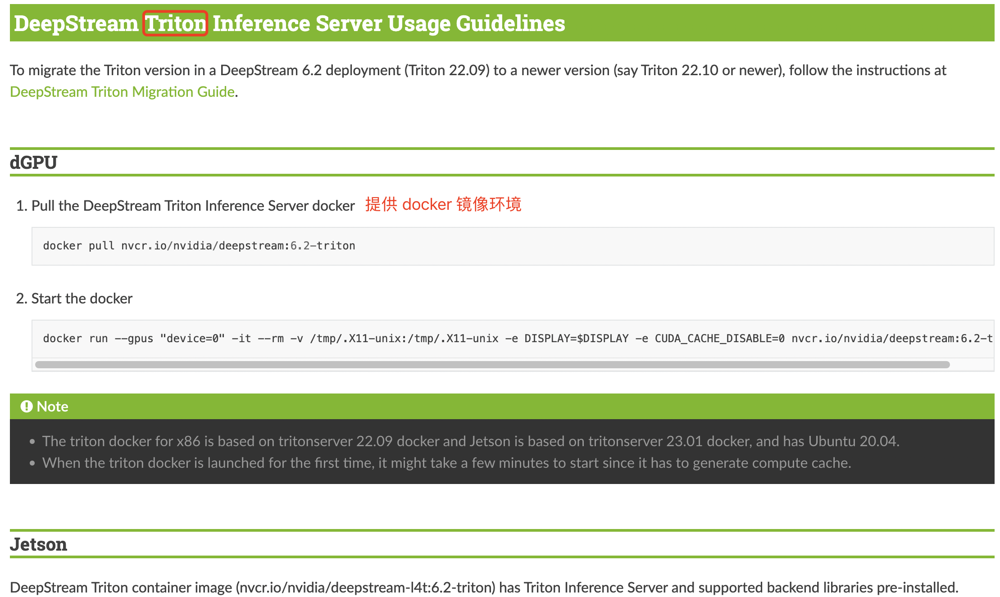
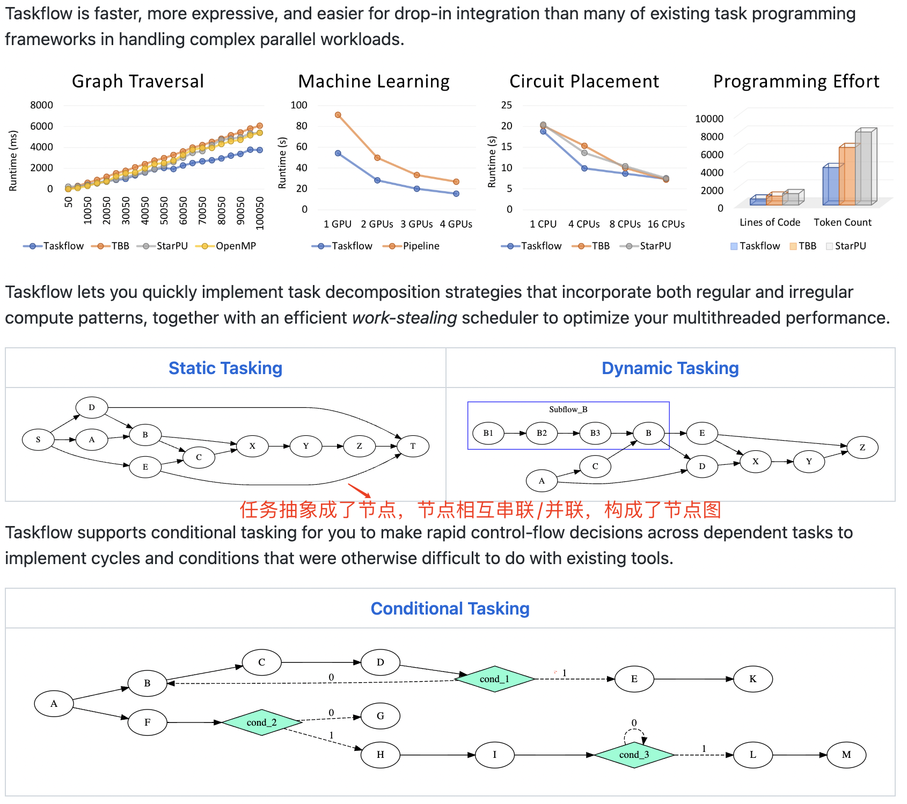
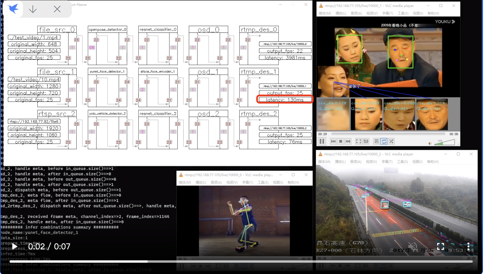
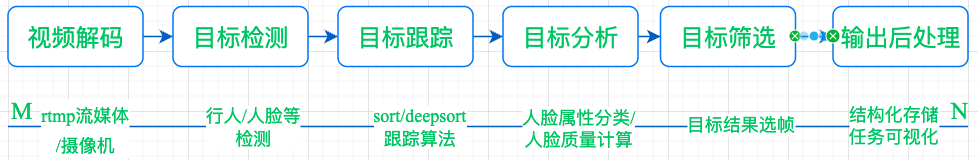
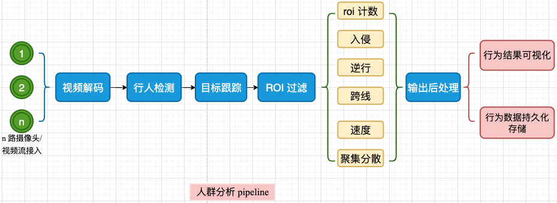
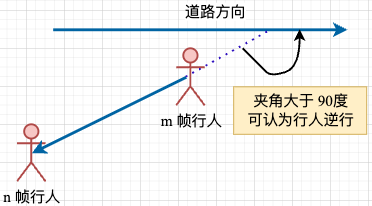
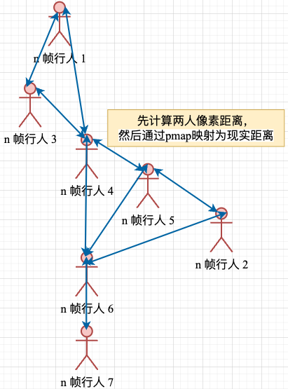
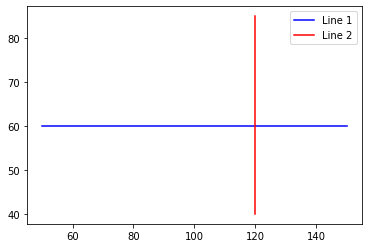

- [一，视频结构化概述](#一视频结构化概述)
- [二，视频结构化应用任务开源框架](#二视频结构化应用任务开源框架)
- [三，任务pipeline框图总结](#三任务pipeline框图总结)
- [四，人群分析框架](#四人群分析框架)
- [五，人群行为算法实现](#五人群行为算法实现)
  - [3.1，跨线算法](#31跨线算法)
  - [3.2，入侵算法](#32入侵算法)
  - [3.3，滞留算法](#33滞留算法)
- [参考资料](#参考资料)

## 一，视频结构化概述

所谓视频结构化，就是利用深度学习技术对**视频进行逐帧分析**，解析出视频帧中感兴趣的目标、并且进一步推理出每个目标感兴趣的属性，最后将这些目标、属性保存成**结构化数据**（能与每帧关联起来）。视频结构化的应用场景有很多，比如智能安防、智能交通、智能医疗、智能零售等。

## 二，视频结构化应用任务开源框架

1，[DeepStream](https://developer.nvidia.com/deepstream-sdk)

DeepStream SDK 框架主要针对的是流媒体视频的 AI 应用开发，可以快速开发和部署视觉 AI 应用和服务。提供视频解码/编码、图像缩放和转换等服务，可以用来构建智能视频分析 (IVA) 管道

这个框架**不开源**，需要自己英伟达[官网](https://developer.nvidia.com/deepstream-sdk)下载，初步看了下安装教程，一如既往的复杂繁琐啊！为了简单省事，还是使用官网提供的 docker 镜像去试用吧。



2，[MegFlow](https://github.com/MegEngine/MegFlow)

也是视频 AI 应用快速开发和落地的框架，其直接用 Python 搭建计算图，提供 pipeline 搭建、测试、调试、部署、结果可视化一条龙服务。

**但是**框架使用 `Rust` 编写，提供 `Python` 接口，其根本目的是为了在 to b 业务中，方便研究员快速搭建功能 `pipeline`。

3，[taskflow](https://github.com/taskflow/taskflow) 

taskflow 旨在帮助快速编写**并行和异构任务**程序。在处理复杂的并行工作负载方面，Taskflow 比许多现有的任务编程框架更快、更具表现力并且更容易进行嵌入式集成。

其并不是针对视频AI应用任务，但是 `task` 流的设计，是类似于视频 AI 应用开发的各个模块串成 `pipeline` 的思想。



4，[VideoPipe](https://github.com/sherlockchou86/video_pipe_c): VideoPipe 是一个旨在使 CV 领域的模型集成更简单的视频结构化乎应用开发框架，它不是深度学习推理的框架，如 tensorflow、tensorrt。初步看了代码，发现还处于初始状态，代码目录结构不是很清晰，功能模块还比较少，主要是目标检测、多目标跟踪模块的代码，还有一些基础的工具函数，如日志、配置文件解析等。

相对其他 AI 流媒体框架，VideoPipe 的功能特色是提供 `pipeline` 运行状态可视化服务，包括各个节点连接流程可视化、运行 `fps`，`cache size`，pipeline 的 `latency`。但是，功能还比较初级，可用于学习和参考。



> `GStreamer` 是用于创建流媒体应用程序的框架。

## 三，任务pipeline框图总结

一般视频结构化应用任务的 `pipeline` 都可抽象总结为下图所示：



主要涉及的技术栈包括：视频编解码（h.264 协议）、帧图像预处理（OpenCV）、目标检测、分类和分割等算法模型、人群行为分析策略算法、质量分析策略算法、目标筛选策略算法（显存优化）、多线程编程等技术。

## 四，人群分析框架

以典型的人群分析任务为例，其 `pipeline` 如下图所示：



1. 行人检测模块：可使用定位点/头肩框检测模型进行行人检测/人群计数，目标点坐标取值方法: 检测框上边/下边**中心点坐标**。
2. 多目标跟踪模块：对每一帧的每个检测框赋予一个持续不变的 `ID`，作为同一个目标的标识，是后续**人群分析任务的基石**。行人目标，结构化数据包含**行人 id 和行人坐标点**。这里人的坐标点，最好可配置，如人头点和人脚点。
3. `roi` 过滤模块：人群行为分析模块只对**特定 roi 区域**的行人进行分析，因此需要对行人进行过滤，只保留**在特定区域内的行人**。结构化数据包含**行人 id 和行人坐标点**。
4. 人群行为分析模块（都是基于目标跟踪 + `roi` 过滤模块）:
   - **跨线算法**：以多线段跨线为例，每 `n` 帧的行人坐标可以连成一个线段，用这个线段判断是否和两个线段**都相交**，从而判断行人是否跨线。
   - **入侵算法**：对于每个 `roi` 区域，判断其中是否有行人检测框的边界越过了该区域的边界。如果有，就认为行人越界了。
   - **滞留算法**: 对于每个 `roi` 区域，判断其中行人是否在一个地方一直没移动，因为跟踪会不稳定，所以会设定一个半径范围，如果一个人在这个半径范围内的停留时间超过阈值 `time_threshold`，即可判断行人滞留了。
   - **逆行算法**：可直接判断目标第 $m$ 帧和第 $n$ 帧轨迹点坐标的射线与道路方向的夹角是否大于设定值，（一般取 $90^{\circ}$），如果大于，则认为目标逆行。 
   - **目标速度算法**：目标速度 = 像素距离 / 时间。第一种方案是通过**自动标定**算法，找出像素距离 $L_{pixel}$ 和实际物理距离 $L_{real}$ 的映射关系，假设映射系数为 `pmap`，那么真实距离 $L_{real} = pmap * L_{pixel}$，时间 $T_{real} = T_{frame} * fps$，则目标速度 $V_{real} = L_{real} / T_{real}$。$T_{frame}$ 指代两帧之间的时间间隔，fps 指代视频的帧率。
   - **社交距离预警**： 根据所有**人头点**坐标，计算俩俩之间的真实距离，超出设定阈值则报警。这里依然是通过自动标定算法得到的映射系数 `pmap` 计算两人之间的真实距离。

逆行算法原理可视化如下图所示：



社交距离算法原理可视化如下图所示：



## 五，人群行为算法实现

### 3.1，跨线算法

跨线算法的核心在于**跨线区域设计多边形**的复杂性以及**实现判断线段是否相交的函数**。

```python
def is_intersect(p1, q1, p2, q2):
    """
    判断线段 (p1, q1) 和线段 (p2, q2) 是否相交
    p1, q1, p2, q2 分别是两个线段的端点，每个点是一个二元组 (x, y)
    """
    def orientation(p, q, r):
        """
        计算三个点 p, q, r 的方向，用于判断是否共线
        返回值为 0 表示三个点共线，为正数表示 pqr 逆时针方向，为负数表示 pqr 顺时针方向
        """
        return (q[1] - p[1]) * (r[0] - q[0]) - (q[0] - p[0]) * (r[1] - q[1])

    # 先判断两个线段的包围盒是否相交，如果不相交则可以直接返回 False
    if (max(p1[0], q1[0]) < min(p2[0], q2[0])) or \
       (max(p2[0], q2[0]) < min(p1[0], q1[0])) or \
       (max(p1[1], q1[1]) < min(p2[1], q2[1])) or \
       (max(p2[1], q2[1]) < min(p1[1], q1[1])):
        return False

    # 计算线段 (p1, q1) 和线段 (p2, q2) 的方向
    d1 = orientation(p1, q1, p2)
    d2 = orientation(p1, q1, q2)
    d3 = orientation(p2, q2, p1)
    d4 = orientation(p2, q2, q1)

    # 判断两条线段是否相交
    if ((d1 > 0 and d2 < 0) or (d1 < 0 and d2 > 0)) and \
       ((d3 > 0 and d4 < 0) or (d3 < 0 and d4 > 0)):
        return True
    elif d1 == 0 and is_on_segment(p1, q1, p2):
        return True
    elif d2 == 0 and is_on_segment(p1, q1, q2):
        return True
    elif d3 == 0 and is_on_segment(p2, q2, p1):
        return True
    elif d4 == 0 and is_on_segment(p2, q2, q1):
        return True
    else:
        return False

def is_on_segment(p, q, r):
    """
    判断点 r 是否在线段 pq 上
    """
    return (min(p[0], q[0]) <= r[0] <= max(p[0], q[0])) and \
           (min(p[1], q[1]) <= r[1] <= max(p[1], q[1]))

# p1, q1, p2, q2 分别是两个线段的端点，每个点是一个二元组 (x, y)
p1 = (50, 60)
q1 = (150, 60)
p2 = (120, 40)
q2 = (120, 85)

print(is_intersect(p1, q1, p2, q2))
# 输出结果 true，即两个线段相交
```

`is_intersect` 函数使用了**射线法**（Ray Casting）来判断两条线段是否相交。相交则返回 `True`，否则返回 `False`。

让我们可视化下上面两个线段是否真的相交:

```python
import matplotlib.pyplot as plt

def plot_lines(p1, q1, p2, q2):
    fig, ax = plt.subplots()
    ax.plot([p1[0], q1[0]], [p1[1], q1[1]], 'b', label='Line 1')
    ax.plot([p2[0], q2[0]], [p2[1], q2[1]], 'r', label='Line 2')
    ax.legend()
    plt.show()

# 示例输入
p1 = (50, 60)
q1 = (150, 60)
p2 = (120, 40)
q2 = (120, 85)

# 可视化示例输入的两条线段
plot_lines(p1, q1, p2, q2)
```

程序运行后，输出结果如下图所示。很明显，两个线段是相交的。



### 3.2，入侵算法

### 3.3，滞留算法

## 参考资料

1. [零代码分析视频结构化类应用结构设计](https://zhuanlan.zhihu.com/p/363393156)
2. [[AI开发]目标跟踪之行为分析](https://www.cnblogs.com/xiaozhi_5638/p/11178029.html)