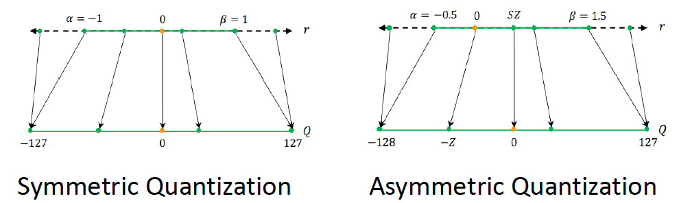

- [一 模型量化概述](#一-模型量化概述)
  - [1.1 模型量化优点](#11-模型量化优点)
  - [1.2 模型量化的方案](#12-模型量化的方案)
    - [1.2.1 PTQ 理解](#121-ptq-理解)
  - [1.3 量化的分类](#13-量化的分类)
    - [1.3.1 线性量化概述](#131-线性量化概述)
- [二 量化算术](#二-量化算术)
  - [2.1 定点和浮点](#21-定点和浮点)
  - [2.2 量化浮点](#22-量化浮点)
  - [2.2.1 对称量化](#221-对称量化)
  - [2.2.2 非对称量化](#222-非对称量化)
  - [2.2，量化算术](#22量化算术)
- [三，量化方法的改进](#三量化方法的改进)
  - [3.1，浮点数动态范围选择](#31浮点数动态范围选择)
  - [3.2，最大最小值（MinMax）](#32最大最小值minmax)
  - [3.3，滑动平均最大最小值(MovingAverageMinMax)](#33滑动平均最大最小值movingaverageminmax)
  - [3.4，KL 距离采样方法(Kullback–Leibler divergence)](#34kl-距离采样方法kullbackleibler-divergence)
  - [3.5，总结](#35总结)
- [参考资料](#参考资料)

> 总结线性量化优点、原理、方法和实战基础，主要参考 [神经网络量化简介](https://jackwish.net/2019/neural-network-quantization-introduction-chn.html) 并加以自己的理解和总结，适合初学者阅读和自身复习用。

## 一 模型量化概述

### 1.1 模型量化优点

模型量化指将权重为浮点数的 `FP32` 模型转换为定点数的 `INT8/INT4` 模型，其中包括两个过程：FP32 的浮点模型转为 INT8，以及使用 INT8 权重进行推理。量化推理和低精度（Low precision）推理意义相同。

- 低精度模型表示模型权重数值格式为 `FP16`（半精度浮点）或者 `INT8`（8位的定点整数），但是目前低精度往往就指代 `INT8`。
- 常规精度模型则一般表示模型权重数值格式为 `FP32`（32位浮点，单精度）。
- 混合精度（Mixed precision）则在模型中同时使用 `FP32` 和 `FP16` 的权重数值格式。 `FP16` 减少了一半的内存大小，但有些参数或操作符必须采用 `FP32` 格式才能保持准确度。

模型量化有以下好处：

> 参考[ TensorFlow 模型优化：模型量化-张益新](https://mp.weixin.qq.com/s/9QeVVESP3_rBZ6n_D96lwg)

+ **减小模型大小**：如 `int8` 量化可减少 `75%` 的模型大小，`int8` 量化模型大小一般为 `32` 位浮点模型大小的 `1/4`：
    + 减少存储空间：在端侧存储空间不足时更具备意义。
    + 减少内存占用：更小的模型当然就意味着不需要更多的内存空间。
    + 减少设备功耗：内存耗用少了推理速度快了自然减少了设备功耗；
+ **加快推理速度**，访问一次 `32` 位浮点型可以访问四次 `int8` 整型，整型运算比浮点型运算更快；`CPU` 用 `int8` 计算的速度更快
+ **某些硬件加速器如 DSP/NPU 只支持 int8**。比如有些微处理器属于 `8` 位的，低功耗运行浮点运算速度慢，需要进行 `8bit` 量化。

总结：模型量化主要意义就是加快模型端侧的推理速度，并降低设备功耗和减少存储空间，

工业界一般只使用 `INT8` 量化模型，如 `NCNN`、`TNN` 等移动端模型推理框架都支持模型的 `INT8` 量化和量化模型的推理功能。

通常，可以根据 `FP32` 和 `INT8` 的转换策略对**量化模型推理方案**进行分类。一些框架简单地引入了 `Quantize` 和 `Dequantize` 层，当从卷积或全链接层送入或取出时，它将 `FP32` 转换为 `INT8` 或相反。在这种情况下，如下图的上半部分所示，模型本身和输入/输出采用 `FP32` 格式。深度学习推理框架加载模型时，重写网络以插入 `Quantize` 和 `Dequantize` 层，并将权重转换为 `INT8` 格式。
> 注意，之所以要插入反量化层（`Dequantize`），是因为量化技术的早期，只有卷积算子支持量化，但实际网络中还包含其他算子，而其他算子又只支持 `FP32` 计算，因此需要把 INT8 转换成 FP32。但随着技术的迭代，后期估计会逐步改善乃至消除  `Dequantize` 操作，达成全网络的量化运行，而不是部分算子量化运行。

> 图四：混合 FP32/INT8 和纯 INT8 推理。红色为 FP32，绿色为 INT8 或量化。

其他一些框架将网络整体转换为 `INT8` 格式，因此在推理期间没有格式转换，如上图的下半部分。该方法要求算子（`Operator`）都支持量化，因为运算符之间的数据流是 `INT8`。对于尚未支持的那些，它可能会回落到 `Quantize/Dequantize` 方案。

### 1.2 模型量化的方案

在实践中将浮点模型转为量化模型的方法有以下三种方法：

1. `data free`：不使用校准集，传统的方法直接将浮点参数转化成量化数，使用上非常简单，但是一般会带来很大的精度损失，但是高通最新的论文 `DFQ` 不使用校准集也得到了很高的精度。
2. `calibration`：基于校准集方案，通过输入少量真实数据进行统计分析。很多芯片厂商都提供这样的功能，如 `tensorRT`、高通、海思、地平线、寒武纪
3. `finetune`：基于训练 `finetune` 的方案，将量化误差在训练时仿真建模，调整权重使其更适合量化。好处是能带来更大的精度提升，缺点是要修改模型训练代码，开发周期较长。

`TensorFlow` 框架按照量化阶段的不同，其模型量化功能分为以下两种：

+ Post-training quantization `PTQ`（训练后量化、离线量化）；
+ Quantization-aware training `QAT`（训练时量化，伪量化，在线量化）。

#### 1.2.1 PTQ 理解

`PTQ` `Post Training Quantization` 是训练后量化，也叫做离线量化，根据量化零点 $x_{zero}$ 是否为 `0`，训练后量化分为对称量化和非对称量化；根据数据通道顺序 `NHWC`(TensorFlow) 这一维度区分，训练后量化又分为逐层量化和逐通道量化。目前 `nvidia` 的 `TensorRT` 框架中使用了逐层量化的方法，每一层采用同一个阈值来进行量化。逐通道量化就是对每一层每个通道都有各自的阈值，对精度可以有一个很好的提升。

### 1.3 量化的分类

目前已知的加快推理速度概率较大的量化方法主要有：

1. **二值化**，其可以用简单的位运算来同时计算大量的数。对比从 nvdia gpu 到 x86 平台，1bit 计算分别有 5 到128倍的理论性能提升。且其只会引入一个额外的量化操作，该操作可以享受到 SIMD（单指令多数据流）的加速收益。
2. **线性量化**(最常见)，又可细分为非对称，对称和 `ristretto` 几种。在 `nvdia gpu`，`x86`、`arm` 和 部分 `AI` 芯片平台上，均支持 `8bit` 的计算，效率提升从 `1` 倍到 `16` 倍不等，其中 `tensor core` 甚至支持 `4bit`计算，这也是非常有潜力的方向。线性量化引入的额外量化/反量化计算都是标准的向量操作，因此也可以使用 `SIMD` 进行加速，带来的额外计算耗时不大。
3. **对数量化**，一种比较特殊的量化方法。两个同底的幂指数进行相乘，那么等价于其指数相加，降低了计算强度。同时加法也被转变为索引计算。目前 `nvdia gpu`，`x86`、`arm` 三大平台上没有实现对数量化的加速库，但是目前已知海思 `351X` 系列芯片上使用了对数量化。

#### 1.3.1 线性量化概述

与非线性量化不同，线性量化采用均匀分布的聚类中心，原始浮点数据和量化后的定点数据存在一个简单的线性变换关系，因为卷积、全连接等网络层本身只是简单的线性计算，因此线性量化中可以直接用量化后的数据进行直接计算。

根据量化前后浮点空间中的零的量化值是否依然是 0，可以将浮点数的线性量化分为两类-**对称量化** Symmetric Quantization 和**非对称量化** Asymmetric Quantization。

## 二 量化算术

**模型量化过程可以分为两部分：将模型从 FP32 转换为 INT8，以及使用 INT8 进行推理**。本节说明这两部分背后的算术原理。如果不了解基础算术原理，在考虑量化细节时通常会感到困惑。

### 2.1 定点和浮点

**定点和浮点都是数值的表示**（representation），它们区别在于，将整数（integer）部分和小数（fractional）部分分开的点，点在哪里。**定点保留特定位数整数和小数，而浮点保留特定位数的有效数字（significand）和指数（exponent）**。

绝大多数现代的计算机系统采纳了**浮点数表示方式**，这种表达方式利用科学计数法来表达实数。即用一个尾数(Mantissa，尾数有时也称为有效数字，它实际上是有效数字的非正式说法)，一个基数(Base)，一个指数(Exponent)以及一个表示正负的符号来表达实数。具体组成如下：

- 第一部分为 `sign` 符号位 $s$，占 1 bit，用来表示正负号；
- 第二部分为 `exponent` 指数偏移值 $k$，占 8 bits，用来表示其是 2 的多少次幂；
- 第三部分是 `fraction` 分数值（有效数字） $M$，占 23 bits，用来表示该浮点数的数值大小。

基于上述表示，浮点数的值可以用以下公式计算：

$$(-1)^s \times M \times 2^k$$

值得注意是，上述公式隐藏了一些细节，如指数偏移值 $k$ 使用的时候需要加上一个固定的偏移值。

比如 `123.45` 用十进制科学计数法可以表示为 $1.2345\times 10^2$，其中 `1.2345` 为尾数，`10` 为基数，`2` 为指数。

单精度浮点类型 `float` 占用 `32bit`，所以也称作 `FP32`；双精度浮点类型 `double` 占用 `64bit`。

> 图五：定点和浮点的格式和示例。

### 2.2 量化浮点

`32-bit` 浮点数和 `8-bit` 定点数的表示范围如下表所示：

|数据类型|最小值|最大值|
|------------|---------|----------|
|`FP32`| -3.4e38|3.4e38|
|`int8`|-128|128|
|`uint8`|0|255|

神经网络的推理由浮点运算构成。`FP32` 和 `INT8` 的值域是 $[(2−2^{23})×2^{127},(2^{23}−2)\times 2^{127}]$ 和 $[−128,127]$，而取值数量大约分别为 $2^{32}$ 和 $2^8$ 。`FP32` 取值范围非常广，因此，将网络从 `FP32` 转换为 `INT8` 并不像数据类型转换截断那样简单。

值的注意的是，一般神经网络层权重的值分布范围很窄，非常接近零。图八给出了 `MobileNetV1` 中十层（拥有最多值的层）的权重分布。

> 图八：十层 MobileNetV1 的权重分布。

### 2.2.1 对称量化

对称量化的浮点值和 `8` 位定点值的映射关系如下图，从图中可以看出，对称量化就是将一个 `tensor` 中的 $\left[-max(\left|x\right|),max(\left|x\right|)\right]$ 内的 `FP32` 值分别映射到 `8 bit` 数据的 `[-128, 127]` 的范围内，中间值按照线性关系进行映射，称这种映射关系是对称量化。可以看出，对称量化的浮点值和量化值范围都是相对于零对称的，所以叫对称量化。

 
假设 $x_f$ 表示 FP32 权重 $x_{float}$， $x_q$ 表示量化的 INT8 权重值（整数）$x_{quantized}$，$x_s$ 是缩放因子 $x_{scale}$（映射因子、量化尺度（范围）、FP32 的缩放系数）。对权权值和数据的量化可以归结为寻找 $scale$ 的过程，量化方法的改进本质上是选择最优 $scale$ 值的过程。

$$x_f = x_s \times x_q$$

对称量化的一个最经典方法是**最大绝对值量化**，它对所有数据取绝对值操作，使得量化前浮点数取值范围变为 $\left[0, max(\left|x\right|)\right]$，量化后取值范围变为 $\left[0, 2^N - 1\right]$，对于 INT8 量化则是 $[0, 127]$，由此，缩放因子 $scale$ 和量化值的计算公式如下:

$$x_s = \frac{max(\left|x\right|)}{127} \\
x_q = round(\frac{x_f}{x_s})
$$
> `round` 为取整函数。

### 2.2.2 非对称量化

因为对称量化的缩放方法可能会将 FP32 零映射到 INT8 零，但我们不希望这种情况出现，于是出现了数字信号处理中的均一量化，即**非对称量化**。数学表达式如下所示，其中 $x_{zero}$ 表示量化零点（量化偏移），也的文章写作 $offset\in [-128, 127]$。

$$x_f = x_s \times (x_q - x_{zero})$$

大多数情况下量化是选用无符号整数，即 `UINT8` 的值域就为 $[0,255]$ ，这种情况，更能体现非对称量化的意义。非对称量化的浮点值和 `UINT8` 量化值的映射关系如下图：

**权重参数的非对称量化算法可以分为两个步骤**：

1. 通过在权重张量（Tensor）中找到 $min$ 和 $max$ 值从而确定缩放系数 $x_s$ 和零点偏移值 $x_{zero}$。
2. 将权重张量的每个值从 FP32 转换为 INT8。
  
$$\begin{align}
x_f &\in [x_f^{min}, x_f^{max}] \\
x_s &= \frac{x_f^{max} - x_f^{min}}{x_q^{max} - x_q^{min}} \\
x_{zero} &= x_q^{max} - x_f^{max} \div x_s \\
x_q &= round(\frac{x_f}{x_s}) + x_{zero}
\end{align}$$

注意，当浮点运算结果不等于整数时，需要**额外的取整操作 `round`**。例如将 FP32 值域 [−1,1] 映射到 INT8 值域 [0,255]，有 $x_s=\frac{2}{255}$，而 $x_{zero}= 255−\frac{255}{2}≈127$。

注意，量化过程中存在误差是不可避免的，就像数字信号处理中量化一样。**非对称算法一般能够较好地处理数据分布不均匀的情况**。

总结：非对称量化可以看作是非对称量化 $x_{zero} = 0$ 的特例。

### 2.2，量化算术

量化的一个重要问题是**如何用量化算术表示非量化算术**，在支持量化模型推理的推理框架中，就是指量化 `kernel`（INT8 Kernel） 如何实现，用于替代常规神经网络的 FP32 计算。量化算术表示的原理和浮点乘法过程非常相似。
> 量化 kernel 代码可能会涉及到反量化过程，也就是如何将 `INT8` 的定点数据反量化成 `FP32` 的浮点数据。

下面的等式 5-10 是量化（定点）乘法替代非量化（非定点）乘法的计算过程。

$$\begin{align}
z_{float} & = x_f \cdot y_{f} \\
z_{s} \cdot (z_q - z_{zero})
& = (x_s \cdot (x_q - x_{zero})) \cdot
(y_s \cdot (y_q - y_{zero})) \\
z_q - z_{zero}
&= \frac{x_s \cdot y_s}{z_{s}} \cdot
(x_q - x_{zero}) \cdot (y_q - y_{zero}) \\
z_q
&= \frac{x_s \cdot y_s}{z_{s}} \cdot
(x_q - x_{zero}) \cdot (y_q - y_{zero}) + z_{zero} \\
\alpha &= \frac{x_s \cdot y_s}{z_{s}} \\
z_q
&= \alpha \cdot (x_q - x_{zero}) \cdot
(y_q - y_{zero}) + z_{zero} \\
\end{align}$$

> 等式：量化乘法运算。

对于给定神经网络，在完成 fp32 模型量化成 int8 模型之后，输入 $x$、权重 $y$ 和输出 $z$ 的缩放因子 $scale$ 肯定是已知的，因此等式 14 的 $\alpha = \frac{x_s y_s}{z_{s}}$ 也是已知且是 `FP32` 常数，在量化 kernel 运行之前提前计算好的。对于等式 `10` 可以应用的大多数情况，**$quantized$ 和 $zero\_point$ 的变量 $(x,y)$ 都是 `INT8` 类型，$scale$ 变量是 `FP32`**。

由此，可知除了 $\alpha$ 和 $(x_q - x_{zero})\cdot (y_q - y_{zero})$ 之间的乘法外，等式 10 中的其他运算都是量化运算。

另外，两个 `INT8` 之间的算术运算会累加到 `INT16` 或 `INT32`，这时 `INT8` 的值域可能无法保存运算结果。例如，对于 $x_q=20$、$x_{zero} = 50$ 的情况，有 $(x_q − x_{zero}) = −30$ 超出 `INT8` 值范围 $[0,255]$。

数据类型转换可能将 $\alpha \cdot (x_q - x_{zero}) \cdot (y_q - y_{zero})$ 转换为 INT32 或 INT16，结合 $ + z_{zero}$ 一起可以确保计算结果几乎全部落入 INT8 值域 [0,255] 中。

对于以上情况，在工程中，比如对于卷积算子的计算，`sum(x*y)` 的结果需要用 INT32 保存，同时，`b` 值一般也是 `INT32` 格式的，之后再 `requantize` (重新量化)成 `INT8`。

除了量化乘法和加法外，常见的还有量化除法、减法、指数等数值计算，它们都有量化乘法的这些操作，也都有特定的方法分界为乘法和加法。采用这些方法，量化神经网络可以运行得到和原始网络一样有效的结果。

## 三，量化方法的改进

量化浮点部分中描述权重浮点量化方法是非常简单的。在深度学习框架的早期开发中，这种简单的方法能快速跑通 `INT8` 推理功能，然而采用这种方法的网络的预测准确度通常会出现明显的下降。

虽然 FP32 权重的值域很窄，在这值域中数值点数量却很大。以上文的缩放为例，$[−1,1]$ 值域中 $2^{31}$（是的，基本上是总得可表示数值的一半）个 FP32 值被映射到 $256$ 个 INT8 值。

+ 量化类型：（`SYMMETRIC`） 对称量化和 (`NON-SYMMETRIC`） 非对称量化；
+ 量化算法：`MINMAX`、`KL` 散度、`ADMM`；
+ 权重量化类型：`per-channel` `per-layer`；

采用普通量化方法时，靠近零的浮点值在量化时没有精确地用定点值表示。因此，与原始网络相比，量化网络一般会有明显的精度损失。对于线性（均匀）量化，这个问题是不可避免的。

同时值映射的精度是受由 $x_f^{min}$ 和 $x_f^{max}$ 得到的 $x_s$ 显著影响的。并且，如图十所示，权重中邻近 $x_f^{min}$ 和 $x_f^{max}$ 附近的值通常是可忽略的，其实就等同于**映射关系中浮点值的 `min` 和 `max` 值是可以通过算法选择的**。

> 图十将浮点量化为定点时调整最小值-最大值。

上图展示了可以调整 `min/max` 来选择一个值域，使得值域的值更准确地量化，而范围外的值则直接映射到定点的 min/max。例如，当从原始值范围 $[−1,1]$ 中选定$x_{min}^{float} = −0.9$ 和 $x_{max}^{float} = 0.8$ ，$[−0.9,0.8]$ 中的值将能更准确地映射到 $[0,255]$ 中，而 $[−1,−0.9]$ 和 $[0.8,1]$ 中的值分别映射为 $0$ 和 $255$。

### 3.1，浮点数动态范围选择

> 参考[干货：深度学习模型量化（低精度推理）大总结](https://mp.weixin.qq.com/s/LR3Z2rlkxdl-1KnsU734VQ)。

通过前文对量化算数的理解和上面两种量化算法的介绍我们不难发现，为了计算 `scale` 和 `zero_point`，我们需要知道 `FP32 weight/activation` 的实际动态范围。对于推理过程来说，`weight` 是一个常量张量，动态范围是固定的，`activation` 的动态范围是变化的，它的实际动态范围必须经过采样获取（一般把这个过程称为数据校准(`calibration`)）。

将浮点量化转为定点时调整最小值/最大值（**值域调整**），也就是浮点数动态范围的选择，**动态范围的选取直接决定了量化数据的分布情况，处于动态范围之外的数据将被映射成量化数据的边界点，即值域的选择直接决定了量化的误差**。

目前各大深度学习框架和三大平台的推理框架使用最多的有最大最小值（`MinMax`）、滑动平均最大最小值（`MovingAverageMinMax`）和 `KL` 距离（Kullback-Leibler divergence）三种方法，去确定浮点数的动态范围。如果量化过程中的每一个 `FP32` 数值都在这个实际动态范围内，我们一般称这种为不饱和状态；反之如果出现某些 `FP32` 数值不在这个实际动态范围之内我们称之为饱和状态。

### 3.2，最大最小值（MinMax）

`MinMax` 是使用最简单也是较为常用的一种采样方法。基本思想是直接从 `FP32` 张量中选取最大值和最小值来确定实际的动态范围，如下公式所示。

$$x_{min} = \left\{\begin{matrix}min(X) & if\ x_{min} = None \\  min(x_{min}, min(X))  & otherwise\end{matrix}\right. \\
x_{max} = \left\{\begin{matrix}max(X) & if\ x_{max} = None \\  max(x_{max}, max(X))  & otherwise\end{matrix}\right.$$

对 `weights` 而言，这种采样方法是不饱和的，但是对于 `activation` 而言，如果采样数据中出现离群点，则可能明显扩大实际的动态范围，比如实际计算时 `99%` 的数据都均匀分布在 `[-100, 100]` 之间，但是在采样时有一个离群点的数值为 `10000`，这时候采样获得的动态范围就变成 `[-100, 10000]`。

### 3.3，滑动平均最大最小值(MovingAverageMinMax)

与 `MinMax` 算法直接替换不同，MovingAverageMinMax 会采用一个超参数 `c` (Pytorch 默认值为0.01)逐步更新动态范围。

$$x_{min} = \left\{\begin{matrix}min(X) & if x_{min} = None \\ (1-c)x_{min}+c \; min(X) & otherwise\end{matrix}\right.\\ 
x_{max} = \left\{\begin{matrix}max(X) & if x_{max} = None \\  (1-c)x_{max}+c \; max(X) & otherwise\end{matrix}\right.$$

这种方法获得的动态范围一般要小于实际的动态范围。对于 weights 而言，由于不存在采样的迭代，因此 MovingAverageMinMax 与 MinMax 的效果是一样的。

### 3.4，KL 距离采样方法(Kullback–Leibler divergence)

理解 KL 散度方法之前，我们先看下 `TensorRT` 关于值域范围阈值选择的一张图：

这张图展示的是不同网络结构的不同 `layer` 的激活值分布统计图，横坐标是激活值，纵坐标是统计数量的归一化表示，而不是绝对数值统计；图中有卷积层和池化层，它们之间分布很不相同，因此合理的量化方法应该是适用于不同的激活值分布，并且减小信息损失，因为从 `FP32` 到 `INT8` 其实也是一种信息再编码的过程。

简单的将一个 tensor 中的 `-|max|` 和 `|max|` FP32 value 映射为 -127 和 127 ，中间值按照线性关系进行映射，这种映射关系为不饱和的（No saturation），即对称的。对于这种简单的量化浮点方法，试验结果显示会导致比较大的精度损失。

通过上图可以分析出，线性量化中使用简单的量化浮点方法导致精度损失较大的原因是：

+ 上图的激活值统计针对的是一批图片，不同图片输出的激活值不完全相同，所以图中是多条曲线而不是一条曲线，曲线中前面一部分数据重合在一起了（红色虚线），说明不同图片生成的大部分激活值其分布是相似的；但是在曲线的右边，激活值比较大时（红色实现圈起来的部分），曲线不重复了，一个激活值会对应多个不同的统计量，这时激活值分布是比较乱的。
+ 曲线后面激活值分布比较乱的部分在整个网络层占是占少数的（比如 $10^-9$, $10^-7$, $10^-3$），因此曲线后面的激活值分布部分可以不考虑到映射关系中，只保留激活值分布的主方向。

一般认为量化之后的数据分布与量化前的数据分布越相似，量化对原始数据信息的损失也就越小，即量化算法精度越高。`KL` 距离(也叫 `KL` 散度)一般被用来度量两个分布之间的相似性。这里的数据分布都是离散形式的，其离散数据的 KL 散度公式如下：

$$D_{KL}(P \| Q) = \sum_i P(i)log_{a} \frac{P(i)}{Q(i)} = \sum_i P(i)[logP(x) - log Q(x)]$$

式中 P 和 Q 分布表示量化前 FP32 的数据分布和量化后的 INT8 数据分布。注意公式要求 P、Q 两个统计直方图长度一样（也就是 bins 的数量一样）。

TensorRT 使用 KL 散度算法进行量化校准的过程：首先在校准集上运行 FP32 推理，然后对于网络每一层执行以下步骤：

1. 收集激活输出的直方图。
2. 生成许多具有不同饱和度阈值的量化分布。
3. 选择最小化 KL_divergence(ref_distr, quant_distr) 的阈值 `T`，并确定 `Scale`。

以上使用校准集的模型量化过程通常只需几分钟时间。

### 3.5，总结

量化方法总结：
+ 对称的，不饱和的线性量化，会导致精度损失较大；
+ 通过最小化 `KL` 散度来选择饱和量化中的 阈值 `|T|`;

量化实战经验：

1. 量化是一种已经获得了工业界认可和使用的方法，在训练 (Training) 中使用 `FP32` 精度，在推理 (Inference) 期间使用 `INT8` 精度的这套量化体系已经被包括 `TensorFlow`，`TensorRT`，`PyTorch`，`MxNet` 等众多深度学习框架和启用，地平线机器人、海思、安霸等众多 `AI` 芯片厂商也在深度学习工具链中提供了各自版本的模型量化功能。
2. 量化是一个大部分硬件平台都会支持的，因此比较常用；知识蒸馏有利于获得小模型，还可以进一步提升量化模型的精度，所以这个技巧也会使用，尤其是在有已经训好比较强的大模型的基础上会非常有用。剪枝用的会相对较少，它和网络结构搜索 NAS 算法功能很像。

## 参考资料

- [NCNN Conv量化详解（一）](https://zhuanlan.zhihu.com/p/71881443)
- [卷积神经网络优化算法](https://jackwish.net/2019/convolution-neural-networks-optimization.html)
- [神经网络量化简介](https://jackwish.net/2019/neural-network-quantization-introduction-chn.html)
- [QNNPACK 实现揭秘](https://jackwish.net/2019/reveal-qnnpack-implementation.html)
- 《8-bit Inference with TensorRT》
