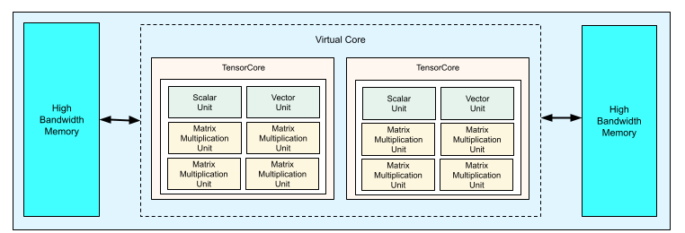
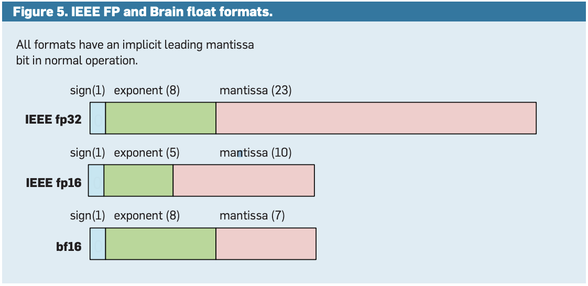

## 一，TPU

张量处理单元 (TPU) 是 Google 设计的**机器学习加速器**，支持  [TensorFlow](https://www.tensorflow.org/?hl=zh-cn)、[Pytorch](https://cloud.google.com/tpu/docs/tutorials/pytorch-pod?hl=zh-cn) 和 [JAX](https://jax.readthedocs.io/en/latest/ 机器学习框架。

TPU 芯片上的每个 `TensorCore` 都由一个或多个矩阵乘法单元 (`MXU`)、向量和标量单元组成。

`MXU` 由[脉动阵列](https://en.wikipedia.org/wiki/Systolic_array)中的 $128 \times 128$ 乘法/累加器组成。MXU 可在 TensorCore 中提供大部分计算能力。每个 MXU 能够在每个周期中执行 16K 乘法累加运算。所有乘法都接受 [bfloat16](https://cloud.google.com/tpu/docs/bfloat16?hl=zh-cn) 输入，但所有累积都以 FP32 数字格式执行。

矢量单位用于激活和 `softmax` 等常规计算。标量单元用于控制流、计算内存地址和其他维护操作。

### 1.1，TPU v4

TPU v2 于 2018 年上市，TPU v3 于 2019 年上市，TPU v4 于 2020 年推出，其中 TPU v4 是 Google **最新一代**的自定义机器学习加速器。

每个 v4 TPU 芯片包含两个 TensorCore。每个 TensorCore 都有四个 MXU、一个矢量单位和一个标量单位。下表显示了 v4 TPU Pod 的主要规范及其值。

| **主要规范**             | **v4 Pod 值**                      |
| :----------------------- | :--------------------------------- |
| 每个芯片的峰值计算       | 275 万亿次浮点运算（bf16 或 int8） |
| HBM2 容量和带宽          | 32 GiB、1200 GBps                  |
| 测量的最小/平均/最大功率 | 90/170/192 瓦                      |
| TPU Pod 大小             | 4096 条状标签                      |
| 互连拓扑                 | 3D 环面                            |
| 每个 Pod 的峰值计算      | 1.1 万亿次浮点运算（bf16 或 int8） |
| 每个 Pod 的全宽带宽      | 1.1 PB/秒                          |
| 每个 Pod 的对分带宽      | 24 TB/秒                           |

> 275 万亿次浮点运算就是 275T 算力，这算力有点夸张啊。

### 1.2，IEEE FP 和 BFP 格式

## 参考资料

1. [Cloud TPU 系统架构](https://cloud.google.com/tpu/docs/system-architecture-tpu-vm?hl=zh-cn)
2. https://dl.acm.org/doi/pdf/10.1145/3360307