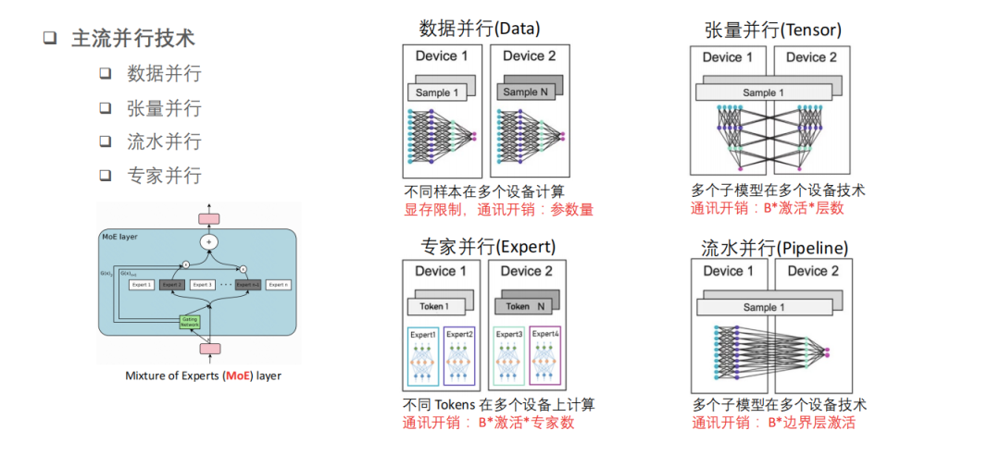
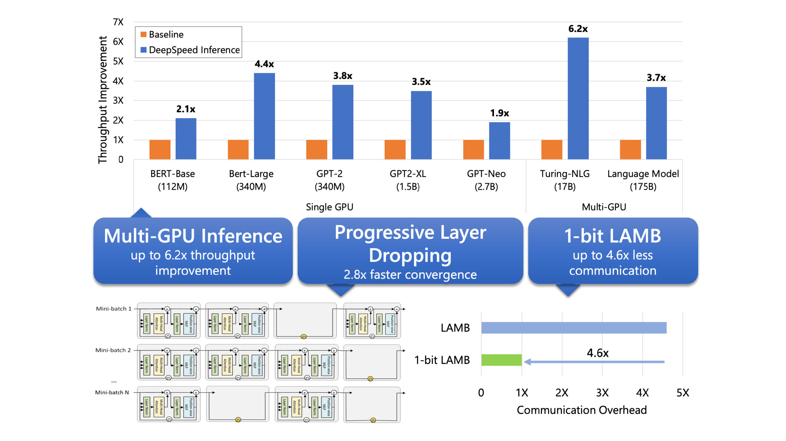
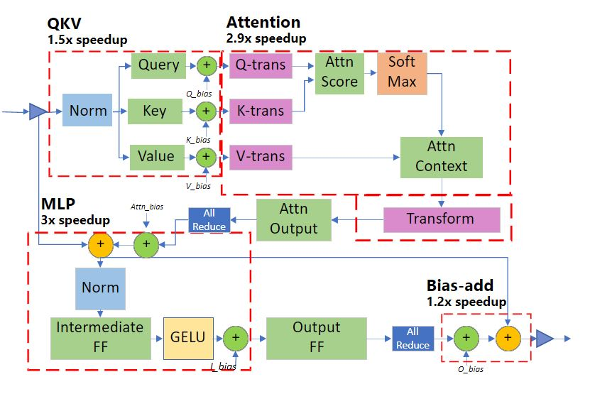
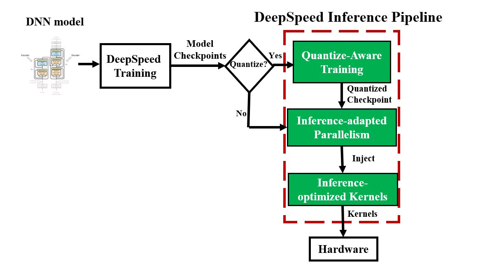
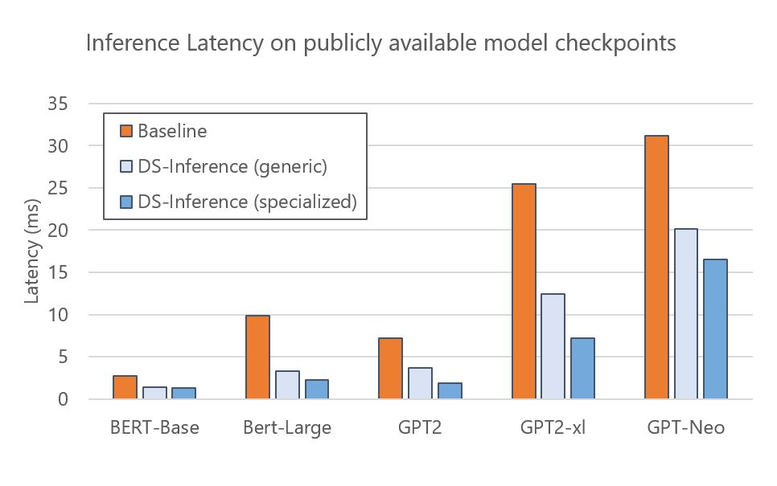
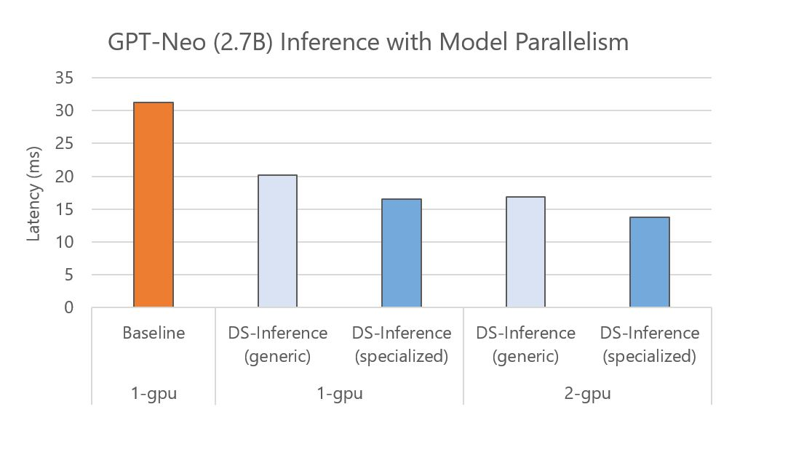
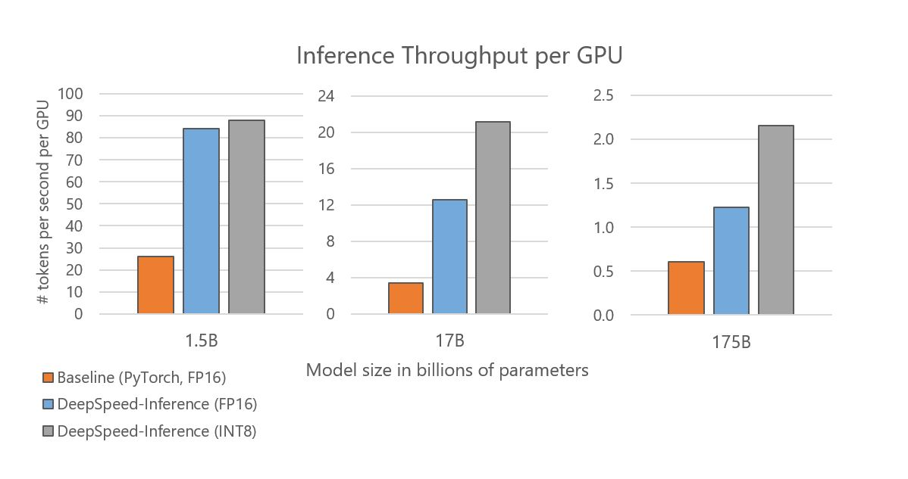
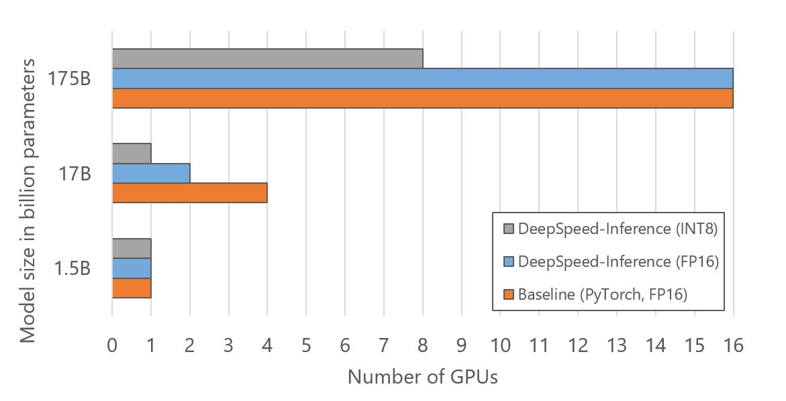
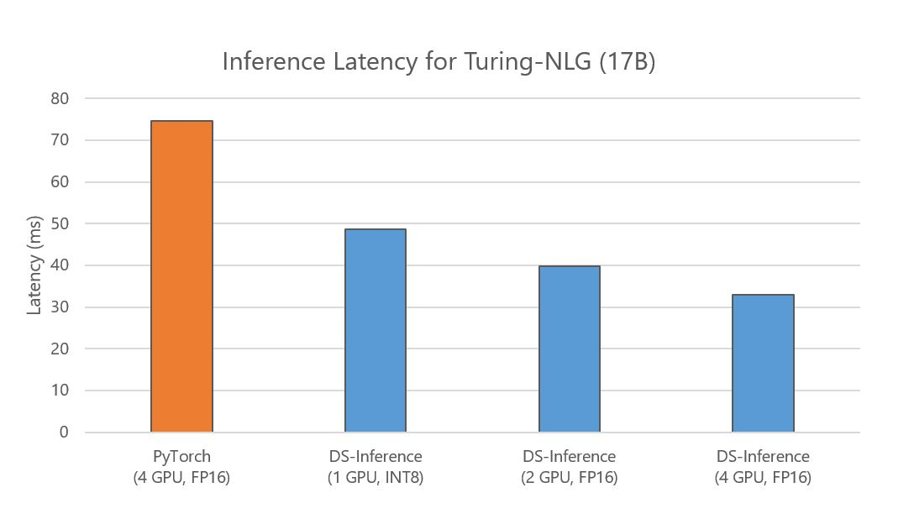

## 一，背景知识

### 1.1，LLM 应用的难点

**1，模型训练时间过长**

伴随着 Transformer 结构的提出，后续 LLM 参数开始从亿级到百亿、乃至万亿级增长，与超高速增长到模型参数量相比， GPU 显存的增长实属有限，有数据显示每 18 个月仅翻了 1.7 倍。模型参数量的增长和硬件的显存的增长之间的差距越来越大，但从目前趋势看，超大的计算量和参数量是目前 LLM 训练和推理的必经之路。在千亿模型上训练就需要 1.5TB 显存，**但目前 NVIDIA 最新的专业级显卡 H100 SXM 显存也只有 80GB，算力只有 67TFLOPS（FP32）**。

除了显存不足和算力不够的问题，LLM 训练还伴随着高质量的大规模数据集以及超长的训练时间也是目前所面临的问题。

**2，模型推理效率过低**

LLM 的高效推理是实现 LLM工程应用的关键技术。和 LLM 训练环节相比，推理环节在计算精度（FP16/INT8）、算力消耗量等方面的要求较低，但 GPU 显存不足的问题同样会出现在推理环节。此外，**模型推理速度受限于通信延迟和硬件内存带宽**。如何保持低延迟的前提下，还尽可能节省计算资源和使现有显存满足推理的要求，是我们依然面临的问题。

> 模型推理显存需求过高，可通过模型/张量并行技术来解决，但过多的 GPU 并行，会增加跨 GPU 通信时间和降低每个 GPU 的计算粒度，从而导致最终结果是增加而不是减少延迟（latency）的问题。

**3，模型部署相对复杂**

部署是 LLM 应用的最后一步，其决定了  LLM 能否成功落地。

### 1.2，LLM 加速-混合并行训练

目前 `LLM` 训练的并行策略包括：

1. **数据并行技术**（`Data Parallelism`）：每批输入的训练数据都在数据并行的 worker 之间平分，即不同样本在不同 `GPU` 设备上完成前向推理和反向传播计算，此外，向传播后需要通信并规约梯度，以保证优化器在各个 `worker` 上进行相同的更新。
2. **张量/模型并行技术**（`Model Parallelism`）：在多个 worker 之间划分模型的各个层，即不同层分配到不同 gpu 设备上分别完成计算。值得注意的是，模型并行性的计算和通信方法因模型结构而异，即实际实现上有很大工作量，针对不同 LLM 需要分别适配。
3. **流水并行技术**（`Pipeline Parallelism`）:  朴素的模型并行存在 GPU 利用度不足，中间结果消耗内存大的问题。而 Gpipe 提出的流水线并行，就是用来解决这两个主要问题的。流水线并行分阶段(stage)运行模型，不同阶段之间可以流水化执行。流水线并行的核心思想是：**在模型并行的基础上，进一步引入数据并行的办法，即把原先的数据再划分成若干个 batch，送入 GPU 进行训练**。未划分前的数据，叫 `mini-batch`。在 mini-batch 上再划分的数据，叫 `micro-batch`。



> 流水并行以前也叫层间模型并行(inter-layer parallelism)。

### 1.3，Progressive Layer Dropping

`Progressive Layer Dropping`（渐进式层丢弃）是一种用于深度神经网络的正则化方法，旨在减少模型容量和提高泛化能力。

它通过在训练过程中逐渐丢弃网络的一部分层来实现（思想上很像模型剪枝），具体来说：
1. 渐进式层丢弃首先训练模型的所有层，并计算每个层的重要性得分。这些得分可以通过各种指标进行计算，例如梯度范数、参数敏感度等
2. 然后，根据得分对层进行排序，从得分较低的层开始逐步丢弃。在每个训练迭代中，一定比例的低重要性层将被随机选择并从网络中移除，使得网络逐渐变浅。

### 1.4，LAMB

`LAMB`（Layer-wise Adaptive Moments for Batch Normalization）是一种用于深度学习模型优化的优化算法。它结合了 Adam 优化器和 Layer Normalization 的思想，旨在解决训练深度神经网络时遇到的梯度稀疏性和参数不稳定性问题。

## 二，DeepSpeed 框架的推理优化概述



我们都知道大语言模型（LLM）的计算成本极高，且在许多实际场景中都会有响应速度太慢的问题，总结起来就是 LLM 的推理的有两个主要挑战：延迟（lateny）和成本（cost）。为了适应更大的模型，并实现更快、更便宜的推理，deepspeed 框架添加了 DeepSpeed Inference-具有高性能多 GPU 推理功能。

DeepSpeed 支持 chatglm-6b 到 GPT-3 175B 等规模大模型，其用于优化推理成本和延迟的新技术主要包括：
1. **推理自适应并行性**（`Inference-adapted parallelism`）：允许用户通过适应多 GPU 推理的最佳并行策略来有效地服务大型模型，同时考虑推理延迟和成本。
2. **针对推理优化的 CUDA 内核**（`Inference-optimized CUDA kernels`）：通过深度融合和新颖的内核调度充分利用 GPU 资源，从而提高每个 GPU 的效率。
3. **有效的量化感知训练**（`Effective quantize-aware training`）：支持量化后的模型推理，如 INT8 推理，模型量化可以节省内存（memory）和减少延迟（latency），同时不损害准确性。

与现有工作相比，`DeepSpeed Inference` 模块同时带来了约 1.9–4.4 倍的延迟加速（latency speedups）和 3.4–6.2 倍的吞吐量增益和成本降低（throughput gain and cost reduction）。

在 LLM 工作中，研究员和工程师的除了模型推理的低延迟和低成本诉求，另一个关键诉求就是在不增加额外硬件的前提下减少大模型的训练时间，为此 deepspeed 框架提供了三种技术：
1. **新的压缩训练策略**：大模型训练期间，通过 `Progressive Layer Dropping` 利用 Transformer 层中粗粒度的**稀疏性**来降低训练成本，从而在不影响准确性的情况下使收敛速度提高 2.8 倍。
2. **1 bit 的 LAMB**：实现了大模型训练的高效通信，通信量减少 4.6 倍，即使在具有低带宽互连的集群中也能加速大型模型的训练。
3. **DeepSpeed Profiler 性能工具**：通过显示模型复杂性和训练效率，以帮助用户识别性能瓶颈。

## 三， DeepSpeed 多 GPU 推理优化

虽然 DeepSpeed 支持高级大规模模型多训练，但是目前（2021年）的推理解决方案有三大局限性：
1. 对大规模模型缺乏多 GPU 支持并满足延迟要求；
2. 在小批量（small batch size）推理时，GPU 内核性能有限；
3. 难以利用量化，既包括量化模型来减少模型大小，以及支持量化模型的高性能推理且无需专门硬件来减少延迟。

下文是用于优化推理成本和延迟新技术的详细描述。

### 3.1，推理适应性并行（Inference-adapted parallelism）

大规模模型的推理显存需求过高，通常单个 GPU 的显存是不够的，因此**支持多 GPU 并行是大模型推理技术优化的第一步**。此外，通过将推理工作负载拆分到多个 GPU 上，**多 GPU 推理还能减少推理延迟**（inference latency），以满足实际生产环境当中对延迟到严格要求。值得注意的是，多 GPU 并行度选择需要慎重，毕竟过多的 GPU 并行，会增加跨 GPU 通信时间和降低每个 GPU 的计算粒度，从而导致最终结果是增加而不是减少延迟（latency）的问题。因此，为了满足延迟要求同时减少并行开销，有必要调整并行度，并确定给定模型体系结构和硬件平台的最佳值。我们将这种能力称为**推理适应并行性**。

对于 Transformer 架构的大模型，DeepSpeed 无缝支持 Inference-adapted parallelism 技术。在 DeepSpeed 模式下，模型训练权重可以被加载并指定并行度。在这个过程中，`DeepSpeed Inference` 会自动将模型分割到指定数量的 GPU 上，并插入为 Transformer 模型运行多 GPU 推理所需的必要通信代码——用户无需更改模型代码。

### 3.2，推理优化内核（Inference-optimized kernels）

对于小批量的模型的高效率推理，主要有两个挑战：
1. 内核调用时间和主内存延迟成为主要瓶颈；
2.  默认的 `GeMM`（通用矩阵乘法）库没有针对极小的批量大小进行很好的调整，导致性能不佳。

DeepSpeed Inference 模块为 Transformer 模块提**供推理内核**，并通过以下**两种内核优化技术**来显著减少延迟和提高吞吐量。

**深度融合**（Deep fusion）：`DeepSpeed Inference` 可以将多个运算符融合到一个内核中（算子融合），以减少内核调用次数和跨内核访问主内存的延迟。虽然内核融合是 PyTorch JIT 编译器、Tensorflow XLA 等常用技术，但 DeepSpeed 中的深度融合是不同的。与主要融合逐元素运算的现有融合技术不同，DeepSpeed 中的深度融合**可以将逐元素运算、矩阵乘法、转置和归约（reductions）融合到一个内核中**，显着减少内核调用次数以及主内存访问次数以减少主存访问延迟。

**针对推理定制的 GEMM**（Inference-customized GeMM）：小批量导致**瘦 GeMM 操作**，其中激活是瘦矩阵，而参数是比激活大得多的矩阵，并且每个参数的总计算量受批量大小的限制。**这会导致 GeMM 的性能主要取决于从主内存读取参数所花费的时间，而不是 GPU 计算时间本身**。因此，为了达到最佳性能，对 DeepSpeed 推理内核进行了微调，以最大限度地利用内存带宽来加载参数。这项优化使得 DeepSpeed 推理内核在批量大小为 1-10 的推理工作负载上，实现比 NVIDIA cuBLAS 库高出 20% 的性能。



> 图 1：专用 Transformer 内核中的深度融合。该图说明了我们的内核融合方案，融合在一起的操作以红色虚线显示。与默认的非融合版本相比，加速数字显示了我们为 Transformer 层的每个部分获得的改进。

#### 3.2.1，通用和专用 Transformer 内核

DeepSpeed Inference 由两组包含上述优化的 Transformer 内核组成：
- `Generic Transformer` ：使用深度融合技术，将 Transformer 中的各个 PyTorch 操作（如 LayerNorm、Softmax 和 bias-add）替换为高度优化的 DeepSpeed 版本。
- `Specialized Transformer` ： 进一步利用深度融合技术，创建了融合调度，不仅在PyTorch的宏操作符（如Softmax）内部融合微操作符，还在多个宏操作符（如 Softmax 和 LayerNorm，以及转置操作和甚至GeMM）之间进行融合。专门的 Transformer 内核的融合结构如图 1 所示。


### 3.3，灵活的量化支持（Flexible quantization support）

早期的 DeepSpeed 为进一步降低大模型的推理成本，开发了 DeepSpeed Quantization Toolkit，主要包括两个部分：

1，**量化混合** DeepSpeed Mixture-of-Quantization (MoQ) ：是**一种新的量化感知训练（QAT）方法**，它的设计主要基于以下观察：小批量的大模型推理时间主要由主内存的参数加载时间决定。因此，仅量化参数就足以实现推理性能改进？而激活可以计算并存储在 FP16 中。基于这个理念，MoQ 利用 DeepSpeed 中现有的 FP16 混合精度训练管道（training pipeline）来支持训练期间参数的无缝量化。它简单地将 FP32 参数值转换为较低精度（`INT4`、`INT8` 等），然后在权重更新期间将它们存储为 `FP16` 参数（FP16数据类型，但值映射到较低精度）。

这种方法具有三个优点：1）它不需要用户更改任何代码；2）不需要在训练期间使用实际的低精度数据类型或专用内核；3）它允许在训练过程中动态调整量化位数，提供了灵活的量化时间表和策略。例如，MoQ 可以利用训练过程中的二阶信息（如 Q-BERT 中所示），自适应地调整量化时间表和每个模型层的目标位数。

通过使用未量化的激活值、灵活的量化时间表和使用二阶信息的自适应目标，**与相同压缩比的传统量化方法相比，MoQ 在准确性方面更加稳健**。

2，**高性能 INT8 推理内核**：是前面讨论过的通用和专用 Transformer 内核的扩展版本，**用于与使用 MoQ 训练的 INT8 参数模型配合使用**。这些内核提供了与 FP16 版本相同的一系列优化，但加载的不是来自主存的 FP16 参数，而是 INT8 参数。**一旦参数加载到寄存器或共享内存中，它们会在被用于推理计算之前即时转换为 FP16**。加载 INT8 而不是 FP16 可以将数据从主存的传输量减少一半，从而提高推理性能高达 2 倍。

### 3.4，模型压缩模块（DeepSpeed Compression）

**最新版本的 DeepSpeed 提供了 Compression 模块，以实现更快的模型压缩、更好的模型质量和更低的压缩成本**。DeepSpeed Compression 还采用了端到端的方法，通过高度优化的推理引擎改善了压缩模型的计算效率。此外，库中内置了多种最新的压缩方法，且支持这些压缩方法和系统优化的协同组合，使得既然兼顾系统优化和模型压缩的优点，又能够提供无缝、易于使用的高效深度学习模型推理流程。

DeepSpeed Compression 的原理及理解，可阅读官方[博客](https://www.microsoft.com/en-us/research/blog/deepspeed-compression-a-composable-library-for-extreme-compression-and-zero-cost-quantization/)，使用方法可阅读官方文档[教程](https://www.deepspeed.ai/tutorials/model-compression/)。

## 四，DeepSpeed Inference 模块的特性

### 4.1，易用性：从训练到推理的无缝衔接 pipeline

DeepSpeed 提供了一个无缝的流程（pipeline）来利用这些优化，准备经过训练的模型并部署模型以实现快速且经济高效的推理，如图2所示。



```python
# DeepSpeed MoQ
import deepspeed
if args.MoQ:
    model, ... = deepspeed.initialize(
                args=args,
                model=model,
                config_params=MoQ_config,
                ...)
    # Run training with MoQ
    
# Initialize the model with DeepSpeed-Inference 
# using inference-kernels and configuring the parallelism setting 
import deepspeed.module_inject as module_inject
    
injection_policy={original_layer_implementation:
                    module_inject.replace_policy....}
model = deepspeed.init_inference(model, 
                                 mp_size=parallel_degree,
                                 mpu=mpu,
                                 checkpoint=[checkpoint_list],
                                 dtype=args.dtype,
                                 injection_policy=injection_policy,
                                )
```

图 2：DeepSpeed 推理管道和管道不同阶段的推理 API 伪代码。 MoQ 可用于量化模型检查点，作为推理前的可选预处理阶段，其中量化配置（包括所需的量化位和计划）通过 JSON 文件 (MoQ_config) 提供。 在为模型提供服务之前，我们**调整并行性并注入浮点或量化推理内核**。

### 4.2，开源模型的 latency 加速效果（可复现）

DeepSpeed Inference 可加速各种开源模型：如 BERT、GPT-2 和 GPT-Neo。图3展示了在单个 `NVIDIA V100 Tensor Core GPU` 上**使用通用和专用 Transformer 内核的 DeepSpeed Inference 的执行时间对比实验**。实验结果显示：

- 与 PyTorch 基准相比，通用内核为这些模型提供了 `1.6-3` 倍的加速。
- 通过使用专用内核，我们可以进一步降低延迟，实现 `1.9-4.4` 倍的加速。

由于这些模型的检查点（checkpoints）是公开可用的，DeepSpeed 用户可以通过遵循官方[教程](https://github.com/microsoft/DeepSpeed/blob/master/docs/_tutorials/inference-tutorial.md)直接轻松地利用这些模型的推理优势。



图 3：具有从 Hugging Face Model Zoo 中选择的公开可用检查点的开源模型的推理延迟。 我们展示了通用和专用 Transformer 内核的延迟。 我们使用 FP16 在除 GPT-Neo (2.7B) 之外的所有模型上运行推理，它需要更高的精度 (FP32)。

**DeepSpeed Inference  还支持在多个 GPU 上自动进行张量切片的模型并行进行快速推理**。具体而言，对于一个训练好的模型检查点，DeepSpeed 可以加载该检查点并自动将模型参数划分到多个 GPU 上以并行执行。图 4 显示了 GPT-Neo (2.7B)在一个 GPU 和两个 GPU 上基线和DeepSpeed Inference（DS-Inference）的执行时间，其中使用了两路模型并行。从一方面来说，DeepSpeed Inference 通过使用通用和专用Transformer 内核，在单个 GPU 上分别提高了 1.6 倍和 1.9 倍的性能。从另一方面来说，通过使用自动张量切片将模型划分到两个 GPU 上来进一步减少延迟。

**总体而言，通过将定制推理内核的影响与模型并行推理执行的结合，我们最后实现了 2.3 倍的加速**。



图 4：在具有不同模型并行度的不同数量的 GPU 上运行的 GPT-Neo 推理延迟。我们展示了使用通用和专用内核的单 GPU 和多 GPU 性能。随着更多 GPU 可用，我们可以通过增加模型并行度来进一步提高性能。

### 4.3，提高吞吐量并降低大型 Transformer 模型的推理成本

**除了优化延迟之外，DeepSpeed Inference 还可以提高吞吐量并降低推理成本**，对于具有数百亿和数千亿参数的大型模型，其效果更为显著。

图 5 显示了根据不同的 Transformer 层数和隐藏层大小构建的三种模型规模：GPT-2 (1.5B)、Turing-NLG (17B) 和 GPT-3 (175B) 的每个 GPU 的推理吞吐量。当使用与基线相同的 FP16 精度时，DeepSpeed Inference 将每个 GPU 的吞吐量提高了 2-3.7 倍。我们进一步观察到启用量化后吞吐量有所提高。

值得注意的是，我们将 GPT-2 的吞吐量提高了 3.4 倍，将 Turing-NLG 提高了 6.2 倍，将与 GPT-3 在特性和大小上相似的模型提高了 3.5 倍，这直接转化为减少了 3.4-6.2 倍，这其实等同于这些大型模型的推理成本也降低了 3.4-6.2 倍。

此外，我们在优化延迟的同时实现了这些吞吐量和成本改进。以 Turing-NLG 17B 模型为例，下图 7 显示 DeepSpeed Inference 还减少了延迟——与使用四个 GPU 的基线相比，即使用一个或两个 GPU，它也会产生更低的延迟。



图 5：不同模型大小的推理吞吐量。DeepSpeed Inference（专用）的吞吐量比基线高 3.4 到 6.2 倍。

如图 6 所示，还可以通过减少用于托管大型模型的 GPU 数量来降低推理成本。优化的 GPU 资源来自于使用推理自适应并行性，它允许用户从经过训练的模型检查点调整模型和流水线并行度，并通过 INT8 量化将模型内存占用减少一半。如图 6 所示，DeepSpeed Inference 通过调整并行度使用 2 倍少的 GPU 来运行 17B 模型大小的推理。连同 INT8 量化，DeepSpeed 使用 4 倍和 2 倍的 GPU 分别用于 17B 和 175B 模型大小。



图 6：用于对图 5 所示的不同模型大小运行推理的 GPU 数量。

### 4.4，DeepSpeed 量化对降低推理成本和提高量化模型精度的影响

延迟和成本降低：**量化可以与推理适应并行性和优化内核相结合，以减少延迟，同时节省成本**。

下面的图 7 显示了 Turing NLG 的延迟，这是一个 170 亿参数的模型。与 PyTorch 相比，DeepSpeed 使用相同数量的 GPU 可实现快 2.3 倍的推理速度。DeepSpeed 将用于此模型的 GPU 数量减少到 FP16 中的 2 个，延迟速度提高了 1.9 倍。借助最小起订量和推理适应并行性，DeepSpeed 能够在 INT8 中的单个 GPU 上为该模型提供服务，延迟减少 1.7 倍，成本节省 `6.2` 倍。



图 7：Turing-NLG 的推理延迟，将基线（4 个 GPU）与在不同数量的 GPU 上运行的 DeepSpeed-Inference（专用）进行比较。

**高量化精度**（High quantization accuracy）：DeepSpeed 的 `MoQ` 方法**以高精度压缩模型**。为了评估其有效性，官方使用 BERT-Base 和使用 BERT-Large 的 SQuAD 对 `GLUE` 基准进行了实验。

**表 1** 比较了基线 `baseline`（没有量化感知训练的FP16参数）、基本量化感知训练 `QAT`（仅从开始时将精度降低为INT8）和 `MoQ`（通过预定义的时间表动态降低精度）之间的准确性结果（MoQ 教程中添加了时间表配置）。

通过使用基本量化感知训练，8 位量化的准确性通常不如基线，并且平均准确性（AVG）下降了 0.93 个点（77.75 对比 76.82）。相比之下，MoQ 使得 8 位量化能够获得与基线相当甚至更高的准确性，证明了 MoQ 的有效性。


表 1：使用 FP16 基线训练（无 QAT）、基本量化 (QAT) 和 MoQ 对不同下游任务进行微调的结果。对于 SQuAD，我们使用 DeepSpeed 检查点来获取基线，而我们使用 Hugging Face 来获取其余部分。

## 参考资料

1. [DeepSpeed: Accelerating large-scale model inference and training via system optimizations and compression](https://www.microsoft.com/en-us/research/blog/deepspeed-accelerating-large-scale-model-inference-and-training-via-system-optimizations-and-compression/)
2. [图解大模型训练之：流水线并行（Pipeline Parallelism），以Gpipe为例](https://zhuanlan.zhihu.com/p/613196255)
3. [超大模型工程应用难？快手给出短视频场景下的实战指南](https://www.infoq.cn/article/jmgdd6n1vgc64kjikxyp)
4. https://arxiv.org/pdf/1811.06965.pdf
5. https://github.com/microsoft/DeepSpeed