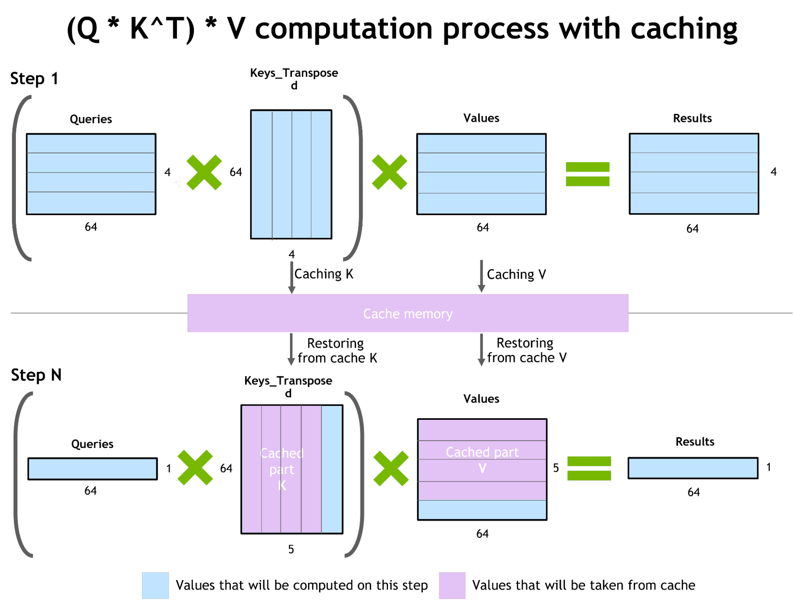

- [一，框架介绍](#一框架介绍)
- [二，FasterTransformer 中的优化](#二fastertransformer-中的优化)
  - [2.1，**OP融合（也叫算子融合）**](#21op融合也叫算子融合)
  - [2.2，自回归模型/激活缓存的推理优化](#22自回归模型激活缓存的推理优化)
  - [2.3，使用 MPI 和 NCCL 实现节点间通信并支持模型并行性](#23使用-mpi-和-nccl-实现节点间通信并支持模型并行性)
  - [2.4，低精度推理](#24低精度推理)
- [三，代码速览](#三代码速览)
- [四，性能表现](#四性能表现)
- [五，如何编译](#五如何编译)
- [六，如何使用](#六如何使用)
  - [6.1，bert 模型评测](#61bert-模型评测)
- [参考资料](#参考资料)

## 一，框架介绍

`FasterTransformer`[(FT)](https://github.com/NVIDIA/FasterTransformer/)  是一个库，用于实现基于 `Transformer` 的神经网络推理的加速引擎，对于大模型，其以分布式方式跨越许多 GPU 和节点。FasterTransformer 包含 Transformer 块的高度优化版本的实现，其中包含编码器 Encoder 和解码器 Decoder 部分。基于 FT 可以运行完整的编码器-解码器架构（如 T5 大模型）以及仅编码器模型（如 BERT）或仅解码器模型（如 GPT）的推理。 

`FT` 框架是用 `C++/CUDA` 编写的，依赖于高度优化的 cuBLAS、cuBLASLt 和 cuSPARSELt 库，与 [NVIDIA TensorRT](https://developer.nvidia.com/blog/optimizing-t5-and-gpt-2-for-real-time-inference-with-tensorrt/) 等其他编译器相比，FT 的特点是它支持**以分布式方式推理 Transformer 大模型**。

另外，FasterTransformer 还提供 TensorFlow 集成（使用 TensorFlow 操作）、PyTorch 集成（使用 PyTorch 操作）和 Triton 集成作为后端。

其对于主流的开源大模型都提供 `FP16` 半精度推理支持，并对部分大模型分别支持：

-  `INT8` 低精度量化推理
- 安培架构的 GPU 硬件部分支持稀疏化
- Hopper 架构支持 FP8 推理
- Tensor 并行
- Pipeline 并行

值得注意的是，FasterTransformer 框架都是在 `C++` 层面支持大模型，因为这些大模型都是通过 c++ 来实现的。

## 二，FasterTransformer 中的优化

### 2.1，**OP融合（也叫算子融合）**

CNN 模型中也有类似的技术，通过将 OP（算子）合并成一个 OP（算子），来减少 `Kernel` 的调用。因为每一个基本 OP 都会对应一次 GPU kernel 的调用，和多次显存读写，这些都会增加大量额外的开销。

TensorFlow XLA 可以在一定程度上缓解这个问题，它会对一些基本的 OP 进行合并，以减少 GPU kernel 的调度和显存读写。但在大多数情况下，XLA 依然无法达到最优的性能，特别是对于 BERT 这种**计算密集**的情况，任何性能的提升都将节省巨量的计算资源。

在 FT 框架内部，将除矩阵乘法以外的所有 kernel 都进行了尽可能的融合，单层 Transformer 的计算流程如下图所示：


如上图所示，Faster Transformer 只用了 `14` 个 kernel 就完成了原来将近 `60` 个 kernel 的计算逻辑。这其中，8 个 kernel 是通过调用 cuBLAS 接口计算矩阵乘法（绿色框），其余 6 个是自定义 kernel （蓝色框）。另外，不同大小的 `batch_size` 优化结果不太一样：

- 针对 batch size 比较小的场景（例如问答，TTS 等），简单的融合后，基本上就可以达到很好的性能。
- 针对大 batch 的场景，我们需要对**矩阵乘法**和所有的自定义 kernel 做精细的调优，才能达到很好的加速效果。仓库提供了脚本针对不同的 batch size 参数，可自动生成较优的 `GEMM` 算法。

### 2.2，自回归模型/激活缓存的推理优化

为了防止通过 Transformer 重新计算每个新 token 生成器的先前键和值，FT 分配一个**缓冲区**来在每一步存储它们。虽然需要一些额外的内存使用，但 FT **可以节省重新计算的成本**、在每一步分配缓冲区以及连接的成本，相同的缓存机制会用于 NN 的多个部分。该过程的方案下图所示：



### 2.3，使用 MPI 和 NCCL 实现节点间通信并支持模型并行性

在 GPT 模型中，FT 框架同时提供**张量并行和流水线并行**。 对于张量并行性，FasterTransformer 遵循了 [Megatron](https://arxiv.org/pdf/1909.08053.pdf) 的思想。 对于自注意力块和前馈网络块，FT 按行拆分第一个矩阵的权重，并按列拆分第二个矩阵的权重。 通过优化，FT 可以将每个 Transformer 块的归约操作减少到两倍。

对于流水线并行性，FT 框架将整批请求拆分为多个微批，隐藏了通信的泡沫。 FasterTransformer 会针对不同情况自动调整微批量大小。

### 2.4，低精度推理

FT 的内核支持使用 `fp16` 和 `int8` 中的低精度输入数据进行推理。 由于较少的数据传输量和所需的内存，这两种机制都允许加速。int8 和 fp16 计算需要在特殊硬件上执行，例如 Tensor Core（适用于从 Volta 开始的所有 GPU 架构），以及即将推出的 Hopper GPU 中的 FP8 推理。

## 三，代码速览


## 四，性能表现

在性能测试中，主要测试了基于不同输入特征、 TensorFlow 和 PyTorch 模型的加速比，以及使用 `INT8-v2` 量化的加速比。

从 `benchmark` 性能测试结果看，`PyTorch` 模型上的加速比更高，推测是 `TensorFlow XLA` 本身已经做了些图优化工作。对于大批量（large batch size）和更长的序列长度（sequence length），使用具有 `INT8-v2` 量化的 Effective FasterTransformer 可以带来 5 倍的加速，这也是加速比最大的情况。


> TensorFlow XLA (Accelerated Linear Algebra) 是一种编译器和执行引擎，能够优化 TensorFlow 模型在 CPU、GPU 和 TPU 硬件平台上的性能。其优化技术包括：常量折叠、公共子表达式消除和死代码删除等。


## 五，如何编译

1. Install `Docker`（开发机默认安装好了）
2. Download and install `nvidia-docker2`

`nvidia-docker2` 是一个命令行工具，与 docker 相比，它的特性是会自动将 NVIDIA GPU 驱动程序和 CUDA 库映射到容器中，使容器可以直接使用 GPU，而不用在容器中重新安装英伟达驱动和 CUDA 库。

详情参考文章:
- https://docs.nvidia.com/deeplearning/frameworks/preparing-containers/index.html
- https://docs.nvidia.com/datacenter/cloud-native/container-toolkit/install-guide.html

3. 进入 docker 镜像环境，并下载 FasterTransformer 仓库代码及更新子模块

````bash
```bash
# 这里给出的是官方提供 pytorch 镜像教程，tensorflow 类似
nvidia-docker run -ti --shm-size 5g --rm nvcr.io/nvidia/pytorch:22.09-py3 bash
git clone https://github.com/NVIDIA/FasterTransformer.git
mkdir -p FasterTransformer/build
cd FasterTransformer/build
git submodule init && git submodule update
```
````

4. **编译项目**。脚本中 -DSM=xx 的 xx 表示 GPU 的计算能力，不同的 GPU 有着不同的计算能力，对于 T4 推理卡 `-DSM=75`。

基于 c++ 构建：

```bash
cmake -DSM=75 -DCMAKE_BUILD_TYPE=Release ..
make -j12
```

基于 PyTorch 构建

```bash
cmake -DSM=75 -DCMAKE_BUILD_TYPE=Release -DBUILD_PYT=ON -DBUILD_MULTI_GPU=ON ..
make -j12
```

默认编译是不支持稀疏矩阵乘法的，如果想在 BERT 上使用**稀疏 gemm**，则需下载并提取 cusparseLt 库，并使用 -DSPARSITY_SUPPORT=ON -DCUSPARSELT_PATH=/the_extracted_cusparselt_path 进行编译：

```bash
wget https://developer.download.nvidia.com/compute/libcusparse-lt/0.1.0/local_installers/libcusparse_lt-linux-x86_64-0.1.0.2.tar.gz
tar -xzvf libcusparse_lt-linux-x86_64-0.1.0.2.tar.gz
cmake -DSM=xx -DCMAKE_BUILD_TYPE=Release -DBUILD_PYT=ON -DSPARSITY_SUPPORT=ON -DCUSPARSELT_PATH=/the_extracted_cusparselt_path ..
make -j12
```

5. 安装 git-lfs

```bash
# 添加 packagecloud 存储库，apt/deb repos
curl -s https://packagecloud.io/install/repositories/github/git-lfs/script.deb.sh | bash
apt-get install git-lfs
```


## 六，如何使用

### 6.1，bert 模型评测

FP32/FP16 精度的 BERT 模型在 C++ 版本的FasterTransformer框架下性能测试结果如下，很明显，`FP32` 单精度模型耗时几乎是 `FP16` 半精度模型的 `5` 倍。

注意，运行 `bert_example` 之前，需要以同等配置参数运行 `bert_gemm` 生成性能最佳的 `gemm` 算法参数，否则，比如用 FP16 的 `gemm_config.in` 配置去运行 bert_example，其推理速度可能更慢！

> t4 卡有 320 个 Turing Tensor Core，支持 BF16和INT8 精度推理，单精度性能 (FP32)-算力8.1T。

`bert_guide.md` 教程对 bert_example 程序对使用有问题，真正代码中没有 <int8_mode> 参数，如果，按照官方的教程，C++ 编译的库，在 T4 卡做 `INT8` 推理跑不通，会一直卡住。`bert_example` 和 `bert_int8_example` 程序参数解释：

```bash
bert_example batch_size num_layers seq_len head_num size_per_head data_type is_remove_padding
./bin/bert_example 32 12 32 12 64 0 0
bert_int8_example batch_size num_layers seq_len head_num size_per_head is_fp16 is_remove_padding int8_mode
./bin/bert_int8_example 1 12 128 12 64 1 0 2
```

C++ 编译版本下，**FP32、FP16、BF16 精度下 `bert` 模型在 `T4` 卡上的推理时间分别是 40.85、8.16、4.11ms**。另外，按照官方的教程，C++ 编译的库，在 T4 卡做 `INT8` 推理跑不通，会一直卡住。

推理脚本代码和推理结果输出如下所示：

```bash
# 1，FP32 精度推理
./bin/bert_gemm 32 32 12 64 0 0
./bin/bert_example 32 12 32 12 64 0 0 
# 2，FP16 精度推理
./bin/bert_gemm 32 32 12 64 1 0
./bin/bert_example 32 12 32 12 64 1 0 
# 3，BF16 精度推理
./bin/bert_gemm 32 32 12 64 2 0
./bin/bert_example 32 12 32 12 64 2 0
# 4，INT8 mode=1 精度推理
./bin/bert_gemm 32 32 12 64 1 1
./bin/bert_example 32 12 32 12 64 0 1
# 4，int8_mode == 2 精度推理，有问题
./bin/bert_gemm 32 32 12 64 1 2
./bin/bert_int8_example 32 12 32 12 64 0 2
# 5，Run Effective FasterTransformer under FP32 on C++ by set the <is_remove_padding> flag to 1 
./bin/bert_gemm 32 32 12 64 0 0
./bin/bert_example 32 12 32 12 64 0 1 0
```

```bash
# ./bin/bert_example 32 12 32 12 64 0 0
[INFO] Device: Tesla T4 
Before loading model: free: 14.65 GB, total: 14.76 GB, used:  0.11 GB
[FT][WARNING] Device 0 peer access Device 1 is not available.
After loading model : free: 14.00 GB, total: 14.76 GB, used:  0.76 GB
After inference     : free: 13.94 GB, total: 14.76 GB, used:  0.82 GB
[FT][INFO] batch_size 32 seq_len 32 layer 12 FT-CPP-time 40.85 ms (100 iterations) 
# ./bin/bert_example 32 12 32 12 64 1 0 
[INFO] Device: Tesla T4 
Before loading model: free: 14.65 GB, total: 14.76 GB, used:  0.11 GB
[FT][WARNING] Device 0 peer access Device 1 is not available.
After loading model : free: 14.19 GB, total: 14.76 GB, used:  0.57 GB
After inference     : free: 14.16 GB, total: 14.76 GB, used:  0.60 GB
[FT][INFO] batch_size 32 seq_len 32 layer 12 FT-CPP-time 8.16 ms (100 iterations) 
# ./bin/bert_example 32 12 32 12 64 2 0 
[INFO] Device: Tesla T4 
Before loading model: free: 14.65 GB, total: 14.76 GB, used:  0.11 GB
[FT][WARNING] Device 0 peer access Device 1 is not available.
After loading model : free: 14.19 GB, total: 14.76 GB, used:  0.57 GB
After inference     : free: 14.16 GB, total: 14.76 GB, used:  0.60 GB
[FT][INFO] batch_size 32 seq_len 32 layer 12 FT-CPP-time 4.11 ms (100 iterations) 
# ./bin/bert_example 32 12 32 12 64 0 1
[INFO] Device: Tesla T4 
Before loading model: free: 14.65 GB, total: 14.76 GB, used:  0.11 GB
[FT][WARNING] Device 0 peer access Device 1 is not available.
After loading model : free: 14.00 GB, total: 14.76 GB, used:  0.76 GB
After inference     : free: 13.94 GB, total: 14.76 GB, used:  0.82 GB
[FT][INFO] batch_size 32 seq_len 32 layer 12 FT-CPP-time 21.57 ms (100 iterations) 
```
## 参考资料

1. [英伟达Fastertransformer源码解读](https://zhuanlan.zhihu.com/p/79528308)
1. https://github.com/NVIDIA/FasterTransformer/