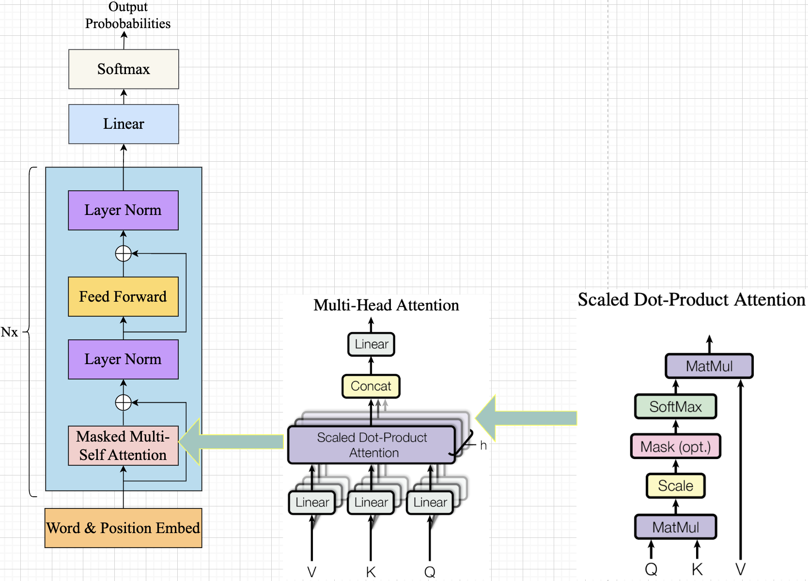
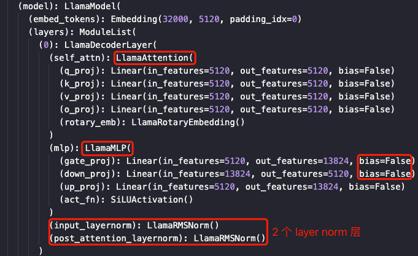
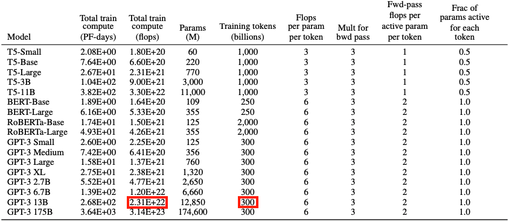

- [一，transformer 结构](#一transformer-结构)
  - [1.1，因果建模模型结构](#11因果建模模型结构)
  - [1.2，LLama 模型结构配置文件](#12llama-模型结构配置文件)
- [二，参数量 Params 理论分析](#二参数量-params-理论分析)
  - [2.1，Embedding 层参数量](#21embedding-层参数量)
  - [2.2，Multi-Head Attention (MHA) 层参数量](#22multi-head-attention-mha-层参数量)
  - [2.3，Add \& Norm 层参数量](#23add--norm-层参数量)
  - [2.4，FeedForward Layer (FFN)/MLP 层参数量](#24feedforward-layer-ffnmlp-层参数量)
  - [2.5，总的公式](#25总的公式)
- [三，内存使用量理论分析](#三内存使用量理论分析)
- [四，计算量 FLOPs 理论分析](#四计算量-flops-理论分析)
  - [4.1，FLOPs 理论计算](#41flops-理论计算)
  - [4.2，计算量 FLOPs 的定性和定量结论](#42计算量-flops-的定性和定量结论)
- [五，显存占用量理论分析](#五显存占用量理论分析)
  - [5.1，KV cache 优化](#51kv-cache-优化)
  - [5.2，GPU 显存占用分析](#52gpu-显存占用分析)
  - [5.3，训练过程中显存占用量理论计算](#53训练过程中显存占用量理论计算)
  - [5.4，推理过程中显存占用量理论计算](#54推理过程中显存占用量理论计算)
  - [5.5，显存占用的定性分析和定量分析](#55显存占用的定性分析和定量分析)
- [六，推理 Latency 理论计算](#六推理-latency-理论计算)
- [七，并发支持估算](#七并发支持估算)
- [参考资料](#参考资料)
  - [LLM 推理加速](#llm-推理加速)
  - [transformer 模型基础](#transformer-模型基础)

作者：章洪高、范泽欣（KV cache 原理）

## 一，transformer 结构

### 1.1，因果建模模型结构

基于 transformer 架构的语言模型主要有两种：
- 自编码（`auto-encoder`）语言模型，典型代表 BERT
- 自回归（`auto-regressive`）语言模型，也叫**因果建模模型** `CausalLM`，典型代表 GPT 系列、Lllama 等。

GPT 中的 Decoder 与原始的相比，去掉了 Encoder-Decoder self attention（Decoder 中的第一个 self attention），只保留了 Decoder self attention（masked Self Attention），因此 GPT 系列也被称为 `decoder-only` transformer。

一个正常的 `Self Attention` 允许一个位置关注到它两边的 tokens，而 masked Self Attention 只让模型看到左边的 tokens：


> 图： self attention vs mask self attention

`decoder-only` 的 transformer 模型结构图如下图所示：


> 图： decoder-only transformer 模型结构图

本文分析的是采用 `decoder-only` 框架的 `transformer` 模型的模型参数量、计算量、理论所需内存以及显存。

> 该章节主要参考资料 [The Illustrated GPT-2 (Visualizing Transformer Language Models)](http://jalammar.github.io/illustrated-gpt2/)。

### 1.2，LLama 模型结构配置文件


模型配置文件中主要字段解释如下：

- vocab_size (int) ：词汇表中标记的数量，也是嵌入矩阵的第一个维度。
- hidden_​​size (int) — 模型的隐藏层大小，其实就是 d_model。
- num_attention_heads (int) — 模型的多头注意力层中使用的注意力头数量。
- num_hidden_layers (int) — 模型中的块数（层数）, number of layers。
- max_sequence_length: 2048, 即代表预训练的 LLaMA 模型的最大 Context Window 只有 2048。

## 二，参数量 Params 理论分析

在计算模型参数量之前，我们需要先定义好一些表示符号：

- `batch_size`：批量大小。
- `seq_len`：序列长度，一个 prompt 的长度。
- `d_model`: 序列中每个 `token` 的 `embedding` 向量的维度，也是模型隐藏层的大小，对应 hf 模型配置文件中的 hidden_​​size。
- `vocab_size`：词表大小。也就是每个 token 在做 embedding 前的 one-hot 向量维度。
- `n_layers`：模型中 decoder layer 的个数，对应 hf 模型配置文件中的 num_hidden_layers。

`decoder-only` 框架的 `transformer` 模型整体结构如下图所示:


> decoder-only 模型的完整结构。

模型由 N 个相同的 decoder layer 串联而成，每个 decoder layer 又由一个带掩码（`mask`）多头注意力（MHA）层、2 个层归一化层、和一个前馈神经网络（FFN）层组成：

```bash
(masked)multi_headed_attention --> layer_normalization --> MLP -->layer_normalization
```

1，对于每个 `token`，最底层的 Masked Multi-Head Attention 层的输入是输入 token 的 Embedding Vector，它经过 `3` 个线性层的**线性变换**（`Linear` 层）分别得到 Q、K、V 三个向量，并将它们作为 Self-Attention 层的输入。多个 self-attention 层的输出进行 concat 后，再经过 `1` 个线性层进行维度的映射，得到最终的输出。
> 对于每一个 token，都会生成三个向量 $q$、$k$、$v$，向量大小为 $\text{d\_model}$；对于长度为 seq_len 的输入序列，则生成三个矩阵 $Q$、$K$、$V$，形状为 $[\text{seq\_len}, \text{d\_model}]$。

Self-Attention 层的内部计算过程用数学公式可表达为:

$$\text{Attention}(Q, K, V) = \text{softmax} (\frac{QK^T}{\sqrt{d_k}})V$$

Masked Multi-Head Attention 层的权重参数包括 $Q$、$K$、$V$ 的权重矩阵 $W_Q$、$W_K$、$W_V$ 及其偏置，以及输出权重矩阵 $W_O$，这些权重矩阵的大小都是 $[\text{d}_\text{model}, \text{d}_\text{model}]$。另外，`concat` 算子无参数，**self-attention 层都是计算 Kernel，内部执行的操作也不涉及权重参数**。

2，`Add & Norm` 层由 Add 和 Norm 两部分组成。这里的 Add 指 X + MultiHeadAttention(X)，是一种残差连接。Norm 是 Layer Normalization。Add & Norm 层计算过程用数学公式可表达为:

$$\text{Layer Norm}(X + \text{MultiHeadAttention}(X))$$

Add 比较简单，执行的是逐元素相加操作，该算子没有参数。

3，Feed Forward 层全称是 Position-wise Feed-Forward Networks，其本质是一个**两层的全连接层**（线性层），第一层的激活函数为 Relu，第二层不使用激活函数，计算过程用数学公式可表达为：

$$\text{FFN}(X) = \text{max}(0, XW_1 + b_1 )W_2 + b_2$$

一般地，第一个线性层是先将维度从 $\text{d\_{model}}$ 映射到 $\text{4d\_{model}}$，第二个线性层再将维度从 $\text{4d\_{model}}$ 映射到 $\text{d\_{model}}$。

另外，最底层的 decoder layer 的输入是 Embedding 层（Token Embedding + Positional Embedding），其他 decoder layer 的输入是上一层的输出。  

模型总的参数量计算公式可抽象如下:

$$\text{totoal param} = \text{param}_\text{embedding} + \text{param}_\text{decoder layer} \cdot \text{n}_\text{layers}$$

注意，很多 `decoder-only` 架构的自回归模型的全连接层的偏置 `bias` 都设置为 False，故这里的计算公式中没有考虑偏置参数。



### 2.1，Embedding 层参数量

1，Token Embedding (TE)

Token Embedding 层的参数量较多，需要计算。输入 token 序列的维度是 `[batch_size, seq_len, vocab_size]`（后续都统一把输入维度写前，输出维度写后），其经过 `Token Embedding` 层后的输出维度是 `[batch_size, seq_len, d_model]`。对应 Token Embedding 层权重矩阵的大小为：`[vocab_size, d_model]`，因此 Token Embedding 层的参数量为：

$$\text{param}_\text{TE} = \text{vocab\_size} \cdot \text{d}_\text{model}$$

2，Positional Embedding (PE)

位置 Embedding 层的参数量比较小，有时可忽略不计。

### 2.2，Multi-Head Attention (MHA) 层参数量

这里不单独计算每个 self-attention 层的参数量了，毕竟实际代码中，其都是在一个矩阵中。MHA 层的参数有 $Q$、$K$、$V$ 的权重矩阵 $W_Q$、$W_K$、$W_V$ 及其偏置，以及输出映射层的权重矩阵 $W_O$ 和偏置，这些权重矩阵的大小都是 $[\text{d}_\text{model}, \text{d}_\text{model}]$。

故，(MHA) 层参数量为:

$$\begin{align} 
\text{param}_\text{MHA} 
&= \text{param}_\text{Q} + \text{param}_\text{K} + \text{param}_\text{V} + \text{param}_\text{output} \nonumber \\
&= \text{d}_\text{model}\cdot \text{d}_\text{model} + \text{d}_\text{model}\cdot \text{d}_\text{model} + \text{d}_\text{model}\cdot \text{d}_\text{model} + \text{d}_\text{model}\cdot \text{d}_\text{model} \nonumber \\
&= 4\cdot {\text{d}_\text{model}}^{2} \nonumber
\end{align}$$

### 2.3，Add & Norm 层参数量

`Add & Norm` 层由 Add 和 Norm 两部分组成。这里的 Add 指 X + MultiHeadAttention(X)，是一种残差连接。Norm 是 Layer Normalization。Add & Norm 层计算过程用数学公式可表达为:

$$\text{Layer Norm}(X + \text{MultiHeadAttention}(X))$$

Add 比较简单，执行的是逐元素相加操作，该算子没有参数。重点讲下 Layer Norm 层。Layer Norm 是一种常用的神经网络归一化技术，可以使得模型训练更加稳定，收敛更快。它的主要作用是对每个样本**在特征维度上进行归一化**，减少了不同特征之间的依赖关系，提高了模型的泛化能力。Layer Norm 层的计算可视化如下图所示:


从上图可以看出，layer norm 层主要有两个参数: $\mu_{\beta}$ 和 $\sigma_{\beta}$（scale factor and offset），这两个参数的大小都是 $[\text{d}_\text{model}]$，因此一个 `Layer Norm` 层的参数量为:

$$\text{param}_\text{LN} = (\text{d}_\text{model} + \text{d}_\text{model})$$

又因为 `MHA` 块和 `FFN` 块各有一个 `layer normalization` 层，故每个 decoder layer 中的总的 Layer Norm 参数量为:

$$\text{param}_\text{LN} = 2\cdot(\text{d}_\text{model} + \text{d}_\text{model}) = 4\cdot \text{d}_\text{model}$$

### 2.4，FeedForward Layer (FFN)/MLP 层参数量

FFN 层由 2 个参数权重矩阵组成：MLP Expansion 和 MLP Contraction，其大小分别是 

- 权重 $W_1 \in [\text{d}_\text{model}, 4\text{d}_\text{model}]$
- 权重 $W_2 \in [4\text{d}_\text{model}, \text{d}_\text{model}]$

因此，FFN 层的参数量为:

$$\begin{align} 
\text{param}_\text{FFN} &= \text{param}_\text{fc1} +  \text{param}_\text{fc2} \nonumber \\
&= \text{d}_\text{model} \cdot 4\text{d}_\text{model} + 4\text{d}_\text{model}\cdot\text{d}_\text{model} \nonumber \\
&= 8\cdot {\text{d}_\text{model}}^{2} \nonumber
\end{align}$$

### 2.5，总的公式

1，单个 decoder Layer 参数量

$$\begin{align} 
\text{param}_\text{decoder\_layer} 
&= \text{param}_\text{MHA}  + \text{param}_\text{LN} + \text{param}_\text{FFN} \nonumber \\
&= 4\cdot {\text{d}_\text{model}}^{2} + 4\cdot \text{d}_\text{model} + 8\cdot {\text{d}_\text{model}}^{2} \nonumber \\
&= 12\cdot {\text{d}_\text{model}}^{2} + 4\cdot \text{d}_\text{model} \nonumber
\end{align}$$

2，**模型总的参数量计算公式**

$$\begin{align}
\text{param}_\text{decoder-only-model} 
&= \text{param}_\text{TE} + \text{param}_\text{decoder layer} \cdot \text{n}_\text{layers} \nonumber \\
&= (12\cdot {\text{d}_\text{model}}^{2} + 4\cdot \text{d}_\text{model}) \cdot \text{n}_\text{layers} + \text{vocab\_size} \cdot \text{d}_\text{model} \nonumber \\
\end{align}$$

如果用 $h$ 代替 $\text{d}_\text{model}$，$n$ 代替 $\text{n}_\text{layers}$，$V$ 代替 $\text{vocab\_size}$，则**自回归模型总的参数量计算公式**可简化为:

$$n(12h^2 + 4h) + Vh$$

有了以上理论公式，我们就能估计不同版本 `LLaMA` 模型的理论参数量：

| 实际参数量 | 隐藏维度 h | 层数 n | n heads | 理论参数量 12nh^2 |
| :--------: | :--------: | :----: | ------- | :---------------: |
|    6.7B    |    4096    |   32   | 32      |   6,442,450,944   |
|   13.0B    |    5120    |   40   | 40      |  12,582,912,000   |
|   32.5B    |    6656    |   60   | 52      |  31,897,681,920   |
|   65.2B    |    8192    |   80   | 64      |  64,424,509,440   |

> 该章节主要参考资料 [Transformer Deep Dive: Parameter Counting](https://orenleung.com/transformer-parameter-counting)

## 三，内存使用量理论分析

1，模型参数内存如何计算？

- 对 int8 而言，模型参数内存 = 参数量 * （1字节/参数），单位字节数
- 对 fp16 和 bf16 而言，模型参数内存 = 参数量 * （2 字节/参数）

2，模型推理需要的总内存是多少？

推理总内存 ≈ 1.2 × 模型参数内存（20% 是经验，不同框架可能不一样）

## 四，计算量 FLOPs 理论分析

`FLOPs`：floating point operations 指的是浮点运算次数，**理解为计算量**，可以用来衡量算法/模型时间的复杂度。

全连接层的 FLOPs 计算：假设 $I$ 是输入层的维度，$O$ 是输出层的维度，对应全连接层（线性层）的权重参数矩阵维度为 $[I, O]$。

- 不考虑 bias，全连接层的 $FLOPs = (I + I -1) \times O = (2I − 1)O$
- 考虑 bias，全连接层的 $FLOPs = (I + I -1) \times O + O = (2\times I)\times O$

对于矩阵 $A\in\mathbb{R}^{1\times n}$，$B \in \mathbb{R}^{n\times 1}$，计算 $A\times B$ 需要进行 n 次乘法运算和 n 次加法运算，共计 2n 次浮点数运算，矩阵乘法操作对应的 FLOPs 为 $2n$。对于 $A \in \mathbb{R}^{m\times n}$，$B\in\mathbb{R}^{n\times p}$，执行矩阵乘法操作 $A\times B$，对应 `FLOPs` 为 $2mnp$。

### 4.1，FLOPs 理论计算

对于 transformer 模型来说，其计算量**主要**来自 `MHA` 层和 `FFN` 层中的矩阵乘法运算。先考虑 batch_size = 1 和 输入序列长度为 $s$ 的情况。

以下计算是针对每个 decoder layer 的计算量。

1，通过线性变换计算 $Q$、$K$、$V$。

- 输入 token 序列长度为 $s$，则输入矩阵 $x$ 的形状为 $[s, h]$，其中 $h$ 是每个 token 的 embedding 维度。同时可知，做线性变换的权重矩阵 $W_Q$、$W_K$、$W_V$ $\in \mathbb{R}^{h\times h}$。
- qkv `FLOPs`: $3\times 2sh^2 = 6sh^2$

2，self-attention 层内部的计算，对输入矩阵进行操作。（其计算公式为: $\text{Attention}(Q, K, V) = \text{softmax} (\frac{QK^T}{\sqrt{d_k}})V$）这里只估算两个矩阵乘法的计算量，`attention_scale`（$/\sqrt(k)$）、`attn_softmax` ($\text{softmax}$) 的计算量忽略不计，因为这两个小算子都是逐元素操作。

-  $QK^T$ 矩阵乘法的输入和输出形状为: [n_head, s, h//n_head] * [n_head, h//n_head, s] -> [n_head, s, s]，`Flops` 为 $2\cdot hs^2$。
-  计算在 `score` 上的加权 $score \cdot V$，矩阵乘法的输入和输出形状为: [n_head, s, s] * [n_head, s, d_model//n_head] -> [n_head, s, s, h//n_head]，`Flops` 同样也为 $2\cdot hs^2$。

3，`attention` 后的输出乘以输出投影（projection）矩阵。

- $z \in \mathbb{R}^{s\times h}$ 乘以 $W_o \in \mathbb{R}^{h\times h}$
- attn_output linear `FLOPs`: $2sh^2$

4，Feed-forward（MLP/FFN）层的计算量分析。包含两个线性层，以及一个 `relu` 激活层（逐元素操作，flops 很小$=5\cdot 4h$，可忽略）

- MLP 两个线性层的权重参数矩阵: $W_1 \in \mathbb{R}^{h\times 4h}$、$W_2 \in \mathbb{R}^{4h\times h}$，MLP 的输入矩阵: $\in \mathbb{R}^{s\times h}$。
- MLP `FLOPs`: $2\times (2 \cdot s \cdot h\cdot 4h) = 2\cdot 8 sh^2$

5，其他操作的计算量。

- decoder block 后还有一个线性层，将隐藏向量映射为词表大小。以及顶部的 `softmax` 层用于输出每个 token 的概率。线性层的权重矩阵为：$W_{last} \in \mathbb{R}^{h\times V}$，矩阵乘法的输入和输出形状为: $[s, h] \times [h, V] -> [s, V]$。`FLOPs`: $2shV$。
- Layer Norm 操作是**逐元素**进行的，因此不存在通用的公式来精确 FLOPs。layer norm 层的两个权重都是一个长度为 $h$ 的向量，计算量预估为: $2h$。
- 另外，原始的 Transformer 模型使用余弦绝对位置编码方案，它是对 token embedding vector 进行加法操作。

将上述计算量相加，得到每个 decoder 层的计算量大约为: $(6sh^2 + 2sh^2 + 16sh^2) + 4hs^2 = 24sh^2 + 4hs^2$

**总结**，对于一个 $n$ 层的自回归模型，输入数据形状为 $[b, s]$ 的情况下，**一次训练/推理迭代的计算量**:

$$n\times (24bsh^2 + 4bs^2h) + 2bshV$$
> 忽略了向量-向量（甚至向量-标量）运算，这些运算的因子是 $h$ 远小于 $h^2$，因此可以忽略。

### 4.2，计算量 FLOPs 的定性和定量结论

当隐藏维度 $h$ 比较大，且远大于序列长度 $s$ 时，则可以忽略一次项，计算量可以近似为 $24bsh^2 * n$。前面提到当模型参数量为 $12nh^2$，输入的 tokens 总数为 $bs$（即上下文总长度），可得公式:$\frac{24nh^2}{12nh^2} = 2$。实际会有不到 `2%` 的误差，主要是因为我们忽略了一些小算子的计算量。

由此，我们可以近似认为：**在一次前向传播中，对于每个 `token`，每个模型参数，需要进行 $2$ 次浮点数运算，即一次乘法法运算和一次加法运算**。

一次迭代训练包含了前向传递和后向传递，后向传递的计算量是前向传递的 `2` 倍。因此，前向传递 + 后向传递的系数 $=1 + 2 = 3$ 。一次迭代训练中，对于每个 token，每个模型参数，需要进行 $6$ 次浮点数运算。

有了上述训练和推理过程中计算量与参数量关系的结论。接下来，我们就可以估计一次迭代训练 `GPT3-13B` 所需要的计算量。对于 GPT3，每个 token，每个参数进行了 $6$ 次浮点数运算，再乘以参数量和总 `tokens`数就得到了总的计算量。GPT3 的模型参数量为 12850M，训练数据量 300B tokens。

$$6 \times 12850 \times 10^6 \times 300 \times 10^9 = 2.313 \times 10^{22}$$

计算结果和下表所示结果相符合。



一次训练迭代包含了前向传播和反向传播计算，反向传播的计算量是前向传播的 $2$ 倍。因此，前向传播 + 后向传播的系数 $= 1+ 2 = 3$。**一次训练**迭代中，对于每个 `token`，每个模型参数，需要进行 `6` 次浮点数运算。

> 估算训练一个 transformer 模型所需的算力成本的公式可参考文章[Transformer 估算 101](https://mp.weixin.qq.com/s/MFgTUDAOODgMDb59eZC9Cw)。本章主要参考 [Transformer Inference Arithmetic](https://kipp.ly/blog/transformer-inference-arithmetic/) 以及 [分析transformer模型的参数量、计算量、中间激活、KV cache](https://zhuanlan.zhihu.com/p/624740065)。

## 五，显存占用量理论分析

### 5.1，KV cache 优化
> 因果建模模型、自回归模型、生成式 generative 模型所代表的意义几乎一致。

**背景**：生成式模型的推理过程很有特点，**推理生成 tokens 的过程是迭代式的**。简单来说就是，用户给一个输入文本，模型会输出一个回答（长度为 $N$），但该过程中实际执行了 $N$ 次模型前向传播过程。即 `GPT` 类模型一次推理只输出一个 `token`，当前轮输出的 token 与输入tokens 拼接，并作为下一轮的输入 tokens，反复多次直到遇到终止符 `EOS` 或生成的 token 数目达到设置的 `max_new_token` 才会停止。

可以看出第 i 轮输入数据只比第 i+1 轮输入数据新增了一个token，其他全部相同！因此第 i+1 轮推理时必然包含了第 i 轮的部分计算。KV Cache 优化的起因就在这里，**缓存当前轮可重复利用的计算结果**，下一轮计算时直接读取缓存结果，原理很简单，**本质就是用空间换时间**。

另外，每一层 decode layer 都有需要缓存 $K$ 和 $V$，因为每层的 `attention` 运算是独立的。

结合前面 KV cache 优化的原理，可以总结出一个典型的自回归模型的生成式推理过程包含了两个阶段：

1. **预填充阶段**（prefill phase）：输入一个 prompt 序列，为每个 transformer 层生成 key cache 和 value cache（KV cache）。因为 QKV 矩阵的计算过程是线性的，因此，对于同一个 `seq` 样本，每个 `token` 可以并行计算无时序依赖。简单来说就是，训练、推理的 prefill 阶段（输入 prompt 的计算）过程是**高度并行化的**
2. **解码阶段**（decoding phase）：使用并更新 KV cache，一个接一个地生成词（**无并行性**），当前生成的词依赖于之前已经生成的词。该阶段的推理计算分两部分：更新 KV cache 和计算 decoder layers 的输出。

这两个阶段的差别在于 $Q$ 的维度不同。在第一个阶段时，用户输入的所有 token 都需要参与运算，所以此时 Q 的维度为[batch_size, seq_len, d<sub>model</sub>]。在第二个阶段时，新生成的 token 作为第二次迭代过程的输入，所以此时 Q 的维度为 [batch_size, 1, d<sub>model</sub>]，即**只有新 token 作为 Q**。

> 为什么不缓存 Q ?
> 这是由 decoder-only 的模型原理决定的。在每次迭代过程中，只有新生成 token 的 Q 需要参与运算（新生成 token 是由前文推理而出，所以其 Q 向量包含了前文信息），之前的 Q 无需再参与运算，所以每次迭代过程结束时就可以将 Q 丢弃。

### 5.2，GPU 显存占用分析

1，深度学习模型推理任务中，占用 GPU 显存的主要包括三个部分：**模型权重、输入输出以及中间结果**。该结论来源[论文](https://www.usenix.org/conference/osdi20/presentation/gujarati)。

- **模型权重**：神经网络模型都是由相似的 layer 堆叠而成，例如 cnn 模型的卷积层、池化层、全连接层等；以及 transformer 模型的 self-attention 层、全连接层、layer_norm 层等。**模型权重默认使用 `fp16` 存储**。
- **中间结果**：前向传播计算过程中，前一层的输出就是后一层的输入，相邻两层的中间结果也是需要 gpu 显存来保存的。
- **输入输出**：和模型权重参数所占用的显存相比，输入输出所占用的显存就很小了。

另外，`batch_size` 的增加只会带来输入输出显存的增加，进一步可知，模型推理时， **batch_size 的增加并不会带来明显的显存增加**，相反其能带来近乎线性的 `throughput` 增加，同时 < 阈值时，`latency` 不明显增加。

2，与模型推理相比，模型训练任务中，还会增加**中间变量（激活）**、**梯度**与**优化器动量**的显存占用，且显存占用与 batch size 成正比。

### 5.3，训练过程中显存占用量理论计算

在模型训练过程中，需要**存储前向传播的所有中间变量（激活）结果**，称为 `memory_activations`，用以在反向传播过程中计算梯度时使用。而模型中梯度的数量通常等于中间变量的数量，所以 `memory_activations = memory_gradients`。

假设 `memory_modal` 是指存储模型所有参数所需的内存、`memory_optimizer` 是优化器状态变量所需内存。综上，模型训练过程中，显存占用量的理论计算公式为：

```bash
total_memory = memory_modal + 2 * memory_activations + memory_optimizer
```

### 5.4，推理过程中显存占用量理论计算

1，存储模型所有参数所需的显存计算公式（params 是模型参数量）：

$$\text{memory\_model} = \text{params} * 2 = [n(12h^2 + 4h) + Vh] * 2$$

2，中间结果显存占用

和模型训练需要存储前向传播过程中的中间变量结果不同，模型推理过程中并不需要存储中间变量，因此推理过程中涉及到的**中间结果**内存会很小（中间结果用完就会释放掉），一般指**相邻两层的中间结果**或者算子内部的中间结果，这里我们只考虑主要算子中最大的中间结果部分即可。

这里我们假设其占用的显存为 `memory_intermediate`，$\text{head\_num}$ 用符号 $a$ 表示，$\text{sequence\_length}$ 用符号 $s$ 表示。

- self-attention 中 $QK^T$ 的输入输出形状为 $[b, head\_num, s, h//n\_head] \times [b, head\_num, h//n\_head, s] \rightarrow [b, head\_num, s, s]$，所以占用显存大小为 $2bs^2a$；
- `mlp` 块中，第一个线性层的输出结果形状为 $[b, s, 4h]$，所以占用显存大小为 $8bsh$。

self-attention 和 mlp 的 `memory_intermediate` 也可表示如下:

```bash
memory_intermediate of attention(qk^t output) = 2 * batch_size * n_head * square_of(sequence_length)
memory_intermediate of mlp(fc1 layer1 output) = 2 * batch_size * s * 4h
```

又因为 $h \gg s$，所以 `memory_intermediate of mlp`   

远大于 `memory_intermediate of attention`。所以:

$$\text{memory\_intermediate} = 8bsh$$

3，`kv cache` 显存占用

LLM 推理优化中 `kv cache` 是常见的方法，本质是用空间换时间。假设输入序列的长度为 $s$ ，输出序列的长度为 $o$，decoder layers 数目为 $n$，以 `float16` 来保存 `KV cache`，那么 `KV cache` 的峰值显存占用计算公式为:

$$\text{memory\_kv-cache} = b(s+o)h*n * 2*2 = 4bnh(s+o)$$

上式，第一个 `2` 表示 K/V cache，第二个 `2`表示 float16 占 2 个 bytes。

### 5.5，显存占用的定性分析和定量分析

1. 模型推理阶段，当输入输出上下文长度之和比较小的时候，占用显存的大头主要是模型参数，但是当输入输出上下文长度之和很大的时候，占用显存的大头主要是 `kv cache`。
2. 每个 `GPU` `kv cache` 显存所消耗的量和（输出序列+输出序列长度）成正比，和 batch_size 也成正比。
3. 有[文档](https://github.com/ray-project/llm-numbers#1-mb-gpu-memory-required-for-1-token-of-output-with-a-13b-parameter-model)指出，`13B` 的 `LLM` 推理时，每个 `token` 大约消耗 `1MB` 的显存。

以 A100-40G GPU 为例，llama-13b 模型参数占用了 26GB，如果忽略中间显存，那么剩下的 14GB 显存中大约可以容纳 14,000 个 token。在部署项目中，如果将输入序列长度限制为 512，那么该硬件下最多只能同时处理大约 `28` 个序列。

## 六，推理 Latency 理论计算

对于小 `batch` 的模型推理，单个 token 的推理 `latency` 受限于 gpu 的内存带宽；对于大 `batch`，单个 token 的推理 `latency` 受限于 gpu 的算力，同时将忽略卡与卡之间的通信延迟因素。

本章 Latency 的计算忽略了**预填充阶段**中计算和**读取 kv cache 的时间、读取 unembedding vector 并计算 logits 的时间**。预填充阶段对应的就是生成第一个 `token` 的过程，这个时候需要计算 `kv cache`，所以第一个 `token` 的 `latency` 会比后面的 `token` 大很多。

模型推理的**解码阶段** Latency 的理论计算公式如下所示：

1，小 batch：

$$
\begin{align}
\text{compute} = \frac{2\cdot P}{N\cdot A_{bm}} \nonumber \\
\text{comms}  = 4\cdot n_{layers}\cdot 8us \nonumber \\
\end{align}
$$

2，大 batch：

$$
\begin{align}
\text{compute} = B\cdot \frac{2\cdot P}{N\cdot A_{f}} \nonumber \\
\text{comms}  = B\cdot \frac{2\cdot 4\cdot n_{layers}\cdot d_{model}}{A_c} \nonumber \\
\end{align}
$$

- $N$ 是 GPU 数目
- $A_c$ 是 GPU 之间通信带宽
- $A_{bm}$ 是 GPU 内存带宽
- $A_f$ 是 GPU 算力
- $P$ 表示模型(float16)参数量
- $B$ 是 `batch size`

注意，上述公式计算得到理论 `Latency` 只是个上限，我们永远不可能达到这个值，而且现实中 GPU 卡的性能也很少能达到其规格所宣称的数字。
## 七，并发支持估算

以集群上的 1 个节点的 8 卡 V100 机器，llama-13b 模型为例，估算极端情况下聊天系统同时服务 10000 人并发所需要的节点数量。这里的**极端情况是指每个请求的输入长度为 512、输出长度为 1536 且没有 Latency 要求**。
> LLaMA 系列模型配置文件中 "max_sequence_length": 2048, 即代表预训练的 LLaMA 模型的最大 Context Window 只有 `2048`。

k、v cache 优化中对于每个 `token` 需要存储的字节数计算公式如下:

$$
2\cdot \text{n\_layers} \cdot \text{d\_model} \cdot 2 = 4\cdot \text{n\_layers} \cdot \text{d\_model}
$$
> n_heads * d_heads = d_model

1，对于 llama-13b 模型而言， 其推理时，每个 token 大约消耗 `1MB` 的显存（其实是 kv cache 占用的缓冲），对于输入输出上下文长度（512+1536）和为 2048 的请求，其每个请求需要的显存是 2GB。这里对每个请求所需要显存的估算是没有计算推理中间结果所消耗显存（其比较小，可忽略），另外不同框架支持张量并行所需要的额外显存也各不相同，这里暂时也忽略不计。

- 在模型权重为 `float16` 的情况下，支持的理论 batch 上限为 （32*8-24.6）/ 2 = 115.7。
- 在模型权重为 `int8` 的情况下，支持的理论 batch 上限为 （32*8-24.6/2）/ 2 = 121.85。（deepspeed 框架不支持 llama 模型的 int8 量化）

以上是理论值即上限值，float16  权重的实际 batch 数量会小于 115.7，目前的 deepspeed 框架实测 batch 数量可以达到  100 左右（等待更新）。

10000/100 = 100 (台 8 卡 V100 服务器)。

实际场景中的并发请求具有稀疏性，不可能每个请求都是 2048 这么长的上下文长度，因此实际上 100 台 8 卡 V100 服务器能服务的并发请求数目应该远多于 10000，可能是几倍。

2，对于 llama-65b 模型而言， 其推理时，每个 token 大约消耗 `2.5MB` 的显存，因此，极限情况下每个请求需要的显存是 5GB。
- 在模型权重为 float16 的情况下，支持的理论 batch 上限为 （32*8 - 121.6）/ 5 = 26.88。
- 在模型权重为 int8 的情况下，支持的理论 batch 上限为 （32*8 - 121.6/2）/ 5 = 39.04。（deepspeed 框架不支持 llama 模型的 int8 量化）

另外，如果输入能量化为 int8 数据类型，理论上支持的 batch 数量会翻倍。

## 参考资料

### LLM 推理加速

1. [优化故事: BLOOM 模型推理](https://huggingface.co/blog/zh/bloom-inference-optimization)
2. [使用 DeepSpeed 和 Accelerate 进行超快 BLOOM 模型推理](https://huggingface.co/blog/zh/bloom-inference-pytorch-scripts)
3. [如何使用 Megatron-LM 训练语言模型](https://huggingface.co/blog/zh/megatron-training)
4. [千亿参数开源大模型 BLOOM 背后的技术](https://huggingface.co/blog/zh/bloom-megatron-deepspeed)
5. [Transformer Deep Dive: Parameter Counting](https://orenleung.com/transformer-parameter-counting)
6. [DeepSpeed Inference: Enabling Efficient Inference of Transformer Models at Unprecedented Scale](https://arxiv.org/pdf/2207.00032.pdf)
7. [Transformer Inference Arithmetic](https://kipp.ly/blog/transformer-inference-arithmetic/)
8. [Estimating memory requirements of transformer networks](https://www.linkedin.com/pulse/estimating-memory-requirements-transformer-networks-schartz-rehan/?trackingId=q8AzwkgCSK6DhhcafunTgA%3D%3D)
9. [Formula to compute approximate memory requirements of Transformer models](https://stats.stackexchange.com/questions/563919/formula-to-compute-approximate-memory-requirements-of-transformer-models)
10. [How continuous batching enables 23x throughput in LLM inference while reducing p50 latency](https://www.anyscale.com/blog/continuous-batching-llm-inference)
11. [分析transformer模型的参数量、计算量、中间激活、KV cache](https://zhuanlan.zhihu.com/p/624740065)
12. [如何估算transformer模型的显存大小](https://avoid.overfit.cn/post/6724eec842b740d482f73386b1b8b012)
13. [大模型推理性能优化之KV Cache解读](https://zhuanlan.zhihu.com/p/630832593)

### transformer 模型基础

1. [The Illustrated Transformer](http://jalammar.github.io/illustrated-transformer/)
2. [The Illustrated GPT-2 (Visualizing Transformer Language Models)](http://jalammar.github.io/illustrated-gpt2/)
3. [如何生成文本: 通过 Transformers 用不同的解码方法生成文本](https://huggingface.co/blog/zh/how-to-generate)