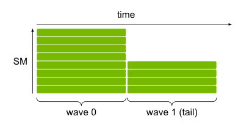
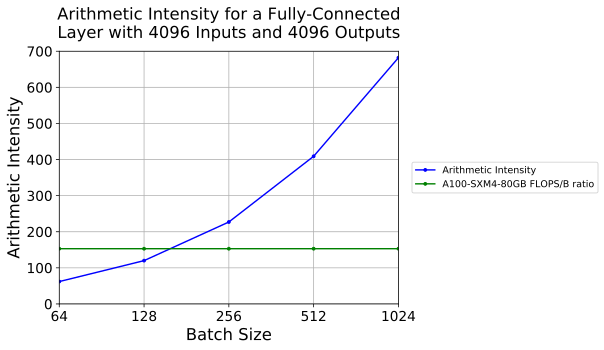

- 原文地址：[GPU Performance Background User's Guide](https://docs.nvidia.com/deeplearning/performance/dl-performance-gpu-background/index.html#dot-prod-op)
- 译者：honggaozhang，译者对原文有所删改和优化。

## 一，概览

本文主要介绍了 GPU 结构、操作的执行方式以及深度学习操作的常见限制，目的是为了更好的理解 GPU 的基本运行原理以及神经网络或特定网络层如何高效利用给定 `GPU`。

本文主要内容可分为以下部分：

1. **GPU 架构基础**：了解 GPU 基本结构有助于神经网络在给定 GPU 上的高效运行。
2. **GPU 执行模型**：理解神经网络层/算子是如何被分割和并行执行的。
3. **理解性能**：如何通过算术强度（arithmetic intensity）来评估 GPU 性能限制。
4. **DNN 算子类别**：深度学习算子的宽松分类及其通常适用的性能限制。

## 二，GPU 架构基础

GPU 是一种**高度并行的处理器架构**，由处理元件和内存层次结构组成。在较高层面上，NVIDIA® GPU 由多个流式多处理器（Streaming Multiprocessors，SMs）、片上 L2 缓存和高带宽 DRAM 组成。`SMs` 执行算术和其他指令，数据和代码通过 L2 缓存从 DRAM 中访问。举个例子，NVIDIA A100 GPU 包含 108 个 SMs，一个 40MB 的 L2 缓存，以及 80 GB HBM2 内存并提供高达 2039 GB/s 的带宽。

图1. GPU架构的简化视图

每个 `SM` 都有自己的指令调度器和各种指令执行管道。乘加运算是现代神经网络中最常见的运算，是全连接层和卷积层的构建块，这两个层都都可以看作是一组向量点乘的集合。 

下表显示了 NVIDIA 最新 GPU 架构上，不同数据类型的单个 SM 每个时钟周期的乘加操作次数。每个乘加操作都包含两个运算，因此将表中的吞吐量乘以 2，即可获得每个时钟的 FLOP 计数。要获得 GPU 的 `FLOPS` 速率，需要将其乘以 SM 数量和 SM 时钟速率。 例如，具有 108 个 SM 和 1.41 GHz 时钟频率的 A100 GPU 的峰值密集吞吐量为 156 TF32 TFLOPS 和 312 FP16 TFLOPS（应用程序实现的吞吐量取决于本文档中讨论的许多因素）。

图 2. SM 每个时钟的乘加运算

如图2所示，`FP16` 操作可以在 Tensor Cores 或 NVIDIA CUDA® 核心中执行。此外，NVIDIA Turing™ 架构可以在 Tensor Cores 或 CUDA 核心中执行 `INT8` 操作。`Tensor Cores` 是在NVIDIA Volta™ GPU 架构中引入的，用于加速机器学习和科学应用中的矩阵乘法和累加操作。这些指令对小矩阵块（例如 4x4 块）进行操作。值得注意的是，Tensor Cores 可以以比输入更高的精度计算和累加乘积。例如，在使用 FP16 输入进行训练时，Tensor Cores 可以在不丢失精度的情况下计算乘积，并以 FP32 累加。**当数学运算无法用矩阵块表示时，它们将在其他 CUDA 核心中执行**。例如，两个半精度张量的逐元素加法将由 CUDA 核心执行，而不是 Tensor Cores。

## 三，GPU 执行模型

为了利用并行资源，GPU 会同时执行许多线程。

有两个概念对于理解线程数与 GPU 性能的关系至关重要：

1. GPU 使用两级线程层次结构执行函数。 给定函数的线程被分组为大小相等的线程块，并启动一组线程块来执行该函数。
2. GPU 通过切换到其他线程的执行来隐藏相关指令延迟。 因此，有效利用 GPU 所需的线程数的重要性远远高于核心数或指令流水线数。

2 级线程层次结构是因为 GPU 内部有很多 SM，**每个 SM 又具有用于执行多个线程的流水线**，并通过共享内存和同步来实现线程间的通信。GPU 运行时，线程块（thread block）是放在 SM 上执行，这使得线程块中的所有线程都能够高效地通信和同步。因为使用单个线程块启动函数将只有一个 SM 被分配工作，因此要充分利用具有多个 SM 的 GPU，就需要启动多个线程块。又因为一个 SM 可以同时执行多个线程块，通常希望线程块的数量是 SM 数量的几倍。这样做的原因是为了最大限度地减少“尾部”效应，即在函数执行结束时，只有少数活动线程块保留，从而导致该时间段内 GPU 利用率不足，如图 3 所示。

图3. 当一次占用 1 个块/SM 的 12 个线程块启动执行时，8-SM GPU 的利用率。 此处，块分 2 波执行，第一波利用 100% 的 GPU，而第二波仅利用 50%。

我们使用术语 “wave” 来指代一组并发运行的线程块。最有效的做法是启动可以在多个线程块中执行的函数，这样在“尾部”波浪中花费的时间较少，从而最小化“尾部”效应，并减少需要处理它的必要性。对于高端GPU，通常只有少于300个线程块的启动需要检查“尾部”效应。

## 四，理解性能（数学带宽 vs 内存带宽）

一个函数在给定处理器上的性能受到以下三个因素之一的限制：**内存带宽** memory bandwidth、**数学带宽** math bandwidth 和**延迟** Latency。

- **CPU/GPU 内存带宽**： 是指主板的 CPU（显卡的 GPU）与内存之间的数据传输速率，决定了将数据从内存 (vRAM) 移动到计算核心的速度。通常以“字节/秒”或“GB/s”为单位。
> 这里的数学带宽其实就是 GPU 算力。

### 4.1，数学（算力 FLOPS）带宽 vs 内存带宽

考虑一个简化的模型，其中一个函数从内存中读取输入，执行数学运算，然后将输出写入内存。

假设 $\text{T\_mem}$ 表示访问内存所花费的时间，$\text{T\_math}$ 表示执行数学运算所花费的时间。如果进一步假设不同线程的内存和数学部分可以重叠，那么函数的总时间为 $\text{(T\_mem, T\_math)}$ 。其中较长的时间决定了性能的限制：如果数学时间较长，则称函数受数学限制；如果内存时间较长，则称函数受内存限制；即 所谓的 memory bound vs math/compute bound。

**内存或数学运算花费多少时间取决于算法及其实现，以及处理器的两种带宽**。 内存时间等于内存中访问的字节数除以处理器的内存带宽。数学时间等于运算次数除以处理器的数学带宽。因此，在给定的处理器上，如果一个特定的算法满足以下条件，那么它是受数学限制的：

$T\_math > T\_mem$ 可表示为 $\#ops / BW\_math > \# bytes / BW\_mem$。

这里的内存中访问的字节数 $\#bytes$ 其实是每个神经网络 `layer` 的内存访问代价 `MAC`，数学运算次数 $\#ops$ 其实就是 `FLOPs`。

上述不等式通过简单的代数变换，可以重新排列为:

$\text{\#ops / \#bytes} > \text{BW\_math / BW\_mem}$。

左边是**算法实现操作数与访问字节数的比值**，被称为算法的**算术强度**（arithmetic intensity）。右边是**处理器的数学带宽与内存带宽的比值**，有时被称为操作：**字节比率**（ops:byte ratio）。因此，对于给定的处理器，如果算法的算术强度高于处理器的操作数：字节比率，那么该算法在该处理器上是受数学限制的。相反，如果算法的算术强度低于处理器的操作：字节比率，则该算法受内存限制。

具体示例在下表 1 中。对于这些例子，我们将比较算法的算术强度与 NVIDIA Volta V100 GPU 的操作：字节比率。V100 GPU 的峰值数学速率为 125 FP16 Tensor TFLOPS，**片外内存带宽**约为 900 GB/s，芯片上 L2 缓存的带宽为 3.1 TB/s，因此其操作：字节比率在 40 到 139 之间，取决于操作数据的来源（片内或片外存储器）。

假设使用 NVIDIA® V100 GPU 和在 FP16 输入上进行 Tensor Core 操作，并使用 FP32 累积，如果数据从 GPU 的内存加载，则 `FLOPS：B`（**字节比率**）为 `138.9`。

上述表格第一行的计算过程如下:

$$
\text{arithmetic intensity} = \frac{\text{FLOPs}}{\text{MAC}} = \frac{\#op}{\#bytes} = \frac{2 \cdot 512 \cdot 1024 \cdot 4096}{(512\cdot1024 + 512\cdot 4096 + 1024\cdot4096)\times 2 }\approx 315
$$

如表格所示，**许多常见操作的算术强度较低**，有时**每读取或写入内存的两个字节元素只执行一次操作**。值得注意的是，这种分析是一种简化，因为我们只计算了算法中使用的算法操作。在实践中，函数还包含了对算法中未明确表示的操作的指令，如**内存访问指令、地址计算指令、控制流指令**等等。

算术强度和操作：字节比率的分析假设工作负载足够大，能够饱和给定处理器的数学和内存流水线。然而，如果工作负载不足够大，或者没有足够的并行性，处理器将被低效利用，性能将受到延迟的限制。例如，考虑只启动一个线程，它将访问 16 字节并执行 16000 次数学运算。虽然算术强度为 1000 FLOPS/B，根据 V100 GPU 的情况，执行应该受数学限制，但是只创建一个线程严重低效地利用了 GPU，几乎使其所有的数学流水线和执行资源处于空闲状态。此外，算术强度的计算假设输入和输出仅从内存中访问一次。算法实现中多次读取输入元素并不少见，这将有效降低算术强度。因此，**算术强度是一个一阶近似值**；如果需要更准确的分析，还应使用性能分析器的信息。

### 4.2，decoder-only 模型的内存 vs FLOPS 限制
> 网络层/模型的算术强度 < GPU 的字节比率，即内存带宽限制；反之，则是模型算力 FLOPS 限制。

类 `gpt` 的 decoder-only 模型推理过程中涉及到的内存访问字节数包括：
1. 模型参数量所消耗内存；
2. kv cache 所消耗内存；
3. 中间激活所消耗内存。

下图是输入输出向量维度都为 `4096` 的全连接层的算术密度。`batch_size` 小于等于 `128` 的情况在 `NVIDIA A100` 加速器上受到**内存带宽限制**。

在 batch_size = 1 的情况下，权重为 `fp16` 的 decoder-only 模型推理时的算术强度是约为 $1$。**随着 batch_size 的增加，模型的算术强度会随之增加**，因为 flops 和 batch_size 是成正比的，而内存访问字节数中只有 kv cache 部分是和 batch_size 成正比的，模型权重所访问内存是固定值。

那么内存带宽限制和模型算力 FLOPS 限制会有什么影响呢？

以 A100 GPU 为例，该硬件的字节比例是 $208$（V100 是 $138.9$），这意味着如果我们计算一个 token 的 `kv` 值，与计算多达 `208` 个 token 的时间将是相同的！即低于这个数，会受到内存带宽的限制；高于这个数，我们会受到算力 `FLOPS` 的限制。

在实际场景中，我们可以通过 `batch_size` 来控制模型的算术强度，从而控制模型是受到内存带宽限制还是算力 `FLOPS` 限制。从经验上看，因为有着 `kv` cache 的存在，模型的算术强度和 batch_size 并不完全成正比，且从实验测试结果看，**使用 8 个 V100 硬件做模型推理（张量并行），在 batch_size < 一定值内，其 latency 不会变**。

## 五，DNN 操作类别 

虽然现代神经网络是由多个层构建的，但根据计算的性质，它们的操作分为三个主要类别。

### 5.1，逐元素操作

逐元素操作（Element-wise operations）可以是一元或二元操作；关键在于该类别中的层对张量中的**每个元素都单独进行数学操作**，独立于其他元素。

例如，`ReLU` 层对输入张量中的每个 $x$ 返回 $max(0, x)$。类似地，两个张量的逐元素相加会独立计算每个输出的和值，不受其他和值的影响。该类别的层包括大多数**非线性操作**（sigmoid、tanh 等）、缩放、偏置、加法等。**这些层往往受到内存限制**，因为它们每访问一个字节执行的操作很少。
> 有关激活函数的更多细节，可以在[《优化内存限制层用户指南》](https://docs.nvidia.com/deeplearning/performance/dl-performance-memory-limited/index.html)的激活 Activations 部分找到。

### 5.2，减少操作

减少操作（Reduction operations）是对输入张量值的范围进行计算并生成结果值的操作。

例如，池化（`pooling`）层在输入张量的某些邻域上计算值。批量归一化（`Batch normalization`）层先计算张量的平均值和标准差，再在每个输出元素的运算中使用它们。除了池化和归一化层外，`SoftMax` 也属于减少（reduction）类别。典型的减少操作层也具有较低的算术强度，因此受到内存限制。
> 有关池化层的更多详细信息，请参考[池化（Pooling）](https://docs.nvidia.com/deeplearning/performance/dl-performance-memory-limited/index.html)部分。

### 5.3，点积操作（Dot-Product Operations）

该类别的操作可以表示为两个张量元素的点积，通常是权重（学习参数）张量和激活张量的点积计算。

全连接（fully-connected）层就是点积操作，其可以单独作为一个 layer，也可作为 rnn 或者 attention 层中的部分。全连接层可以自然地表示为**矩阵-向量**和**矩阵-矩阵**乘法。卷积也可以表示为一组点积的集合——一个向量是给定滤波器的参数集，另一个是应用该滤波器的“展开”激活区域。由于滤波器在多个位置应用，卷积也可以看作是矩阵-向量或矩阵-矩阵乘法操作（请参考[卷积算法](https://docs.nvidia.com/deeplearning/performance/dl-performance-convolutional/index.html#conv-algo)）。
> fully-connected/liner layer 全连接层/线性层。

如果相应的矩阵足够大，点积类别中的操作可能会受到数学限制。然而，对于较小的尺寸，这些操作最终会受到内存限制。例如，应用于单个向量（大小为 `1` 的小批量张量）的全连接层会受到内存限制。矩阵-矩阵乘法的性能将在[《NVIDIA 矩阵乘法背景用户指南》](https://docs.nvidia.com/deeplearning/performance/dl-performance-matrix-multiplication/index.html)中进行更详细的讨论。关于将某种类型的层建模为矩阵乘法的信息可以在相应的指南中找到：

- [《NVIDIA优化线性/全连接层用户指南》](https://docs.nvidia.com/deeplearning/performance/dl-performance-fully-connected/index.html)
- [《NVIDIA优化卷积层用户指南》](https://docs.nvidia.com/deeplearning/performance/dl-performance-convolutional/index.html)
- [《NVIDIA优化循环层用户指南》](https://docs.nvidia.com/deeplearning/performance/dl-performance-recurrent/index.html)
  
## 六，总结

可以通过以下步骤粗略的估计指定 GPU 上特定运算函数的性能限制：

1. 查找 `GPU` 上的 `SM`数量（**算力**），并确定 GPU 的操作：字节比率。
2. 计算算法的算术强度。
3. 通过估计线程块的数量和大小，确定是否有足够的并行性来饱和 GPU。如果线程块的数量至少大约是 SM 数量的 4 倍，并且每个线程块由几百个线程组成，那么可能有足够的并行性。
4. 对于特定层类型，英伟达相应的指南文档提供了有关并行化的更多直观信息（参考[《NVIDIA 优化线性/全连接层用户指南》](https://docs.nvidia.com/deeplearning/performance/dl-performance-fully-connected/index.html)、[《NVIDIA 优化卷积层用户指南》](https://docs.nvidia.com/deeplearning/performance/dl-performance-convolutional/index.html)和[《NVIDIA 优化循环层用户指南》](https://docs.nvidia.com/deeplearning/performance/dl-performance-recurrent/index.html)；[《NVIDIA 优化内存限制层用户指南》](https://docs.nvidia.com/deeplearning/performance/dl-performance-memory-limited/index.html)也可能有所帮助，尽管这些层通常受到内存限制）。

另外，最可能的性能限制因素是：

- 如果没有足够的并行性，则受到延迟的限制。
- 如果有足够的并行性，并且算法的算术强度高于 GPU 的字节比率，则受到数学带宽的限制。
- 如果有足够的并行性，并且算法的**算术强度低于 GPU 的字节比率，则受到内存带宽的限制**。
