- [英伟达架构发展史](#英伟达架构发展史)
  - [背景知识](#背景知识)
  - [NVIDIA GPU 架构发展史](#nvidia-gpu-架构发展史)
- [Volta（伏特）架构](#volta伏特架构)
  - [Volta GV100 GPU 硬件架构](#volta-gv100-gpu-硬件架构)
  - [Volta SM 硬件架构](#volta-sm-硬件架构)
  - [Volta Tensor 核心](#volta-tensor-核心)
  - [HBM2 内存架构](#hbm2-内存架构)
  - [NVIDIA TESLA V100 芯片](#nvidia-tesla-v100-芯片)
- [Turing 架构](#turing-架构)
  - [NVIDIA T4 芯片](#nvidia-t4-芯片)
- [Ampere 架构](#ampere-架构)
  - [NVIDIA A100 芯片](#nvidia-a100-芯片)
- [Hopper 架构](#hopper-架构)
  - [Hopper GPU 架构](#hopper-gpu-架构)
  - [H100 SM 架构](#h100-sm-架构)
  - [H100 Tensor Core 架构](#h100-tensor-core-架构)
  - [英伟达 Tensor Core 特性总结](#英伟达-tensor-core-特性总结)
  - [NVIDIA H100 芯片](#nvidia-h100-芯片)
- [V100/A100/H100 计算能力对比](#v100a100h100-计算能力对比)
- [参考资料](#参考资料)

## 英伟达架构发展史

### 背景知识

深度神经网络是由大量具有相同结构的神经元堆叠而成的，它们本质上具有很高的**并行性**，同时，神经网络严重依赖**矩阵数学运算**。对于多层网络来说，其需要大量的**浮点性能和带宽**来提高计算效率和速度，而 GPU 拥有数千个针对矩阵数学运算优化的处理核心-`CUDA` 核心，可提供数十至数百 `TFLOPS` 的性能，因此 GPU 硬件天然适合神经网络的训练和推理计算。

###  NVIDIA GPU 架构发展史

英伟达 GPU 架构简要发展史如下图所示。

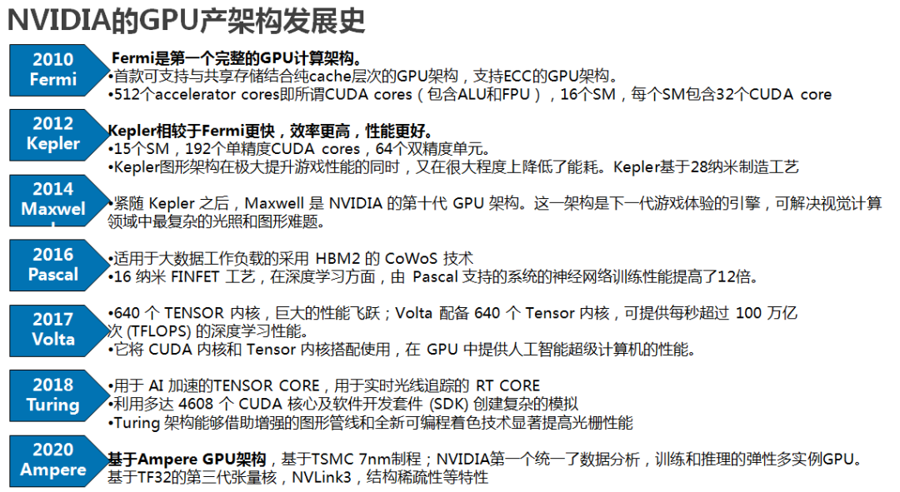

- **Kepler 架构里**，FP64单元和FP32单元的比例是1:3或者1:24；K80。
- **Maxwell 架构里**，这个比例下降到了只有1:32；型号M10/M40。
- **Pascal 架构里**，这个比例又提高到了1:2(P100)但低端型号里仍然保持为1:32，型号Tesla P40、GTX 1080TI/Titan XP、Quadro GP100/P6000/P5000
- **Votal 架构里**，FP64 单元和 FP32 单元的比例是 1:2；型号有 Tesla V100、GeForceTiTan V、Quadro GV100 专业卡。
- **Turing 架构里**，一个SM中拥有64个半精度，64个单精度，8个Tensor core，1个RT core。
- **Ampere 架构的设计突破**，在8代GPU架构中提供了该公司迄今为止最大的性能飞跃，统一了AI培训和推理，并将性能提高了20倍。A100是通用的工作负载加速器，还用于数据分析，科学计算和云图形。

总结：NVDIA GPU 用到的 `SIMT` 基本编程模型都是一致的，每一代相对前代基本都会在 SM 数量、SM 内部各个处理单元的流水线结构等等方面有一些升级和改动。

### Tensor 算力和 FP32 算力

Tensor Core 专注于矩阵计算，是专门用于深度学习的混合精度计算单元。

## Volta（伏特）架构

> 本文对 Volta 架构的总结是基于 Volta 架构白皮书资料总结而来，该[白皮书](https://images.nvidia.com/content/volta-architecture/pdf/volta-architecture-whitepaper.pdf)介绍了 Tesla V100 加速器和 Volta GV100 GPU 架构。

以基于 Volta GV100 GPU 架构的 Tesla V100 加速器为例，介绍 Volta 架构的主要特点:

1，**专门为深度学习优化的全新流式多处理器 (SM) 架构**

- 新型 Volta SM 的能效比上一代 Pascal 架构设计高 `50%`，可在相同功率范围内显着提升 FP32 和 FP64 性能。
- 专为深度学习设计的全新 `Tensor Core` 可提供高达 12 倍的训练峰值 TFLOPS 和 6 倍的推理峰值 TFLOPS。

2，**第二代 NVIDIA NVLink™**

Volta GV100 支持多达六个 NVLink 链路和 300 GB/秒的总带宽，而 GP100 仅支持四个 NVLink 链路和 160 GB/s 的总带宽。

3，**HBM2 显存：更快更高效**

Volta 架构高度优化l HBM2 显存，可提供 `900` GB/秒的**峰值内存带宽**。

4，**Volta 多进程服务**

Volta 多进程服务 (MPS) 是 `Volta GV100` 架构的一项新功能，可为 CUDA MPS 服务器的关键组件提供硬件加速，从而为共享 GPU 的多个计算应用程序提高性能、隔离和更好的服务质量 (QoS)。

5，等等

基于 Volta 架构的 Tesla V100 加速器的主要新技术如下图所示：

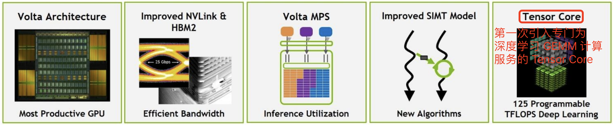

总结：个人认为 `Volta` 架构的最主要新特性是，在传统的单双精度计算之外还增加了专用的**Tensor Core** 张量单元，用于深度学习的 `GEMM` 计算。

### Volta GV100 GPU 硬件架构

与上一代 Pascal GP100 GPU 一样，GV100 GPU 由多个 GPU 处理集群 (GPC)、纹理处理集群 (TPC)、流式多处理器 (SM-STREAMING MULTIPROCESSOR) 和内存控制器组成。 完整的 GV100 GPU 包括: 

1. `6` 个 `GPC`，每个 GPC 都有：
- `7` 个 `TPC`（每个包含两个 SM）
- `14` 个 `SM`

2. `84` 个 Volta `SM`，每个 `SM` 都有：
- 64 个 FP32 核心
- 64 个 INT32 核心
- 32 个 FP64 核心
- 8 个张量核心（Tensor Cores）
- 4 个纹理单元（texture units）

3. 8 个 512 位内存控制器（总共 4096 位）

**总结**： 一个完整的 `GV100 GPU` 含有 `84` 个 `SM`，总共有 `5376` 个 `FP32` 核心、`5376` 个 INT32 核心、2688 个 FP64 核心、672 个Tensor Cores 和 336 个纹理单元。 每个 HBM2 DRAM 堆栈都由一对内存控制器控制。 完整的 GV100 GPU 包括总计 6144 KB 的二级缓存。 

下图显示了具有 84 个 `SM` 的完整 GV100 GPU（注意，不同的产品可以使用不同配置的 GV100）。Tesla V100 加速器使用 80 个 SM。 

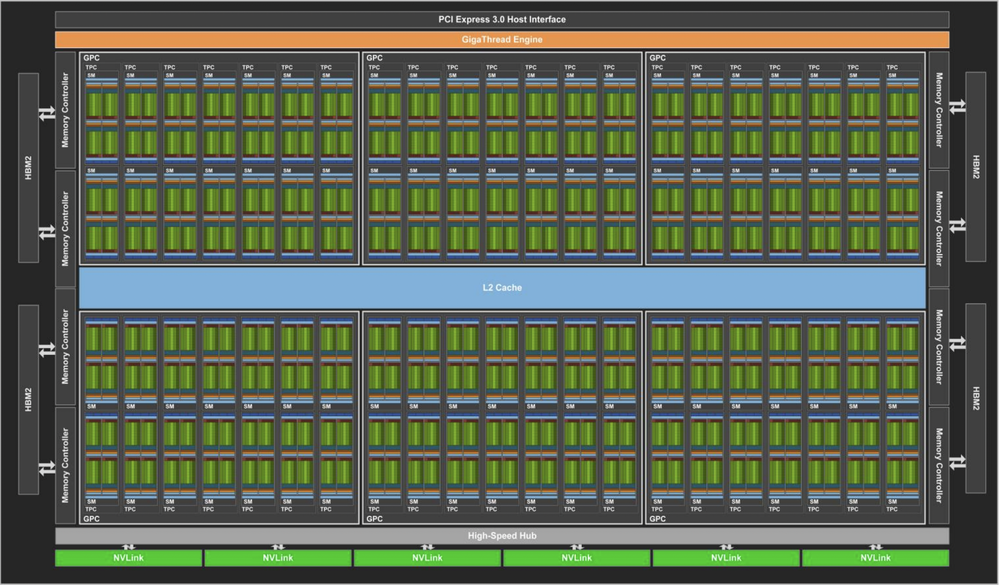
表 1 比较了过去五年的 NVIDIA Tesla GPU。

下表展示了 NVIDIA Tesla GPU 的比较。

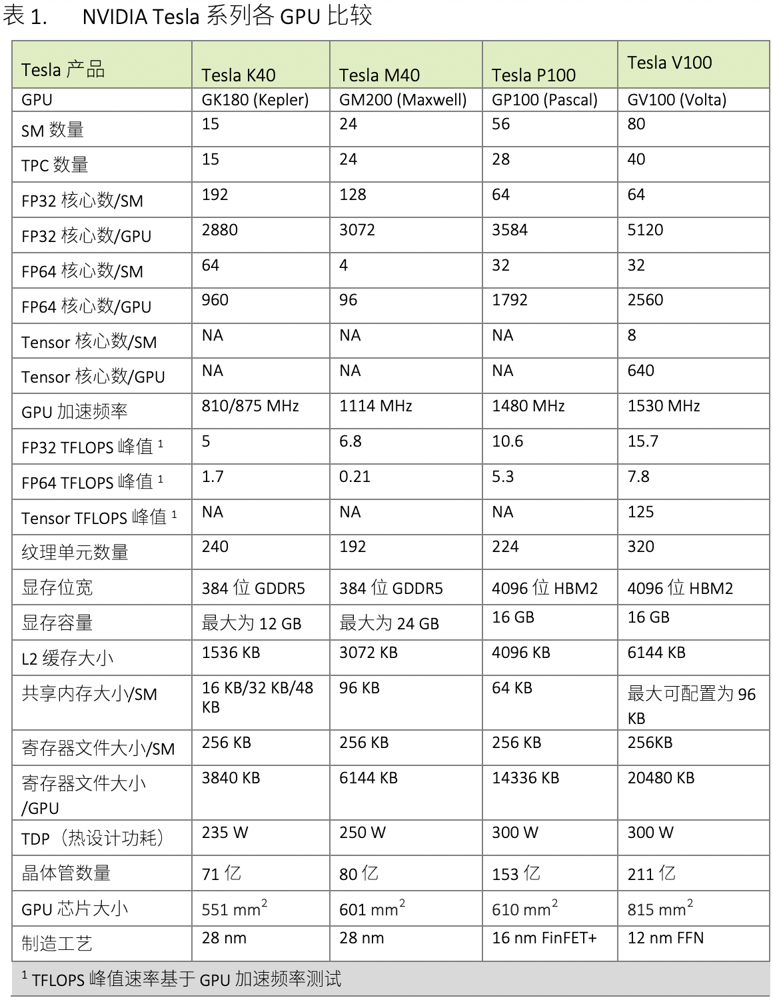

### Volta SM 硬件架构

`GV100 GPU` 有 `84` 个 `SM`。与 Pascal GP100 类似，GV100 的每个 SM 都包含 `64` 个 FP32 内核和 `32` 个 FP64 内核。 但是，`GV100 SM` 使用了**一种新的分区方法**来提高 SM 利用率和整体性能。 

- `GP100` `SM` 被划分为**两个处理块**，每个处理块具有 `32` 个 FP32 内核、16 个 FP64 内核、一个指令缓冲区、一个 `warp` 调度程序、两个调度单元和一个 128 KB 的寄存器文件。 
- `GV100` `SM` 分为**四个处理块**，每个处理块有 `16` 个 FP32 内核、8 个 FP64 内核、16 个 INT32 内核、两个用于深度学习矩阵运算的新混合精度 Tensor 内核、一个新的 L0 指令缓存、一个 warp 调度程序、一个调度单元和一个 64 KB 的寄存器文件。新的 L0 指令缓存现在用于每个分区，用以提供比以前的 NVIDIA GPU 中使用的指令缓冲区更高的效率。 

总的来说，与前几代 GPU 相比，GV100 支持更多的**线程、线程束**和**线程块**。 共享内存和 L1 资源的合并使每个 Volta SM 的共享内存容量增加到 96 KB，而 GP100 为 64 KB。

Volta GV100 流式多处理器(SM)架构如下图像所示：

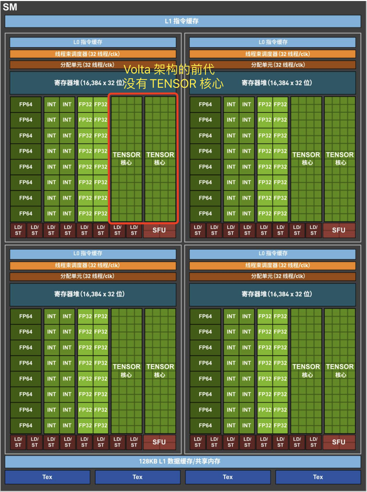

### Volta Tensor 核心

NVIDIA Volta 的 Tensor Core 是第一代，是专门用于深度学习的混合精度计算单元。

Tesla V100 GPU 包含 `640` 个 Tensor Core：每个 SM 有 `8` 个 Tensor Core，每个 SM 中的每个处理块（分区）有 2 个 Tensor Core。 

在 Volta GV100 中，每个 Tensor Core 每个时钟执行 64 次浮点 `FMA`（混合乘加）运算，即一个 SM 中的 8 个 Tensor Core 每个时钟执行总共 `512` 个 `FMA` 运算（或 1024 个单独的浮点运算）。

Tensor Cores 在具有 FP32 累加的 FP16 输入数据上运行。FP16 乘法产生全精度乘积，然后使用 FP32 加法与其他中间乘积进行累加，以实现 4x4x4 矩阵乘法，计算过程如下图所示。在实际项目中，Tensor Core 是用于执行更大的 2D 或更高维的矩阵运算，这些运算又由这些较小的元素块构建而成。

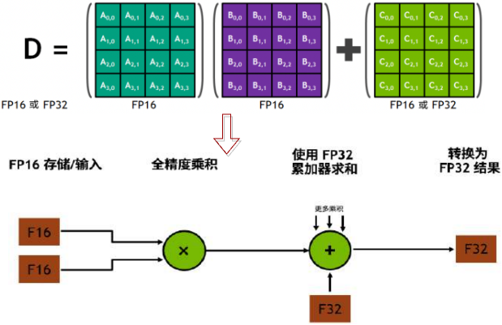

如果使用 CUDA 核心，对于 4x4 矩阵乘法需要执行 64 次浮点运算来生成 4x4 输出矩阵，而具有 Tensor Core 的基于 Volta 的 V100 GPU 执行此类计算的速度比基于 Pascal 的 Tesla P100 会快 12 倍。4x4 矩阵乘法使用cuda核心和tensor核心计算过程对比如下图所示。

Volta 架构的 Tensor Core 的特性已经在 `CUDA9` C++ API 提供，公开了专门的矩阵加载、矩阵乘法和累加以及矩阵存储操作，在 CUDA 级别，warp 级接口假设 16x16 大小的矩阵跨越 warp 的所有 32 个线程。

### HBM2 内存架构

虽然 Tesla P100 是全球第一个支持高带宽 HBM2 内存技术的 GPU 架构，但是 Tesla V100 的 HBM2 更快、更高效，支持最大 `16GB` 的内存容量，峰值内存带宽可达 900GB/s，而 Tesla P100 仅为 732GB/s。

### NVIDIA TESLA V100 芯片

NVIDIA TESLA V100 芯片是用于 `HPC`（高性能计算）的**专业卡**，是第一个配备 Tensor Core 的 GPU，采用 Volta 架构，提供 16GB 和 32GB 显存两个版本。主要规格如下如下表所示。

|                     | GPU 架构 | Tensor核心 | CUDA 核心 | FP64 算力 | FP32算力    | Tensor 效能 | 显存            | 显存带宽  | 互连带宽  |
| :------------------ | :------- | :--------- | --------- | --------- | ----------- | ----------- | --------------- | --------- | --------- |
| Tesla `V100` `PCle` | Volta    | 640        | 5120      | 7 TFLOPS  | 14 TFLOPS   | 112 TFLOPS  | 32GB /16GB HBM2 | 900GB/sec | 32GB/sec  |
| Tesla `V100` `SXM2` | Volta    | 640        | 5120      | 7.8TFLOPS | 15.7 TFLOPS | 125 TFLOPS  | 32GB /16GB HBM2 | 900GB/sec | 300GB/sec |

更加详细的规格如下图所示:

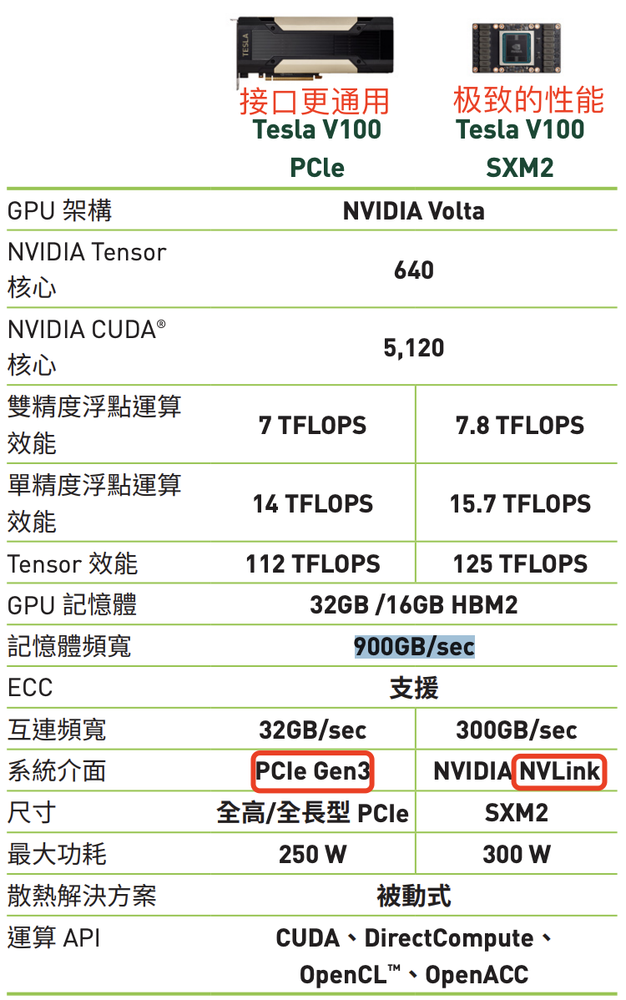

## Turing 架构

### NVIDIA T4 芯片

T4 卡显存为 `16GB`，显存带宽为 `300 GB/s`，主要规格如下如下表所示。

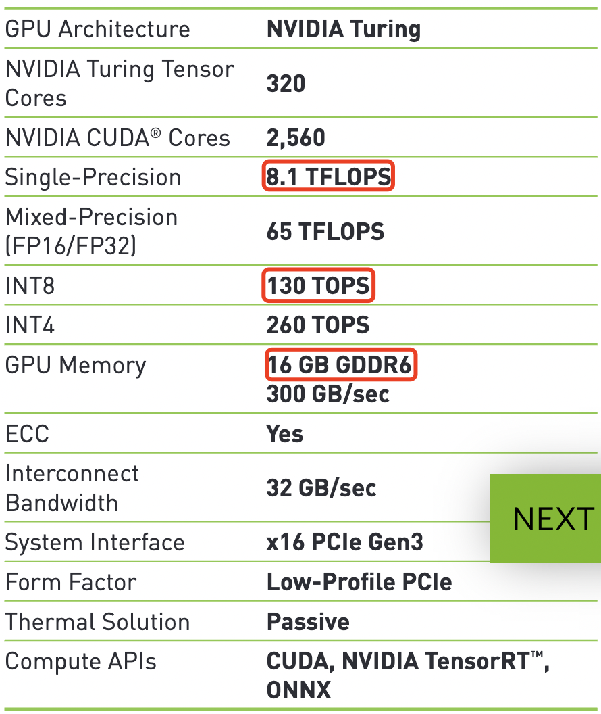

## Ampere 架构

### NVIDIA A100 芯片

NVIDIA A100 Tensor Core GPU 与前一代 NVIDIA Volta™ 相比，借助 Tensor 浮点运算 (TF32) 精度，A100 可使性能提升高达 `20` 倍；若使用自动混合精度和 FP16，性能可进一步提升 2 倍。与 NVIDIA® NVLink®、NVIDIA NVSwitch™、PCIe 4.0、NVIDIA® InfiniBand® 和 NVIDIA Magnum IO™ SDK 结合使用时，它能扩展到数千个 A100 GPU。

A100 提供了高达 `80GB` 的 GPU 显存和 `2TB/s` 的显存带宽，主要规格如下如下表所示。

|                      | GPU 架构 | FP64 算力  | FP64 Tensor Core | FP32 算力  | Tensor Float 32(`TF32`) | BFLOAT16 Tensor Core   | FP16 Tensor Core       | INT8 Tensor         | GPU 显存   | GPU 显存带宽 |
| :------------------- | :------- | :--------- | :--------------- | :--------- | :---------------------- | :--------------------- | :--------------------- | :------------------ | :--------- | :----------- |
| A100 PCIe| Ampere   | 9.7TFLOPS  | 19.5TFLOPS       | 19.5TFLOPS | 156 TFLOPS/312 TFLOPS*  | 312 TFLOPS/624 TFLOPS* | 312 TFLOPS/624 TFLOPS* | 624 TOPS/1248 TOPS* | 80GB HBM2e | 1935GB/s     |
| A100 SXM | Ampere   | 9.7 TFLOPS | 19.5TFLOPS       | 19.5TFLOPS | 156 TFLOPS/312 TFLOPS*  | 312 TFLOPS/624 TFLOPS* | 312 TFLOPS/624 TFLOPS* | 624 TOPS/1248 TOPS* | 80GB HBM2e | 2039GB/s     |

更加详细的规格如下图所示:

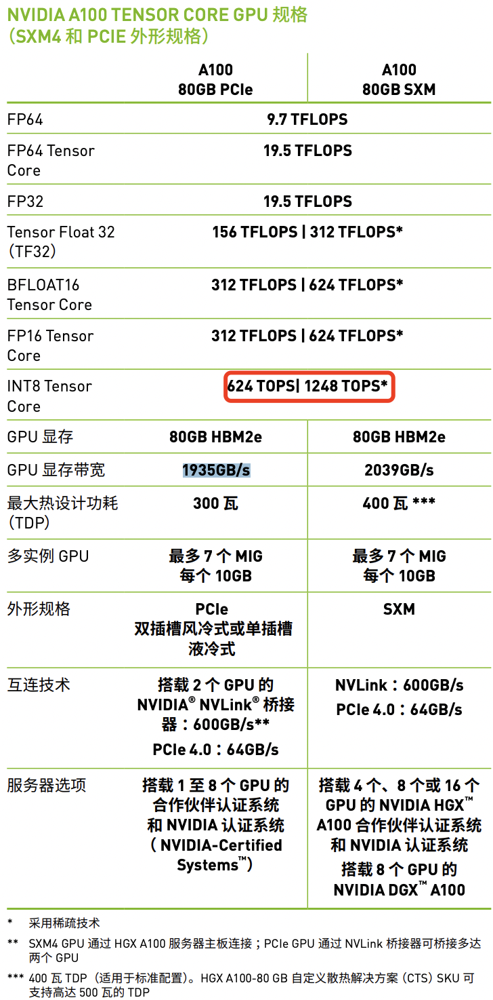

NVIDIA A100 GPU 的突破性创新点：
1. **基于 NVIDIA AMPERE 架构**
2. **第三代 TENSOR CORE 技术**
3. **新一代 NVLINK**
4. **多实例 GPU（MIG）技术**
5. **高带宽显存（HBM2E）**
6. **结构化稀疏**：A100 中的 TENSOR CORE 可为稀疏模型提供高达 `2` 倍多性能提升。

## Hopper 架构

以基于 NVIDIA Hopper™ GPU 计算架构的 H100 GPU 为例，介绍 Hopper™ 架构的主要特点:

1，**新的流式多处理器 (SM)**，在性能和效率方面有很多改进，包括：

- 与 `A100` 相比，**新的第四代** Tensor Core 芯片之间的速度最高可提升 6 倍，包括每个 SM 加速、额外的 SM 数量以及更高的 H100 时钟频率。对于单个 SM，与上一代 16 位相比，Tensor Core 在同等数据类型上计算 MMA（矩阵乘积累加）速度是 A100 SM 的 2 倍，如果使用新的 `FP8` 数据类型时，计算速度是 A100 的 `4` 倍。
- 值得注意点是，稀疏功能能支持**细粒度结构化稀疏**，这使得使标准 Tensor Core 运算的性能提高了一倍。
- 与 A100 GPU 相比，新的 DPX 指令最高可将动态编程算法的速度提升 7 倍。
- 与 A100 相比，IEEE FP64 和 FP32 的芯片间处理速度可提升 3 倍，这是因为每个 SM 的时钟频率提升了 2 倍，此外还有额外的 SM 数量以及更高的 H100 时钟频率。
- 新的线程块簇功能允许以比单个 SM 上的单个线程块更大的粒度对局部性进行编程控制。
- 新的**异步执行**功能包括新的 Tensor Memory Accelerator (TMA) 单元，此单元可以在全局显存和共享内存之间非常高效地传输大数据块。

2，**新的 Transformer 引擎**

该引擎结合了软件和定制的 Hopper Tensor Core 技术，专门用于加速 Transformer 模型的训练和推理，且能够智能管理并动态选择 FP8 和 FP16 计算，自动处理每层中 FP8 和 FP16 之间的重铸和缩放。与上一代 A100 相比，可令大型语言模型的 AI 训练速度最高提升 9 倍、AI 推理速度最高提升 30 倍。

3，**使用 `HBM3` 显存子系统**

与上一代产品相比，`HBM3` 显存子系统的带宽提升了近 2 倍。H100 SXM5 GPU 率先采用 HBM3 显存，可提供 `3TB/s` 的超高显存带宽。

4，**使用第二代多实例 GPU (MIG) 技术**

与 A100 相比，第二代多实例 GPU (MIG) 技术提供的计算容量大约增加了 3 倍，每个 GPU 实例的显存带宽提升了近 2 倍。现在首次提供具有 MIG 级别可信执行环境 (TEE) 的机密计算能力。支持多达七个单独的 GPU 实例，每个实例均配备专门的 NVDEC 和 NVJPG 单元。

5，**第四代 NVIDIA NVLink**

与上一代 NVLink 相比，第四代 NVIDIA NVLink® 可将全局归约操作的带宽提升 3 倍，通用带宽提升 50%，同时多 GPU IO 的总带宽为 `900GB/s`，是 PCIe 5.0 的 7 倍。

6，**PCIe 5.0 技术**

PCIe 5.0 的总带宽为 `128GB/s`（每个方向 64GB/s），而 PCIe 4.0 的总带宽为 `64GB/s`（每个方向 32GB/s）。PCIe 5.0 支持 H100 与超高性能的 x86 CPU 和智能网卡 / DPU（数据处理器）交互。

### Hopper GPU 架构
> 基于新 Hopper GPU 架构的 NVIDIA H100 GPU，这里简称为 `GH100 GPU`。

完整的 GH100 GPU 架构包括以下单元：

- 8 个 GPC、72 个 TPC（9 个 TPC/GPC）、2 个 SM/TPC、**每个完整 GPU 内含 144 个 SM**，每个 SM 内含：
  - `128` 个 FP32 CUDA Core 核心，即每个 GPU 内含 `18432` 个 FP32 CUDA Core 核心；
  - `4` 个第四代 Tensor Core 核心，即每个 GPU 内含 `576` 个第四代 Tensor Core 核心。
- 6 个 HBM3 或 HBM2e 堆栈、12 个 512 位内存控制器
- 60MB 二级缓存
- 第四代 NVLink 和 PCIe 5.0

配备 144 个 SM 的完整 GH100 GPU 核心的架构图如下所示：

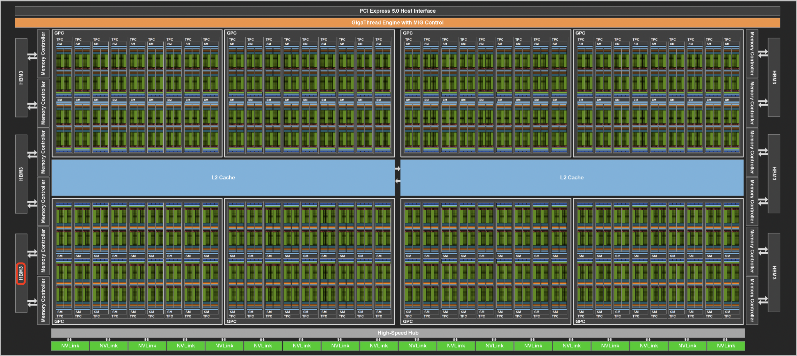

### H100 SM 架构

H100 SM 基于 NVIDIA A100 Tensor Core GPU SM 架构而构建。但由于引入了 `FP8`，与 A100 相比，H100 SM 将每 SM 浮点计算能力峰值提升了 4 倍，并且对于之前所有的 Tensor Core 和 FP32 / FP64 数据类型，将各个时钟频率下的原始 SM 计算能力**增加了一倍**。

Hopper 新的第四代 Tensor Core、Tensor 内存加速器以及许多其他新 SM 和 H100 架构的总体改进，在许多其他情况下可令 `HPC` 和 `AI` 性能获得最高 `3` 倍的提升。

GH100 流式多处理器 (SM)架构如下图所示:

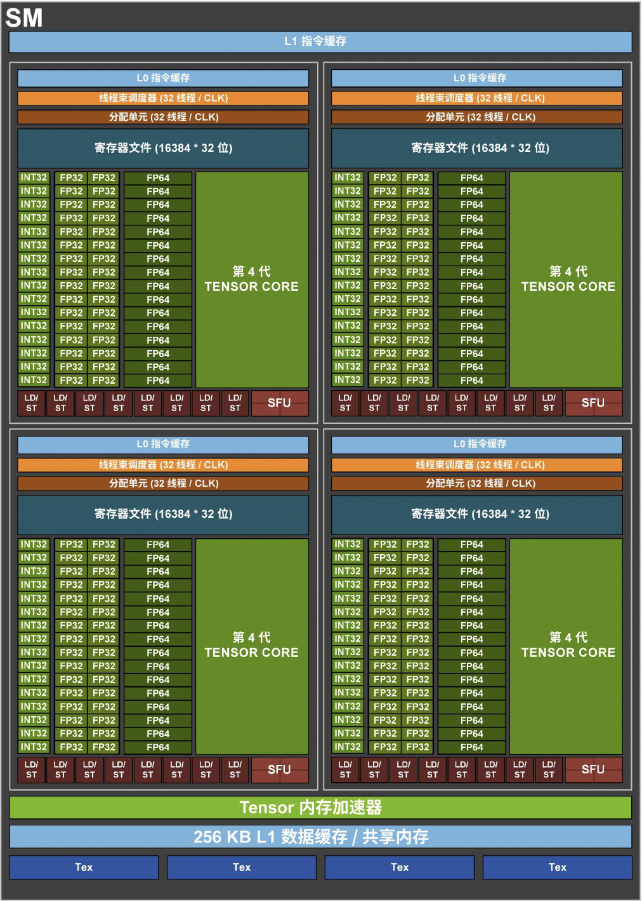

### H100 Tensor Core 架构

Tensor Core 是专门用于矩阵乘积累加 (`MMA`) 数学运算的高性能计算核心，可大大提升 AI 和 HPC 应用的性能。与标准浮点 (`FP`) 运算、整数 (`INT`) 运算和融合乘加 (`FMA`) 运算相比，在一个 NVIDIA GPU 内跨 SM 并行运行的 Tensor Core 可大幅提高吞吐量和效率。`Tensor Core` **首次引入**是在 NVIDIA Tesla® V100 GPU 中，并在每一代新的 NVIDIA GPU 架构中不断增强这一核心。

与 A100 相比，H100 中新的**第四代** Tensor Core 架构可使每时钟每个 SM 的**原始密集计算**和**稀疏矩阵运算**吞吐量提升一倍，考虑到 H100 比 A100 拥有更高的 GPU 加速频率，其甚至会达到更高的吞吐量。

其支持 FP8、FP16、BF16、TF32、FP64 和 INT8 MMA 数据类型。新的Tensor Core 还能够实现更高效的数据管理，最高可节省 30% 的操作数传输功耗。

`NVIDIA Hopper™` 架构通过使用新的 `8` 位浮点精度 (`FP8`) 的 Transformer Engine 改进了第四代 Tensor Cores，H100 FP16 Tensor Core 的吞吐量是 A100 FP16 Tensor Core 的 3 倍。

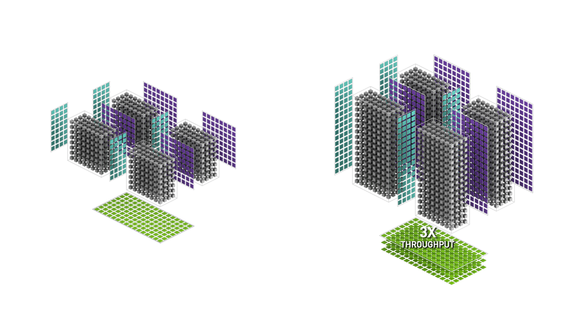

### 英伟达 Tensor Core 特性总结
英伟达不同架构的 Tensor Core 特性对比如下表所示：

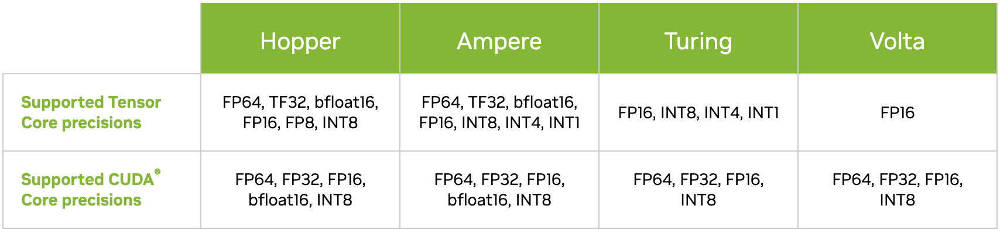

### NVIDIA H100 芯片

NVIDIA H100 GPU 是用于 `HPC`（高性能计算）的**专业卡**，基于 NVIDIA Hopper™ GPU 计算架构，内置 transformer Engine，对生成式 AI、大型语言模型 (LLM) 和推荐系统的开发、训练和部署都进行了优化。

与上一代产品 `A100` 相比，H100 的综合技术创新可以将 `LLM` 训练速度提高 `9` 倍，LLM 推理速度提高 `30` 倍！

另外，NVIDIA H100 是第一款完全异步 GPU。H100 扩展了 A100 跨所有地址空间的全局到共享异步
传输，并增加了对张量内存存取模式的支持。它使应用能够构建端到端的异步流水线，将数据
移入和移出芯片，在完成计算同时完全隐藏数据搬运。

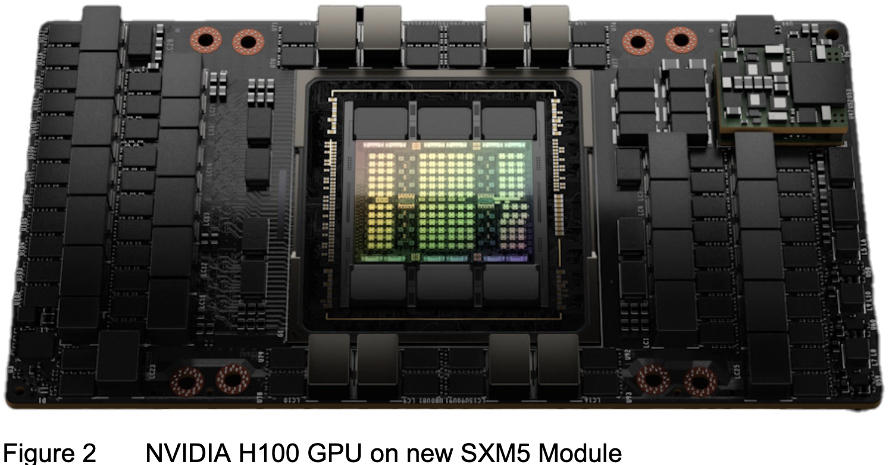

A100 提供了高达 `80GB` 的 GPU 显存和 `3.35TB/s` 的显存带宽，主要规格如下如下表所示。

| |GPU 架构|FP64 算力|FP64 Tensor Core|FP32 算力|TF32 Tensor Core|BFLOAT16 Tensor Core|FP16 Tensor Core|FP8 Tensor Core|INT8 Tensor Core|GPU 显存| GPU 显存带宽|
|-|:------| :-------|:---------------|:-------| :--------------| :------------------| :--------------| :-------------| :--------------| :-----|:-----|
| H100 PCIe| Hopper| 26 teraFLOPS | 51 teraFLOPS| 51 teraFLOPS | 56teraFLOPS* |1,513 teraFLOPS*|1,513 teraFLOPS*|3026 teraFLOPS*|3026 teraFLOPS*|80GB HBM2e |2TB/s |
| H100 SXM | Hopper|34 teraFLOPS | 67 teraFLOPS| 67 teraFLOPS | 989 teraFLOPS* |1979 teraFLOPS*|1979 teraFLOPS*| 3958 teraFLOPS*|3958 teraFLOPS*|80GB HBM2e | 3.35TB/s|

> `*` 表示采用稀疏技术后的算力情况，不使用稀疏技术时，规格降低一半。

更加详细的规格如下图所示:

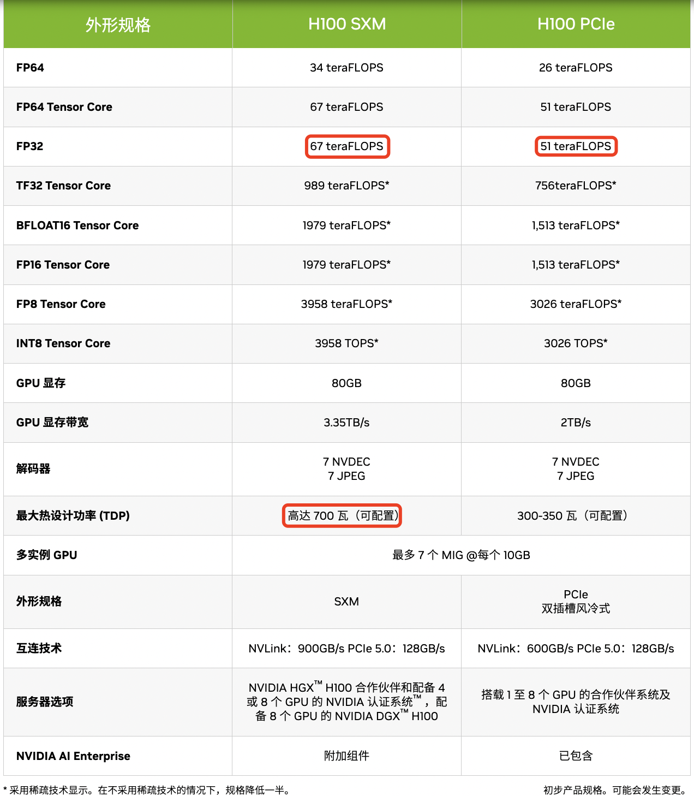

## V100/A100/H100 计算能力对比

下表比较了不同 NVIDIA GPU 架构之间的计算能力参数。

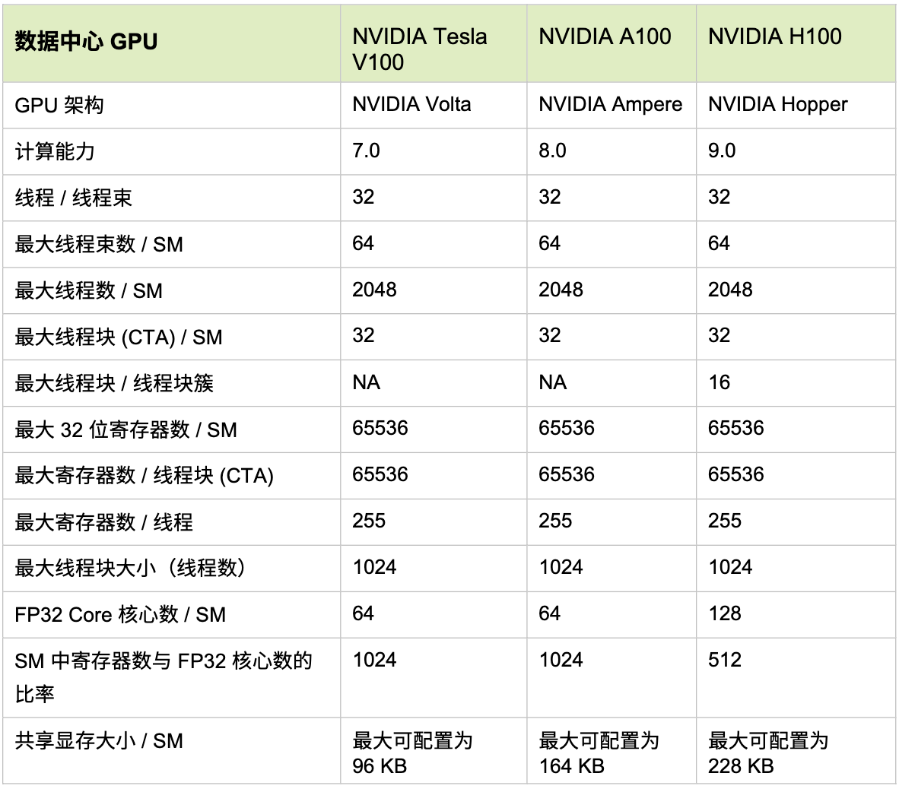

## 参考资料

1.[NVIDIA TESLA V100 GPU 加速器数据手册](https://www.nvidia.com/content/dam/en-zz/zh_tw/Solutions/design-visualization/grid-vpc-vapps/volta-v100-datasheet-update-a4-636418-r4-tw.pdf)
2. [Volta-Architecture 白皮书-中文版](https://www.nvidia.cn/content/dam/en-zz/zh_cn/Solutions/Data-Center/volta-gpu-architecture/Volta-Architecture-Whitepaper-v1.1-CN.compressed.pdf)
3. [NVIDIA A100 GPU 中文数据手册](https://images.nvidia.cn/aem-dam/en-zz/Solutions/data-center/a100/nvidia-a100-datasheet-nvidia-a4-2188504-r5-zhCN.pdf)
4. [NVIDIA H100 GPU 英文数据手册](https://resources.nvidia.com/en-us-tensor-core/nvidia-tensor-core-gpu-datasheet)
5. [NVIDIA H100 Tensor 核心 GPU官网介绍页面](https://www.nvidia.cn/data-center/technologies/hopper-architecture/)
6. [NVIDIA H100 Tensor Core GPU 架构白皮书-中文版](https://resources.nvidia.com/cn-hopper-architecture)
7. [NVIDIA Turing-Architecture-Whitepaper](https://images.nvidia.com/aem-dam/en-zz/Solutions/design-visualization/technologies/turing-architecture/NVIDIA-Turing-Architecture-Whitepaper.pdf)

