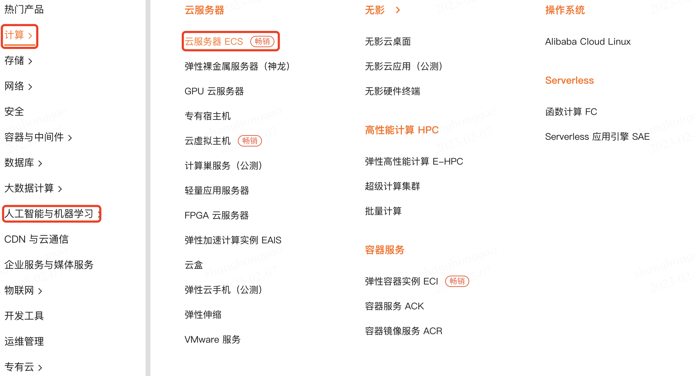
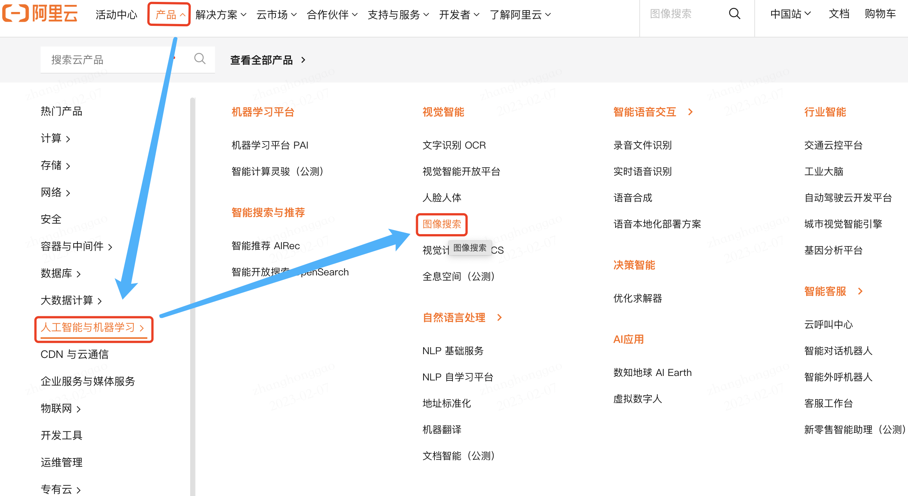
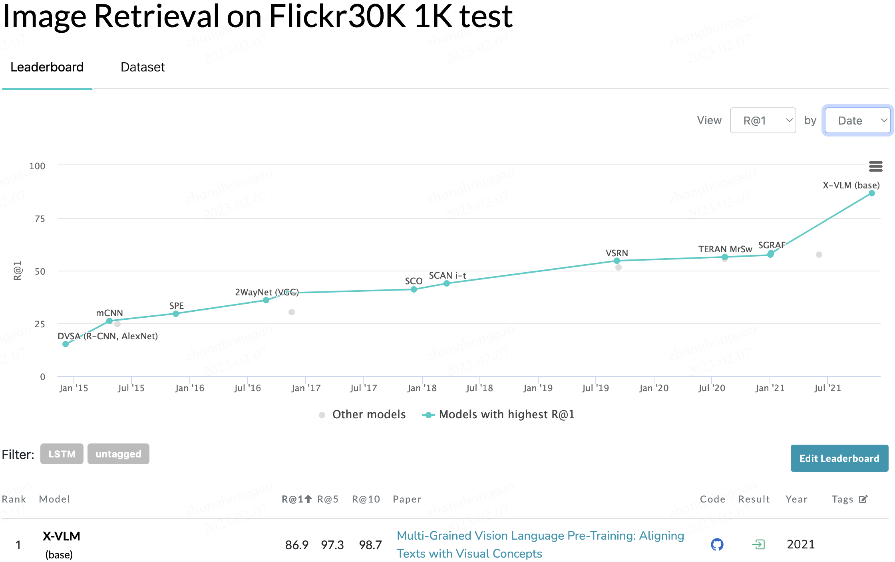
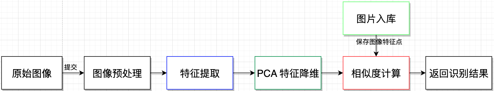
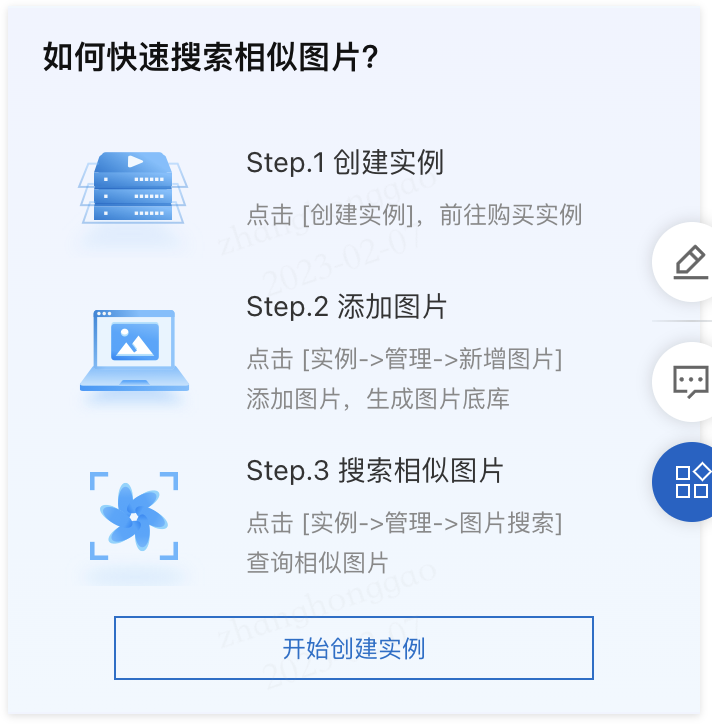
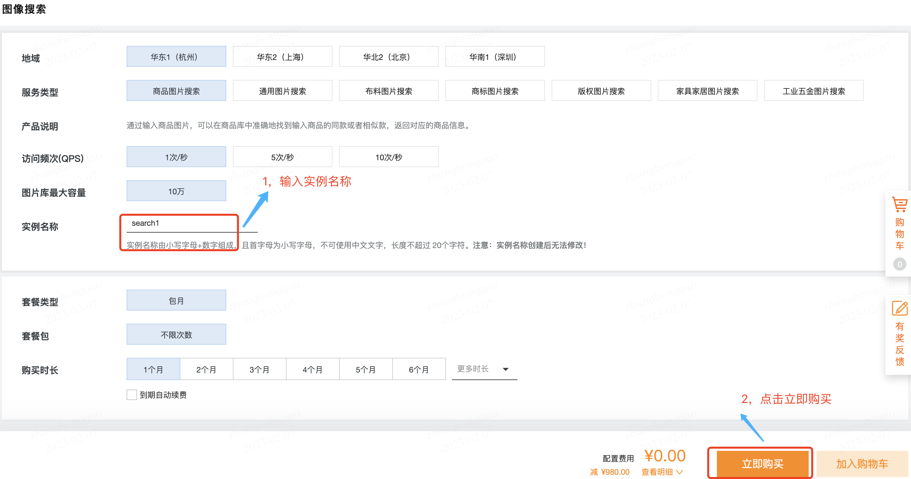
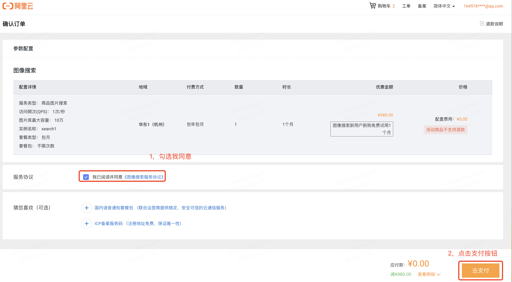
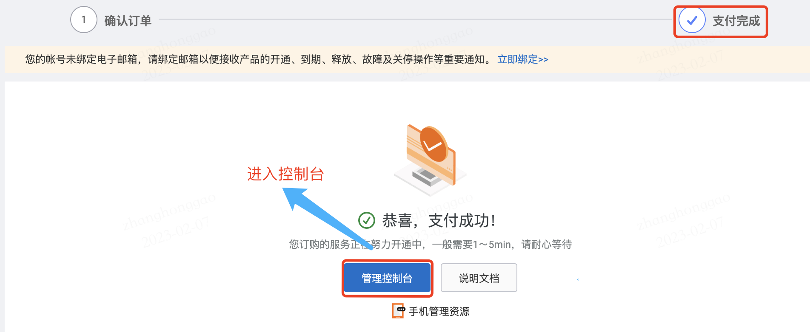
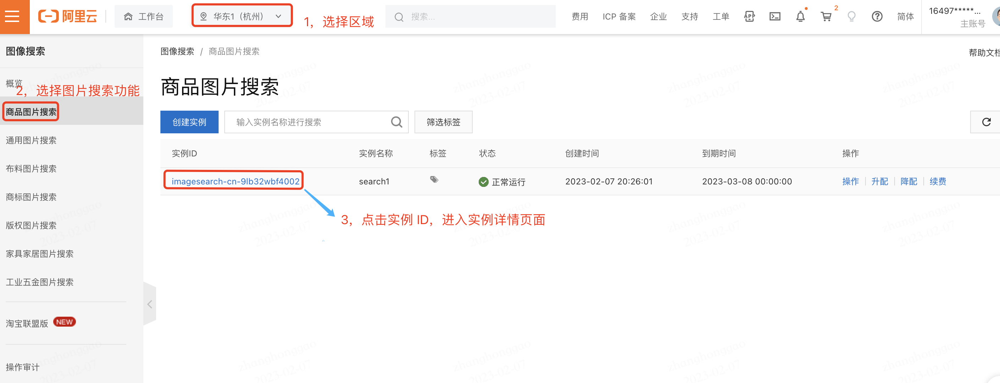
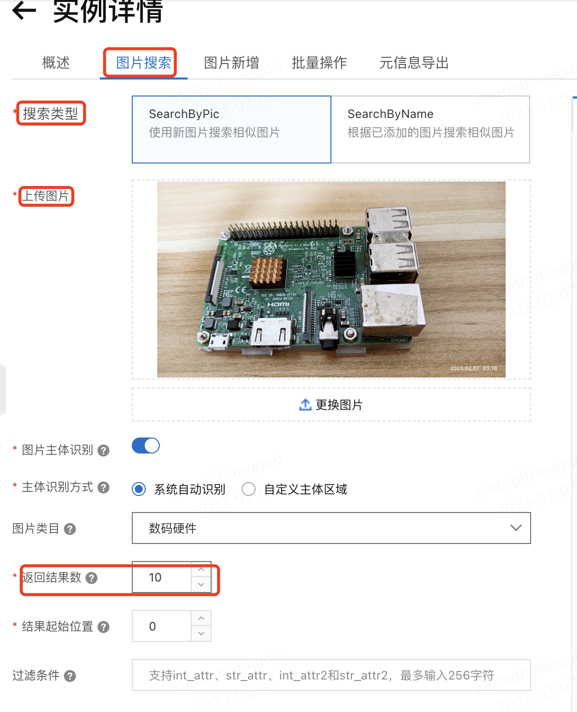

## 背景知识

### 什么是云计算

对于纯新人，首先我们需要了解下什么是云计算。所谓云计算，就是指通过互联网，以按需服务的形式提供计算资源。这样企业就无需自行采购、配置或管理资源，而且只需要为实际使用的资源付费。

通俗来讲，就是将实体物理计算机提供的各种服务搬到了线上，这样即使我们没有实体电脑也能体验和使用一些计算资源，比如：云服务器、云数据库、人工智能相关服务等。

### 阿里云产品

阿里云计算提供的热门产品包括以下几类:

- 计算：如云服务器 ECS ，可能最为畅销
- 存储：如文件存储 NAS 
- 网络：如负载均衡 SLB、弹性公网 IP 
- 安全：如 WEB 应用防火墙
- 容器与中间件：如分布式容器服务平台
- 数据库：如关系型数据库、数据仓库
- 大数据计算：如云原生大数据计算服务 MaxCompute
- 人工智能与机器学习：提供人工智能产品等 API 调用功能，一般按调用次数计费，本文测评等产品-图像检索属于此类。
- CDN 与云通信：CDN
- 企业服务与媒体服务：如视频点播服务
- 物联网：如 AliOS Things 物联网操作系统。
- 开发工具：如代码管理与流水线
- 运维管理：如日志服务（SLS）。




## 一，图像检索原理

### 1.1，图像检索概述

在大型图像数据库上，`CBIR`(Content-Based Image Retrieval，基于内容的图像检索) 技术用于检索在视觉上具相似性的图像。它是计算机视觉中的一项基本任务，因为它与各种实际应用直接相关。`CBIR`是通过分析视觉内容（颜色、纹理、形状、物体等），在图库中搜索相关图像的问题。

**图像检索**的通俗定义：从一堆图片中找到与待匹配的图像相似的图片，即以图搜图，图像检索的一个子问题是以人搜人，也称为行人重识别。

> 本文对 CBIR 和图像检索、图像检索的定义不做严格区分，都指代图像检索技术。

### 1.2，图像检索任务分类

通常，CBIR 方法可以分为两个不同的任务：

1. **类别级图像检索**（CIR），也叫相同类别物体检索。

   对给定的查询图片，相似图像检索的目标是从图像库中查找出那些与给定查询图像属于同一类别（例如，狗，汽车）的图像。

2. **实例级图像检索**（IIR），也叫相同物体图像检索。

   相同物体图像检索是指对查询图像中的某一物体，从图像库中找出包含有该物体的图像。一个特定实例（例如，埃菲尔铁塔，我的邻居的狗）的查询图像可以在不同的条件下被捕获，如不同的成像距离、视角、背景、光照和天气条件（重新识别同一实例的范例）。

> 关于人脸识别问题和图像检索问题的关系，我个人理解是人脸识别可以看作是一种更严格的相同物体图像检索问题。

图像检索任务另外一种分类划分：

1. 追求所谓的**相似性**，即从图像数据库中找到相似或相同的图片。

   **常见的人脸识别，行人重识别（reid），购物商品检索，草图检索，都是属于这个范畴**，目前的深度学习方法，更多的就是追求如何获得更好的 feature，在这些领域，特征提取方法都是可以通用，即 backbone 是通用的。

2. **传统领域里的 match 的问题**。即如果某个建筑在一张图里出现，假使其在另外一张图里只出现一半，或者在某个角落里出现，能否再次找到。

   如果直接采用 cnn 特征，很有可能找到的轮廓相似的建筑物，**而非相同的建筑物**。这种情况下，一般是切成 patch 再分别抽特征，随着目标检测模型的进步，可以直接在最后的 feautre map 上直接划分。也可以对 feature map 的特征做 vlad（Vector of Local Aggregated Descriptors）或者 fv（Fisher Vector）的编码再检索。一般论文里的标题都是 CBIR，instance retrieval 这种。

> FV（Fisher Vector）[10](https://leovan.me/cn/2022/01/content-based-image-retrieval/#fn:10) 本质上是用似然函数的梯度向量表示一幅图像。梯度向量的物理意义就是描述能够使模型更好地适应数据的参数变化方向，也就是数据拟合中参数调优的过程。

### 1.2，图像检索技术发展历程

> 传统图像处理中图像特征分为：全局特征（颜色、纹理、形状）和局部特征（SIFT和 SURF描述符）两类。

图像检索（也叫以图搜图）技术等发展大致经历了三个阶段：

1. 最初的图像检索引擎是基于文本关键字检索的。

   即利用图像的文件名和路径名、图像周围的文本，以及Alt标签中的注释索引和搜索相关图像的。从本质上来说，**这样的图像检索引擎其实还是基于文本搜索引擎的**，因为对比的是文本信息而不是直接图像信息。

2. 1992年，T. Kato提出了基于内容的图像检索（CBIR）概念，即人工提取图像特征构建索引以实现图像检索。

   首先基于传统图像处理技术（如SIFT特征提取算子）进行特征提取，然后将图像特征信息进行编码，并将海量图像编码做查找表，最后进行相似度匹配运算。

3. 基于计算机视觉技术的图像检索技术。

​	随着人工智能技术（深度学习）的发展，CNN 和 Transformer 技术在自动提取图像特征方面已经做得非常优秀，因此**极大地提高了图像表达和搜索的准确性。**目前主流搜索引擎的图像检索功能其实都引入了深度学习算法。

### 1.3，图像检索的SOTA 模型

从 [paperswithcode](https://paperswithcode.com/sota/image-retrieval-on-flickr30k-1k-test) 可以看出图像检索领域最新的 SOTA 模型-[X-VLM](https://paperswithcode.com/paper/multi-grained-vision-language-pre-training) 是在 2021 年发表的，后续没有更好的论文。



### 1.4，**图像检索算法流程**

图像检索算法流程的 `pipeline` 如下所示：



注意，上述步骤中，图片入库是用户看不到的。**图像特征相似度**的度量标准一般有以下几类：

1. 欧氏距离
2. 曼哈顿距离
3. 海明距离
4. 余弦相似度
5. 杰卡德相似度

## 二，阿里云 ImageSearch 产品测评

### 2.1，ImageSearch 产品介绍

[图像搜索（Image Search）](https://ai.aliyun.com/imagesearch?spm=a2c6h.27938646.J_4502519820.4.2e003899dxLYYz)是一款用于图片间相似性检索的平台型产品。图像搜索以深度学习和机器视觉为核心，提取图片内容特征、建立图像搜索引擎。用户通过输入图片，用以图搜图的方式可快速在图片库中检索到与输入图片相似的图片集合。可广泛应用于拍照购物、商品推荐、版权保护等场景。

### ImageSearch 使用过程

阿里云的图像搜索（ImageSearch）产品主要用来实现搜索相似图片功能，其简单使用过程总结如下：

1. 创建实例
2. 添加图片
3. 搜索相似图片。



1，**第一步，我们要完成产品实例的免费创建，并进入控制台页面**。

点击[免费试用链接](https://common-buy.aliyun.com/?spm=a2c6h.27938646.J_4502519820.3.2e003899dxLYYz&commodityCode=imagesearch&regionId=cn-hangzhou#/buy)，进入产品示例购买页面，并输入实例名称（注意不要超过20个字符），然后点击立即购买，进入订单确认页面，因为是试用链接，所以应付款为 0，点击支付按钮，再次点击支付按钮，最后完成支付和实例的创建。








2，**第二步，在实例中新增等待搜索的图片**

点击实例 ID 进入实例详情页面，选择图片搜索，确定搜索类型、上传图片并输入相关配置后，点击确认即可得到 `json` 形式的字符串返回结果。





3，**第三步，解析字符串形式的返回结果**

参考教程-[图片查询](https://help.aliyun.com/document_detail/66582.html)，理解各个参数的含义，从而得到易理解的图片搜索结果。这里我输入的是树莓派3B的图片，返回结果如下所示:

```json
{
  "data": {
    "result": {
      "body": {
        "auctions": [],
        "code": 0,
        "head": {
          "docsFound": 0,
          "docsReturn": 0,
          "searchTime": 225
        },
        "picInfo": {
          "allCategories": [
            {
              "id": 0,
              "name": "Tops"
            },
            {
              "id": 1,
              "name": "Dress"
            },
            {
              "id": 2,
              "name": "Bottoms"
            },
            {
              "id": 3,
              "name": "Bag"
            },
            {
              "id": 4,
              "name": "Shoes"
            },
            {
              "id": 5,
              "name": "Accessories"
            },
            {
              "id": 6,
              "name": "Snack"
            },
            {
              "id": 7,
              "name": "Makeup"
            },
            {
              "id": 8,
              "name": "Bottle"
            },
            {
              "id": 9,
              "name": "Furniture"
            },
            {
              "id": 20,
              "name": "Toy"
            },
            {
              "id": 21,
              "name": "Underwear"
            },
            {
              "id": 22,
              "name": "Digital device"
            },
            {
              "id": 88888888,
              "name": "Other"
            }
          ],
          "categoryId": 22,
          "multiRegion": [
            {
              "region": "282,1973,180,1282"
            }
          ],
          "region": "282,1973,180,1282"
        },
        "requestId": "EAD5F8B7-2BAB-52F5-89D6-AE2F16569E2E",
        "success": true
      },
      "headers": {
        "access-control-allow-origin": "*",
        "date": "Tue, 07 Feb 2023 12:47:36 GMT",
        "content-length": "635",
        "x-acs-request-id": "EAD5F8B7-2BAB-52F5-89D6-AE2F16569E2E",
        "connection": "keep-alive",
        "content-type": "application/json;charset=utf-8",
        "x-acs-trace-id": "e52901da46aa5e61a2243a1109cf0a93"
      },
      "statusCode": 200
    }
  },
  "success": true
}
```

`"categoryId": 22`，参考[类目参考](https://help.aliyun.com/document_detail/179184.htm?spm=a2c4g.11186623.0.0.7a9371729uYUdj#concept-1935266)页面，可知 "categoryId": 22 表示属于**数码硬件**类别，识别正确！

### 2.3，总结

到这里，关于图像搜索产品的北京、原理和使用过程都已经叙述完毕了，个人感觉图像搜索这款产品的识别准确率还不错，但是返回结果的可视化功能还有待提升，目前是纯 `json` 形式的字符串返回结果，不如直接图片上添加文字和方框形式的返回结果直观。

## 参考资料

1. 《**自制AI图像搜索引擎**》
2. [图像检索｜经典方法｜快速入门｜发展评估](https://zhuanlan.zhihu.com/p/595209084)
3. [图像检索：基于内容的图像检索技术](https://yongyuan.name/blog/cbir-technique-summary.html)