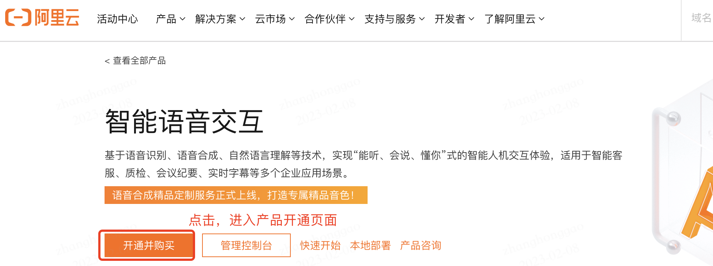
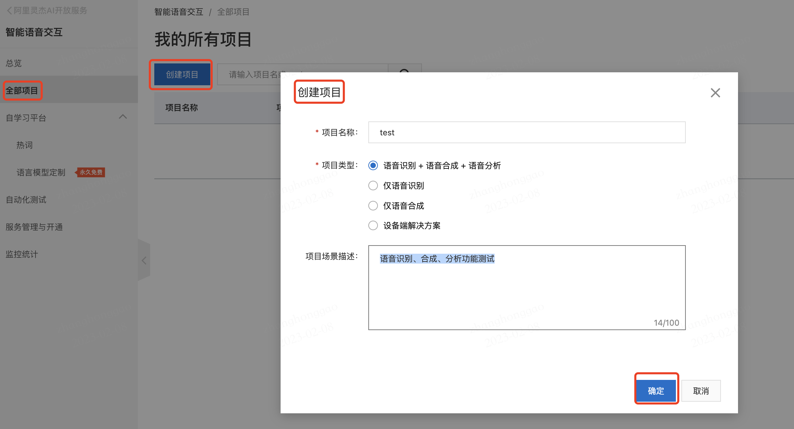
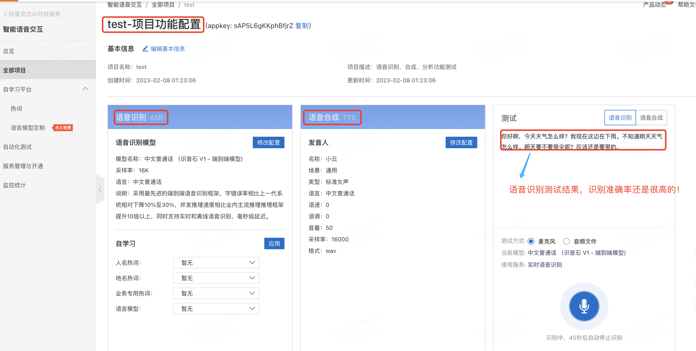
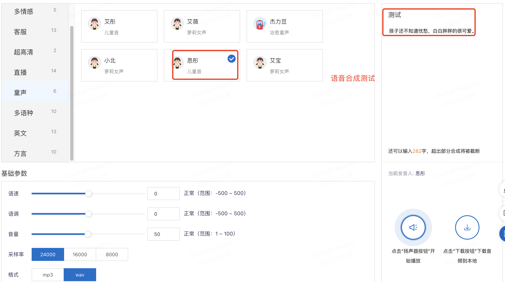
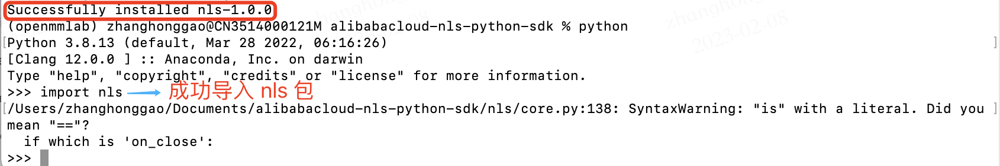

## 一，产品概述

阿里云的智能语音交互产品提供**语音识别、语音合成、自然语言理解**等技术，实现“能听、会说、懂你”式的智能人机交互体验，适用于智能客服、质检、会议纪要、实时字幕等多个企业应用场景。

其主要有以下优势：

- **定制识别及发音**：可用于客服、阅读、虚拟人等场景
- **易接入**：并提供API和多种SDK
- 识别准确率高：持续迭代提升
- 响应速度快：低延迟，秒级处理返回语音识别结果

## 二，产品在线使用

### 2.1，**开通产品服务**

首先，进入[智能语音交互产品首页](https://ai.aliyun.com/nls)，单击**开通并购买**，然后在产品开通页面，选择服务类型并选中**服务协议**，单击**立即开通**，即可开通智能语音交互服务。




### 2.2，**管理项目**

登录[智能语音交互控制台](https://nls-portal.console.aliyun.com/applist?spm=a2c4g.11186623.0.0.46656e20A4YWIq)，创建项目生成 `Appkey`，并进入项目功能配置页面。



然后就可以根据我们的任务和使用场景，选择配置项目所需的语音识别和语音合成模型。

1，我使用默认的语音识别模型在**办公室场景**下，测试了语音识别（ASR）功能，初步感觉准确率还是很高的，语音对应文字都识别出来了。产品项目功能配置页面和语音识别结果如下图所示。



2，目前语音识别模型支持中国语言多大24种，包括：普通话、中英文混合说、四川话等等，并支持 50 种外国语言。我测试了中英文混合说模型，发现如果我自己读的英语发音不是很标准的话，其识别会出现错误，但用机器朗读的口语能完全准确识别。


3，语音合成 `TTS` 的功能基本使用是没有问题的，支持的声音类型也有很多种，但是实际测试下来，个人感觉能够听出来是电脑“合成”的声音，效果还是不够自然，期待后续迭代更新。



## 三，服务端Python SDK 测试

### 3.1，下载安装

按照以下脚本下载 SDK 并安装在服务端电脑。

```shell
# 1,下载Python SDK。
git clone https://github.com/aliyun/alibabacloud-nls-python-sdk.git
# 2, 安装SDK依赖: 进入SDK根目录使用如下命令安装SDK依赖
python -m pip install -r requirements.txt
# 3, 安装SDK包: 依赖安装完成后使用如下命令安装SDK
python -m pip install .
# 4，安装完成后通过以下代码导入SDK。
import nls
```

注意上述脚本命令均需要在SDK根目录中执行。

安装完 `nls` 包后，进入 python 解释器环境，如果 `import nls` 代码能运行成功，则说明 sdk 安装完成，如下图所示。



## 四，产品使用总结

个人感觉阿里[智能语音交互](https://ai.aliyun.com/nls?spm=a2c6h.27949115.J_4502519820.2.60212cedNml1bw)产品的精度还是很高的，通过 sdk 的方式嵌入在其他代码中也很方便，可以应用在工业界产品中，比如智能音箱。

虽然有诸多优点，但再完美的产品也是缺点的，以下是我测评之后总结的一些可以考虑改进的点：

- SDK 文档描述不够清晰，给出的代码示例不够丰富，且注释很少
- 语音合成效果可以更自然些

## 参考资料

1. [智能语音交互产品-管理项目](https://help.aliyun.com/document_detail/72214.htm)