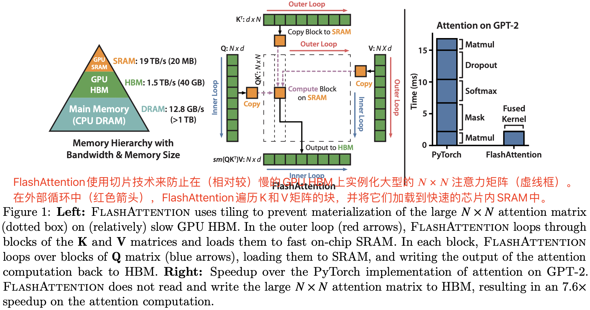
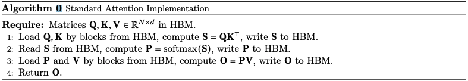
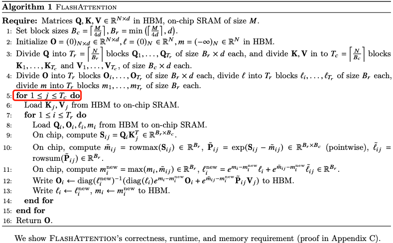
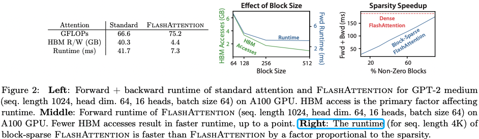
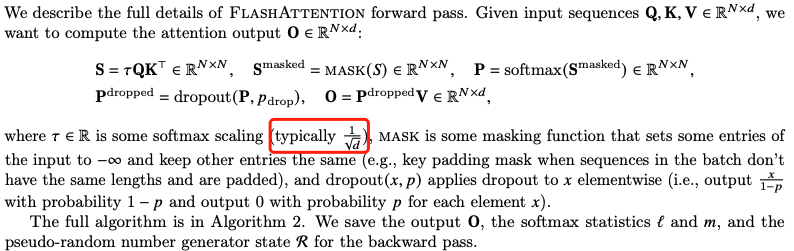
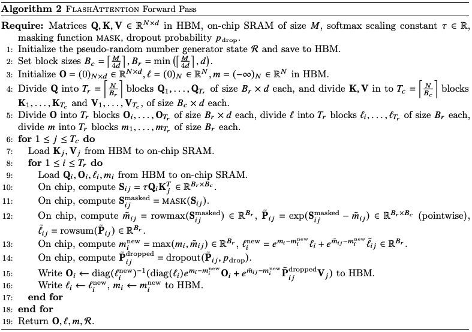

## 1，介绍

Transformer 模型目前已经成为自然语言处理和图像分类等领域中使用最广泛的神经网络架构。虽然 Transformer 模型已经变得越来越大和深，但是处理更长的上下文依然还是有困难，最主要的原因是其核心模块-自注意力机制的时间和内存复杂度是序列长度的二次方。一个重要的问题是，让注意力更快、内存效率更高是否可以帮助 Transformer 模型解决长序列的运行时和内存挑战。

> $Attention(Q,K,V) = softmax(\frac{QK^T}{\sqrt{d_k}})V$

许多近似自注意力方法旨在降低注意力的计算和内存需求，比如稀疏逼近 sparse-approximation [51, 74]、低秩逼近 low-rank approximation [12, 50, 84]以及它们的组合[3, 9, 92]。尽管这些方法将 Flops 降低到与序列长度线性或接近线性的水平，但并未在实际运行时间上显著提速，与标准注意力相比也没有被广泛采用。一个主要原因是它们侧重于减少浮点运算量（FLOPs 与实际运行时间不一定相关），而忽略内存访问代价（`MAC`）。

> 减少算子对 FLOPs 不一定会减少运行时间，还要关注其内存访问代价 MAC，这个结论在 shufflenetv2 论文就旗帜鲜明指出了。

在这篇论文中，我们提出一个新原则-**让注意力算法具备 IO 感知性** IO-aware [1]，即考虑对不同速度的内存的读取和写入操作（GPU 芯片上的快速 SRAM 和相对较慢的 GPU 高带宽内存）。**在现代 GPU 中，计算速度已经超过了内存读写速度 [61, 62, 63]，而 Transformers 中的大多数操作都受到内存访问的限制[43]。**



对于类似于内存受限操作的任务，IO 感知算法非常重要，因为数据的读取和写入会占用运行时的大部分时间，比如数据库连接[71]、图像处理[70]、数值线性代数[4]等等[40, 85]。然而，通常用于深度学习的常见 Python 接口，如 PyTorch 和 Tensorflow，不允许对内存访问进行精细控制。

我们提出了 FlashAttention，一种新的注意力算法，它可以在极少的内存访问次数下计算出准确的注意力。我们的主要目标是**避免从 HBM（显存）读取和写入注意力矩阵，**这需要（i）在不访问整个输入的情况下计算 softmax 缩减（reduction）（ii）不存储用于后向传递的大型中间注意力矩阵。为此，我们采用了两种已经被广泛使用的技术来解决这些挑战**：**

1. 我们重新构造了注意力计算，将输入分割成块并对输入块进行多次处理，逐步执行softmax 缩减（reduction）（也称为切片）。这样可以在不需要访问整个输入的情况下计算softmax归约。
2. 我们在前向传播中存储了softmax 归一化因子，以便在反向传播中快速重新计算芯片上的注意力。这比从HBM读取中间注意力矩阵的标准方法更快。

我们使用 CUDA 实现了FlashAttention，以实现对内存访问的精细控制，并将所有注意力操作融合到一个GPU内核中。即使由于重新计算而增加了浮点运算量，由于大大减少了 HBM 访问次数，我们的算法比标准的注意力更快（例如，在GPT-2上高达7.6倍，参见图1右侧），并且使用的内存更少，与序列长度呈线性关系。

我们分析了 FlashAttention 的 IO 复杂度 [1]，证明它需要 $O(N^2d^2M^{-1})$ 次 HBM 访问，其中 $d$ 是头部尺寸，$M$ 是 SRAM 的大小，而标准注意力的复杂度 $O(N*d + N^2)$。  对于典型的 $d$ 和 $M$ 值，FlashAttention 相对于标准注意力需要的 HBM 访问次数要少得多（最多少 9 倍，如图 2 所示)。此外，我们提供了一个下界，表明在所有SRAM 大小上，没有任何精确的注意力算法可以在 HBM 访问次数上渐近地改进。

> 关于时间复杂度的计算，附录有公式推导。

我们还表明，FlashAttention 可以作为一个有用的原语（useful primitive），通过克服内存访问开销的问题来实现近似注意算法的潜力。 作为概念验证，我们实现了块稀疏 FlashAttention，这是一种稀疏注意力算法，比 FlashAttention 快 2-4 倍，可扩展到 64k 的序列长度。 我们证明块稀疏 FlashAttention 具有比 FlashAttention 更好的 IO 复杂性，其程度与稀疏度成正比。 我们在第 5 节中讨论对其他操作的进一步扩展（多 GPU 注意力、内核回归、块稀疏矩阵乘法）。我们将 FlashAttention 算法代码开源，以便更轻松地在此原语上进行构建。

我们通过实证验证了FlashAttention可以加速模型训练，并通过建模更长的上下文来提高模型质量。与之前的注意力实现相比，我们还对 FlashAttention 和块稀疏 FlashAttention 的运行时和内存占用进行了基准测试。

1. **更快的模型训练**。我们训练的 BERT-large（序列长度 512）比 MLPerf 1.1 [58] 的训练速度记录快15%，比 HuggingFace [87] 和 Megatron-LM [77]的基准实现快 `3` 倍，而对于长序列 arena（序列长度 1K-4K），速度比基线快2.4倍。
2. **更高质量的模型**。FlashAttention可以将 Transformers 扩展到更长的序列，从而提高模型质量并实现新的功能。
3. **attention 的基准测试**。在基准测试中，FlashAttention 在常见序列长度（从128 到 2K）上比标准的注意力实现快 3 倍，可扩展到 64K。在序列长度最大为512 的情况下，FlashAttention 既比任何现有的注意力方法更快，也更节省内存，但对于超过 `1K` 的序列长度，一些近似注意力方法（例如，Linformer）开始变得更快。另一方面，块稀疏 FlashAttention 比我们所知的所有现有近似注意力方法都更快。

## 2，背景

我们提供了一些关于现代硬件（GPU）上常见深度学习操作的性能特征的背景信息。我们还**描述了注意力的标准实现方式**。

### 2.1，硬件性能

1. **GPU 内存层次结构**。（如图1左侧所示）包括多种不同大小和速度的内存形式，较小的内存速度更快。以A100 GPU为例，它具有40-80GB的高带宽内存（HBM），**带宽为 1.5-2.0 TB/s**，并且每个 108 个流式多处理器都有 192KB 的芯片上SRAM，其带宽约为19TB/s [44, 45]。芯片上的SRAM比HBM快一个数量级，但在大小上要小得多。由于计算相对于内存速度更快[61, 62, 63]，操作越来越受到内存（HBM）访问的限制。因此，利用快速的SRAM变得更加重要。
2. **执行模型（**Execution Model）。GPU有大量线程来执行操作（称为内核）。每个内核将输入从HBM加载到寄存器和SRAM中，进行计算，然后将输出写入HBM。
3. **性能特征**（Performance characteristics.）。根据计算和内存访问的平衡，操作可以被分类为**计算受限或内存受限**。这通常通过**算术强度**[85] 来衡量，即每字节内存访问的算术操作数。

- **计算受限**：操作所需的时间取决于有多少算术操作，而访问 HBM 的时间要小得多。典型的示例包括具有**大内部维度的矩阵乘法**和具有大量通道的**卷积操作**。
- **内存受限**：操作所需的时间取决于内存访问的次数，而在计算方面所花费的时间要小得多。示例包括大多数其他操作：逐元素操作（例如激活函数 activation、丢弃操作 dropout）以及规约操作（例如求和  sum、softmax、批归一化 batch norm、层归一化 layer norm）。

**内核融合**。**加速内存受限操作的最常见方法是内核融合**：如果对相同输入应用了多个操作，那么可以从 HBM 加载一次输入，而不是每个操作都加载多次。编译器可以自动融合许多逐元素操作[53, 65, 75]。然而，在模型训练的背景下，中间值仍然需要写入HBM以供反向传播保存，降低了朴素内核融合的效果。

### 2.2，标准 attention 实现

给定输入序列 $Q, K, V \in R^{N\times d}$，其中 $N$ 是输入序列的长度的，$d$ 是自注意力机制头的长度。我们想要计算注意力模块的输出矩阵 $O \in R^{N\times d}$: 

$$S = QK^T \in R^{N\times N}, P = softmax(S) \in R^{N\times N}, O = PV\in R^{N\times d}$$。

这里的 softmax 是按行应用的。

标准的注意力实现会将矩阵 S 和 P 写入到 HBM，这需要 O(N^2)的内存。通常情况下，N 和 d 相对较大（例如，对于GPT2，N = 1024，d = 64）。我们在算法 0 中描述了标准的注意力实现。由于一些或大多数操作是内存受限的（例如 softmax），大量的内存访问会导致墙钟时间（wall-clock time）变慢。

这个问题在应用于注意力矩阵的其他逐元素操作时会加剧，例如应用于 S 的掩码 mask 或应用于 P 的丢弃 dropout 操作。因此，已经有很多尝试将多个逐元素操作融合在一起，比如将掩码与 softmax 融合在一起[77]。

在第3.2节中，我们将展示标准的注意力实现在序列长度 N 方面执行 HBM 访问，同时比较标准注意力和我们的方法（FlashAttention）的 FLOPs 数量和 HBM 访问数量。



## 3，FlashAttention: Algorithm, Analysis, and Extensions

### 3.1，An Efficient Attention Algorithm With Tiling and Recomputation

给定 HBM 上的输入 $Q,K,V \in R^{N\times d}$，目标是计算注意力输出 $O \in R^{N\times d}$ 并将其写入到 HBM 中，这个过程中，我们的目的是减少 HBM 的访问次数。

我们使用两种技术（**tiling，recomputation**）来克服在 sub-quadratic HBM 访问中计算精确注意力的技术挑战。我们在算法 1中描述了这两种技术。主要思想就是将 $Q,K,V$ 矩阵划分成块，从慢速 HBM 加载到快速 SRAM 中，然后分别计算这些块的注意力输出，最后，将每个块的输出按正确的归一化因子缩放之后相加，我们最终得到了正确的结果。

**1，Tiling.** 我们**按块计算注意力。**Softmax 将 K 的列耦合在一起，因此我们使用缩放 [51, 60, 66] 来分解大的 softmax。为了数值稳定性，向量 $x\in R^B$ 的 softmax 结果计算过程如下：

$$m(x) := \underset{i}{max} \; x_i, \ f(x) := [e^{x_1 - m(x)} ... e^{x_B - m(x)}], \ell(x) := \sum_i f(x)_i, softmax(x) := \frac{f(x)}{\ell(x)} .$$

对于向量 $x^{(1)}, x^{(2)} \in R^{B}$，我们可以分解（decompose）计算两个向量组合结果的 softmax，即 $softmax(x)\ , x = x^{(1)}, x^{(2)} \in R^{B} \in R^{2B}$。

$$m(x) := m([x^{(1)} x^{(2)}]) = max(m(x^{(1)}), m(x^{(2)})), f(x) := [e^{m(x^{(1)}) - m(x)} f(x^{(1)}) e^{m(x^{(2)}) - m(x)} f(x^{(2)}) ],$$

$$\ell(x) = \ell([x^{(1)} x^{(2)}]) = [e^{m(x^{(1)}) - m(x)} \ell(x^{(1)}) e^{m(x^{(2)}) - m(x)} \ell(x^{(2)}) ],softmax(x) = \frac{f(x)}{\ell(x)}$$

> 这公式拆解的有点难懂啊。

因此，如果我们跟踪一些额外的统计信息 $(m(x), \ell(x))$，我们可以一次计算一个块的 softmax。**因此，我们将输入 $Q、K、V$ 分成块（算法1第3行），同时计算 softmax 值和额外的统计信息（算法1第10行），然后组合结果（算法1第12行）**。

**2，Recomputation.** 我们的目标之一是不存储 $O(N^2)$ 的中间值用来反向传播。反向传播通常需要矩阵 $S, P \in R^{N\times N}$，用来计算 $Q, K, V$ 的梯度。但是，通过存储输出 $O$ 和 $softmax$ 归一化统计信息 $(m, \ell)$，我们可以在 `SRAM` 中的 $Q、K、V$ 块的向后传递中轻松重新计算注意力矩阵 $S$ 和 $P$。这种方法也可以看作是一种选择性的梯度检查点（ gradient checkpointing [10, 34]）。虽然**梯度检查点已经被提出来减少所需的最大内存**[66]，但所有的实现（我们知道的）都必须在速度和内存之间进行权衡。相比之下，即使有更多的 FLOPs，我们的重新计算也会由于 HBM 访问次数的减少而加速向后传递。完整的反向传播描述在附录B中。

实现细节：**内核融合**。`Tiling` 使我们能够在一个 CUDA 内核中实现我们的算法，从 HBM 加载输入，执行所有计算步骤（矩阵乘法、softmax、可选的掩码和丢弃、矩阵乘法），然后将结果写回 HBM（附录B中有掩码和丢弃）。这避免了反复从 HBM 读取和写入输入和输出的操作。

flash attention 算法实现步骤如下图所示。



【定理 1】 算法 1 注意力输出矩阵 $O = softmax(QK^T)V$ 要求 $O(N^2d)$ 的 FLOPs，并且除了输入和输出内存之外，需要额外的 $O(N)$ 内存。

### 3.2，Analysis: IO Complexity of FlashAttentio

我们分析了 FlashAttention 的 `IO` 复杂性，结果显示，与标准注意力相比 HBM 访问次数显著减少。我们还提供了一个下界，证明没有精确的注意力算法可以在所有 SRAM 大小上渐近地改善 HBM 访问次数。证明在附录 C 中。



【定理 2】假设 $N$ 是输入序列的长度，$d$ 是注意力头的维度，$M$ 是 `SRAM` 大小，且 $d \leq M\leq Nd$。标准 attention 的 `HBM` 访问次数是 $O(Nd+N^2)$，而 flashattention 只需要 $O(N^2d^2M^{-1})$。

对于典型值的情况，$d$ (64 -128)，$M$ 大概是 100KB，很明显 $d^2$ 远远小于 $M$。因此，FlashAttention 所需的 HBM 访问次数比标准实现少很多倍，这会带来**更快的执行速度和更低的内存占用**，我们在 4.3 节中对此定理进行了实验验证。

 证明的主要思想是，假设 `SRAM` 大小为 $M$，则可以加载 $K, V$ 大小为 $\Theta (M)$ 的块（算法 1 第 6 行）。对于每个 $K$ 和 $V$ 块，我们迭代所有的 $Q$ 块（算法 1 第 8 行）来计算中间值，这导致了 $\Theta(NdM^{-1})$ 传递到 $Q$。每次传递（`pass`）都会加载 $\Theta(N d)$ 个元素，相当于 $\Theta (N^2d^2M^{-1})$ HBM 访问次数。我们同样证明了标准注意力算法的反向传播需要 $Nd + N^2$ HBM 访问，而 FlashAttention 的反向传播需要 $\Theta(N^2d^2M^{-1})$ HBM 访问（附录 B）。

我们证明了一个下界：**在计算精确注意力时，不能在所有 $𝑀$（SRAM大小）的值上渐近地改善 HBM访问次数**。

【定理 3】假设 $N$ 是输入序列的长度，$d$ 是注意力头的维度，$M$ 是 `SRAM` 大小，且 $d \leq M\leq Nd$。不存在一种算法可以在范围 $[d, Nd]$ 中的所有 $M$ 上使用 $O(N^2d^2M^{−1})$ HBM 访问来计算精确的注意力。

这个证明依赖于这样一个事实，对于$M = \Theta(Nd)$，任何算法都必须执行 $\Omega(N^2d^2M^{−1}) = \Omega(Nd)$ HBM 访问。这种关于 $M$ 子范围的下界在流式算法文献中很常见[88]。我们将证明关于 $M$ 的参数化复杂性[27]的下界作为令人兴奋的未来工作。

### 3.3，Extension: Block-Sparse FlashAttention

我们还将 FlashAttention 扩展到近似注意力：我们提出了块稀疏 FlashAttention，其 IO 复杂性比FlashAttention 小，与稀疏度成比例。

给定输入 $Q,K,V \in R^{N\times d}$ 和掩码矩阵（mask matrix）$\tilde{m}\in {0,1}^{N\times N}$，想要计算:

$$S = QK^T \in R^{N\times N}, P = softmax(S\bigodot 1_{\tilde{m}}) \in \mathbb{R}^{N\times N}, O = PV\in \mathbb{R}^{N\times d}$$，
$$
\left\{\begin{matrix}
S\bigodot 1_{\tilde{M}} = S_{kl} \quad \tilde{M}_{kl} = 1 \\ \nonumber
-\infty \quad M_{kl} = 0 \end{matrix}\right.
$$
我们要求 $\tilde{M}$ 具有块形式：对于某些块大小 $B_r，B_c$，对于所有的 $k, l$，都有 $\tilde{M}_{kl} = M_{ij}$，其中 $i = \left \lfloor k/B_r \right \rfloor, j = \left \lfloor l/B_c \right \rfloor$，对于某些 $M\in {0, 1}^{N/B_r\times N/B_c}$。

给定预定义的块稀疏掩码矩阵 $M\in {0, 1}^{N/B_r\times N/B_c}$，我们可以轻松地调整算法1，只计算注意力矩阵的非零块。该算法与算法 1 相同，只是我们会跳过零块部分。我们在附录B中的算法5中重现了算法描述。我们还分析了块稀疏 FlashAttention 的 IO 复杂性。

【定理 4】假设 $N$ 是输入序列的长度，$d$ 是注意力头的维度，$M$ 是 `SRAM` 大小，且 $d \leq M\leq Nd$。块-稀疏的 FlashAttention (算法 5) 的 HBM 访问次数是 $O(Nd + N^2d^2M^{−1}s)$。

其中 $s$ 是块稀疏掩码中非零块的比例。

我们可以看到，**应用块稀疏性直接改善了 IO 复杂性中较大项的复杂度**，复杂度与稀疏度成比例。对于大的序列长度 $N$，$s$ 通常设置为 $N^{-1/2}$ [11] 或 $N^{-1}log N$ [3, 17, 92]，导致 $\Theta(N\sqrt{N})$ 或 $\Theta(N logN)$的 IO 复杂性。在下游实验中，我们使用了固定的蝴蝶稀疏模式 [17]，已经证明能够逼近任意的稀疏性 [16]。在图 2（右侧）中，我们验证随着稀疏性的增加，块稀疏 FlashAttention 的运行时间成比例提高。在 `LRA` 基准测试中，块稀疏 FlashAttention 实现了2.8倍的加速，同时性能与标准注意力相当（第4节）。

## 4，实验

### 4.1，使用 FlashAttention 的更快模型

### 4.2，使用长序列的更好模型

### 4.3，基准注意力

## 5，局限性和未来方向

1. **编译为 CUDA**。

   我们当前构建 IO 感知的注意力实现的方法需要为每个新的注意力实现编写一个新的 CUDA 内核。 这需要使用比 PyTorch 低得多的语言编写注意力算法，并且需要大量的工程工作。 实现也可能无法跨 GPU 架构转移。 这些限制表明需要一种方法来支持用高级语言（例如 PyTorch）编写注意力算法，并编译为 CUDA 中的 IO 感知实现，类似于图像处理中的 Halide 等工作 [70]。

2. **IO 感知深度学习**。 我们相信，**IO 感知方法**可以扩展到注意力以外的领域。虽然注意力是变换器中最占用内存的计算，但深度网络中的每一层都会接触 GPU HBM。我们希望我们的工作能够激发对其他模块进行 IO 感知实现的灵感。我们在附录 D 中讨论了这些潜在的扩展。

3. **多 GPU IO 感知方法**。 我们的 IO 感知注意力实现在单个 GPU 上计算注意力的常数范围内是最佳的。 然而，注意力计算可以跨多个 GPU 并行[72]。 使用多个 GPU 为 IO 分析增加了一个额外的层 - 考虑 GPU 之间的数据传输。 我们希望我们的工作能够激发未来在这个方向上的研究工作。

## A，相关工作


## B，算法细节

我们首先推导了注意力的前向和反向传播，并展示它们可以以一种内存高效的方式进行计算（需要额外的内存与序列长度呈线性关系，而不是二次关系）。尽管它们减少了所需的额外内存量，但从根本上来说，它们仍然会产生二次的 HBM 访问，导致执行速度较慢。我们描述了 `FlashAttention` 算法，用于在 `GPU` 上实现前向传递和反向传递，减少了 `HBM` 访问，从而既提高了运行时速度，又减小了内存占用。

### B.1，内存高效的前向传播

在使注意力内存高效化方面的主要挑战是将 $K$ 的列（和 $V$ 的列）耦合的 `softmax`。我们的方法是分别计算`softmax` 归一化常数，以解耦这些列。这种技术已经在文献中被使用，用来证明注意力计算不需要二次额外内存（尽管 `HBM` 访问的数量仍然是二次的，导致运行时较慢）。

给定输入 $Q,K,V \in R^{N\times d}$，目标是计算注意力输出 $O \in R^{N\times d}$: 

$$S = QK^T \in R^{N\times N}, P = softmax(S) \in R^{N\times N}, O = PV\in R^{N\times d}$$。

假设 $q_i$ 和 $k_j$ 是 $Q$ 和 $K$ 矩阵的第 $i$ 和第 $j$ 列。定义 `softmax` 的归一化常数如下:

> 因为取的是原始 $Q$ 和 $K$ 矩阵的列，所以原来的 $QK^T$ 要转变成 $q_ik_j^T$，即列变行，行变列。

$$
L_i = \sum_j e^{q_i^T k_j}
$$

设 $v_j$ 为矩阵 $V$ 的第 $j$ 列，则输出矩阵的第 $i$ 列为：
$$
o_i = P_{i:}V = \sum_j P_{ij}v_j = \sum_j \frac{e^{q_i^T k_j}}{L_i}v_j
$$

> 因为 $v_j$ 为矩阵 $V$ 的第 $j$ 列，所以对应的对注意力分数矩阵也要取第 $j$ 列。

我们看到，一旦计算出 $L_i$，我们就可以通过重复对 $\frac{e^{q_i^T k_j}}{L_i}v_j$ 求和来计算 $o_i$，而无需额外的内存。 因此，前向传播可以用 $O(n)$ 额外内存来计算：

1. 根据方程式（1）计算所有 $i$ 的 $L_i$，需要 $O(n)$ 额外内存。
2. 根据方程式（2）计算所有 $i$ 的 $o_i$，需要 $O(d)$ 额外内存。

### B.2，内存高效的反向传播

### B.3 FlashAttention: 前向传播



我们保存输出 $O$、`softmax` 统计信息 $\ell$ 和 $m$，以及反向传播的伪随机数生成器状态 $R$。

完整的 `FlashAttention` 前向传播算法如下:



基于 `openai` `trion` 库实现的支持 `NoPad` 的 `FlashAttention` 算子如下：

```python
if triton.__version__ >= "2.1.0":
    @triton.jit
    def _fwd_kernel(
        Q, K, V, sm_scale, B_Start_Loc, B_Seqlen,  # B_LOC 内部记录每个batch 输入的真实位置， B_SEQ_len 记录当前输入的真实长度
        Out,
        stride_qbs, stride_qh, stride_qd,
        stride_kbs, stride_kh, stride_kd,
        stride_vbs, stride_vh, stride_vd,
        stride_obs, stride_oh, stride_od,
        BLOCK_M: tl.constexpr, BLOCK_DMODEL: tl.constexpr,
        BLOCK_N: tl.constexpr,
    ):
        cur_batch = tl.program_id(0)
        cur_head = tl.program_id(1)
        start_m = tl.program_id(2)

        cur_batch_seq_len = tl.load(B_Seqlen + cur_batch)
        cur_batch_in_all_start_index = tl.load(B_Start_Loc + cur_batch)

        block_start_loc = BLOCK_M * start_m

        # initialize offsets
        offs_n = tl.arange(0, BLOCK_N)
        offs_d = tl.arange(0, BLOCK_DMODEL)
        offs_m = start_m * BLOCK_M + tl.arange(0, BLOCK_M)
        off_q = (cur_batch_in_all_start_index + offs_m[:, None]) * stride_qbs + cur_head * stride_qh + offs_d[None, :] * stride_qd
        off_k = offs_n[None, :] * stride_kbs + cur_head * stride_kh + offs_d[:, None] * stride_kd
        off_v = offs_n[:, None] * stride_vbs + cur_head * stride_vh + offs_d[None, :] * stride_vd

        q = tl.load(Q + off_q, mask=offs_m[:, None] < cur_batch_seq_len, other=0.0)

        k_ptrs = K + off_k
        v_ptrs = V + off_v

        # initialize pointer to m and l
        m_i = tl.zeros([BLOCK_M], dtype=tl.float32) - float("inf")
        l_i = tl.zeros([BLOCK_M], dtype=tl.float32)
        acc = tl.zeros([BLOCK_M, BLOCK_DMODEL], dtype=tl.float32)

        block_mask = tl.where(block_start_loc < cur_batch_seq_len, 1, 0)

        for start_n in range(0, block_mask * (start_m + 1) * BLOCK_M, BLOCK_N):
            start_n = tl.multiple_of(start_n, BLOCK_N)
            # -- compute qk ----
            k = tl.load(k_ptrs + (cur_batch_in_all_start_index + start_n) * stride_kbs,
                        mask=(start_n + offs_n[None, :]) < cur_batch_seq_len, other=0.0)
            # mask = tl.load(mask_ptrs + start_n, mask=start_n + offs_n < cur_batch_end_loc, other=0.0)

            qk = tl.zeros([BLOCK_M, BLOCK_N], dtype=tl.float32)
            qk += tl.dot(q, k)
            qk *= sm_scale
            qk = tl.where(offs_m[:, None] >= (start_n + offs_n[None, :]), qk, float("-inf"))

            # -- compute m_ij, p, l_ij
            m_ij = tl.max(qk, 1)
            p = tl.exp(qk - m_ij[:, None])
            l_ij = tl.sum(p, 1)
            # -- update m_i and l_i
            m_i_new = tl.maximum(m_i, m_ij)
            alpha = tl.exp(m_i - m_i_new)
            beta = tl.exp(m_ij - m_i_new)
            l_i_new = alpha * l_i + beta * l_ij
            # -- update output accumulator --
            # scale p
            p_scale = beta / l_i_new
            p = p * p_scale[:, None]
            # scale acc
            acc_scale = l_i / l_i_new * alpha
            acc = acc * acc_scale[:, None]
            # update acc
            v = tl.load(v_ptrs + (cur_batch_in_all_start_index + start_n) * stride_vbs,
                        mask=(start_n + offs_n[:, None]) < cur_batch_seq_len, other=0.0)

            p = p.to(v.dtype)
            acc += tl.dot(p, v)
            # update m_i and l_i
            l_i = l_i_new
            m_i = m_i_new
        # initialize pointers to output
        off_o = (cur_batch_in_all_start_index + offs_m[:, None]) * stride_obs + cur_head * stride_oh + offs_d[None, :] * stride_od
        out_ptrs = Out + off_o
        tl.store(out_ptrs, acc, mask=offs_m[:, None] < cur_batch_seq_len)
        return
```

## C，证明

主要的 `FLOPs` 来源于**矩阵乘法**，在内循环的矩阵乘法中：

1. 算法 1 第 9 行，计算 $Q_iK_j^T \in R^{B_r\times B_c}$ ，$Q \in R^{B_r \times d}$、$K_j \in R^{B_c \times d}$，FLOPs 为 $O(B_rB_cd)$
2. 算法第 12 行，计算 $\tilde{P}_{ij}V_j \in R^{B_r \times d}$，这里 $\tilde{P} \in R^{B_r\times B_c}$、$V_j \in R^{B_c \times d}$，FLOPs 为 $O(B_rB_cd)$。

内部循环执行次数：$T_cT_r = \left \lceil \frac{N}{B_c} \right \rceil \left \lceil \frac{N}{B_r} \right \rceil$，由此可得总的 FLOPs 为：

$$O(\frac{N^2}{B_r\times B_c}B_rB_cd) = O(N^2d)$$

**块大小**为：$B_c = \frac{M}{4d}$，$B_r = min(\frac{M}{4d}, d)$。

就所需的额外内存而言，我们发现我们需要 $O(N)$ 内存来存储统计数据 $(\ell, m)$。

