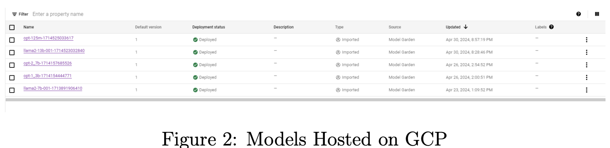
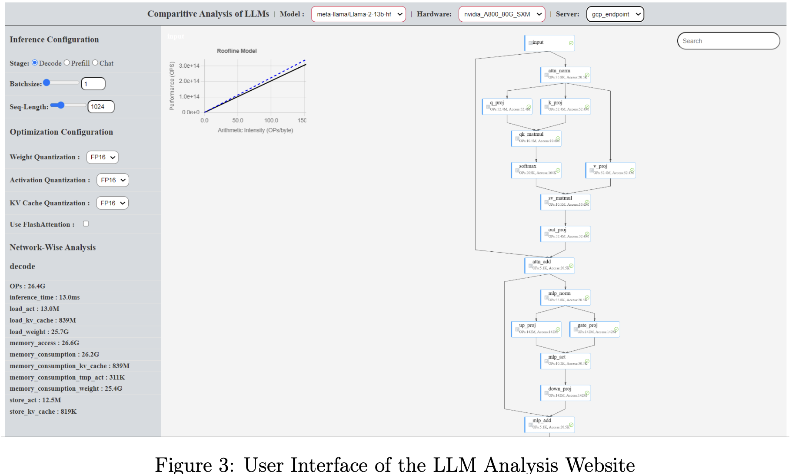
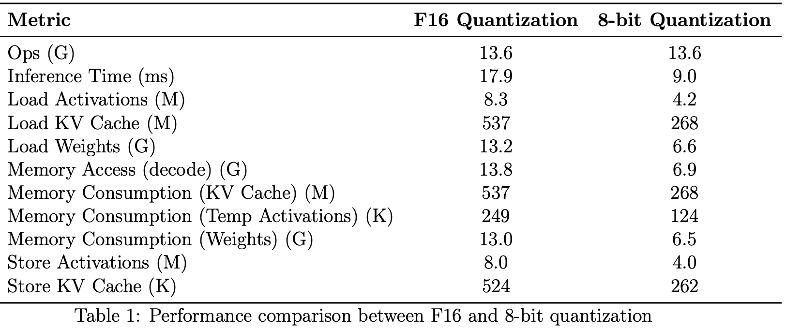

- [Comprehensive Performance Analysis for LLMs](#comprehensive-performance-analysis-for-llms)
  - [Abstract](#abstract)
  - [1 Introduction](#1-introduction)
    - [1.1 Background on Language Models (LLMs)](#11-background-on-language-models-llms)
    - [1.2 Objectives and scope of the research](#12-objectives-and-scope-of-the-research)
  - [介绍](#介绍)
    - [1.1 语言模型（LLMs）的背景](#11-语言模型llms的背景)
    - [1.2 研究目标和范围](#12-研究目标和范围)
  - [2. Related Work and Limitations of Current Approaches](#2-related-work-and-limitations-of-current-approaches)
    - [2.1 Overview of existing benchmarking tools and frameworks](#21-overview-of-existing-benchmarking-tools-and-frameworks)
    - [2.2 Limitations of current approaches](#22-limitations-of-current-approaches)
  - [2. 相关工作和当前方法的局限性](#2-相关工作和当前方法的局限性)
    - [2.1 现有基准测试工具和框架概述](#21-现有基准测试工具和框架概述)
    - [2.2 当前方法的局限性](#22-当前方法的局限性)
  - [3. Design and Implementation](#3-design-and-implementation)
    - [3.1 Backend Implementation](#31-backend-implementation)
    - [3.2 Frontend Design](#32-frontend-design)
    - [3.3 Model analysis techniques](#33-model-analysis-techniques)
    - [3. 设计与实现](#3-设计与实现)
    - [3.1 后端实现](#31-后端实现)
    - [3.2 前端设计](#32-前端设计)
    - [3.3 模型分析技术](#33-模型分析技术)
  - [4. Results and Workflow Demonstration](#4-results-and-workflow-demonstration)
    - [4.1 Deployment of LLMs on GCP](#41-deployment-of-llms-on-gcp)
    - [4.2 Comprehensive Analysis of LLMs Website](#42-comprehensive-analysis-of-llms-website)
  - [4. 结果与工作流程演示](#4-结果与工作流程演示)
    - [4.1 大型语言模型（LLMs）在 GCP 上的部署](#41-大型语言模型llms在-gcp-上的部署)
    - [4.2 LLMs 网站的全面分析](#42-llms-网站的全面分析)
  - [5. Performance Analysis Results](#5-performance-analysis-results)
    - [5.1 Comparison of LLMs across different hardware configurations](#51-comparison-of-llms-across-different-hardware-configurations)
    - [5.2 Identification of performance bottlenecks and insights](#52-identification-of-performance-bottlenecks-and-insights)
    - [5.3 Memory consumption patterns of LLMs during inference](#53-memory-consumption-patterns-of-llms-during-inference)
    - [5.4 Impact of model size and architecture on memory usage](#54-impact-of-model-size-and-architecture-on-memory-usage)
    - [5.5 Network-wise analysis graphs and their implications](#55-network-wise-analysis-graphs-and-their-implications)
    - [5.6 Roofline analysis plots and performance bounds](#56-roofline-analysis-plots-and-performance-bounds)
  - [5. 性能分析结果](#5-性能分析结果)
    - [5.1 不同硬件配置下 LLMs 的比较](#51-不同硬件配置下-llms-的比较)
    - [5.2 性能瓶颈识别与洞察](#52-性能瓶颈识别与洞察)
    - [5.3 LLMs 推理过程中的内存消耗模式](#53-llms-推理过程中的内存消耗模式)
    - [5.4 模型规模和架构对内存使用的影响](#54-模型规模和架构对内存使用的影响)
    - [5.5 网络级分析图及其含义](#55-网络级分析图及其含义)
    - [5.6 Roofline 分析图与性能界限](#56-roofline-分析图与性能界限)
  - [6. Conclusion](#6-conclusion)
    - [6.1 Summary of key findings and contributions](#61-summary-of-key-findings-and-contributions)
    - [6.2 Implications for LLM deployment and optimization](#62-implications-for-llm-deployment-and-optimization)
    - [6.3 Discussion and Future Scope](#63-discussion-and-future-scope)
  - [6. 结论](#6-结论)
    - [6.1 主要发现和贡献总结](#61-主要发现和贡献总结)
    - [6.2 对 LLM 部署和优化的影响](#62-对-llm-部署和优化的影响)
    - [6.3 讨论与未来展望](#63-讨论与未来展望)

## Comprehensive Performance Analysis for LLMs

### Abstract

语言模型（LLMs）已经彻底革新了自然语言处理领域，但其不断增长的复杂性使得在不同硬件配置下的部署和优化变得更加困难。“语言模型比较分析”项目提供了一个全面的评估框架，用于测试 LLM 在各种平台上的性能、计算效率和内存使用情况。通过比较分析预训练模型和定制模型在不同 GPU 上的表现，该项目揭示了性能特征、可扩展性以及资源利用情况。项目**采用了网络分析图和 Roofline 分析图等可视化技术，以帮助更好地理解 LLM 的行为及其瓶颈**。此外，该项目还与云平台集成，支持在实际场景中进行大规模的部署和分析。研究结果**为优化 LLM 性能和内存使用提供了实用的指导，考虑了硬件特性、模型规模和架构**。框架的扩展性允许纳入新的 LLM 架构和评估标准。本文讨论了关键发现、影响以及未来的研究方向，展示了该项目在推动 LLM 性能分析、优化技术和硬件加速器设计方面的潜力，最终有助于各种应用。为确保软件能够在任何 PC 上顺利安装和运行，项目提供了详细的文档 README.md（zip 文件），包括设置说明、依赖项清单、操作系统特定指南、示例命令、故障排除方法和验证步骤。

关键词：Roofline 建模，LLM，内存复杂性

### 1 Introduction

The field of natural language processing (NLP) has witnessed a transformative shift with the advent of large language models (LLMs). These powerful models, trained on massive text corpora, have exhibited an unprecedented ability to understand and generate humanlike language. LLMs have revolutionized various NLP tasks, ranging from text generation and translation to sentiment analysis and question answering, by leveraging their capacity to capture intricate linguistic patterns and nuances.

The success of LLMs can be attributed to their deep learning architectures, particularly the transformer-based models like BERT, GPT, and their variants. These models employ self-attention mechanisms and large-scale pre-training on vast amounts of unlabeled text data, enabling them to learn rich contextual representations and generalize to a wide range of downstream tasks through fine-tuning.

However, the increasing complexity and scale of LLMs have given rise to significant challenges in terms of computational requirements, memory usage, and efficient deployment across diverse hardware configurations. As these models continue to grow in size, with some reaching billions of parameters, the demands on computational resources and the need for optimization have become critical considerations.

In this context, the "Comparative Analysis of Language Models" project presents a comprehensive evaluation framework to assess the performance, computational efficiency, and memory utilization of LLMs on various hardware platforms. By conducting a thorough comparative analysis of pre-trained and custom LLM architectures on different GPUs, CPUs, and specialized hardware accelerators, the project aims to provide valuable insights into performance characteristics, scalability, and resource utilization.

Through the application of advanced visualization techniques, such as network-wise analysis graphs and roofline analysis plots, the project facilitates a deeper understanding of LLM behavior, bottlenecks, and optimization opportunities. Furthermore, the seamless integration with cloud platforms enables scalable deployment and analysis of LLMs in
real-world scenarios, leveraging the flexibility and resources offered by these environments.

The project’s findings offer practical guidelines for optimizing LLM performance and memory usage, taking into account hardware characteristics, model size, and architectural considerations. The extensible framework allows for the incorporation of emerging LLM architectures and evaluation metrics, ensuring its relevance and adaptability in the rapidly evolving field of NLP.

This paper discusses the key findings and contributions of the "Comparative Analysis of Language Models" project, highlighting its potential to drive advancements in LLM performance analysis, optimization techniques, and hardware accelerator design. Additionally, it explores future research directions and the project’s broader implications for a wide range of NLP applications and industries.

#### 1.1 Background on Language Models (LLMs)

Language Models are probabilistic models that assign probabilities to sequences of words or tokens in a given language. They learn the statistical properties of language by training on large corpora of text data. The goal of an LLM is to predict the likelihood of a word or token occurring given the context of the preceding words or tokens. By learning these probability distributions, LLMs can generate coherent and contextually relevant text.

The advent of deep learning techniques, particularly transformer-based architectures, has significantly advanced the field of language modeling. Models like BERT (Bidirectional Encoder Representations from Transformers), GPT (Generative Pre-trained Transformer), and their variants have achieved state-of-the-art performance on various NLP
tasks. These models leverage self-attention mechanisms and large-scale pre-training on unlabeled text data to capture rich linguistic representations.

One of the key advantages of LLMs is their ability to be fine-tuned for specific downstream tasks. By training on task-specific data, LLMs can adapt their knowledge to the nuances and requirements of a particular application. This transfer learning approach has greatly reduced the need for extensive labeled data and has enabled the development of
powerful NLP systems across diverse domains.

However, the increasing size and complexity of LLMs pose significant challenges in terms of computational resources and efficiency. As LLMs continue to grow in scale, with models like GPT-3 containing billions of parameters, the computational requirements for training and deploying these models have become a critical consideration. This has led to a growing interest in understanding the performance characteristics and resource requirements of LLMs across different hardware configurations.

#### 1.2 Objectives and scope of the research

The primary objective of this research is to conduct a comprehensive comparative analysis of Language Models (LLMs) across different hardware configurations. The aim is to provide valuable insights into the performance characteristics, computational requirements, and memory usage of LLMs, enabling informed decision-making for efficient deployment and optimization.

### 介绍

然语言处理（NLP）领域因大型语言模型（LLMs）的出现而经历了根本性的变革。这些强大的模型通过在庞大的文本数据集上进行训练，展示了前所未有的理解和生成类人语言的能力。LLMs 利用其捕捉复杂语言模式和细微差别的能力，彻底革新了文本生成、翻译、情感分析和问答等多种 NLP 任务。

LLMs 的成功主要归功于其深度学习架构，尤其是基于变压器的模型，如 BERT 和 GPT 及其变体。这些模型利用自注意力机制，并在大量未标记的文本数据上进行大规模预训练，从而能够学习到丰富的上下文信息，并通过微调在各种下游任务中表现出色。

然而，随着 LLMs 规模的不断扩大，它们的复杂性也带来了计算需求、内存使用以及在不同硬件配置下高效部署的重大挑战。这些模型中的某些已经达到数十亿个参数，对计算资源的要求和优化需求也因此变得尤为重要。

在这一背景下，“语言模型比较分析”项目提供了一个全面的评估框架，旨在评估 LLM 在不同硬件平台上的性能、计算效率和内存利用情况。通过对不同 GPU、CPU 和专用硬件加速器上的预训练和定制 LLM 架构进行深入比较分析，该项目提供了有关性能特征、可扩展性和资源利用的宝贵见解。

该项目应用了先进的可视化技术，如**网络分析图和 Roofline 分析图，帮助深入理解 LLM 的行为、瓶颈及其优化机会**。此外，与云平台的无缝集成使得在实际场景中进行大规模部署和分析成为可能，充分利用这些平台的灵活性和资源。

项目的研究结果为优化 LLM 的性能和内存使用提供了实用的指导，综合考虑了硬件特性、模型规模和架构因素。其可扩展框架允许纳入新的 LLM 架构和评估指标，确保在迅速发展的 NLP 领域中保持相关性和适应性。

本文讨论了“语言模型比较分析”项目的主要发现和贡献，突出了其在推动 LLM 性能分析、优化技术和硬件加速器设计方面的潜力，并探讨了未来的研究方向及其对各种 NLP 应用和行业的广泛影响。

#### 1.1 语言模型（LLMs）的背景

语言模型是一种概率模型，用于为特定语言中的词汇或标记序列分配概率。它们通过在大量文本数据上进行训练，学习语言的统计特性。LLM 的目标是根据前面词汇或标记的上下文，预测一个词或标记出现的可能性。通过学习这些概率分布，LLMs 能够生成连贯且符合上下文的文本。

深度学习技术，尤其是基于变压器的架构，极大地推动了语言建模的发展。模型如 BERT（双向编码器表示变换器）、GPT（生成预训练变换器）及其变体在各种 NLP 任务中都取得了领先的成绩。这些模型通过自注意力机制和在大量未标记文本上的预训练，捕捉了丰富的语言信息。

LLMs 的一大优势在于能够根据特定任务进行微调。通过在任务专用数据上进行训练，LLMs 可以调整其知识以满足特定应用的需求和细节。这种迁移学习方法大大降低了对大量标记数据的依赖，使得在不同领域中开发强大的 NLP 系统成为可能。

然而，LLMs 的规模和复杂性不断增加，这带来了计算资源和效率方面的挑战。以 GPT-3 为例，这种模型拥有数十亿个参数，对训练和部署的计算要求变得极为重要。这促使人们越来越关注 **LLM 在不同硬件配置下的性能特征和资源需求**。

#### 1.2 研究目标和范围

本研究的主要目标是对不同硬件配置下的语言模型（LLMs）进行全面的比较分析。旨在深入了解 LLM 的性能特征、计算需求和内存使用情况，以便做出高效部署和优化的决策。

### 2. Related Work and Limitations of Current Approaches

#### 2.1 Overview of existing benchmarking tools and frameworks

Several benchmarking tools and frameworks have been developed to evaluate the performance of Language Models (LLMs) and compare their capabilities across different tasks and datasets. These tools aim to provide standardized and reproducible methods for assessing the performance of LLMs and facilitate comparative analysis.

One prominent benchmarking framework is GLUE (General Language Understanding Evaluation). GLUE consists of a collection of diverse natural language understanding tasks, including sentiment analysis, textual entailment, and question answering. It provides a unified platform for evaluating the performance of LLMs across these tasks,
allowing researchers to compare the results of different models and track progress in the field.

Another widely adopted benchmarking tool is SuperGLUE, which is an extension of GLUE. SuperGLUE introduces a set of more challenging and diverse tasks, such as causal reasoning, coreference resolution, and multi-hop question answering. It aims to assess the performance of LLMs on more complex and nuanced language understanding problems.

In addition to GLUE and SuperGLUE, there are other benchmarking frameworks like SQuAD (Stanford Question Answering Dataset) and RACE (Reading Comprehension from Examinations). SQuAD focuses on evaluating the ability of LLMs to answer questions based on a given context, while RACE assesses the reading comprehension capabilities of LLMs using exam-style questions.

These benchmarking tools and frameworks have played a crucial role in advancing the field of LLMs by providing standardized evaluation metrics and datasets. They enable researchers to compare the performance of different models, identify areas for improvement, and track the progress of LLMs over time.

#### 2.2 Limitations of current approaches

Despite the valuable contributions of existing benchmarking tools and frameworks, there are several limitations associated with current approaches to evaluating LLMs:

Limited focus on computational efficiency: Most benchmarking tools primarily focus on evaluating the accuracy and performance of LLMs on specific tasks. However, they often overlook the computational efficiency aspect, which is crucial for real-world deployment. The computational requirements, inference time, and memory usage of LLMs are not adequately captured by these frameworks, making it challenging to assess their practicality and scalability.

Lack of hardware diversity: Benchmarking tools often evaluate LLMs on a limited set of hardware configurations, typically using high-end GPUs or TPUs. However, in real-world scenarios, LLMs may need to be deployed on a variety of hardware platforms, including CPUs and resource-constrained devices. The lack of comprehensive evaluations across different hardware setups limits the understanding of LLM performance in diverse deployment environments.

Limited coverage of custom and domain-specific models: Benchmarking frameworks primarily focus on evaluating popular pre-trained LLMs, such as those available on platforms like Hugging Face. However, they may not adequately cover custom or domainspecific models developed by researchers or organizations. This limitation hinders the comparative analysis of specialized LLMs and their performance characteristics in specific application domains.

Addressing these limitations is crucial for enabling a more comprehensive
and practical evaluation of LLMs. By incorporating computational efficiency metrics, diverse hardware configurations, memory profiling, and guidance for deployment and optimization, benchmarking approaches can provide a more holistic view of LLM performance and facilitate their effective utilization in real-world scenarios.

### 2. 相关工作和当前方法的局限性

#### 2.1 现有基准测试工具和框架概述

为了评估语言模型（LLMs）的**精度性能**，并比较它们在不同任务和数据集上的表现，已经开发了多个基准测试工具和框架。这些工具的目的是提供标准化和可重复的评估方法，帮助进行有效的比较分析。

一个知名的基准测试框架是 GLUE（通用语言理解评估）。GLUE 包含了一系列多样的自然语言理解任务，如情感分析、文本蕴涵和问答等。它为评估 LLM 在这些任务上的表现提供了一个统一的平台，使研究人员能够比较不同模型的结果，并跟踪领域内的进展。
> **GLUE 是一个一个多任务的自然语言理解基准和分析平台**，也就是 GLUE（General Language Understanding Evaluation）。GLUE 包含九项 NLU 任务，语言均为英语。GLUE 九项任务涉及到自然语言推断、文本蕴含、情感分析、语义相似等多个任务。像 BERT、XLNet、RoBERTa、ERINE、T5 等知名模型都会在此基准上进行测试。目前，大家要把预测结果上传到官方的网站上，官方会给出测试的结果。

另一个被广泛采用的工具是 SuperGLUE，这是对 GLUE 的扩展。SuperGLUE 包含了一些更具挑战性和多样性的任务，如因果推理、核心指代解析和多跳问答，旨在评估 LLM 在更复杂的语言理解问题上的表现。

除了 GLUE 和 SuperGLUE，还有如 SQuAD（斯坦福问答数据集）和 RACE（考试阅读理解）等其他基准测试框架。SQuAD 主要评估 LLM 在给定上下文中回答问题的能力，而 RACE 通过考试风格的问题来测试 LLM 的阅读理解能力。

这些基准测试工具和框架在 LLM 领域的进步中发挥了重要作用，它们提供了标准化的评估指标和数据集，使研究人员能够比较不同模型的性能，发现改进的方向，并跟踪 LLM 的进展。

#### 2.2 当前方法的局限性

尽管现有的基准测试工具和框架在评估 LLM 方面做出了很多贡献，但当前方法仍存在一些局限性：

**对计算效率关注不足**：多数基准测试工具主要侧重于评估 LLM 在特定任务上的准确性和性能，但往往忽视了计算效率这一关键方面。计算需求、推理时间和内存使用等实际应用中的重要因素，往往未被这些框架充分考虑，这使得评估 LLM 的实际可行性和可扩展性变得困难。

**硬件配置的单一性**：基准测试工具通常只在有限的硬件配置上评估 LLM，通常是高端 GPU 或 TPU。然而，实际应用中，LLM 可能需要在各种硬件平台上运行，包括 CPU 和资源有限的设备。缺乏对不同硬件设置的全面评估限制了我们对 LLM 在不同环境中性能的理解。

**对定制和领域特定模型的覆盖有限**：现有基准测试框架主要评估流行的预训练 LLM，如 Hugging Face 上的模型，却很少涉及研究人员或组织开发的定制模型或领域特定模型。这限制了对这些专业模型及其在特定应用领域中表现的比较分析。

解决这些局限性对实现更全面和实际的 LLM 评估至关重要。**通过加入计算效率指标、多样化的硬件配置、内存分析以及部署和优化指导，基准测试方法能够提供对 LLM 性能的更全面视图，并促进其在实际应用中的有效利用**。

### 3. Design and Implementation

The "Comparative Analysis of Language Models (LLMs)" project follows a client-server architecture, consisting of a backend component and a frontend component. The backend is responsible for model analysis, inference, and serving the necessary data to the frontend, while the frontend handles user interaction, data visualization, and result presentation.

Overview of the system components:

The system architecture comprises three main components:

Backend Server: The backend server is built using the Flask web framework in Python. It handles the model analysis, and inference tasks, and serves as an API endpoint for the frontend to retrieve data from the GCP endpoint for the memory analysis after the inference task is given. The backend server interacts with the LLMs, performs computational analysis, and manages the integration with external platforms like Google Cloud Platform (GCP) Vertex AI.

Frontend Application: The frontend application is developed using Vue.js, a progressive JavaScript framework. It provides an intuitive and interactive user interface for configuring analysis parameters, selecting models and hardware, and visualizing the results.

The frontend communicates with the backend server through API requests to retrieve data and update the user interface dynamically. External Platforms and Services: The system integrates with external platforms and services, such as pre-trained models which are deployed on GCP Vertex AI for analyzing custom models, and after providing the inference task the memory analysis values are fetched from the LLM hosted on GCP. These integrations enable the system to leverage a wide range of LLMs and perform analysis across different hardware configurations.

#### 3.1 Backend Implementation

The backend of the "Comparative Analysis of Language Models" project is designed to handle the core functionalities of model analysis, inference execution, and performance measurement. It is built using Python and the Flask web framework, which provides a lightweight and flexible foundation for building web applications and APIs.

The main components of the backend design include:
API Endpoints: The backend exposes a set of API endpoints that handle the communication between the frontend and the backend. These endpoints include:

get_available_models: Retrieves the list of available LLMs for analysis, including pre-trained models deployed on GCP Vertex AI.

get_hardware_configurations: Provides the list of supported hardware configurations for analysis, such as GPUs with predefined parameters.

run_analysis: Accepts the selected model, hardware configuration, and analysis parameters from the frontend, triggers the model analysis process, and returns the results.

run_inference: Executes an inference task on the selected model and returns the generated output along with performance metrics and memory analytics results.

Model Analysis: The backend implements the necessary functionalities for model analysis, including:

Roofline Analysis: Performs roofline analysis to assess the performance characteristics of LLMs in relation to the hardware’s computational and memory capabilities. It measures the arithmetic intensity and memory bandwidth of LLMs on different hardware configurations.

Network-wise Analysis: Conducts network-wise analysis to evaluate the performance of LLMs at a granular level, examining each component or layer of the model architecture. It measures metrics such as computation time, memory usage, and data transfer for individual layers or components all these values are fetched from GCP after the assigned inference task has finished on the LLM.

Inference Execution: The backend handles the execution of inference tasks on the selected LLMs. It loads the pre-trained models from GCP Vertex AI to perform inference. It preprocesses the input data, feeds it to the model, and collects the generated outputs.

Performance Measurement: The backend integrates performance measurement
capabilities to assess the efficiency and scalability of LLMs during inference. It measures metrics such as latency, throughput, and resource utilization. It uses appropriate libraries and tools, such as PyTorch profiling or custom monitoring solutions, to capture accurate
performance metrics.

The backend design follows a modular and extensible architecture, allowing for easy integration of new models, hardware configurations, and analysis techniques. It leverages the power of Python and its rich ecosystem of libraries and frameworks to perform complex computations, data processing, and model analysis.

#### 3.2 Frontend Design

The frontend of the "Comparative Analysis of Language Models" project is designed to provide users with an intuitive and interactive interface for exploring and analyzing the performance of Language Models (LLMs) across different hardware configurations. The frontend is built using Vue.js, a progressive JavaScript framework, which enables the creation of dynamic and responsive user interfaces.

The main components of the frontend design include:

Model Selection: The frontend provides a dropdown menu or a search bar for users to select the desired LLM for analysis. The available models include pre-trained models deployed on GCP Vertex AI. Users can easily navigate and choose the model they want to analyze. 

Hardware Configuration Selection: Users can select the hardware configuration on which they want to run the analysis. The frontend presents a list of available hardware options, such as GPUs along with their specifications. Users can choose the appropriate hardware based on their requirements and constraints.

Input Data Configuration: The frontend allows users to input the necessary data for the inference task. This may include text prompts, input sequences, or any other relevant data required by the LLM. Users can enter the data manually.

Analysis Parameters: The frontend provides options for users to configure various analysis parameters, such as batch size, number of iterations, or specific settings related to the selected LLM. These parameters allow users to customize the analysis according to their needs.

Results Visualization: The frontend displays the results of the analysis in a clear and visually appealing manner. It presents performance metrics, such as latency, throughput, and resource utilization, using roofline graph and architecture graphs. Users can interact with the visualizations to explore different aspects of the results, such as comparing performance across different models or hardware configurations.

Export and Sharing: The frontend offers options for users to export the analysis results in various formats, such as CSV or JSON, for further analysis or reporting. It also provides sharing functionalities, allowing users to share the results with colleagues or collaborate on the analysis.

The front-end design focuses on creating a user-friendly and intuitive interface that guides users through the analysis process. It employs responsive design principles to en sure that the interface adapts to different screen sizes and devices, providing a seamless experience across desktops, tablets, and mobile phones.

#### 3.3 Model analysis techniques

The backend server incorporates various model analysis techniques to evaluate the performance, computational efficiency, and memory usage of LLMs. The key analysis techniques include:

Roofline Analysis: Roofline analysis is used to assess the performance characteristics of LLMs in relation to the hardware’s computational and memory capabilities. It helps identify potential bottlenecks and provides insights into the utilization of hardware resources. The backend server performs roofline analysis by measuring the arithmetic intensity and memory bandwidth of LLMs on different hardware configurations.

Network-wise Analysis: Network-wise analysis involves evaluating the performance of LLMs. The backend server receives data from the GCP endpoint after the user has performed an inference task and performs network-wise analysis by measuring metrics such as computation time, memory usage, and data transfer for individual layers or components of the LLMs. This analysis helps identify performance bottlenecks and opportunities for optimization.

Memory Profiling: Memory profiling is conducted using tools like PyTorch summary to analyze the memory consumption patterns of LLMs during the inference process.

The backend server integrates PyTorch summary to track the memory usage of LLMs, including the peak memory consumption and the memory footprint of individual layers.

This information is valuable for understanding the memory requirements and optimizing LLM deployment and is displayed under the network-wise Analysis section in the frontend.

These model analysis techniques are implemented in the backend server using Python libraries and frameworks such as PyTorch, TensorFlow, and NumPy. The results of the analysis are processed and stored in a structured format, ready to be served to the front end for visualization and interpretation.

#### 3. 设计与实现

“语言模型（LLMs）比较分析”项目采用客户端-服务器架构，主要分为后端组件和前端组件。后端负责执行模型分析、推理任务，并将所需数据提供给前端；前端则负责用户交互、数据可视化以及结果展示。

系统组件概述：

系统架构主要包括三个组件：

1. **后端服务器**：后端服务器使用 Python 的 Flask Web 框架构建。它负责处理模型分析和推理任务，同时作为前端访问数据的 API 端点，特别是从 GCP 端点检索内存分析数据。后端服务器与 LLMs 进行交互，执行计算分析，并负责与外部平台（如 Google Cloud Platform (GCP) Vertex AI）的集成。

2. **前端应用程序**：前端应用程序使用 Vue.js 开发，这是一种逐步增强的 JavaScript 框架。它提供了一个用户友好的界面，让用户可以方便地配置分析参数、选择模型和硬件，并查看分析结果。前端应用通过 API 请求与后端服务器进行交互，动态地检索数据和更新界面。

3. **外部平台和服务**：系统还与外部平台和服务进行集成。例如，预训练模型被部署在 GCP Vertex AI 上，用于分析自定义模型。完成推理任务后，系统从 GCP 上托管的 LLM 获取内存分析数据。这些集成使系统能够使用多种 LLM，并在不同硬件配置下进行分析。

#### 3.1 后端实现

“语言模型比较分析”项目的后端设计负责核心功能的处理，包括模型分析、推理执行和性能测量。后端使用 Python 和 Flask Web 框架构建，提供了一个轻量且灵活的基础来搭建 Web 应用和 API。

后端设计的主要组成部分包括：

1, **API 接口**：后端提供了一系列 API 端点，用于处理前端与后端之间的数据交互。这些接口包括：
- `get_available_models`：获取可用于分析的 LLM 列表，包括在 GCP Vertex AI 上部署的预训练模型。
- `get_hardware_configurations`：提供支持的硬件配置列表，如具有预定义参数的 GPU
- `run_analysis`：接收前端提交的模型、硬件配置和分析参数，启动模型分析过程，并返回分析结果。
- `run_inference`：执行选定模型的推理任务，并返回生成的输出、性能指标和内存分析结果。

2, **模型分析**：后端实现了模型分析所需的功能，包括：
- `Roofline Analysis`：进行 roofline 分析，~~评估 LLM 在硬件计算能力和内存带宽方面的性能。它测量 LLM 在不同硬件配置下的算术强度和内存带宽~~。
- `Network-wise Analysis`：进行网络级分析，评估 LLM 模型架构中每个组件或层次的性能。它测量各层或组件的计算时间、内存使用和数据传输等指标，这些数据在 LLM 推理任务完成后从 GCP 获取。

3, **推理执行**：后端处理选定 LLM 的推理任务，加载 GCP Vertex AI 上的预训练模型进行推理。它预处理输入数据，将数据送入模型，并收集生成的输出。

4, **性能测量**：后端集成了性能测量功能，用于评估 LLM 推理过程中的效率和可扩展性。它测量**延迟、吞吐量和资源使用情况**等指标，并使用如 PyTorch 性能分析工具或定制监控解决方案来获取准确的性能数据。

后端设计采用模块化和可扩展的架构，支持新模型、硬件配置和分析技术的轻松集成。它充分利用 Python 及其丰富的库和框架生态系统来进行复杂的计算、数据处理和模型分析。

#### 3.2 前端设计

“语言模型比较分析”项目的前端设计旨在为用户提供一个直观且互动的界面，以便于探索和分析不同硬件配置下语言模型（LLMs）的性能。前端应用使用 Vue.js 开发，这是一种灵活的 JavaScript 框架，可以创建动态且响应迅速的用户界面。

前端设计的主要功能包括：

- 模型选择：用户可以通过下拉菜单或搜索框选择要分析的 LLM。可用的模型包括部署在 GCP Vertex AI 上的预训练模型，用户可以轻松选择并分析所需的模型。
- 硬件配置选择：用户可以选择用于分析的硬件配置。前端展示了包括 GPU 在内的硬件选项及其规格，用户可以根据自己的需求和条件选择合适的硬件。
- 输入数据配置：用户可以输入推理任务所需的数据，如文本提示、输入序列等。前端允许用户手动输入这些数据。
- 分析参数：用户可以配置分析参数，如批量大小、迭代次数等，前端提供了灵活的设置选项，以满足不同的分析需求。
- 结果可视化：前端以清晰的方式展示分析结果，包括性能指标（如延迟、吞吐量和资源使用情况）。使用 roofline 图和模型架构图来呈现这些数据，用户可以通过交互探索结果，比较不同模型或硬件配置的性能。
- 导出和分享：前端提供将分析结果导出为 CSV 或 JSON 格式的功能，以便进一步分析或报告。此外，还提供分享功能，方便用户与同事共享结果或进行协作。

前端设计致力于创建一个用户友好的界面，引导用户完成整个分析过程。它采用响应式设计，确保在不同设备和屏幕尺寸上提供一致的用户体验，包括桌面、平板和手机。

#### 3.3 模型分析技术

后端服务器集成了多种模型分析技术，用于评估 LLM 的性能、计算效率和内存使用情况。主要技术包括：

1. `Roofline Analysis：Roofline` 分析:评估 LLM 在硬件计算和内存能力方面的性能。这帮助识别潜在的性能瓶颈，并提供硬件资源利用的深入见解。后端通过测量不同硬件配置下 LLM 的算术强度和内存带宽来进行分析。
2. `Network-wise Analysis` 网络级分析评: 估 LLM 的性能。用户完成推理任务后，后端从 GCP 端点获取数据，并测量 LLM 各层或组件的计算时间、内存使用和数据传输等指标。这有助于发现性能瓶颈和优化机会。
3. `Memory Profiling` 内存分析: **使用工具如 PyTorch summary 来分析 LLM 在推理过程中内存的使用模式**。后端集成了 PyTorch summary 来追踪 LLM 的内存使用情况，包括峰值内存和各层的内存占用。这些数据在前端的网络级分析部分进行展示，有助于理解内存需求和优化 LLM 部署。

这些分析技术使用 Python 及其库和框架（如 PyTorch、TensorFlow 和 NumPy）实现。分析结果被处理并以结构化格式存储，准备好传送到前端进行可视化和解读。

### 4. Results and Workflow Demonstration
#### 4.1 Deployment of LLMs on GCP

All Large Language Models (LLMs) are currently deployed on Google Cloud Platform (GCP) and are operational with active endpoints. This setup facilitates direct access to the models for real-time data processing and analysis.

#### 4.2 Comprehensive Analysis of LLMs Website

The analysis workflow begins by initiating the backend server via a terminal command. Once the backend is active, the frontend component is deployed locally. This setup allows for dynamic interaction with the analysis tools provided by the platform.

The interface enables users to conveniently adjust parameters such as the desired LLM, hardware configuration, processing stage, batch size, sequence length, quantization, and attention mechanisms. Configurations can be tailored to specific analysis needs, and the results for the roofline and model architecture analyses are dynamically generated and displayed for each layer of the selected model.

### 4. 结果与工作流程演示

#### 4.1 大型语言模型（LLMs）在 GCP 上的部署

所有大型语言模型（LLMs）目前已在 Google Cloud Platform（GCP）上部署，并且具有活跃的端点。这一设置便于直接访问这些模型，进行实时数据处理和分析。

#### 4.2 LLMs 网站的全面分析

分析工作流程从通过终端命令启动后端服务器开始。一旦后端激活，前端组件将被本地部署。这一设置允许与平台提供的分析工具进行动态交互。

省略。。。。

### 5. Performance Analysis Results
#### 5.1 Comparison of LLMs across different hardware configurations 

The performance analysis of LLMs across different hardware configurations yields valuable insights into their efficiency and scalability. By evaluating metrics such as latency, throughput, and resource utilization, the "Comparative Analysis of Language Models" project enables a comprehensive comparison of LLMs on various hardware setups.

The analysis results demonstrate the impact of hardware characteristics on the performance of LLMs. The comparison highlights the differences in inference times, throughput, and resource utilization when running LLMs on CPUs, GPUs, and TPUs. It reveals the strengths and limitations of each hardware configuration in terms of computational power, memory bandwidth, and parallelization capabilities. For example, the analysis may show that GPUs provide significant speedups compared to CPUs for certain LLMs due to their high parallelization capabilities and fast memory access. On the other hand, TPUs may excel in handling large batch sizes and delivering high throughput for specific models optimized for TPU architectures.

The comparison also takes into account the variations in performance across different LLM architectures and sizes. It examines how the model’s complexity, number of parameters, and underlying architecture influence its performance on different hardware. This analysis helps identify the most suitable hardware configuration for a given LLM based on its characteristics and performance requirements.

#### 5.2 Identification of performance bottlenecks and insights

The performance analysis results enable the identification of performance bottlenecks and provide valuable insights for optimizing LLMs. By analyzing the latency breakdown, resource utilization patterns, and profiling data, the project pinpoints the specific components or layers of the LLMs that contribute to performance limitations.

For instance, the analysis may reveal that certain layers, such as self-attention or feedforward networks, consume a significant portion of the inference time. It may highlight the impact of input sequence length on latency, indicating the need for efficient handling of long sequences. The analysis may also identify memory bandwidth bottlenecks, especially in memory-intensive operations like softmax or layer normalization.

The insights gained from performance analysis guide optimization efforts. They suggest potential areas for improvement, such as model compression techniques, quantization, or architecture modifications. The analysis results provide a foundation for exploring performance optimization strategies tailored to specific hardware configurations and LLM characteristics.

#### 5.3 Memory consumption patterns of LLMs during inference

The memory analysis results shed light on the memory consumption patterns of LLMs during the inference process. By leveraging memory profiling tools, such as PyTorch’s memory profiler, the project captures detailed information about the memory usage of LLMs at different stages of inference.

The analysis reveals the peak memory consumption, which represents the maximum amount of memory used by the LLM during inference. It identifies the most memoryintensive components or layers of the model, such as the embedding layer, attention mechanisms, or intermediate activations. The memory consumption breakdowns help in understanding the distribution of memory usage across different parts of the model.

The analysis also examines the memory footprint of LLMs, considering both the model parameters and the runtime memory requirements. It highlights the impact of factors such as batch size, sequence length, and vocabulary size on memory consumption. This information is crucial for optimizing memory usage and ensuring efficient deployment of LLMs on resource-constrained devices or environments.

#### 5.4 Impact of model size and architecture on memory usage

The memory analysis results provide insights into the relationship between model size, architecture, and memory usage. It explores how the number of parameters, layers, and hidden dimensions affect the memory requirements of LLMs.

The analysis compares the memory consumption of different LLM architectures, such as transformer-based models (e.g., BERT, GPT) and lightweight alternatives (e.g., DistilBERT, MobileBERT). It highlights the trade-offs between model size and memory efficiency, guiding the selection of appropriate architectures based on memory constraints.

The analysis also investigates the impact of model compression techniques, such as pruning or quantization, on memory usage. It evaluates the effectiveness of these techniques in reducing memory footprint while preserving model performance. This information assists in making informed decisions about model optimization strategies for memorylimited scenarios.

#### 5.5 Network-wise analysis graphs and their implications

The project utilizes network-wise analysis graphs to visualize the performance characteristics of LLMs at a granular level. These graphs provide a visual representation of the computation time, memory usage, and data flow within the model’s architecture.

The network-wise analysis graphs display the individual layers or components of the LLM as nodes and the connections between them as edges. The nodes are color-coded or sized based on metrics such as computation time or memory consumption, allowing for quick identification of performance bottlenecks.

The graphs enable a deeper understanding of the model’s behavior and performance implications. They highlight the most time-consuming or memory-intensive layers, guiding optimization efforts towards those specific components. The graphs also reveal data flow patterns and dependencies between layers, helping to identify opportunities for parallelization or data reuse.

By visualizing the network-wise analysis results, researchers and developers can gain insights into the performance characteristics of different LLM architectures. They can compare the graphs of various models to identify common patterns, bottlenecks, and potential areas for improvement. The visual representation facilitates the communication of performance analysis results and supports collaborative discussion and decision-making.

#### 5.6 Roofline analysis plots and performance bounds

Roofline analysis plots are employed to visualize the performance of LLMs in relation to the hardware’s computational and memory capabilities. These plots provide an intuitive representation of the performance bounds and help identify whether an LLM is computebound or memory-bound.

The roofline plot has two main components: the roofline curve and the performance points. The roofline curve represents the maximum achievable performance for a given hardware configuration, considering the peak computational performance and memory bandwidth. The performance points represent the actual performance of the LLM on that hardware, plotted based on their arithmetic intensity (ratio of compute operations to memory accesses).

The roofline analysis plots allow for a quick assessment of the LLM’s performance relative to the hardware’s capabilities. If the performance points fall below the roofline curve, it indicates that the LLM is memory-bound, and its performance is limited by the available memory bandwidth. Conversely, if the performance points lie above the roofline curve, it suggests that the LLM is compute-bound, and its performance is constrained by the computational resources.

The roofline analysis plots provide valuable insights into the performance characteristics of LLMs on different hardware configurations. They help identify the limiting factors and guide optimization strategies. For memory-bound LLMs, techniques such as data compression, caching, or efficient memory access patterns can be explored to alleviate the memory bottleneck. For compute-bound LLMs, optimizations such as model parallelism, quantization, or hardware-specific optimizations can be considered to maximize computational performance.

### 5. 性能分析结果

性能分析结果是为了**探索适应特定硬件配置和 LLM 特性的性能优化策略奠定了基础**。

#### 5.1 不同硬件配置下 LLMs 的比较

对不同硬件配置下 LLMs 性能的分析提供了关于其效率和扩展性的宝贵见解。通过**评估延迟、吞吐量和资源使用等指标**，“语言模型比较分析”项目能够全面比较不同硬件环境下的 LLMs。

分析结果揭示了硬件特性对 LLMs 性能的影响。比较显示了在 CPU、GPU 和 TPU 上运行 LLMs 时，推理时间、吞吐量和资源利用率的差异。分析揭示了各硬件配置在计算能力、内存带宽和并行处理能力方面的优劣。例如，GPU 由于其强大的并行处理能力和快速的内存访问，相比 CPU 在某些 LLMs 上能显著提高速度。而 TPU 在处理大批量数据和为特定优化了 TPU 架构的模型提供高吞吐量方面表现更为出色。

比较还考虑了不同 LLM 架构和规模下的性能差异。它分析了**模型的复杂度、参数数量和底层架构如何影响其在不同硬件上的表现**。这有助于根据 LLM 的特性和性能需求，确定最合适的硬件配置。

#### 5.2 性能瓶颈识别与洞察

性能分析结果有助于识别性能瓶颈，并为优化 LLMs 提供重要见解。通过分析延迟分解、资源利用模式和性能分析数据，项目能够指出 LLMs 中导致性能限制的**具体组件或层次**。

例如，分析可能会发现某些层次，如**自注意力层或前馈网络，消耗了推理时间的大部分**。它还可能突显输入序列长度对延迟的影响，表明需要更高效地处理长序列。分析可能还会识别出**内存带宽瓶颈，尤其是在进行内存密集型操作（如 softmax 或层归一化）时**。

从性能分析中获得的见解可指导优化工作。它们建议了可能的改进方向，如**模型压缩技术、量化或架构调整**。分析结果为探索适应特定硬件配置和 LLM 特性的性能优化策略奠定了基础。

#### 5.3 LLMs 推理过程中的内存消耗模式

内存分析结果揭示了 `LLMs` 在推理过程中的内存消耗模式。通过使用内存分析工具（如 PyTorch 的内存分析器），项目能够捕获 LLMs 在推理不同阶段的详细内存使用信息。

分析显示了峰值内存消耗，即 LLM 在推理过程中使用的最大内存量。它**识别了模型中内存使用最密集的组件或层次，如嵌入层、注意力机制或中间激活**。内存消耗的分解有助于理解不同部分的内存使用情况。

分析还考察了 LLMs 的内存占用，包括模型参数和运行时内存需求。它强调了**批量大小、序列长度和词汇表大小对内存消耗的影响**。这些信息对优化内存使用和确保 LLMs 在资源受限的设备或环境中的高效部署非常关键。

#### 5.4 模型规模和架构对内存使用的影响

内存分析结果提供了有关模型规模、架构与内存使用之间关系的见解。它**探讨了参数数量、层次结构和隐藏层维度 $h$ 如何影响 `LLMs` 的内存需求**。

分析比较了不同 LLM 架构的内存消耗，例如基于 Transformer 的模型（如 BERT、GPT）与轻量级模型（如 DistilBERT、MobileBERT）。它突出了模型规模与内存效率之间的权衡，帮助在内存约束条件下选择合适的架构。

分析还研究了模型压缩技术（如剪枝或量化）对内存使用的影响。它评估了这些技术在减少内存占用同时保持模型性能方面的有效性。这些信息有助于在内存受限的情况下做出明智的模型优化决策。

#### 5.5 网络级分析图及其含义

该项目利用网络级分析图来直观展示 LLMs 的性能特征。这些图形展示了**模型架构内部**计算时间、内存使用和数据流的具体情况。

网络级分析图将 LLM 的各个层或组件表示为节点，将它们之间的连接表示为边。节点的颜色或大小依据计算时间或内存消耗等指标进行调整，便于快速识别性能瓶颈。

这些图形有助于深入理解模型的行为及其性能影响。它们能够突出显示最耗时或最占内存的层次，从而指导优化工作集中在这些组件上。图形还展示了数据流模式和层间依赖，有助于识别并行处理或数据重用的机会。

通过可视化这些网络级分析结果，研究人员和开发人员能够更好地了解不同 LLM 架构的性能特征。他们可以比较不同模型的图形，识别出共性模式、瓶颈和改进点。这种可视化形式有助于有效传达性能分析结果，支持团队讨论和决策制定。

#### 5.6 Roofline 分析图与性能界限

Roofline 分析图用于可视化 LLMs 在硬件计算和内存能力方面的性能。这些图形**提供了性能界限的直观表示，并帮助识别 LLM 是否受限于计算能力还是内存带宽**。

Roofline 图主要包括两个组件：**Roofline 曲线和性能点**。
- **Roofline** 曲线表示给定硬件配置下的最大可实现性能，考虑了峰值计算性能和内存带宽。
- **性能点**表示 LLM 在该硬件上的实际性能，按其算术强度（计算操作与内存访问的比例）绘制。

Roofline 分析图允许快速评估 LLM 的性能相对于硬件能力的情况。如果性能点低于Roofline 曲线，则表示 LLM 受限于内存，其性能受制于可用内存带宽。相反，如果性能点高于Roofline 曲线，则表明 LLM 受限于计算资源，其性能受限于计算能力。

Roofline 分析图提供了有关 LLM 在不同硬件配置下性能特征的宝贵见解。它们有助于识别限制因素并指导优化策略。**对于内存受限的 LLM，可以探索数据压缩、缓存或高效内存访问模式等技术来缓解内存瓶颈。对于计算受限的 LLM，可以考虑模型并行、量化或硬件特定的优化以最大化计算性能**。

### 6. Conclusion

#### 6.1 Summary of key findings and contributions
The "Comparative Analysis of Language Models" project provides a comprehensive evaluation of the performance, computational requirements, and memory usage of Language Models (LLMs) across different hardware configurations. The project’s key findings and contributions can be summarized as follows:

Comparative analysis of LLMs: The project conducts a thorough comparative analysis of popular pre-trained LLMs and custom models across various hardware setups, including CPUs, GPUs, and TPUs. It provides valuable insights into the performance characteristics, scalability, and efficiency of LLMs on different hardware platforms.

Performance evaluation metrics: The project employs a range of performance evaluation metrics, such as latency, throughput, and resource utilization, to assess the efficiency and scalability of LLMs. These metrics enable a quantitative comparison of LLMs and help identify performance bottlenecks and optimization opportunities.

Memory usage analysis: The project performs detailed memory usage analysis of LLMs during the inference process. It investigates the memory consumption patterns, peak memory usage, and the impact of model size and architecture on memory requirements. These insights are crucial for optimizing LLM deployment in memory-constrained environments.

Visualization and interpretation: The project introduces effective visualization techniques, such as network-wise analysis graphs and roofline analysis plots, to present the performance analysis results in a clear and interpretable manner. These visualizations facilitate the understanding of LLM behavior and guide optimization efforts.

Integration with cloud platforms: The project seamlessly integrates with cloud platforms, such as Google Cloud Platform (GCP) Vertex AI, enabling the deployment, management, and analysis of custom LLMs in a scalable and efficient manner. This integration simplifies the process of evaluating LLMs in real-world scenarios.

Extensible and modular framework: The project provides an extensible and modular framework for LLM performance analysis. It allows for the incorporation of new LLMs, hardware configurations, and evaluation metrics, ensuring the framework’s adaptabilitycto the evolving landscape of LLMs. 

Practical guidelines and recommendations: Based on the analysis results, the project offers practical guidelines and recommendations for deploying and optimizing LLMs. It provides insights into model selection, hardware provisioning, and optimization strategies to maximize LLM performance and efficiency.

These key findings and contributions make the "Comparative Analysis of Language Models" project a valuable resource for researchers, practitioners, and decision-makers working with LLMs. The project’s insights and tools enable informed decision-making, facilitate the development of more efficient LLMs, and contribute to the advancement of natural language processing applications.

#### 6.2 Implications for LLM deployment and optimization

The findings of the "Comparative Analysis of Language Models" project have significant implications for the deployment and optimization of LLMs in real-world scenarios. The project’s insights can guide practitioners and organizations in making informed decisions to maximize the performance and efficiency of LLMs.

Firstly, the comparative analysis results provide a foundation for selecting the most suitable LLM architecture and size based on the specific requirements and constraints of the application. The project’s evaluation of different LLMs across various hardware configurations enables practitioners to choose models that strike a balance between performance, computational efficiency, and memory usage.

Secondly, the project’s findings highlight the importance of considering hardware characteristics when deploying LLMs. The analysis reveals the strengths and limitations of different hardware platforms, such as CPUs, GPUs, and TPUs, in terms of their computational capabilities, memory bandwidth, and parallelization potential. This information guides the selection of appropriate hardware infrastructure to optimize LLM performance and scalability.

Thirdly, the memory usage analysis conducted in the project emphasizes the need for careful memory management and optimization techniques when deploying LLMs. The insights into memory consumption patterns and the impact of model size and architecture on memory requirements help practitioners identify memory bottlenecks and develop strategies to mitigate them. This includes techniques such as model compression, quantization, and efficient memory allocation.

Furthermore, the project’s visualization and interpretation of performance analysis results provide a powerful tool for identifying performance bottlenecks and optimization opportunities. The network-wise analysis graphs and roofline analysis plots enable practitioners to pinpoint specific components or layers of LLMs that contribute to performance limitations. This information guides targeted optimization efforts, such as model pruning, parallel processing, or hardware-specific optimizations.

The integration of the project with cloud platforms, such as GCP Vertex AI, streamlines the deployment and management of LLMs in scalable and efficient environments.

The project’s findings and recommendations can be directly applied to optimize LLM deployment on these platforms, leveraging their auto-scaling capabilities, resource provisioning, and monitoring tools.

Overall, the implications of the project’s findings extend beyond academic research and have practical relevance for industry practitioners, developers, and decision-makers. By providing a comprehensive evaluation framework and actionable insights, the project empowers organizations to make data-driven decisions in deploying and optimizing LLMs, ultimately leading to more efficient and effective natural language processing solutions.

#### 6.3 Discussion and Future Scope

The "Comparative Analysis of Language Models" project lays the foundation for several exciting future research directions and has the potential to make a significant impact in the field of natural language processing. Some promising avenues for future research include:

Expansion to emerging LLM architectures: As the field of LLMs continues to evolve, future research can focus on incorporating emerging architectures and training techniques into the comparative analysis framework. This includes exploring the performance characteristics of models based on transformers, graph neural networks, or other novel approaches. Keeping pace with the latest advancements will ensure the project’s relevance and impact.

Integration of additional evaluation metrics: Future research can extend the project by integrating a broader set of evaluation metrics, beyond performance metrics, to assess the quality and effectiveness of LLMs. This may include metrics such as perplexity, BLEU score, or task-specific evaluation measures. Incorporating these metrics will provide a more comprehensive understanding of LLM performance and aid in model selection for specific applications.

Optimization of LLMs for specific domains: Future research can explore the optimization of LLMs for specific domains or tasks, such as sentiment analysis, named entity recognition, or question answering. By leveraging the project’s analysis framework and insights, researchers can develop domain-specific optimization strategies, model architectures, or fine-tuning techniques to enhance LLM performance in targeted applications.

Collaborative analysis and benchmarking: The project can foster collaboration among researchers, developers, and practitioners by establishing a centralized platform for sharing performance analysis results, benchmarks, and best practices. This collaborative approach can accelerate the advancement of LLM optimization techniques and promote the development of standardized evaluation methodologies.

Integration with AutoML and neural architecture search: Future research can explore the integration of the project’s analysis framework with automated machine learning (AutoML) techniques and neural architecture search (NAS) algorithms. By leveraging the project’s insights and evaluation metrics, AutoML and NAS can be employed to automatically discover optimal LLM architectures and hyperparameters for specific hardware configurations and performance requirements.

The potential impact of the project extends beyond academic research and has implications for various domains and industries. By providing a comprehensive evaluation framework and actionable insights, the project can drive the development of more efficient and effective LLMs, leading to improved natural language processing applications in areas such as chatbots, content generation, sentiment analysis, and machine translation.

Moreover, the project’s findings can inform the design and development of specialized hardware accelerators optimized for LLM workloads. The insights gained from the comparative analysis can guide hardware manufacturers in creating purpose-built accelerators that address the specific computational and memory requirements of LLMs, enabling more efficient and scalable deployment.

In the realm of cloud computing and AI services, the project’s integration with platforms like GCP Vertex AI can enhance the offerings and capabilities of these services. The project’s recommendations and best practices can be incorporated into the platform’s tools and frameworks, empowering users to easily deploy and optimize LLMs for their specific needs.

Overall, the future research directions and potential impact of the "Comparative Analysis of Language Models" project are vast and promising. By continuing to advance the state-of-the-art in LLM performance analysis and optimization, the project can drive innovation, efficiency, and effectiveness in natural language processing, ultimately benefiting a wide range of applications and industries.

### 6. 结论

#### 6.1 主要发现和贡献总结

**《语言模型比较分析》项目提供了对语言模型（LLMs）在不同硬件配置下的性能、计算需求和内存使用的全面评估**。该项目的主要发现和贡献总结如下：

1. **LLMs 的比较分析**：项目对流行的预训练 LLMs 和定制模型在各种硬件设置下（包括 CPUs、GPUs 和 TPUs）进行了深入比较分析。它提供了关于 LLMs 在不同硬件平台上的性能特征、可扩展性和效率的宝贵见解。

2. **性能评估指标**：项目采用了一系列性能评估指标，如**延迟、吞吐量和资源利用率**，以评估 LLMs 的效率和可扩展性。这些指标使 LLMs 的定量比较成为可能，并帮助识别性能瓶颈和优化机会。

3. **内存使用分析**：项目对 LLMs 在推理过程中的内存使用进行了详细分析。它调查了内存消耗模式、峰值内存使用情况以及模型规模和架构对内存需求的影响。这些见解对于在内存受限环境中优化 LLM 部署至关重要。

4. **可视化和解释**：项目引入了有效的可视化技术，如网络级分析图和屋顶线分析图，以清晰、可解释的方式呈现性能分析结果。这些可视化工具有助于理解 LLM 的行为，并指导优化工作。

5. **与云平台的集成**：项目与 Google Cloud Platform（GCP）Vertex AI 等云平台无缝集成，实现了定制 LLM 的部署、管理和分析，以可扩展和高效的方式。这种集成简化了在实际场景中评估 LLM 的过程。

6. **可扩展和模块化框架**：项目提供了一个可扩展和模块化的 LLM 性能分析框架。它允许纳入新的 LLMs、硬件配置和评估指标，确保框架适应不断发展的 LLM 领域。

7. **实际指导和建议**：根据分析结果，项目提供了有关 LLM 部署和优化的实际指导和建议。它提供了关于模型选择、硬件配置和优化策略的见解，以最大化 LLM 的性能和效率。

这些主要发现和贡献使《语言模型比较分析》项目成为研究人员、从业者和决策者在处理 LLMs 时的宝贵资源。项目的见解和工具使得做出明智决策成为可能，促进了更高效的 LLM 开发，并推动了自然语言处理应用的发展。

#### 6.2 对 LLM 部署和优化的影响

《语言模型比较分析》项目的发现对 LLMs 在实际场景中的部署和优化具有重要影响。项目的见解可以指导从业者和组织做出明智决策，以最大化 LLMs 的性能和效率。

首先，比较分析结果为根据应用的具体需求和约束选择最合适的 LLM 架构和规模提供了基础。项目对不同 LLM 在各种硬件配置下的评估使从业者能够选择在性能、计算效率和内存使用之间取得平衡的模型。

其次，项目的发现突出了在部署 LLM 时考虑硬件特性的必要性。分析揭示了不同硬件平台（如 CPUs、GPUs 和 TPUs）在计算能力、内存带宽和并行化潜力方面的优缺点。这些信息指导选择适当的硬件基础设施，以优化 LLM 的性能和可扩展性。

第三，项目中的内存使用分析强调了在部署 LLM 时需要仔细进行内存管理和优化技术。对内存消耗模式和模型规模及架构对内存需求影响的见解帮助从业者识别内存瓶颈，并制定相应的解决策略。这包括模型压缩、量化和高效内存分配等技术。

此外，项目的性能分析结果的可视化和解释提供了识别性能瓶颈和优化机会的强大工具。网络级分析图和屋顶线分析图使从业者能够准确定位 LLM 的具体组件或层次，这些信息指导了针对性的优化工作，如模型剪枝、并行处理或硬件特定优化。

项目与云平台（如 GCP Vertex AI）的集成简化了 LLMs 在可扩展和高效环境中的部署和管理。项目的发现和建议可以直接应用于这些平台的 LLM 部署优化，利用其自动扩展功能、资源配置和监控工具。

总体而言，项目发现的影响超越了学术研究，对于行业从业者、开发人员和决策者具有实际意义。通过提供全面的评估框架和可操作的见解，项目使组织能够在部署和优化 LLMs 时做出数据驱动的决策，从而推动自然语言处理解决方案的效率和效果。

#### 6.3 讨论与未来展望

《语言模型比较分析》项目为未来的若干激动人心的研究方向奠定了基础，并且有可能对自然语言处理领域产生重大影响。以下是一些未来研究的有前景的方向：

扩展至新兴 LLM 架构：随着 LLM 领域的不断发展，未来的研究可以关注将新兴架构和训练技术纳入比较分析框架。这包括探索基于变换器、图神经网络或其他新颖方法的模型的性能特征。紧跟最新进展将确保项目的相关性和影响力。

整合更多评估指标：未来的研究可以通过整合更多评估指标来扩展项目，超越单纯的性能指标，以评估 LLMs 的质量和效果。这可能包括**困惑度、BLEU 分数或任务特定的评估指标**。纳入这些指标将提供对 LLM 性能更全面的理解，并帮助在特定应用中选择模型。

针对特定领域优化 LLMs：未来的研究可以探索针对特定领域或任务（如情感分析、命名实体识别或问答）的 LLM 优化。通过利用项目的分析框架和见解，研究人员可以开发领域特定的优化策略、模型架构或微调技术，以提升 LLM 在目标应用中的性能。

协作分析与基准测试：项目可以通过建立一个集中平台来促进研究人员、开发者和从业者之间的合作，分享性能分析结果、基准测试和最佳实践。这种协作方法可以加速 LLM 优化技术的发展，并促进标准化评估方法的制定。

与自动机器学习（AutoML）和神经架构搜索（NAS）集成：未来的研究可以探索将项目的分析框架与自动机器学习（AutoML）技术和神经架构搜索（NAS）算法集成。通过利用项目的见解和评估指标，可以使用 AutoML 和 NAS 自动发现适合特定硬件配置和性能要求的最优 LLM 架构和超参数。

项目的潜在影响超越了学术研究，对各种领域和行业都有意义。通过提供全面的评估框架和可操作的见解，项目可以推动更高效、更有效的 LLM 开发，从而提升聊天机器人、内容生成、情感分析和机器翻译等领域的自然语言处理应用。

此外，项目的发现可以为设计和开发针对 LLM 工作负载优化的专用硬件加速器提供指导。从比较分析中获得的见解可以指导硬件制造商创建专门的加速器，以满足 LLM 的特定计算和内存需求，从而实现更高效和可扩展的部署。

在云计算和 AI 服务领域，项目与 GCP Vertex AI 等平台的集成可以增强这些服务的功能和能力。项目的建议和最佳实践可以纳入平台的工具和框架中，使用户能够轻松部署和优化 LLMs，以满足他们的具体需求。

总的来说，《语言模型比较分析》项目的未来研究方向和潜在影响广泛而充满希望。通过不断推动 LLM 性能分析和优化的最前沿，项目可以推动自然语言处理领域的创新、效率和效果，从而最终惠及各种应用和行业。