一句话总结：两种方法，更改模型加载模块代码和 attention 模块推理代码，使得模型能够适配 InternLM2-20b 模型。或者间接方法是，使用官方提供的模型转换工具，转换模型权重文件，使得适配原来的 llama 架构。

## 一、直接适配 InternLM2-20b 模型

### 1.1、主要新特性

- 可有效支持 200k 超长上下文！
- 在多个数据集上（C-Eval、HumanEva、MMLU等）的客观评测的精度（ OpenCompass工具评测）相比上一代模型全面进步，在推理、数学、代码、对话体验、指令遵循和创意写作等方面的能力提升尤为显著，综合性能达到同量级开源模型的领先水平，在重点能力评测上 InternLM2-Chat-20B 能比肩甚至超越 ChatGPT （GPT-3.5）。
- 工具调用能力整体升级。
- 模型结构和上一代比有所区别，主要是隐藏层 hidden_size 从 5120 增加到 6144，但  num_hidden_layers 数目从 60 减少到 48，且支持了 GQA 技术。

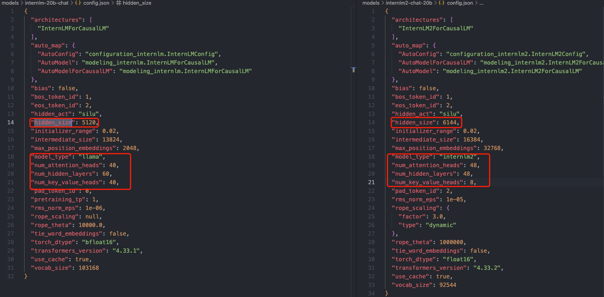

根据模型计算公式：

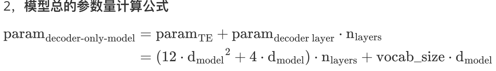

可知：

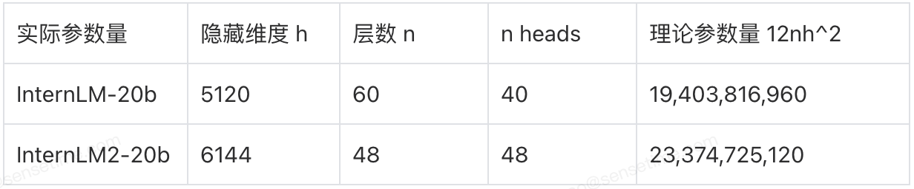

### 1.2、模型结构区别的适配

和 1 相比，模型结构有所区别，总参数量增加 4b 左右，默认权重类型为 pytorch 类型的 bin 后缀。且从介绍来看，新模型并没有添加新的算子。

修改下述代码(tgi-for-ascend/server/text_generation_server/models/__init__.py)，支持模型配置：


### 1.3、使用了 GQA 技术的适配


InternLM2-20b 模型使用了 GQA  技术，kv cache  对应的 head  数目为 8，kv cache 所需存储的 tokens 相比之前，减少了 48/8 = 6 倍。
> GQA 将查询头分成 N 组，每个组共享一个Key 和 Value 矩阵

flash_llama.py 会自动读取模型结构的 num_key_value_heads 值。

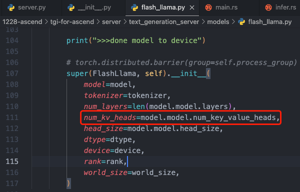

默认权重类型为 pytorch 类型的 bin 后缀 ，但是获取权重的 weight_files 函数会自动 bin 后缀转换为 .safetensors 后缀。

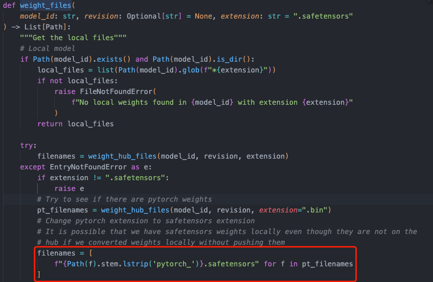

最终实际的模型结构类是在下述代码定义中导入：

```python
from text_generation_server.models.custom_modeling.flash_llama_modeling_ascend import (
    FlashLlamaForCausalLM,
    LlamaConfig,
)
```

### 1.4、模型权重文件名适配

1，tokens 转 embedding 向量过程

internlm2 模型没有 model.embed.tokens.weight 权重，其名字变成了 model.tok_embeddings.weight。

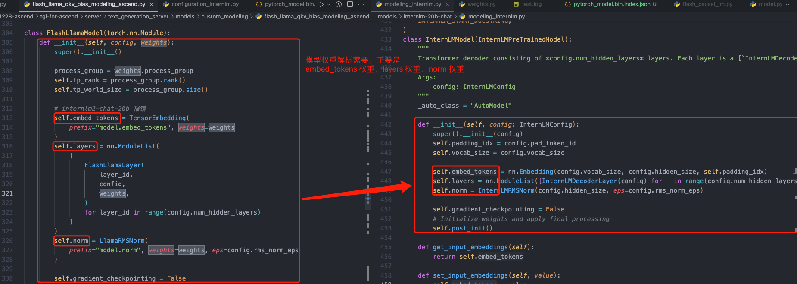
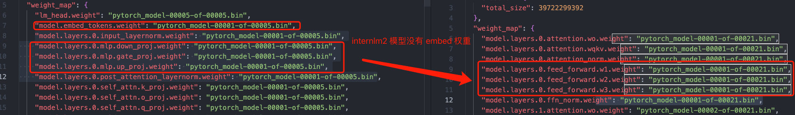
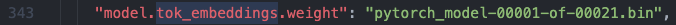

2，其他权重文件名适配不再举例。

3，特殊情况，internlm2 模型 attention 层的 q k v 权重做了合并，这点和 llama 模型不同，会导致模型推理框架中**权重个数对不上**的问题，因为底层C++ 库 linear 尺寸是写死的。报错代码和报错关键信息在下图：

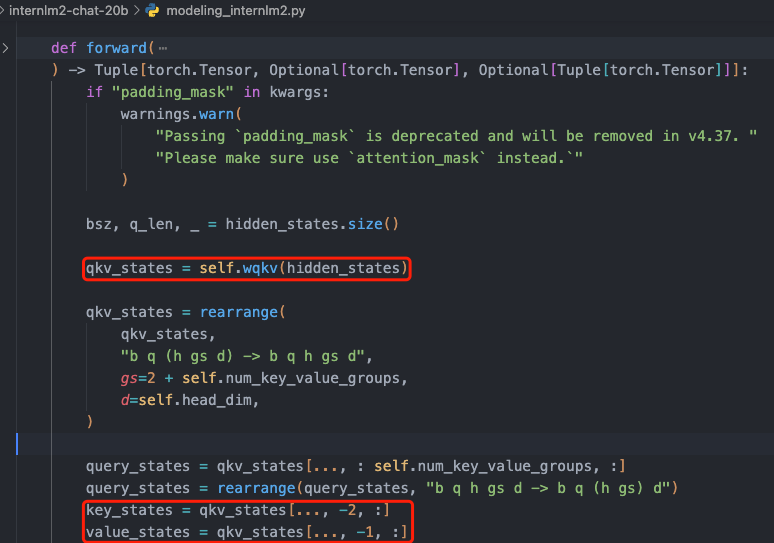
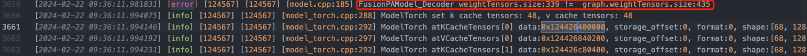

### 适配过程总结

文件修改序列：

1. 函数 get_model：server/text_generation_server/models/__init__.py
2. 类 class FlashLlama(FlashCausalLM)：server/text_generation_server/models/flash_llama.py
3. 新增类 FlashInterlm2ForCausalLM（参考类 FlashLlamaForCausalLM）： server/text_generation_server/models/custom_modeling/flash_internlm2_modeling_ascend.py

## 二、间接适配-权重文件转换

使用官方自带或者自行编写的模型权重转换工具，将 internlm2 模型权重文件转换为 llama 模型权重文件，使得模型能够适配原来的 llama 架构，工具主要操作如下：

- wqkv 权重拆解成 3 个 q、k、v 权重矩阵。
- attention 输出线性层、ffn、embedding、norm、最后的输出线性层等层重新命名。

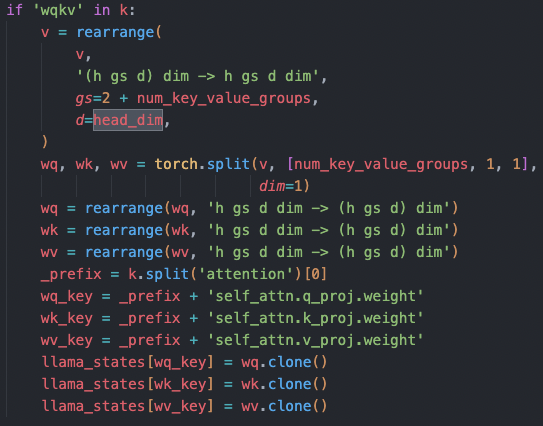

## 参考资料

- [Ascend 开发指南导读](https://www.hiascend.com/document/detail/zh/CANNCommunityEdition/80RC1alpha001/devguide/devguide/devguide_0001.html)