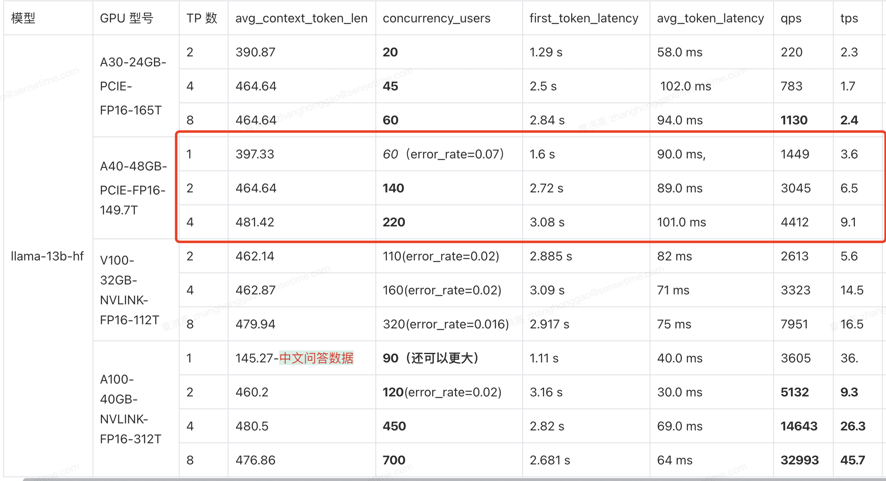
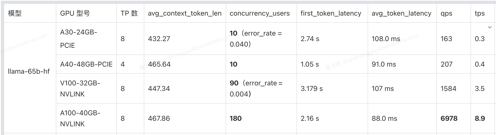
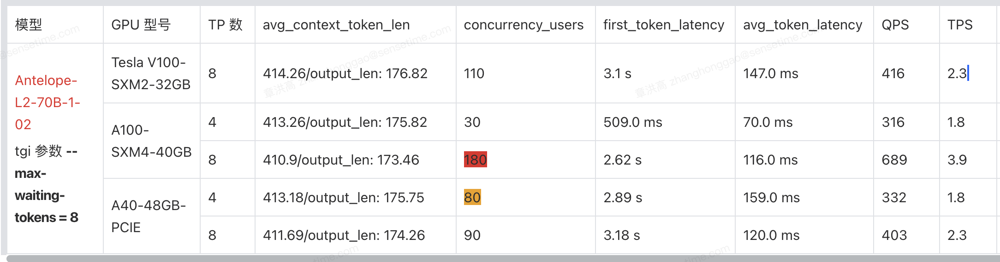
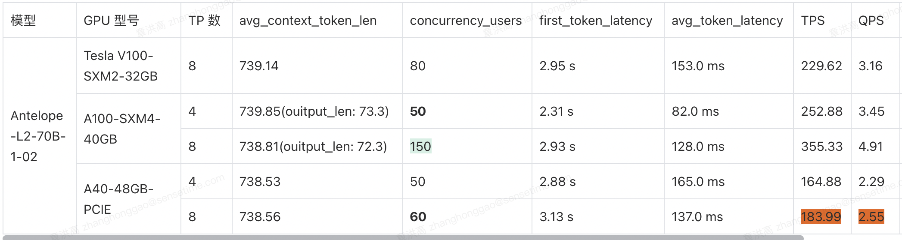

## 一、性能评测方案及指标定义

### 1.1、benchmark 评测实验方案

prompt 数据集分成英文和中文数据集，英文的是 vllm  框架所采用的数据集（裁剪版，只使用了 2000条左右），中文的是 ziya 数据。
> 性能测试工具代码中对于 first_token_latency 计算公式一定是所有请求的 first_token_latency 之和除以所有的请求数。

**1，旧版性能测试方案**：

客户端每个用户只发一个请求，每个请求的输入输出 token 长度一致。客户端的典型输入请求参数如下:
prompt_token_len = 42, output_token_len = 285。

**2，新版测试方案更新关键点**：

1. latency 不只使用平均值，而是加上了 p99, p90, p95, p50 等指标，根据用户需求可灵活定制部署方案。
2. 客户端累计发送 total_num_requests 个请求，每个用户发送请求数目可能不一样，从一个公共队列（队列里总共有 250 个请求）取数据，直到请求发完。
3. 模拟真实发送请求情况，每次发送请求动态间隔 1～3 秒。

> 一般来说，性能测试要统一考虑这么几个因素：Thoughput 吞吐量，Latency 响应时间，资源利用（CPU/MEM/IO/Bandwidth…），成功率，系统稳定性。

### 1.2、评测的指标定义

**1，用户指标**：

- `first_token_latency` 首字时延：从请求发出到第一个 token 生成的耗时。
- `avg_token_latency` 非首字时延：从第二个到第 N 个 token 生成的平均耗时。
- `response_time`【不算很重要】：用户从发起请求到收到最后一个 Token 响应结束的时间。
- `benchmark_time`：用户发送完所有请求的最大运行时间。

**2，系统指标**：
- `concurrency_users`: LLM 服在满足用户首次时延和非首次时延的基础上，可支持的最大并发用户数。
- `throughput_token_rate`：单位：`TPS`，表示系统每秒能生成 `tokens` 的数量。
- `throughput_request_rate`: 单位：`QPS`，表示服务每秒能处理的请求数量。
- `error_rate`：所有并发用户请求失败的总次数占比总请求数，系统错误率越小越好。

用户指标的计算有两种方法，一种是用户端自行计算，另外一种是从服务端返回的响应的 `header` 里面解析得到。核心 latency 相关的指标定义代码如下：

```python
headers = res.info() # return headers

response_ret["prompt_len"] = int(headers["x-prompt-tokens"]) # int 类型
response_ret["output_len"] = int(headers["x-generated-tokens"]) # 最后一个返回是返回 generate_text

# x-prefill-time + x-decoding-time = x-inference-time
response_ret["avg_token_latency"] = int(headers["x-time-per-token"]) / 1000 # 不计算第一个 token 的延时, 单位 ms, str 类型转换为 int 类型数字
response_ret["first_token_latency"] = (int(headers["x-prefill-time"]) + int(headers["x-queue-time"])) / 1000 # 第一个 token 的延时，需要加上排队时间
response_ret["response_time"] = int(headers["x-inference-time"]) / 1000

response_ret["prefill_time"] = int(headers["x-prefill-time"]) / 1000
response_ret["queue_time"] = int(headers["x-queue-time"]) / 1000
```

系统指标计算的关键代码：

```bash
# 同步多进程发送多个请求，sum_of_response_time 是所有请求的响应时间之和，sum_of_success_requests 是所有请求数目之和。
benchmark_time = max(all_benchmark_time_list)
error_rate = round(sum_of_errors_request / total_num_requests, 3)
serving_throughput_token = round(sum_of_output_tokens / benchmark_time, 2) # 输出 tokens 数目吞吐率
throughput_request_rate: = round(total_num_requests / benchmark_time, 2) # 请求吞吐率
```

## 二、聊天场景关键性能矩阵

### 2.1、llama 系列模型关键性能矩阵

假设用户性能要求：首次延时 < 3 s，平均延时 < 100ms，这里的测试场景是常规聊天场景。

1，llama13b 模型性能测试结果：



2，llama65b 模型性能测试结果：



3，llama70b 模型性能测试结果：



### 2.2、部署方案

假设用户性能要求：首次延时 < 3.15 s，平均延时 < 100 ms。

#### 2.2.1、LLAMA-13B 模型

1，如果是选择 A30 显卡，最多同时服务 10000 人规模的用户。

4 卡 A30 和 8 卡 A30（PCIE） 性能没有差 2 倍以上，对于单节点机器，考虑部署两个实例性价比更高，即单节点8卡A30的机器，应该部署两个实例，最多可同时将服务 45 + 45 = 90 个用户，如果需要最多同时服务 10000 人规模的用户，则需要 10000 / 90 ～= 111，即需要 111 个 8 卡 A30 节点。

2，如果是选择 A40 显卡，最多同时服务 10000 人规模的用户。

对于单节点服务器，1 个实例的 4 卡部署性能不优于 2 个实例的 2 卡部署。10000 /（140+140） ～= 35，即需要 35 个 4 卡 A40 节点。

3，如果是选择 V100 显卡，最多同时服务 10000 人规模的用户。

同理，对于单节点服务器，1 个实例的 8 卡部署性能和 2 个实例的 4 卡部署性能差不多。10000 / 320 ～= 14，即需要 31 个 8 卡 V100 节点。

4，如果是选择 A100-40gb 显卡，最多同时服务 10000 人规模的用户。

对于单节点服务器，2个实例的4卡部署支持的并发数（450 + 450）大于 1 个实例的 8 卡并发数（700）。10000 / 900 ～= 11，即需要 11 个 8 卡 A100-40gb 节点。

#### 2.2.2、LLAMA-65B 模型

1，如果是选择 A30（PCIE）显卡，最多同时服务 10000 人规模的用户。

同理，10000 / 10 = 1000，即需要 1000 个 8 卡 A30 节点。

2，如果是选择 A40（PCIE）显卡，最多同时服务 10000 人规模的用户。

常规问答类场景（输入输出上下文长度 327）：4 卡机器的并发为 10，首次延时为 2.174 s。10000 / 10 =1 000，即需要 1000 个 4 卡 A40 节点。

3，如果是选择 V100（NVLINK）显卡，最多同时服务 10000 人规模的用户。

同理，10000 / 90 ～= 111，即需要 111 个 8 卡 V100 节点。

4，如果是选择 A100-40gb（NVLINK）显卡，最多同时服务 10000 人规模的用户。

同理，10000 / 180 ～= 55，即需要 55 个 8 卡 A100 节点。

#### 2.2.3、LLAMA2-70B 模型

1，如果是选择 V100（NVLINK）显卡，最多同时服务 10000 人规模的用户。

同理，10000 / 45 ～= 222，即需要 222 个 8 卡 V100 节点。

2，如果是选择 A100-40gb（NVLINK）显卡，最多同时服务 10000 人规模的用户。

同理，10000 / 45 ～= 222，即需要 222 个 8 卡 A100 节点。总结：建议选择 A100-80GB 的显卡，选用低显存的显卡，总体还是性能不够好。

3，如果是选择 A40-48gb（PCIE）显卡，最多同时服务 10000 人规模的用户。

8 卡部署性能支持的并发数小于两个实例的 4 卡部署，即可知 10000 / (90 * 2) ～= 55，即需要 55 个 8 卡 A40 节点。

#### 2.2.4、聊天场景 LLama 模型部署总的结论：

1. 对于 V100 、A100  机器（NVLINK  通信）来说，部署方案都是卡越多越好，理论上可以避免模型参数显存浪费，实际性能测试也是 8  卡部署的并发数大部分都是 4  卡部署并发数 2  倍以上。
2. 对于 A30、A40 机器（PCIE 通信），大部分 LLM 模型的部署并不是卡（TP 数）越多越好，卡与卡直接通信耗时已经超过了 TP 数增加带来了性能提升。
3. 不考虑成本的情况下，A100-40 GB  > A40 > V100 > A30 部署。

## 三、长上下文关键性能矩阵

1，llama2-7b 长上下文关键性能矩阵测试结果：



2，internlm-20b 长上下文关键性能矩阵测试结果：


长上下文数据集和聊天数据集对比并发测试的一些结论：

1. 对于长上下文（`DocQA`）数据集，计算能力更强的 `A100` 机器的并发影响比计算能力更弱的 `V100/A40`（`PCIE`）更小。
2. 对于上下文长度的更大的 `DocQA` 数据集，随着上下文长度的增加，`LLM` 服务化系统可能也会从带宽受限转向计算受限。
3. 对比 `8` 卡 `V100/A100` 机器，上下文长度增加比例一致为 0.44，但并发数减小比例是 0.27 vs 0.16【V100 计算能力弱于 A100】。

## 参考资料

1. [服务端性能测试 - 入门指南 (慎入: 6000 字长文)](https://testerhome.com/topics/27409)
2. [性能测试应该怎么做？](https://coolshell.cn/articles/17381.html)