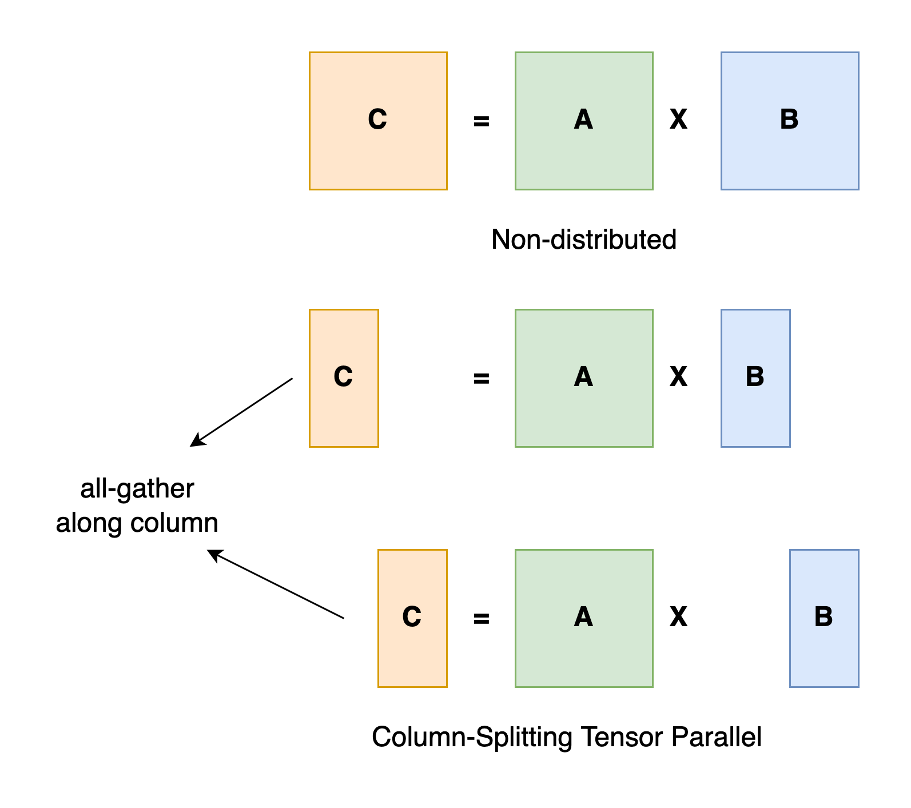
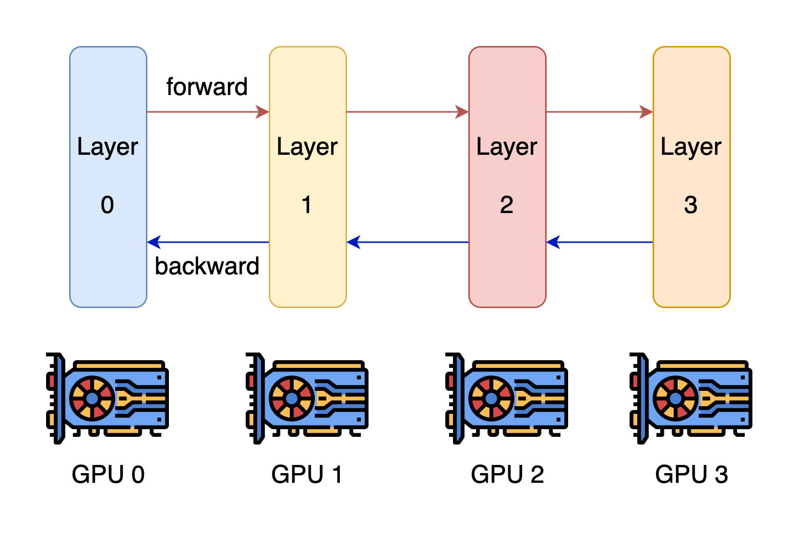
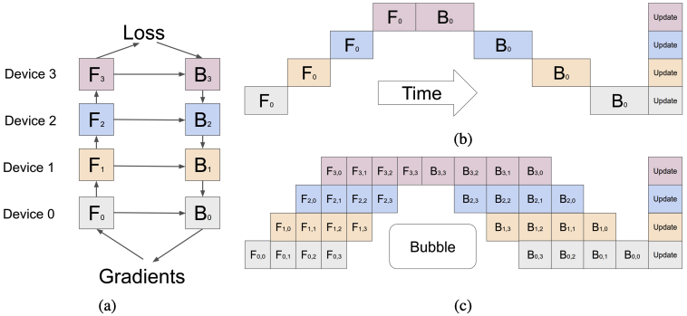

## 一，集合通信及其通信原语

1，对于单节点服务器（`8` 卡）的数据并行 **DP（Data Parallelism）**算法，一般 `GPU0` 执行 `AllReduce` 操作，即**执行聚合再下发梯度**的操作。实现 `DP` 的一种经典编程框架叫“参数服务器”，在这个框架里，**计算 GPU 称为Worker**，**梯度聚合 GPU 称为 Server。**

2，`DP` 一般适合单机多卡场景，`DDP` （Distributed Data Parallelism）适合多机多卡场景。`DDP` **目前最通用的AllReduce方法：Ring-AllReduce**，由百度提出，很有效的解决了数据并行中通讯负载不均衡的问题。Ring-ALLReduce 的两个步骤是：**Reduce-Scatter** 和 **All-Gather。**

### 1.1，常见集合通信算子

3，集合通信（Collective Communications）是一个进程组的所有进程都参与的全局通信操作，其最为基础的操作有 发送 send、接收receive、复制 copy、组内进程栅障同步 Barrier 以及节点间进程同步(signal +wait )，这几个最基本的操作经过组合构成了一组通信模板也叫通信原语，比如：1 对多的广播 broadcast、多对 1 的收集gather、**多对多的收集 all-gather**、1 对多的发散 scatter、多对 1 的规约 reduce、多对多的规约 all-reduce、**组合的规约与发散 reduce-scatter**、多对多的 all-to-all 等，集合通信的难点在于通信效率以及网络硬件连接拓扑结构的最佳适用。

4，`Scatter` 是数据的 1 对多的分发，它将一张 `XPU/GPU`` 卡上的数据进行分片再分发到其他所有的 `XPU/GPU` 卡上，他的反向操作对应 `Gather`，其应用场景有：

- ReduceScatter 组合里的 Scatter 操作；
- 模型并行里初始化时将模型 Scatter 到不同的 XPU 上；

5，`Gather` 是数据的多对 1 的收集，它将多张 XPU 卡上的数据收集到 1 张 XPU 卡上，他的反向操作对应 Scatter，其应用场景有：

- ReduceScatter 组合里的 Scatter 操作；

6，`AllGather` 属于多对多的通信原语，具有多个数据发送者，多个数据接收者，可以在集群内把多个节点的数据收集到一个主节点上（Gather），再把这个收集到的数据分发到其他节点上（broadcast），即收集集群内所有的数据到所有的节点上。可以看做 Gather + Broadcast 的操作组合，它的反向操作对应 ReduceScatter，其最应用场景有：

- AllGather 可应用于模型并行；
- 模型并行里前向计算里的参数全同步，需要用 allgather 把模型并行里将切分到不同的 XPU上 的参数全同步到一张 XPU 上才能进行前向计算。

7，`Reduce` 是数据的多对 1 的规约运算，它将所有 XPU 卡上的数据，规约（比如 SUM 求和）到 1 张XPU卡上，其应用场景有：

- AllReduce 里的 broadcast + reduce 组合里的 reduce 操作；
- ReduceScatter 组合里的 reduce 操作；
- 分布式训练 parameter server 参数服务器结构里的 master节点 broadcast 数据到 worker 节点，再从worker 节点 reduce 数据回 master 节点里的 reduce 操作；

8，**ReduceScatter** 是数据的多对多的 reduce + scatter 运算，它将所有的 XPU 卡上的数据先规约（比如 SUM 求和）到 1 张 XPU 卡上，再进行 scatter。如下图所示，先 reduce 操作 XPU 0-3 的数据 reduce 为 A(A0+A1+A2+A3) + B(B0 + B1 +B2 + B3) + C(C0 + C1 + C2 + C3) + D(D0 + D1 + D2 + D3 ) 到一张 XPU 上，再进行分片 scatter 到集群内所有的 XPU 卡上。

其应用场景有：

- ReduceScatter即可应用于数据并行也可应用于模型并行；
- 数据并行 allReduce 里的 ReduceScatter+ Allgather 组合里的 ReduceScatter 操作；
- 模型并行里在前向 allgather 后的反向计算里的 ReduceScatter；

9，**AllReduce** 属于多对多的通信原语，具有多个数据发送者，多个数据接收者，其在集群内的所有节点上都执行相同的 Reduce 操作，可以将集群内所有节点的数据**规约运算**得到的结果发送到所有的节点上。AllReduce 操作可通过在主节点上执行 Reduce + Broadcast 或 ReduceScatter + AllGather 实现。

其应用场景有:

- AllReduce 应用于数据并行；
- 数据并行各种通信拓扑结构比如 Ring allReduce、Tree allReduce 里的 allReduce 操作；

## 二，数据并行训练

`Ring` 是最基础的互联结构，在深度学习的分布式训练里，`Ring AllReduce` 拓扑算法奠定了**数据并行训练**的**集合通信基础**。

本文中 Ring AllReduce 的应用场景是在服务器内将8张加速卡组环通信进行分布式训练。每个 XPU 都是这个主机内互联环上的一个计算节点，每个节点都有一个前向和一个后向，它只会向它的前向接收数据，并向它的右向发送数据，如下图所示， 8 张 XPU 通过主机内的私有互联网络组成一个环，当然因为这些通信网络是双工的，这 8 张XPU 训练加速卡也可以看成是通过多个逻辑环互联起来的，同时缺点是，如果这个 ring 太大，Ring Allreduce 的效率也会变得很低。

`Ring Allreduce` 有两种组合实现策略:

1. 先 Reduce 后 broadcast；
2. 先 ScatterReduce 后 AllGather。

在分布式训练中，这两个策略执行后都会让每个 XPU 节点得到一样的平均梯度，具体执行过程如下图所示

`Ring AllReduce` 的最佳组合是 `ScatterReduce` + `AllGather` 方法。

简单起见，让我们假设目标是对一个浮点数的大数组求和; 系统中有 N 个 GPU，每个 GPU 都有一个相同大小的数组，并且在 allreduce 的末尾，每个 GPU 都应该有一个相同大小的数组，其中包含原始数组中数字的总和。

**N 个 GPU 中的每一个都将发送和接收 N-1 次 scatter-reduce，N-1 次 allgather**。**每次，GPU 都会发送 K / N 值，其中 K 是数组中不同 GPU 上相加的值总数**。因此，**传输到每个 GPU 和从每个GPU传输的数据总量**为：

$$\frac2{N-1}{\frac{K}{N}}$$

由于**所有传输都是在离散迭代中同步进行**的，因此**所有传输的速度受到环中相邻 GPU 之间最慢(最低带宽)连接的限制**。一般来说，**如果一个节点上的所有 GPU 在环中彼此相邻，则该算法的功能最佳**；这最小化了网络争用的量，否则这可能会显著降低 GPU-GPU 连接的有效带宽。

## 三，模型并行

在数据并行训练中，一个明显的特点是每个 GPU 持有整个模型权重的副本。这就带来了**冗余**问题。另一种并行模式是模型并行，即模型被分割并分布在一个设备阵列上。

模型并行通常有两种：
1. 张量并行（Tensor Parallelism）: 也叫层内并行，在一个操作中实现并行计算，如矩阵-矩阵乘法。
2. 流水线并行（Pipeline Parallelism）：也叫层间并行，在各层之间进行并行计算。

### 3.1，张量并行

张量并行是将一个张量沿特定维度分成 N 块，每个设备只持有整个张量的 1/N，同时不影响计算图的正确性。

以矩阵乘法算子为例，理解张量并行原理，假设有 C=AB，
1. 可以将矩阵 B 沿着列分割成 [B0 B1 B2 ... Bn]，每个设备（GPU/NPU）持有一列；
2. 将 A 与每个设备上 B 中的每一列相乘，我们将得到 [AB0 AB1 AB2 ... ABn]；此时，每个设备只持有部分结果，例如设备(rank=0)持有 AB0；
3. 最后，我们需要收集全部的结果，并沿列维串联张量。

典型的张量并行实现：Megatron-LM（1D）、Colossal-AI（2D、2.5D、3D）。

### 3.2，流水线并行

流水线并行的原理可以参考计算机课程中的 CPU 设计。在 CPU 中，指令流水线是一种技术，它将 CPU 的指令处理过程分成多个步骤，每个步骤由一个专用的电路来处理。这样，每个电路都可以专注于一种特定的任务，而不是处理所有的指令。这样，CPU 可以在一个时钟周期内处理多个指令。

大模型分布式训练中的流水线并行的合适思想是，模型按层分割成若干块，每块都交给一个设备。在前向传递过程中，每个设备将中间的激活传递给下一个阶段。在后向传递过程中，每个设备将输入张量的梯度传回给前一个流水线阶段。这允许设备同时进行计算，并增加了训练的吞吐量。流水线并行训练的一个缺点是，会有一些设备参与计算的冒泡时间，导致计算资源的浪费。

## 参考资料

1. [Colossal-AI文档：并行技术](https://colossalai.org/zh-Hans/docs/concepts/paradigms_of_parallelism/)
2. [Large Transformer Model Inference Optimization](https://lilianweng.github.io/posts/2023-01-10-inference-optimization/)
3. [分布式训练 – 第3篇 - 集合通信及其通信原语](https://www.changping.me/2022/04/04/ai-distributed-training-coll-lang/)
4. 