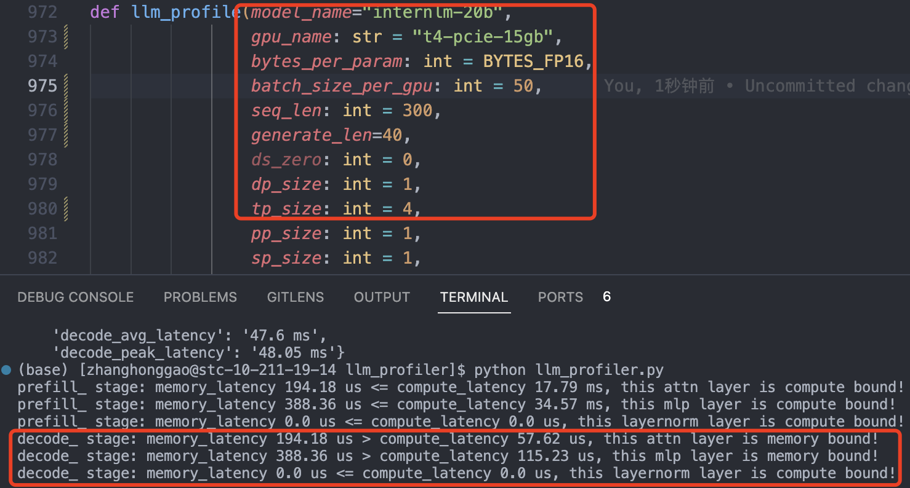
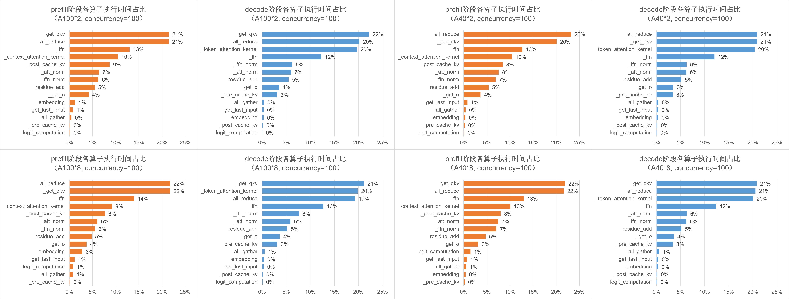
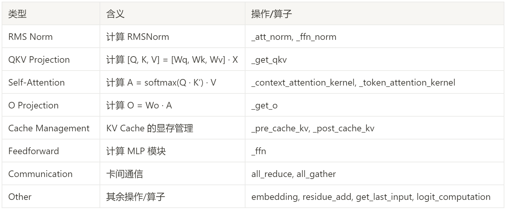
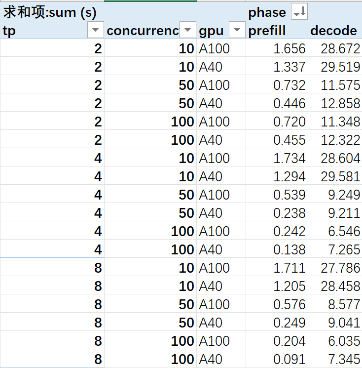
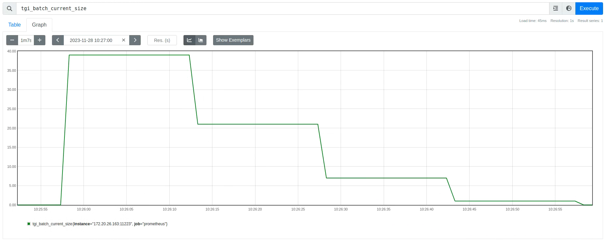

前言：分析性能瓶颈，对比  2/4/8卡 A40、8卡 A100 的 prefill、decode、通信耗时占比区别，给出定量结论。

## 一、TGI 动态性能测试实验分析

### 1.1. 实验目的及过程设计
#### 1.1.1. 实验目的

- 实验一：多路请求并发情况下，使用张量并行的不同显卡(A100/A40)上的卡间通信时间（all_reduce/all_gather）占总时间的比例对比，和主要 kernel 执行时间对比（柱状图）
- 实验二：prefill 和 decode 时间对比（作为后续 prefill 优化的参考基准）

#### 1.1.2. 实验过程设计

`internlm-20b` 模型服务，测试端是  20 个并发同时发请求，数据集是 shared_gpt 对话数据集，总共发 250 个请求，分别在以下场景跑性能数据：

- 2/4/8 张 v100 卡，分别跑 20/50/100 个并发，得到主要 operation 的 `Promehteus` 性能数据；
- 2/4/8 张 a100 卡性能数据，分别跑 20/50/100 个并发，得到主要 operation 的 Promehteus 性能数据；
- 2/4/8 张 a40 卡性能数据，分别跑 20/50/100 个并发，得到主要 operation 的 Promehteus 性能数据；

理论分析：prefill 过程计算受限，decode 过程内存受限。

#### 1.1.3. 性能数据结果

[性能数据结果](../../images/results.zip)

### 1.2. 多请求动态数据测试

当前多请求并发的测试方式为：固定请求池容量，启动若干个独立进程从请求池中取请求并向推理服务发送请求，发完为止。在这个过程中，利用性能分析工具 prometheus，统计各轮次推理、各算子执行的延时（latency），再通过聚合算得总延时（sum latency）和平均延时（avg latency）。

可能影响延时的因素包括：

1. 不同的模拟应用场景：用户并发数（高并发 vs 低并发场景）、输入输出上下文长度（DocQA长上下文 vs Chatbot短上下文）…
2. 不同的硬件资源条件：GPU 型号（算力、显存容量、显存带宽、卡间通信带宽）、GPU 数量（张量并行数）…
下面的实验结果是对于短上下文场景（ShareGPT数据集），在 2/4/8*A100、2/4/8*A40、2/4/8*V100 的不同硬件资源条件下，使用 InternLM-20B 模型，固定请求池容量为 250，分别设置用户并发数分别为 10/50/100 测试得到。

下面的实验结果是对于短上下文场景（ShareGPT数据集），在 2/4/8*A100、2/4/8*A40、2/4/8*V100 的不同硬件资源条件下，使用 InternLM-20B 模型，固定请求池容量为 250，分别设置用户并发数分别为 10/50/100 测试得到。

### 1.3. 实验结果与分析

1，不同硬件资源条件下，单次 prefill 和 decode 阶段的平均延时分析：
- 用户并发数和 GPU 数量对 decode 平均延时的影响不显著。
- 在 V100 上（目前只有 10 并发数据），prefill 平均延时随着 GPU 数量的增加而降低；而在 A100/A40上，prefill 平均延时随着 GPU 数量的增加并没有呈现单调降低的规律（prefill 延时不稳定）。
  

2，不同硬件资源条件下，`prefill` 阶段和 `decode` 阶段各算子的执行时间占比分析：
 - 无论在什么条件下，算子耗时占比的构成几乎一致。在 prefill 阶段，`all_reduce` 和 `_get_qkv` 耗时最多（均为 20%+），其次是 _ffn（14%）和 _context_attention_kernel（9%）等算子；在 decode 阶段，_get_qkv, _token_attention_kernel, all_reduce 耗时最多（均为 20%+），其次是 _ffn（14%）等算子。
 - 以 A100*8 为例，prefill 阶段的 _post_cache_kv 算子耗时占比（8%）比 decode 阶段（0%）明显更高，这是因为 prefill 阶段需要将计算得到的 KV 值存入 KV Cache；相应地，decode 阶段也需要在 _pre_cache_kv 算子花时间（3%）从 KV Cache 中加载 KV 值。
 - 以 A100*8 为例，decode 阶段的 Self-Attention 算子耗时占比（20%）比 prefill 阶段（9%）明显更高？
 - decode 阶段 A40 显卡 all_reduce 时间耗时最多（PCIE 通信速度慢？）。
  

3，如果将各算子按照下方左图的方法分类，则在 A100*8 情形下各类算子的占比情况如下方右图所示。

4，对比不同型号 GPU 的卡间通信算子 all_reduce 的耗时情况：在 prefill 阶段，A100 的 all_reduce 总耗时要普遍高于 A40；而在 decode 阶段，A40 的 all_reduce 总耗时要普遍高于 A100。

5，实际平均推理组 batch 的 batch_size 大小是远小于它能支持的理论最大 batch_size，实际推理时 batch_size 是动态变化的。以 8 卡 A100 为例，2k 上下文长度的理论最大 batch_size = 110，实际平均推理 batch_size = 25， 25 << 110。另外，TGI 调度策略影响 lightllm 推理后端的 batch_size ，而 batch_size 影响推理 latency。

总结：**通信瓶颈，模型大小，算力瓶颈**三者约束了最优的模型 LLM 部署解决方案，通信瓶颈包括卡内访存和卡间互联带宽，且通信和算力瓶颈跟聊天文档的输入输出长度强相关。使用了 kv cache 优化的推理框架，无论是 prefill 还是 decode 阶段，都是内存受限。
