DS 是 deepspeed 框架的缩写，本文分别评测了 DeepSpeed、transformers、FasterTransformer 三个框架。

## 一、DS/transformers/ft 框架评测 llama13b/65b 模型总的结论

1，实验1、实验3 DS/transformers/ft 框架公共结论

1. 输入长度在 batch_size 较小时基本不会影响 latency，超过某个阈值时，输入长度就会显著影响 latency。且随着 GPU 数目的增加，输入长度对 Latency 产生影响的 batch_size 阈值也随着增加。
2. 随着 TP 的增加（硬件算力增加），Latency 减少；且 batch_size < 一定阈值，Latency 不会增加。 
3. TP （gpu数目）增加，batch_size 增加，tps 增加，且 batch_size 范围在 [32, 256] 性价比最高。

2，实验2结论

- DS/transformers/ft 框架固定输入 ids 长度，输出 output_ids 长度不影响 latency
- ~~ft 框架：output_ids_len越大，latency 越小，且随着 batch_size 增加越发明显？（后续泽欣会再更新这个结论）~~

## 二、DS 实验设计、结论、分析

### 2.1，实验 1

1. **实验设计**：固定输出 tokens 数和 tp 数，基于张量并行加速下，设置不同输入 tokens 数和 batch_size，分析 Latency 变化。
2. **实验结论**：输入长度在 batch_size 较小时基本不会影响 latency，超过某个阈值时，输入长度就会显著影响 latency。且随着 GPU 数目的增加，输入长度对 Latency 产生影响的 batch_size 阈值也随着增加。
3. **13b 模型实验图表**：
    - 固定 num_gpus=1, output_ids_len=20。当 batch_size<8 时，输入长度几乎不影响 latency；当 batch_size>=8 后继续增加，输入长度对 latency 的影响越来越显著

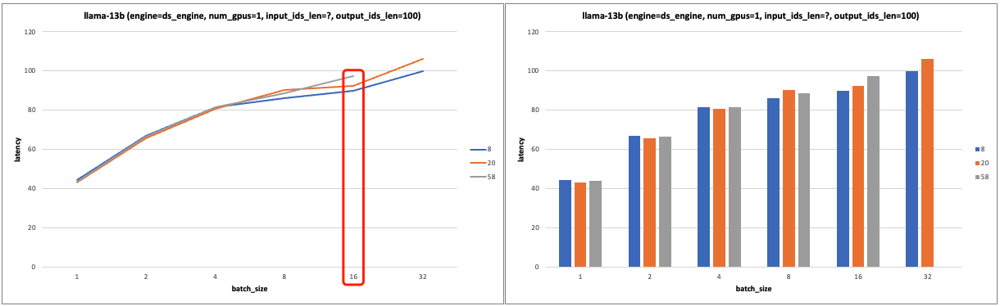
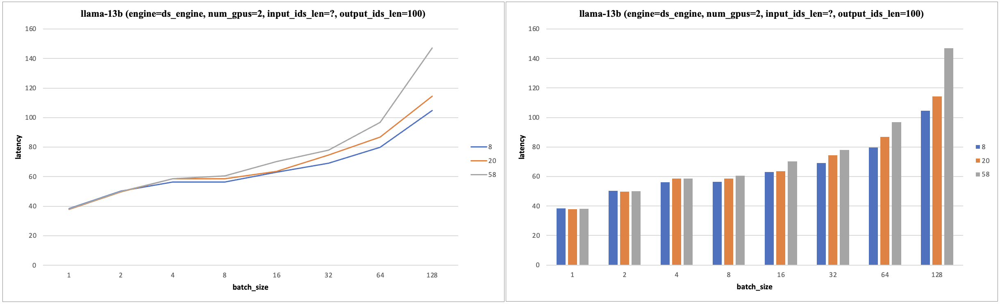
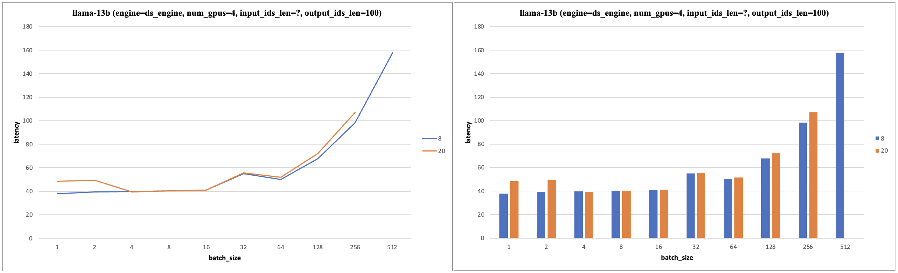
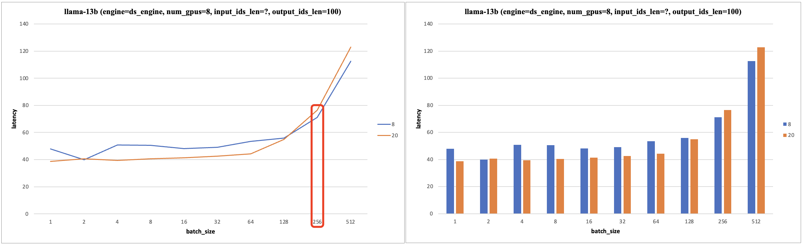

4. **65b 模型实验图表**：实验图表分析后可知 llama-65b 模型实验结果和13b 模型一致。

### 2.2、实验 2

1. **实验设计**：固定输入 id 长度，基于张量并行加速下，设置不同输出 id 长度和 batch_size，分析 Latency 变化。
2. **实验结论**：固定输入 ids 长度，输出 output_ids 长度不影响 latency。
3. **13b 模型实验图表**：

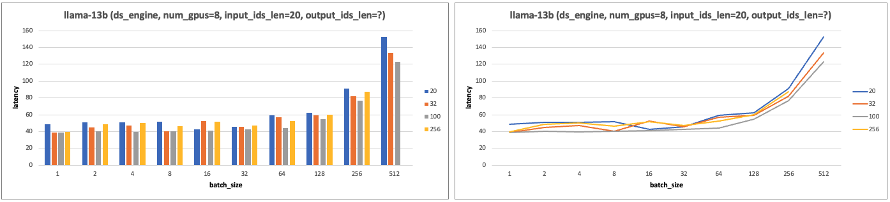

4. **65b 模型实验图表**：实验图表分析后可知 llama-65b 模型实验结果和 13b 模型一致。

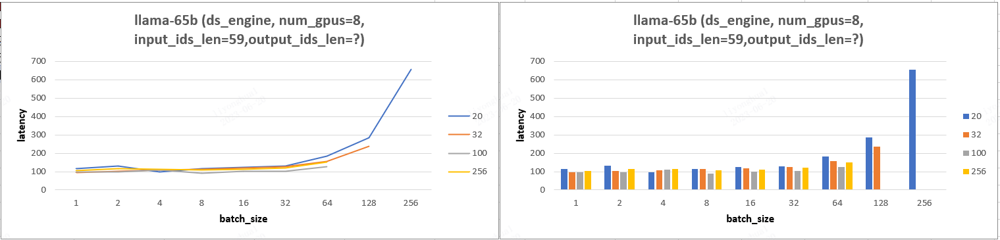

### 2.3、实验 3

1. **实验设计**：输入输出 ids 长度固定，设置不同 tp 和 batch_size，分析 throughput 变化。
2. **实验结论**：
   - 随着 TP 的增加（硬件算力增加），Latency 减少；且 batch_size 增加到一定范围内，Latency 也不会增加。 
   - TP （gpu数目）增加，batch_size 增加，tps 增加，batch_size 范围在 [32, 256] 性价比最高。

3. **实验图表**：
    - 固定 input_ids_len=20, output_ids_len=100。
    - 固定 input_ids_len=20, output_ids_len=100。
  
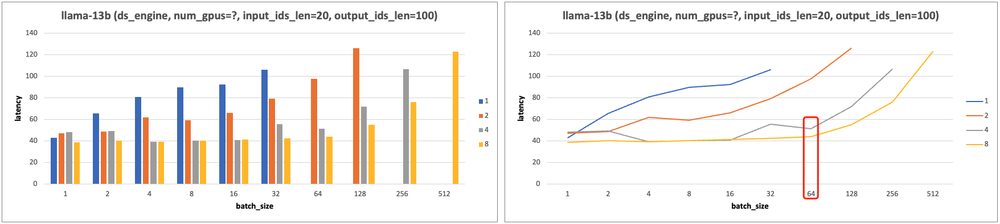
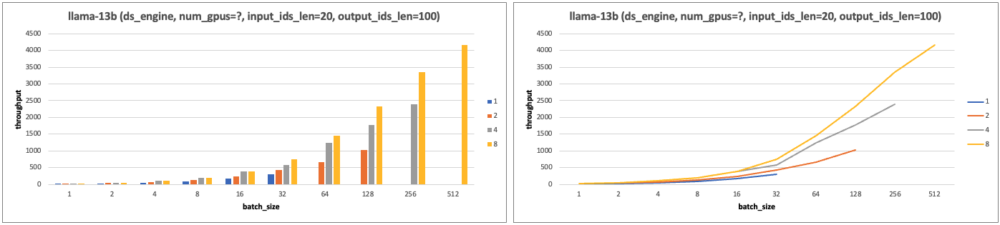

4. **llama-65b 模型实验图表**：实验图表分析后可知 llama-65b 模型实验结果有和13b 模型的结论 b 一样。

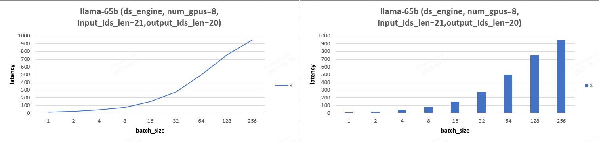
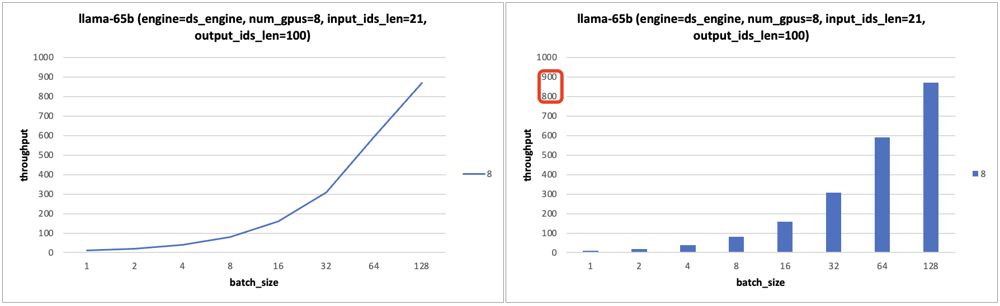

### 2.4，实验 4 - cpu内存/gpu显存峰值分析

1. **实验设计**：设置不同的 input_ids_len、output_ids_len、batch_size、num_gpus 分析 cpu 峰值、gpu 显存的变化情况。
2. **实验结论**：
   - 当 batch_size 较小，随着 batch_size 的增加，显存峰值的变化非常平缓；当 batch_size 超过某个阈值后，显存峰值会急剧上升。且这个阈值与 gpu 数量相关，gpu 数量越多，能接受的 batch_size 越大。
   - gpu 数量翻倍时，显存占用并不是严格减半，而是会稍大于原来显存占用峰值的一半。

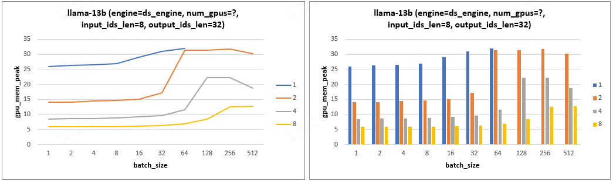

## 三、理论分析

**根据 GPU 带宽和算力以及模型 FLOPs，可以得到输入 tokens 总数（input_ids_len * batch_size）的阈值，输入 tokens 总数 < 阈值，Latency 则取决于带宽，> 阈值，Latency 则取决于 GPU 算力**。

对于 llama-13b 模型, 固定 input_len=20，output_len=100，4个 V100 和 4个 T4 卡在 batch_size < 32 时，他们的 Latency 几乎一致，可证明以上结论，即**输入 tokens 总数 < 阈值，Latency 则取决于带宽**。

**在 batch_size < 32 时，t4/V100 的硬件性能带宽均满足系统所需要求**，故在这个范围内其 Latency 值几乎一致。

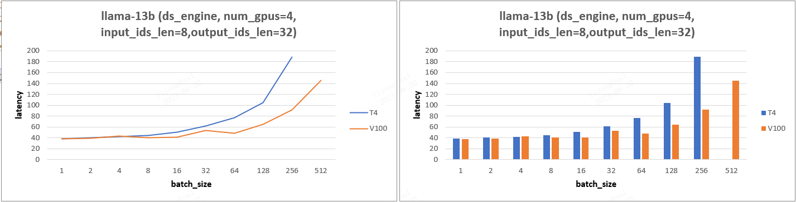

## 四、transformers 实验结论、分析

### 4.1、实验 1

**实验结论**：输入长度在 batch_size 较小时基本不会影响 latency，超过某个阈值时，输入长度就会显著影响 latency。且随着 GPU 数目的增加，输入长度对 Latency 产生影响的 batch_size 阈值也随着增加。

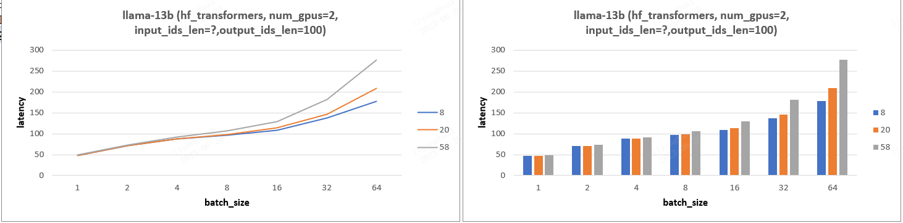

### 4.2、实验 2

1. **实验设计**：固定输入 id 长度，基于张量并行加速下，设置不同输出 id 长度和 batch_size，分析 Latency 变化。
2. **实验结论**：固定输入 ids 长度，输出 output_ids 长度几乎不影响 latency。
3. **13b 模型实验图表**：

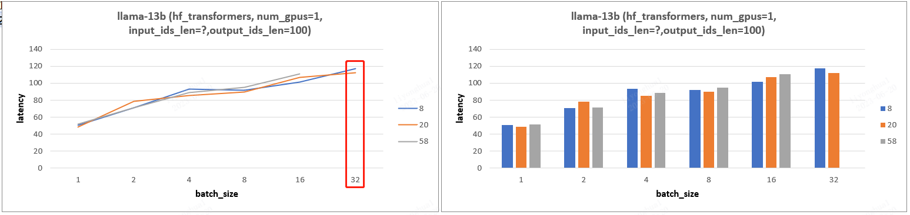

### 4.3、实验 3

**实验结论**：PP(gpu 数目) 的增加会减少 throughput 且增加 latency，其发挥的作用只是能支持更大的 batch_size！

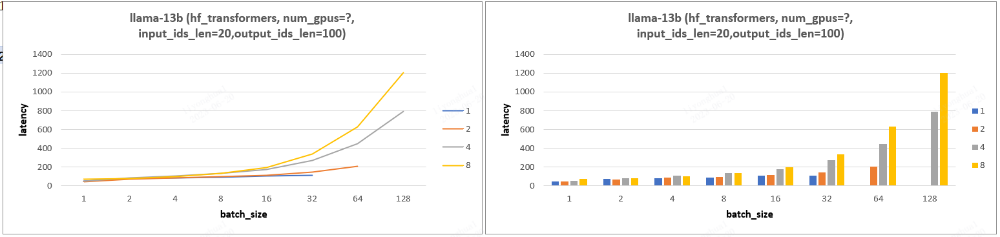
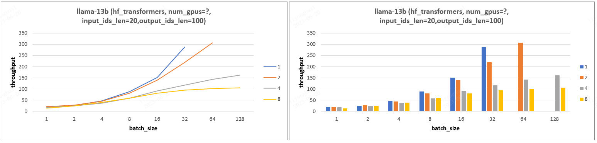

### 4.4、实验 5-cpu 内存/gpu 显存峰值分析

1. **实验设计**：设置不同的 input_ids_len、output_ids_len、batch_size 分析 cpu 峰值、gpu 显存的变化情况。
2. **实验结论**：
    - batch_size、input_ids_len、output_ids_len 增加，对应所需 gpu 显存也随之增加，batch_size 影响更大（等待更新）。

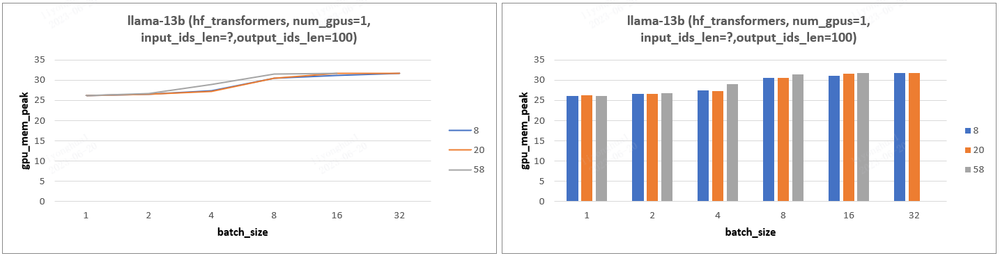
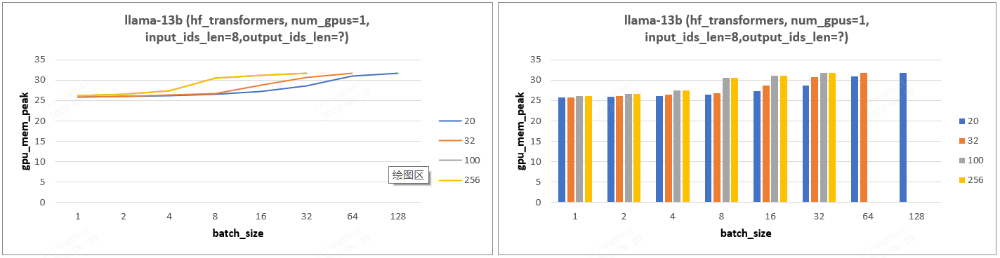

## 五、transformers/ds 框架对比

### 5.1、llama-13b 模型

1. **实验设计**：固定输入输出 tokens 数，设置不同 gpu 数目和 batch_size，分析 Latency 变化。
2. **实验结论**：gpu_num =1 情况下，transformers 框架比 ds 框架 Latency 慢一点，其他情况 ds 框架的 Latency 都远小于 transformers，尤其是 gpu_num > 1 的情况。

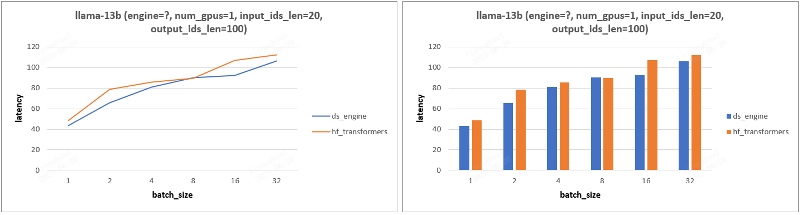
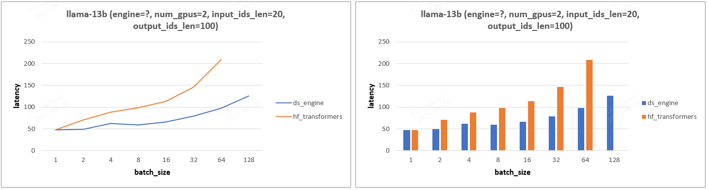
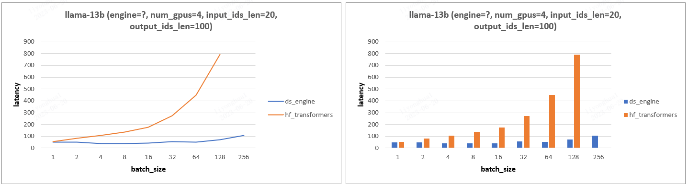

### 5.2、llama-65b 模型

llama-65b 模型结论和 13b 模型一致。

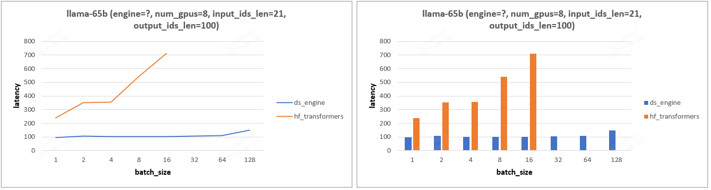