- [LightLLM 推理框架静态性能测试及分析](#lightllm-推理框架静态性能测试及分析)
  - [一、Prefill/Decode 阶段算子执行时间占比情况](#一prefilldecode-阶段算子执行时间占比情况)
  - [二、4 卡 A100 和 4 卡 A40 对比](#二4-卡-a100-和-4-卡-a40-对比)
    - [2.2、推理性能分析结果](#22推理性能分析结果)
    - [2.3、算子性能分析结果](#23算子性能分析结果)
  - [三、4 卡 A40 和 8 卡 A40 对比](#三4-卡-a40-和-8-卡-a40-对比)
    - [3.2、推理性能分析结果](#32推理性能分析结果)
    - [3.3、算子性能分析结果](#33算子性能分析结果)
  - [四、4 卡 A100 和 8 卡 A100 对比](#四4-卡-a100-和-8-卡-a100-对比)
    - [4.1、推理性能分析结果](#41推理性能分析结果)
    - [4.2、算子性能分析结果](#42算子性能分析结果)
  - [五、2 卡 A40 上 PCIe 和 NVLink 互联对比](#五2-卡-a40-上-pcie-和-nvlink-互联对比)
    - [5.1、推理性能分析结果](#51推理性能分析结果)
    - [5.2、算子性能分析结果](#52算子性能分析结果)
  - [六、总结-lightllm 推理框架性能瓶颈分析实验结论](#六总结-lightllm-推理框架性能瓶颈分析实验结论)
  - [参考资料](#参考资料)

# LightLLM 推理框架静态性能测试及分析

算子占比分析、通信时间对比分析、不同阶段的算子分析。

1，之前的问题是因为 Prometheus 工具是 Python 工具没办法统计异步时间，而 cuda 流是异步的，所以统计的 kernel 时间不对。启用 CUDA_LAUNCH_BLOCKING 变量后，可以得到更准确的算子维度的性能数据。
2，A40 机器的简单拓扑互联结构图，卡间互联通信速度对比，注意 A40 机器的 NVLINK 是阉割版的！理论值为 112.5 GB/s。

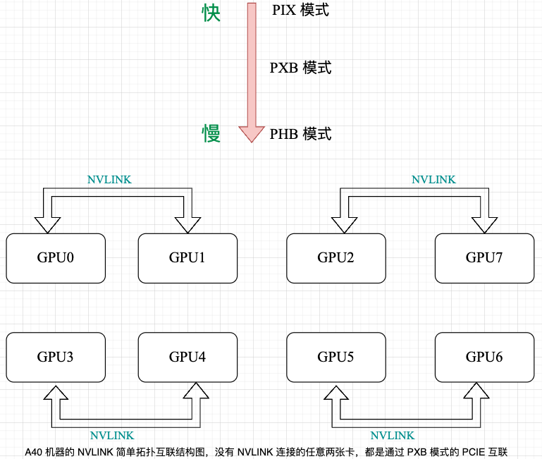

3，备注：集群不稳定的两束证据，尤其是 decode 阶段的 all_duce 通信时间，这个问题很重要！！！如果集群不解决，我们集群的性能数据都得重复测好几次，且结果不稳定。

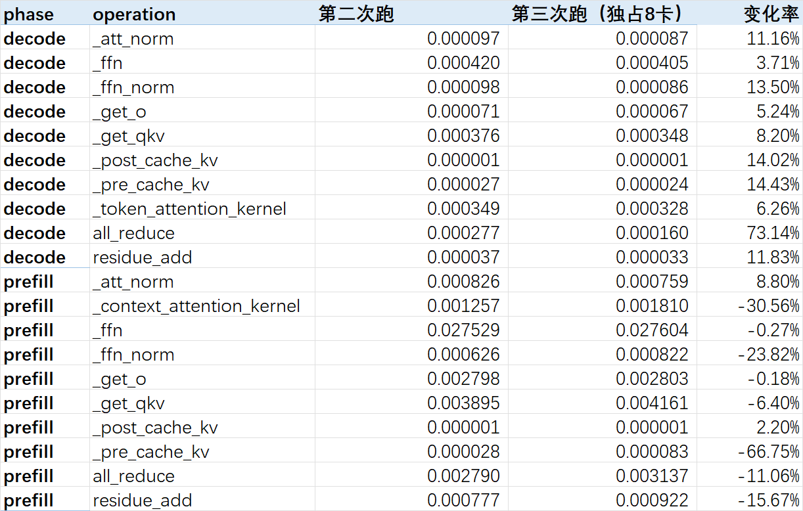

## 一、Prefill/Decode 阶段算子执行时间占比情况

1，将 LLaMA2-70B 模型分别在 4/8 卡 A100-40GB 上部署，设置 batch_size=20, input_length=1024, output_length=1024，统计 prefill/decode 阶段各算子的执行时间占比：

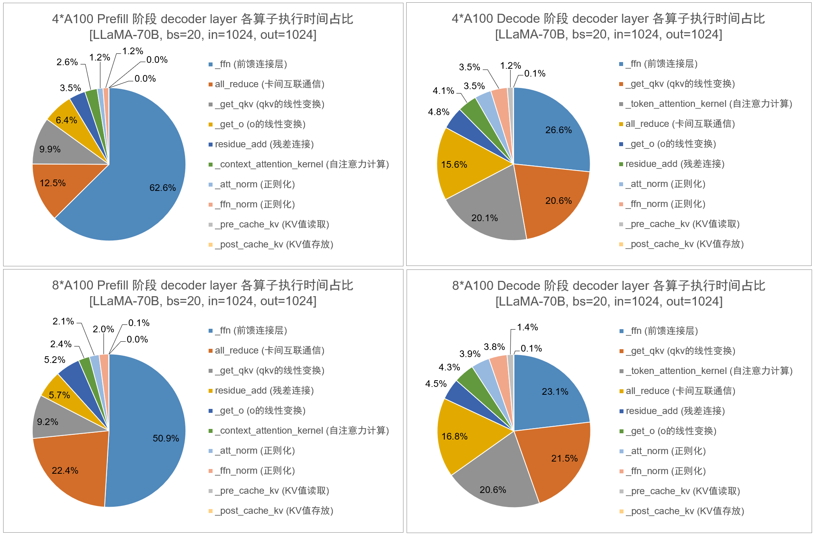

2，将 LLaMA2-70B 模型分别在 4/8 卡 A40-48GB 上部署，设置 batch_size=20, input_length=1024, output_length=1024，统计 prefill/decode 阶段各算子的执行时间占比：

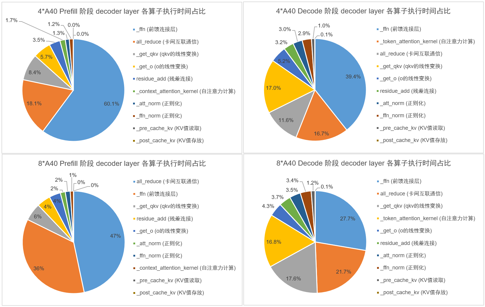

3，将 LLaMA2-7B 模型分别在 4/8 卡 T4-16GB 上部署，设置 batch_size=32, input_length=1024, output_length=1024，统计 prefill/decode 阶段各算子的执行时间占比：

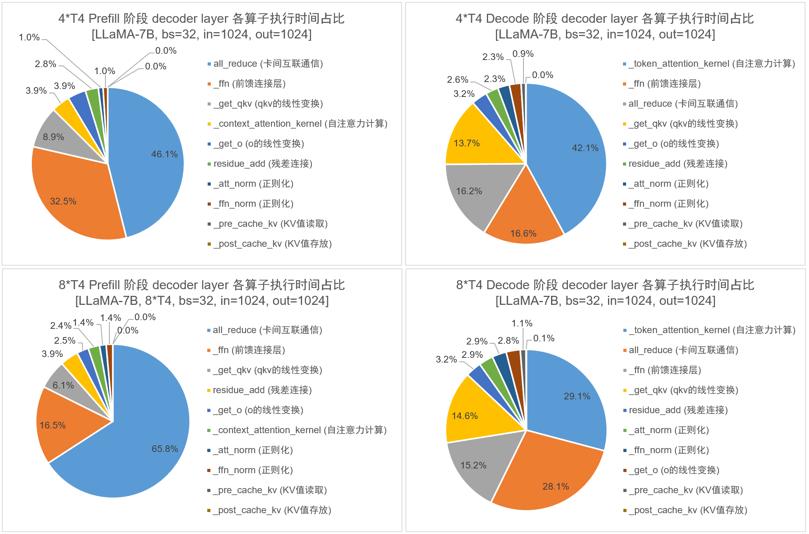

**算子开销实验结论：对于 Prefill 阶段**：

- 如果在使用 NVLink 互联的卡（A100）上部署模型，则无论 4 卡还是 8 卡，都是 ffn 算子的执行时间占比最高；
- 如果在使用 PCIe 互联的卡（T4）上部署模型，则无论 4 卡还是 8 卡，都是 all_reduce 算子的执行时间占比最高；
- 如果在两两一组 NVLink 互联、其余均为 PCIe 互联的卡（A40）上部署模型，4 卡时是 ffn 算子的执行时间占比最高，而使用 8 卡时转变为 all_reduce  算子的执行时间占比最高。

理论 FLOPs：对于 Prefill 阶段的每个 decoder 层的算子计算量：

- MHA (attention) 层，占计算量大头的是线性变换计算 $Q$、$K$、$V$ 和输出投影矩阵 O: $\text{FLOPs} = 3 \times 2sh^2 + 2sh^2 = 8 sh^2$。
- Feed-forward（MLP/FFN）层的计算量分析：$\text{FLOPs} = 16 sh^2$。

## 二、4 卡 A100 和 4 卡 A40 对比

**实验设计**：LLaMA2-70b 模型，输入/输出 tokens 长度都为 1024，batch_size 设为 20，比较 4 卡 A100 和 4 卡 A40 的性能差异。

### 2.2、推理性能分析结果

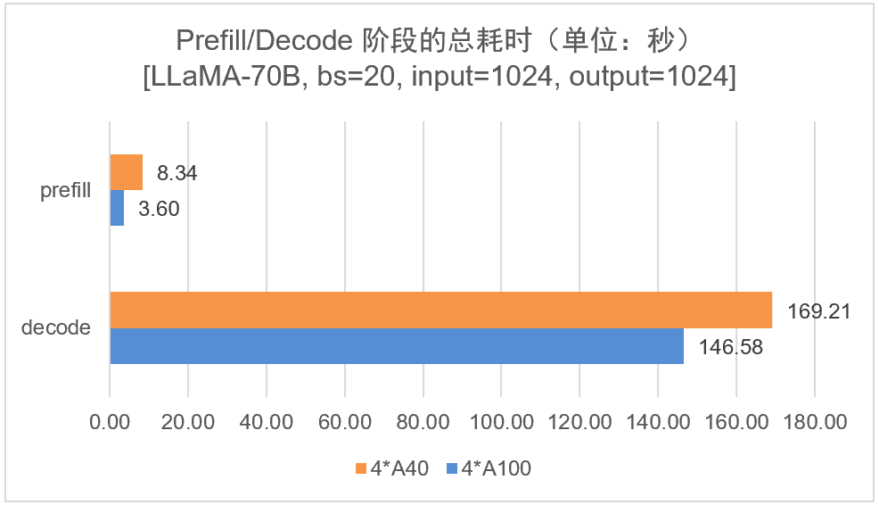

结果分析：在推理层，无论是 prefill 阶段还是 decode 阶段，4 卡 A100 的推理性能都优于 4 卡 A40 的性能。这是符合预期的，因为 A100 在算力、显存带宽、卡间通信方面都优于 A40。

### 2.3、算子性能分析结果

`A100` 和 `A40` 卡的各算子的总耗时情况对比如下图所示，图中也展示了 A100 相对于 A40 的[加速比](https://www.jendow.com.tw/wiki/%E5%8A%A0%E9%80%9F%E6%AF%94)。

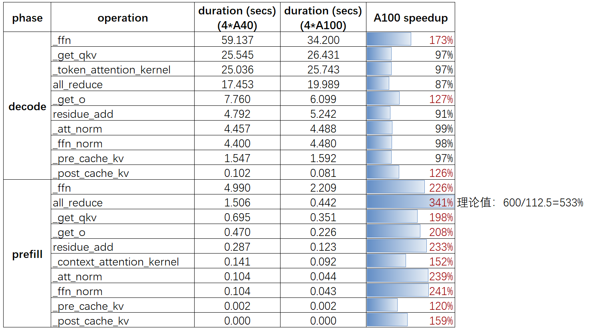

结果分析：

1. prefill 阶段 A100 的 all_reduce【卡间互联通信时间】时间比 a40 快了 300%，理论值的对比是 600/112.5 = 5.33，基本符合理论值对比；decode 阶段 的 all_reduce 时间 4 卡 A100 比 A40 快了 `13%` 左右。
2. prefill 和 decode 阶段 a100 ffn 算子【纯矩阵运算】比 a40 的计算加速比是 $2.2%$ 和 $1.72$，理论上 a100 比 a40 的算力加速比是 $312/150 = 2.08$，实验结果和理论预估几乎一致。

> prefill 阶段 sequence 和 batch_size 都大于 1，算子非访存密集型算子，有利于发挥 Tensor 性能。

## 三、4 卡 A40 和 8 卡 A40 对比

实验设计：llama2-70b 模型，输入/输出 tokens 长度都为 1024，batch_size 设为 20，比较 4 卡 A40 和 8 卡 A40 的性能差异。

### 3.2、推理性能分析结果

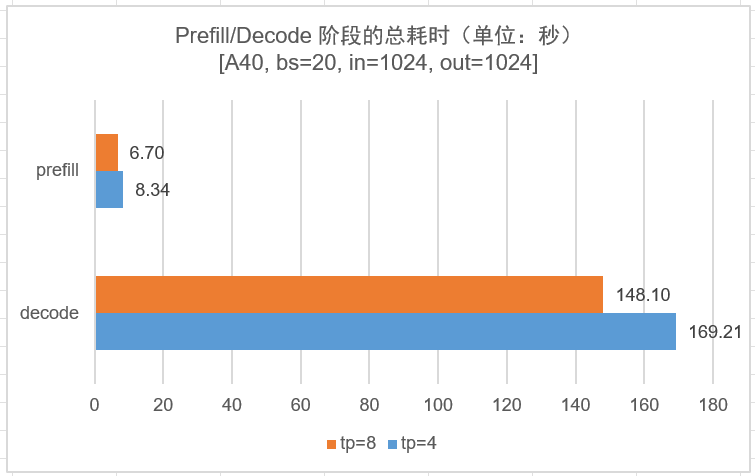

### 3.3、算子性能分析结果

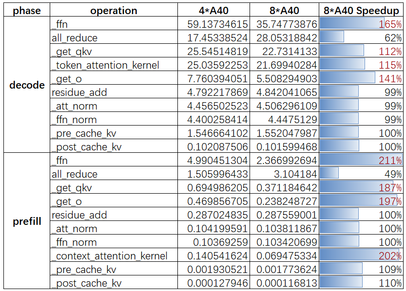

**结果分析**:

无论是 prefill 还是 decode 阶段:
1. 4 卡 A40 的 all_reduce 时间比 8 卡 A40 少了近一半；且 4 卡和 8 卡 A40 的 ffn + all_reduce 时间只差了 `16%` 左右，这直接解释了 8 卡 A40 的最大并发跟 4 卡 A40 的最大并发差不多的原因。

## 四、4 卡 A100 和 8 卡 A100 对比

**实验设计**：LLaMA2-70b 模型，输入/输出 tokens 长度均为 1024，batch_size 设为 20，比较 4 卡 A100 和 8 卡 A100 的性能差异。

### 4.1、推理性能分析结果

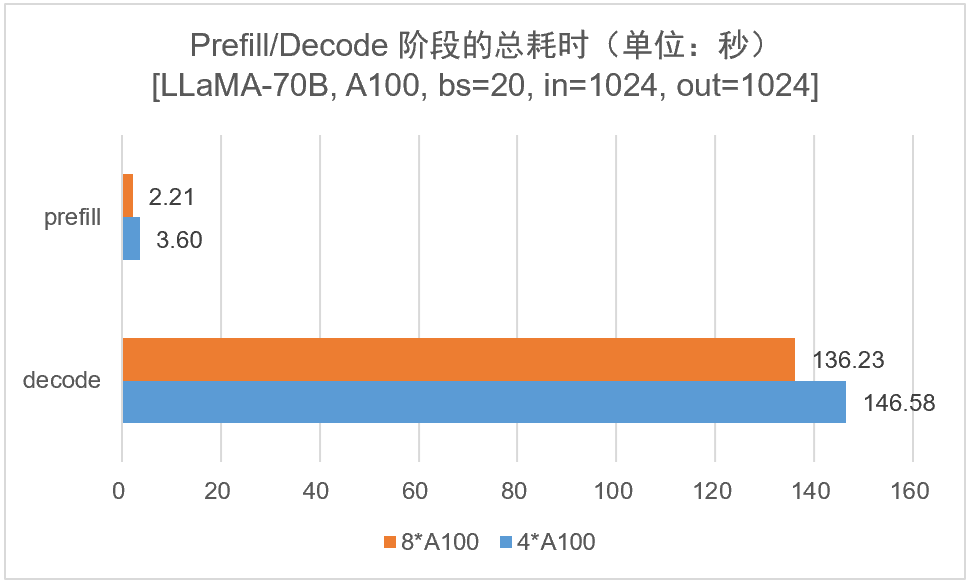

### 4.2、算子性能分析结果

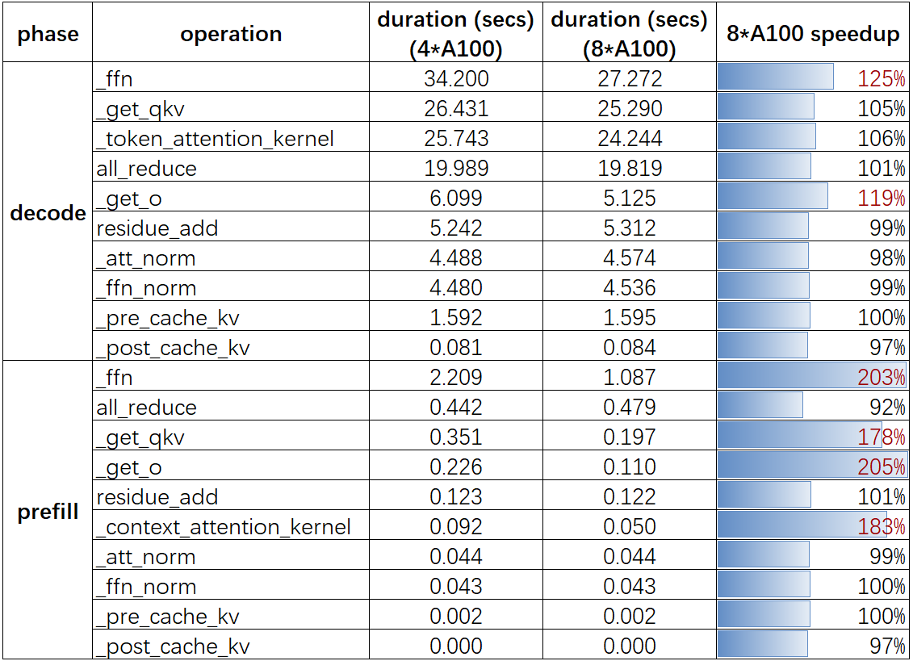

**结果分析**：

1，**对于 A100 卡，增加 TP 数在 prefill 阶段对于大多计算密集型算子上都有近乎线性性能提升**。

具体来说，对于纯计算算子（线性层等），使用 8 张 A100 相对于 4 张 A100 能带来接近 2x 的性能提升，这符合预期，因为 8 卡 A100 的算力大约是 4 卡 A100 的两倍；而 decode  阶段，因为 sequence = 1，所以算术（计算）强度比较低，**性能受内存带宽限制而不是算力限制，即 GPU 算力无法被充分利用**，这也导致 decode 阶段通过增加算力给纯计算算子带来的性能提升并不明显的原因。

奇怪点：8 卡比 4 卡 A100，单个卡的通信和访存变少了，但是为什么 decode 阶段 `all_reduce` 算子没有性能提升？

2，**在 A100 上增加 TP 数不会给 `all_reduce` 算子带来性能提升，甚至略微降低一点点**。

直观上在总通信量相同的情况下，8 卡的通信次数增加，但单次通信量和访存都减少，为什么 `all_recude` 算子没有性能提升呢？分析：对于 `all_reduce` 操作，所有 GPU 都需要同步数据。换句话说，**更多的 `TP` 数 意味着 all_reduce 操作需要更多次的同步，导致每轮同步的耗时增加。且 decode 阶段通信量很少，带宽利用率可能很低**。

## 五、2 卡 A40 上 PCIe 和 NVLink 互联对比

**实验设计**：LLaMA-7B 模型，输入/输出 tokens 长度都为 1024，batch_size 设为 64，比较 A40 使用 NVLink 通信和使用 PCIe 通信的 2 卡的性能差异。

**实验过程**：在 8 卡 A40 机器上，GPU0 和 GPU1 是两两一组的 NVLink 通信，但是 GPU0 和 GPU3 之间没有 NVLink 通信，而是使用 PCIE4.0 通信。因此，分别在 A40 的 0,1 号卡和 0,3 号卡上进行测试。

### 5.1、推理性能分析结果

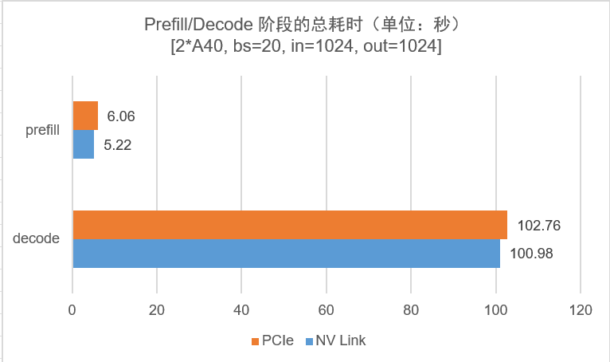

### 5.2、算子性能分析结果

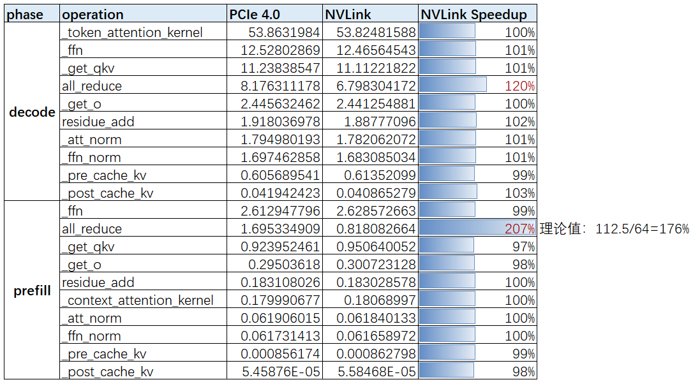

**结果分析**：
- `Prefill` 阶段通信量很大，对于 all_reduce 算子来说，实验中，`NVLink` 互连的卡的 all_reduce 算子时间是 PCIe 的一半，即 A40 的 NVLink 比 PCIe4.0 的实际带宽的加速比为 $2$，而两者的理论带宽加速比是 1.76x。之所以实际加速比超过理论值，是因为，A40 机器的 GPU0 和 GPU3 是 PXB 连接方式【跨过多个 PCIE bridges】，其通信速度略低于 `PIX`  模式，即低于理论的 PCIE4.0 的通信带宽。实验结果和理论预估几乎一致。
- `Decode` 阶段通信量很小，PCIe 互联卡的 all_reduce 时间是 NVLink 互联卡的时间的 1.2 倍，NVLink 通信带来的性能提升不明显。

## 六、总结-lightllm 推理框架性能瓶颈分析实验结论

- **`NVLink` 通信在 `prefill` 阶段有绝对优势！但是在 `decode` 阶段优势不明显，是不是意味着目前的推理框架在 `decode` 阶段的卡间互联通信上有优化空间？**
- 带 `PCIe` 互联的卡（如 T4 卡和 8 张 A40 卡），**prefill 阶段的 all_reduce 时间占比是最大的**。
- `decode` 阶段，因为 `sequence = 1` ，所以算子的算术（计算）强度比较低，即性能受内存带宽限制而不是算力限制（GPU 算力无法被充分利用），所以增加 `TP` 数给算子带来的性能提升并不明显。

> 奇怪点：8 卡比 4 卡 A100，单个卡的通信和访存变少了，但是为什么 decode 阶段 `all_reduce` 算子没有性能提升？

## 参考资料

- [a40](https://www.nvidia.com/en-us/data-center/a40/)
- [a100](https://www.nvidia.com/en-us/data-center/a100/)