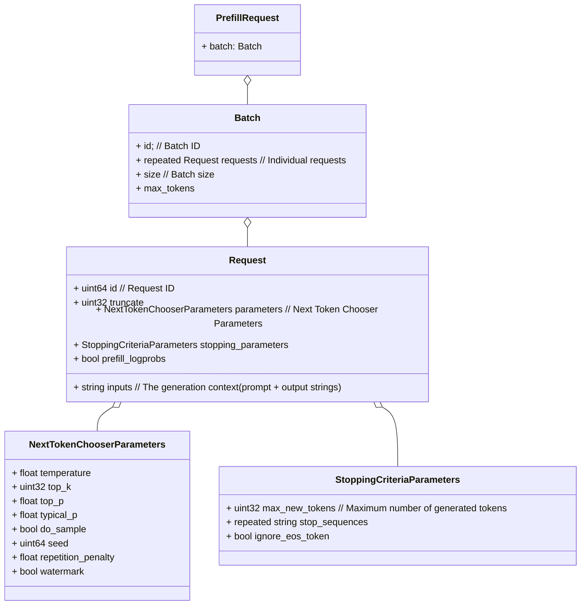

## 一，ProtoBuf 基础

在网络通信和通用数据交换等应用场景中经常使用的技术除了 `JSON` 和 `XML`，另外一个就是 `ProtoBuf`。protocol buffers （ProtoBuf）是一种语言无关、平台无关、可扩展的序列化结构数据的方法，它可用于（数据）通信协议、数据存储等。‘

我们可以通过 ProtoBuf 定义数据结构，然后通过 ProtoBuf 工具生成各种语言版本的数据结构类库，用于操作 ProtoBuf 协议数据

### 1.1，ProtoBuf 例子

使用 gRPC 主要分为三步：

1. 编写 .proto pb 文件，制定通讯协议。
2. 利用对应插件将 .proto pb文件编译成对应语言的代码。
3. 根据生成的代码编写业务代码。

例子，文件名: `response.proto`。通过 ProtoBuf 语法定义数据结构(消息)，这些定义好的数据结构保存在 `.proto` 为后缀的文件中。

```protobuf
// 指定 protobuf 的版本，proto3 是最新的语法版本
syntax = "proto3";

// 定义数据结构，message 你可以想象成java的class，c语言中的struct
message Response {
  string data = 1;   // 定义一个string类型的字段，字段名字为data, 序号为1
  int32 status = 2;   // 定义一个int32类型的字段，字段名字为status, 序号为2
}
```

> 说明：我们通常将 protobuf 消息定义保存在 .proto 为后缀的文件中，字段后面的序号，不能重复，定义了就不能修改，可以理解成字段的唯一 ID。


**消息**（`message`），在 `protobuf` 中指的就是我们要定义的数据结构。在上面的例子中，我们定义了一个消息，名字为 `Response`，它有两个字段，一个是 `data`，一个是 `status`。`data` 字段的类型是 `string`，`status`` 字段的类型是 `int32`。

### 1.2，Protobuf 文件编译

从 .proto 文件生成了什么？

当用 protocol buffer 编译器来运行 .proto 文件时，编译器将生成所选择语言的代码，这些代码可以操作在 .proto 文件中定义的消息类型，包括获取、设置字段值，将消息序列化到一个输出流中，以及从一个输入流中解析消息。

对 Python 来说，Python 编译器为 .proto 文件中的每个消息类型生成一个含有**静态描述符**的模块，该模块与一个元类（`metaclass`）在运行时（`runtime`）被用来创建所需的 Python 数据访问类。


## 二，Python gRPC 基础

`gRPC` 一开始由 google 开发，是一款语言中立、平台中立、开源的远程过程调用(RPC)系统。
> RPC（Remote Procedure Call），即远程过程调用，主要是为了解决在分布式系统中，服务之间的调用问题。

`gRPC` 也是基于以下理念：**定义一个服务，指定其能够被远程调用的方法**（包含参数和返回类型）。在服务端实现这个接口，并运行一个 gRPC 服务器来处理客户端调用。在客户端拥有一个存根能够像服务端一样的方法。

在 gRPC 里的客户端应用，可以像调用本地对象一样直接调用另一台不同的机器上服务端应用的方法，使得我们能够更容易地创建分布式应用和服务。

`gRPC` 默认使用 `protocol buffers`，这是 Google 开源的一种轻便高效的结构化数据存储格式，可以用于结构化数据串行化，或者说序列化。它很适合做**数据存储**或 **RPC 数据交换**格式。

### 2.1，定义服务（Defining the service）

第一步是使用协议缓冲区定义 `gRPC` **服务**以及**方法**的**请求**和**响应**类型，`proto` 文件主要三要素：**服务、方法、消息**。

1，先创建 `.proto` 文件，然后定义一个命名的**服务**：

```protobuf
service RouteGuide {
   // (Method definitions not shown)
}
```

2，接下来，在服务定义内部定义 `rpc` **方法**，指定它们的请求和响应类型。`gRPC` 允许您定义四种类型的服务方法，所有这些方法都在 `RouteGuide` 服务中使用：

```protobuf
// Accepts a stream of RouteNotes sent while a route is being traversed,
// while receiving other RouteNotes (e.g. from other users).
rpc RouteChat(stream RouteNote) returns (stream RouteNote) {}
```

3，`.proto` 文件还应包含服务方法中使用的所有请求和响应类型的协议缓冲**消息类型**定义，例如 `Point` 消息类型：

```protobuf
// Points are represented as latitude-longitude pairs in the E7 representation
// (degrees multiplied by 10**7 and rounded to the nearest integer).
// Latitudes should be in the range +/- 90 degrees and longitude should be in
// the range +/- 180 degrees (inclusive).
message Point {
  int32 latitude = 1;
  int32 longitude = 2;
}
```

### 2.2，生成客户端和服务器代码（Generating client and server code）

前面那节内容，我们知道了如何在 `proto` 文件中**定义服务**，接下来我们需要使用 `gRPC` 的协议编译器 `protoc` 从 `.proto` 服务定义**生成客户端和服务器代码**。

```bash
# First, install the grpcio-tools package:
$ pip install grpcio-tools
# Use the following command to generate the Python code:
$ python -m grpc_tools.protoc -I../../protos --python_out=. --pyi_out=. --grpc_python_out=. ../../protos/route_guide.proto
```

**命令说明**：
- `-I`: proto 协议文件目录
- --python_out 和 --grpc_python_out 生成 python 代码的目录
- 命令最后面的参数是 `proto` 协议文件名

命令执行后生成 route_guide_pb2.py 文件和 route_guide_pb2_grpc.py 文件。
- `route_guide_pb2.py`: 主要包含 proto 文件定义的消息类。
- `route_guide_pb2_grpc.py`: **包含服务端和客户端代码**，比如：
  - `RouteGuideStub`，客户端可以使用它调用 RouteGuide RPCs
  - `RouteGuideServicer`，定义 RouteGuide 服务的实现接口
  - `add_RouteGuideServicer_to_server`: 将 route_guide.proto 中定义的服务的函数 RouteGuideServicer 添加到 grpc.Server

完整的 `route_guide.proto` 文件如下：

```protobuf
syntax = "proto3";

option java_multiple_files = true;
option java_package = "io.grpc.examples.routeguide";
option java_outer_classname = "RouteGuideProto";
option objc_class_prefix = "RTG";

package routeguide;

// Interface exported by the server.
service RouteGuide {
  // A simple RPC.
  //
  // Obtains the feature at a given position.
  //
  // A feature with an empty name is returned if there's no feature at the given
  // position.
  rpc GetFeature(Point) returns (Feature) {}

  // A server-to-client streaming RPC.
  //
  // Obtains the Features available within the given Rectangle.  Results are
  // streamed rather than returned at once (e.g. in a response message with a
  // repeated field), as the rectangle may cover a large area and contain a
  // huge number of features.
  rpc ListFeatures(Rectangle) returns (stream Feature) {}

  // A client-to-server streaming RPC.
  //
  // Accepts a stream of Points on a route being traversed, returning a
  // RouteSummary when traversal is completed.
  rpc RecordRoute(stream Point) returns (RouteSummary) {}

  // A Bidirectional streaming RPC.
  //
  // Accepts a stream of RouteNotes sent while a route is being traversed,
  // while receiving other RouteNotes (e.g. from other users).
  rpc RouteChat(stream RouteNote) returns (stream RouteNote) {}
}

// Points are represented as latitude-longitude pairs in the E7 representation
// (degrees multiplied by 10**7 and rounded to the nearest integer).
// Latitudes should be in the range +/- 90 degrees and longitude should be in
// the range +/- 180 degrees (inclusive).
message Point {
  int32 latitude = 1;
  int32 longitude = 2;
}

// A latitude-longitude rectangle, represented as two diagonally opposite
// points "lo" and "hi".
message Rectangle {
  // One corner of the rectangle.
  Point lo = 1;

  // The other corner of the rectangle.
  Point hi = 2;
}

// A feature names something at a given point.
//
// If a feature could not be named, the name is empty.
message Feature {
  // The name of the feature.
  string name = 1;

  // The point where the feature is detected.
  Point location = 2;
}

// A RouteNote is a message sent while at a given point.
message RouteNote {
  // The location from which the message is sent.
  Point location = 1;

  // The message to be sent.
  string message = 2;
}

// A RouteSummary is received in response to a RecordRoute rpc.
//
// It contains the number of individual points received, the number of
// detected features, and the total distance covered as the cumulative sum of
// the distance between each point.
message RouteSummary {
  // The number of points received.
  int32 point_count = 1;

  // The number of known features passed while traversing the route.
  int32 feature_count = 2;

  // The distance covered in metres.
  int32 distance = 3;

  // The duration of the traversal in seconds.
  int32 elapsed_time = 4;
}
```

### 2.3，创建和实现服务端（Implementing the server）

创建和运行 RouteGuide 服务器可分为两个主要步骤：

1. 根据前面由 `proto` 服务定义生成的**服务程序接口**，开始编写实际可运行的服务接口代码，注意是包含执行服务的**实际**“工作”的函数。
2. 运行一个 `gRPC` 服务器，以侦听客户端的请求并传输响应。

可以在 `examples/python/route_guide/route_guide_server.py` 中找到示例 `RouteGuide` 服务器代码。

route_guide_server.py 有一个 RouteGuideServicer 类，它是生成的类route_guide_pb2_grpc.RouteGuideServicer 的子类：

```python
# RouteGuideServicer provides an implementation of the methods of the RouteGuide service.
class RouteGuideServicer(route_guide_pb2_grpc.RouteGuideServicer):
```


#### 2.3.1，响应流式 RPC（Response-streaming RPC）

```python
def ListFeatures(self, request, context):
    left = min(request.lo.longitude, request.hi.longitude)
    right = max(request.lo.longitude, request.hi.longitude)
    top = max(request.lo.latitude, request.hi.latitude)
    bottom = min(request.lo.latitude, request.hi.latitude)
    for feature in self.db:
        if (
            feature.location.longitude >= left
            and feature.location.longitude <= right
            and feature.location.latitude >= bottom
            and feature.location.latitude <= top
        ):
            yield feature
```

"ListFeatures" 方法是实现 Protocol Buffer 文件中定义的 "ListFeatures" 服务器到客户端流式 RPC 的方法。它接受一个类型为 "Rectangle" 的请求对象和一个上下文对象作为参数。它计算给定矩形的边界框，并迭代 RouteGuide 数据库中的特征。对于每个落在边界框内的特征，它将特征发送给客户端。

在这里，request.lo.longitude 和 request.hi.longitude 分别表示矩形的左下角和右上角的经度。因为经度越往左越小，所以这行代码使用 min() 函数来计算这两个经度值中的最小值，从而得到矩形的左边界。

#### 2.3.2，双向流式 RPC（Bidirectional streaming RPC）

```python
def RouteChat(self, request_iterator, context):
    prev_notes = []
    for new_note in request_iterator:
        for prev_note in prev_notes:
            if prev_note.location == new_note.location:
                yield prev_note
        prev_notes.append(new_note)
```

`RouteChat` 方法在 Protocol Buffer 文件中被定义为一个双向流式 `RPC`。它接受一个流式的请求对象 `RouteNote ` 和一个上下文对象作为参数，并返回一个流式的响应对象 `RouteNote`。

#### 2.3.3，启动服务器（Starting the server）

实现所有 `RouteGuide` 方法后，下一步是启动 `gRPC` 服务器，以便客户端可以实际使用您的服务：

```python
def serve():
    server = grpc.server(futures.ThreadPoolExecutor(max_workers=10))
    route_guide_pb2_grpc.add_RouteGuideServicer_to_server(
        RouteGuideServicer(), server
    )
    server.add_insecure_port("[::]:50051")
    server.start()
    server.wait_for_termination()
```

server.start() 方法是非阻塞的。它会创建一个新的线程来处理请求。调用 server.start() 的线程通常在此期间不需要做其他工作。在这种情况下，您可以调用 server.wait_for_termination() 方法，以清晰地阻塞调用线程，直到服务器终止。

### 2.4，创建和实现客户端（Creating the client）

要调用服务方法，我们首先需要创建一个**存根**（stub）。 我们实例化从 ``.proto`` 生成的 `route_guide_pb2_grpc` 模块中的 `RouteGuideStub` 类。

```python
channel = grpc.insecure_channel('localhost:50051')
stub = route_guide_pb2_grpc.RouteGuideStub(channel)
```

#### 2.4.1，调用服务方法

- 对于返回单个响应的 RPC 方法（“响应-单一”方法），gRPC Python 支持同步（阻塞）和异步（非阻塞）的控制流语义。
- 对于响应流式传输的 RPC 方法，调用会立即返回一个响应值的迭代器。对该迭代器调用 next() 方法会阻塞，直到从迭代器中产生的响应可用为止。

#### 2.4.2，简单 RPC

对于简单 RPC GetFeature 的同步调用几乎与调用本地方法一样简单。RPC 调用会等待服务器响应，然后将返回响应或引发异常：

```python
feature = stub.GetFeature(point)
```

### 2.4，运行客户端和服务器（Running the client and server）

```bash
# Run the server:
$ python route_guide_server.py
# From a different terminal, run the client:
$ python route_guide_client.py
```


## 三，TGI 框架解析

通过 `tree -L 2` 命令，查看 TGI 仓库代码目录结构，核心目录及解析如下所示：

```bash
.
├── benchmark
│   ├── Cargo.toml # Rust 项目的配置文件，用于描述项目的元信息、依赖关系和其他配置。
│   ├── README.md  # benchmark 目录安装、使用说明
│   └── src # benchmark 测试源码文件
├── Cargo.lock # 用于锁定项目的依赖关系及其确切的版本。
├── Cargo.toml # Rust 项目的配置文件
├── clients # python 版本的客户端接口定义及测试程序
├── integration-tests # 集成测试
│   ├── conftest.py # 配置测试接口
├── launcher # 服务端启用模块
│   ├── build.rs
│   ├── Cargo.toml
│   └── src
├── proto # ProtoBuf 定义文件
│   └── generate.proto
├── router # 请求路由管理
│   ├── build.rs
│   ├── Cargo.toml
│   ├── client # grpc 客户端代码
│   ├── grpc-metadata
│   ├── README.md # 说明文档
│   └── src # 源代码
├── server # llm服务和llm推理衔接模块
│   ├── tests # 单元测试目
│   ├── text_generation_server # 用于文本生成推理的 Python gRPC 服务器，具体包括 llm 模型结构代码
```

### 3.1，grpc 接口及数据结构类图

```protobuf
syntax = "proto3";

package generate.v1;

//定义服务接口
service TextGenerationService {
    /// Model Info
    rpc Info (InfoRequest) returns (InfoResponse) {}
    /// Service discovery
    rpc ServiceDiscovery (ServiceDiscoveryRequest) returns (ServiceDiscoveryResponse) {}
    /// Empties batch cache
    rpc ClearCache (ClearCacheRequest) returns (ClearCacheResponse);
    /// Remove requests from a cached batch
    rpc FilterBatch (FilterBatchRequest) returns (FilterBatchResponse);
    /// Prefill batch and decode first token
    rpc Prefill (PrefillRequest) returns (PrefillResponse);
    /// Decode token for a list of prefilled batches
    rpc Decode (DecodeRequest) returns (DecodeResponse);
    /// Health check
    rpc Health (HealthRequest) returns (HealthResponse);
    /// Text ntokens
    rpc Tokens (TokensRequest) returns (TokensResponse);
}

// 请求的参数
message TokensRequest {
    string text = 1;
}

//返回的对象
message TokensResponse {
    int32 ntokens = 1;
}

message HealthRequest {}
message HealthResponse {}

/// Empty request
message InfoRequest {}

message InfoResponse {
    bool requires_padding = 1;
    string dtype = 2;
    string device_type = 3;
}

/// Empty request
message ServiceDiscoveryRequest {}

message ServiceDiscoveryResponse {
    /// Other shards urls
    repeated string urls = 1;
}

message ClearCacheRequest {
    /// Optional batch id
    optional uint64 id = 1;
}

/// Empty response
message ClearCacheResponse {}

message NextTokenChooserParameters {
    /// exponential scaling output probability distribution
    float temperature = 1;
    /// restricting to the k highest probability elements
    uint32 top_k = 2;
    /// restricting to top tokens summing to prob_cut_off <= prob_cut_off
    float top_p = 3;
    /// restricting to top tokens summing to prob_cut_off <= prob_cut_off
    float typical_p = 4;
    /// apply sampling on the logits
    bool do_sample = 5;
    /// random seed for sampling
    uint64 seed = 6;
    /// repetition penalty
    float repetition_penalty = 7;
    /// token watermarking using "A Watermark for Large Language Models"
    bool watermark = 8;
}

message StoppingCriteriaParameters {
    /// Maximum number of generated tokens
    uint32 max_new_tokens = 1;
    /// Optional stopping sequences
    repeated string stop_sequences = 2;
    /// Ignore end of sequence token
    /// used for benchmarking
    bool ignore_eos_token = 3;
}

message Request {
    /// Request ID
    uint64 id = 1;
    /// The generation context
    string inputs = 2;
    /// Context truncation
    uint32 truncate = 3;
    /// Next Token Chooser Parameters
    NextTokenChooserParameters parameters = 4;
    /// Stopping Criteria Parameters
    StoppingCriteriaParameters stopping_parameters = 5;
    /// Return prefill logprobs
    bool prefill_logprobs = 6;
}

message Batch {
    /// Batch ID
    uint64 id = 1;
    /// Individual requests
    repeated Request requests = 2;
    /// Batch size (==len(requests))
    uint32 size = 3;
    /// Maximum number of tokens this batch will grow to
    uint32 max_tokens = 4;
}

message CachedBatch {
    /// Batch ID
    uint64 id = 1;
    /// Individual requests ids
    repeated uint64 request_ids = 2;
    /// Batch size (==len(requests))
    uint32 size = 3;
    /// Maximum number of tokens this batch will grow to
    uint32 max_tokens = 4;
}

enum FinishReason {
    FINISH_REASON_LENGTH = 0;
    FINISH_REASON_EOS_TOKEN = 1;
    FINISH_REASON_STOP_SEQUENCE = 2;
}

message GeneratedText {
    /// Output
    string text = 1;
    /// Number of generated tokens
    uint32 generated_tokens = 2;
    /// Finish reason
    FinishReason finish_reason = 3;
    /// Seed
    optional uint64 seed = 4;
    /// Number of prompt tokens
    uint32 prompt_tokens = 5;
}

message PrefillTokens {
    /// Prefill Token IDs
    repeated uint32 ids = 1;
    /// Prefill Logprobs
    repeated float logprobs = 2;
    /// Prefill tokens
    repeated string texts = 3;
}

message Generation {
    /// Request ID
    uint64 request_id = 1;
    /// Prefill tokens (optional)
    PrefillTokens prefill_tokens = 2;
    /// Token ID
    uint32 token_id = 3;
    /// Logprob
    float token_logprob = 4;
    /// Text
    string token_text = 5;
    /// Is it a special token
    bool token_is_special = 6;
    /// Complete generated text
    optional GeneratedText generated_text = 7;
}

message FilterBatchRequest {
    /// Batch ID
    uint64 batch_id = 1;
    /// Requests to keep
    repeated uint64 request_ids = 2;
}

message FilterBatchResponse {
    /// Filtered Batch (cached)
    CachedBatch batch = 1;
}


message PrefillRequest {
    /// Batch
    Batch batch = 1;
}

message PrefillResponse {
    /// Generation
    repeated Generation generations = 1;
    /// Next batch (cached)
    optional CachedBatch batch = 2;
}

message DecodeRequest {
    /// Cached batches
    /// repeated 关键字指示这是一个重复字段，即可以包含多个 CachedBatch。
    repeated CachedBatch batches = 1;
}

message DecodeResponse {
    /// Decodes
    repeated Generation generations = 1;
    /// Next batch (cached)
    optional CachedBatch batch = 2;
}
```

`TextGenerationServiceServicer` 类的核心接口（主要的 `rpc` 方法）及功能如下所示:

- `tokens` ：用于获取给定文本的 `token` 数量。
- `clear_cache` ：用于清除过去的生成缓存。
- `filter_batch`： 用于过滤缓存的批次（动态 batch 算法中实现）。
- `prefill` ：用于为给定的批次中的每个请求生成一个 `token`。
- `decode` ：用于为给定的缓存批次中的每个请求生成一个 `token`。

主要的消息类型：

- TokensRequest、TokensResponse；
- HealthRequest、HealthResponse；
- ClearCacheRequest、ClearCacheResponse；
- NextTokenChooserParameters、StoppingCriteriaParameters；
- Batch、Request、CachedBatch；
- GeneratedText；
- PrefillTokens；
- Generation；
- FilterBatchRequest、FilterBatchResponse；
- PrefillRequest、PrefillResponse；DecodeRequest、DecodeResponse；

1，`uml` 类图及相关数据结构





2，TextGenerationService：

这是一个静态类，包含了一系列静态方法，用于创建 gRPC 请求并发送给 gRPC 服务端。这些方法的通用签名为：

```
def <methodName>(request, target, options=(), channel_credentials=None, call_credentials=None, insecure=False, compression=None, wait_for_ready=None, timeout=None, metadata=None):
```

- `<methodName>`: RPC 方法名，如 Info、ServiceDiscovery、ClearCache、FilterBatch、Prefill、Decode、Health 和 Tokens。
- **`request`**: 作为 gRPC 请求的参数。
- **`target`**: RPC 方法的目标地址。
- `options`: 选项参数，默认为空元组。
- `channel_credentials`: 通道凭证，默认为 None。
- `call_credentials`: 调用凭证，默认为 None。
- `insecure`: 是否不安全，默认为 False。
- `compression`: 压缩方式，默认为 None。
- `wait_for_ready`: 等待服务就绪，默认为 None。
- `timeout`: 超时时间，默认为 None。
- `metadata`: 元数据，默认为 None。

3，python 版本的 `grpc` 接口如何和真正的模型推理接口衔接起来。

`server.py`: Prefill(*self*, *request*, *context*) 函数内部调用:

```python
# batch 是模型实例
batch = self.model.batch_type.from_pb(
            request.batch, self.model.tokenizer, self.model.dtype, self.model.device
        )

class Model(ABC):
# 一个抽象基类 Model，抽象方法有 batch_type()、generate_token()、decode_token()
```

### 3.2，router 模块

`router` 目录文件树如下:

```bash
.
├── build.rs
├── Cargo.toml
├── client
│   ├── build.rs
│   ├── Cargo.toml
│   └── src
│       ├── client.rs # 定义了一个 TGI 的 gRPC 客户端，定义相关接口。
│       ├── lib.rs
│       ├── pb
│       └── sharded_client.rs
├── README.md # 说明文档
└── src # router 模块实现源代码
    ├── health.rs
    ├── infer.rs # rpc 请求服务处理代码（具体是多个请求如何组 batch）
    ├── lib.rs
    ├── main.rs
    ├── queue.rs
    ├── server.rs
    └── validation.rs
```

`TGI ` 框架定义的 `api` 接口如下所示:


`api` 接口提供了在线的 [swagger-ui 页面](https://huggingface.github.io/text-generation-inference/#/)（utoipa 库），`server.rs` 文件定义了 `text-generation-inference` REST `API`。

### 3.3，server 模块

```bash
── Makefile # server 模块编译脚本
├── Makefile-flash-att # flash attention 算法编译脚本
├── Makefile-transformers # transformers 库安装脚本
├── pyproject.toml # 用于描述项目的元数据、依赖项以及构建配置。
├── README.md # 模块说明文档
├── requirements.txt # 记录了当前程序的所有依赖包及其精确版本号。
├── tests # 单元测试目录
├── text_generation_server # 用于文本生成推理的 Python gRPC 服务器，具体包括 llm 模型结构代码
│   ├── cache.py
│   ├── cli.py
│   ├── interceptor.py
│   ├── models # 模型结构实现目录
│   │   ├── bloom.py
│   │   ├── light_bloom.py
│   │   ├── light_llama.py
│   │   ├── light_llm.py
│   ├── pb # 从 .proto 服务定义生成客户端和服务器代码。
│   │   ├── generate_pb2_grpc.py # 包含服务端和客户端代码
│   │   ├── generate_pb2.py # 主要包含 proto 文件定义的消息类。
│   ├── server.py # 服务端接口实现代码，注意是包含执行服务的实际“工作”的函数。
│   ├── tracing.py # 客户端运行实例代码
│   └── utils # 一些接口定义代码
└── transformers # transformers 库代码
```

`server` 模块解析：

`Makefile` 脚本中通过下述命令，**使用 protoc 和相应的插件编译生成 python 版本的接口代码**。

```bash
python -m grpc_tools.protoc -I../proto --python_out=text_generation_server/pb \
		--grpc_python_out=text_generation_server/pb --mypy_out=text_generation_server/pb ../proto/generate.proto
```

1，`-I../proto` 表示 `proto` 协议文件目录（text-generation-inference/proto/generate.proto），客户端和服务器的通信接口正是通过 proto 文件协定的，该协议文件作用是定义好**服务（service）接口**，以及请求参数和相应结果的数据结构。

2，`--python_out=text_generation_server/pb` ，指定生成 `py` 文件的输出路径，生成了 generate_pb2_grpc.py 和 generate_pb2.py 文件。

3，grpc 客户端和服务器端代码文件介绍。

- `generate_pb2.py`: 主要包含 `proto` 文件定义的消息类。
- `generate_pb2_grpc.py`: **包含服务端和客户端代码**，主要定义的抽象基类
  - `TextGenerationServiceStub`：**客户端可以使用它来调用 RouteGuide RPCs**。
  - `TextGenerationServiceServicer`、TextGenerationService：定义 `TGI` 服务的实现接口
  - `add_TextGenerationServiceServicer_to_server`: 将 generate.proto 中定义的服务函数 TextGenerationServicer 添加到 `grpc.Server`。

4，创建和运行 `TextGeneration` 服务可以分为两个部分：

- 实现服务定义的生成的服务接口：实现服务的实际“工作”的函数。
- 运行一个 gRPC 服务器，监听来自客户端的请求并传输服务的响应。

以上两个功能的实现均在 `server.py` 文件中：

```python
# TextGenerationService 类是 gRPC 服务的主要实现，实现了 gRPC 定义的各种 RPC 方法，如 Info、Health、ServiceDiscovery、ClearCache、FilterBatch、Prefill、Decode 和 Tokens。
class TextGenerationService(generate_pb2_grpc.TextGenerationServiceServicer):
    # 该类的构造函数 __init__ 接受模型对象 model、缓存对象 cache 和服务器 URL 列表 server_urls 作为参数，并进行初始化。
  	def __init__(self, model: Model, cache: Cache, server_urls: List[str]):

    async def Prefill(self, request, context):
        batch = self.model.batch_type.from_pb(
            request.batch, self.model.tokenizer, self.model.dtype, self.model.device
        )

        generations, next_batch = self.model.generate_token(batch)
        self.cache.set(next_batch)

        return generate_pb2.PrefillResponse(
            generations=[generation.to_pb() for generation in generations],
            batch=next_batch.to_pb() if next_batch else None,
        )
# serve 函数用于启动 gRPC 服务器，并绑定到特定的地址。
def serve(
    model_id: str,
    revision: Optional[str],
    sharded: bool,
    quantize: Optional[str],
    trust_remote_code: bool,
    uds_path: Path,
):
```

5，这里的 self.model 是 `text_generation_server/models/model.py` 定义的抽象基类 `class Model(ABC)` 的实例，主要抽象方法： generate_token 和 decode_token。`text_generation_server/models/__init__.py` 文件中的 get_model 函数获取模型实例，器函数定义如下所示:

```python
def get_model(
    model_id: str,
    revision: Optional[str],
    sharded: bool,
    quantize: Optional[str],
    trust_remote_code: bool,
) -> Model:
  
		if model_type == "llama":
        if LIGHTLLM:
            return LightLLM(
                model_id,
                revision,
                quantize=quantize,
                trust_remote_code=trust_remote_code,
                model_type='llama'
            )
        if sharded:
            if FLASH_ATTENTION:
                return FlashLlamaSharded(
                    model_id,
                    revision,
                    quantize=quantize,
                    trust_remote_code=trust_remote_code,
                )
            raise NotImplementedError(FLASH_ATT_ERROR_MESSAGE.format(f"Sharded Llama"))
        else:
            llama_cls = FlashLlama if FLASH_ATTENTION else CausalLM
            return llama_cls(
                model_id,
                revision,
                quantize=quantize,
                trust_remote_code=trust_remote_code,
            )
```

6，自定义的 llama 模型结构定义实现在 `lightllm` 框架中。`LightLLM` 类在 `models/light_llm.py` 文件中定义。

`LightLLM` 调用 `LlamaTpPartModel` 类（lightllm.models.llama.model ），继承 `TpPartBaseModel` 类（`lightllm/common/basemodel/basemodel.py`），主要成员函数有：forward()、_prefill()、_decode()、_context_forward()、_token_forward()。

`_context_forward()` 函数实现如下所示：

```python
# 变量或函数以单个前导下划线命名，表示它们是内部实现的一部分，不应该被外部直接访问。但这只是一种约定，Python 不会强制限制访问。
def _context_forward(self, input_ids, infer_state: InferStateInfo):
        cuda_input_ids = input_ids
        input_embs = self.pre_infer.context_forward(cuda_input_ids, infer_state, self.pre_post_weight)
        for i in range(self.layers_num):
            input_embs = self.layers_infer[i].context_forward(input_embs, infer_state, self.trans_layers_weight[i])
        predict_logics = self.post_infer.token_forward(input_embs, infer_state, self.pre_post_weight, return_logics=True)
        return predict_logics
```

Lightly 框架定义的模型结构，主要分为三 layer，每种 layer 都会定义加载权重函数 `load_hf_weights`。

- LlamaPostLayerInfer，继承 PostLayerInferTpl。
- LlamaPreLayerInfer，继承 PreLayerInferTpl。
- LlamaTransformerLayerInfer，继承 TransformerLayerInferTpl，继承 TransformerLayerInfer。

模型推理的顺序：pre_infer.token_forward() -> *self*.layers_infer[i].token_forward() ->*self*.post_infer.token_forward()。

TransformerLayerInferTpl 类的主要函数定义如下：

```python
class TransformerLayerInferTpl(TransformerLayerInfer):
    """
    """
    def __init__(self, layer_num, tp_rank, world_size, network_config, mode):
        super().__init__(layer_num, tp_rank, world_size, network_config, mode)
        # need to set by subclass
        self.eps_ = 1e-5 
        self.tp_q_head_num_ = -1
        self.tp_k_head_num_ = -1
        self.tp_v_head_num_ = -1
        self.tp_o_head_num_ = -1
        self.head_dim_ = -1
        self.embed_dim_ = -1
        return
   def token_forward(self, input_embdings, infer_state: InferStateInfo, layer_weight):
        self._token_attention(input_embdings,
                                    infer_state,
                                    layer_weight=layer_weight)
        self._token_ffn(input_embdings, infer_state, layer_weight)
        return input_embdings
      
    # this impl dont to use @mark_cost_time
   def _token_attention(self, input_embding, infer_state: InferStateInfo, layer_weight):
        input1 = self._att_norm(input_embding, infer_state, layer_weight)
        cache_k, cache_v = self._pre_cache_kv(infer_state, layer_weight)
        q = self._get_qkv(input1, cache_k, cache_v, infer_state, layer_weight)
        input1 = None
        self._post_cache_kv(cache_k, cache_v, infer_state, layer_weight)
        o = self._token_attention_kernel(q, infer_state, layer_weight)
        q = None
        o = self._get_o(o, infer_state, layer_weight)
        # 如果 world_size_ 大于 1（即在分布式环境中），使用 dist.all_reduce 对输出 o 进行求和操作。
        if self.world_size_ > 1:
            dist.all_reduce(o, op=dist.ReduceOp.SUM, async_op=False)
        input_embding.add_(o.view(-1, self.embed_dim_))
        return
```

## 参考资料

1. [ProtoBuf 快速入门教程](https://www.tizi365.com/archives/367.html)
2. [grpc-Basics tutorial](https://grpc.io/docs/languages/python/basics/#client)