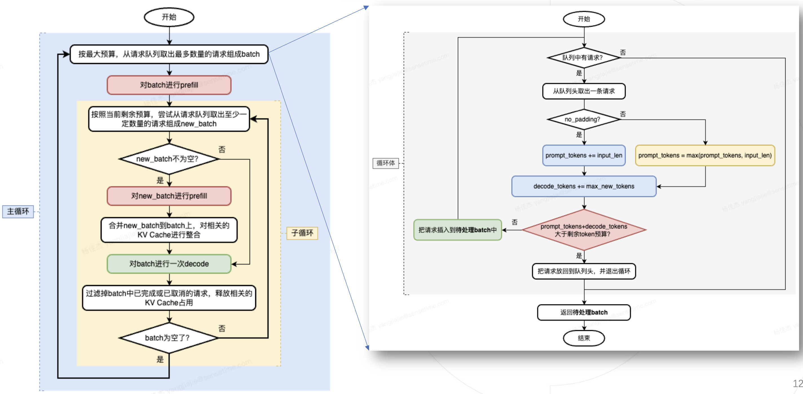
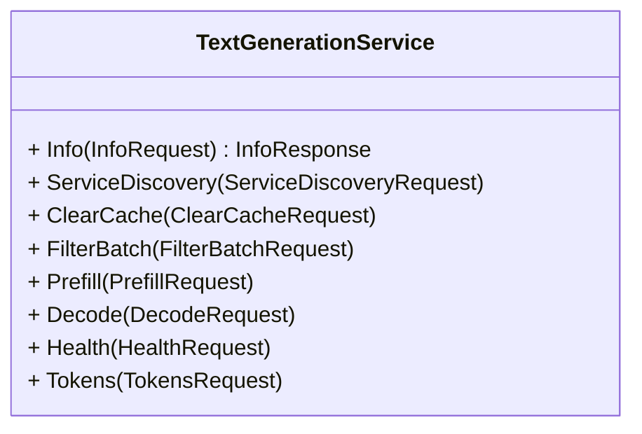
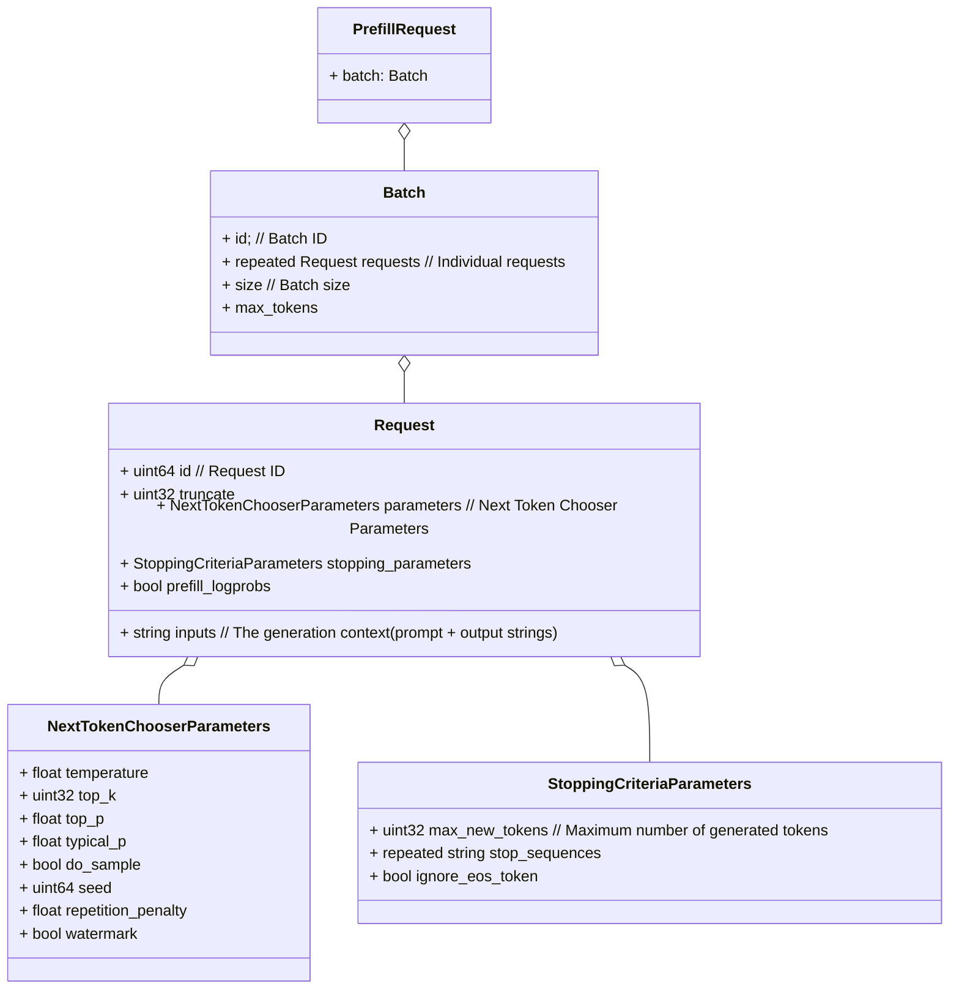
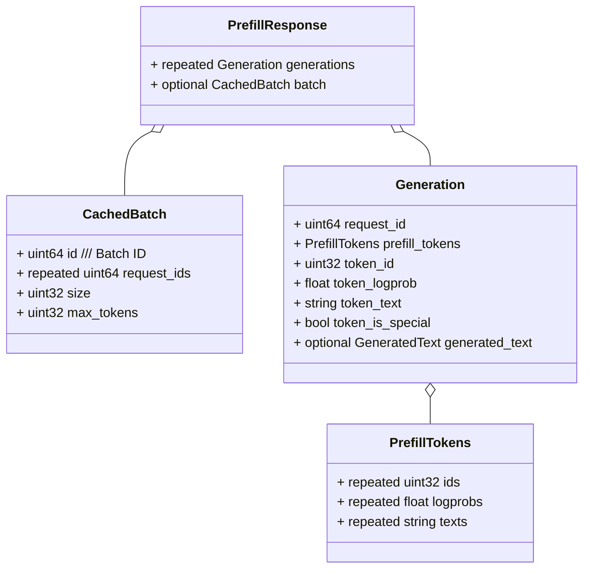
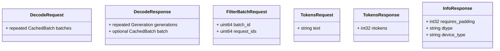
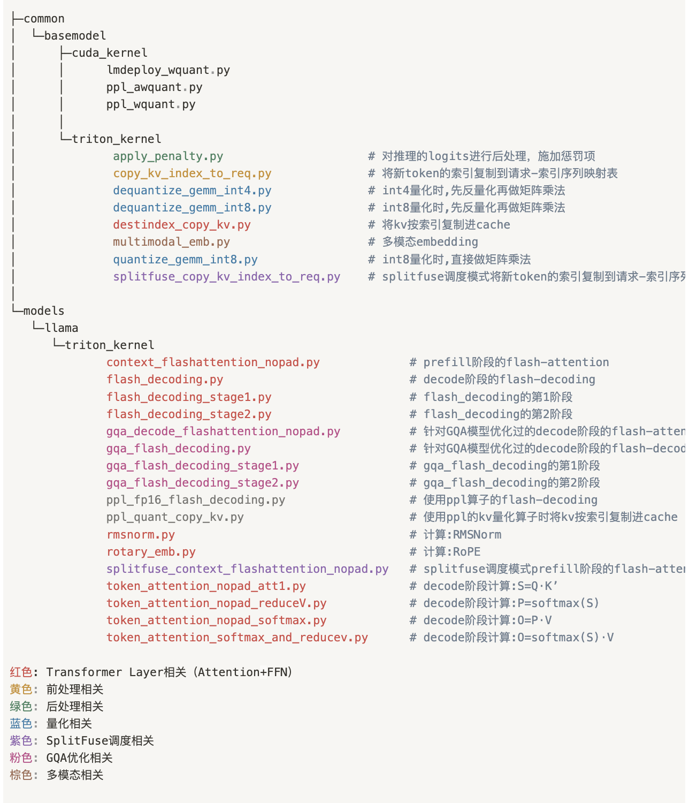

- [一，TGI 框架概述](#一tgi-框架概述)
  - [1.1，TGI 框架特点](#11tgi-框架特点)
  - [1.2，TGI 框架目录结构](#12tgi-框架目录结构)
  - [1.3，TGI 框架架构](#13tgi-框架架构)
  - [1.2，grpc 接口及数据结构类图](#12grpc-接口及数据结构类图)
- [二，launcher 启动器](#二launcher-启动器)
- [三，router 模块](#三router-模块)
- [四，server 模块](#四server-模块)
  - [4.1, grpc 子模块](#41-grpc-子模块)
  - [4.2, models 子模块](#42-models-子模块)
  - [4.3，utils 子模块](#43utils-子模块)
- [五，和壁仞推理库的适配](#五和壁仞推理库的适配)
- [参考资料](#参考资料)

## 一，TGI 框架概述

### 1.1，TGI 框架特点

Text-Generation-Inferenc（简称 TGI）框架特点：

- 由 huggingface (大模型时代的 github)官方出品；
- 服务调度层由 rust 编写(高性能)，模型推理层由 python 编写(调用 transformers 库，兼容性强)；
- 实现了**连续批处理调度**功能；
- 完善的监控体系；
- 工业级的LLM推理服务；
- 基本上 transformers 库(大模型时代的 pytorch 或 opencv)能跑的大模型，它都能进行部署和服务化；
- 框架扩展性强，推理层可定制大模型推理逻辑。

### 1.2，TGI 框架目录结构

通过 `tree -L 2` 命令，查看 TGI 仓库代码目录结构，核心目录及解析如下所示：

```bash
.
├── benchmark
│   ├── Cargo.toml # Rust 项目的配置文件，用于描述项目的元信息、依赖关系和其他配置。
│   ├── README.md  # benchmark 目录安装、使用说明
│   └── src # benchmark 测试源码文件
├── Cargo.lock # 用于锁定项目的依赖关系及其确切的版本。
├── Cargo.toml # Rust 项目的配置文件
├── clients # python 版本的客户端接口定义及测试程序
├── integration-tests # 集成测试
│   ├── conftest.py # 配置测试接口
├── launcher # 服务端启用模块
│   ├── build.rs
│   ├── Cargo.toml # 项目描述文件
│   └── src # 源代码目录
├── proto # ProtoBuf 定义文件
│   └── generate.proto
├── router # 请求路由管理
│   ├── build.rs
│   ├── Cargo.toml
│   ├── client # grpc 客户端代码
│   ├── grpc-metadata
│   ├── README.md # 说明文档
│   └── src # 源代码
├── server # llm服务和llm推理衔接模块
│   ├── tests # 单元测试目
│   ├── text_generation_server # 用于文本生成推理的 Python gRPC 服务器，具体包括 llm 模型结构代码
```

### 1.3，TGI 框架架构

TGI 框架架构图如下所示:


`TGI` 框架主要由三部分组成：

- launcher
- router
- server

Launcher、Router 和 Server（Python gRPC服务）都是服务的组成部分，它们各自承担不同的职责，共同提供一个完整的文本生成推理服务。以下是它们之间的关系：

- Launcher：这是服务的启动器，它负责启动和运行服务。它可能会启动 Router，并设置好所有的路由规则。然后，它会监听指定的地址和端口，等待并处理来自客户端的连接。当接收到一个连接时，它会将连接转发给Router 进行处理。
- Router：这是服务的中间件，它的主要职责是路由和调度请求。当客户端发送一个请求时，Router 会接收这个请求，然后根据请求的内容和当前的系统状态，决定将请求路由到哪个处理器进行处理。**这个处理器可能是 Server 中的一个 gRPC 方法**。Router 的目的是有效地管理和调度系统资源，提高系统的并发处理能力和响应速度。
- Server（Python gRPC 服务）：这是服务的核心部分，它实现了文本生成推理的主要逻辑。它提供了一些 gRPC 方法，如 Info、Health、ServiceDiscovery、ClearCache、FilterBatch、Prefill 和 Decode，这些方法用于处理客户端的请求，执行文本生成的推理任务，并返回结果。这个服务可能运行在一个单独的服务器上，独立于 `Launcher` 和 `Router`。

### 1.4，tgi 起服务的影响的性能参数

1，`max_batch_prefill_tokens`

参数意义，限制了 组 `batch` 的最大 `batch_size` 一定程度上可以避免 `first_token_latency` 过大，对并发性能影响不大。

默认值是 4096，参数限制：

- 如果 max_batch_total_tokens 参数设置了，则 `max_batch_prefill_tokens `必须小于 max_batch_total_tokens。
- 必须大于 max_input_length。

2，`waiting_served_ratio`：决定新加入请求 batch 的排队时间下限，决定 min_size 大小。

其意义是等待的请求与正在运行批处理请求的比率，默认值是 1.2，**意味着当有 12 个请求在等待，而当当前批次中只剩下 10 个请求时，我们会检查是否可以将这 12 个等待查询纳入到批处理策略中**（看剩余 `tokens` 预算），如果可以，批处理就会发生，通过 `prefill` 运行延迟了这 10 个正在运行的查询。此设置仅在批次中有空间，如 `max_batch_total_tokens` 定义的那样时才会应用。

注意，组 batch 有**最小批次大小**（min_size）要求，min_size 的值会动态变化且跟 waiting_served_ratio 和 waiting_tokens 参数强相关。具体赋值方法如下所示：

```rust
let min_size = if waiting_tokens >= max_waiting_tokens {
    // If we didn't onboard any new requests since >= max_waiting_tokens, we try
    // to add a new batch even though its size might be small
    None
} else {
    // Minimum batch size
    Some((batch_size as f32 * waiting_served_ratio).floor() as usize)
};
```

3，`max_waiting_tokens`：决定请求排队时间的上限。

批处理过程中，没 `decode` 一次，waiting_tokens += 1，子循环中会判断 `waiting_tokens` 是否大于或等于 `max_waiting_tokens`，主要**用于确定是否已经等待了足够长的时间，没有新的请求加入队列**。设置大了会提升用户的体验感，即 `decode` 过程没有频繁被中断，设置了小了可以减少请求的排队时间。

`decode_latency` 时间都是在 30-100 ms 之间，假设 `max_waiting_tokens` 设置成 8，因为 `decode` 过程耽误的时间最多也是 800 ms，那还不如让 decode 过程多做几轮（比如 20），释放多一点的 tokens，假设实际组的 `batch_size` 是 30，那就能释放掉 600 个 tokens， decode 过程耽误的时间是 2000ms，好像也能接受。

之前的性能测试结果的规律是，70b 模型，4 张 A40 卡，并发数小于40时，排队时间和实际 prefill 实际对半分，而当并发数目越大时，排队时间越长，远超实际 `prefill` 时间。

4，性能参数总结

总结：max_waiting_tokens 参数和 waiting_served_ratio 互相影响新加入 batch 的大小，max_waiting_tokens 越大，释放的 tokens 越多，能组的实际 batch 越大，排队的请求数会减少。

而 waiting_served_ratio 则影响在 decode 次数没有超过 max_waiting_tokens 的情况下，如果还有符合  `min_size`  大小的请求 `batch`剩余 tokens 预算，则从请求队列中取出 `min_size`  大小的请求 `batch`，这里的 min_size = 推理中的 batch_size * waiting_served_ratio；如果预算不够，则继续做 `decode` 过程。

**为了提高性能，应该尽可能让实际推理的 batch_size 尽可能大**，我的想法是增大 waiting_served_ratio 和 max_waiting_tokens 参数，避免频繁的对新 batch 进行 prefill。

- 排队时间过长的根本原因是没有足够的 tokens 预算去做 prefill。
- 性能瓶颈分析实验中，发现 prefill 过程中的实际 batch_size 偏小，不利于发挥出算力。



#### 1.4.1，不同性能参数对实际推理过程 prefill/decode 过程的 batch_size 大小影响

```bash
--model-id /data/models/Antelope-L2-70B-1-02 \
--max-input-length 2048 \
--max-total-tokens 4096 \
--num-shard 4 \
--max-batch-prefill-tokens 32768 --max-waiting-tokens 8 --waiting-served-ratio 1.2 \
--port 3006 --sharded true
```

随着后期并发数目的增加，推理 decode 过程的 batch_size 越来越大（偶尔减小），prefill 过程的 batch_size 越来越小，后期趋向于稳定在 1 。


```bash
--model-id /data/models/Antelope-L2-70B-1-02 \
--max-input-length 2048 \
--max-total-tokens 4096 \
--num-shard 4 \
--max-batch-prefill-tokens 32768 --max-waiting-tokens 20 --waiting-served-ratio 1.3 \
--port 3006 --sharded true
```


### 1.5，grpc 接口及数据结构类图

```protobuf
syntax = "proto3";

package generate.v1;

//定义服务接口
service TextGenerationService {
    /// Model Info
    rpc Info (InfoRequest) returns (InfoResponse) {}
    /// Service discovery
    rpc ServiceDiscovery (ServiceDiscoveryRequest) returns (ServiceDiscoveryResponse) {}
    /// Empties batch cache
    rpc ClearCache (ClearCacheRequest) returns (ClearCacheResponse);
    /// Remove requests from a cached batch
    rpc FilterBatch (FilterBatchRequest) returns (FilterBatchResponse);
    /// Prefill batch and decode first token
    rpc Prefill (PrefillRequest) returns (PrefillResponse);
    /// Decode token for a list of prefilled batches
    rpc Decode (DecodeRequest) returns (DecodeResponse);
    /// Health check
    rpc Health (HealthRequest) returns (HealthResponse);
    /// Text ntokens
    rpc Tokens (TokensRequest) returns (TokensResponse);
}

// 请求的参数
message TokensRequest {
    string text = 1;
}

//返回的对象
message TokensResponse {
    int32 ntokens = 1;
}

message HealthRequest {}
message HealthResponse {}

/// Empty request
message InfoRequest {}

message InfoResponse {
    bool requires_padding = 1;
    string dtype = 2;
    string device_type = 3;
}

/// Empty request
message ServiceDiscoveryRequest {}

message ServiceDiscoveryResponse {
    /// Other shards urls
    repeated string urls = 1;
}

message ClearCacheRequest {
    /// Optional batch id
    optional uint64 id = 1;
}

/// Empty response
message ClearCacheResponse {}

message NextTokenChooserParameters {
    /// exponential scaling output probability distribution
    float temperature = 1;
    /// restricting to the k highest probability elements
    uint32 top_k = 2;
    /// restricting to top tokens summing to prob_cut_off <= prob_cut_off
    float top_p = 3;
    /// restricting to top tokens summing to prob_cut_off <= prob_cut_off
    float typical_p = 4;
    /// apply sampling on the logits
    bool do_sample = 5;
    /// random seed for sampling
    uint64 seed = 6;
    /// repetition penalty
    float repetition_penalty = 7;
    /// token watermarking using "A Watermark for Large Language Models"
    bool watermark = 8;
}

message StoppingCriteriaParameters {
    /// Maximum number of generated tokens
    uint32 max_new_tokens = 1;
    /// Optional stopping sequences
    repeated string stop_sequences = 2;
    /// Ignore end of sequence token
    /// used for benchmarking
    bool ignore_eos_token = 3;
}

message Request {
    /// Request ID
    uint64 id = 1;
    /// The generation context
    string inputs = 2;
    /// Context truncation
    uint32 truncate = 3;
    /// Next Token Chooser Parameters
    NextTokenChooserParameters parameters = 4;
    /// Stopping Criteria Parameters
    StoppingCriteriaParameters stopping_parameters = 5;
    /// Return prefill logprobs
    bool prefill_logprobs = 6;
}

message Batch {
    /// Batch ID
    uint64 id = 1;
    /// Individual requests
    repeated Request requests = 2;
    /// Batch size (==len(requests))
    uint32 size = 3;
    /// Maximum number of tokens this batch will grow to
    uint32 max_tokens = 4;
}

message CachedBatch {
    /// Batch ID
    uint64 id = 1;
    /// Individual requests ids
    repeated uint64 request_ids = 2;
    /// Batch size (==len(requests))
    uint32 size = 3;
    /// Maximum number of tokens this batch will grow to
    uint32 max_tokens = 4;
}

enum FinishReason {
    FINISH_REASON_LENGTH = 0;
    FINISH_REASON_EOS_TOKEN = 1;
    FINISH_REASON_STOP_SEQUENCE = 2;
}

message GeneratedText {
    /// Output
    string text = 1;
    /// Number of generated tokens
    uint32 generated_tokens = 2;
    /// Finish reason
    FinishReason finish_reason = 3;
    /// Seed
    optional uint64 seed = 4;
    /// Number of prompt tokens
    uint32 prompt_tokens = 5;
}

message PrefillTokens {
    /// Prefill Token IDs
    repeated uint32 ids = 1;
    /// Prefill Logprobs
    repeated float logprobs = 2;
    /// Prefill tokens
    repeated string texts = 3;
}

message Generation {
    /// Request ID
    uint64 request_id = 1;
    /// Prefill tokens (optional)
    PrefillTokens prefill_tokens = 2;
    /// Token ID
    uint32 token_id = 3;
    /// Logprob
    float token_logprob = 4;
    /// Text
    string token_text = 5;
    /// Is it a special token
    bool token_is_special = 6;
    /// Complete generated text
    optional GeneratedText generated_text = 7;
}

message FilterBatchRequest {
    /// Batch ID
    uint64 batch_id = 1;
    /// Requests to keep
    repeated uint64 request_ids = 2;
}

message FilterBatchResponse {
    /// Filtered Batch (cached)
    CachedBatch batch = 1;
}


message PrefillRequest {
    /// Batch
    Batch batch = 1;
}

message PrefillResponse {
    /// Generation
    repeated Generation generations = 1;
    /// Next batch (cached)
    optional CachedBatch batch = 2;
}

message DecodeRequest {
    /// Cached batches
    /// repeated 关键字指示这是一个重复字段，即可以包含多个 CachedBatch。
    repeated CachedBatch batches = 1;
}

message DecodeResponse {
    /// Decodes
    repeated Generation generations = 1;
    /// Next batch (cached)
    optional CachedBatch batch = 2;
}
```

`TextGenerationServiceServicer` 类的核心接口（主要的 `rpc` 方法）及功能如下所示:

- `tokens` ：用于获取给定文本的 `token` 数量。
- `clear_cache` ：用于清除过去的生成缓存。
- `filter_batch`： 用于过滤缓存的批次（动态 batch 算法中实现）。
- `prefill` ：用于为给定的批次中的每个请求生成一个 `token`。
- `decode` ：用于为给定的缓存批次中的每个请求生成一个 `token`。

主要的消息类型：

- TokensRequest、TokensResponse；
- HealthRequest、HealthResponse；
- ClearCacheRequest、ClearCacheResponse；
- NextTokenChooserParameters、StoppingCriteriaParameters；
- Batch、Request、CachedBatch；
- GeneratedText；
- PrefillTokens；
- Generation；
- FilterBatchRequest、FilterBatchResponse；
- PrefillRequest、PrefillResponse；DecodeRequest、DecodeResponse；

1，`uml` 类图及相关数据结构









2，TextGenerationService：

这是一个静态类，包含了一系列静态方法，用于创建 gRPC 请求并发送给 gRPC 服务端。这些方法的通用签名为：

```
def <methodName>(request, target, options=(), channel_credentials=None, call_credentials=None, insecure=False, compression=None, wait_for_ready=None, timeout=None, metadata=None):
```

- `<methodName>`: RPC 方法名，如 Info、ServiceDiscovery、ClearCache、FilterBatch、Prefill、Decode、Health 和 Tokens。
- **`request`**: 作为 gRPC 请求的参数。
- **`target`**: RPC 方法的目标地址。
- `options`: 选项参数，默认为空元组。
- `channel_credentials`: 通道凭证，默认为 None。
- `call_credentials`: 调用凭证，默认为 None。
- `insecure`: 是否不安全，默认为 False。
- `compression`: 压缩方式，默认为 None。
- `wait_for_ready`: 等待服务就绪，默认为 None。
- `timeout`: 超时时间，默认为 None。
- `metadata`: 元数据，默认为 None。

3，python 版本的 `grpc` 接口如何和真正的模型推理接口衔接起来。

`server.py`: Prefill(*self*, *request*, *context*) 函数内部调用:

```python
# batch 是模型实例
batch = self.model.batch_type.from_pb(
            request.batch, self.model.tokenizer, self.model.dtype, self.model.device
        )

class Model(ABC):
# 一个抽象基类 Model，抽象方法有 batch_type()、generate_token()、decode_token()
```

## 二，launcher 启动器

launcher 启动器，就是负责启动程序，主要做以下工作(实现在 `launcher/src/main.rs` 中)：

- 通过 server 的命令下载模型，代码中执行的函数为: download_convert_model(&args, running.clone())?;
- 启动 server，代码中执行的函数为: spawn_shards(...) -> shard_manager(...);
- 启动 router，代码中执行的函数为: spawn_webserver(args, shutdown.clone(), &shutdown_receiver)?;

## 三，router 模块

`router` 这个 webserver 负责接收请求，然后放在 `buffer` 中，等收集到一定量的数据后，再一个 batch 一个 batch 的**以 rpc 的方式**发送给 `server` 模块去处理。这里怎么组 `batch` 是 `router` 的核心调度逻辑，其流程图如下图所示:

**右边图对应的是 `queue.rs` 文件的 `next_batch` 函数，左边图对应的是 `infer.rs` 的 `batching_task` 函数**。


组 `batch` 任务中有个关键参数 `waiting_served_ratio`，其意义是等待的请求与正在运行批处理请求的比率，默认值是 1.2，**意味着当有 12 个请求在等待，而当当前批次中只剩下 10 个请求时，我们会检查是否可以将这 12 个等待查询纳入到批处理策略中**（看剩余 `tokens` 预算），如果可以，批处理就会发生，通过 `prefill` 运行延迟了这 10 个正在运行的查询。此设置仅在批次中有空间，如 `max_batch_total_tokens` 定义的那样时才会应用。

另外，原始 `TGI` 框架的 `router` 模块外暴露的 `url` 很精简，只有四个：

- `/generate`: 一次性生成所有回答的 token
- `/generate_stream`：流式的生成所回答的 token (就类似于 chatgpt 一样，一个字一个字的显现)
- `/metrics`： 获取该服务的 metrics 信息。
- `/info`：获取模型的相关信息

`router` 目录文件树如下:

```bash
.
├── build.rs
├── Cargo.toml
├── client
│   ├── build.rs
│   ├── Cargo.toml
│   └── src
│       ├── client.rs # 定义了一个 TGI 的 gRPC 客户端，定义相关接口。
│       ├── lib.rs
│       ├── pb
│       └── sharded_client.rs
├── README.md # 说明文档
└── src # router 模块实现源代码
    ├── health.rs
    ├── infer.rs # rpc 请求服务处理代码（具体是多个请求如何组 batch）
    ├── lib.rs
    ├── main.rs
    ├── queue.rs
    ├── server.rs
    └── validation.rs
```

`TGI ` 框架定义的 `api` 接口如下所示:


`api` 接口提供了在线的 [swagger-ui 页面](https://huggingface.github.io/text-generation-inference/#/)（utoipa 库），`server.rs` 文件定义了 `text-generation-inference` REST `API`。

1，`main.rs` 文件功能：

实现了一个 Text Generation Inference Web 服务器，其中使用 Axum 构建 Web 服务，Tokio 管理异步操作，通过 Hugging Face Hub 获取模型信息，连接 Python 模型服务，并提供了日志、配置和错误处理等功能。

2，`server.rs` ：对外提供接口的实现。文件功能:

主要是定义了 `generate`、`generate_stream` 等接口，两个接口调用逻辑基本一致：

都是异步函数，接收请求，记录日志和度量信息，检查请求参数，**进行异步流式生成文本**（infer.generate_stream(req.0)），根据生成的事件构造 SSE 事件，返回 SSE 流和响应头。

其中 `generate_steam` 接口函数定义如下所示：

```rust
/// infer: Extension<Infer>：这是一个模型推理引擎的扩展（Extension），
/// 通常用于存储和访问在整个应用程序生命周期内共享的状态。在这里，infer 估计是一个用于生成文本的模型。
/// 返回的元组包含用于设置 HTTP 头的 HeaderMap，以及一个 SSE 流，该流用于异步地将生成的文本事件发送到客户端。
async fn generate_stream(
    infer: Extension<Infer>,
    req: Json<GenerateRequest>,
) -> (
    HeaderMap,
    Sse<impl Stream<Item = Result<Event, Infallible>>>,
)
```

3，`infer.rs`：该文件是请求路由组 `batch` 和如何实现调度逻辑函数。 文件功能及主要函数和主要结构体：

`Infer`: 进行模型推理的 `Infer` 结构体，包括相关的验证、队列、共享状态和并发请求限制。

```rust
/// Inference struct
#[derive(Clone)]
pub struct Infer {
    /// Validation 用于验证推理结果的相关配置或状态信息，类型为 Validation
    pub validation: Validation,
    /// Request queue 用于管理推理请求队列的数据结构
    queue: Queue,
    /// Shared state。shared: 包含多个线程之间共享的状态或数据的结构体，类型为 Arc<Shared>。
    shared: Arc<Shared>,
    /// Inference limit 用于限制同时进行的并发操作的数量
    limit_concurrent_requests: Arc<Semaphore>,
}
```


`Infer` 结构体有几个主要函数：

- `new` 函数：创建实例的初始化函数，其会创建与 `Infer` 相关的共享状态，并启动了一个后台任务来处理推理请求的批处理逻辑。
- `batching_task` 函数：分别调用了 `prefill` 和 `decode` 函数。

## 四，server 模块

`server` 模块负责实现**模型调用**和 **`llm` 推理**，主要包括 `grpc` 服务端接口的真正实现代码、模型结构定义、缓存类定义、客户端运行实例以及一些通用接口定义代码等。

`server` 目录文件树如下:

```bash
── Makefile # server 模块编译脚本
├── Makefile-flash-att # flash attention 算法编译脚本
├── Makefile-transformers # transformers 库安装脚本
├── pyproject.toml # 用于描述项目的元数据、依赖项以及构建配置。
├── README.md # 模块说明文档
├── requirements.txt # 记录了当前程序的所有依赖包及其精确版本号。
├── tests # 单元测试目录
│   ├── conftest.py
│   ├── models
│   │   ├── test_causal_lm.py
│   │   ├── test_model.py
│   └── utils
│       ├── test_convert.py
│       ├── test_tokens.py
├── text_generation_server # 用于文本生成推理的 Python gRPC 服务器，具体包括 llm 模型结构代码
│   ├── cache.py # 缓冲类定义
│   ├── cli.py # 命令行接口代码，用于启动文本生成服务以及下载权重文件
│   ├── interceptor.py # ExceptionInterceptor 类定义，gRPC 服务器拦截器，用于捕获 gRPC 服务方法执行过程中的异常，并将异常信息记录到日志中。
│   ├── models # 模型结构实现目录
│   │   ├── bloom.py
│   │   ├── light_bloom.py
│   │   ├── light_llama.py
│   │   ├── light_llm.py
│   ├── pb # 从 .proto 服务定义生成客户端和服务器代码。
│   │   ├── generate_pb2_grpc.py # 包含服务端和客户端代码
│   │   ├── generate_pb2.py # 主要包含 proto 文件定义的消息类。
│   ├── server.py # 服务端接口实现代码，注意是包含执行服务的实际“工作”的函数。
│   ├── tracing.py # 客户端运行实例代码
    └── utils # 一些接口定义代码
        ├── __init__.py # 用于定义该 utils 模块的公共接口，以便暴露给外部使用者
        ├── convert.py # 提供了一些函数集，用于将 PyTorch 模型文件转换为 safetensors 模型文件。
        ├── dist.py # 定义 initialize_torch_distributed 函数，用于初始化 PyTorch 的分布式训练环境
        ├── ft_and_s3.py # 主要是提供支持从本地或 S3 存储加载模型权重文件，以及LoRA 相关的权重融合功能的函数。
        ├── hub.py # 主要提供 hf 模型权重文件本地加载、缓存和下载函数工具集
        ├── layers.py # 定义了一些用于神经网络模型的定制层，如快速线性层、分布式Tensor并行层、Embedding层以及快速LayerNorm等
        ├── logits_process.py # 提供一个灵活的接口，通过不同的logits处理器，可以根据需要定制生成过程中的各种参数，例如温度、top-k、top-p等。
        ├── petrel_helper.py
        ├── post_process.py # 定义 sample 采样函数，用于从给定的 logits 中采样下一个 token。
        ├── tokens.py
        └── watermark.py
└── transformers # transformers 库代码
```

### 4.1, grpc 子模块

`server/text_generation_server/pb` 目录是 `protoc` 编译生成的客户端和服务器端代码。具体来说，`Makefile` 脚本中通过下述命令，**使用 `protoc` 和相应的插件编译生成 python 版本的接口代码**。

```bash
python -m grpc_tools.protoc -I../proto --python_out=text_generation_server/pb \
		--grpc_python_out=text_generation_server/pb --mypy_out=text_generation_server/pb ../proto/generate.proto
```

1. `-I../proto` 表示 `proto` 协议文件目录（text-generation-inference/proto/generate.proto），客户端和服务器的通信接口正是通过 proto 文件协定的，该协议文件作用是定义好**服务（service）接口**，以及请求参数和相应结果的数据结构。
2. `--python_out=text_generation_server/pb` ，指定生成 `py` 文件的输出路径，生成了 generate_pb2_grpc.py 和 generate_pb2.py 文件。
3. `grpc` 客户端和服务器端代码文件介绍:

- `generate_pb2.py`: 主要包含 `proto` 文件定义的消息类。
- `generate_pb2_grpc.py`: **包含服务端和客户端代码**，主要定义的抽象基类
  - `TextGenerationServiceStub`：**客户端可以使用它来调用 RouteGuide RPCs**。
  - `TextGenerationServiceServicer`、TextGenerationService：定义 `TGI` 服务的实现接口
  - `add_TextGenerationServiceServicer_to_server`: 将 generate.proto 中定义的服务函数 TextGenerationServicer 添加到 `grpc.Server`。

从前文可知，创建和运行 `gRPC` 服务可以分为两个部分：

- 实现服务定义的生成的服务接口：实现服务的实际“工作”的函数。
- 运行一个 gRPC 服务器，监听来自客户端的请求并传输服务的响应。

**而 `text_generation_server` 目录下的 `server.py` 文件正是 `gRPC` 服务的实际实现**。该文件定义了 `TextGenerationService` 类，该类实现了 `generate.proto` 文件定义的 TextGenerationService 服务的所有 `RPC` 方法，如 Info、Health、ServiceDiscovery、ClearCache、FilterBatch、Prefill、Decode 和 Tokens。

```python
class TextGenerationService(generate_pb2_grpc.TextGenerationServiceServicer):
    """
    TextGenerationService 类是 gRPC TextGenerationServiceServicer 的实现，用于处理文本生成服务的 gRPC 请求。
    """
    def __init__(self, model: Model, cache: Cache, server_urls: List[str]):
        """
        初始化 TextGenerationService 实例。

        Args:
            model (Model): 文本生成模型的实例。
            cache (Cache): 缓存对象，用于存储和管理生成的批次。
            server_urls (List[str]): 包含服务器 URL 列表的字符串列表。
        """

def serve(
    model_id: str,
    revision: Optional[str],
    sharded: bool,
    quantize: Optional[str],
    trust_remote_code: bool,
    mode: List,
    uds_path: Path,
):
    """
    启动文本生成服务的函数。

    参数：
        - model_id (str): 模型的唯一标识符。
        - revision (Optional[str]): 模型的版本号（可选）。
        - sharded (bool): 是否在多个进程中运行。
        - quantize (Optional[str]): 是否启用量化（可选）。
        - trust_remote_code (bool): 是否信任远程代码。
        - mode (List): 模型运行的模式列表。
        - uds_path (Path): UNIX 套接字文件路径。

    返回：
        无返回值，函数将启动文本生成服务并在终端显示相关信息。
    """
    # 定义 UNIX 套接字模板， eg unix:///tmp/transformed_model[zhanghonggao:10072]-0
        unix_socket_template = "unix://{}-{}"
        
        # 如果服务是分片的，生成多个服务器 URL
        if sharded:
            server_urls = [
                unix_socket_template.format(uds_path, rank)
                for rank in range(int(os.environ["WORLD_SIZE"]))
            ]
            local_url = server_urls[int(os.environ["RANK"])]
        else:
            local_url = unix_socket_template.format(uds_path, 0)
            server_urls = [local_url]
        
        # 初始化模型，如果发生异常，则记录异常并抛出
        try:
            model = get_model(model_id, revision, sharded, quantize, trust_remote_code, mode)
        except Exception:
            logger.exception("Error when initializing model")
            raise
        
        # 创建异步 gRPC 服务器，并添加拦截器。grpc.aio.server 是基于 asyncio（异步 I/O）的 gRPC 服务器实现。
        server = aio.server(
            interceptors=[
                ExceptionInterceptor(),
                UDSOpenTelemetryAioServerInterceptor(),
            ]
        )
        
        # 将 TextGenerationService 添加到服务器，并启用服务反射
        generate_pb2_grpc.add_TextGenerationServiceServicer_to_server(
            TextGenerationService(model, Cache(), server_urls), server
        )
        SERVICE_NAMES = (
            generate_pb2.DESCRIPTOR.services_by_name["TextGenerationService"].full_name,
            reflection.SERVICE_NAME,
        )
        reflection.enable_server_reflection(SERVICE_NAMES, server)
        
        # 添加服务器的不安全端口
        server.add_insecure_port(local_url)

        # 启动 gRPC 服务器，异步方式
        await server.start()

        # 记录服务器启动信息
        logger.info("Server started at {}".format(local_url))

        try:
            await server.wait_for_termination() # 等待服务器终止
        except KeyboardInterrupt:
            logger.info("Signal received. Shutting down") # 如果接收到键盘中断信号，则停止服务器
            await server.stop(0)

    # 使用 asyncio.run 运行 serve_inner 函数
    asyncio.run(serve_inner(model_id, revision, sharded, quantize, trust_remote_code))
```

另外，`text_generation_server/interceptor.py` 文件实现的 `ExceptionInterceptor` 类继承自 `AsyncServerInterceptor` 类，实现了 `gRPC` 服务器拦截器的接口。`intercept` 方法：是拦截器的核心方法，用于捕获服务方法的执行过程中的异常。在服务方法执行过程中，如果发生异常，将会记录异常信息到日志中，并返回一个包含异常信息的 `gRPC` 状态，用于中断当前 `gRPC` 调用。

而 `cli.py` 则主要是将 `text_generation_server` 模块中的 `server.py` 中的 `serve` 函数**封装成命令行接口**，用于启动文本生成服务以及下载权重文件。

### 4.2, models 子模块

另外，`text_generation_server/models/__init__.py` 文件中的 `get_model` 函数获取模型实例，函数定义如下所示:

```python
def get_model(
    model_id: str,
    revision: Optional[str],
    sharded: bool,
    quantize: Optional[str],
    trust_remote_code: bool,
) -> Model:
  
		if model_type == "llama":
        if LIGHTLLM:
            return LightLLM(
                model_id,
                revision,
                quantize=quantize,
                trust_remote_code=trust_remote_code,
                model_type='llama'
            )
        if sharded:
            if FLASH_ATTENTION:
                return FlashLlamaSharded(
                    model_id,
                    revision,
                    quantize=quantize,
                    trust_remote_code=trust_remote_code,
                )
            raise NotImplementedError(FLASH_ATT_ERROR_MESSAGE.format(f"Sharded Llama"))
        else:
            llama_cls = FlashLlama if FLASH_ATTENTION else CausalLM
            return llama_cls(
                model_id,
                revision,
                quantize=quantize,
                trust_remote_code=trust_remote_code,
            )
```

自定义的 `llama` 模型结构定义实现在 `lightllm` 框架中。`LightLLM` 类在 `models/light_llm.py` 文件中定义。

`LightLLM` 调用 `LlamaTpPartModel` 类（lightllm.models.llama.model ），继承 `TpPartBaseModel` 类（`lightllm/common/basemodel/basemodel.py`），主要成员函数有：forward()、\_prefill()、\_decode()、\_context_forward()、\_token_forward()。

`_context_forward()` 函数实现如下所示：

```python
# 变量或函数以单个前导下划线命名，表示它们是内部实现的一部分，不应该被外部直接访问。但这只是一种约定，Python 不会强制限制访问。
def _context_forward(self, input_ids, infer_state: InferStateInfo):
        cuda_input_ids = input_ids
        input_embs = self.pre_infer.context_forward(cuda_input_ids, infer_state, self.pre_post_weight)
        for i in range(self.layers_num):
            input_embs = self.layers_infer[i].context_forward(input_embs, infer_state, self.trans_layers_weight[i])
        predict_logics = self.post_infer.token_forward(input_embs, infer_state, self.pre_post_weight, return_logics=True)
        return predict_logics
```

`LightLLM` 框架定义的模型结构，主要分为三种 `layer`，每种 `layer` 都会定义加载权重函数 `load_hf_weights`。

- LlamaPostLayerInfer，继承 PostLayerInferTpl。
- LlamaPreLayerInfer，继承 PreLayerInferTpl。
- LlamaTransformerLayerInfer，继承 TransformerLayerInferTpl，继承 TransformerLayerInfer。

模型推理的顺序：pre_infer.token_forward() -> self.layers_infer[i].token_forward() ->self.post_infer.token_forward()。

TransformerLayerInferTpl 类的主要函数定义如下：

```python
class TransformerLayerInferTpl(TransformerLayerInfer):
    """
    """
    def __init__(self, layer_num, tp_rank, world_size, network_config, mode):
        super().__init__(layer_num, tp_rank, world_size, network_config, mode)
        # need to set by subclass
        self.eps_ = 1e-5 
        self.tp_q_head_num_ = -1
        self.tp_k_head_num_ = -1
        self.tp_v_head_num_ = -1
        self.tp_o_head_num_ = -1
        self.head_dim_ = -1
        self.embed_dim_ = -1
        return
   def token_forward(self, input_embdings, infer_state: InferStateInfo, layer_weight):
        self._token_attention(input_embdings,
                                    infer_state,
                                    layer_weight=layer_weight)
        self._token_ffn(input_embdings, infer_state, layer_weight)
        return input_embdings
      
    # this impl dont to use @mark_cost_time
   def _token_attention(self, input_embding, infer_state: InferStateInfo, layer_weight):
        input1 = self._att_norm(input_embding, infer_state, layer_weight)
        cache_k, cache_v = self._pre_cache_kv(infer_state, layer_weight)
        q = self._get_qkv(input1, cache_k, cache_v, infer_state, layer_weight)
        input1 = None
        self._post_cache_kv(cache_k, cache_v, infer_state, layer_weight)
        o = self._token_attention_kernel(q, infer_state, layer_weight)
        q = None
        o = self._get_o(o, infer_state, layer_weight)
        # 如果 world_size_ 大于 1（即在分布式环境中），使用 dist.all_reduce 对输出 o 进行求和操作。
        if self.world_size_ > 1:
            dist.all_reduce(o, op=dist.ReduceOp.SUM, async_op=False)
        input_embding.add_(o.view(-1, self.embed_dim_))
        return
```

`lightllm`  框架的核心数据结构 `Batch` 类的定义。

```python
@dataclass
class LightLLamaBatch(Batch):
    batch_id: int
    requests: List[generate_pb2.Request]
    # request id -> idx in list mapping
    requests_idx_mapping: Dict[int, int]

    # Decoder values
    input_ids: torch.Tensor
    position_ids: torch.Tensor

    # cumulative sequence lengths
    # past key values, only used in decode
    past_key_values: Optional[torch.Tensor]
    max_seqlen: int

    # Prefill metadata tensors to efficiently compute logprobs
    prefill_head_indices: Optional[torch.Tensor]
    prefill_next_token_indices: Optional[torch.tensor]
    prefill_cu_outlens: Optional[List[int]]

    # All tokens
    all_input_ids: List[List[int]]
    all_input_ids_tensor: torch.Tensor

    # Lengths of all generations present in the batch
    input_lengths: List[int]
    prefix_offsets: List[Optional[int]]
    read_offsets: List[Optional[int]]

    # Generation helpers
    next_token_chooser: HeterogeneousNextTokenChooser
    stopping_criterias: List[StoppingCriteria]

    # Maximum number of tokens this batch will grow to
    max_tokens: int

    ###  nopad  
    nopad_total_token_num: int
    nopad_max_len_in_batch: int 
    nopad_b_loc: torch.Tensor
    nopad_b_start_loc: torch.Tensor
    nopad_b_seq_len: torch.Tensor
```

##### 4.2.1，lightllm 模型定义

LightLLM 的自定义 kernel 可以分为公用和不同模型架构专用两部分，其中

- 公用的 kernel 放在 lightllm/common/basemodel/triton_kernel 路径下
- 不同模型架构专用的 kernel 放在 lightllm/models 各自的 triton_kernel 路径下



### 4.3，utils 子模块

1，`convert.py、ft_and_s3.py、hub.py` 文件主要是提供关于模型转换、下载，以及 s3 存储加载模型权重文件的函数工具集。

2，`layers.py` 定义了一些用于神经网络模型的定制层，主要涉及到：
- `FastLinear` 类：继承自 torch.nn.Linear。
- `TensorParallelColumnLinear、TensorParallelRowLinear`：都继承自 FastLinear。
- `TensorParallelEmbedding` 类：继承自 `nn.Embedding`，用于定义基于 Tensor 并行的 Embedding 层，对 Embedding 表进行均分，支持在分布式环境中对结果进行全局 `reduce` 操作。
- `FastLayerNorm` 类：继承自 torch.nn.LayerNorm。
- `PositionRotaryEmbedding` 类：继承自 RotaryEmbedding（如果可用，否则跳过），用于定义位置旋转嵌入，提供了获取cos和sin以及前向传播的方法。通过更新 cos 和 sin 缓存，实现对位置编码的快速计算。

这些类主要用于构建神经网络中的特殊层，以便在分布式环境或者对大规模模型的训练中提高计算效率。其中一些功能涉及到使用外部库（如 bitsandbytes、dropout_layer_norm、flash_attn等）

3，`post_process.py` 文件，实现模型推理**后处理**功能，主要定义了 `sample` 采样函数，用于从给定的 `logits` 中采样下一个 `token`。

```python
import torch
from lightllm.common.basemodel.triton_kernel.apply_penalty import apply_penalty

def sample(logits, batch):
    """
    从 logits 中采样 token，并返回采样的 token 索引和对数概率。

    参数:
        - logits (torch.Tensor): 模型对各个 token 的预测分数。
        - batch (object): 包含与采样相关的参数的对象，通过调用 `get_post_sample_tensors` 方法获取。

    返回值:
        - 采样的 token 索引 (torch.Tensor): 采样得到的token的索引。
        - 采样的 token 对数概率 (torch.Tensor): 采样得到的token的对数概率。
    """
    
    logits = logits.contiguous() # 将 logits 转换为连续的张量
    presence_penalties, frequency_penalties, repetition_penalties, temperatures, top_ps, top_ks, p_token_ids, p_token_counts, p_cumsum_seq_len, p_max_len_in_batch = batch.get_post_sample_tensors()
    
    # 使用apply_penalty函数应用一些惩罚（penalties）到logits中。
    apply_penalty(logits, presence_penalties, frequency_penalties, repetition_penalties, p_token_ids, p_token_counts, p_cumsum_seq_len, p_max_len_in_batch) 
    
    # 对logits除以温度后，进行 softmax 操作，得到概率分布。
    logits.div_(temperatures.view((-1, 1)))
    probs = torch.softmax(logits, dim=-1)
    # 使用 _top_p_top_k 函数根据给定的 top-p 和 top-k 参数截断概率分布。
    probs_sort, probs_idx = _top_p_top_k(probs, top_ps, top_ks)
    # 从截断后的概率分布中进行多项式采样，得到采样的索引。
    sampled_index = torch.multinomial(probs_sort, num_samples=1, replacement=True)
    
    # 使用 torch.gather 获取采样的 token 索引和相应的概率。
    batch_next_token_ids = torch.gather(probs_idx, dim=1, index=sampled_index)
    batch_next_token_probs = torch.gather(probs, dim=1, index=sampled_index)
    
    # 返回采样的token索引和其对数概率。
    return batch_next_token_ids.view(-1), batch_next_token_probs.view(-1).log()


def _top_p_top_k(probs: torch.Tensor, top_ps: torch.Tensor, top_ks: torch.Tensor):    
    probs_sort, probs_idx = probs.sort(dim=-1, descending=True) # 对概率分布进行降序排序
    probs_sum = torch.cumsum(probs_sort, dim=-1) # 计算累积概率
    
    # 根据给定的 top-p 参数，将高于阈值的概率置为 0
    # 根据给定的 top-k 参数，将超过前 k 个位置的概率置为 0
    probs_sort[(probs_sum - probs_sort) > top_ps.view(-1, 1)] = 0.0
    probs_sort[torch.arange(0, probs.shape[-1], device="cuda").view(1, -1) >= top_ks.view(-1, 1)] = 0.0

    return probs_sort, probs_idx
```

## 五，框架推理优化算法速记

### 5.1，pagedattention 原理

1，PagedAttention 是对 kv cache 所占空间的分页管理，是一个典型的**以内存空间换计算开销**的手段，vllm 和 tenorRT-llm 也都应用了这个手段来节约 kv cache 占用的 memory。

2，pagedattention的设计

PagedAttention 的核心是一张表，类似于 OS 的 page table，这里叫 `block table` ，记录每个 seq 的 kv 分布在哪个 physical block上，通过把每个 seq 的 kv cache 划分为**固定大小的 physical block**，每个 block 包含了每个句子某几个 tokens 的一部分 kv，允许连续的 kv 可以不连续分布。在 attention compute 的时候，**pagedattention CUDA kernel 就通过 block table 拿到对应的 physical block 序号，然后 CUDA 线程 ID 计算每个 seq 每个 token 的 offset 从而 fetch 相应的 block，拿到 kv，继续做 attention 的计算**。


### 5.3，和壁仞推理库的适配

梳理出 `tgi` 服务层和 壁仞推理库的衔接流程，`router` 模块的 `rust`  代码基本不改动。主要是改动 server/text_generation_server/server.pyserver.py 的代码，将 `lightllm` 的模型推理接口换成壁仞的，另外就是 `GeneratedText` 、`PrefillResponse` 等成员的重新封装。

## 参考资料

- 《大语言模型推理框架介绍》
- [LLM-text_generation_interfence](https://zhuanlan.zhihu.com/p/637929624)