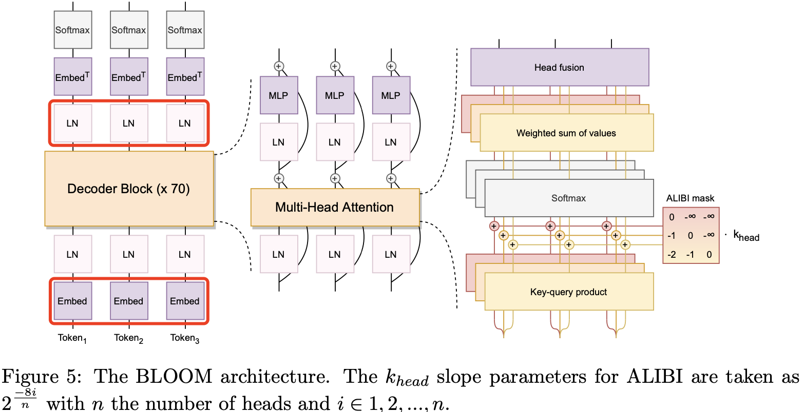
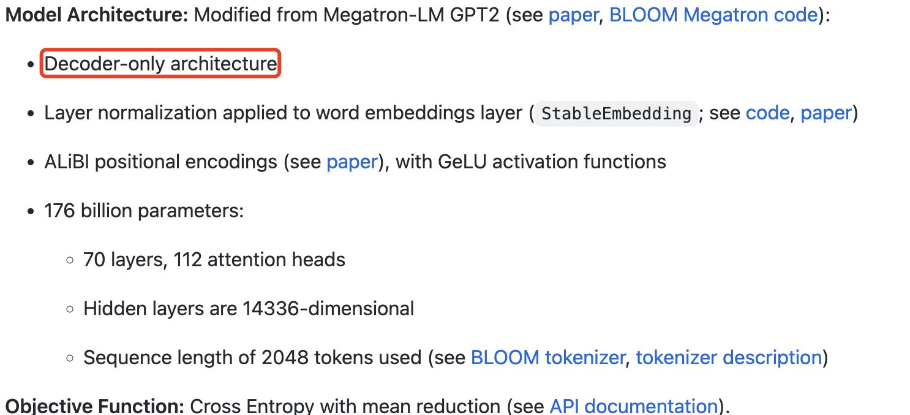
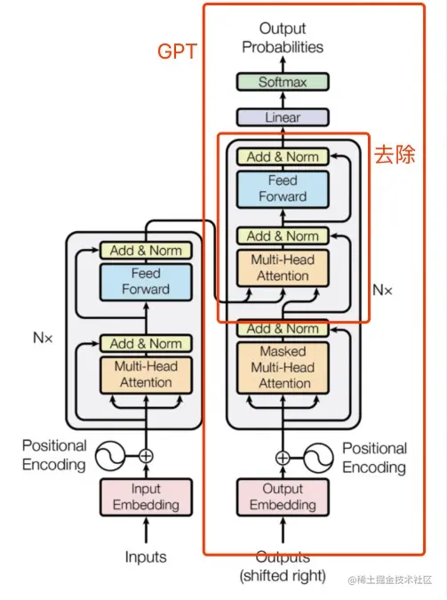
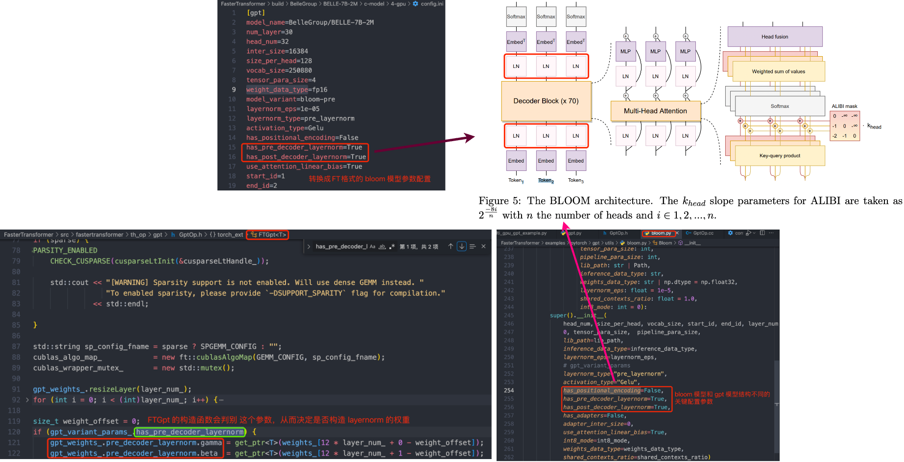

《BLOOM: A 176B-Parameter Open-Access Multilingual Language Model》

论文地址: [https://arxiv.org/pdf/2211.05100.pdf](https://arxiv.org/pdf/2211.05100.pdf)

代码地址: [transformers库-modeling_bloom.py](https://github.com/huggingface/transformers/blob/main/src/transformers/models/bloom/modeling_bloom.py)

> BigScience 官方提供的代码链接并没有找到完整的模型实现代码，只有提示说模型结构代码是在 Megatron 的 GPT-2 代码基础上修改的。

## BLOOM模型结构

> BLOOM 的完整架构图

`BLOOM` 模型也是 `Decoder-only` 架构，但和原始 transformer-decoder 结构有所区别，上图红色框框出来的是 两个优化地方，具体来说:

1. **ALiBi Positional Embeddings**。ALiBi 位置嵌入**不是向嵌入层添加位置信息**，而是根据键和查询的距离直接衰减注意力分数。尽管作者最初的动机是其推断更长序列的能力，但后来发现即使在原始序列长度下，它也能带来更平滑的训练和更好的下游性能，优于 `both learned`（Vaswani等人，2017）和 `rotary embeddings`（Su等人，2021）方法。
2. **Embedding LayerNorm**。在 embedding 层之后立即添加额外的归一化层（`layer norm` 层）。这个方法来源于 bitsandbytes^17库 (Dettmers et al., 2022)，作者的实验发现这样可以显著提高训练的稳定性。另外，模型最终的训练是在  `bfloat16` 下进行的。

> 值得注意的是，`rotary embeddings` 方法是 LLaMA 所采用的 Positional Embeddings 方法。

`BLOOM` 模型结构总结如下所示:

## GPT 模型结构

根据 openAI 官网介绍，GPT3.5 是一个系列模型，也就是保持基本训练框架不变，用不同的数据做指令微调，会得到不同的模型，这些模型都叫做 GPT3.5。值得注意的是，**都是以 GPT3 的模型架构为准，通过变换训练数据做指令微调，或引入 RLHF（Reinformcement Learning from Human Feedback）得到的**。

`GPT1` 的预训练模型基本遵循 Transformer Decode 部分的结构，去除掉和 Encoder 做 cross-attention 的部分，如下图：

## FT 实现BLOOM模型推理代码分析

FT 框架中 BLOOM 模型在 pytorch 算子后端中如何推理的:

- BLOOM 模型结构和 其他 GPT 变体结构都是基于 gpt.py 类来实现的，通过配置不同的模型参数来实现 BLOOM、OPT 模型。

- 如果是以 pytorch 算子作为后端推理，gpt.py 代码也只是提供了 init、forward、模型推理配置初始化等接口，真正的模型结构内部实现是通过 c++ 的 `GptOp` 类来实现的。

## 参考资料

- https://arxiv.org/pdf/2211.05100.pdf
- [transformers库-modeling_bloom.py](https://github.com/huggingface/transformers/blob/main/src/transformers/models/bloom/modeling_bloom.py)
