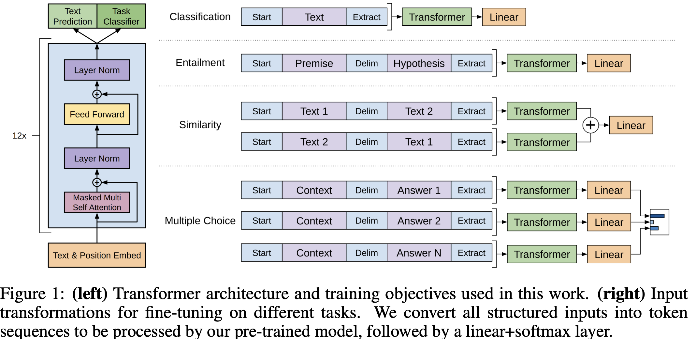
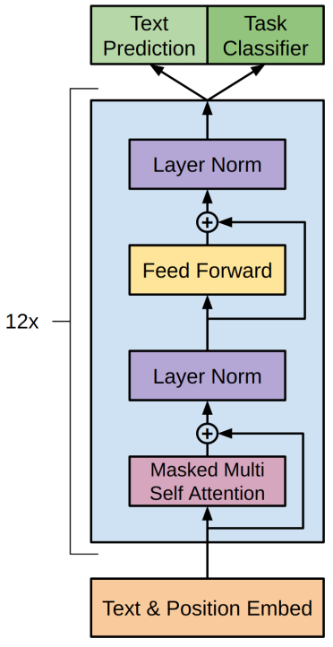
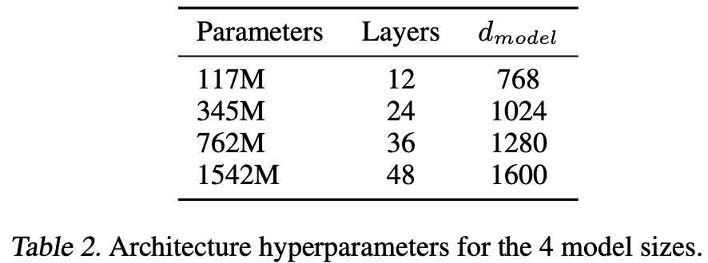

- [一 GPT1 论文解析](#一-gpt1-论文解析)
  - [GPT1 概述](#gpt1-概述)
  - [导言](#导言)
  - [模型架构](#模型架构)
    - [无监督的预训练](#无监督的预训练)
    - [有监督的预训练](#有监督的预训练)
    - [特定任务的输入转换](#特定任务的输入转换)
  - [实验](#实验)
- [二 GPT2 论文速读](#二-gpt2-论文速读)
  - [摘要](#摘要)
  - [导言](#导言-1)
  - [方法](#方法)
    - [训练数据集](#训练数据集)
    - [模型结构](#模型结构)
- [三 GPT3 论文解析](#三-gpt3-论文解析)

## 一 GPT1 论文解析

### GPT1 概述

参考计算机视觉模型，使用没有标记的文本去做**生成式预训练**，然后在特定任务上做判别式微调。

### 导言

**两大难点**：
1. 训练阶段选什么样的损失函数？
2. 如何把学习到的文本表示传递到下游的 nlp 子任务上？

gpt 论文提出一个半监督学习方法（后续论文叫自监督 self supervised learning）：在没有标号的文本上训练一个大语言模型，然后在子任务上进行有监督微调。后续 bert 及其他 llm 论文都用到了自监督训练模型方法。

### 模型架构

#### 无监督的预训练

和标准语言模型一样，目标函数（损失函数）使用最大化似然估计（Maximum Likelihood Estimation, MLE），即最大化训练数据中真实序列的概率。对数似然的公式为：

$$
\mathcal{L_1}(\theta) = \sum_{i=1} \log P(u_i | u_{i-k}, \dots, u_{i-1}; \theta) \quad (1)$$

其中：
- $\theta$ 是模型的参数（比如神经网络的权重）, 模型是 transformer 的解码器。
- $(u_{i-k}, \dots, u_{i-1})$ 是上下文词, $k$ 是上下文窗口大小，是超参数，即每次拿连续 $k$ 个词预测 $k$ 个词后面的那一个词。
- $u_i$ 是要预测的词。
- $P(u_i | u_1, u_2, \dots, u_{i-1}; \theta)$ 是模型预测的概率，$L_1$ 表示第一个损失函数。

实际训练时，通常最小化的是负对数似然损失（Negative Log-Likelihood, NLL），公式为：

$$ \text{NLL} = - \sum_{i=1} \log P(u_i | u_{i-k}, \dots, u_{i-1}; \theta)$$

**即目标是使得模型输出的概率分布与真实目标的分布尽可能接近**。

对于 transformer 解码器来说，抽特征的时候只能看到当前时刻 i 及之前的的元素。

gpt 和 bert 的区别：预测未来比完形填空是更难的，但是训练的好的话，其效果是远超 bert 的。

#### 有监督的预训练

在使用公式 (1) 中的目标函数训练模型后，作者将参数调整为适应有监督的目标任务。假设有一个**标记数据集** $C$，其中每个实例包含一个输入标记序列 $(x_1, \dots, x_m)$ 以及一个标签 $y$。

输入通过前面的预训练模型，最后一层的激活函数值 $h_m^l$ 输入到一个**新增**的线性输出层中，该层具有参数 $W_y$，最后通过 softmax 层计算 $y$ 的预测概率：

$$
P(y \mid x_1, \dots, x_m) = \text{softmax}(h_m^l W_y). \quad (3)
$$

这给出了我们要最大化的目标函数（**分类目标函数** ）：

$$
L_2(C) = \sum_{(x, y) \in C} \log P(y \mid x_1, \dots, x_m). \quad (4)
$$

此外，作者发现在微调过程中包含语言建模作为辅助目标有助于微调模型学习：(a) 提高了有监督模型的泛化能力，(b) 加速了收敛速度。这与之前的研究 [50, 43] 的发现一致，即使用这样的辅助目标能提高性能。具体而言，我们优化以下目标函数（带有权重 $\lambda$）：

$$L_3(C) = L_2(C) + \lambda \cdot L_1(C). \quad (5)$$

总结：**模型结构层面新增了线性层和 `softmax` 层，目标函数新增了分类目标函数**。微调过程中唯一需要的额外参数是 $W_y$ 和用于分隔符标记的嵌入（详见下文）。

#### 特定任务的输入转换

如何把 NLP 的子任务表示成我们想要的形式，即表示成一个序列 $(x_1, \dots, x_m)$ 和对应的标签 $y$。

通过上述图转换，主要是在输入序列上加入开始符号、中间符号和终止符号，这是 `gpt1` 论文的最核心创新点之一，无论输入序列怎么变换、输出线性怎么变换，中间的 `transformer` 模型都没有变化。

### 实验

1. **数据集**：BooksCorpus dataset
2. **模型架构及大小**： 12 层的 transformer 解码器结构，只有 masked self attention，每一层的维度是 768（$d_{model}$），heads 的大小是 12。

GPT1 的模型结构如下图所示:

**模型架构 + 自监督细节**：

模型大体遵循了原始 Transformer 的设计 [62]。作者训练了一个 $12$ 层的仅包含解码器的 Transformer，其使用了带 mask 的自注意力头（$d_{model} = 768$ 和 $12$ 个注意力头）。在逐位置前馈网络中，我们使用了 $3072$ 维的内部状态。优化采用 `Adam` 优化算法 [27]，最大学习率为 $2.5e-4$。学习率在前 $2000$ 次更新中线性从零增长，并使用**余弦调度**衰减到 $0$。作者在包含 $64$ 个随机采样的、连续 $512$ 个标记序列的 `mini-batch` 上训练了 $100$ 个 `epoch`。由于模型中**广泛使用了层归一化**[2]，因此使用均值为 $0$、标准差为$0.02$ 的简单权重初始化 $N (0, 0.02)$ 即可。

采用了 $40,000$ 个合并操作的字节对编码（`BPE`）词汇表[53]，并对残差层、嵌入层和注意力层使用 0.1 概率的 dropout 进行正则化。此外，我们还使用了[37] 中提出的修改版 $L2$ 正则化，在非偏置或增益权重上设置 $w = 0.01$。激活函数采用了高斯误差线性单元（`GELU`）[18]。作者还使用了**学习到的位置嵌入层 position embedding layer**，而不是原始工作中提出的**正弦版本**。对于文本预处理，我们使用 `ftfy` 库清理 `BooksCorpus` 中的原始文本，标准化一些标点符号和空白字符，并使用 `spaCy` 分词器。

**微调细节**：

除非特别说明，我们复用了无监督预训练的超参数设置。我们在分类器中添加了 $0.1$ 的 `dropout`。对于大多数任务，学习率为 $6.25e-5$，批量大小为 $32$。**模型微调速度较快，通常 3 个 `epoch` 的训练已足够**。我们采用线性学习率衰减调度，并在 $0.2%$ 的训练过程中**进行学习率预热**。正则化权重 $\lambda$ 设置为 $0.5$。

## 二 GPT2 论文速读

> 只使用 transformer 解码器的 gpt1 发表后两个月，被只使用编码器和更大数据集训练的 bert 模型打败了。

GPT2 论文的名字是语言模型是无监督的多任务学习器。

### 摘要

制作了更大的名为 `WebText` 的包含数百万个网页的新数据集，新模型包含 1.5B 参数，核心创新点是使用 `zero-shot` 做了一些实验。、

### 导言

之前的工作都是在大数据上做无监督的预训练模型，在 nlp 下游子任务上做有监督的微调，这使得泛化到其他新的 nlp 子任务上是有成本的！

gpt2 提出 `zero-shot` 泛化到新的 nlp 下游子任务是无需成本的！即不需要带标记的下游子任务数据集和不需要重新微调模型。

### 方法

构建下游子任务的时候，不能再引用模型预训练阶段没有见过的开始、中间和终止符号！下游任务的输入要跟之前预训练模型的输入文本一样，**即输入的形式更像自然语言文本表示**，这就是现如今所有 llm 的提示词 prompt 工程的开端！

#### 训练数据集

在 Common Crawl 文本数据集、Reddit 链接基础通过复杂的预处理工作构建了 `WebText` 数据集的初步版本，包含了 800 万个文本，总共 40GB 的文字。

#### 模型结构

新的模型包含了 4 种不同的尺寸：


## 三 GPT3 论文解析

