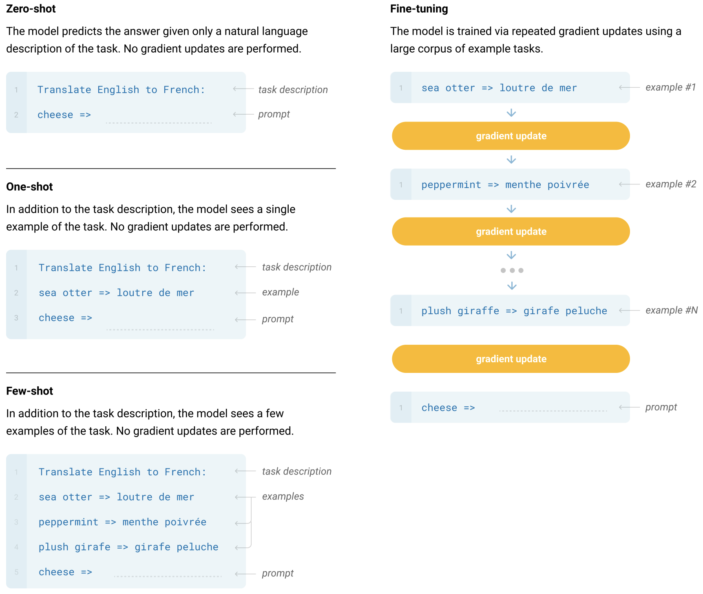
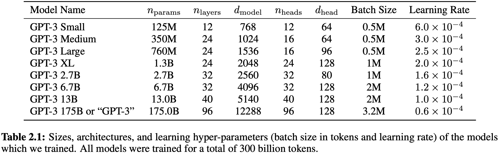
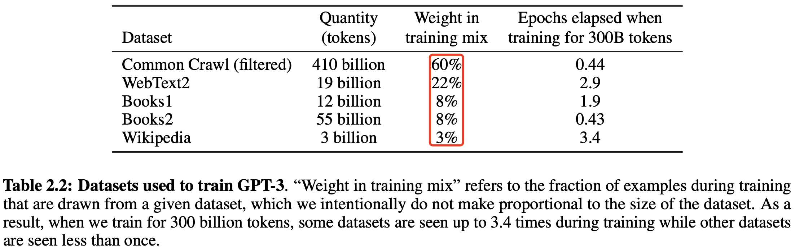

- [一 GPT1 论文解析](#一-gpt1-论文解析)
  - [GPT1 概述](#gpt1-概述)
  - [导言](#导言)
  - [模型架构](#模型架构)
    - [无监督的预训练](#无监督的预训练)
    - [有监督的预训练](#有监督的预训练)
    - [特定任务的输入转换](#特定任务的输入转换)
  - [实验\&模型结构及参数](#实验模型结构及参数)
- [二 GPT2 论文速读](#二-gpt2-论文速读)
  - [摘要](#摘要)
  - [导言](#导言-1)
  - [方法](#方法)
    - [训练数据集](#训练数据集)
    - [模型结构/尺寸](#模型结构尺寸)
- [三 GPT3 论文解析](#三-gpt3-论文解析)
  - [摘要](#摘要-1)
  - [导言](#导言-2)
  - [方法](#方法-1)
    - [模型和架构](#模型和架构)
    - [训练数据集](#训练数据集-1)
    - [评估](#评估)
- [四 GPT2 和 GPT3 的区别](#四-gpt2-和-gpt3-的区别)
- [参考资料](#参考资料)

## 一 GPT1 论文解析

### GPT1 概述

参考计算机视觉模型，使用没有标记的文本去做**生成式预训练**，然后在特定任务上做判别式微调。

### 导言

**两大难点**：
1. 训练阶段选什么样的损失函数？
2. 如何把学习到的文本表示传递到下游的 nlp 子任务上？

gpt 论文提出一个半监督学习方法（后续论文叫自监督 self supervised learning）：在没有标号的文本上训练一个大语言模型，然后在子任务上进行有监督微调。后续 bert 及其他 llm 论文都用到了自监督训练模型方法。

### 模型架构

#### 无监督的预训练

和标准语言模型一样，目标函数（损失函数）使用最大化似然估计（Maximum Likelihood Estimation, MLE），即最大化训练数据中真实序列的概率。对数似然的公式为：

$$
\mathcal{L_1}(\theta) = \sum_{i=1} \log P(u_i | u_{i-k}, \dots, u_{i-1}; \theta) \quad (1)$$

其中：
- $\theta$ 是模型的参数（比如神经网络的权重）, 模型是 transformer 的解码器。
- $(u_{i-k}, \dots, u_{i-1})$ 是上下文词, $k$ 是上下文窗口大小，是超参数，即每次拿连续 $k$ 个词预测 $k$ 个词后面的那一个词。
- $u_i$ 是要预测的词。
- $P(u_i | u_1, u_2, \dots, u_{i-1}; \theta)$ 是模型预测的概率，$L_1$ 表示第一个损失函数。

实际训练时，通常最小化的是负对数似然损失（Negative Log-Likelihood, NLL），公式为：

$$ \text{NLL} = - \sum_{i=1} \log P(u_i | u_{i-k}, \dots, u_{i-1}; \theta)$$

**即目标是使得模型输出的概率分布与真实目标的分布尽可能接近**。

对于 transformer 解码器来说，抽特征的时候只能看到当前时刻 i 及之前的的元素。

gpt 和 bert 的区别：预测未来比完形填空是更难的，但是训练的好的话，其效果是远超 bert 的。

#### 有监督的预训练

在使用公式 (1) 中的目标函数训练模型后，作者将参数调整为适应有监督的目标任务。假设有一个**标记数据集** $C$，其中每个实例包含一个输入标记序列 $(x_1, \dots, x_m)$ 以及一个标签 $y$。

输入通过前面的预训练模型，最后一层的激活函数值 $h_m^l$ 输入到一个**新增**的线性输出层中，该层具有参数 $W_y$，最后通过 softmax 层计算 $y$ 的预测概率：

$$
P(y \mid x_1, \dots, x_m) = \text{softmax}(h_m^l W_y). \quad (3)
$$

这给出了我们要最大化的目标函数（**分类目标函数** ）：

$$
L_2(C) = \sum_{(x, y) \in C} \log P(y \mid x_1, \dots, x_m). \quad (4)
$$

此外，作者发现在微调过程中包含语言建模作为辅助目标有助于微调模型学习：(a) 提高了有监督模型的泛化能力，(b) 加速了收敛速度。这与之前的研究 [50, 43] 的发现一致，即使用这样的辅助目标能提高性能。具体而言，我们优化以下目标函数（带有权重 $\lambda$）：

$$L_3(C) = L_2(C) + \lambda \cdot L_1(C). \quad (5)$$

总结：**模型结构层面新增了线性层和 `softmax` 层，目标函数新增了分类目标函数**。微调过程中唯一需要的额外参数是 $W_y$ 和用于分隔符标记的嵌入（详见下文）。

#### 特定任务的输入转换

如何把 NLP 的子任务表示成我们想要的形式，即表示成一个序列 $(x_1, \dots, x_m)$ 和对应的标签 $y$。

通过上述图转换，主要是在输入序列上加入开始符号、中间符号和终止符号，这是 `gpt1` 论文的最核心创新点之一，无论输入序列怎么变换、输出线性怎么变换，中间的 `transformer` 模型都没有变化。

### 实验&模型结构及参数

1. **数据集**：BooksCorpus dataset
2. **模型架构及大小**： 12 层的 transformer 解码器结构，只有 masked self attention，每一层的维度是 768（$d_{model}$），heads 的大小是 12。

GPT1 的模型结构如下图所示:

<!--  -->

**模型架构 + 自监督细节**：

模型大体遵循了原始 Transformer 的设计 [62]。作者训练了一个 $12$ 层的仅包含解码器的 Transformer，其使用了带 mask 的自注意力头（$d_{model} = 768$ 和 $12$ 个注意力头）。在逐位置前馈网络中，我们使用了 $3072$ 维的内部状态。优化采用 `Adam` 优化算法 [27]，最大学习率为 $2.5e-4$。学习率在前 $2000$ 次更新中线性从零增长，并使用**余弦调度**衰减到 $0$。作者在包含 $64$ 个随机采样的、连续 $512$ 个标记序列的 `mini-batch` 上训练了 $100$ 个 `epoch`。由于模型中**广泛使用了层归一化**[2]，因此使用均值为 $0$、标准差为$0.02$ 的简单权重初始化 $N (0, 0.02)$ 即可。

采用了 $40,000$ 个合并操作的字节对编码（`BPE`）词汇表[53]，并对残差层、嵌入层和注意力层使用 0.1 概率的 dropout 进行正则化。此外，我们还使用了[37] 中提出的修改版 $L2$ 正则化，在非偏置或增益权重上设置 $w = 0.01$。激活函数采用了高斯误差线性单元（`GELU`）[18]。作者还使用了**学习到的位置嵌入层 position embedding layer**，而不是原始工作中提出的**正弦版本**。对于文本预处理，我们使用 `ftfy` 库清理 `BooksCorpus` 中的原始文本，标准化一些标点符号和空白字符，并使用 `spaCy` 分词器。

**微调细节**：

除非特别说明，我们复用了无监督预训练的超参数设置。我们在分类器中添加了 $0.1$ 的 `dropout`。对于大多数任务，学习率为 $6.25e-5$，批量大小为 $32$。**模型微调速度较快，通常 3 个 `epoch` 的训练已足够**。我们采用线性学习率衰减调度，并在 $0.2%$ 的训练过程中**进行学习率预热**。正则化权重 $\lambda$ 设置为 $0.5$。

## 二 GPT2 论文速读

> 只使用 transformer 解码器的 gpt1 发表后两个月，被只使用编码器和更大数据集训练的 bert 模型打败了。

GPT2 论文的名字是语言模型是无监督的多任务学习器。

### 摘要

制作了更大的名为 `WebText` 的包含数百万个网页的新数据集，新模型包含 1.5B 参数，核心创新点是使用 `zero-shot` 做了一些实验，并认为**大规模的训练使模型能够捕捉到丰富的语言知识和上下文信息**。简单总结就是：**GPT-2 在论文中展示了其在不同 NLP 任务上的能力，包括文本生成、翻译、问答等。这些任务是通过提供特定的提示（prompt）进行的，而不是通过传统的微调方式**。

### 导言

之前的工作都是在大数据上做无监督的预训练模型，在 nlp 下游子任务上做有监督的微调，这使得泛化到其他新的 nlp 子任务上是有成本的！

gpt2 提出 `zero-shot` 泛化到新的 nlp 下游子任务是无需成本的！**即不需要带标记的下游子任务数据集和不需要重新微调模型**。

### 方法

构建下游子任务的时候，不能再引用模型预训练阶段没有见过的开始、中间和终止符号！下游任务的输入要跟之前预训练模型的输入文本一样，**即输入的形式更像自然语言文本表示**，**这就是现如今所有 llm 的提示词 prompt 工程的开端**！

#### 训练数据集

在 Reddit 高质量帖子的基础上通过复杂的预处理工作构建了 `WebText2` 数据集，包含了 800 万个文本，总共 40GB 的文字。

#### 模型结构/尺寸

新的模型包含了 4 种不同的尺寸：

## 三 GPT3 论文解析

GPT3 论文名字是“语言模型是 Few-Shot Learners”。论文的价值 = 新意度 * 有效性 * 问题的大小。
> GPT2 论文更像是 GPT3 论文的一个过渡。

### 摘要

作者训练了 GPT-3，一个具有 1750 亿参数的自回归语言模型，比以前任何的非稀疏语言模型大 10 倍，并在少样本 `few-shot` 设置下测试其性能。

**GPT3 作用到下游子任务的时候虽然不做任何的梯度更新或者微调，但取得了很好的成绩**！

### 导言

提出问题：之前微调后模型的泛化性可能并不是那么好，只是因为在预训练模型上有点过拟合了。
解决办法：
- 训练一个很大的预训练模型，泛化性不错（meta-learning）。
- 后面微调的时候，即使给出一些样本，但是不再更新预训练模型的权重（in—context learning）。

GPT-3 强调了 “few-shot” 学习能力，即通过少量的示例来完成特定任务。这种方法展示了 GPT-3 在没有额外微调的情况下，如何通过提供少量的任务相关示例（或甚至只有任务描述）来进行有效的预测。

在 GPT-2 和 GPT-3 的论文中，**上下文学习（context learning）是一个关键的概念，它指的是模型在处理输入数据时，如何利用上下文信息来提高其性能**。这里的上下文可以是文本中的前文信息，也可以是数据中的其他相关信息。

1，GPT-2 的上下文学习利用了**Zero-shot学习**：`GPT-2` 在没有针对特定任务进行微调的情况下，能够根据输入的上下文来执行任务。例如，如果输入一个新闻文章的开头，GPT-2 可以继续生成剩余的文章，这是因为它能够利用已有的上下文信息来推断接下来的内容。

2，`GPT-3` 中的上下文学习主要体现在：

1. **更大的上下文窗口**：GPT-3 通过增加模型的上下文窗口大小，能够处理更长的文本序列，这使得模型能够更好地理解和生成连贯的文本。

2. **Few-shot学习**：**GPT-3 在给定少量示例的情况下，能够快速适应并执行特定的任务**。例如，如果给定几个问题和答案的对，GPT-3能够理解这是一个问答任务，并在没有进一步训练的情况下生成正确的答案。

3. **上下文提示**：`GPT-3` 通过在输入中包含任务描述或示例来引导模型执行特定的任务。这种方法被称为上下文提示（contextual prompting），它使得GPT-3能够在没有显式微调的情况下执行多种任务。

4. **多任务学习**：GPT-3 在预训练阶段就接触到了多种不同的任务和数据类型，这使得它在处理新任务时能够利用之前学到的相关知识。

### 方法

`GPT3` 模型的预训练方法，包括模型架构、数据和训练过程，都类似于 `GPT2` 论文中描述的过程，**只是在模型规模、数据集规模和多样性以及训练时长上进行了相对直接的扩展**，简单讲就是数据更大、模型更大、训练时间更长！

下图通过示例对比描述了 `Fine-Tuning (FT)`、`Few-Shot (FS)`、`One-Shot (1S)`、`Zero-Shot (0S)` 的区别和原理：

零样本、单样本和少样本（这些是我们在这项工作中研究的）方法和传统的微调（fine-tuning）方法的区别就是**要求模型在测试时仅通过前向传播来完成任务，而不再对预训练模型进行权重更新**。我们通常在少样本设置中向模型提供几十个示例。

#### 模型和架构

GPT3 模型和 GPT2 模型架一样。
- GPT2 模型和 GPT1 模型的区别：修改初始化、预归一化（即把 Normalization 放到了模型的前面）和可以反转的词元（modified initialization, pre-normalization,
and reversible tokenization described therein）。
- GPT3 和 GPT2 的唯一不同是，在 `Transformer` 层中**采用了 `Sparse Transformer` 中的 `attention` 结构，即稀疏注意力机制**，这类似于 Sparse Transformer [CGRS19]，这允许模型处理更长的输入序列，同时减少了计算复杂度。

GPT3 设计了 8 个不同尺度的模型：

#### 训练数据集

作者发现未经过滤或轻微过滤的 `Common Crawl` 版本的质量往往低于更精心策划的数据集。因此，我们采取了 $3$ 个步骤来提高数据集的平均质量：
1. 下载并过滤了一个与一系列高质量参考语料库相似的 `Common Crawl` 版本。
2. 在文档层面上进行了模糊去重，包括数据集内部和跨数据集的去重，以防止冗余并保持我们保留的验证集的完整性，以准确衡量过拟合情况。
3. 还将已知的高质量参考语料库添加到训练数据中，以增强 `Common Crawl` 的数据多样性。

第一和第二点（Common Crawl的处理）详细描述在附录A中。对于第三点，我们添加了几个精心策划的高质量数据集，包括一个扩展版的 `WebText` 数据集 [GPT2]，通过更长时间的链接抓取收集，首次描述在 [KMH+20] 中，两个基于互联网的书籍语料库（Books1和Books2）以及英文维基百科。

表 2.2 展示了作者在训练中使用的最终数据集混合。Common Crawl 数据来自 2016 年至 2019 年的 41 个分片，总计 45TB 的压缩纯文本，在过滤后为 570GB，大约等于 400 亿个字节对编码的标记。

值得注意的是，**在训练期间，数据集的抽样并不按照其大小的比例进行，而是我们视为高质量的数据集被更频繁地抽样**，这样 Common Crawl 和 Books2 数据集在训练过程中被抽样的次数少于一次，而其他数据集被抽样 2-3 次。这基本上接受了一小部分过拟合，以换取更高质量的训练数据。

#### 评估

对于少样本学习，我们通过从该任务的训练集中随机抽取K个示例作为条件进行评估，条件示例用1或2个换行符分隔，具体取决于任务。

$K$ 的值可以是从 $0$ 到模型上下文窗口所允许的最大值之间的任何值，对于所有模型，上下文窗口大小为 nctx = 2048，通常可以容纳 10 到 100 个示例。$K$ 值通常较大，但并非总是更有利，当有单独的开发集和测试集时，我们在开发集上尝试几个 $K$ 值，然后在测试集上运行最佳值。对于一些任务（见附录G），我们还使用自然语言提示作为（或对于K = 0，替代）示例。

## 四 GPT2 和 GPT3 的区别

**1，模型规模和参数量**：

- GPT-2的模型规模相对较小，最大版本拥有15亿个参数。
- GPT-3则显著扩大了模型规模，拥有高达1750亿个参数，这使得GPT-3在处理复杂任务时更为强大。

**2，训练数据**：

- GPT-2 使用了 40GB 的 WebText2 数据集进行训练。
- GPT-3 则使用了更大规模的数据集，包括 Common Crawl、WebText2、Books1、Books2 和 Wikipedia，总计约 45TB 的数据，清洗后约为 570GB。

**3，模型结构**：

- GPT-2继续沿用了GPT的单向Transformer模型，将归一化层移到了Block的输入位置，并在最后一个自注意力块之后加了一层归一化。
- GPT-3在模型结构上采用了Sparse Transformer中的attention结构，即稀疏注意力机制，这允许模型处理更长的输入序列，同时减少了计算复杂度。

**4，训练策略**：

- `GPT-2` 主要采用了 `zero-shot` 学习，即在没有针对特定任务进行微调的情况下，直接使用预训练模型来生成文本或执行任务。
- `GPT-3` 则采用了 `few-shot` 学习，通过**少量的示例**来指导模型完成特定任务，这使得 GPT-3 在理解和执行任务方面更为有效。

## 参考资料

- [GPT，GPT-2，GPT-3 论文精读【论文精读】](https://www.bilibili.com/video/BV1AF411b7xQ/?spm_id_from=333.788&vd_source=69e98dbaea70afc6b62d55a86d59e408)

