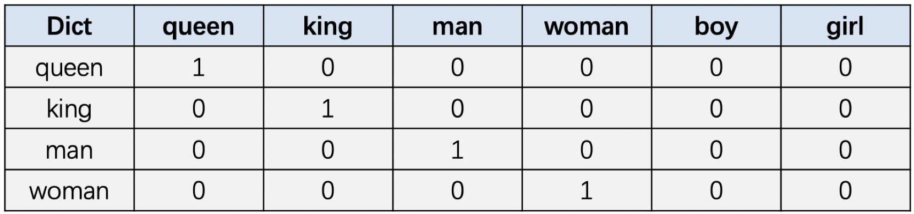

- [词向量](#词向量)
  - [`One-Hot` 编码](#one-hot-编码)
  - [Word Embedding](#word-embedding)
- [vocab 和 merge table](#vocab-和-merge-table)
- [Token ID 序列](#token-id-序列)
- [embedding 维度](#embedding-维度)
- [Word Embedding Vector](#word-embedding-vector)
- [nn.Linear](#nnlinear)
- [参考资料](#参考资料)

### 词向量

在 CV 领域，需要将数字图像转换为**矩阵/张量**进行神经网络计算；而在 NLP 领域，自然语言通常以文本形式存在，同样需要将文本数据转换为一系列的**数值**方便计算机进行计算，这里会涉及到**词向量**的概念，转换的方法通常有:

- `One-Hot` 编码: 一种简单的单词表示方式
- `Word Embedding`: 一种分布式单词表示方式
- `Word2Vec`: 一种词向量的训练方法

#### `One-Hot` 编码

`One-hot` 编码是一种很简单的将单词数值化的方式。对于单词数量为 N 的词表，则需用一个长度为 N 的向量表示一个单词，在这个向量中该单词对应的位置数值为1，其余单词对应的位置数值全部为0。举例如下：

**词典**: [queen, king, man, woman, boy, girl ]



上图展示了词典中 `6` 个单词的 one-hot 编码表示。虽然这个表示还是很简单的，但是其也存在以下问题:

- 现实当中单词数量往往有几十万甚至上百万，这样如果用 one-hot 编码的方式表示单词，其向量维度会很长，且极其稀疏，即**高维高稀疏**。
- 因为向量之间是正交且点积为 0，所以无法直接通过向量计算的方式来得出单词之间的关系，即**无法看出词之间的语义相似性**。

#### Word Embedding

Word Embedding 的概念。如果将 word 看作文本的最小单元，可以将 Word Embedding 理解为一种**映射**，其过程是：将文本空间中的某个 word，通过一定的方法，映射或者说嵌入（embedding）到另一个数值向量空间（之所以称之为 embedding，是因为这种表示方法往往伴随着一种**降维**的意思）

1，基于频率的 Word Embedding 又可细分为如下几种：

- Count Vector
- TF-IDF Vector

### vocab 和 merge table

在自然语言处理中，`Token` 是指一段文本中的基本单位，通常是一个词、一个词组或者一个字符。Tokenization 是将一段文本分解为一系列的 Token 的过程。

`vocab` 文件和 `merge table` 可以用来将原始文本分割成一系列的 `token`。

1，Vocab 文件，全称为 vocabulary file，是指包含了所有可能出现在文本中的 `token` 列表。在 LLM 中，每个 token 对应着一个编号（或者叫做词汇表中的索引），以便在模型中表示为对应的向量。Vocab 文件中的每个token 一般都是由一个或多个字符组成的，通常会包括汉字、英文单词、标点符号等。以下是一个示例vocab文件的部分内容：

```bash
csharpCopy code
[PAD]
[UNK]
[CLS]
[SEP]
[MASK]
我
的
你
是
了
...
```

在这个例子中，前五个 token 是特殊 token，分别表示填充、未知、开始、结束和掩码，其余的token是由汉字和英文单词组成的。在 LLM 中，所有输入文本的 token 都会映射为这个 vocab 文件中的其中一个 token。

2，`Merge Table` 是 LLM 中另一个重要的概念，它用于将文本中的字符逐步合并为**更大的 token**。Merge Table包含了一系列的合并操作，每个操作都是由两个字符组成的，表示将这两个字符合并为一个新的 token。

以下是一个示例的 Merge Table 的部分内容：

```bash
L U
K S
e r
o v
o l
oo o
```

在这个例子中，每个操作将两个字符合并为一个新的 token，例如将 L 和 U 合并为一个新的 token LU，将 e 和 r合并为一个 token `er` 等等。这些操作的顺序和次数都是由 LLM 模型自动学习得到的，通过这些合并操作，LLM可以将任意长度的文本逐步分割成一系列的 token，然后再进行模型预测。

### Token ID 序列

在自然语言处理中，计算机无法直接处理文本，需要将文本转换为数字形式进行处理。`Token ID` 序列就是这样一种**数字形式**，它可以被输入到神经网络或其他机器学习算法中进行训练和预测。

具体来说，`Token ID` 序列是指将原始文本序列中的每个单词或子词（`token`）映射为对应的 ID 后得到的**整数序列**。在使用 `tokenizer` 对文本进行编码时，tokenizer 会将每个单词或子词映射为一个唯一的 ID，得到 token ID 序列作为模型的输入。

### embedding 维度

在自然语言处理任务中，会将输入的文本序列通过 `embedding` 层**转换为固定维度的向量序列**，然后再通过后续的神经网络层进行处理。embedding 层的输出维度称为 embedding 维度（`embed_dim`），是一个超参数，需要根据具体任务和数据集进行调整。

### Word Embedding Vector

`Word Embedding Vector` 是将单词映射到向量空间的一种方式，它可以**将单词的语义信息转化为向量形式**，并且可以在向量空间中计算单词之间的相似性，简单理解就是，将单词从原始文本格式转换为神经网络可以理解和处理的数字格式的一种方式。在深度学习中，我们通常使用 Word2Vec、GloVe 或 FastText 等算法来生成单词的嵌入向量。

下面是一个简单的 Python 示例，用于使用 PyTorch 生成单词的嵌入向量：

```python
import torch
import torch.nn as nn
from torchtext.vocab import Vocab

from collections import Counter

text = "hello world hello" # 假设我们有一个文本
counter = Counter(text.split()) # 统计每个单词的出现次数
vocab = Vocab(counter) # 创建词汇表

# 构建嵌入层
vocab_size = 1000
embedding_dim = 100
embedding_layer = nn.Embedding(vocab_size, embedding_dim)

# 假设我们有一个输入单词列表，每个单词都是从词汇表中随机选择的
input_words = ["hello", "world", "this", "is", "a", "test"]

# 将单词转换为索引列表
word_indexes = [vocab.index(word) for word in input_words]

# 将索引列表转换为PyTorch张量
word_indexes_tensor = torch.LongTensor(word_indexes)

# 将索引列表输入嵌入层以获取嵌入向量
word_embeddings = embedding_layer(word_indexes_tensor)

# 输出嵌入向量
print(word_embeddings)
```

1.  首先通过 `Vocab` 和输入文本字符串创建词汇表 `vocab`，并通过 `nn.Embedding` 创建了一个大小为 $1000\times 100$ 的嵌入层 `embedding_layer`，表示**词汇表 **中有 `1000` 个单词，每个单词用一个 `100` 维的向量表示。
2. 然后，我们创建一个输入单词列表 input_words，并将每个单词转换为词汇表中对应的索引，和将索引列表转换为 PyTorch 张量。
3. 最后将张量 `word_indexes_tensor` 输入到嵌入层中，以获取每个单词的 100 维嵌入向量。

值得注意的是，嵌入向量的大小和维度通常需要根据任务进行调整。通常，词汇表越大，嵌入向量的维度就越高。此外，**嵌入向量的大小通常需要与模型中的其他参数相匹配，例如隐藏层的大小和注意力头的数量**。

### nn.Linear

在 PyTorch 中，`nn.Linear` 是一个模块，它实现了一个全连接层，它将输入张量的每个元素都乘以一个可学习的权重矩阵，并加上一个可学习的偏置向量，最后输出一个新的张量。全连接层的数学表达式为：
$$
\text{output} = \text{input} \times \text{weight}^\text{T} + \text{bias} \nonumber
$$
`nn.Linear` 的构造函数如下：

```python
nn.Linear(in_features: int, out_features: int, bias: bool = True)
```

各参数解释如下：

- `in_features` 表示输入张量的特征数，也就是输入张量的最后一维的大小，
- `out_features` 表示输出张量的特征数，也就是输出张量的最后一维的大小，
- `bias` 是一个布尔值，表示是否添加偏置向量。如果 `bias` 为 `False`，则不会添加偏置向量。

下面是一个示例代码，可直接运行，其创建了一个输入张量，并通过 层进行维度的线性变换。

```python
import torch.nn as nn
import torch
import time

# 创建一个输入张量
input_tensor = torch.randn(10, 20)

# 创建一个 Linear 层对象，将输入维度从 20 变换到 30
linear_layer = nn.Linear(20, 30)

# 将输入张量传递给 Linear 层进行变换
start_time = time.time()
output_tensor = linear_layer(input_tensor)
end_time = time.time()

# 打印输出张量的形状
print(f"Output shape: {output_tensor.shape}") # Output shape: torch.Size([10, 30])
print(f"Time taken: {end_time - start_time:.6f} seconds") # Time taken: 0.002543 seconds
```

> 深度学习论文公式和代码可视化见 github 仓库 [annotated_deep_learning_paper_implementations](https://github.com/labmlai/annotated_deep_learning_paper_implementations)。

### 参考资料

- https://paddlepedia.readthedocs.io/en/latest/tutorials/sequence_model/word_representation/index.html
- [Word Embedding 編碼矩陣](https://medium.com/ml-note/word-embedding-3ca60663999d#id_token=eyJhbGciOiJSUzI1NiIsImtpZCI6ImFjZGEzNjBmYjM2Y2QxNWZmODNhZjgzZTE3M2Y0N2ZmYzM2ZDExMWMiLCJ0eXAiOiJKV1QifQ.eyJpc3MiOiJodHRwczovL2FjY291bnRzLmdvb2dsZS5jb20iLCJuYmYiOjE2ODExOTMwMTUsImF1ZCI6IjIxNjI5NjAzNTgzNC1rMWs2cWUwNjBzMnRwMmEyamFtNGxqZGNtczAwc3R0Zy5hcHBzLmdvb2dsZXVzZXJjb250ZW50LmNvbSIsInN1YiI6IjExNjQ1MDI4MjQ3OTk2MjkwMjczMiIsImVtYWlsIjoiemhnMTMyMTUwMkBnbWFpbC5jb20iLCJlbWFpbF92ZXJpZmllZCI6dHJ1ZSwiYXpwIjoiMjE2Mjk2MDM1ODM0LWsxazZxZTA2MHMydHAyYTJqYW00bGpkY21zMDBzdHRnLmFwcHMuZ29vZ2xldXNlcmNvbnRlbnQuY29tIiwibmFtZSI6IueroOa0qumrmCIsInBpY3R1cmUiOiJodHRwczovL2xoMy5nb29nbGV1c2VyY29udGVudC5jb20vYS9BR05teXhZbzFFVlgwV3Zfemdzb1VBRmVPMzE5X3dDUnV2VWNNaGVYQktJZ0lnPXM5Ni1jIiwiZ2l2ZW5fbmFtZSI6Iua0qumrmCIsImZhbWlseV9uYW1lIjoi56ugIiwiaWF0IjoxNjgxMTkzMzE1LCJleHAiOjE2ODExOTY5MTUsImp0aSI6IjYxMzhiZTlmMDNkNjZkMjhmYTNmMTA1ZmYwYTIzMmMwNTU1OTRkNjIifQ.Nxda3BGc_YjHzMAPwTTqTKayTUTgIPUGR2CzqTjNkbolF_JdRnse2TFlLGC2OIUV0Shy17Omyu-5c_JKYojI-XZkHX9UtyZ-qkbP_zZG5FPaq27N2IlOMIMFlR3FMnmGgOu0L3YjimR_mExO-ltP2j-WncJEstVTPXrpzIEeVjEAfzIdvClMyCidPBdKmE9qHczhUcXKWL4oJjg4qBsqoljAW6g2u1V4ENc-t5vBZT91BGbSBF5snSNJ9TyjK1PGyUxEzpJNZX4WSboWhf-H0rlch9jWJeFZMncTPP8_6UqsTJXPCEkd0ZvTjxKLNASdaL-dalX4r01w74ezqRfKwg)