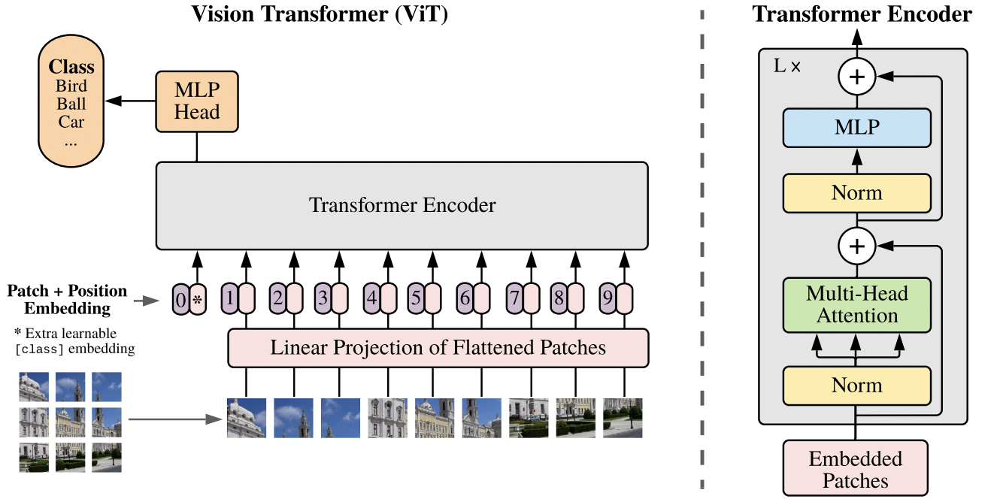
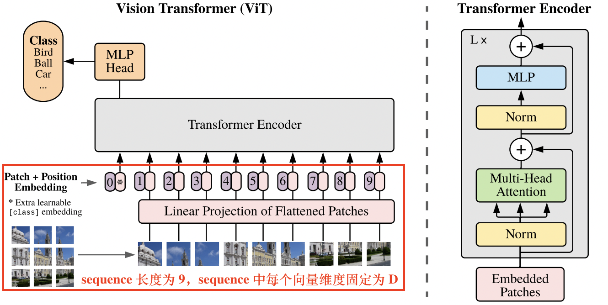
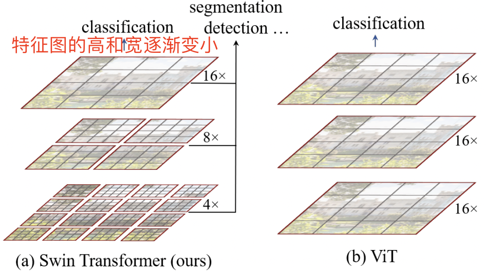
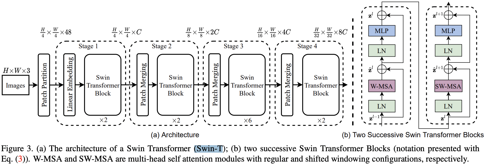

- [Vision Transformer 模型](#vision-transformer-模型)
  - [ViT 结构](#vit-结构)
  - [ViT 特点](#vit-特点)
- [Swin Transformer 模型](#swin-transformer-模型)
  - [模型结构](#模型结构)
    - [W-MSA详解](#w-msa详解)
- [参考资料](#参考资料)

## Vision Transformer 模型

> [ViT](https://arxiv.org/pdf/2010.11929.pdf): AN IMAGE IS WORTH 16X16 WORDS: TRANSFORMERS FOR IMAGE RECOGNITION AT SCALE 是 2020 年 Google 团队提出的将 Transformer 应用在图像分类的模型。

`ViT` 在 Transformer 架构的视觉模型的地位类似 ResNet 模型。因为其模型“简单”且效果好，可扩展性强（scalable，模型越大效果越好），成为了 Transformer 在 CV 领域应用的里程碑著作。

### ViT 结构

ViT 算法的整体结构如下图所示。

我们知道在 Transformer 结构中，输入是一个二维的矩阵，矩阵的形状可以表示为 $(N,D)$ ，其中 $N$ 是`sequence` 的长度，而 $D$ 是 sequence 中每个向量的维度。因此，在 ViT 算法中，首先需要设法将 $H\times W\times C$ 的三维图像转化为 $(N,D)$ 的二维输入。

ViT 的具体实现是：将输入图像 $H\times W\times C$ 切块，每个图像块的维度为 $P^2\times C$，则每个图像包含了 $N = HW/P^2$ 个图像块。将图像块展平，即图像变成了一个 $N\times (P^2\times C)$ 的序列，这里的 $N$ 可视为 `sequence` 的长度。

但是，每个图像的块的维度是 $P^2\times C$，而 Transformer 结构需要的向量维度是 $D$，不符合要求。因此，我们还需要对图像块进行 Embedding。这里 Embedding 的方式非常简单，只需要对每个图像块 $P^2\times C$ 做一个线性变换，即可将维度压缩为 $D$。

后续 encoder 的操作和原始 Transformer 中完全相同。但是因为对图片分类，因此在输入序列中加入一个特殊的token，该 token 对应的输出即为最后的类别预测。

上述对图像进行分块以及 Embedding 的具体方式如 下图红框所示。

### ViT 特点

- ViT 为了满足 Transformer 输入结构的要求，将整幅图像拆分成小图像块，然后把这些小图像块的线性嵌入序列输入到网络。同时，使用了 Class Token 的方式进行分类预测。
- ViT 原论文中最核心的结论是，当拥有足够多的数据进行预训练的时候，ViT 的表现就会超过 CNN，突破transformer 缺少归纳偏置的限制，可以在下游任务中获得较好的迁移效果

## Swin Transformer 模型

> “Swin Transformer: Hierarchical Vision Transformer using Shifted Window” 是微软亚洲研究院（MSRA）发表在 arXiv 上的[论文](https://arxiv.org/pdf/2103.14030.pdf)，文中提出了一种新型的 Transformer 架构，也就是 Swin Transformer。

### 模型结构

从上图中可以看出，Swin 相较于 ViT 的区别在于：Swim 模型的特征图具有**层次性**，随着特征层加深，特征图的高和宽逐渐变小（4 倍、8 倍和16 倍下采样）。

最右边两个图为 Swim Transformer 的每个块结构，类似于 ViT 的块结构，其核心修改的地方就是将原本的 MSA变为 W-MSA。

左边展示的为 Swim 模型的整个处理流程为：输入(H, W, 3)维的彩色图片，首先执行 `Patch Partition`，特征维度变为(W/4, H/4, 48)；接着，连续执行 Stage1、Stage2、Stage3 和 Stage4（注意每个 Stage 下面有个 x2、×6、×n，表示包含 n 个该 `Stage`），每个 Stage 的结构几乎相同，维度变化也类似，分别将宽和高变为原来的一半，通道变为原来的二倍。其中，Stage1 相较于其他 Stage 不同的是其第一部分为 `Linear Embedding`，而非 `Patch Merging`。

#### W-MSA详解

W-MSA 的全称为 `Windows Multi-head Self-Attention`，相较于 MSA 而言，引入了 Widnwos 机制。

ViT 网络中的 MSA 通过 Self-Attention 使得每一个像素点都可以和其他的像素点进行内积从而得到所有像素点的信息，从而获得丰富的全局信息。但是每个像素点都需要和其他像素点进行信息交换，计算量巨大，网络的执行效率低下。

而 Swin-T 将 MSA 分个多个固定的 Windows 构成了 W-MSA，每个 Windows 之间的像素点只能与该 Windows 中的其他像素点进行内积从而获得信息，这样便大幅的减小了计算量，提高了网络的运算效率。

## 参考资料

1. [浅析Swin transformer模型(通俗易懂版)](https://mp.weixin.qq.com/s/stjN0V32obq0mA0F1FDeRQ)
2. [ViT（Vision Transformer）解析](https://zhuanlan.zhihu.com/p/445122996)
3. [Implementing Vision Transformer (ViT) in PyTorch](https://towardsdatascience.com/implementing-visualttransformer-in-pytorch-184f9f16f632)