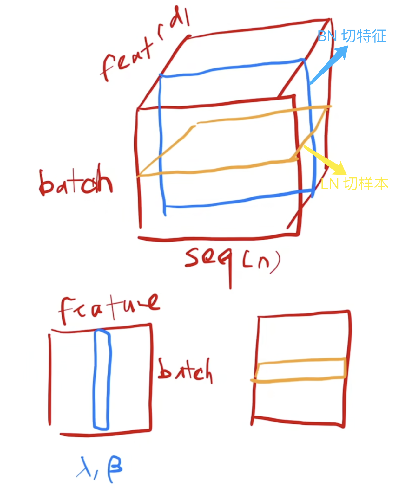
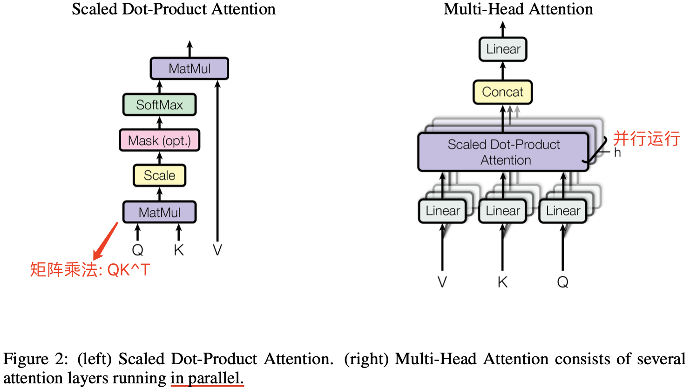
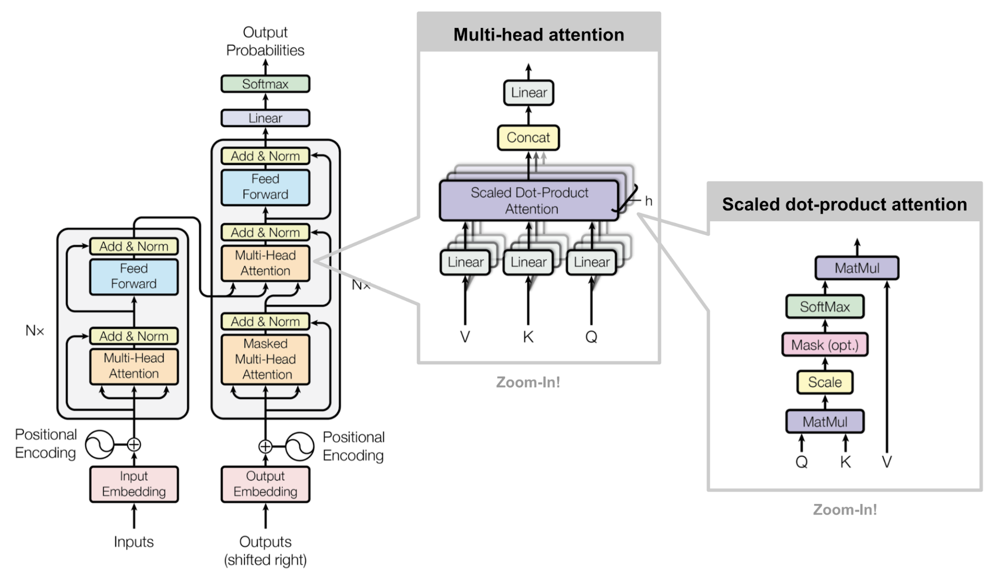

#### 1，相关工作

`CNN`  的的卷积核窗口大小有限，每次只能看比较短的部分序列，但是它的多通道机制被认为可以去识别多模式，`transformer` 论文参考这个机制，在 `attention` 的机制进一步引出了 `Muti-Head Attention`，来模拟卷积层的多输出通道效果。

`Self-attention` 在 `transformer` 论文之前已经有人提出，但 `transformer` 是第一个只依赖自注意力机制(self-attnetion)来实现 `encoder-decoder` 架构的模型。 

#### 2，模型架构

（直到 GPT 出来之前）大多数有竞争力的神经序列转换模型都是采用编码器-解码器结构，transformer 模型也不例外。

编码器将输入的符号表示序列 ($x_1,x_2,…,x_n$) 映射为一个连续表示序列 ($z_1,z_2,…, z_n$)。得到编码器输出序列 $z$ 后，解码器逐个元素的生成符号的输出序列 ($y_1,y_2…,y_m$)。解码器输出是自回归的，将当前轮的输出和输入拼接，作为下一轮的输入。

`Transformer` 的基本组件是: `point-wise`、`self-attention`、`add & norm`、`feed forward`、`linear`、`softmax`。

为了方便残差连接，模型中的所有子层 `Sub Layer` 以及嵌入层 `Embedding Layer` 都生成维度为 $d_{model} = 512$ 的输出向量。

#### 3，如何理解 Layer Norm

`NLP/Transformer` 模型的输入是**三维向量**，`batch`、句子序列长度 $n$、单词映射为 `embedding vector` 都分别表示为一个维度。

`Batch norm` 和 `layer norm` 的区别一句话总结就是 `bn` 是切特征，`ln` 是切样本。

* `BN`: 对于每个特征维度，计算它在整个批次中的均值和标准差，然后对该特征进行归一化。
* `LN`: 对每个样本单独计算其所有特征的均值和标准差，然后在该样本内进行归一化。



#### 4，Encoder 和 Decoder 结构

`Decoder` 同样由 $N = 6$ 个相同的层组成。`Decoder` 的 `attention` 是带掩码的，确保位置 $i$ 的预测只能依赖于小于 $i$ 的已知输出。

#### 5，从 attention 到 Scaled Dot-Product Attention 

1，首先，注意力函数可以描述为将一个查询（query）和一组键-值对（key-value pairs）映射到一个输出 output，$q$、$k$、$v$ 都是向量。输出都是对 `value` 进行加权求和得到的，每个 value 对应的权重 `weight` 是通过 $q$ 和 $k$ 之间的相似度计算得到。

2，将 q 和 k 的内积作为相似度（Dot-Product），然后除以向量的长度 $\sqrt{d_k}$（Scaled），结果再应用 `softmax` 函数，就会得到 $n$ 个非负且相加求和等于 $1$ 的权重向量，最后将权重应用于 value，就得到了最终输出 output。

**余弦相似度常用来比较两个向量的相似度（距离）**，伪代码如下：
```bash
CosineSimilarity = sum(x[i]*y[i])/(sqrt(sum(x[i]*x[i]))*sqrt(sum(y[i]*y[i])))。
```

实际中，为了方便计算，会同时对一组查询（queries）计算注意力函数，将 q、k、v 都是构建成矩阵 $Q$、$K$、$V$（ 维度相等），涉及到两个矩阵乘法。

作者提出的注意力机制算法跟之前的 Dot-Product Attentio 相比就是单纯多了 Scaled，除以 $\sqrt{d_k}$ 是为了防止梯度过小不利模型训练。

另外 decoder 模块的 attention  多了一个 `Mask`，实际是第 $t$ 时刻的 $q$ 只能看前面阶段的对应的 $(k, v)$ 对，计算当中表现就是对于 $q_t$ 和 $k_t$ 及其之后的那些权重值都替换成一个极大的负数，这样经过 `softmax` 后（做指数 $e^{w_t}$），对应位置的 $v$ 就变成了 0。 

#### 6，Multi-Head Attention

`Scaled Dot-Product Attention` 是不带任何参数的！

与其做单个的注意力函数，不如将 $Q$、$K$、$V$ 投影到一个**低维度**、投影 $h$ 次，然后再做 $h$ 次的自注意力函数，并将这 $h$ 个函数的输出拼接在一起，最后再次进行线性投影回来。

$$\text{Multi-Head Attention} = Concat(head_1,….,head_h) W^o \\
\text{Where} \ \text{head}_i = Attention (QW_i^Q, KW_i^K, VW_i^V)$$

$Q$、$K$ 的线性(映射)层的权重维度是 $[d_\text{model}, d_k]$，$V$ 的线性(映射)层的权重维度是 $[d_{model}, d_v]$，输出线性(映射)层权重维度是 $[h*d_v, d_{model}]$。

作用：**多头注意力机制可以注意到不同子空间的信息，捕捉到更加丰富的特征信息，实现类似卷积核的多通道机制的效果**。



#### 7，Transformer 的三个 multi-head attention 的原理和作用



**原理**：
1. 解码器中的第二个注意力层，其查询 $q$ 来自前一层的解码器层，但 $k$、$v$ 来自于编码器最后一层的输出。
2. 编码器第一个注意力层：不考虑多头和线性投影层的情况，三个输入 $q$ $k$ $v$ 本质上都是一个东西，三个输入都是原始输入本身自己，输出就是输入本身的加权和，而权重又来源自己本身跟跟各个向量的相似度函数，所以也叫自注意力层（self-attention）。
3. 解码器的第一个注意力层：编码器的最终输出作为 key value 输入进来，解码器下一层的输出作为 query 输入进来。

**作用**：
1. `Self-Attention` (自注意力)：对于每个位置上的 token，Self-Attention 将其与序列中的所有其他位置进行关联，从而使模型能捕捉到句子内部的语义关系。
2. `Encoder-Decoder Attention` (编码器-解码器注意力)：允许解码器在生成下一个词时参考编码器的输出。这种机制实现了输入和输出序列之间的联系，是实现翻译等任务的关键所在。
3. `Masked Self-Attention` (掩码自注意力)：过掩码机制屏蔽掉序列中未来位置的 tokens，从而确保模型预测生成的每个 token 仅依赖于当前生成位置之前的 tokens。

从 nlp 角度理解 Attention + MLP: Attention 负责从全局的角度把整个序列的信息聚合起来(捕捉上下文信息 + 信息聚合)，然后用 MLP 做语义的转换。

#### 8，Embedding 和 Softmax 层

Embedding  层的作用学习一个长为 $d_{model}$ 的向量来表示 `token`，编码器和解码器的输入都需要 embedding 层，两个嵌入层和softmax之前的线性变换之间共享相同的权重矩阵重（维度都是一样的），并且将权重值乘以 \sqrt(d_model)。

学习 embedding 时，可能会把每个向量的 $L2\ norm$ 学得相对较小（维度越大权重值越小），乘以根号 d 后放大，使得和 PE 相加时在 scale 上匹配。

L2 归一化（L2 Norm）是一种将向量缩放到单位长度的操作，使得向量的模为1。对于一个给定向量  $\mathbf{v}$ ，L2 归一化后的向量 $\mathbf{\hat{v}}$，计算公式如下：

$$\mathbf{\hat{v}} = \frac{\mathbf{v}}{\|\mathbf{v}\|_2}$$

#### 9，Positional Encoding

`Attention` 层的输出本身是不具备时序信息的，因为其本质是 `value` 向量的一个加权和，而权重是 `query` 和 `key` 的距离，跟序列信息无关。把输入 `tokens` 位置打乱，`attention` 的输出向量的所有元素的值大小不会变化，只有元素位置的变化，这显然不符合直觉。

而 Position encoding 层的作用是使得生成的 embedding vectors 值跟位置相关（加入时序信息），更符合人类文字的意义（文字的位置打乱，相应语义肯定会变化）。它的做法是将位置信息编码为向量，并将这些向量加到输入的嵌入向量中。Positional Encoding 通常通过以下公式计算：

$$PE(pos, 2i) = \sin \left(pos/10000^{2i/d}\right) \\
PE(pos, 2i+1) = \cos \left(pos/10000^{2i/d}\right)$$

#### 10，为什么使用 self-attention!

比较了四种不同的层： self-attention、rnn、cnn、self-attention (restricted)，分别比较了计算复杂度FLOPs、顺序操作（并行度）、最大路径长度。

#### 参考资料

- [李沐读论文-transformer](https://www.bilibili.com/video/BV1pu411o7BE/?spm_id_from=333.788&vd_source=69e98dbaea70afc6b62d55a86d59e408)