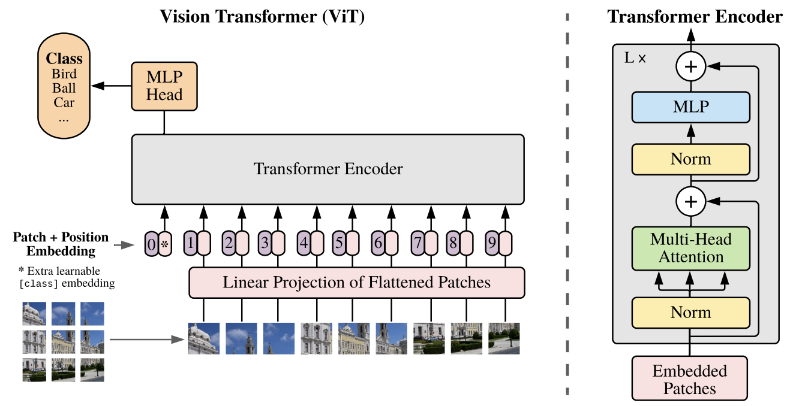

- [简介](#简介)
- [ViT 模型结构](#vit-模型结构)
  - [ViT block 组成](#vit-block-组成)
  - [输入切分为多个 path](#输入切分为多个-path)
- [代码实现](#代码实现)
- [参考资料](#参考资料)

## 简介

META 于 2020 年发表 `DETR` 论文，紧跟着谷歌从**特征编码的角度深入研究 Transformer 在视觉表征层面的学习能力**，进而提出了 Vision Transformer (`ViT`) 模型。模型结构比较简单，是自注意力机制和前馈网络的直接堆叠，只使用到了 Transformer 中的 encoder 结构。

`ViT` 原论文中最核心的结论是，当拥有足够多的数据进行预训练的时候，ViT 的表现就会超过 CNN，突破 transformer 缺少归纳偏置(一种先验知识)的限制，可以在下游任务中获得较好的迁移效果。

归纳偏置（inductive bias），是一种先验知识，即提前做好的假设。`CNN` 具有两种归纳偏置：
1. **局部性**（locality/two-dimensional neighborhood structure），即图片上相邻的区域具有相似的特征；
2. **平移不变形**（translation equivariance）， $f(g(x)) = g(f(x))$，其中 $g$ 代表卷积操作，$f$ 代表平移操作。

## ViT 模型结构



模型概述：作者将输入的图像划分为固定大小的图像块，对**每个图像块**都进行线性嵌入，添加位置嵌入，并将生成的向量序列输入到标准的 Transformer 编码器中。为了进行分类，参考前人经验，使用标准方法，即**在序列中添加一个额外的可学习“分类令牌”**。

### ViT block 组成

一个 `ViT block` 由以下 5 部分组成：

1. `Patch Embeddings`: 将输入图像划分为固定大小的补丁（patch），每个 patch 被展平为一个向量，并通过一个线性投影层（相当于将 patch 转换为 token embedding），嵌入的维度通常设为 768。
2. `Position Embeddings`: 添加位置编码（positional embedding），因为 Transformer 本身不具有处理图像空间信息的能力，位置编码能帮助模型了解每个 patch 在图像中的位置。
3. `Transformer Encoder`: 与 NLP 中的 Transformer 类似，包括多个堆叠的 Transformer blocks。每个 block 包含以下两部分：
   - Multi-Head Self Attention (MHSA): 允许每个 patch 关注其他 patch 的信息。
   - Feed-Forward Network (FFN): 一个两层的全连接网络，其中使用新的激活函数（`GELU`）。
4. `Classification Head`: 将 Transformer Encoder 的输出（通常是第一个 token）传入全连接层（MLP Head）以生成最终的分类输出。
5. `Layer Normalization and Skip Connections`: 在每个子层之后使用层归一化（Layer Normalization）和残差连接（skip connections）。

### 输入切分为多个 path

ViT 将输入图片分为多个 patch（`16x16`），再将每个 patch 投影为固定长度的向量送入 Transformer，后续encoder 的操作和原始 Transformer 中完全相同。另外，对于图片分类问题，在输入序列中加入一个特殊的 token，该 token 对应的输出即为最后的预测类别。

举个例子来理解 patch embedding 过程: 假设输入图片大小为 $224 \times224$，path 大小为 $16\times 16$，则每张图片都会生成 $(224\times224)/(16\times16) = 196$ 个 patch，类似于 transformer 模型的输入序列长度为 196。每个 patch 维度大小 = $16\times 16\times 3 = 768$，类似于每个 `token` 映射成的向量长度为 768，输入序列会加上一个特俗字符 `cls`，因此最终的输入序列维度 = $197\times 768$（一共有 197 个token）。线性投射层的维度为 $768\times N (N=768)$，因此输入通过**线性投影层**之后的维度依然为 $197\times 768$。到此，我们详细的解析了通过 `patch embedding` 将一个视觉分类问题转换为 `seq2seq` 的问题。

## 代码实现

代码来源-[github 仓库链接](https://github.com/lucidrains/vit-pytorch/blob/main/vit_pytorch/vit.py)：

```python
import torch
from torch import nn

from einops import rearrange, repeat
from einops.layers.torch import Rearrange

# helpers
def pair(t):
    return t if isinstance(t, tuple) else (t, t)

# classes
class FeedForward(nn.Module):
    def __init__(self, dim, hidden_dim, dropout = 0.):
        super().__init__()
        self.net = nn.Sequential(
            nn.LayerNorm(dim),
            nn.Linear(dim, hidden_dim),
            nn.GELU(),
            nn.Dropout(dropout),
            nn.Linear(hidden_dim, dim),
            nn.Dropout(dropout)
        )

    def forward(self, x):
        return self.net(x)

class Attention(nn.Module):
    def __init__(self, dim, heads = 8, dim_head = 64, dropout = 0.):
        super().__init__()
        inner_dim = dim_head *  heads
        project_out = not (heads == 1 and dim_head == dim)

        self.heads = heads
        self.scale = dim_head ** -0.5

        self.norm = nn.LayerNorm(dim)

        self.attend = nn.Softmax(dim = -1)
        self.dropout = nn.Dropout(dropout)

        self.to_qkv = nn.Linear(dim, inner_dim * 3, bias = False)

        self.to_out = nn.Sequential(
            nn.Linear(inner_dim, dim),
            nn.Dropout(dropout)
        ) if project_out else nn.Identity()

    def forward(self, x):
        x = self.norm(x)

        qkv = self.to_qkv(x).chunk(3, dim = -1)
        q, k, v = map(lambda t: rearrange(t, 'b n (h d) -> b h n d', h = self.heads), qkv)

        dots = torch.matmul(q, k.transpose(-1, -2)) * self.scale

        attn = self.attend(dots)
        attn = self.dropout(attn)

        out = torch.matmul(attn, v)
        out = rearrange(out, 'b h n d -> b n (h d)')
        return self.to_out(out)

class Transformer(nn.Module):
    def __init__(self, dim, depth, heads, dim_head, mlp_dim, dropout = 0.):
        super().__init__()
        self.norm = nn.LayerNorm(dim)
        self.layers = nn.ModuleList([])
        for _ in range(depth):
            self.layers.append(nn.ModuleList([
                Attention(dim, heads = heads, dim_head = dim_head, dropout = dropout),
                FeedForward(dim, mlp_dim, dropout = dropout)
            ]))

    def forward(self, x):
        for attn, ff in self.layers:
            x = attn(x) + x
            x = ff(x) + x

        return self.norm(x)

class ViT(nn.Module):
    def __init__(self, *, image_size, patch_size, num_classes, dim, depth, heads, mlp_dim, pool = 'cls', channels = 3, dim_head = 64, dropout = 0., emb_dropout = 0.):
        super().__init__()
        image_height, image_width = pair(image_size)
        patch_height, patch_width = pair(patch_size)

        assert image_height % patch_height == 0 and image_width % patch_width == 0, 'Image dimensions must be divisible by the patch size.'

        num_patches = (image_height // patch_height) * (image_width // patch_width)
        patch_dim = channels * patch_height * patch_width
        assert pool in {'cls', 'mean'}, 'pool type must be either cls (cls token) or mean (mean pooling)'

        self.to_patch_embedding = nn.Sequential(
            Rearrange('b c (h p1) (w p2) -> b (h w) (p1 p2 c)', p1 = patch_height, p2 = patch_width),
            nn.LayerNorm(patch_dim),
            nn.Linear(patch_dim, dim),
            nn.LayerNorm(dim),
        )

        self.pos_embedding = nn.Parameter(torch.randn(1, num_patches + 1, dim))
        self.cls_token = nn.Parameter(torch.randn(1, 1, dim))
        self.dropout = nn.Dropout(emb_dropout)

        self.transformer = Transformer(dim, depth, heads, dim_head, mlp_dim, dropout)

        self.pool = pool
        self.to_latent = nn.Identity()

        self.mlp_head = nn.Linear(dim, num_classes)

    def forward(self, img):
        x = self.to_patch_embedding(img)
        b, n, _ = x.shape

        cls_tokens = repeat(self.cls_token, '1 1 d -> b 1 d', b = b)
        x = torch.cat((cls_tokens, x), dim=1)
        x += self.pos_embedding[:, :(n + 1)]
        x = self.dropout(x)

        x = self.transformer(x)

        x = x.mean(dim = 1) if self.pool == 'mean' else x[:, 0]

        x = self.to_latent(x)
        return self.mlp_head(x)
```

## 参考资料

- [AN IMAGE IS WORTH 16X16 WORDS: TRANSFORMERS FOR IMAGE RECOGNITION AT SCALE](https://arxiv.org/pdf/2010.11929)
- [ViT（Vision Transformer）解析](https://zhuanlan.zhihu.com/p/445122996)