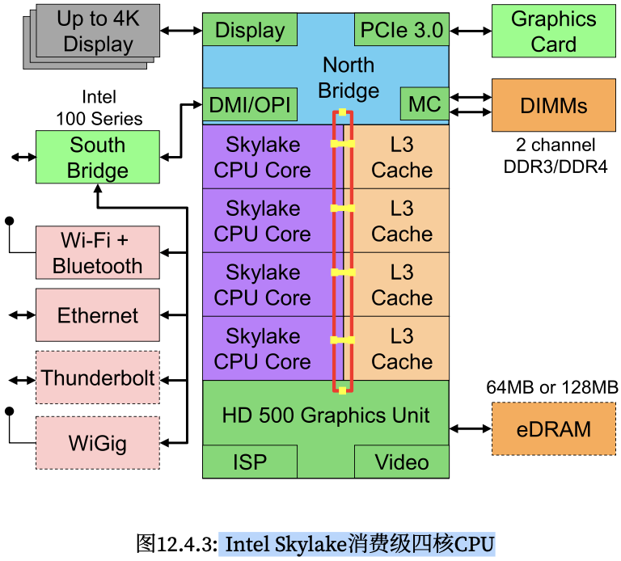
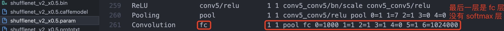

- [一，依赖库知识速学](#一依赖库知识速学)
  - [aarch64](#aarch64)
  - [OpenMP](#openmp)
  - [AVX512](#avx512)
  - [submodule](#submodule)
  - [apt upgrade](#apt-upgrade)
- [二，硬件基础知识速学](#二硬件基础知识速学)
  - [2.1，内存](#21内存)
  - [2.2，CPU](#22cpu)
- [三，ncnn 推理模型](#三ncnn-推理模型)
  - [3.1，shufflenetv2 模型推理解析](#31shufflenetv2-模型推理解析)
  - [3.2，网络推理过程解析](#32网络推理过程解析)
  - [3.3，模型推理过程总结](#33模型推理过程总结)
- [参考资料](#参考资料)

## 一，依赖库知识速学

### aarch64

`aarch64`，也被称为 ARM64，是一种基于 `ARMv8-A` 架构的 `64` 位指令集体系结构。它是 ARM 体系结构的最新版本，旨在提供更好的性能和能效比。与先前的 `32` 位 `ARM` 架构相比，aarch64 具有更大的寻址空间、更多的寄存器和更好的浮点性能。

在 Linux 系统终端下输入以下命令，查看 `cpu` 架构。

```bash
uname -m # 我的英特尔服务器输出 x86_64，m1 pro 苹果电脑输出 arm64
```
### OpenMP

`OpenMP`（Open Multi-Processing）是一种基于共享内存的并行编程 API，用于编写多线程并行程序。使用 `OpenMP`，程序员可以通过在程序中**插入指令**来指示程序中的并行性。这些指令是以 `#pragma` 开头的编译指示符，告诉编译器如何并行化代码。

```cpp
#include <stdio.h>
#include <omp.h>

int main() {
    int i;
    #pragma omp parallel for
    for(i = 0; i < 10; i++) {
        printf("Thread %d executing iteration %d\n", omp_get_thread_num(), i);
    }
    return 0;
}
```

### AVX512

`AVX` 全称是 Advanced Vector Extension，高级矢量扩展，用于处理 `N` 维数据的，例如 `8` 维及以下的 `64` 位双精度浮点矢量或 `16` 维及以下的单精度浮点矢量。

`AVX512` 是 `SIMD` 指令（单指令多数据），`x86` 架构上最早的 SIMD 指令是 128bit 的 `SSE`，然后是 256bit 的 AVX/AVX2，最后是现在 512bit 的 AVX512。

### submodule

github submodule（子模块）允许你将一个 Git 仓库作为另一个 Git 仓库的子目录。 它能让你将另一个仓库克隆到自己的项目中，同时还保持提交的独立。

### apt upgrade

- `apt update`：只检查，不更新（已安装的软件包是否有可用的更新，给出汇总报告）。
- `apt upgrade`：更新已安装的软件包。

## 二，硬件基础知识速学
### 2.1，内存

`RAM`（随机访问存储）的一些关键特性是带宽(`bandwidth`)和延迟(`latency`)。

### 2.2，CPU

中央处理器(central processing unit，`CPU`)是任何计算机的核心，其由许多关键组件组成:
- **处理器核心** (processor cores): 用于执行机器代码的。
- **总线**（bus）: 用于连接不同组件(注意，总线会因为处理器型号、 各代产品和供应商之间的特定拓扑结构有明显不同)
- **缓存**(cache): 一般是三级缓（L1/L2/L3 cache），相比主内存实现更高的读取带宽和更低的延迟内存访问。

现代 CPU 都包含向量处理单元，都提供了 `SIMD` 指令，可以在单个指令中同时处理多个数据，从而支持高性能线性代数和卷积运算。这些 `SIMD` 指令有不同的名称: 在 ARM 上叫做 NEON，在 x86 上被称 为AVX2156。

一个典型的 Intel Skylake 消费级四核 CPU，其核心架构如下图所示。



## 三，ncnn 推理模型

### 3.1，shufflenetv2 模型推理解析

这里以分类网络 shufflenetv2 为例，分析如何使用 `ncnn` 框架模型推理。源码在 `ncnn/examples/shufflenetv2.cpp`文件中，程序主要分为两个函数，分别是 `detect_shufflenetv2()` 和 `print_topk()`。前者用于运行图片分类网络，后者用于输出前 N 个分类结果。代码流程总结如下:

1. 在 `detect_shufflenetv2` 函数中，主要使用了 `ncnn::Net` 类进行模型加载和推理，主要流程如下：
   - 加载模型参数和模型二进制文件。
   - 将输入图片 `cv::Mat` 格式转换为 `ncnn::Mat` 格式，同时进行 resize 和归一化操作。
   - 创建 `ncnn::Extractor` 对象，并设置输入和输出。
   - 进行推理计算，得到分类输出结果。
   - 对输出结果进行 `softmax` 操作。
   - 将输出结果转换为 vector<float> 类型的数据，存储到 cls_scores 中。

2. 调用 `print_topk` 函数输出 cls_scores 的前 `topk` 个类别及其得分，具体实现步骤如下：
   - 定义一个向量 `std::vector<std::pair<float, int>> vec`，其元素类型为 `<float, int>`，其中第一个元素为分类得分，第二个元素为该分类的索引。
   - 遍历分类模型输出结果 `cls_scores`，将其与索引值组成一个 `<float, int>` 类型的元素，放入向量 `vec` 中。
   - 使用 `std::partial_sort()` 函数，将向量 `vec` 进行部分排序，按照得分从大到小的顺序排列。
   - 遍历排好序的向量 `vec`，输出前 `topk` 个元素的索引和得分值。

3. 最后主函数 main 中先调用 cv::imread 函数完成图像的读取操作，而后调用 `detect_shufflenetv2` 和 `print_topk` 函数，完成 shufflenetv2 网络推理和图片分类结果概率值输出的操作。

`print_topk` 函数代码及其注释如下:

```cpp
// 定义函数，输入为一个向量 cls_scores 和需要输出的 topk 数量
static int print_topk(const std::vector<float>& cls_scores, int topk)
{
    // 1，定义一个向量 vec，其元素类型为 <float, int>，用于存储分类得分和索引值
    int size = cls_scores.size();
    std::vector<std::pair<float, int> > vec;
    vec.resize(size);

    // 2，遍历分类得分，将其与索引值组成 <float, int> 元素，并存入向量 vec 中
    for (int i = 0; i < size; i++)
    {
        vec[i] = std::make_pair(cls_scores[i], i);
    }

    // 3，使用 std::partial_sort() 函数，将向量 vec 进行部分排序，按照得分从大到小的顺序排列
    std::partial_sort(vec.begin(), vec.begin() + topk, vec.end(),
                      std::greater<std::pair<float, int> >());

    // 4，遍历排好序的向量 vec，输出前 topk 个元素的索引和得分值
    for (int i = 0; i < topk; i++)
    {
        float score = vec[i].first;
        int index = vec[i].second;
        fprintf(stderr, "%d = %f\n", index, score);
    }

    return 0;
}
```

值得注意的是，虽然调用 `print_topk` 函数得到了最高得分及其类别索引，但还需要**将类别索引转换为类别字符串**。这通常需要预先定义一个包含所有类别字符串的向量 `class_names`，并将其与类别索引一一对应。另外， `class_names` 的定义需与模型训练时的类别标签一致，否则会出现类别不匹配的情况。

最后，实际跑下 sample 看下运行结果，这里模型用的是 imagenet 训练的 shufflenetv2 模型，然后用编译好的 shufflenetv2 程序去跑测试图片，输入图片和程序运行结果如下:


```bash
/ncnn/build/examples# ./shufflenetv2 demo.jpeg
270 = 0.455700
279 = 0.303561
174 = 0.057936
```

输入图像的类别索引是 `270`，参考文章[ImageNet 2012 1000分类名称和编号](https://zhuanlan.zhihu.com/p/315368462)，可知该类别是 dog（狗）。

### 3.2，网络推理过程解析

下面再看下**网络推理**代码的整体流程解析：

1，首先需要 `Net` 对象，然后使用 `load_param` 和 `load_bin` 两个接口载入模型结构参数和模型权重参数文件:

```cpp
// 为了方便阅读，和官方代码比有所删减
ncnn::Net shufflenetv2;
shufflenetv2.load_param("shufflenet_v2_x0.5.param")
shufflenetv2.load_model("shufflenet_v2_x0.5.bin")
```

2，定义好 Net 对象后，可以调用相应的 create_extractor 接口创建 `Extractor`，Extractor 对象是完成图像数据输入和模型推理的类，虽然它也是对 Net 的相关接口做了封装。

```cpp
ncnn::Extractor ex = shufflenetv2.create_extractor();
ex.input("data", in);
ncnn::Mat out;
ex.extract("fc", out); // 提取网络输出结果到 out 矩阵中
```

3，模型推理结果后处理，对网络推理结果执行 softmax 操作得到概率矩阵，而后转换为 vector<float> 类型的数据。

```cpp
// 对输出结果矩阵进行 softmax 操作
// manually call softmax on the fc output
// convert result into probability
// skip if your model already has softmax operation
{
    ncnn::Layer* softmax = ncnn::create_layer("Softmax");

    ncnn::ParamDict pd;
    softmax->load_param(pd);

    softmax->forward_inplace(out, shufflenetv2.opt);

    delete softmax;
}

// 将softmax输出结果转换为 vector<float> 类型的数据，存储到 cls_scores 中
out = out.reshape(out.w * out.h * out.c);

cls_scores.resize(out.w);
for (int j = 0; j < out.w; j++)
{
    cls_scores[j] = out[j];
}
```

这里之所以需要手动调用 softmax 层，是因为官方提供的 shufflenetv2 模型结构文件的最后一层是 `fc` 层，没有 `softmax` 层。



值得注意的是，ncnn::Mat 类型默认采用的是 NCHW （通道在前，即 Number-Channel-Height-Width）的格式。在常见的分类任务中，ncnn 网络输出的一般是一个大小为 [1, 1, num_classes] 的张量，其中第三个维度的大小为类别数，上述代码即 `out.w` 表示类别数量，而 out.h 和 out.c 都为 1。

### 3.3，模型推理过程总结

1，模型推理过程可总结为下述步骤:

1. **输入数据准备**：输入数据可以是图像、文本或其他形式的数据。在ncnn中，输入数据通常被转化为多维张量，其中第一维是数据的数量，其余维度表示数据的形状和尺寸。
2. **加载模型参数和模型权重文件**：通过 Net 类的 `load_param` 和 `load_bin` 两个接口实现。
3. **模型前向计算**：从模型的输入层开始，逐层计算模型的输出。每个层接收上一层的输出作为输入，并执行特定的算子，比如：卷积、池化、全连接等。在逐层计算过程中，模型各层的参数和权重数据也被用于更新模型的输出。最终，模型的输出被传递到模型的输出层。
4. **输出数据解析**：模型的输出数据通常被转化为外部应用程序可用的格式。例如，在图像分类任务中，模型的输出可以是一个**概率向量**，表示输入图像属于每个类别的概率分布。在ncnn中，输出数据可以转化为多维张量或其他形式的数据。

2，ncnn 加载/解析模型参数和权重文件的步骤还是很复杂的，可总结如下:

1. 读取二进制参数和权重文件，并存储为字节数组。
2. 解析字节数组中的头部信息，包括文件版本号、模型结构信息等。
3. 解析层级信息，包括每个层的**名称、类型、输入输出维度**等信息，并保存在 `blobs` 中，Blob 类由：网络层 name、**依赖层索引**：producer 和 consumer，及上一层和下一网络层索引、**网络层 shape** 组成。
4. 解析每个层的参数和权重数据，将其存储为矩阵或向量。

## 参考资料

1. [Git submodule使用指南（一）](https://juejin.cn/post/6844903812524670984)