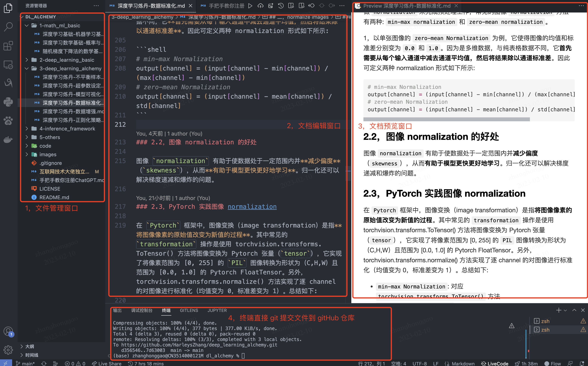
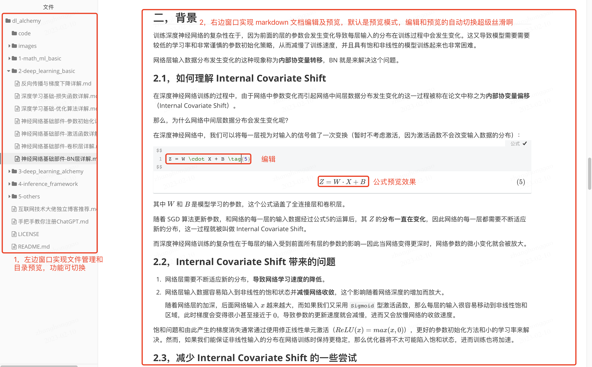
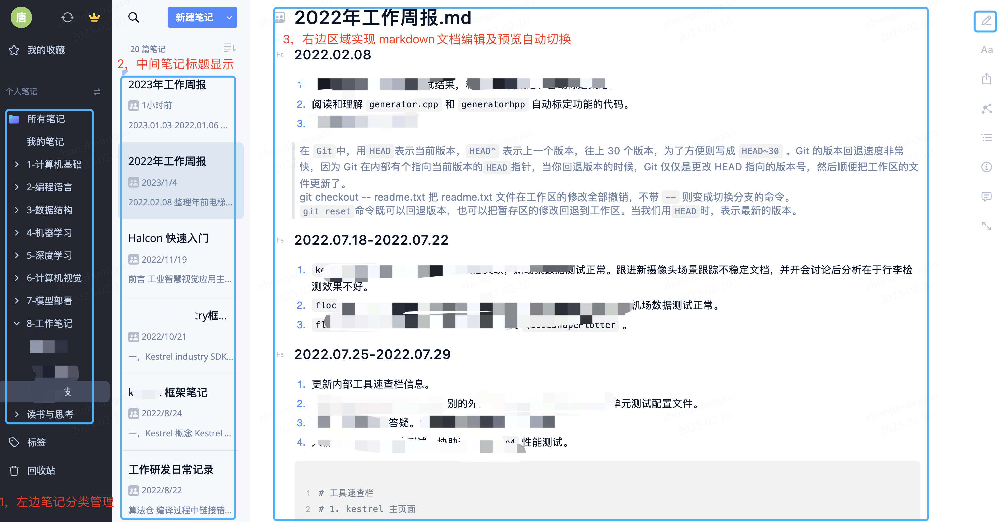
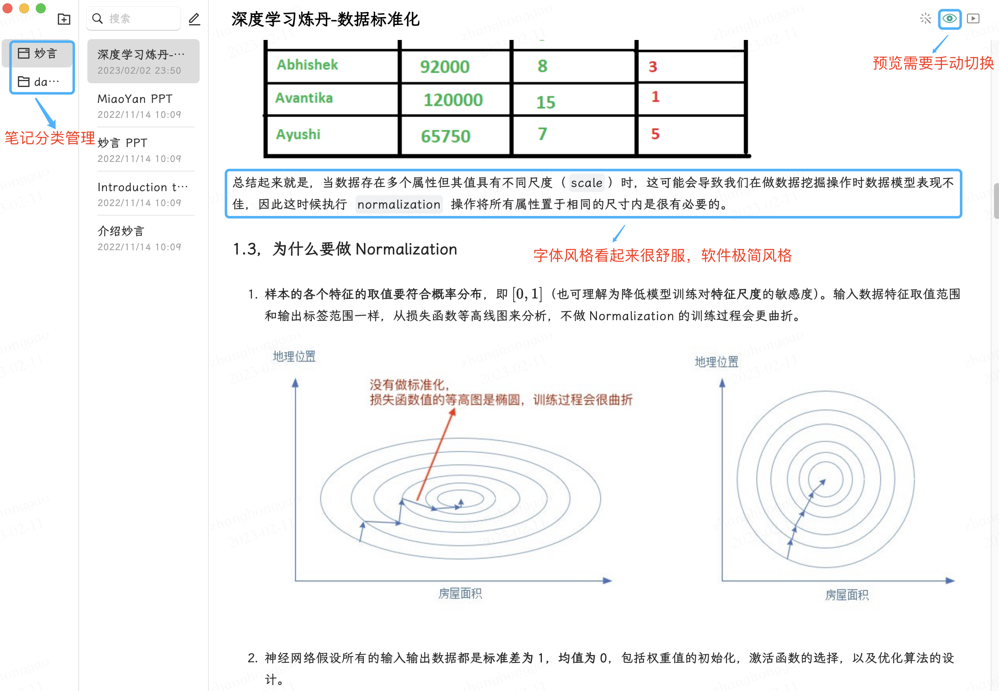

对于程序员的文档/笔记创作软件，我主要推荐三个：

### 1，[VScode + markdown 相关插件](https://link.zhihu.com/?target=https%3A//code.visualstudio.com/)

可左边窗口编辑文档，右边预览，然后在终端中 git 提交到github，非常适合用于创建 github 笔记仓库项目。直接一个软件完成仓库文件管理、文档编辑预览以及文档 git 提交到 github 仓库。并且最重要的是可实现代码和文档在一个软件中管理、创作。

### 2，[Typora](https://link.zhihu.com/?target=https%3A//typora.io/):
非常丝滑到 markdown 文档创作软件，启动速度快，文档编辑也很舒服，现在是我的**主力**文档创作工具。走的是 md 文件仓库管理的风格。

### **3，**[为知笔记](https://link.zhihu.com/?target=https%3A//www.wiz.cn/zh-cn/)
优点是支持云同步、适配所有平台以及完美支持 markdown 语法和 latex 公式，但缺点就是软件启动速度好慢啊，最新版本比以前也臃肿了很多，走的个人笔记管理、创作工具的风格。因此我推荐可用来记录个人生活、工作笔记，技术文档创作还是前面两个为主。

### **4，**[妙言](https://link.zhihu.com/?target=https%3A//miaoyan.app/)
超级简洁，文档预览主题很有特色，缺点很明显，latex 公式支持的很不好，文档预览不够丝滑，略卡，可能是个人独立开发的原因。

另外，聊下知识/博客网站，国内的话个人觉得中文博客质量排序如下：个人独立博客站 > 知乎（只看文章比较好问题的回答） >= 技术类公众号 > 掘金 >= 博客园 > CSDN >= 51CTO >= 各大云社区厂商的社区博客。

如果英语稍微好一点，**我强烈推荐直接看英文资料啊**，国内中文博客真的氛围、质量不太好。

> PS: CSDN 现在知识类的文章基本没法看，初学者前期看的书籍、博客质量的高低很大可能决定了你以后未来的高度，我之前吃过这个亏，没有找到最好的学习资料和看高质量博客。