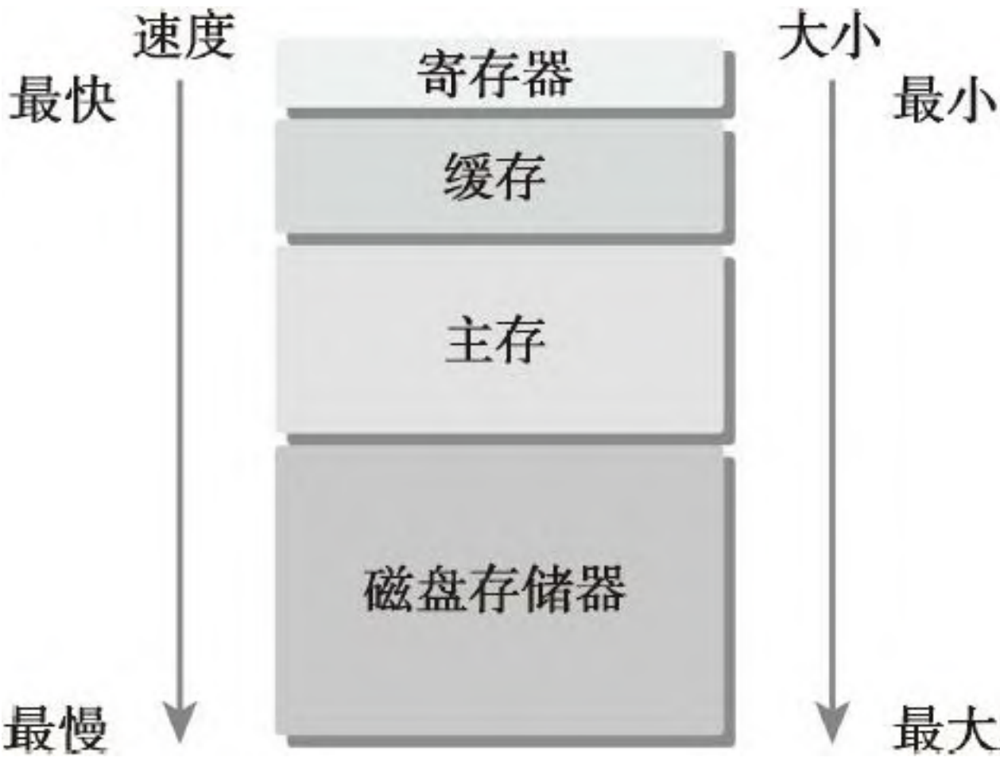
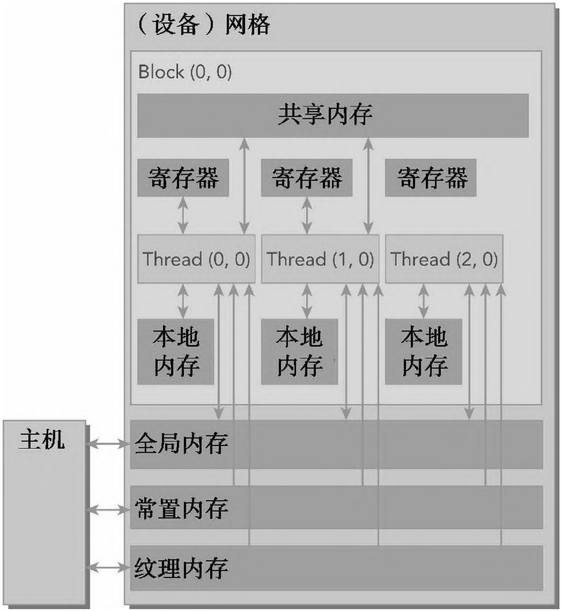
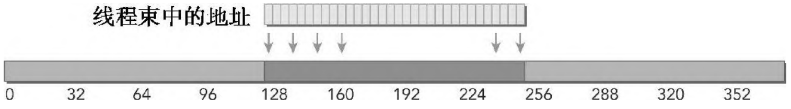
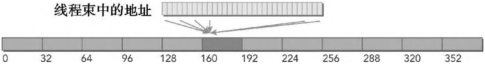
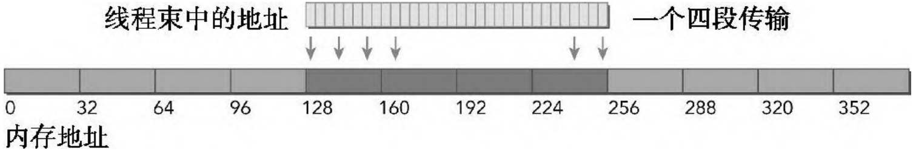

- [一 CUDA 内存模型概述](#一-cuda-内存模型概述)
  - [1.1 寄存器](#11-寄存器)
  - [1.2 本地内存](#12-本地内存)
  - [1.3 共享内存](#13-共享内存)
  - [1.4 全局内存](#14-全局内存)
  - [1.5 GPU 缓冲](#15-gpu-缓冲)
  - [1.6 CUDA 变量声明总结](#16-cuda-变量声明总结)
- [二 内存管理](#二-内存管理)
  - [2.1 分配和释放内存函数](#21-分配和释放内存函数)
  - [2.2 内存传输](#22-内存传输)
  - [2.3 固定内存](#23-固定内存)
  - [2.4 零拷贝内存](#24-零拷贝内存)
  - [2.5 统一内存寻址](#25-统一内存寻址)
- [三 内存访问模式](#三-内存访问模式)
  - [3.1 对齐与合并访问](#31-对齐与合并访问)
  - [3.2 全局内存读取](#32-全局内存读取)
    - [3.2.1 缓冲加载](#321-缓冲加载)
    - [3.2.2 没有缓冲的加载](#322-没有缓冲的加载)
  - [3.3 全局内存写入](#33-全局内存写入)
  - [3.4 数组结构体（AoS）和结构体数组（SoA）](#34-数组结构体aos和结构体数组soa)
  - [3.5 如何提升内存性能](#35-如何提升内存性能)
- [参考资料](#参考资料)

前面我们学习了**线程是如何在 GPU 中执行的，以及如何通过操作线程束来优化核函数性能**，但是，核函数性能并不是只和线程束的执行有关，它还跟全局内存访问模式有关系。本文将剖析核函数与全局内存的联系及其对性能的影响。

## 一 CUDA 内存模型概述

额外知识：**归约操作**（Reduction Operation）是一种将多个数据值组合成一个单一值的运算。在并行计算中，归约操作通常用于将分散在不同处理器或计算节点上的数据（如梯度）汇总起来，以便进行全局计算或同步。归约操作可以是简单的，如求和（Sum）、求平均（Mean）、求最大值（Max）或求最小值（Min），也可以是更复杂的自定义运算。

在现代 AI 加速器/GPU 设备中，内存管理对高性能计算影响很大，因为多数工作负载都被加载和存储数据的速度所限制，所以有大量低延迟、高带宽的内存对性能是十分有利的。

不止是 CPU 内存分层次，GPU 也分内存层次，离 CPU/GPU 越近，延迟越小，但相应容量也越小，如下图所示:



CUDA 内存模型提出了多种可编程内存的类型：
- 寄存器
- 共享内存
- 本地内存
- 常量内存
- 纹理内存
- 全局内存

下图是为这些内存空间的层次结构：



一个核函数中的线程都有自己私有的本地内存，一个线程块有自己的共享内存，对同一线程块中所有线程都可见，其内容持续线程块的整个生命周期。所有线程都可访问全局内存（也就是我们说的 gpu 显存）。

### 1.1 寄存器

**寄存器是 GPU上运行速度最快的内存空间**。核函数中声明的一个没有其他修饰符的自变量，通常存储在寄存器中。

寄存器变量对于每个线程来说都是私有的，一个核函数通常使用寄存器来保存需要频繁访问的线程私有变量。**在核函数中使用较少的寄存器将使在 SM 上有更多的常驻线程块**，而每个SM上并发线程块越多，使用率和性能就越高。

使用以下命令**输出核函数使用的寄存器数量、共享内存的字节数以及每个线程所使用的常量内存的字节数**。

```bash
nvcc -Xptxas -v -abi=no your_cuda_file.cu
```

### 1.2 本地内存

核函数中符合存储在寄存器中但不能进入被该核函数分配的寄存器空间中的变量将溢出到本地内存中。“本地内存”这一名词是有歧义的：溢出到本地内存中的变量本质上与全局内存在同一块存储区域。

### 1.3 共享内存

在核函数中使用修饰符 `__shared__` 修饰的变量存放在共享内存中。**共享内存是片上内存，与本地内存或全局内存相比，它具有更高的带宽和更低的延迟**。它的使用类似于CPU一级缓存，但它是可编程的。

每一个 `SM` 都有一定数量的由线程块 `block` 分配的共享内存，注意不要过量使用共享内存，否则会不经意间限制活跃线程束的数量。

共享内存是线程之间相互通信的基本方式。一个块内的线程通过使用共享内存中的数据可以相互合作

SM 中的一级缓存和共享内存都使用 64KB 的片上内存，通过静态划分，但在运行时可以通过如下指令进行动态配置：

```cpp
__host__ ​cudaError_t cudaFuncSetCacheConfig (const void* func, cudaFuncCache cacheConfig)
```

为核函数划分片上内存，通过 cacheConfig 设置函数 func 的首选缓存配置，支持的缓存配置包括：
- cudaFuncCachePreferNone：不偏好共享内存或 L1（默认）
- cudaFuncCachePreferShared：偏好较大的共享内存和较小的 L1 缓存
- cudaFuncCachePreferL1：偏好较大的 L1 缓存和较小的共享内存
- cudaFuncCachePreferEqual：偏好大小相等的 L1 缓存和共享内存

### 1.4 全局内存

常量内存和纹理内存不常用，故跳过。

全局内存可以被任何 SM 访问，其贯穿 gpu 程序的整个生命周期。那么其如何使用呢？其实前面文章已经简单描述过其如何分配和释放。即在主机端使用 `cudaMalloc` 函数分配全局内存，使用 `cudaFree` 函数释放全局内存，指向全局内存的指针作为参数传递给核函数。

### 1.5 GPU 缓冲

跟 CPU 缓存一样，GPU 缓存也是不可编程的内存。在 GPU 上有4种缓存：
- 一级缓
- 二级缓存
- 只读常量缓存
- 只读纹理缓存

每个 SM 都有一个一级缓存，所有的 SM 共享一个二级缓存。一级和二级缓存都被用来在存储本地内存和全局内存中的数据，也包括寄存器溢出的部分。

### 1.6 CUDA 变量声明总结

下表总结了 CUDA 变量声明和它们相应的存储位置、作用域、生命周期和修饰符。


## 二 内存管理

本节的重点在于如何使用 CUD 函数来显式地管理内存和数据移动：
- 分配和释放设备内存
- 在主机和设备之间传输数据

### 2.1 分配和释放内存函数

**cudaMalloc 和 cudaFree**

1, `cudaError_t cudaMalloc(void** devPtr, size_t size)`: 在设备内存中分配指定大小的全局内存。

**参数**：
- `devPtr`：指向设备内存指针的指针。
- `size`：要分配的内存字节数。

**返回值**：cudaSuccess（成功）或错误码。

2, `cudaError_t cudaFree(void* devPtr)`：释放之前通过 cudaMalloc 分配的设备内存。

**参数**：
- `devPtr`：要释放的设备内存指针。

**返回值**：cudaSuccess（成功）或错误码。

实例代码如下:

```cpp
#include <cuda_runtime.h>
#include <iostream>

int main() {
    int* d_array;
    size_t size = 10 * sizeof(int);

    // 分配设备内存
    cudaError_t err = cudaMalloc((void**)&d_array, size);
    if (err != cudaSuccess) {
        std::cerr << "Error allocating device memory: " << cudaGetErrorString(err) << std::endl;
        return -1;
    }

    // 使用设备内存
    // ...

    // 释放设备内存
    cudaFree(d_array);

    return 0;
}
```

### 2.2 内存传输

一旦分配好了全局内存，你就可以使用下列函数从主机向设备传输数据：

`cudaError_t cudaMemcpy(void* dst, const void* src, size_t count, cudaMemcpyKind kind)`

**功能**：在主机内存和设备内存之间、设备内存之间进行数据传输。

**参数**：
- `dst`：目标内存地址。
- `src`：源内存地址。
- `count`：要传输的字节数。
- `kind`：传输类型，可能的值包括：
  - cudaMemcpyHostToDevice（从主机到设备）
  - cudaMemcpyDeviceToHost（从设备到主机）
  - cudaMemcpyDeviceToDevice（设备到设备）
  - cudaMemcpyHostToHost（主机到主机）

**返回值**：cudaSuccess（成功）或错误码。

示例代码:
```cpp
#include <cuda_runtime.h>
#include <iostream>

int main() {
    int h_array[10];
    int* d_array;
    size_t size = 10 * sizeof(int);

    // 分配设备内存
    cudaMalloc((void**)&d_array, size);

    // 将主机数据复制到设备
    cudaMemcpy(d_array, h_array, size, cudaMemcpyHostToDevice);

    // 从设备复制数据到主机
    cudaMemcpy(h_array, d_array, size, cudaMemcpyDeviceToHost);

    // 释放设备内存
    cudaFree(d_array);

    return 0;
}
```

注意，CUDA 编程的一个基本原则应是**尽可能地减少主机与设备之间的传输**。

### 2.3 固定内存

CUDA 运行时允许你使用如下指令**直接分配固定主机内存**，这个函数分配了 count 字节的主机内存，**这些内存是页面锁定的并且对设备来说是可访问的**。

```cpp
cudaError_t cudaMallocHost(void** devPtr, size_t size)
```

由于固定内存能被设备直接访问，所以它能用比可分页内存高得多的带宽进行读写。固定主机内存必须通过下述指令来释放：

```cpp
cudaError_t cudaFreeHost(void* devPtr)
```

### 2.4 零拷贝内存

通常来说，主机不能直接访问设备变量，同时设备也不能直接访问主机变量。但有一个例外：零拷贝内存。主机和设备都可以访问零拷贝内存。

在 CUDA 核函数中使用零拷贝内存有以下几个优势。
- 当设备内存不足时可利用主机内存
- 避免主机和设备间的显式数据传输
- 提高 PCIe 传输率

零拷贝内存也是固定（不可分页）内存，该内存映射到设备地址空间中。你可以通过下列函数创建一个到固定内存的映射：
```cpp
cudaHostAlloc(void** pHost, size_t size, unsigned int flags)
```

**功能**：分配主机内存，支持页锁定（pinned）内存，以提高数据传输速度。

**参数**：
- pHost：指向主机内存指针的指针。
- size：要分配的内存字节数。
- flags：分配标志（例如 cudaHostAllocDefault、cudaHostAllocPortable、cudaHostAllocMapped）。
  - **`cudaHostAllocDefault`**：最常用的标志，适用于大多数内存分配需求。
  - **`cudaHostAllocPortable`**：使内存可以在不同的主机线程之间共享，但可能会有性能开销。
  - **`cudaHostAllocMapped`**：分配的内存可以映射到设备，使得设备可以直接读取和写入主机内存，减少了内存拷贝的开销。
  - **`cudaHostAllocWriteCombined`**：优化内存写操作，适合写操作频繁的场景。
  - **`cudaHostAllocCoherent`**：确保主机和设备之间内存的一致性，适用于需要频繁同步内存的应用。

这些标志可以根据具体的应用需求来选择使用，以优化内存分配和数据传输性能。

用 `cudaHostAlloc` 函数分配的内存必须用 `cudaFreeHost` 函数释放:
```cpp
cudaFreeHost(void* pHost)
```
**功能**：释放通过 cudaHostAlloc 分配的主机内存。
**参数**：
- `pHost`：要释放的主机内存指针。

使用下列函数获取映射到固定内存的设备指针：

```cpp
// 传回由 cudaHostAlloc 分配或由 cudaHostRegister 注册的映射到主机内存的设备指针。
__host__ ​cudaError_t cudaHostGetDevicePointer (void** pDevice, void* pHost, unsigned int  flags)
```
参数：
- `pDevice`：传回的映射内存的设备指针。
- `pHost`：请求映射的主机指针。
- `flags`：扩展标志（目前必须为0）

总结：如果想共享主机和设备端的少量数据，零拷贝内存可能会是一个不错的选择，因为它简化了编程并且有较好的性能。对于由 PCIe 总线连接的离散 GPU 上的更大数据集来说，零拷贝内存不是一个好的选择，它会导致性能的显著下降。

**对于通过 PCIe 总线将设备连接到主机的离散系统而言，零拷贝内存只在特殊情况下有优势**。

### 2.5 统一内存寻址

统一内存是一种逻辑上的概念，它既不是显存，也不是主机的内存，而是一种系统中的任何处理器（CPU 或 GPU）都可以访问，并能保证一致性的虚拟存储器。

统一内存中创建了一个托管内存池，内存池中已分配的空间可以用相同的内存地址（即指针）在CPU 和 GPU 上进行访问，这可以大大简化代码（直接减少了内存传输相关代码）。

统一内存寻址依赖于 `UVA` 的支持，但它们是完全不同的技术。UVA 为系统中的所有处理器提供了一个**单一的虚拟内存地址空间**。但是，UVA 不会自动将数据从一个物理位置转移到另一个位置，这是统一内存寻址的一个特有功能。

在统一内存之前，还有一种零复制内存（zero-copy memory）。它们都提供了一种统一的能被 CPU 和 GPU 都访问到的存储器，但零复制内存只是用主机内存作为存储介质，而统一内存可以根据需要自动的将数据放在一个最合适的地方（可以是主机，也可以是设备）。

使用下述的 CUDA 运行时函数动态分配托管内存：

```cpp
// 分配由统一内存系统自动管理的内存。
__host__ ​cudaError_t cudaMallocManaged (void** devPtr, size_t size, unsigned int  flags = cudaMemAttachGlobal)
```

## 三 内存访问模式

前面的内容讲过来 `CUDA` 执行模型的特点之一就是指令（内存读取或者计算）必须以线程束为单位进行发布和执行。

### 3.1 对齐与合并访问

核函数的内存请求通常是在 DRAM 设备和片上内存间以 128 字节或 32 字节内存事务来实现的。

对齐合并内存访问的理想状态是线程束从对齐内存地址开始访问一个连续的内存块。为了最大化全局内存吞吐量，为了组织内存操作进行对齐合并是很重要的。

### 3.2 全局内存读取

1，内存加载可以分为两类：
- **缓存加载**（启用一级缓存）
- 没有缓存的加载（禁用一级缓存）

2.内存加载的访问模式有如下特点：
- 有缓存与没有缓存：如果启用一级缓存，则内存加载被缓存。
- **对齐与非对齐**：如果内存访问的第一个地址是 32 字节的倍数，则对齐加载。
- **合并与未合并**：如果线程束访问一个连续的数据块，则加载合并。

#### 3.2.1 缓冲加载

下图所示为理想情况：**对齐与合并内存访问**。线程束请求的字节总数为 128 个字节中，所有线程请求的地址也都在 `128` 字节的缓存行范围内。完成内存加载操作只需要一个 `128` 字节的事务。总线的使用率为 `100%`，在这个事务中没有未使用的数据。



CPU 和 GPU 一级缓冲的区别：CPU 一级缓存优化了时间和空间局部性。GPU 一级缓存是专为空间局部性而不是为时间局部性设计的。频繁访问一个一级缓存的内存位置不会增加数据留在缓存中的概率。

#### 3.2.2 没有缓冲的加载

没有缓存的加载不经过一级缓存，它在内存段的粒度上是 `32` 个字节而非缓存池的粒度 128 个字节执行，其他定义一样。

下图说明了一种情况：线程束中所有线程请求相同的数据。地址落在一个内存段内，总线的利用率是请求的4字节/加载的32字节 ＝ 12.5%（> 4/128 = 3.125%），在这种情况下，非缓存加载性能也是优于缓存加载的性能。



### 3.3 全局内存写入

**存储操作在 32 个字节段的粒度上被执行**。内存事务可以同时被分为一段、两段或四段。例如，如果两个地址同属于一个 128 个字节区域，但是不属于一个对齐的 64 个字节区域，则会执行一个四段事务（也就是说，执行一个四段事务比执行两个一段事务效果更好）。

下图所示为理想情况：内存访问是对齐的，并且线程束里所有的线程访问一个连续的 128 字节范围。**内存存储/写入请求由一个四段事务实现**。



### 3.4 数组结构体（AoS）和结构体数组（SoA）

示例代码：

```cpp
// 结构体数组 SoA
struct Student {
    char name[50];
    int age;
    float grade;
};

struct Student students[3] = {
        {"Alice", 20, 88.5},
        {"Bob", 21, 91.0},
        {"Charlie", 19, 85.0}
    };

// 数组结构体 AoS
struct Matrix {
    int data[3][3];
};
```

许多并行编程范式，尤其是 `SIMD` 型范式，更倾向于使用 SoA。在 CUDAC 编程中也普遍倾向于使用 SoA，因为数据元素是为全局内存的有效合并访问而预先准备好的，而被相同内存操作引用的同字段数据元素在存储时是彼此相邻的。

### 3.5 如何提升内存性能

优化设备内存带宽利用率有两个目标：
1. **对齐及合并内存访问**，以减少带宽的浪费。
2. **足够的并发内存操作（即最大化执行线程束的数量）**，以隐藏内存延迟。实现并发内存访问最大化是通过以下方法：
  - 增加每个线程中执行独立内存操作的数量（减少线程间的共享内存访问、提升并行度、降低线程间竞争与冲突）。
  - 对核函数启动的执行配置进行实验，以充分体现每个 SM 的并行性。

GPU 中的内存带宽简单理解就是 **`SM` 访问设备内存的速度**。

## 参考资料

《CUDA C 编程权威指南》