- [一，GPU 多卡通信方式](#一gpu-多卡通信方式)
  - [1.1，PCIE](#11pcie)
  - [1.2，NVLINK](#12nvlink)
  - [1.3，NVSwitch](#13nvswitch)
  - [1.4，NVLINK 和 NVSwitch](#14nvlink-和-nvswitch)
- [二，多 GPU 的 NVLINK 互联拓扑结构](#二多-gpu-的-nvlink-互联拓扑结构)
  - [2.1，V100 拓扑互联结构](#21v100-拓扑互联结构)
  - [2.2，A100 拓扑互联结构](#22a100-拓扑互联结构)
    - [2.2.1， HGX A100 8-GPU 与 NVSwitch 连接-最快的解决方案](#221hgx-a100-8-gpu-与-nvswitch-连接-最快的解决方案)
    - [2.2.2，HGX A100 4-GPU 与 NVLink 连接以实现通用加速](#222hgx-a100-4-gpu-与-nvlink-连接以实现通用加速)
  - [2.3，A40 拓扑互联结构](#23a40-拓扑互联结构)
- [2.4，查看 GPU 拓扑结构](#24查看-gpu-拓扑结构)
  - [2.5，SXM 和 PCIE 模组连接方式的区别](#25sxm-和-pcie-模组连接方式的区别)
- [三，GPU 显存带宽](#三gpu-显存带宽)
  - [3.1，系统内存与设备内存](#31系统内存与设备内存)
- [四，带宽对 LLM 推理服务性能的影响总结](#四带宽对-llm-推理服务性能的影响总结)
- [参考资料](#参考资料)

## 一，GPU 多卡通信方式

**GPU 卡间互连带宽，指的是不同卡之间互连通信速度**。单机多卡内存和 GPU、GPU 和 GPU 之间互联可通过 `PCIE`、`NVLink`、`NVSwitch`； 多机多卡 GPU 之间（不同主机）、CPU 与 GPU 之间互联可通过 GPUDirect RDMA、IB/万兆以太网 + TCP/IP。

### 1.1，PCIE

PCI-Express(peripheral component interconnect express)是一种高速串行计算机扩展总线标准，它原来的名称为 “3GIO”，是由英特尔在 2001 年提出的，旨在替代旧的 PCI，PCI-X 和 AGP 总线标准。PCIe 属于高速串行点对点双通道高带宽传输，所连接的设备分配独享通道带宽，不共享总线带宽。

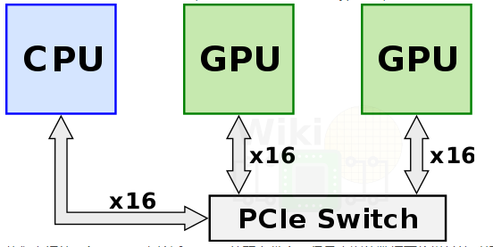

### 1.2，NVLINK

1，NVLink 1.0

其中 NVLink 是 NVIDIA `2016` 年推出的一种高速、**直接的 GPU 到 GPU 互联技术**，避免了数据通过 PCI Express 总线传输带来的瓶颈问题。单条 nvlink 是一种**双工双路信道**，其通过组合 32 条配线，从而在每个方向上可以产生 8 对不同的配对（$2bi * 8pair * 2wire = 32wire$），第一版的实现被称为 nvlink 1.0，与 P100 GPU一同发布。

一块 P100 上，集成了 4 条 NVLink 链路。每条链路具备双向共 40GB/s 的带宽，单个芯片可高达 `160GB/s` 的**双向互连带宽**。

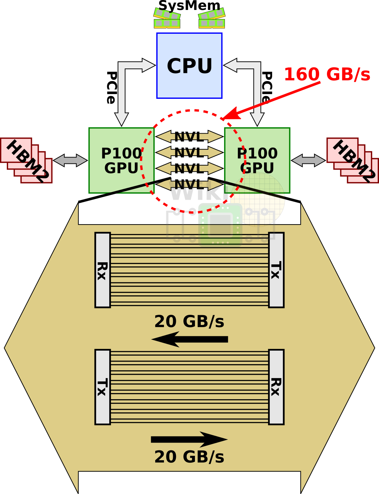

当我们说 NVLink 的双向带宽为 300 GB/s 时，这通常是指每个 NVLink 链路的总带宽（双向数据传输速率），而不是单个方向的带宽。比如，300 GB/s 的双向带宽是指 NVLink 在两个方向上的总带宽，另外，NVLink 链路是可以同时支持向前和向后的数据传输。

要理解**双向带宽**这个概念，可以想象一下高速公路。双向带宽就像是一个双向四车道的高速公路，每条车道都可以同时容纳车辆从两个方向行驶。在这个比喻中，车辆就是数据，而车道的宽度和数量决定了数据传输的容量。

2，NVLink2.0

NVLink2.0 与 V100 一同而来，NVLink2.0 提升了信号的传输率，从 20Gb/s 到了 25Gb/s ，使得每个连接通道达到 50G 的双向带宽，同时 NVLink 链数支持多达 6 路。链路数量增加、链路速度提升，这些举措让 V100 的总带宽从 p100 的 $160GB/s$ 提升到了 $300GB/s$（50*6=300）。

3，NVLink3.0

NVLink3.0 随着 Ampere 架构（A100 卡）一起发布。NVLink3.0 每条链路在每个方向上使用 $4$ 对差分信号线（4 条通道），单条链路在**每个方向**上提供 25GB/s 的带宽，同时链路总数增加到 12 条，而 A100 的双向互连带宽 $ = 25\times 2\times 12 = 600 GB/sec$。

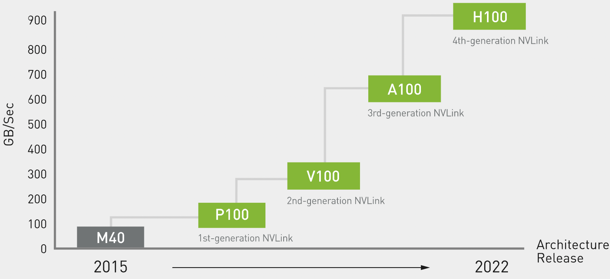

4，NVLink 发展史

NVLink 目前已经发展到第四代（H100 ），性能对比如下表所示。

|         列名          |  第一代  |  第二代  | 第三代   | 第四代   |
| :-------------------: | :------: | :------: | -------- | -------- |
|    总 nvlink 带宽(双向带宽)     | 160 GB/s | 300 GB/s | 600 GB/s | 900 GB/s |   
| 每个 GPU 的最大链路数 |    4     |    6     | 12       | 18       |
|  支持的 nvidia 架构   |  Pascal  |  Volta™  | Ampere   | Hopper   |

> pcie3.0 带宽 32gb/s，pcie4.0 带宽 64gb/s

### 1.3，NVSwitch

GPU 之间互联通信的技术发展：`PCIE—>NVLink—>NVSwitch`。在 nvidia 推出 NVLink 之前，为了获得更多的强力计算节点，多个 GPU 通过 PCIe Switch 直接与 CPU 相连。

即 `NVSwitch` 是 NVLINK 通信技术的升级版。对于配备了 NVLINK3.0 的 A100 ，GPU 到 GPU 的互连速度最多为 600 GB/s，但如果是配备 NVSwitch 的 8 卡 A100，其 Total Aggregate Bandwidth  最多为 4.8 TB/s。

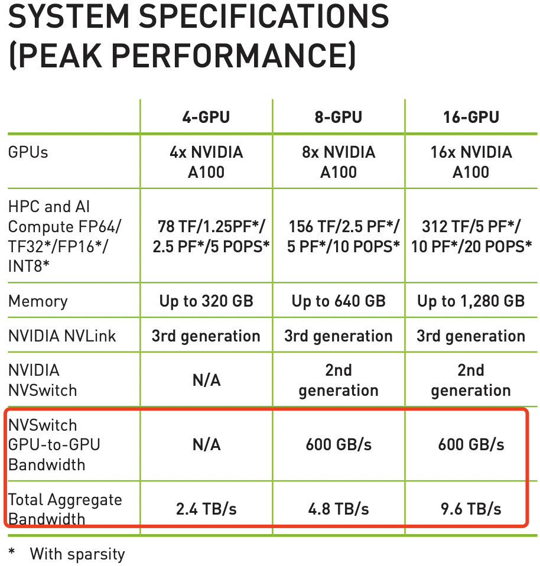
> [NVIDIA HGX A100 超算平台的数据手册](https://www.nvidia.com/content/dam/en-zz/Solutions/Data-Center/HGX/a100-80gb-hgx-a100-datasheet-us-nvidia-1485640-r6-web.pdf)。

### 1.4，NVLINK 和 NVSwitch

第四代 NVIDIA® NVLink® 技术可为多 GPU 系统配置提供高于以往 1.5 倍的带宽，以及增强的可扩展性。单个 NVIDIA H100 Tensor Core GPU 支持多达 18 个 NVLink 连接，总带宽为 900 GB/s，是 PCIe 5.0 带宽的 7 倍。NVIDIA DGX™ H100 等服务器可利用这项技术来提高可扩展性，进而实现超快速的深度学习训练。

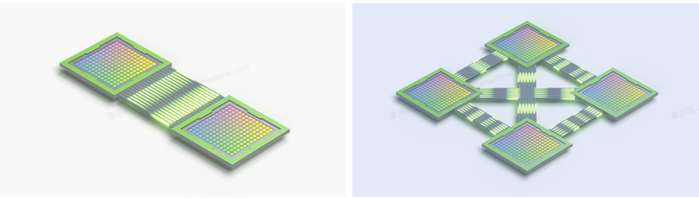

1，将 GPU 与 NVIDIA NVSwitch 完全连接：

HGX H100 所使用的第三代 NVIDIA NVSwitch™ 技术是基于 NVLink 的高级通信能力构建，可为计算密集型工作负载提供更高带宽和更低延迟。为了支持高速集合运算，每个 NVSwitch 都有 64 个 NVLink 端口，并配有 NVIDIA SHARP™ 引擎，可用于网络内归约和组播加速。

2，NVLink 与 NVSwitch 如何协同工作：

NVSwitch 可连接多个 NVLink，在单节点内和节点间实现以 NVLink 能够达到的最高速度进行多对多 GPU 通信。NVSwitch 使 NVIDIA DGX H100 系统中的 8 个 GPU 能够在一个具有全带宽连接的集群中协同工作，按照官方说法，GPU 显存和通信带宽可等同于所有 GPU 对应数据相加。

3，纵向扩展以训练万亿参数模型:

借助 NVSwitch，NVLink 连接可在节点间扩展，以创建无缝、高带宽的多节点 GPU 集群，从而有效地形成数据中心大小的 GPU。通过在服务器外部添加第二层 NVSwitch，NVLink 网络可以连接多达 256 个 GPU，并提供 57.6 TB/s 的惊人多对多带宽，从而快速完成大型 AI 作业。

4，NVLINK 和 NVSwitch 规格对比。

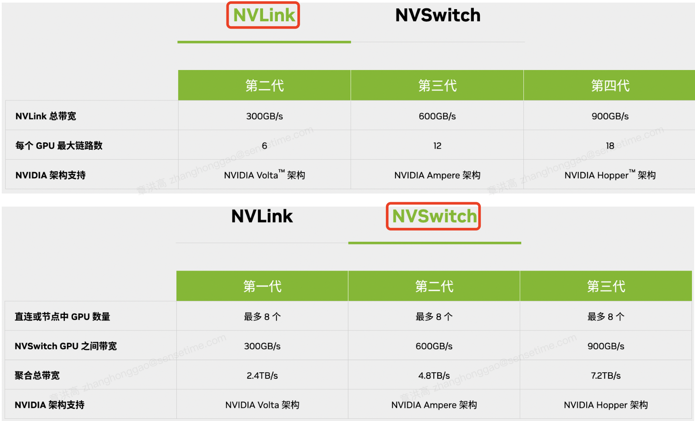

## 二，多 GPU 的 NVLINK 互联拓扑结构

### 2.1，V100 拓扑互联结构

下图是 HGX-1/DGX-1 使用的 8 个 V100 的混合立方网格拓扑结构，混合立方-网格拓扑结构（见下图）可以被视为一个立方体，其顶点是 GPU，并且通过 NVLink 连接了所有 $12$ 条边（一些边有两个 NVLink 连接），其中两个六面体的对角线也连接在一起。该拓扑结构还可以被视为三个交织的单 NVLink 连接环。
> 参考资料 NVIDIA DGX-1 With Tesla V100 System Architectur。

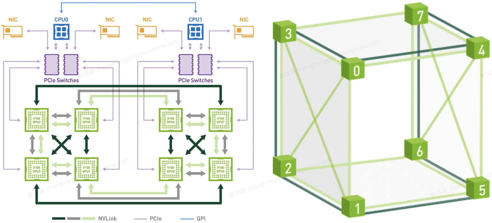

上图可以看到**虽然 V100 理论上支持 6 个 NVlink 通道，但是实际上因为无法做到全连接，所以 2 个 GPU 间最多只能有 2 个 NVLink 通道，即任意两个 GPU 的双向互连带宽只有 $100GB/s$**。而 GPU 与 CPU 间通信仍然使用 PCIe 总线。CPU 间通信使用 QPI 总线。这个拓扑虽然有一定局限性，但依然大幅提升了同一 CPU Node 和跨 CPU Node 的 GPU 间通信带宽。

立方体网格拓扑为多种集体通信原语（broadcast, gather, all-reduce, and all-gather）提供了所有 8-GPU NVLink 拓扑中最高的带宽。
> DGX-1 NVLink 混合立方体网格拓扑可被视为单个 NVLink 连接的三个交织双向环，此处以灰色、浅绿色和深绿色显示。用于深度学习的 GPU 间传输是使用这三个不同的双向环执行的。 每个环连接所有八个 GPU，并且它们一起在两个方向上使用每个 Volta GPU 的所有六个链路。 通过这种方法，可以以超过 130 GB/s 的速度执行缩减和广播操作，而前几代硬件上使用 PCIe 的速度为 10 GB/s。

### 2.2，A100 拓扑互联结构

英伟达发布了两个 HGX A100 平台来帮助推进 AI 和 HPC：
- HGX A100 8-GPU 与 NVSwitch 连接
- HGX A100 4-GPU 通过 NVLink 连接

#### 2.2.1， HGX A100 8-GPU 与 NVSwitch 连接-最快的解决方案

HGX A100 8-GPU 基板是 HGX A100 服务器平台的关键构建模块。 图 1 显示了托管八个 Tensor Core GPU 和六个 NVSwitch 节点的基板。 每个 A100 GPU 都有 12 个 NVLink 端口，每个 NVSwitch 节点都是一个完全无阻塞的 NVLink switch，可连接到所有八个 A100 GPU。

这种**完全连接的网状拓扑结构使得任何 A100 都能够以 600 GB/s 的完整 NVLink3.0 速度与任何其他 A100 GPU 通信**，这是最快 PCIe Gen4 x16 总线带宽的 10 倍。 两个底板还可以使用 NVSwitch 至 NVLink 进行背对背连接，从而实现 16 个 A100 GPU 的完全连接。
> 参考资料：[Introducing NVIDIA HGX A100: The Most Powerful Accelerated Server Platform for AI and High Performance Computing](https://developer.nvidia.com/blog/introducing-hgx-a100-most-powerful-accelerated-server-platform-for-ai-hpc/)

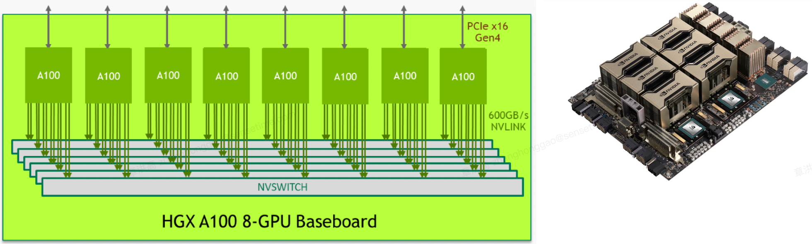
> 图 1. HGX A100 8-GPU 基板的逻辑图。图 2.HGX A100 8-GPU 物理视图。

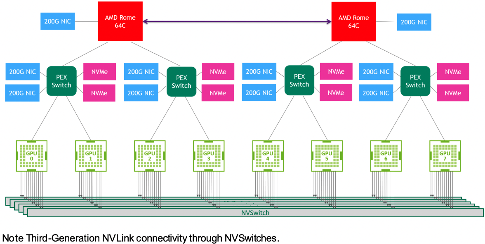
> 图 3 HGX A100 8-GPU 系统拓结构图。

> NVIDIA DGX 与 NVIDIA HGX 有什么区别? 简单理解就是 NVIDIA HGX 是一个计算平台，通过 NVLink 和 NVSwitch 将多个 GPU 串连起来，提供强大的 AI 运算能力。NVIDIA DGX 是 AI 超级计算机。硬件方面包含：GPU、CPU、内存、硬盘、散热系统、软件、操作系统等等，也就是说，除了显示器、键盘、鼠标，它全都有。即 HGX 是一个计算模组，DGX 是一个完整的主机。

#### 2.2.2，HGX A100 4-GPU 与 NVLink 连接以实现通用加速

GPU 基板上的四个 A100 GPU 通过 NVLink 直接连接，实现了全连接。任何 A100 GPU 都可以使用高速 NVLink 端口访问其他 A100 GPU 的内存。A100 到 A100 的对等带宽为 200 GB/s双向，比最快的 PCIe Gen4 x16 总线快 3 倍以上。
> 每个 A100 与其他 A100 的 NVLink 端口只有 4 个。

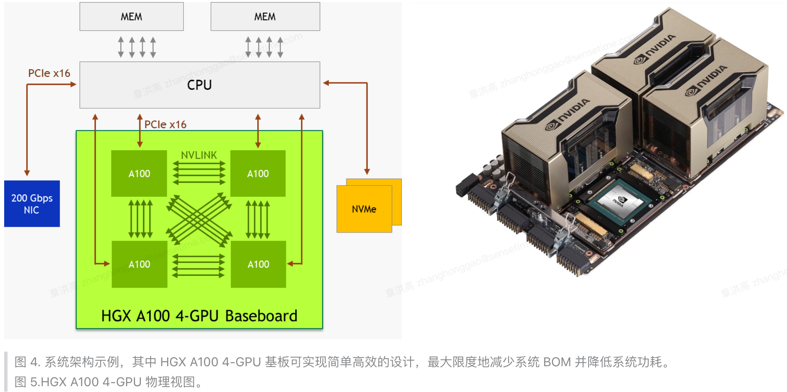

> 图 4. 系统架构示例，其中 HGX A100 4-GPU 基板可实现简单高效的设计，最大限度地减少系统 BOM 并降低系统功耗。图 5.HGX A100 4-GPU 物理视图。

组建 HGX A100 4-GPU 服务器平台时，为实现最高效的加速，官方推荐考虑以下系统设计要点：
1. 如果工作负载不需要额外的CPU容量，可以使用单个高核心数的 CPU。这样可以降低系统 BOM 成本、功耗并简化调度。
2. 释放 PCIe 交换机！直接从 CPU 连接到 A100 GPU，以节省系统 BOM 成本和功耗。
3. 配备一到两个 200-Gb/s NIC 和 NVMe，以覆盖各种用例。Mellanox ConnectX-6 200Gb/s NIC 是最佳选择。
4. 采用 GPUDirect Storage 技术，可降低读/写延迟、降低CPU开销，并实现更高的性能。

### 2.3，A40 拓扑互联结构

NVIDIA NVLink 是一种高速点对点对等传输连接，其中一个 GPU 可以向另一个 GPU 传输数据并从另一个 GPU 接收数据。 NVIDIA **A40 卡只支持与单个相邻 A40 卡进行 NVLink 桥接连接**。

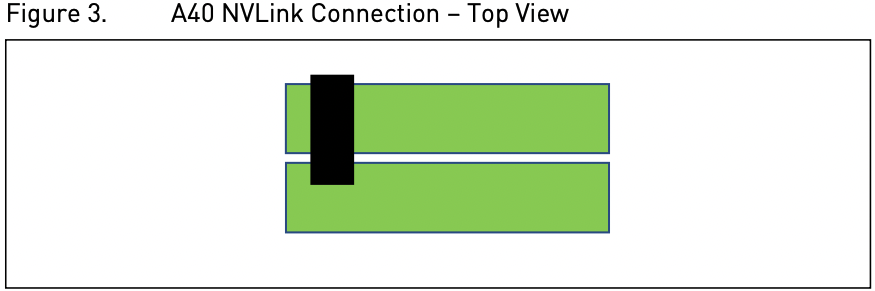

如 8 卡 A40 机器，其简单拓扑图如下所示。其中NVIDIA® NVLink® 112.5 GB/s (bidirectional)3 PCIe Gen4: 64GB/s。


## 2.4，查看 GPU 拓扑结构

用 `nvidia-smi topo -m` 查看集群（V100 显卡） 的 GPU 拓扑结构，对应的就是 HGX-1/DGX-1 使用的 8 个 V100 的混合立方网格拓扑结构。示例如下：

```bash
srun_llm nvidia-smi topo -m                                                                                                                                                                                     
phoenix-srun: job 1558501 queued and waiting for resources
phoenix-srun: job 1558501 has been allocated resources
phoenix-srun: Job 1558501 scheduled successfully!
Current QUOTA_TYPE is [reserved], which means the job has occupied quota in RESERVED_TOTAL under your partition.
Current PHX_PRIORITY is normal

        GPU0    GPU1    GPU2    GPU3    GPU4    GPU5    GPU6    GPU7    mlx5_0  mlx5_1  CPU Affinity    NUMA Affinity
GPU0     X      NV1     NV2     NV1     SYS     SYS     SYS     NV2     NODE    SYS     0-11,24-35      0
GPU1    NV1      X      NV1     NV2     SYS     SYS     NV2     SYS     NODE    SYS     0-11,24-35      0
GPU2    NV2     NV1      X      NV2     SYS     NV1     SYS     SYS     PIX     SYS     0-11,24-35      0
GPU3    NV1     NV2     NV2      X      NV1     SYS     SYS     SYS     PIX     SYS     0-11,24-35      0
GPU4    SYS     SYS     SYS     NV1      X      NV2     NV2     NV1     SYS     NODE    12-23,36-47     1
GPU5    SYS     SYS     NV1     SYS     NV2      X      NV1     NV2     SYS     NODE    12-23,36-47     1
GPU6    SYS     NV2     SYS     SYS     NV2     NV1      X      NV1     SYS     PIX     12-23,36-47     1
GPU7    NV2     SYS     SYS     SYS     NV1     NV2     NV1      X      SYS     PIX     12-23,36-47     1
mlx5_0  NODE    NODE    PIX     PIX     SYS     SYS     SYS     SYS      X      SYS
mlx5_1  SYS     SYS     SYS     SYS     NODE    NODE    PIX     PIX     SYS      X 

Legend:

  X    = Self
  SYS  = Connection traversing PCIe as well as the SMP interconnect between NUMA nodes (e.g., QPI/UPI)
  NODE = Connection traversing PCIe as well as the interconnect between PCIe Host Bridges within a NUMA node
  PHB  = Connection traversing PCIe as well as a PCIe Host Bridge (typically the CPU)
  PXB  = Connection traversing multiple PCIe bridges (without traversing the PCIe Host Bridge)
  PIX  = Connection traversing at most a single PCIe bridge
  NV#  = Connection traversing a bonded set of # NVLinks
```

以及 8张 T4 卡机器的 GPU 拓扑结构:

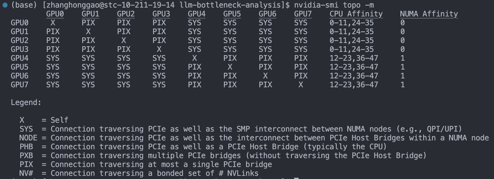

从上图可以看出，英伟达给出了 6 中 GPU 卡的物理通信方式，下面我们可以结果上面的 PCIe 物理结构图来了解这些通信方式：
- `SYS`: 通过 QPI（PCIe + QPI总线）跨 NUMA node 间 GPU 通信，相当于上上图中的 GPU1 到 GPU5；
- `NODE`: 单个 NUMA node 内经过Host Bridge PCIe总线通信（一个NUMA node上有多个 CPU 芯片）,没遇到过这种情况，就不举例子了；
- `PHB`: 经过 Host Bridge（Root complex中）的 PCIe 总线通信，同一 Root complex 下多个 PCIe 总线，相当于上上图中的 GPU1 到 GPU3；
- `PXB`: 跨越多个 PCIe Bridge (switch)，但没有经过 Host Bridge PCIe 总线，相当于上上图中的 GPU3 到 GPU4；
- `PIX`: 经过一个 PCIe Bridge (switch) 通信，即挂载在同一个PCIe Bridge上的GPU卡之间通信，相当于上上图中的 GPU1 到 GPU2；
- `NV#`: 使用 NVLink 通信（后面会介绍）；

描述中所指的 Host Bridge 就是 Host 主桥，是连接处理器和 PCI 总线的一个设备器件，用来隔离处理器的存储器域与 PCI 总线域的特殊桥片，管理PCI总线域，集成在 Root Complex 中，此处可以认为就是图中的 Root Complex。

从上面的例子可以直观地看出，两个 GPU 卡的物理距离越近（如 GPU1 到 GPU2），则通信效率越高，距离越远效率越低，此处的效率一般体现在通信时延上。几种 PCIE 模式通信速度的对比。

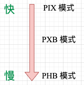

### 2.5，SXM 和 PCIE 模组连接方式的区别

- SXM 模组的 GPU，多 GPU 的连接方式一般有 NVLINK 或者 NVLINK + NVSwitch。
- PCIE 插卡形式的 GPU，如果是 A100/A40，最多支持两两 GPU 通过 NVLINK 互联，无法同时支持 8 个 GPU NVLINK互联。

## 三，GPU 显存带宽

GPU 的内存（显存）带宽决定了它将数据从内存 (vRAM) 移动到计算核心的速度。显存带宽如果太小，就会导致 gpu 和计算核心（cuda/tensor core）处于等待显存返回数据的过程中。

### 3.1，系统内存与设备内存

下图是一个简化的系统内存与设备内存架构示意图（来源）：

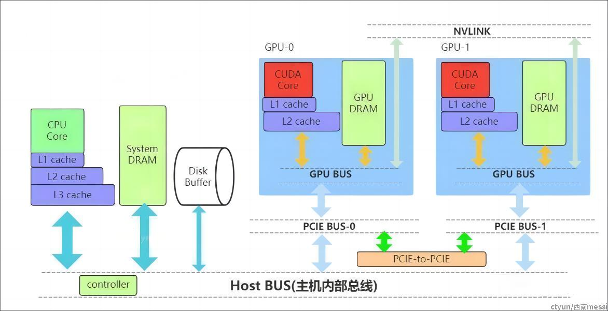

内存数据传输通道划分：

- `PCIE BUS`：PCIE标准的数据通道，数据就是通过该通道从显卡到达主机；
- `BUS`： 总线。计算机内部各个存储之间交互数据的通道；
- `PCIE-to-PCIE`：显卡之间通过PCIE直接传输数据；
- `NVLINK`：英伟达显卡之间的一种专用的数据传输通道，由 NVIDIA 公司推出。

## 四，带宽对 LLM 推理服务性能的影响总结

1. CPU 和 GPU 的通信带宽（一般是通过 PCIE SWITCH 技术连接），只在前期影响模型加载到 GPU 显存的速度。
2. GPU 卡间互联带宽，指的是不同 gpu 卡之间互联通信速度，英伟达提供了两种通信接口 PCIE 和 NVLINK ，GPU 互联速度严重影响大模型使用张量并行后的模型推理 Latency ，进而影响 llm  服务的最大并发量。

## 参考资料

- [GPU&CUDA 多机通信](https://github.com/FelixFu520/README/blob/main/envs/pytorch/cuda_gpu.md#5-pcienvlinknvswitch))
- [Efficient Large-Scale Language Model Training on GPU Clusters Using Megatron-LM](https://arxiv.org/pdf/2104.04473.pdf)
- [NVLink 和 NVSwitch](https://www.nvidia.cn/data-center/nvlink/#)
- [GPU卡的底层通信原理](https://www.jianshu.com/p/e40059d5c832)
