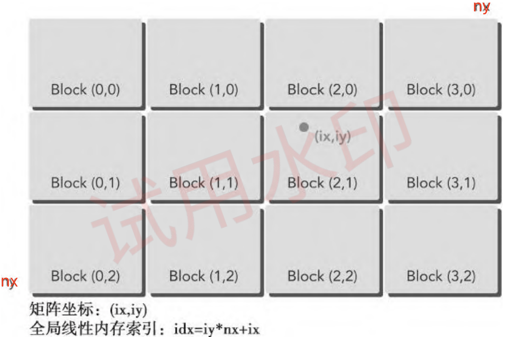
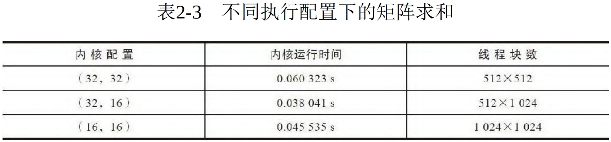

- [一 组织并行编程](#一-组织并行编程)
  - [1.1 使用块和线程建立矩阵索引](#11-使用块和线程建立矩阵索引)
  - [1.2 使用二维网格和二维块对矩阵求和](#12-使用二维网格和二维块对矩阵求和)
  - [1.3 使用一维网格和一维块对矩阵求和](#13-使用一维网格和一维块对矩阵求和)
  - [1.4 总结](#14-总结)
- [二 设备管理](#二-设备管理)
  - [2.1 使用运行时 API 查询 GPU 信息](#21-使用运行时-api-查询-gpu-信息)
  - [2.2 使用 nvidia-smi 查询 GPU 信息](#22-使用-nvidia-smi-查询-gpu-信息)
  - [2.3 在运行时设置设备](#23-在运行时设置设备)
- [参考资料](#参考资料)

## 一 组织并行编程
如果使用了合适的网格和块大小来正确地组织线程，会对内核性能产生很大的影响。在矩阵加法中使用以下布局将有助于了解更多关于网格和块的启发性的用法：
- 由二维线程块构成的二维网格
- 由一维线程块构成的一维网格
- 由一维线程块构成的二维网格

### 1.1 使用块和线程建立矩阵索引

对于矩阵加法的核函数，首先要完成的任务是使用块和线程索引从全局内存中访问指定的数据。以列优先存储方法的 $nx\times ny$ 矩阵为例:

第一步，可以用以下公式把线程和块索引映射到矩阵坐标上：

```cpp
// [ix, iy] 是矩阵的元素的坐标索引
ix = threadIdx.x + blockIdx.x * blockDim.x;
iy = threadIdx.y + blockIdx.y * blockDim.y;
```

第二步，可以用以下公式把矩阵坐标 `(ix, iy)` 映射到全局内存中的索引/存储单元上：

```cpp
idx = iy * nx + ix
```
其中：
- `ix` 是元素所在的行索引，0 ≤ i < nx
- `iy` 是元素所在的列索引，0 ≤ j < ny
- `nx` 是矩阵的行数
  
`printThreadInfo` 函数被用于输出关于每个线程的以下信息：
- 线程索引
- 块索引
- 矩阵坐标
- 线性全局内存偏移量
- 相应元素的值

### 1.2 使用二维网格和二维块对矩阵求和

直接创建一个基于二维网格和二维块实现矩阵求和的核函数代码:

```cpp
__global__ void sumMatrixOnGPU2D(float *MatA, float *MatB, float *MatC, int nx, int ny)
{
    unsigned int ix = threadIdx.x + blockIdx.x * blockDim.x;
    unsigned int iy = threadIdx.y + blockIdx.y * blockDim.y;
    unsigned int idx = iy * nx + ix; // 线程索引和全局内存索引的关系

    if (ix < nx && iy < ny)
        MatC[idx] = MatA[idx] + MatB[idx];
}
```

这个核函数的关键步骤是**将每个线程从它的线程索引映射到全局线性内存索引**中，如下图所示。



使用一个二维网格和二维块按如下方法设置核函数的执行配置:

```cpp
int dimx= 32;
int dimy = 32;
dim3 block(dimx, dimy); // 定义线程块维度大小
dim3 grid((nx + block.x-1)/block.x,(ny + block.y-1)/ block.y);
```

使用上述的核函数定义和核函数配置代码替换前面文章相应部分代码，通过不同的配置编译并运行该代码，，可以得到 `Tesla M2070` 机器上运行的不同执行配置的性能对比表格。



结果显示，**增加块的数量不一定能提升内核性能**。后序文章会学习到为什么不同的执行配置会影响核函数的性能。

### 1.3 使用一维网格和一维块对矩阵求和

核函数启动中使用了一个一维块布局，因此只有 threadIdx.x 是有用的，并且使用内核中的一个循环来处理每个线程中的 `ny` 个元素，核函数代码如下所示:

```cpp
global void sumMatrixOnGPulD(float *MatA, float *MatB, float *MatC, int nx，int ny)
{
    unsigned int ix= threadIdx.x + blockIdx.x * blockDim.x;
    if(ix < nx){
        for (int iy=0; iy < ny; iy++){
            int idx = iy * nx + ix
            MatC[idx] = MatA[idx] + MatB[idx];
        }
    }
}
```

一维网格和块的配置如下：

```cpp
dim3 block (32, 1);
dim3 grid ((nx + block.x-1) / block.x, 1);
```

### 1.4 总结

从矩阵加法的例子中可以看出：
- 改变执行配置对内核性能有影响；
- 传统的核函数实现一般不能获得最佳性能；
- 对于一个给定的核函数，尝试使用不同的网格和线程块大小可以获得更好的性能。

## 二 设备管理

### 2.1 使用运行时 API 查询 GPU 信息

可以使用以下函数查询关于 GPU 设备的所有信息：
```bash
cudaError t cudaGetDeviceProperties(cudaDeviceProp* prop, int device);
```

`cudaDeviceProp` 结构体包含了 CUDA 设备的属性信息，可以通过该[网址](https://docs.nvidia.com/cuda/cuda-runtime-api/structcudaDeviceProp.html)查看其内容。以下是一些关键成员及其意义：
- name: 设备的名称（字符串）。
- `totalGlobalMem`: 设备的全局内存总量（以字节为单位）。
- sharedMemPerBlock: 每个线程块的共享内存大小（以字节为单位）。
- regsPerBlock: 每个线程块的寄存器数量。
- warpSize: 每个 warp 的线程数量（通常为 32）。
- maxThreadsPerBlock: 每个线程块的最大线程数。
- maxThreadsDim[3]: 每个线程块在 3 个维度（x, y, z）上的最大线程数。
- maxGridSize[3]: 网格在 3 个维度（x, y, z）上的最大尺寸。
- clockRate: 核心时钟频率（以千赫兹为单位）。
- totalConstMem: 设备的常量内存大小（以字节为单位）。
- `multiProcessorCount`: 多处理器的数量（SM 数量）。
- `computeCapability`:` 计算能力，包含 major 和 minor 版本号。

实例代码如下所示：

```cpp
#include <stdio.h>
#include <cuda_runtime.h>

int main() {
    int deviceCount;
    cudaGetDeviceCount(&deviceCount);

    for (int device = 0; device < deviceCount; device++) {
        cudaDeviceProp prop;
        cudaGetDeviceProperties(&prop, device);

        printf("Device %d: %s\n", device, prop.name);
        printf("  Total Global Memory: %lu bytes\n", prop.totalGlobalMem);
        printf("  Shared Memory Per Block: %lu bytes\n", prop.sharedMemPerBlock);
        printf("  Registers Per Block: %d\n", prop.regsPerBlock);
        printf("  Warp Size: %d\n", prop.warpSize);
        printf("  Max Threads Per Block: %d\n", prop.maxThreadsPerBlock);
        printf("  Max Threads Dimension: (%d, %d, %d)\n",
               prop.maxThreadsDim[0], prop.maxThreadsDim[1], prop.maxThreadsDim[2]);
        printf("  Max Grid Size: (%d, %d, %d)\n",
               prop.maxGridSize[0], prop.maxGridSize[1], prop.maxGridSize[2]);
        printf("  Clock Rate: %d kHz\n", prop.clockRate);
        printf("  Total Constant Memory: %lu bytes\n", prop.totalConstMem);
        printf("  Multi-Processor Count: %d\n", prop.multiProcessorCount);
        printf("  Compute Capability: %d.%d\n", prop.major, prop.minor);
    }

    return 0;
}
```

编译运行代码后输出结果如下所示：
```bash
Device 0: GeForce GTX 1080
  Total Global Memory: 8589934592 bytes
  Shared Memory Per Block: 49152 bytes
  Registers Per Block: 65536
  Warp Size: 32
  Max Threads Per Block: 1024
  Max Threads Dimension: (1024, 1024, 64)
  Max Grid Size: (2147483647, 65535, 65535)
  Clock Rate: 1733000 kHz
  Total Constant Memory: 65536 bytes
  Multi-Processor Count: 20
  Compute Capability: 6.1
```

### 2.2 使用 nvidia-smi 查询 GPU 信息

使用 nvidia-smi 工具的常用命令:

```bash
# 1, 持续监控 GPU 使用情况（每秒更新一次）
nvidia-smi -l 1 
# 2, 以 CSV 格式输出 GPU 的索引、名称、驱动程序版本、总内存和已用内存的信息，方便进一步处理或分析
nvidia-smi --query-gpu=index,name,driver_version,memory.total,memory.used --format=csv
# 3, 显示所有 GPU 的进程信息
nvidia-smi pmon -s um
```

### 2.3 在运行时设置设备

对于于一个有 N 个 GPU 的系统，nvidia-smi 从 0 到 N―1 标记设备 ID。使用环境变量 `CUDA_VISIBLE_DEVICES`，就可以在运行时指定所选的GPU 且无须更改应用程序。

例如，设置运行时环境变量 `CUDA_VISIBLE_DEVICES=2`。nvidia 驱动程序会屏蔽其他GPU，这时设备 2 作为设备 0 出现在应用程序中。

也可以使用CUDA_VISIBLE_DEVICES指定多个设备。例如，如 `CUDA_VISIBLE_DEVICES=2，3`，在运行时，nvidia 驱动程序将只使用 ID 为 2 和 3 的设备，并且会将设备 ID 分别映射为 0 和 1。

## 参考资料

《CUDA C 编程权威指南》