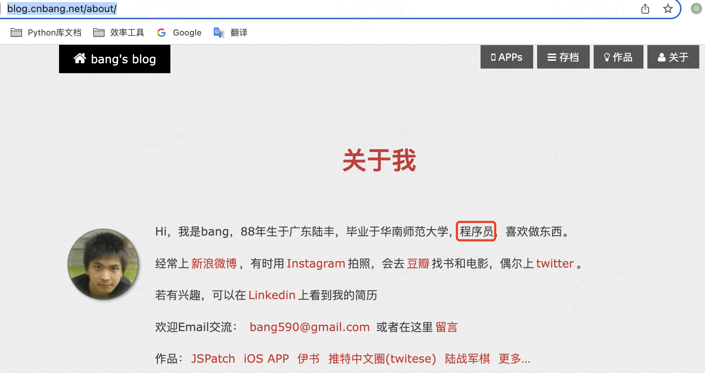
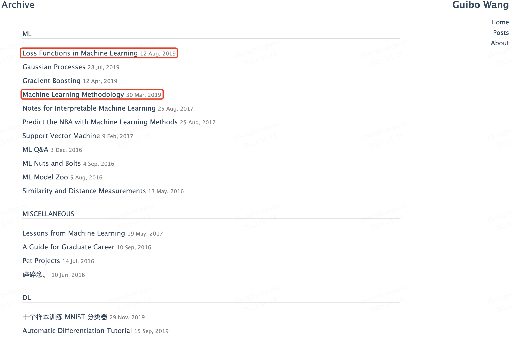
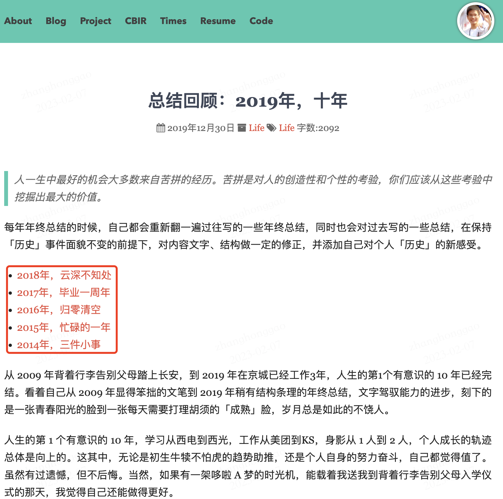
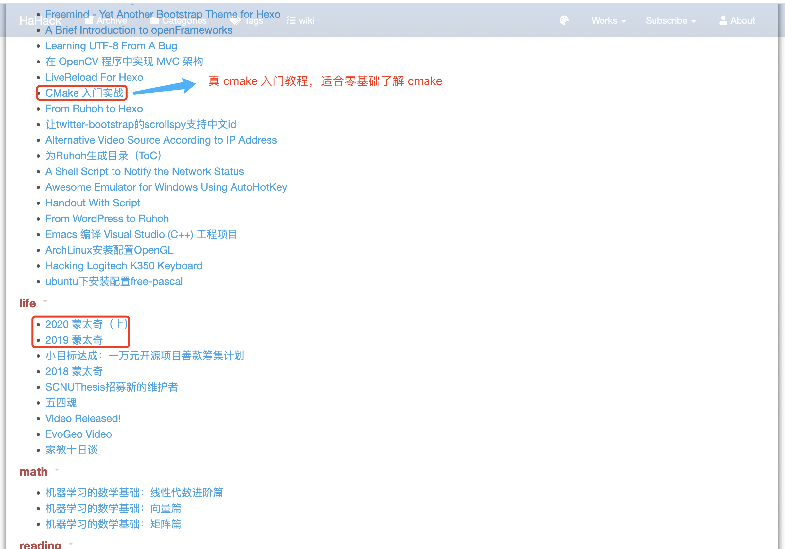
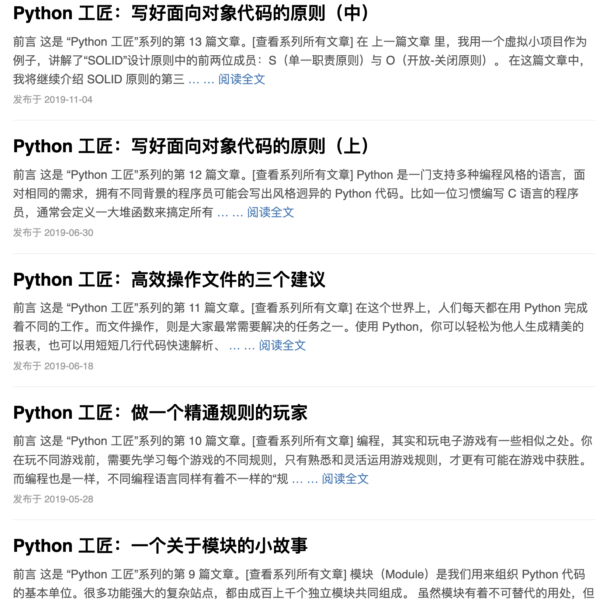
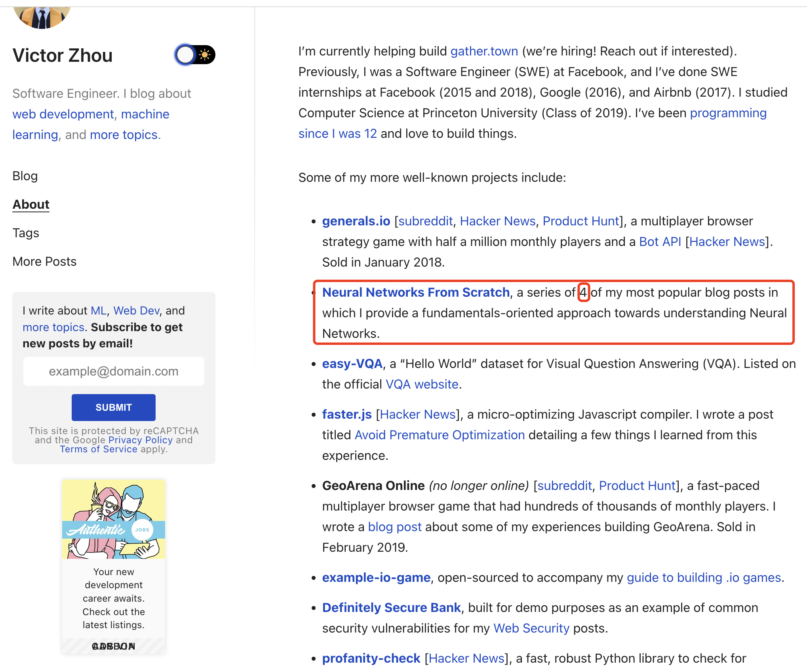
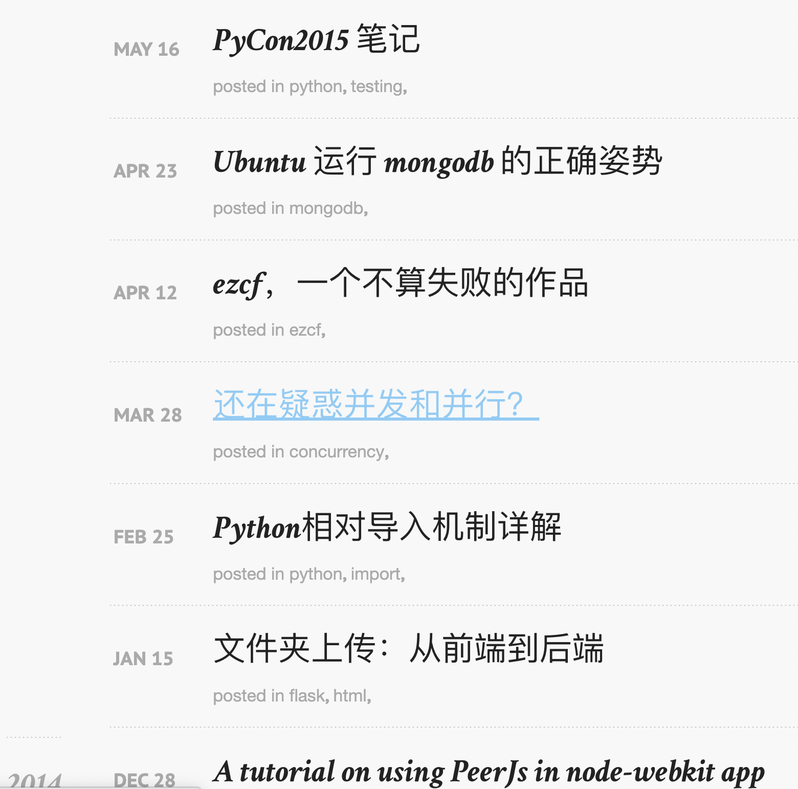
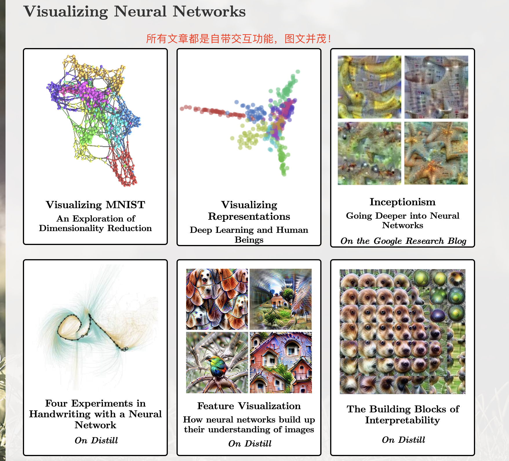
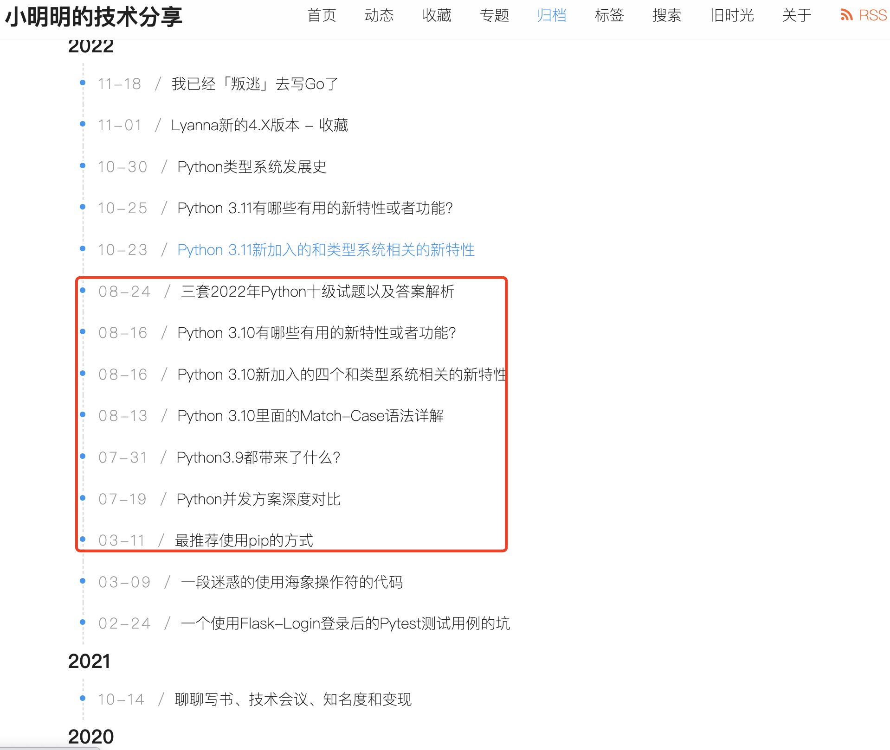
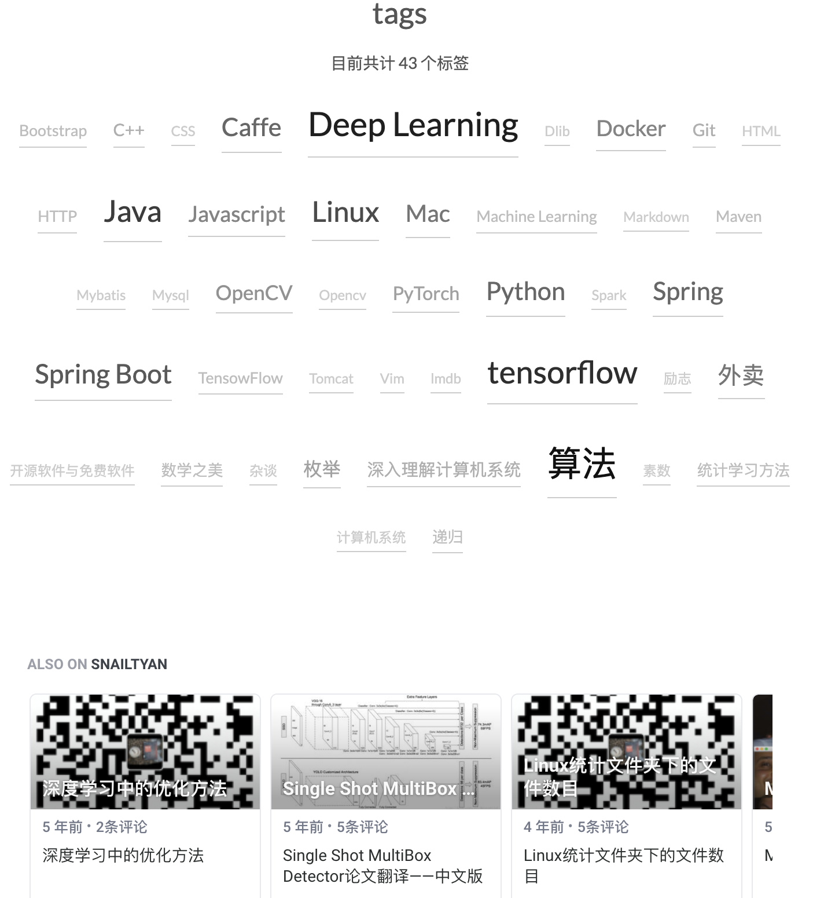

1，[bang's blog](http://blog.cnbang.net/about/)

17 年就是蚂蚁金服 P8 的前端大佬。博客质量基本都很高，看他的文章会让我得到些思考，比如文章中的 “心流”（我的叫法跟他的不一样，但内核一样）的描述，我之前也有过类似的状态，但只有一次，就是高三临场抱佛脚，花了 3 周让自己的排名进步了近 1000 名的复习经历，可惜这种状态太难得了，他首先需要的就是无与伦比的专注！

2，[Guibo Wang blog](https://borgwang.github.io/archive)

腾讯广告算法大佬的博客，我是通过他的《手撸一个简单深度学习框架》文章找到他的博客站的，网站文章数量不多，但是基本是高质量！作者部分博客文章截图如下:

1. [yongyuan blog](https://yongyuan.name/)

快手算法大佬，专注 CBIR（基于内容的图像检索）领域，我是通过他的文章-[图像检索：基于内容的图像检索技术](https://yongyuan.name/blog/cbir-technique-summary.html)和年终总结系列文章关注到他的独立博客网站的，文章内容质量都很高，且叙述逻辑清晰，表达方式易懂。

4. [hahack](https://www.hahack.com/)

腾讯开发大佬，现在专注教育领域内的产品和课程开发，最早是通过他的叮当开源机器人项目关注到他博客的，后面发现他的技术文章写的都不错，通俗易懂的同时还能兼顾内容深度，尤其是他的年终总结系列看完真的会引起读者的反思。可惜两年多没有更新 `blog` 了，毕竟写 `blog` 才是真为爱发电，现在还在坚守个人 `blog` 站点的多少肯定是有技术信仰和情怀的。

5. [Piglei blog](https://www.piglei.com/)

Python 大佬，他的 《Python 工匠》专栏是我目前看过写的最好的 Python 专栏，文章脉络清晰，原理描述与实例结合得也很好，目前网站还在坚持更新。另外，他的个人 blog 站点是用 Python 框架 Django 开发的。

6. [Victor Zhou blog](https://victorzhou.com/)

国外的一个作者，博客主要是关于 web 开发和机器学习的内容，他的[从零开始入门 CNN 文章堪称经典](https://victorzhou.com/series/neural-networks-from-scratch/)。

7. [laike9m's blog](https://laike9m.com/blog/wo-de-2019-pycon-china-xiao-jie-xia,127/)

Python 开发大佬，我是通过他的文章-[我的 2019 PyCon China 小结（下）](https://laike9m.com/blog/wo-de-2019-pycon-china-xiao-jie-xia,127/)，关注到他的博客站点的，让我了解到了一些 Python 开发者小组和活动，他的文章还挺有意思的，读起来比较轻松。

8. [Distill](https://distill.pub/)

Distill 这个网站超级牛逼！文章数目不多，但是，他的文章都是让机器学习研究变得清晰、动态和生动。文章是带交互的，可视化理解神经网络，非常推荐 ml/dl learner 去关注和学习。另外，国外在技术开发工具、框架、知识传播/分享方便比国内还是好很多，像 `Distill` 类似的文章/blog 国外不少，但国内我目前还没看到。

9. [xiaoming blog](https://www.dongwm.com/archives)

豆瓣大佬，之前专注 Python web 开发。我是通过他的文章-[博客十年](https://www.dongwm.com/page/about-blog)关注到博客站点的。在独立博客站点，算是更新很多的，且文章质量普遍都很高。学习 Python 的开发者，如果想深入理解一些 Python 开发知识，还是很推荐看看他的博客。

10.[SnailTyan blog](http://noahsnail.com/)

深度学习开发者，通过作者的经典 backbone 论文翻译文章关注他的博客站点的，目前网站一直在坚持更新 leetcode 算法解题笔记。他的深度学习论文翻译系列文章很适合初学者学习下。

