- [一，何为 ChatGPT](#一何为-chatgpt)
- [二，ChatGPT 注册步骤](#二chatgpt-注册步骤)
  - [2.1，准备条件](#21准备条件)
  - [2.2，注册虚拟电话号码](#22注册虚拟电话号码)
  - [2.3，注册 OpenAI 账号](#23注册-openai-账号)
- [三，使用 ChatGPT 官网服务](#三使用-chatgpt-官网服务)
- [四，使用 ChatGPT App](#四使用-chatgpt-app)
- [五，使用 ChatGPT Python API](#五使用-chatgpt-python-api)

> 本文给出了 ChatGPT 的详细注册及使用教程，称得上是保姆级别的丰富图文教程。

## 一，何为 ChatGPT

ChatGPT 是一个基于 GPT-3 模型的对话系统，它主要用于处理自然语言对话。通过训练模型来模拟人类的语言行为，ChatGPT 可以通过文本交流与用户互动。它可以用于各种场景，包括聊天机器人、智能客服系统等。基于 GPT-3 模型的对话系统通常会有很好的语言生成能力，并能够模拟人类的语言行为。

ChatGPT 虽然才发布几天时间，但是就已经火爆全网了，截止目前2022-12-8日，已经有开发者基于 ChatGPT 对话 api 接口开发了客户端聊天机器人、谷歌浏览器插件、 vscode 插件、微信群聊天问答机器人等衍生品。

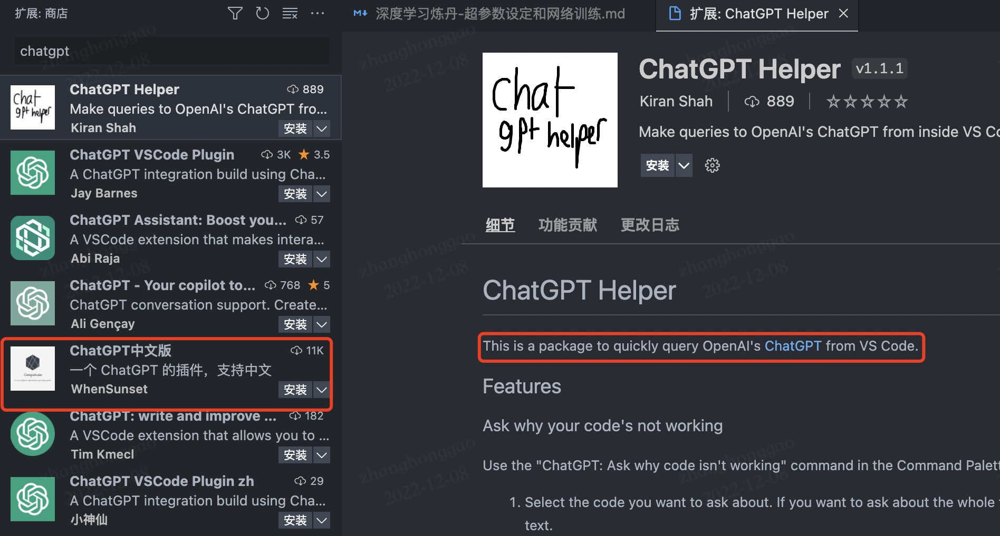

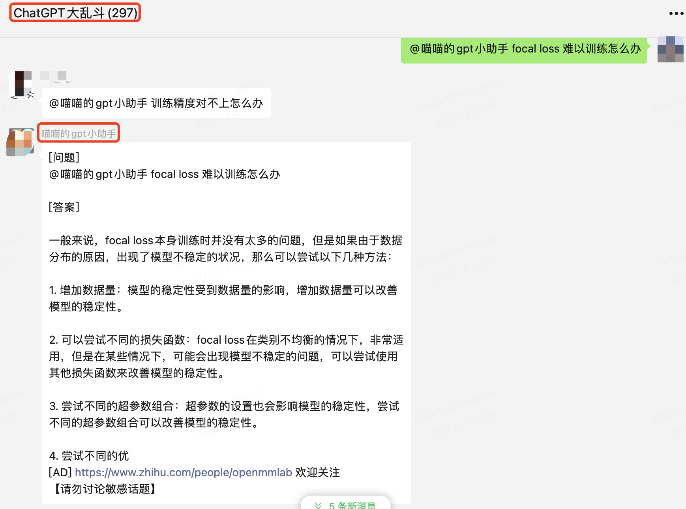

## 二，ChatGPT 注册步骤

### 2.1，准备条件

- 首先你必须要能**科学上网**（如何操作请自行查找资料）。

- 最后，如果有一个国外手机号最好，没有的话就参考下文步骤去 sms-activate.org 网站注册一个虚拟号。

注意！即使使用 VPN 科学上网，查看 `ip`地址也可能显示在国内，以下是解决办法:

1. 代理要一定挂**全局**模式 + 支持 `OpenAI` 的国家（目前中（包括香港）俄等国不支持，推荐北美、日本等国家）；上面步骤完成后依然不行的话，就清空浏览器缓存然后重启浏览器或者电脑；
2. 或者直接新开一个**无痕模式**的窗口。

### 2.2，注册虚拟电话号码

1，在  [sms-activate.org](https://sms-activate.org/cn) 网站注册一个账号并登录，默认是使用邮箱注册的。

2，点击网站右上角的充值按钮，进入充值页面，选择支付宝，因为我们只需接受验证码服务，所以充值 `0.2` 美元即可。

3，回到网站首页，在左侧搜索栏直接搜索 `openai` 虚拟手机号注册服务，可以随便选择一个国家号码，这里我选择印度 `India`，然后点击购物车会直接购买成功，然后就会进入你购买的虚拟手机号页面，复制去掉区号 `91` 的手机号码去 `openai` 官网注册服务即可。

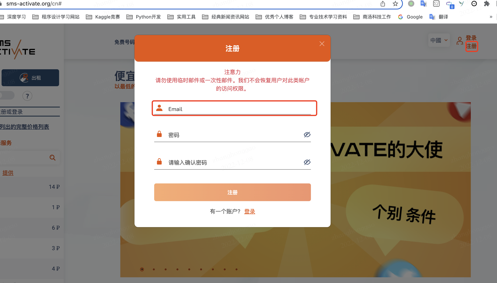


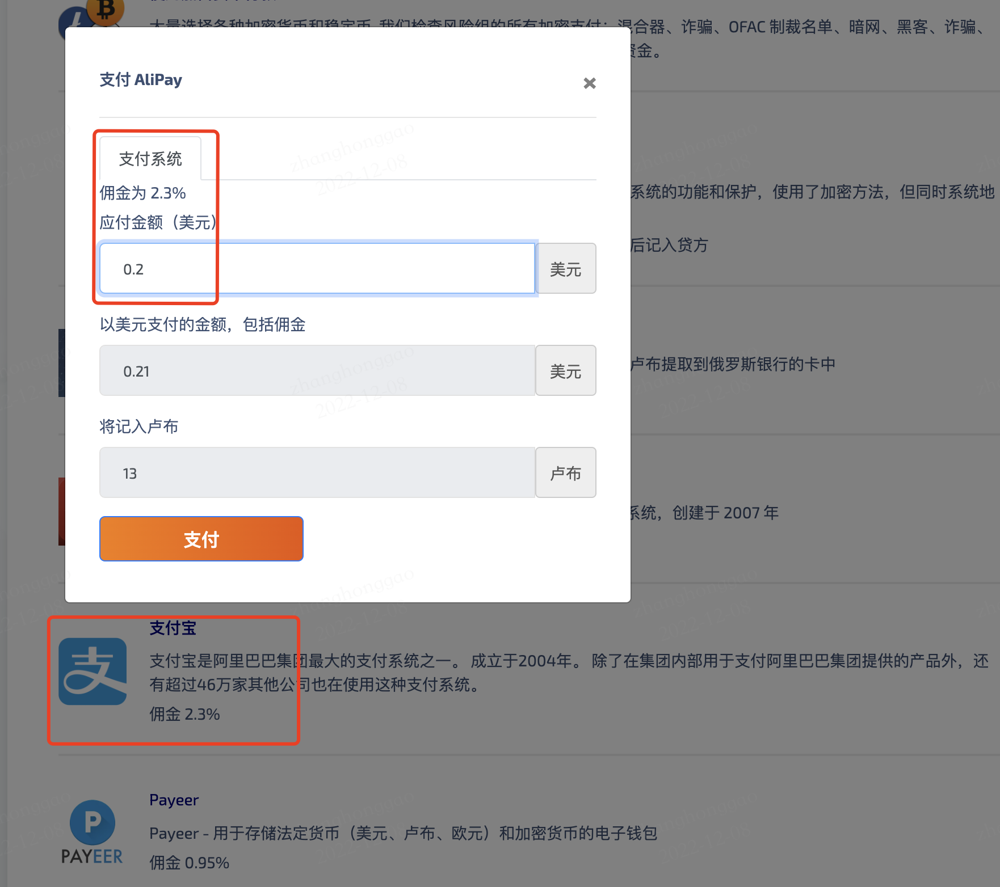

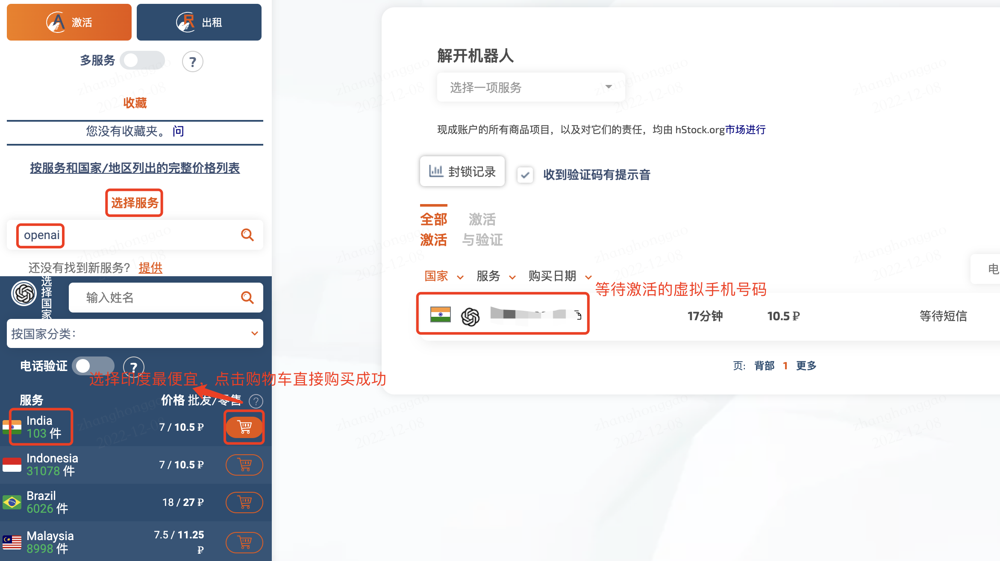

### 2.3，注册 OpenAI 账号

前面的步骤完成后，我们就有一个虚拟的国外手机号码了，可以用来注册 openai 账号时完成**接收验证码**的服务。

> OpenAI 网站注册必须要国外手机号码。

最后，注册 `OpenAI` 账号，可以按照以下步骤进行：

1. 点击[官网链接](https://link.zhihu.com/?target=https%3A//chat.openai.com/)，首次进入会要求你注册或登录账户。
2. 使用谷歌、微软或者其他邮箱进行注册登录。
3. 如果 `ip` 在国外，则能成功注册，然后就会看到填写用户名的页面，如果 `ip` 在国内就会提示你 `OpenAI's services are not available in your country`。
4. **电话验证**。这个时候输入前面购买的虚拟手机号用来接收验证码即可。
5. 通过电话验证之后，就能成功注册好 OpenAI 账号了，然后就去愉快的使用 `ChatGPT` 吧！

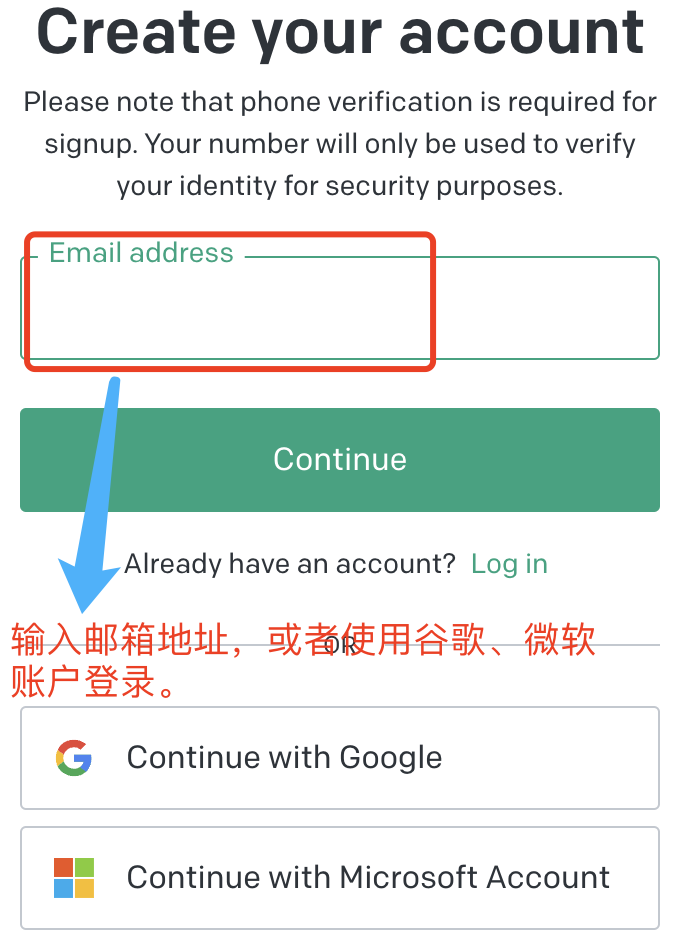

## 三，使用 ChatGPT 官网服务
> 注意：经常官网服务经常会拥挤，并出现如下提示，刷新重新进入即可。
> "We're experiencing exceptionally high demand. Please hang tight as we work on scaling our systems."

1. 访问 [OpenAI 官网](https://openai.com/)，点击网页左边底部的 “Chat GPT”，进入 [ChatGPT 页面](https://chat.openai.com/chat)。
2. 点击 “TRY CHATGPT”，进入 ChatGPT 服务页面。
3. 在“Input”中输入你要和Chat GPT聊天的信息，然后点击“Send”。
4. Chat GPT会根据你的输入回复一条信息，你可以根据回复的信息继续聊天。

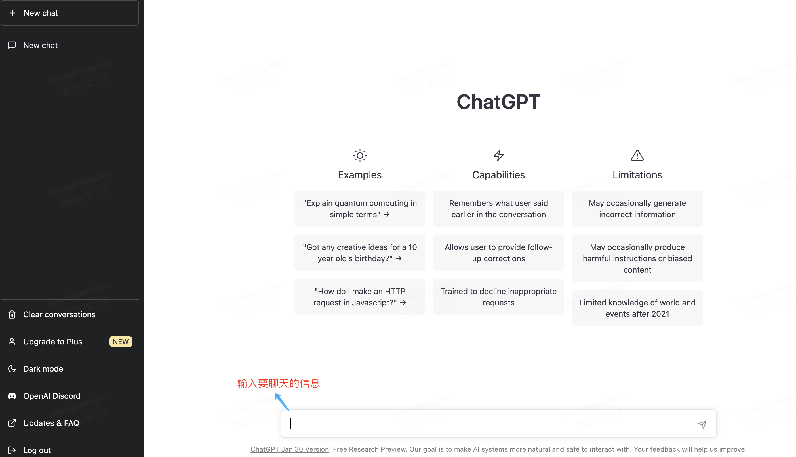

## 四，使用 ChatGPT App

github 有个 stars 数目比较多的开源项目[ChatGPT](https://github.com/lencx/ChatGPT)，实现了将 ChatGPT 服务封装成 App 的功能，并支持 Mac, Windows 和 Linux 平台。

这里以 Mac 系统的安装使用为例，其他平台类似，都很简单。

1. 通过下载 [ChatGPT dmg安装包]( https://github.com/lencx/ChatGPT/releases/download/v0.10.3/ChatGPT_0.10.3_x64.dmg)方式直接双击安装。
2. 通过 Homebrew 服务下载安装。

```shell
brew tap lencx/chatgpt https://github.com/lencx/ChatGPT.git
brew install --cask chatgpt --no-quarantine
```

下载安装 chatgpt app 后，打开软件会要求你先输入 openai 账户邮箱和密码，然后就可以直接使用了，App 界面如下所示。

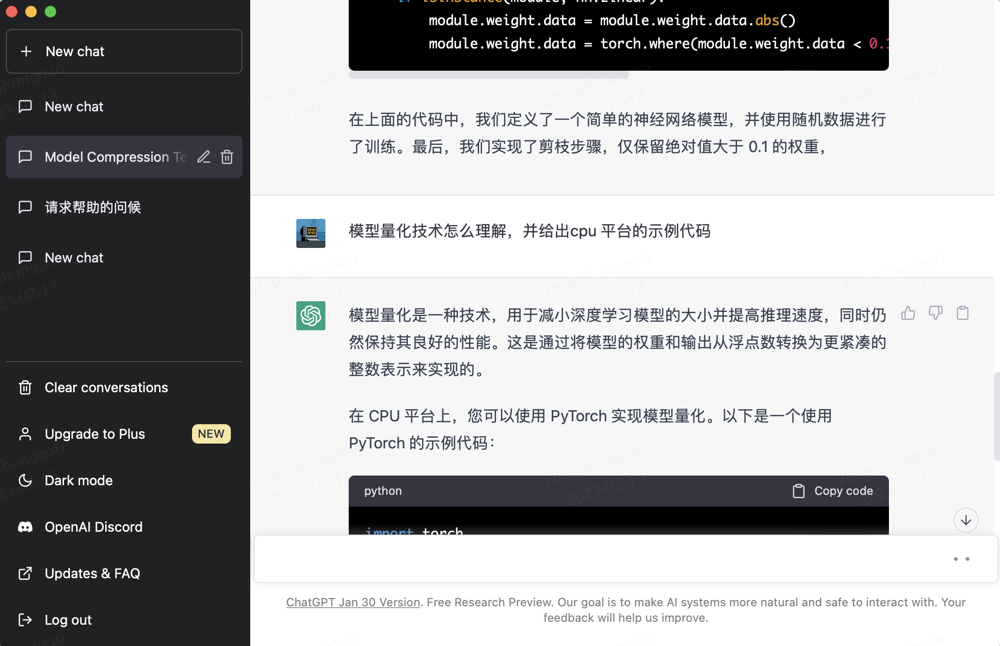

## 五，使用 ChatGPT Python API

在前面的步骤完成注册 OpenAI 账户并申请 API Key 后，我们就可以愉快的玩耍 ChatGPT 了，这里通过 Python API 的形式调用 ChatGPT 服务。可以通过 [OpenAI 账户](https://platform.openai.com/account/org-settings) 找到自己 `API keys`，具体如下图所示。

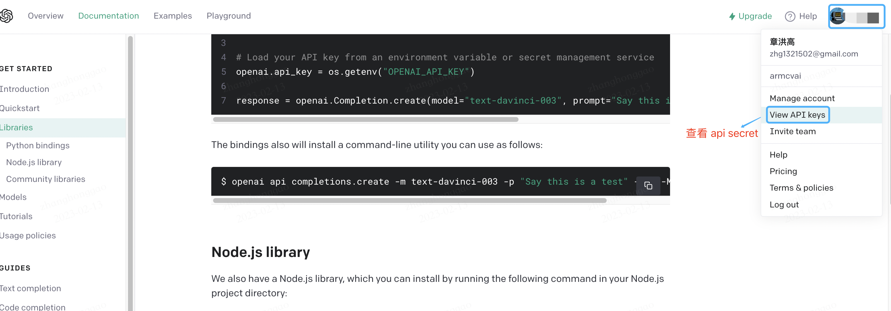
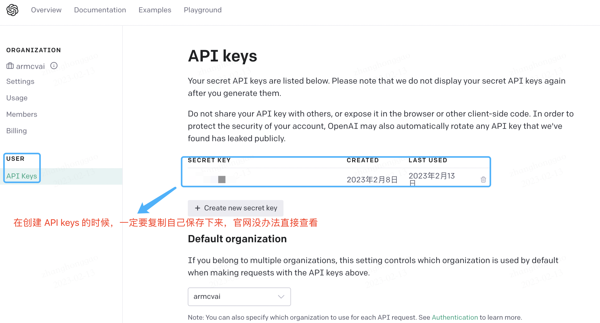

然后创建以下 Python 代码并运行。

```python
import openai

# Set the API key
openai.api_key = "YOUR_API_KEY"

# Define the model and prompt
model_engine = "text-davinci-003"
prompt = "What is the capital of France?"

# Generate a response
completion = openai.Completion.create(
    engine=model_engine,
    prompt=prompt,
    max_tokens=1024,
    n=1,
    stop=None,
    temperature=0.5,
)

# Get the response text
message = completion.choices[0].text

print(message)
```

在上面的代码中，您需要将 `YOUR_API_KEY` 替换为您的 `API Key`，然后您可以运行代码并检查生成的输出。您可以通过更改提示文本和其他参数来生成不同的响应（回答）。

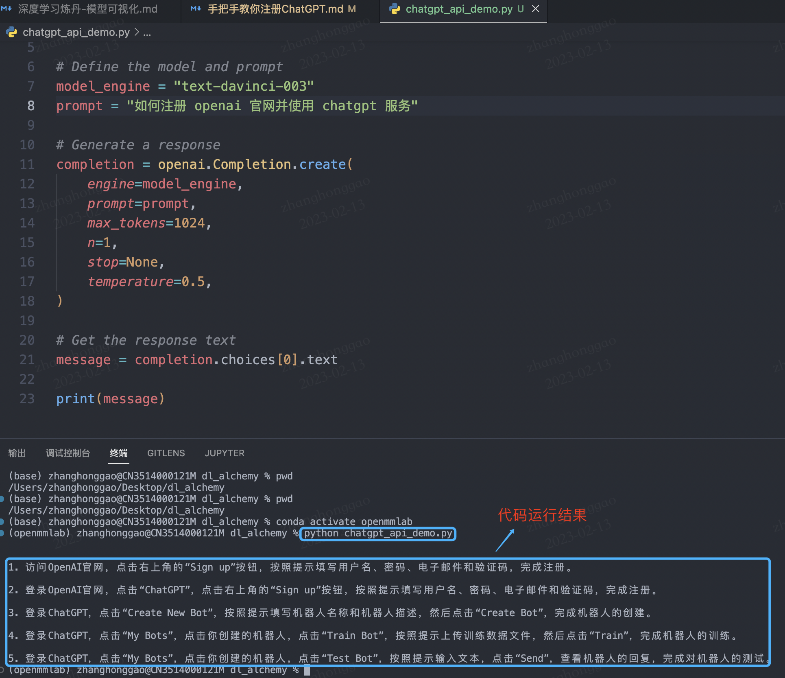

