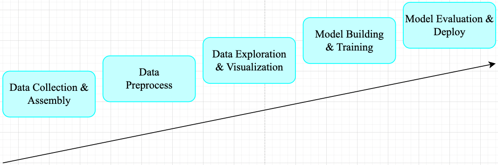
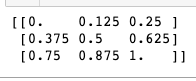
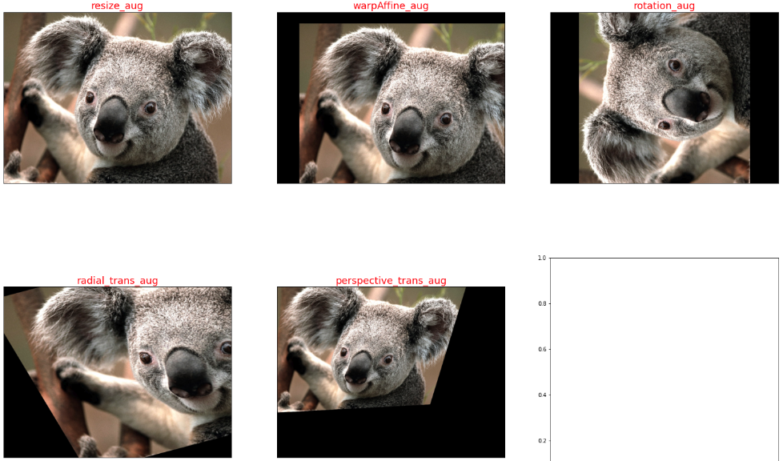
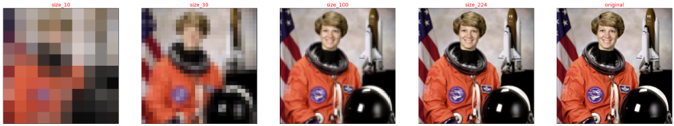
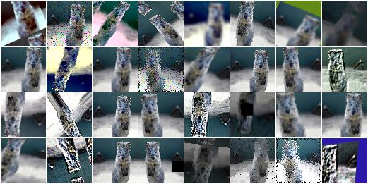

- [前言](#前言)
- [一，Normalization 概述](#一normalization-概述)
  - [1.1，Normalization 定义](#11normalization-定义)
  - [1.2，什么情况需要 Normalization](#12什么情况需要-normalization)
  - [1.3，Data Normalization 方法](#13data-normalization-方法)
  - [1.4，示例代码](#14示例代码)
- [二，normalize images](#二normalize-images)
  - [2.1，图像 normalization 定义](#21图像-normalization-定义)
  - [2.2，图像 normalization 的好处](#22图像-normalization-的好处)
  - [2.3，PyTorch 实践图像 normalization](#23pytorch-实践图像-normalization)
- [三，数据增强(扩增)](#三数据增强扩增)
  - [3.1，opencv 图像处理](#31opencv-图像处理)
    - [图像的几何变换](#图像的几何变换)
  - [3.2，pytorch 图像增强](#32pytorch-图像增强)
  - [3.3，imgaug 图像增强](#33imgaug-图像增强)
- [参考资料](#参考资料)

## 前言

一般机器学习任务其工作流程可总结为如下 `pipeline`。



在工业界，**数据预处理**步骤对模型精度的提高的发挥着重要作用。对于机器学习任务来说，广泛的数据预处理一般有四个阶段（**视觉任务一般只需 `Data Transformation`**）: 数据清洗(Data Cleaning)、数据整合(Data Integration)、数据转换(Data Transformation)和数据缩减(Data Reduction)。


1，`Data Cleaning` 数据清理是数据预处理步骤的一部分，通过填充缺失值、平滑噪声数据、解决不一致和删除​​异常值来清理数据。
2，`Data Integration` 用于将存在于多个源中的数据合并到一个更大的数据存储中，如数据仓库。例如，将来自多个医疗节点的图像整合起来，形成一个更大的数据库。
3，在完成 `Data Cleaning` 后，我们需要通过使用下述数据转换策略更改数据的值、结构或格式。
- `Generalization`: 使用概念层次结构将低级或粒度数据转换为高级信息。例如将城市等地址中的原始数据转化为国家等更高层次的信息。
- `Normalization`: 目的是将数字属性按比例放大或缩小以适合指定范围。`Normalization` 常见方法:
  - Min-max normalization
  - Z-Score normalization
  - Decimal scaling normalization

4，`Data Reduction` 数据仓库中数据集的大小可能太大而无法通过数据分析和数据挖掘算法进行处理。一种可能的解决方案是获得数据集的缩减表示，该数据集的体积要小得多，但会产生相同质量的分析结果。常见的数据缩减策略如下:
- `Data cube aggregation`
- `Dimensionality reduction`: **降维技术用于执行特征提取**。数据集的维度是指数据的属性或个体特征。该技术旨在减少我们在机器学习算法中考虑的冗余特征的数量。降维可以使用主成分分析（`PCA`）等技术来完成。
- `Data compression`: 通过使用编码技术，数据的大小可以显着减小。
- `Discretization`: 数据离散化用于**将具有连续性的属性划分为具有区间的数据**。这样做是因为连续特征往往与目标变量相关的可能性较小。例如，属性年龄可以离散化为 18 岁以下、18-44 岁、44-60 岁、60 岁以上等区间。

对于计算机视觉任务来说，在训练 `CNN` 模型之前，对于输入数据特征做归一化（`normalization`）预处理（`data preprocessing`）操作是最常见的步骤。


## 一，Normalization 概述

> 这里没有翻译成中文，是因为目前中文翻译有些歧义，根据我查阅的博客资料，翻译为“归一化”比较多，仅供可参考。

### 1.1，Normalization 定义

`Normalization` 操作被用于对数据属性进行缩放，使其落在较小的范围之内（即变化到某个固定区间中），比如 [-1,1] 和 [0, 1]，简单理解就是**特征缩放**过程。很多机器学习算法都受益于 `Normalization` 操作，比如:

- 通常对分类算法有用。
- 在梯度下降等机器学习算法的核心中使用的优化算法很有用。
- 对于加权输入的算法（如回归和神经网络）以及使用距离度量的算法（如 K 最近邻）也很有用。

### 1.2，什么情况需要 Normalization

当我们处理的**数据具有不同尺度（范围）**（`different scale`）时，通常就需要进行 `normalization` 操作了，它可能会导致一个重要属性（在较低尺度上）的有效性被稀释，因为其他属性具有更大范围（尺度）的值，简单点理解就是范围（`scale`）大点属性在模型当中更具优先级，具体示例如下图所示。


总而言之，就是当数据存在多个属性但其值具有不同尺度（`scale`）时，这可能会导致我们在做数据挖掘操作时数据模型表现不佳，因此执行 `normalization` 操作将所有属性置于相同的尺寸内是很有必要的。

### 1.3，Data Normalization 方法

1，`z-Score Normalization`

zero-mean Normalization，有时也称为 standardization，将数据特征缩放成均值为 0，方差为 1 的分布，对应公式: 

$$
{x}' = \frac{x-mean(x)}{\sigma}
$$

其中 $mean(x)$（有些地方用 $\mu =\frac{1}{N}\sum_{i=1}^{N} x_i$） 表示变量 $x$ 的均值，$\sigma = \sqrt{\frac{1}{N} \sum_{i=1}^{N}(x_i - \mu)^2}$ 表示变量的标准差，${x}'$ 是数据缩放后的新值。

2，`Min-Max Normalization`

执行线性操作，将数据范围缩放到 $[0，1]$ 区间内，对应公式: 

$$
{x}' = \frac{x - min(x)}{max(x) - min(x)}
$$

其中 $max(x)$ 是变量最大值，$min(x)$ 是变量最小值。

### 1.4，示例代码

1，以下是使用 Python 和 Numpy 库实现 `Min-Max Normalization` 的示例代码：

```python
# 导入必要的库
import numpy as np
# 定义数据集
X = np.array([[1, 2, 3], [4, 5, 6], [7, 8, 9]])
# 计算数据集的最小值和最大值
Xmin = X.min()
Xmax = X.max()
# 计算最小-最大规范化
X_norm = (X - Xmin) / (Xmax - Xmin)
# 打印结果
print(X_norm)
```

程序输出结果如下，可以看出原始数组数据都被缩放到 $[0, 1]$ 范围内了。



## 二，normalize images

### 2.1，图像 normalization 定义

当我们使用卷积神经网络解决计算机视觉任务时，一般需要对输入图像数据做 `normalization` 来完成预处理工作，常见的图像 `normalization` 方法有两种: `min-max normalization` 和 `zero-mean normalization`。

1，以单张图像的 `zero-mean Normalization` 为例，它使得图像的均值和标准差分别变为 `0.0` 和 `1.0`。因为是多维数据，与纯表格数据不同，它**首先需要从每个输入通道中减去通道平均值，然后将结果除以通道标准差**。因此可定义两种 normalization 形式如下所示:

```shell
# min-max Normalization
output[channel] = (input[channel] - min[channel]) / (max[channel] - min[channel])
# zero-mean Normalization
output[channel] = (input[channel] - mean[channel]) / std[channel]
```

### 2.2，图像 normalization 的好处

图像 `normalization` 有助于使数据处于一定范围内并**减少偏度**（`skewness`），从而**有助于模型更快更好地学习**。归一化还可以解决梯度递减和爆炸的问题。

### 2.3，PyTorch 实践图像 normalization

在 `Pytorch` 框架中，图像变换（image transformation）是指**将图像像素的原始值改变为新值的过程**。其中常见的 `transformation` 操作是使用 torchvision.transforms.ToTensor() 方法将图像变换为 Pytorch 张量（`tensor`），它实现了将像素范围为 [0, 255] 的 `PIL` 图像转换为形状为（C,H,W）且范围为 [0.0, 1.0] 的 Pytorch FloatTensor。另外，torchvision.transforms.normalize() 方法实现了逐 channel 的对图像进行标准化（均值变为 0，标准差变为 1）。总结如下: 

- `min-max Normalization`: 对应 `torchvision.transforms.ToTensor()` 方法
- `zero-mean Normalization`: 对应 `torchvision.transforms.Normalize()` 方法，利用用均值和标准差对张量图像进行 zero-mean Normalization。

`ToTensor()` 函数的语法如下:
```shell
"""
Convert a ``PIL Image`` or ``numpy.ndarray`` to tensor.
Converts a PIL Image or numpy.ndarray (H x W x C) in the range
[0, 255] to a torch.FloatTensor of shape (C x H x W) in the range [0.0, 1.0].

Args:
    pic (PIL Image or numpy.ndarray): Image to be converted to tensor.
Returns:
    Tensor: Converted image.
"""
```

`Normalize()` 函数的语法如下:

```shell
Syntax: torchvision.transforms.Normalize()

Parameter:
    * mean: Sequence of means for each channel.
    * std: Sequence of standard deviations for each channel.
    * inplace: Bool to make this operation in-place.
Returns: Normalized Tensor image.
```

在 PyTorch 中对图像执行 `zero-mean Normalization` 的步骤如下:
1. 加载原图像；
2. 使用 ToTensor() 函数将图像转换为 Tensors；
3. 计算 Tensors 的均值和方差；
4. 使用 Normalize() 函数执行 `zero-mean Normalization` 操作。

下面给出利用 PyTorch 实践 `Normalization` 操作的详细代码和输出图。
```python
# import necessary libraries
from PIL import Image
import matplotlib.pyplot as plt
import numpy as np
import torchvision.transforms as transforms
import matplotlib.pyplot as plt

def show_images(imgs, num_rows, num_cols, titles=None, scale=8.5):
    """Plot a list of images.

    Defined in :numref:`sec_utils`"""
    figsize = (num_cols * scale, num_rows * scale)
    _, axes = plt.subplots(num_rows, num_cols, figsize=figsize)
    axes = axes.flatten()
    for i, (ax, img) in enumerate(zip(axes, imgs)):
        try:
            img = np.array(img)
        except:
            pass
        ax.imshow(img)
        ax.axes.get_xaxis().set_visible(False)
        ax.axes.get_yaxis().set_visible(False)
        if titles:
            ax.set_title(titles[i])
    return axes

def normalize_image(image_path):
    img = Image.open(img_path) # load the image
    # 1, use ToTensor function
    transform = transforms.Compose([
        transforms.ToTensor()
    ])
    img_tensor = transform(img) # transform the pIL image to tensor
    # 2, calculate mean and std by tensor's attributes
    mean, std = img_tensor.mean([1,2]), img_tensor.std([1,2])
    # 3, use Normalize function
    transform_norm = transforms.Compose([
        transforms.ToTensor(),
        transforms.Normalize(mean, std)
    ])
    img_normalized = transform_norm(img) # get normalized image

    img_np = np.array(img) # convert PIL image to numpy array
    # print array‘s shape mean and std
    print(img_np.shape) # (height, width, channel), (768, 1024, 3)
    print("mean and std before normalize:")
    print("Mean of the image:", mean)
    print("Std of the image:", std)
    return img_np, img_tensor, img_normalized

def convert_tensor_np(tensor):
    img_arr = np.array(tensor)
    img_tr = img_arr.transpose(1, 2, 0)
    return img_tr

if __name__ == '__main__': 
    img_path = 'Koalainputimage.jpeg'
    img_np, img_tensor, img_normalized = normalize_image(img_path)
    # transpose tensor to numpy array and shape of (3,,) to shape of (,,3)
    img_normalized1 = convert_tensor_np(img_tensor)
    img_normalized2 = convert_tensor_np(img_normalized)
    show_images([img_np, img_normalized1, img_normalized2], 1, 3, titles=["orignal","min-max normalization", "zero-mean normalization"])
```

1，程序输出和两种 normalization **操作效果可视化**对比图如下所示:


2，原图和两种 normalization 操作后的图像**像素值分布可视化**对比图如下所示:


像素值分布可视化用的代码如下。

```python
# plot the pixel values
plt.hist(img_np.ravel(), bins=50, density=True)
plt.xlabel("pixel values")
plt.ylabel("relative frequency")
plt.title("distribution of pixels")
```

## 三，数据增强(扩增)

数据增强的目的是为了扩充数据和提升模型的泛化能力。有效的数据扩充不仅能扩充训练样本数量，还能增加训练样本的多样性，一方面可避免过拟合，另一方面又会带来模型性能的提升。

在机器学习管道（`pipeline`）框架中，我们需要在送入模型之前，进行数据增强，一般有两种处理方式:
- **线下增强**（offline augmentation）: 适用于较小的数据集（smaller dataset）。
- **线上增强**（online augmentation）: 适用于较大的数据集（larger datasets）。

数据扩增几种常用方法有: **图像水平/竖直翻转、随机抠取、尺度变换和旋转**。其中尺度变换（`scaling`）、旋转（`rotating`）等方法用来增加卷积卷积神经网络对物体尺度和方向上的鲁棒性。

在此基础上，对原图或已变换的图像(或图像块)进行色彩抖动(`color jittering`)也是一种常用的数据扩充手段，即改变图像颜色的四个方面:亮度、对比度、饱和度和色调。色彩抖动是在 `RGB` 颜色空间对原有 `RGB` 色彩分布进行轻微的扰动，也可在 `HSV` 颜色空间尝试随机改变图像原有 的饱和度和明度(即，改变 `S` 和 `V` 通道的值)或对色调进行微调(小范围改变 该通道的值)。
> HSV 表达彩色图像的方式由三个部分组成：
Hue（色调、色相）
Saturation（饱和度、色彩纯净度）
Value（明度）

### 3.1，opencv 图像处理

#### 图像的几何变换

OpenCV 提供的几何变换函数如下所示:

1，**拓展缩放:** 拓展缩放，改变图像的尺寸大小

`cv2.resize()`: 。常用的参数有设定图像尺寸、缩放因子和插值方法。

2，**平移:** 将对象换一个位置。

`cv2.warpAffine()`: 函数第一个参数是原图像，第二个参数是移动矩阵，第三个参数是输出图像大小 (width,height)。举例，如果要沿 $(x，y)$ 方向移动，移动的距离是 $(tx ，ty)$，则以下面的方式构建移动矩阵:
$$
\begin{bmatrix}
1 & 0 & t_x\\ 
0 & 1 & t_y
\end{bmatrix}
$$

3，**旋转:** 对一个图像旋转角度 $\theta$。

先使用 `cv2.getRotationMatrix2D` 函数构建旋转矩阵 $M$，再使用 `cv2.warpAffine()` 函数将对象移动位置。

`getRotationMatrix2D` 函数第一个参数为旋转中心，第二个为旋转角度，第三个为旋转后的缩放因子

4，**放射变换（也叫平面变换/径向变换）:** 在仿射变换中，原图中所有的平行线在结果图像中依旧平行。

为了找到变换矩阵，我们需要从输入图像中得到三个点，以及它们在输出图像中的对应位置。然后使用 cv2. `getAffineTransform` 先构建一个 2x3 变换矩阵，最后该矩阵将传递给 cv2.warpAffine 函数。

5，**透视变换（也叫空间变换）:** 转换之后，直线仍是直线。
> 原理: 透视变换（Perspective Transformation)是指利用透视中心、像点、目标点三点共线的条件，按透视旋转定律使承影面（透视面）绕迹线（透视轴）旋转某一角度，破坏原有的投影光线束，仍能保持承影面上投影几何图形不变的变换。-来源百度百科。

对于透视变换，需要先构建一个 3x3 **变换矩阵**。要找到此变换矩阵，需要在输入图像上找 4 个点，以及它们在输出图像中的对应位置。在这 4 个点中，其中任意 3 个不共线。然后可以通过函数 `cv2.getPerspectiveTransform` 找到变换矩阵，将 `cv2.warpPerspective` 应用于此 3x3 变换矩阵。

图像几何变换的**实例代码**如下:

```python
import cv2
import matplotlib.pyplot as plt
from PIL import Image
import numpy as np

# Some Geometric Transformation of Images
class GeometricTransAug(object):
    def __init__(self, image_path):
        img = Image.open(image_path) # load the image
        self.img_np = np.array(img) # convert PIL image to numpy array
        self.rows, self.cols, self.ch = self.img_np.shape
        self.geometry_trans_aug_visual(self.img_np)
        
    def resize_aug(self, img_np):
        # 直接设置了缩放因子, 缩放原大小的2倍
        res = cv2.resize(img_np, None, fx=2, fy=2, interpolation = cv2.INTER_CUBIC)
        return res
    
    def warpAffine_aug(self, img_np):
        # 先构建转换矩阵, 将图像像素点整体进行(100,50)位移：
        M = np.float32([[1,0,100],[0,1,50]]) 
        res = cv2.warpAffine(img_np, M,(self.cols, self.rows))
        return res
    
    def rotation_aug(self, img_np):
        rows, cols, ch = img_np.shape
        # 先构建转换矩阵,图像相对于中心旋转90度而不进行任何缩放。
        M = cv2.getRotationMatrix2D((self.cols/2, self.rows/2), 90, 1) 
        res = cv2.warpAffine(img_np, M, (self.cols, self.rows))
        return res
    
    def radial_trans_aug(self, img_np):
        # 仿射变换需要从原图像中找到三个点以及他们在输出图像中的位置
        pts1 = np.float32([[50,50],[200,50],[50,200]])
        pts2 = np.float32([[10,100],[200,50],[100,250]])
        # 通过 getAffineTransform 创建一个 2x3 的转换矩阵
        M = cv2.getAffineTransform(pts1,pts2)

        res = cv2.warpAffine(img_np, M, dsize = (self.cols, self.rows))
        return res
    
    def perspective_trans_aug(self, img_np):
        # 透视变换需要一个 3x3 变换矩阵
        pts1 = np.float32([[56,65],[368,52],[28,387],[389,390]])
        pts2 = np.float32([[0,0],[300,0],[0,300],[300,300]])

        M = cv2.getPerspectiveTransform(pts1,pts2)
        # dsize: size of the output image.
        res = cv2.warpPerspective(img_np, M, dsize = (300,300))
        
        return res
    
    def geometry_trans_aug_visual(self, img_np):
        res1 = self.resize_aug(img_np)
        res2 = self.warpAffine_aug(img_np)
        res3 = self.rotation_aug(img_np)
        res4 = self.radial_trans_aug(img_np)
        res5 = self.perspective_trans_aug(img_np)
        imgs = [res1, res2, res3, res4, res5]
        aug_titles = ["resize_aug", "warpAffine_aug", "rotation_aug", "radial_trans_aug", "perspective_trans_aug"]
        # show_images 函数前文已经给出，这里不再复制过来
        axes = show_images(imgs, 2, 3, titles=aug_titles, scale=8.5)
            
if __name__ == '__main__': 
    img_path = 'Koalainputimage.jpeg'
    geometry_trans_aug = GeometricTransAug(img_path)
    img_np2 = geometry_trans_aug.img_np
    print(img_np2.shape)
```

程序运行后输出的**几何变换**增强效果如下所示:



### 3.2，pytorch 图像增强

在 `pytorch` 框架中，`transforms` 类提供了 `22` 个数据增强方法，对应代码在 transforms.py 文件中，它们既可以对 `PIL Image` 也能对 `torch.*Tensor` 数据类型进行增强。

`api` 的详细介绍可以参考官网文档-[Transforming and augmenting images](https://pytorch.org/vision/stable/transforms.html)。本章只对 transforms 的 `22` 个方法进行简要介绍和总结。

总的来说 transforms.py 中的各个预处理方法可以归纳为**四大类:**

1，**裁剪**-Crop

- 中心裁剪: transforms.CenterCrop 
- 随机裁剪: transforms.RandomCrop 
- 随机长宽比裁剪: transforms.RandomResizedCrop 
- 上下左右中心裁剪: transforms.FiveCrop 
- 上下左右中心裁剪后翻转: transforms.TenCrop

2，**翻转和变换**-Flip and Rotations

- 依概率 p 水平翻转:transforms.RandomHorizontalFlip(p=0.5)
- 依概率 p 垂直翻转:transforms.RandomVerticalFlip(p=0.5) 
- 随机旋转:transforms.RandomRotation

3，**图像变换**

- resize: transforms.Resize
- `min-max Normalization`: 对应 `torchvision.transforms.ToTensor()` 方法
- `zero-mean Normalization`: 对应 `torchvision.transforms.Normalize()` 方法
- 填充: transforms.Pad 
- 修改亮度、对比度和饱和度:transforms.ColorJitter 
- 转灰度图: transforms.Grayscale 
- 线性变换: transforms.LinearTransformation() 
- 仿射变换: transforms.RandomAffine
- 依概率 `p` 转为灰度图: transforms.RandomGrayscale 
- 将数据转换为 `PILImage`: transforms.ToPILImage 
- transforms.Lambda: Apply a user-defined lambda as a transform.

4，对 transforms 操作，使数据增强更灵活

- `transforms.RandomChoice(transforms)`: 从给定的一系列 transforms 中选一个进行操作 
- `transforms.RandomApply(transforms, p=0.5)`: 给一个 transform 加上概率，依概率进行操作
- `transforms.RandomOrder`: 将 transforms 中的操作随机打乱

这里 `resize` 图像增强方法为例，可视化其调整输入图像大小的效果。

```python
# 为了节省空间，这里不再列出导入相应库的代码和show_images函数
img_PIL = Image.open('astronaut.jpeg')
print(img_PIL.size)
# if you change the seed, make sure that the randomly-applied transforms
# properly show that the image can be both transformed and *not* transformed!
torch.manual_seed(0)
# size 参数: desired output size.
resized_imgs = [transforms.Resize(size=size)(orig_img) for size in (30, 50, 100, orig_img.size)]
show_images(resized_imgs, 1, 4)
```

程序运行后的输出图如下。




### 3.3，imgaug 图像增强

imgaug 是一个用于机器学习实验中图像增强的库。 它支持广泛的增强技术，允许轻松组合这些技术并以随机顺序或在多个 CPU 内核上执行它们，具有简单而强大的随机接口，不仅可以增强图像，还可以增强关键点/地标、边界框、 热图和分割图。

单个输入图像的示例增强如下所示。



imgaug 的图像增强方法如下所示。

- Basics
- Keypoints
- Bounding Boxes
- Heatmaps
- Segmentation Maps and Masks
- Stochastic Parameters: 随机参数
- Blending/Overlaying images: 混合/叠加图像
- Augmenters: 增强器概述

各个方法的使用请参考 [imaug 官网](https://imgaug.readthedocs.io/en/latest/source/installation.html)。
## 参考资料

- [A Simple Guide to Data Preprocessing in Machine Learning](https://www.v7labs.com/blog/data-preprocessing-guide)
- [How to normalize images in PyTorch ?](https://www.geeksforgeeks.org/how-to-normalize-images-in-pytorch/)
- [Data Normalization in Data Mining](https://www.geeksforgeeks.org/data-normalization-in-data-mining/?ref=rp)
- 《解析卷积神经网络-第5、6章》
- 《OpenCV-Python-Toturial-中文版》
- [scikit-learn-6.3. Preprocessing data](https://scikit-learn.org/stable/modules/preprocessing.html#standardization-or-mean-removal-and-variance-scaling)
- [numpy.ravel](https://numpy.org/doc/stable/reference/generated/numpy.ravel.html)