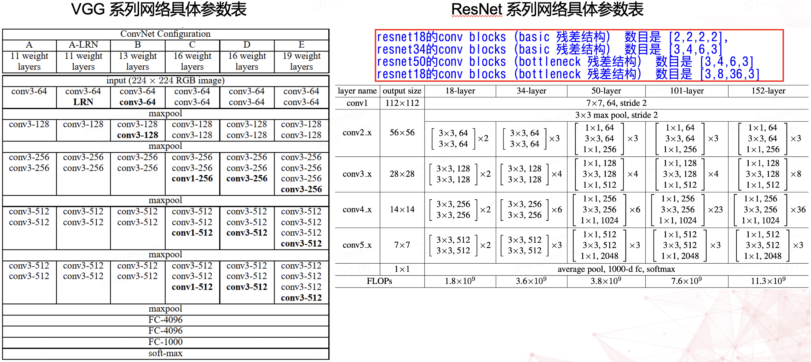
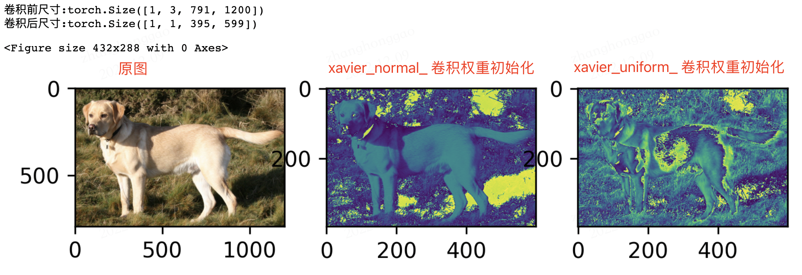
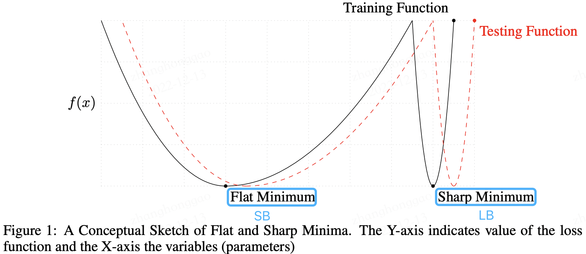
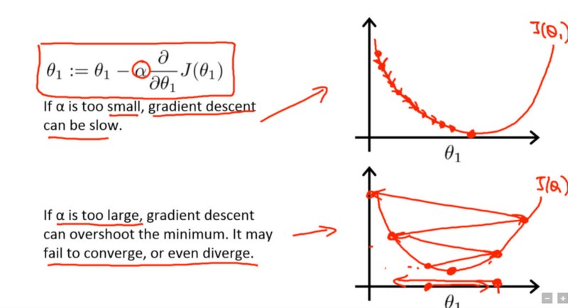
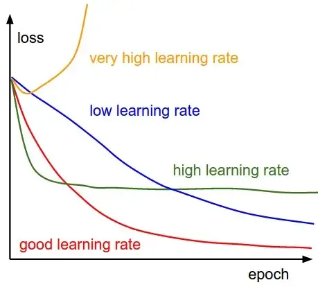
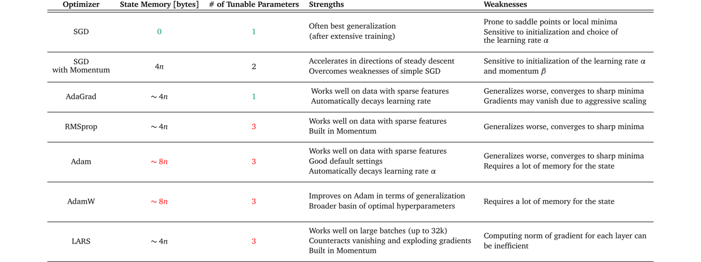

- [前言](#前言)
- [一，网络层内在参数](#一网络层内在参数)
  - [1.1，使用 3x3 卷积](#11使用-3x3-卷积)
  - [1.2，使用 cbr 组合](#12使用-cbr-组合)
  - [1.3，尝试不同的权重初始化方法](#13尝试不同的权重初始化方法)
- [二，图片尺寸与数据增强](#二图片尺寸与数据增强)
- [三，batch size 设定](#三batch-size-设定)
  - [3.1，背景知识](#31背景知识)
  - [3.2，batch size 定义](#32batch-size-定义)
  - [3.3，选择合适大小的 batch size](#33选择合适大小的-batch-size)
  - [3.4，学习率和 batch size 关系](#34学习率和-batch-size-关系)
- [四，学习率参数设定](#四学习率参数设定)
  - [4.1，背景知识](#41背景知识)
  - [4.2，什么是学习率](#42什么是学习率)
  - [4.3，如何设置学习率](#43如何设置学习率)
- [五，优化器选择](#五优化器选择)
  - [5.1，优化器定义](#51优化器定义)
  - [5.2，如何选择适合不同ml项目的优化器](#52如何选择适合不同ml项目的优化器)
  - [5.3，PyTorch 中的优化器](#53pytorch-中的优化器)
- [六，模型 finetune](#六模型-finetune)
- [七，模型可视化](#七模型可视化)
- [参考资料](#参考资料)

## 前言

**所谓超参数，即不是通过学习算法本身学习出来的，需要作者手动调整（可优化参数）的参数**(理论上我们也可以设计一个嵌套的学习过程，一个学习算法为另一个学习算法学出最优超参数)，卷积神经网络中常见的超参数有: 优化器学习率、训练 `Epochs` 数、批次大小 `batch_size` 、输入图像尺寸大小。

一般而言，我们将训练数据分成两个不相交的子集，其中一个用于学习参数，另一个作为验证集，用于估计训练中或训练后的泛化误差，用来更新超参数。

- 用于学习参数的数据子集通常仍被称为训练集（不要和整个训练过程用到的更大的数据集搞混）。
- 用于挑选超参数的数据子集被称为验证集(`validation set`)。

通常，`80%` 的训练数据用于训练，`20%` 用于验证。因为验证集是用来 “训练” 超参数的，所以**验证集的误差通常会比训练集误差小**，验证集会低估泛化误差。完成所有超参数优化后，**需要使用测试集估计泛化误差**。

## 一，网络层内在参数

在设计网络架构的时候，我们通常需要事先指定一些网络架构参数，比如:
- **卷积层(`convlution`)参数**: 卷积层通道数、卷积核大小、卷积步长。
- **池化层(`pooling`)参数**: 池化核大小、步长等。
- **权重参数初始化**，常用的初始化方法有 `Xavier`，`kaiming` 系列；或者使用模型 `fintune` 初始化模型权重参数。
- **网络深度**（这里特指卷积神经网络 cnn），即 `layer` 的层数；网络的深度一般决定了网络的表达（抽象）能力，网络越深学习能力越强。
- **网络宽度**，即卷积层通道(`channel`)的数量，也是**滤波器**（3 维）的数量；网络宽度越宽，代表这一层网络能学习到更加丰富的特征。

这些参数一般在设计网络架构时就已经确定下来了，参数的取值一般可以参考经典 `paper` 和一些模型训练的经验总结，比如有以下经验:

- 使用 `3x3` 卷积
- 使用 `cbr` 组合
- 尝试不同的权重初始化方法

### 1.1，使用 3x3 卷积

$3\times 3$ 卷积层是 `cnn` 的主流组件，比如提取图像特征的 `backbone` 网络中，其卷积层的卷积核大小大部分都是 $3\times 3$。比如 vgg 和 resnet 系列网络具体参数表如下所示。



### 1.2，使用 cbr 组合

在 `cnn` 模型中，卷积层（`conv`）一般后接 `bn`、`relu` 层，组成 `cbr` 套件。`BN` 层（batch normalization，简称 `BN`，批规范化层）很重要，是卷积层、激活函数层一样都是 `cnn` 模型的**标配组件**，其不仅**加快了模型收敛速度，而且更重要的是在一定程度缓解了深层网络的一个难题“梯度弥散”，从而使得训练深层网络模型更加容易和稳定**。

另外，模型训练好后，模型推理时的卷积层和其后的 `BN` 层可以等价转换为一个带 `bias` 的卷积层（也就是通常所谓的“吸BN”），其原理参考[深度学习推理时融合BN，轻松获得约5%的提速](https://mp.weixin.qq.com/s/P94ACKuoA0YapBKlrgZl3A)。
> 对于 cv 领域的任务，建议无脑用 `ReLU` 激活函数。

```python
# cbr 组件示例代码
def convbn_relu(in_planes, out_planes, kernel_size, stride, pad, dilation):
    return nn.Sequential(
        nn.Conv2d(in_planes, out_planes, 
                  kernel_size=kernel_size, stride=stride, 
                  padding=dilation if dilation > 1 else pad, 
                  dilation=dilation, bias=False),
        nn.BatchNorm2d(out_planes),
        nn.ReLU(inplace=True)
        )
```

### 1.3，尝试不同的权重初始化方法

尝试不同的卷积核权重初始化方式。目前**常用的权重初始化方法**有 `Xavier` 和 `kaiming` 系列，pytorch 在 `torch.nn.init` 中提供了常用的初始化方法函数，默认是使用 `kaiming ` 均匀分布函数: `nn.init.kaiming_uniform_()`。


下面是一个使用 `kaiming_normal_`（kaiming 正态分布）设置卷积层权重初始化的示例代码。

```python
import torch
import torch.nn as nn

# 定义一个卷积层
conv = nn.Conv2d(in_channels=3, out_channels=16, kernel_size=3, stride=1, padding=1)

# 使用He初始化方式设置卷积层的权重
nn.init.kaiming_normal_(conv.weight, mode="fan_out", nonlinearity="relu")
```

使用不同的卷积层权重初始化方式，会有不同的输出效果。分别使用 `xavier_normal_` 和 `xavier_normal_` 初始化权重，并使一个输入图片经过一层卷积层，其输出效果是不同的，对比图如下所示:



## 二，图片尺寸与数据增强

1，**在显存满足的情况下，一般输入图片尺寸越大，模型精度越高**！

2，送入到模型的**训练数据一定要充分打乱（`shuffle`）**，这样在使用自适应学习率算法的时候，可以避免某些特征集中出现，而导致的有时学习过度、有时学习不足，使得下降方向出现偏差的问题。同时，信息论（information theor）中也曾提到: “从不相似的事件中学习总是比从相似事件中学习更具信息量”。

另外，为了方便做实验对比，建议**设定好随机数种子**! 并且，模型每轮（`epoch`）训练进行前将训练数据集随机打乱（`shuffle`），确保模型不同轮数相同批次“看到”的数据是不同的。

3，**数据增强（图像增强）的策略必须结合具体任务来设计**！数据增强的手段有多种，常见的如下（除了前三种以外，其他的要慎重考虑）:

- 水平 / 竖直翻转
- 90°，180°，270° 旋转
- 翻转 + 旋转(旋转和翻转其实是保证了数据特征的旋转不变性能被模型学习到，卷积层面的方法可以参考论文 `ACNet`)
- 亮度，饱和度，对比度的随机变化
- 随机裁剪（Random Crop）
- 随机缩放（Random Resize）
- 加模糊（Blurring）
- 加高斯噪声（Gaussian Noise）

## 三，batch size 设定
### 3.1，背景知识

深度学习中经常看到 epoch、 iteration 和 batchsize，这三个名字的区别如下：

- `batch size`：批大小。在深度学习中，一般采用 SGD 训练，即每次训练在训练集中取 batch_size 个样本训练；
- `iteration`：1 个 iteration 等于使用 batch_size 个样本训练一次；
- `epoch`：1 个 epoch 等于使用训练集中的全部样本训练一次；

### 3.2，batch size 定义

**`batch` 一般被翻译为批量，设置 `batch size` 的目的让模型在训练过程中每次选择批量的数据来进行处理。`batch size` 的直观理解就是一次训练所选取的样本数**。

`batch size` 的大小会影响模型的收敛速度和优化程度。同时其也直接影响到 `GPU` 内存的使用情况，如果你的 `GPU` 内存（显存）不大，该数值最好设置小一点，否则会出现显存溢出的错误。

### 3.3，选择合适大小的 batch size

`batch size` 是所有超参数中最好调的一个，也是应该最早确定下来的超参数，其设置的原则就是，`batch size` 别太小，也别太大，**取中间合适值为宜**，通常最好是 2 的 n 次方，如 16, 32, 64, 128。在常见的 setting（～100 epochs），batch size 一般不会低于 `16`。
> 设置为  2 的 n 次方的原因：计算机的 gpu 和 cpu 的 memory 都是 2 进制方式存储的，设置 2 的 n 次方可以加快计算速度。

`batch size` 太小和太大的问题:
- `batch size` 太小：每次计算的梯度不稳定，引起训练的震荡比较大，很难收敛。
- `batch size` 太大: 虽然大的 batch size 可以减少训练时间，即收敛得快，但深度学习的**优化**（training loss 降不下去）和**泛化**（generalization gap 很大）都会出问题。（结论来源论文-[Accurate, Large Minibatch SGD:
Training ImageNet in 1 Hour](https://arxiv.org/pdf/1706.02677.pdf)）

有论文指出 `LB`（Large batch size）之所以出现 `Generalization Gap` 问题，是因为 `LB` 训练的时候更容易收敛到 `sharp minima`，而 `SB` （Small batch size）则更容易收敛到 `flat minima`，并且 `LB` 还不容易从这些 `sharp minima` 中出来，另外，作者认为关于 `batch size` 的选择是有一个阈值的，一旦超过这个阈值，模型的质量会退化，网络的准确度大幅下降。



> 参考论文来源 [On Large-Batch Training for Deep Learning: Generalization Gap and Sharp Minima](https://arxiv.org/pdf/1609.04836.pdf)，该论文主要探究了深度学习中一个普遍存在的问题——使用大的batchsize训练网络会导致网络的泛化性能下降（文中称之为Generalization Gap）。

另外:

- 合适的 batch size 范围和训练数据规模、神经网络层数、单元数都没有显著的关系。
- 合适的 batch size 范围主要和收敛速度、随机梯度噪音有关。

> 参考知乎问答-[怎么选取训练神经网络时的Batch size?](https://www.zhihu.com/question/61607442)

### 3.4，学习率和 batch size 关系

`batch size` 和学习率有紧密联系，我们知道深度学习模型多采用批量随机梯度下降算法进行优化，随机梯度下降算法的原理如下:

$$
w_{t+1} = w_{t} - \eta \frac{1}{n} \sum_{x\in\beta} \nabla l(x,w_{t})
$$

$n$ 是批量大小(batchsize)，$\eta$ 是学习率(learning rate)。从随机梯度下降算法（SGD），可知道除了梯度本身，这两个因子直接决定了模型的权重更新，从优化本身来看它们是影响模型性能收敛最重要的参数。

**学习率（`learning rate`）直接影响模型的收敛状态，`batch size` 则影响模型的泛化性能**，两者又是分子分母的直接关系，相互也可影响，因此这一次来详述它们对模型性能的影响。
> 参考来源-[【AI不惑境】学习率和batchsize如何影响模型的性能？](https://zhuanlan.zhihu.com/p/64864995)

## 四，学习率参数设定

### 4.1，背景知识

反向传播指的是计算神经⽹络参数梯度的⽅法。总的来说，反向传播依据微积分中的链式法则，沿着从输出层到输⼊层的顺序，依次计算并存储⽬标函数有关神经⽹络各层的中间变量以及参数的梯度。

前向传播：输入层-->输出层；反向传播：输出层-->输入层。
### 4.2，什么是学习率

现阶段的所有深度神经网络的参数都是由 `BP`（反向传播）算法训练得到的，而 `BP` 算法是**基于梯度下降（`gradient desent`）策略，以目标的负梯度方向对参数进行调整的**，以下公式描述了这种关系。

```shell
new_weight = existing_weight — learning_rate * gradient
```

更细致点，权重参数更新公式如下。

$$\theta_1 := \theta_1  - \alpha \frac{\partial}{\partial \theta_1}J(\theta_1)$$

> 这里套用吴恩达机器学习课程的梯度下降公式，也可参考《机器学习》书中的公式 (5.6)，虽然表达式写法不一样，但其意义是一样的。

式中 $\alpha$ 是**学习率参数**，$\theta$ 是待更新的权重参数。学习率范围为 $\alpha \in (0,1)$ 控制着算法每一轮迭代中更新的步长，很明显可得，**若学习率太大则容易振荡导致不收敛，太小则收敛速度又会过慢（即损失函数的变化速度过慢）**。虽然使用低学习率可以确保我们不会错过任何局部极小值，但也意味着我们将花费更长的时间来进行收敛，特别是在被困在高原区域的情况下。



> 采用小学习速率（顶部）和大学习速率（底部）的梯度下降。图来源：Coursera 上吴恩达（Andrew Ng）的机器学习课程。

因此可以说，**学习速率是指导我们如何通过损失函数的梯度调整网络权重的重要超参数 !**

### 4.3，如何设置学习率

训练 `CNN` 模型的过程中，关于如何设置学习率，有两个原则可以遵守:

1. 模型训练开始时的**初始学习率不宜过大**，`cv` 类模型以 `0.01` 和 `0.001` 为宜；
2. 模型训练过程中，**学习率应随轮数（`epochs`）增加而衰减**。

除以上固定规则的方式之外，**还有些经验可以参考**: 

1. 对于图像分类任务，使用 `finetune` 方式训练模型，训练过程中，冻结层的不需要过多改变参数，因此需要设置较小的学习率，更改过的分类层则需要以较大的步子去收敛，学习率往往要设置大一点。（来源-[pytorch 动态调整学习率](http://spytensor.com/index.php/archives/32/)）
2. 寻找理想学习率或诊断模型训练学习率是否合适时也可借助模型训练曲线(learning curve)的帮助。下图展示了不同大小的学习率下损失函数的变化情况，图来自于 `cs231n`。



以上是理论分析，但在实际应用中，以 `pytorch` 框架为例，`pyTorch` 提供了六种学习率调整方法，可分为三大类，分别是:

1. **有序调整**： 按照一定规律有序进行调整，这一类是最常用的，分别是等间隔下降(`Step`)，
按需设定下降间隔(`MultiStep`)，指数下降(`Exponential`)和 `CosineAnnealing`。这四种方法的调整时机都是人为可控的，也是训练时常用到的。
1. **自适应调整**: 如依据训练状况伺机调整 `ReduceLROnPlateau` 方法。该法通过监测某一指标的变化情况，当该指标不再怎么变化的时候，就是调整学习率的时机，因而属于自适应的调整。
2. **自定义调整**: 自定义调整 `Lambda`。Lambda 方法提供的调整策略**十分灵活**，我们可以为不同的层设定不同的学习率调整方法，这在 fine-tune 中十分有用，我们不仅可为不同的层设定不同的学习率，还可以为其设定不同的学习率调整策略，简直不能更棒了!

常见的学习率调整方法有: 
- `lr_scheduler.StepLR`: 等间隔调整学习率。调整倍数为 `gamma` 倍，调整间隔为 `step_size`。
- `lr_scheduler.MultiStepLR`: 按设定的间隔调整学习率。适合后期使用，通过观察 loss 曲线，手动定制学习率调整时机。
- `lr_scheduler.ExponentialLR`: 按指数衰减调整学习率，调整公式: $lr = lr * gamma^{epoch}$
- `lr_scheduler.CosineAnnealingLR`: 以余弦函数为周期，并在每个周期最大值时重新设置学习率。
- `lr_scheduler.ReduceLROnPlateau`: 当某指标不再变化(下降或升高)，调整学习率（非常实用的策略）。
- `lr_scheduler.LambdaLR`: 为不同参数组设定不同学习率调整策略。

学习率调整方法类的详细参数及类方法定义，请参考 pytorch 官方库文档-[torch.optim](https://pytorch.org/docs/stable/optim.html#torch.optim.Optimizer)。

注意，`PyTorch 1.1.0` 之后版本，学习率调整策略的设定必须放在优化器设定的后面! 构建一个优化器，首先需要为它指定一个待优化的参数的可迭代对象，然后设置特定于优化器的选项，比如学习率、权重衰减策略等。
> 在 PyTorch 1.1.0 之前，学习率调度器应该在优化器更新之前被调用；1.1.0 以打破 BC 的方式改变了这种行为。 如果在优化器更新（调用 optimizer.step()）之前使用学习率调度器（调用 scheduler.step()），后果是将跳过学习率调度的第一个值。

使用指数级衰减的学习率调整策略的模板代码如下。

```python
import torchvision.models as models
import torch.optim as optim
model = models.resnet50(pretrained=False)

optimizer = optim.SGD(model.parameters(), lr=0.01, momentum=0.9) # 构建优化器，lr 是初始学习率
scheduler = optim.lr_scheduler.ExponentialLR(optimizer, gamma=0.9) # 设定学习率调整策略

for epoch in range(20):
    for input, target in dataset:
        optimizer.zero_grad()
        output = model(input)
        loss = loss_fn(output, target)
        loss.backward()
        optimizer.step()
    scheduler.step()
    print_lr(is_verbose=true) # pytorch 新版本可用，1.4及以下版本不可用
```
## 五，优化器选择

### 5.1，优化器定义

优化器（优化算法）优化的是神经元参数的取值 $(w、b)$。优化过程如下：假设 $\theta$ 表示神经网络中的参数，$J(\theta)$ 表示在给定的参数取值下，训练数据集上损失函数的大小（包括正则化项），则优化过程即为寻找某一参数 $\theta$，使得损失函数 $J(\theta)$ 最小。

在完成数据预处理、数据增强，模型构建和损失函数确定之后，深度学习任务的数学模型也就确定下来了，接下来自然就是选择一个合适的优化器(`Optimizer`)对该深度学习模型进行优化（优化器选择好后，选择合适的学习率调整策略也很重要）。

### 5.2，如何选择适合不同ml项目的优化器

选择优化器的问题在于**没有一个可以解决所有问题的单一优化器**。实际上，优化器的性能高度依赖于设置。所以，优化器选择的本质其实是: **哪种优化器最适合自身项目的特点？**

深度卷积神经网络通常采用随机梯度下降类型的优化算法进行模型训练和参数求解。最为常用且经典的优化器算法是 （基于动量的）随机梯度下降法 `SGD（stochastic gradient descent）` 和 `Adam` 法，其他常见的优化器算法有 `Nesterov` 型动量随机下降法、`Adagrad` 法、`Adadelta` 法、`RMSProp` 法。

优化器的选择虽然没有通用的准则，但是也还是有些经验可以总结的:

- `SGD` 是最常见的神经网络优化方法，收敛效果较稳定，但是收敛速度过慢。
- `Adam` 等自适应学习率算法对于稀疏数据具有优势，且且收敛速度很快，但是收敛效果不稳定（容易跳过全局最优解）。

下表 1 概述了几种优化器的优缺点，通过下表可以尝试找到与数据集特征、训练设置和项目目标相匹配的优化器。

某些优化器在具有稀疏特征的数据上表现出色，而其他优化器在将模型应用于以前未见过的数据时可能表现更好。一些优化器在大批量（`batch_size` 设置较大）下工作得很好，而而另一些优化器会在泛化不佳的情况下收敛到极小的最小值。



> 表格来源 [Which Optimizer should I use for my ML Project?](https://www.lightly.ai/post/which-optimizer-should-i-use-for-my-machine-learning-project)

网络上有种 `tricks` 是将 `SGD` 和 `Adam` 组合使用，先用 `Adam` 快速下降，再用 `SGD` 调优。但是这种策略也面临两个问题: 什么时候切换优化器和切换后的 SGD 优化器使用什么样的学习率？论文 `SWATS` [Improving Generalization Performance by Switching from Adam to SGD](https://arxiv.org/abs/1712.07628)给出了答案，感兴趣的读者可以深入阅读下 `paper`。

### 5.3，PyTorch 中的优化器

以 `Pytorch` 框架为例，PyTorch 中所有的优化器(如: optim.Adadelta、optim.SGD、optim.RMSprop 等)均是 `Optimizer` 的子类，Optimizer 中也定义了一些常用的方法:

- `zero_grad()`: 将梯度清零。
- `step(closure)`: 执行一步权值更新, 其中可传入参数 closure(一个闭包)。
- `state_dict()`: 获取模型当前的参数，以一个有序字典形式返回，key 是各层参数名，value 就是参数。
- `load_state_dict(state_dict)`: 将 state_dict 中的参数加载到当前网络，常用于模型 `finetune`。
- `add_param_group(param_group)`: 给 optimizer 管理的参数组中增加一组参数，可为该组参数定制 lr, momentum, weight_decay 等，在 finetune 中常用。

优化器设置和使用的模板代码如下:

```python
# optimizer = optim.SGD(model.parameters(), lr=0.01, momentum=0.9)
# 指定每一层的学习率
optim.SGD([
            {'params': model.base.parameters()},
            {'params': model.classifier.parameters(), 'lr': 1e-3}
          ], lr=1e-2, momentum=0.9
        )
for input, target in dataset:
    optimizer.zero_grad()
    output = model(input)
    loss = loss_fn(output, target)
    loss.backward()
    optimizer.step()
```

优化器的算法原理可以参考花书第八章内容，`Pytorch` 框架优化器类的详细参数及类方法定义，请参考 pytorch 官方库文档-[torch.optim](https://pytorch.org/docs/stable/optim.html#torch.optim.Optimizer)。

## 六，模型 finetune

一般情况下，我们在做深度学习任务时，`backbone` 一般会用 `imagenet` 的预训练模型的权值参数作为我们自定义模型的初始化参数，这个过程称为 `finetune`，更广泛的称之为迁移学习。fintune 的本质其实就是，让我们**有一个较好的权重初始化值**。模型 `finetune` 一般步骤如下:
- 获取预训练模型的权重（如  `imagenet` ）；
- 使用预训练模型权重初始化我们的模型，即加载预训练模型权重参数。

模型 `finetune` 一般有两种情况:

1. 直接使用 `imagenet` 的 `resnet50` 预训练模型权重当作特征提取器，只改变模型最后的全连接层。代码示例如下:

```python
import torch
import torchvision.models as models

model = models.resnet50(pretrained=True)

#遍历每一个参数，将其设置为不更新参数，即冻结模型所有参数
for param in model.parameters():
    param.requires_grad = False

# 只替换最后的全连接层， 改为训练10类，全连接层requires_grad为True
model.fc = nn.Linear(2048, 10)

print(model.fc) # 这里打印下全连接层的信息
# 输出结果: Linear(in_features=2048, out_features=10, bias=True)
```

2. 使用自定义模型结构，保存某次训练好后比较好的权重用于后续训练 `finetune`，可节省模型训练时间，示例代码如下:

```python
import torch
import torchvision.models as models

# 1，保存模型权重参数值
# 假设已经创建了一个 net = Net()，并且经过训练，通过以下方式保存模型权重值
torch.save(net.state_dict(), 'net_params.pth')
# 2，加载模型权重文件
# load(): Loads an object saved with :func:`torch.save` from a file
pretrained_dict = torch.load('net_params.pth')
# 3，初始化模型
net = Net() # 创建 net
net_state_dict = net.state_dict() # 获取已创建 net 的 state_dict
# (可选)将 pretrained_dict 里不属于 net_state_dict 的键剔除掉:
pretrained_dict_new = {k: v for k, v in pretrained_dict.items() if k in net_state_dict}
# 用预训练模型的参数字典 对 新模型的参数字典 net_state_dict 进行更新
net_state_dict.update(pretrained_dict_new)
# 加载需要的预训练模型参数字典
net.load_state_dict(net_state_dict)
```

更进一步的模型 `finetune`，可以为不同网络层设置不同的学习率，请参考《PyTorch_tutorial_0.0.5_余霆嵩》第二章。
> 模型 `finetune` 是属于迁移学习技术的一种。

## 七，模型可视化

- 可视化权重
- 可视化激活
- 可视化数据

## 参考资料

- 《解析卷积神经网络-第 11 章》
- 《PyTorch_tutorial_0.0.5_余霆嵩》
- 知乎问答-[怎么选取训练神经网络时的Batch size?](https://www.zhihu.com/question/61607442)
- [batch size设置技巧](https://blog.51cto.com/u_15485092/5464376)
- [如何选择适合不同ML项目的优化器](https://www.jiqizhixin.com/articles/2021-01-05-9)
- [理解深度学习中的学习率及多种选择策略](https://www.jiqizhixin.com/articles/understanding-learning-rates)
- 《深度学习》第五章-机器学习基础
- [知乎问答-深度学习调参有哪些技巧？](https://www.zhihu.com/question/25097993)
- [pytorch 学习笔记-3.2 卷积层](https://pytorch.zhangxiann.com/3-mo-xing-gou-jian/3.2-juan-ji-ceng#juan-ji-wang-luo-shi-li)